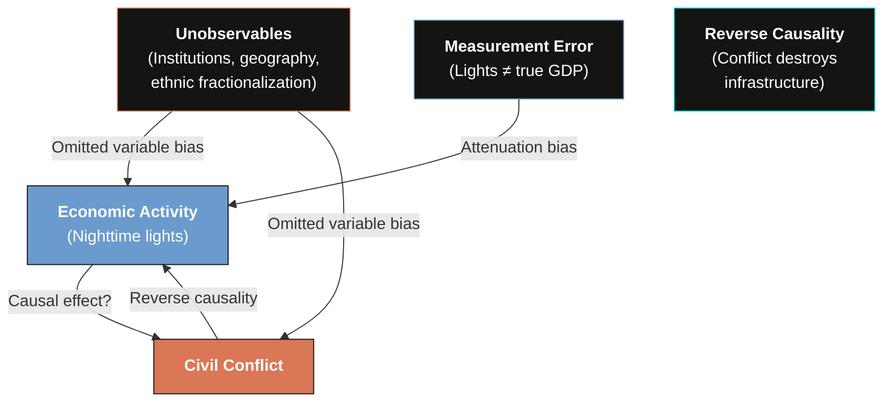
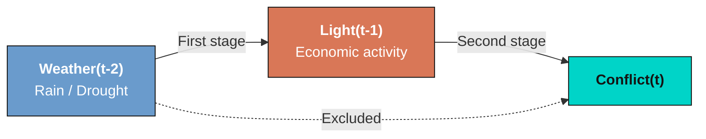
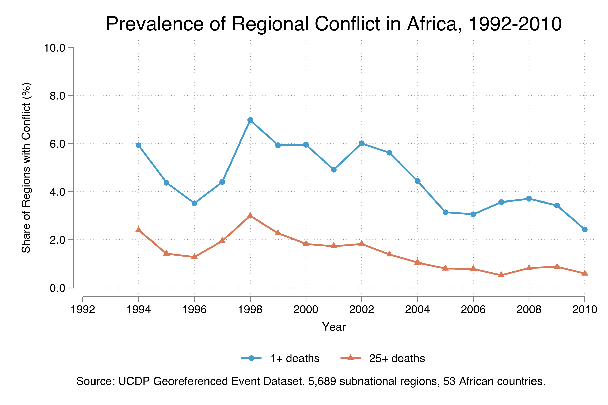
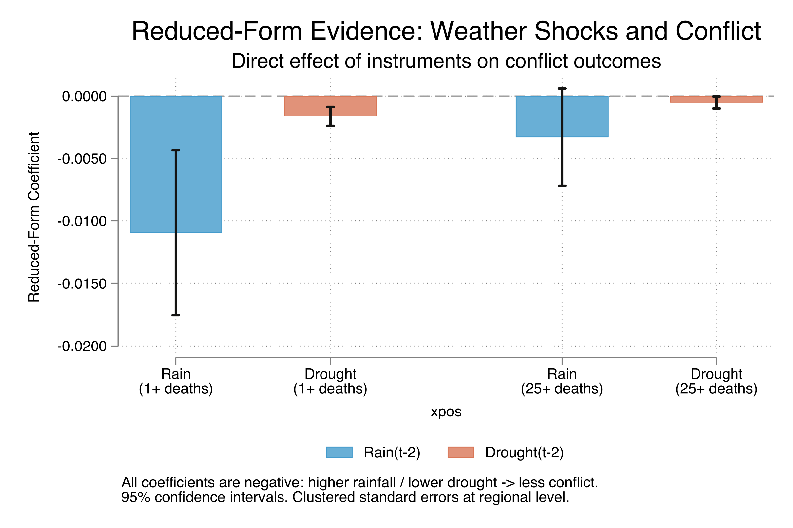
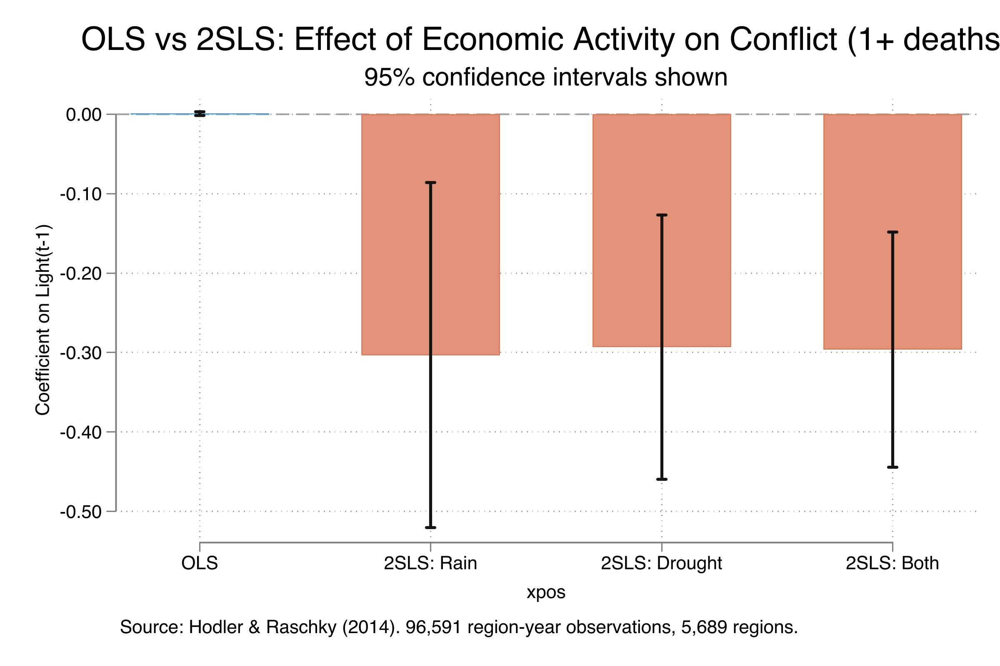
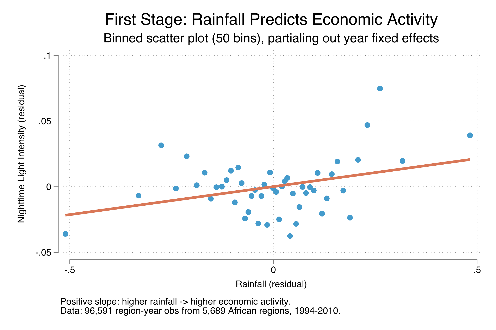
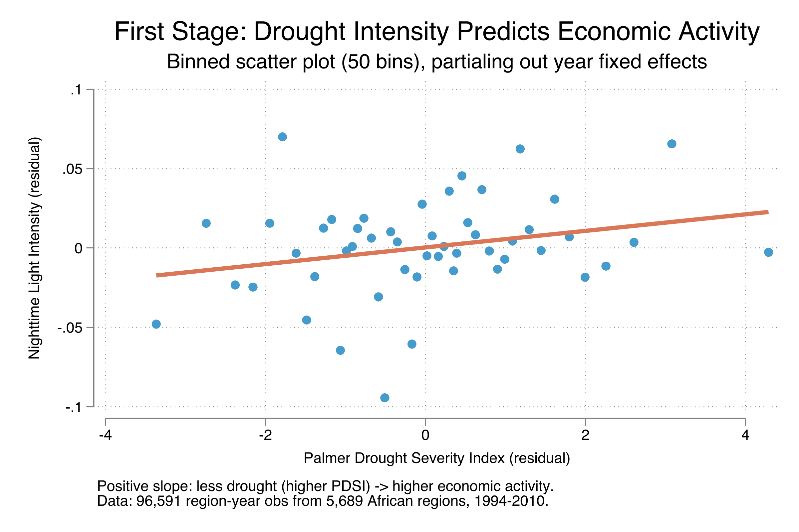

---
authors:
  - admin
categories:
  - Stata
  - Causal Inference
  - Panel Data
  - Instrumental Variables (IV)
draft: false
featured: false
date: "2026-04-26T00:00:00Z"
external_link: ""
image:
  caption: ""
  focal_point: Smart
  placement: 3
links:
- icon: file-code
  icon_pack: fas
  name: "Stata do-file"
  url: analysis.do
- icon: database
  icon_pack: fas
  name: "Dataset (.dta)"
  url: reference/EL_regional_conflict_replication.dta
- icon: file-alt
  icon_pack: fas
  name: "Stata log"
  url: analysis.log
slides:
summary: Replicate Hodler and Raschky (2014) to estimate the causal effect of economic shocks on civil conflict using 2SLS instrumental variables with panel data from 5,689 African regions
tags:
  - stata
  - causal
  - causal inference
  - instrumental variables
  - panel
  - conflict
title: "IV Estimation with Panel Data: Economic Shocks and Civil Conflict"
url_code: ""
url_pdf: ""
url_slides: ""
url_video: ""
toc: true
diagram: true
---

## 1. Overview

Does poverty cause violence? This is one of the most important questions in development economics --- and one of the hardest to answer. The correlation between economic deprivation and civil conflict is well documented, but correlation is not causation. Poor regions may experience more conflict for reasons unrelated to their poverty, or conflict itself may destroy economic activity, creating reverse causality.

In a landmark contribution, Miguel, Satyanath, and Sergenti (2004) proposed a clever solution: use **rainfall** as an instrument for economic shocks. The logic is simple --- rain affects agricultural output, agricultural output affects incomes, and incomes affect the incentives for violence. But rain itself is plausibly random, meaning it can isolate the causal direction from economics to conflict.

This tutorial replicates and extends the analysis of **Hodler and Raschky (2014)**, who took this approach to the subnational level. Instead of comparing countries, they compared **5,689 administrative regions** across 53 African countries, using **nighttime light intensity** as a proxy for economic activity and **lagged rainfall and drought** as instrumental variables. Their finding: negative economic shocks significantly increase the probability of civil conflict.

We will walk through the complete IV estimation workflow in Stata --- from descriptive statistics, through reduced-form and OLS estimates, to 2SLS/IV estimation with first-stage diagnostics. Along the way, we will learn why OLS produces biased estimates, how instruments fix this, and what diagnostic tests to check.

### Learning objectives

- Understand the endogeneity problem in studying economic shocks and conflict
- Implement fixed-effects panel regression with `xtreg` in Stata
- Estimate 2SLS/IV models using `xtivreg2` with panel data
- Interpret first-stage F-statistics and the Stock-Yogo weak instrument test
- Evaluate instrument validity using the Hansen J overidentification test
- Compare OLS and 2SLS estimates and explain the attenuation bias from measurement error
- Visualize first-stage relationships with binned scatter plots

---

## 2. The endogeneity problem

Why can't we simply regress conflict on economic activity? The diagram below illustrates the three threats to identification.



Three problems arise when estimating the causal effect of economic shocks on conflict with OLS:

1. **Omitted variable bias** --- Unobserved factors like institutional quality, ethnic diversity, or geography may simultaneously affect both economic activity and conflict.
2. **Reverse causality** --- Conflict destroys infrastructure and economic activity, making it hard to know which direction the causal arrow runs.
3. **Measurement error** --- Nighttime light intensity is a proxy for true economic activity. Classical measurement error in the explanatory variable biases the OLS coefficient toward zero (attenuation bias).

The **instrumental variables** strategy addresses all three problems simultaneously. We need instruments that (a) predict economic activity (relevance) but (b) affect conflict only through their effect on economic activity (exclusion restriction).

---

## 3. The IV strategy

Hodler and Raschky (2014) use **lagged rainfall** and **lagged drought intensity** as instruments for nighttime light intensity. The identification relies on a simple lag structure:



Weather in year $t-2$ affects economic activity in year $t-1$ (the **first stage**), and economic activity in year $t-1$ affects conflict in year $t$ (the **second stage**). The exclusion restriction requires that weather in $t-2$ has no direct effect on conflict in $t$ other than through economic activity --- a plausible assumption given the two-year lag.

The structural model (second stage) is:

$$
Conflict\_{it} = \alpha\_i + \beta\_i t + \gamma\_t + \delta \cdot Light\_{i,t-1} + \epsilon\_{it}
$$

where $\alpha\_i$ are region fixed effects, $\beta\_i t$ are region-specific time trends, and $\gamma\_t$ are year fixed effects. The parameter of interest is $\delta$ --- the causal effect of economic activity on conflict probability.

The first stage is:

$$
Light\_{i,t-1} = \widetilde{\alpha}\_i + \widetilde{\beta}\_i t + \widetilde{\gamma}\_t + \widetilde{\delta} \cdot Weather\_{i,t-2} + \widetilde{\epsilon}\_{it}
$$

where $Weather\_{i,t-2}$ can be rainfall, drought (Palmer Drought Severity Index), or both.

> **Estimand:** The parameter $\delta$ is the **Local Average Treatment Effect (LATE)** --- the causal effect of economic shocks on conflict for regions whose economic activity is affected by weather variation. This is the population of "compliers" in the IV framework.

---

## 4. Data loading and exploration

The dataset contains 96,591 region-year observations from 5,689 subnational administrative regions across 53 African countries, with yearly data from 1994 to 2010.

```stata
use "reference/EL_regional_conflict_replication.dta", clear
tsset objectid year
describe
```

```text
Contains data from reference/EL_regional_conflict_replication.dta
 Observations:        96,591
    Variables:            14

Variable      Storage   Display    Value
    name         type    format    label      Variable label
-------------------------------------------------------------------------------
objectid        long    %12.0g                Value
year            float   %9.0g
countrycode     str3    %9s                   ISO
countryname     str32   %32s                  NAME_0
ucdp_death_du~y float   %9.0g                 Conflict (>1 deaths)
ucdp_25death_~y float   %9.0g                 Conflict (>25 deaths)
llnlight01      float   %9.0g                 Ln Lights(t-1)
l2lnrain01      float   %9.0g                 Ln Rain(t-2)
l2meanpdsi      float   %9.0g                 (Non) Drought(t-2)
ucdp_death_du~t float   %9.0g                 Conflict (>1 deaths)
ucdp_25death_~t float   %9.0g                 Conflict (>25 deaths)
llnlight01_dt   float   %9.0g                 Ln Lights(t-1)
l2lnrain01_dt   float   %9.0g                 Ln Rain(t-2)
l2meanpdsi_dt   float   %9.0g                 (Non) Drought(t-2)
```

The dataset includes both raw variables and pre-detrended versions (the `*_dt` suffix). The detrended variables are residuals from region-specific linear time trends --- equivalent to including region-specific trends in the regression. We use the detrended variables throughout, following the original paper.

### Variables

| Variable | Description | Type |
|----------|-------------|------|
| `objectid` | Region identifier | Panel ID |
| `year` | Year (1994--2010) | Time variable |
| `ucdp_death_dummy` | Conflict with 1+ deaths in region-year | Binary (outcome 1) |
| `ucdp_25death_dummy` | Conflict with 25+ deaths in region-year | Binary (outcome 2) |
| `llnlight01` | Log nighttime light intensity (t-1) | Continuous (endogenous) |
| `l2lnrain01` | Log rainfall (t-2) | Continuous (instrument 1) |
| `l2meanpdsi` | Palmer Drought Severity Index (t-2) | Continuous (instrument 2) |

---

## 5. Descriptive statistics

Let us examine the key variables to understand the data before estimation.

```stata
summarize ucdp_death_dummy ucdp_25death_dummy llnlight01 l2lnrain01 l2meanpdsi
```

```text
    Variable |        Obs        Mean    Std. dev.       Min        Max
-------------+---------------------------------------------------------
ucdp_death~y |     96,591    .0455425    .2084919          0          1
ucdp_25dea~y |     96,591    .0144527    .1193481          0          1
  llnlight01 |     96,591   -1.611658    2.619427   -4.60517   4.143293
  l2lnrain01 |     96,591      3.8302    1.477743   -4.60517   6.093216
  l2meanpdsi |     96,591   -1.215386    2.033711   -12.1292    12.6313
```

Conflict is a rare event: only 4.6% of region-year observations experience at least one conflict-related death, and only 1.4% experience 25 or more deaths. The nighttime light variable (logged, lagged one year) averages -1.61, reflecting the low light intensity in most African regions --- many areas are effectively dark. The mean PDSI of -1.22 indicates that the average region leans slightly toward dry conditions.

The panel decomposition reveals how much variation is between regions versus within regions over time.

```stata
xtsum ucdp_death_dummy ucdp_25death_dummy llnlight01 l2lnrain01 l2meanpdsi
```

```text
Variable         |      Mean   Std. dev.       Min        Max |    Observations
-----------------+--------------------------------------------+----------------
ucdp_d~y overall |  .0455425   .2084919          0          1 |     N =   96591
         between |             .1176404          0          1 |     n =    5689
         within  |             .1721562  -.8956339    .986719 | T-bar = 16.9786

llnli~01 overall | -1.611658   2.619427   -4.60517   4.143293 |     N =   96591
         between |             2.568635   -4.60517   4.140281 |     n =    5689
         within  |             .5277626  -7.699739   2.693339 | T-bar = 16.9786

l2lnr~01 overall |    3.8302   1.477743   -4.60517   6.093216 |     N =   96591
         between |             1.493749   -4.60517   5.514849 |     n =    5689
         within  |             .1993702  -2.741027   5.494656 | T-bar = 16.9786
```

The decomposition reveals a critical pattern. For nighttime lights, the between-region standard deviation (2.57) is nearly five times the within-region standard deviation (0.53). This means most of the variation in economic activity is across regions, not over time within regions. For rainfall, the ratio is even more extreme: 1.49 between versus 0.20 within. The fixed-effects estimator exploits only the within-region variation, which is why we need strong instruments to identify the effect from this relatively small time-series variation.



The time series of conflict prevalence shows two patterns. First, conflict with 1+ deaths (steel blue line) peaked at around 7% of regions in 1998, then gradually declined to about 2.5% by 2010. Second, severe conflicts with 25+ deaths (warm orange line) tracked a similar but lower trajectory, averaging about one-third of the any-death rate. The 1998 peak coincides with major conflicts in the Democratic Republic of Congo, Ethiopia-Eritrea, and Sierra Leone.

---

## 6. OLS with fixed effects

We begin with standard OLS panel regression as a benchmark. All regressions use the detrended variables and include year dummies, effectively controlling for region fixed effects, region-specific time trends, and year fixed effects.

```stata
xtreg ucdp_death_dummy_dt llnlight01_dt Iyear*, fe robust cluster(objectid)
```

```text
Fixed-effects (within) regression               Number of obs     =     96,591
Group variable: objectid                        Number of groups  =      5,689

R-squared:
     Within  = 0.0041                                Obs per group: avg =  17.0

                            (Std. err. adjusted for 5,689 clusters in objectid)
-------------------------------------------------------------------------------
              |               Robust
ucdp_death_~t | Coefficient  std. err.      t    P>|t|     [95% conf. interval]
--------------+----------------------------------------------------------------
llnlight01_dt |   .0007773   .0011548     0.67   0.501    -.0014866    .0030411
```

The OLS coefficient on nighttime light intensity is 0.001 --- effectively zero and far from statistical significance (p = 0.50). This near-zero result is not evidence that economic shocks have no effect on conflict. Instead, it reflects the **attenuation bias** from measurement error: nighttime lights are a noisy proxy for true economic activity, and classical measurement error in an explanatory variable biases the coefficient toward zero. Miguel et al. (2004) found the same pattern --- their OLS estimates were also much smaller than their IV estimates --- and attributed it to "the problem of measurement error in African national income figures, which are widely thought to be unreliable" (p. 727).

### Reduced-form estimates

Before running the IV regressions, we check whether the instruments directly predict conflict. These "reduced-form" regressions test the numerator of the IV estimand.

```stata
xtreg ucdp_death_dummy_dt l2lnrain01_dt Iyear*, fe robust cluster(objectid)
xtreg ucdp_death_dummy_dt l2meanpdsi_dt Iyear*, fe robust cluster(objectid)
```

```text
Rainfall -> Conflict:
l2lnrain01_dt |  -.0109408   .0033706    -3.25   0.001

Drought  -> Conflict:
l2meanpdsi_dt |  -.0016168   .0003894    -4.15   0.000
```

Both instruments predict conflict directly and with the expected signs. Higher rainfall (coefficient = -0.011, p = 0.001) and lower drought intensity (coefficient = -0.002, p < 0.001) are associated with fewer future conflicts. These reduced-form estimates are important: for the IV strategy to work, the instruments must not only predict the endogenous variable (first stage) but also show a relationship with the outcome (reduced form). The fact that both weather variables independently predict conflict in the expected direction is encouraging evidence for the causal mechanism: weather affects economic activity, which affects conflict.



---

## 7. 2SLS/IV estimation

Now we estimate the causal effect using two-stage least squares. The `xtivreg2` command handles panel IV estimation with fixed effects, clustered standard errors, and first-stage diagnostics.

### Conflict with 1+ deaths (Table 2)

```stata
// IV with Rain as instrument
xtivreg2 ucdp_death_dummy_dt (llnlight01_dt=l2lnrain01_dt) Iyear*, ///
    fe robust cluster(objectid) first

// IV with Drought as instrument
xtivreg2 ucdp_death_dummy_dt (llnlight01_dt=l2meanpdsi_dt) Iyear*, ///
    fe robust cluster(objectid) first

// IV with Both instruments
xtivreg2 ucdp_death_dummy_dt (llnlight01_dt=l2meanpdsi_dt l2lnrain01_dt) Iyear*, ///
    fe robust cluster(objectid) first
```

```text
=== TABLE 2: Effects on regional conflicts (1+ deaths) ===
-------------------------------------------
                 (1)      (2)      (3)      (4)      (5)      (6)      (7)
                 OLS      OLS      OLS      OLS     2SLS     2SLS     2SLS
-------------------------------------------
Ln Lights(t-1)  0.001                              -0.303***-0.293***-0.296***
              (0.001)                              (0.111)  (0.085)  (0.076)

Ln Rain(t-2)            -0.011***          -0.007*
                        (0.003)            (0.004)

(Non) Drought                    -0.002***-0.001***
                                (0.000)  (0.000)
-------------------------------------------
Observations    96591    96591    96591    96591    96591    96591    96591
N Regions        5689     5689     5689     5689     5689     5689     5689
R-squared        0.00     0.00     0.00     0.00    -0.54    -0.51    -0.52
Instrument       None     None     None     None  Rain(t-2) Drought  Both
-------------------------------------------
Standard errors clustered at the regional level. * p<0.10, ** p<0.05, *** p<0.01
```

The 2SLS results are dramatically different from OLS. Using rainfall as the sole instrument (column 5), the coefficient on nighttime lights is **-0.303** (SE = 0.111, p < 0.01). Using drought alone (column 6) yields **-0.293** (SE = 0.085, p < 0.01), and using both instruments together (column 7) gives **-0.296** (SE = 0.076, p < 0.01). The remarkable consistency across all three specifications --- coefficients ranging from -0.293 to -0.303 --- strongly supports the robustness of the causal finding.

The economic interpretation is striking. A negative economic shock that decreases nighttime light intensity by 10% (roughly 0.1 log points) increases the probability of conflict with at least one fatality by about **3 percentage points**. Given the baseline conflict rate of 4.6%, this represents a **66% increase** in conflict risk --- from 4.6% to approximately 7.6% in an average region.



The coefficient comparison plot makes the attenuation bias visually obvious. The OLS coefficient (steel blue bar) is indistinguishable from zero, while all three 2SLS estimates (warm orange bars) are tightly clustered around -0.30 with non-overlapping confidence intervals relative to zero. The OLS-to-2SLS ratio is roughly 300:1 --- consistent with severe measurement error in nighttime lights as a proxy for true economic activity.

> **Why is R-squared negative?** The R-squared values for the 2SLS regressions are negative (around -0.52). This is normal in IV estimation and does not indicate a problem. In 2SLS, the "R-squared" is computed from structural residuals using the actual endogenous variable, not the first-stage fitted values. When the instrument-induced variation in the endogenous variable explains the outcome differently than total variation, R-squared can be negative.

### Conflict with 25+ deaths (Table 3)

```stata
xtivreg2 ucdp_25death_dummy_dt (llnlight01_dt=l2meanpdsi_dt l2lnrain01_dt) Iyear*, ///
    fe robust cluster(objectid)
```

```text
=== TABLE 3: Effects on regional conflicts (25+ deaths) ===
-------------------------------------------
                 (1)      (5)      (6)      (7)
                 OLS     2SLS     2SLS     2SLS
-------------------------------------------
Ln Lights(t-1)  0.001   -0.092   -0.093** -0.093**
              (0.001)  (0.057)  (0.046)  (0.040)
-------------------------------------------
Instrument       None  Rain(t-2) Drought   Both
-------------------------------------------
```

For severe conflicts (25+ deaths), the pattern is similar but attenuated. The 2SLS coefficient is approximately **-0.09**, about one-third the magnitude of the 1+ death results. A 10% decline in economic activity increases the probability of severe conflict by approximately 0.9 percentage points, which represents a 62% increase over the baseline rate of 1.4%. The drought instrument and the both-instruments specification achieve significance at the 5% level, while the rain-only instrument narrowly misses significance (p = 0.11), consistent with rainfall being a somewhat weaker instrument.

---

## 8. First-stage results and IV diagnostics

Strong instruments are essential for valid IV estimation. Weak instruments can produce biased and inconsistent 2SLS estimates, sometimes worse than OLS. We evaluate instrument strength using the first-stage F-statistic and related diagnostic tests.

```stata
xtivreg2 ucdp_death_dummy_dt (llnlight01_dt=l2lnrain01_dt) Iyear*, ///
    fe robust cluster(objectid) first
```

```text
First-stage regression of llnlight01_dt:

              |               Robust
llnlight01_dt | Coefficient  std. err.      t    P>|t|
--------------+----------------------------------------
l2lnrain01_dt |   .0360693   .0072692     4.96   0.000

F test of excluded instruments:
  F(  1,  5688) =    24.62
  Prob > F      =   0.0000

Stock-Yogo weak ID test critical values:
  10% maximal IV size             16.38
  15% maximal IV size              8.96
```

The first-stage coefficient on rainfall is **0.036** (p < 0.001): a one-unit increase in log rainfall raises log nighttime light intensity by 0.036 units in the following year. The first-stage F-statistic is **24.62**, well above the Stock-Yogo 10% critical value of 16.38. This means we can reject the hypothesis that the instrument is weak enough to cause the 2SLS size distortion to exceed 10%.

```stata
xtivreg2 ucdp_death_dummy_dt (llnlight01_dt=l2meanpdsi_dt) Iyear*, ///
    fe robust cluster(objectid) first
```

```text
First-stage regression of llnlight01_dt:

              |               Robust
llnlight01_dt | Coefficient  std. err.      t    P>|t|
--------------+----------------------------------------
l2meanpdsi_dt |   .0055157   .0008685     6.35   0.000

F test of excluded instruments:
  F(  1,  5688) =    40.33
  Prob > F      =   0.0000
```

Drought is an even stronger instrument, with a first-stage F-statistic of **40.33** --- nearly twice the strength of rainfall. The coefficient is 0.006 (p < 0.001): less drought (higher PDSI) predicts higher economic activity. This is intuitive --- drought reduces agricultural output, which reduces incomes and economic activity more broadly.

### Overidentification test

When we use both instruments simultaneously, the model is **overidentified** (two instruments for one endogenous variable). This allows us to test whether both instruments satisfy the exclusion restriction using the Hansen J test.

```stata
xtivreg2 ucdp_death_dummy_dt (llnlight01_dt=l2meanpdsi_dt l2lnrain01_dt) Iyear*, ///
    fe robust cluster(objectid) first
```

```text
First-stage F-stat (Both):     25.32

Hansen J statistic:            0.007
Hansen J p-value:              0.932
```

The Hansen J statistic is 0.007 with a p-value of **0.932**. We strongly fail to reject the null hypothesis of instrument validity. Both rainfall and drought appear to satisfy the exclusion restriction --- they affect conflict only through their impact on economic activity, not directly.

### Summary of IV diagnostics

| Test | Statistic | Threshold | Result |
|------|-----------|-----------|--------|
| First-stage F (Rain) | 24.62 | > 16.38 | **Strong** |
| First-stage F (Drought) | 40.33 | > 16.38 | **Strong** |
| First-stage F (Both) | 25.32 | > 16.38 | **Strong** |
| Hansen J (overid) | 0.007 (p = 0.93) | p > 0.10 | **Valid** |

All three instrument specifications pass the weak instrument test, and the overidentification test supports instrument validity. These diagnostics give us confidence that the 2SLS estimates are reliable.





The binned scatter plots visualize the first-stage relationships. Each dot represents the average of 50 equal-sized bins after partialing out year fixed effects. Both plots show a clear positive slope: higher rainfall and less drought (higher PDSI) predict higher nighttime light intensity. The drought relationship appears somewhat tighter, consistent with the higher first-stage F-statistic (40.3 vs. 24.6).

---

## 9. Interpreting the OLS-2SLS gap

The enormous gap between OLS (0.001) and 2SLS (-0.30) estimates deserves careful discussion. Three mechanisms could explain it:

**Attenuation bias (most likely).** Nighttime lights are a noisy proxy for true economic activity. Classical measurement error in the explanatory variable biases OLS toward zero. The IV approach isolates the component of nightlight variation driven by weather --- which is a better signal of true economic changes --- effectively correcting this attenuation. Miguel et al. (2004) reached the same conclusion: "the problem of measurement error in African national income figures, which are widely thought to be unreliable" (p. 727) explains why their 2SLS estimates were also much larger than OLS.

**Omitted variable bias (secondary).** Unobserved factors correlated with both economic activity and conflict could bias OLS in either direction. If regions with better institutions have both higher economic activity and less conflict, the OLS estimate of the economic activity effect would be biased toward zero or even positive --- consistent with what we observe.

**LATE vs. ATE.** The IV estimate is a Local Average Treatment Effect, reflecting the causal effect for regions whose economic activity responds to weather shocks. If these regions are more agriculturally dependent (and thus more sensitive to economic disruptions), the IV estimate could exceed the population average effect. However, most African regions are heavily agricultural, so this distinction is likely small.

---

## 10. Key takeaways

This replication confirms three important findings from Hodler and Raschky (2014):

1. **Economic shocks cause civil conflict.** A 10% decline in nighttime light intensity increases the probability of conflict with 1+ deaths by approximately 3 percentage points (from 4.6% to 7.6%) --- a 66% increase in risk. For severe conflicts (25+ deaths), the increase is about 0.9 percentage points (from 1.4% to 2.3%).

2. **OLS massively underestimates the effect.** The OLS coefficient is essentially zero (0.001), while the 2SLS coefficient is approximately -0.30. This 300-fold difference is consistent with severe attenuation bias from measurement error in nighttime lights as a proxy for economic activity.

3. **The instruments are strong and valid.** First-stage F-statistics (24.6--40.3) comfortably exceed the Stock-Yogo critical value of 16.38. The Hansen J test (p = 0.93) supports the exclusion restriction. The consistency of coefficients across three different instrument specifications further strengthens the causal claim.

From a policy perspective, these results underscore that **poverty reduction is conflict prevention**. Programs that stabilize incomes in vulnerable regions --- through crop insurance, diversification support, or social safety nets --- may reduce the risk of violent conflict. The channel from weather to economic shocks to conflict also highlights the **security implications of climate change**, as more frequent droughts and erratic rainfall could increase conflict risk across Africa.

---

## References

1. Hodler, R. & Raschky, P.A. (2014). Economic shocks and civil conflict at the regional level. *Economics Letters*, 124(3), 530--533.
2. Miguel, E., Satyanath, S. & Sergenti, E. (2004). Economic shocks and civil conflicts: An instrumental variables approach. *Journal of Political Economy*, 112(4), 725--753.
3. Ciccone, A. (2011). Economic shocks and civil conflict: A comment. *American Economic Journal: Applied Economics*, 3(4), 215--227.
4. Couttenier, M. & Soubeyran, R. (2014). Drought and civil war in sub-Saharan Africa. *Economic Journal*, 124(575), 201--244.
5. Henderson, V.J., Storeygard, A. & Weil, D.N. (2012). Measuring economic growth from outer space. *American Economic Review*, 102(2), 994--1028.
6. Stock, J.H. & Wright, J.H. (2000). GMM with weak identification. *Econometrica*, 68(5), 1055--1096.
