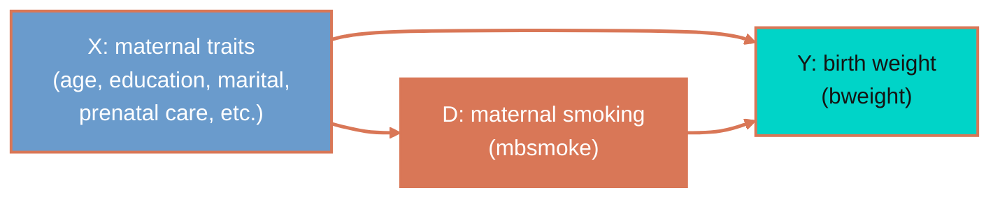
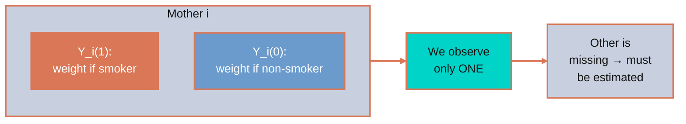
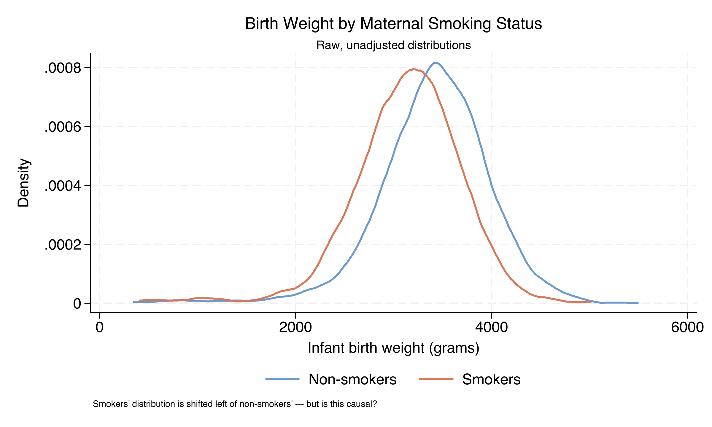
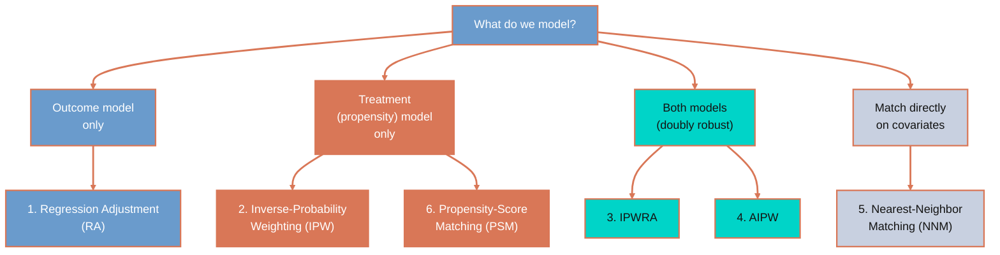
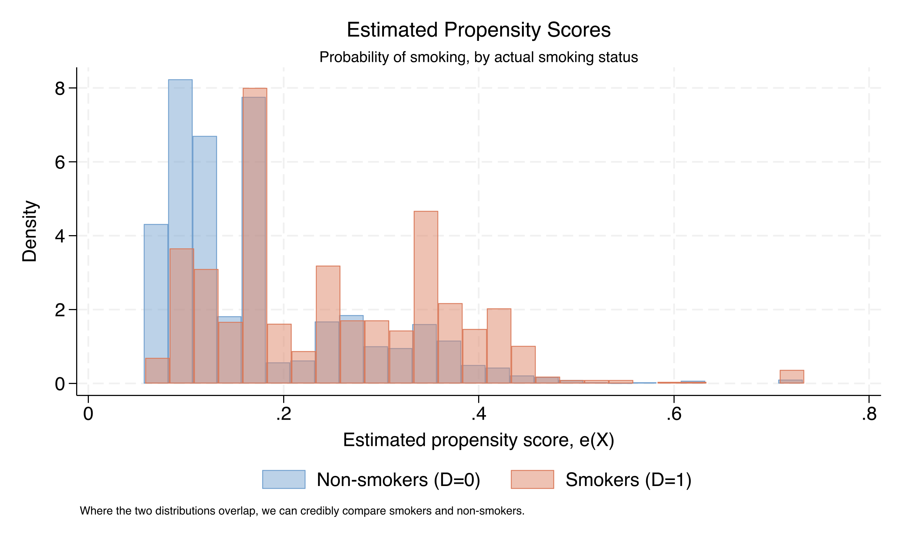
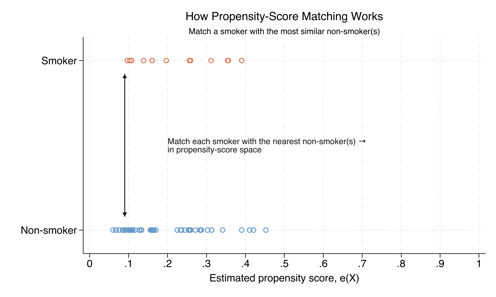
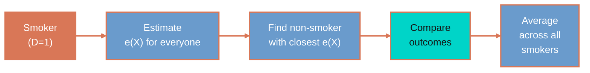
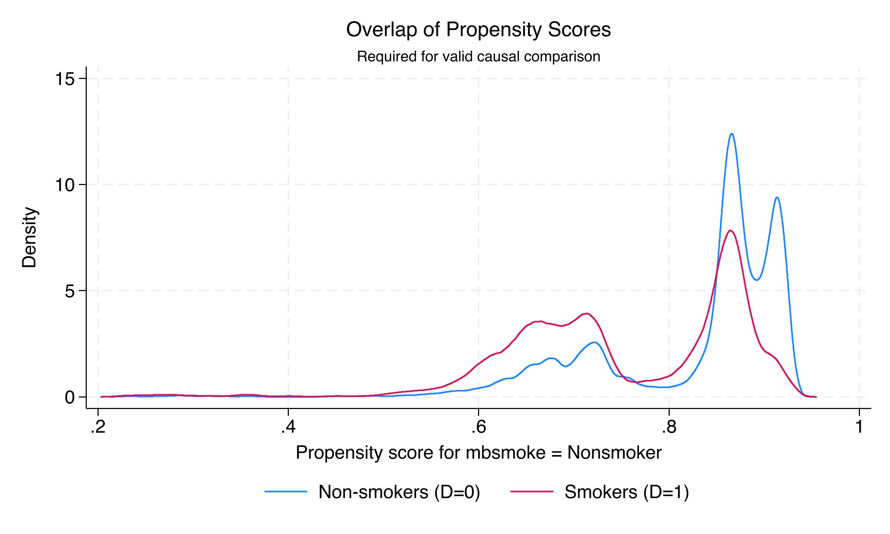

---
authors:
  - admin
categories:
  - Stata
  - Causal Inference
  - Treatment Effects
  - Matching
  - Propensity Score
draft: false
featured: false
date: "2026-04-29T00:00:00Z"
external_link: ""
image:
  caption: ""
  focal_point: Smart
  placement: 3
links:
- icon: file-code
  icon_pack: fas
  name: "Stata do-file"
  url: analysis.do
- icon: database
  icon_pack: fas
  name: "Dataset (.dta)"
  url: https://github.com/quarcs-lab/data-open/raw/master/ametrics/cattaneo2.dta
- icon: file-alt
  icon_pack: fas
  name: "Stata log"
  url: analysis.log
slides:
summary: A beginner-friendly walk-through of six treatment-effects estimators in Stata --- regression adjustment, IPW, IPWRA, AIPW, nearest-neighbor matching, and propensity-score matching --- applied to the classic maternal-smoking and birth-weight case study.
tags:
  - stata
  - causal
  - causal inference
  - matching
  - propensity score
  - teffects
  - treatment effects
title: "Treatment Effects in Stata: A Beginner's Tour of Six Estimators with the Maternal Smoking and Birth Weight Case Study"
url_code: ""
url_pdf: ""
url_slides: ""
url_video: ""
toc: true
diagram: true
---

## 1. Overview

Does maternal smoking during pregnancy *cause* lower birth weight, or do smokers and non-smokers simply differ in other ways that happen to predict their babies' birth weights? It is one of the most-studied questions in applied econometrics, and the honest answer depends entirely on how we adjust for the differences between the two groups. In this tutorial we use Stata's `teffects` family of commands to walk through **six different treatment-effects estimators** on a single dataset --- 4,642 mother-infant pairs from the Cattaneo (2010) study --- and watch each one wrestle with the same question.

The six estimators take **four different routes** to the same causal estimand. **Regression adjustment (RA)** models only the outcome (birth weight). **Inverse-probability weighting (IPW)** and **propensity-score matching (PSM)** model only the treatment (smoking). **IPWRA** and **AIPW** model *both* the outcome and the treatment --- the **doubly robust** family. **Nearest-neighbor matching (NNM)** does not fit a parametric model at all: it matches each smoking mother directly to her most similar non-smoker in covariate space. By the end of the post you will see how their answers agree, where they differ, and how to read each output panel without flinching.

The pedagogical hook is that we already have a clear (but biased) reference number to anchor the tour. A naive comparison of means says smokers' babies weigh **275 grams less** than non-smokers'. Every adjusted estimator we run will return a smaller number, and the gap between **−275 g** (naive) and what we eventually settle on (around **−230 g**) is exactly what causal-inference machinery buys us. That gap is the bias we would have if we treated this observational dataset as if it came from a randomized experiment. Watching it shrink is the whole pedagogical point.

### Learning objectives

By the end of this tutorial you will be able to:

1. State the **potential-outcomes framework** in plain English and define ATE and ATT.
2. Explain the three **identification assumptions** that all six estimators rely on: conditional independence (unconfoundedness), overlap, and SUTVA.
3. Implement and interpret **regression adjustment (RA)**, **inverse-probability weighting (IPW)**, **IPWRA**, **AIPW**, **nearest-neighbor matching (NNM)**, and **propensity-score matching (PSM)** in Stata using the `teffects` suite.
4. Recreate RA and IPW **by hand** with `regress` and `logistic`, so the canned commands stop feeling magical.
5. Diagnose **propensity-score overlap** with `teffects overlap` and read what it tells you about whether your comparison is credible.
6. Compare estimators in a **forest plot** and decide which differences matter.
7. Explain when ATE and ATT can diverge --- and what it means when they do.
8. Identify the limits of the design and propose **next steps** when conditional independence is doubtful.

The companion `analysis.do` file linked at the top of this page runs every estimator in this tutorial end-to-end. Open it side-by-side as you read.

## 2. The case study: maternal smoking and birth weight

We work with `cattaneo2.dta`, a dataset of 4,642 singleton births popularized by Cattaneo (2010). The outcome of interest is `bweight` (infant birth weight, measured in grams) and the treatment is `mbsmoke` (1 if the mother smoked during pregnancy, 0 otherwise). The remaining variables are pre-treatment characteristics that plausibly affect both the smoking decision and the eventual birth weight.

The diagram below sketches the inferential challenge. We *observe* whether each mother smoked and how much her baby weighed, but the same characteristics that drive the smoking decision also drive birth weight directly --- so the simple comparison conflates the effect of smoking with the effect of those characteristics.



Read the diagram from left to right. Maternal characteristics `X` (steel blue) influence both the *decision* to smoke `D` (warm orange) and the *outcome* `Y` --- birth weight (teal). The arrow `D → Y` is the causal effect we want to isolate. The arrows `X → D` and `X → Y` together form the **back-door path** that contaminates a naive comparison: if we just compare smokers to non-smokers, we are picking up the differences in `X` between the two groups in addition to the direct effect of smoking. Every method in this tutorial blocks the back-door path in a different way.

The variables we will use are summarised below.

| Variable | Type | Role | Description |
|---|---|---|---|
| `bweight` | int | Outcome (Y) | Infant birth weight in grams |
| `mbsmoke` | byte | Treatment (D) | 1 if the mother smoked during pregnancy, 0 otherwise |
| `mage` | byte | Confounder (X) | Mother's age at delivery, in years |
| `mmarried` | byte | Confounder (X) | 1 if the mother is married |
| `fage` | byte | Confounder (X) | Father's age, in years |
| `medu` | byte | Confounder (X) | Mother's years of education |
| `prenatal1` | byte | Confounder (X) | 1 if the first prenatal visit was in the first trimester |
| `fbaby` | byte | Confounder (X) | 1 if this is the mother's first baby |

These six covariates are pre-treatment by construction (they are determined before the smoking decision matters for birth weight), which is the basic discipline of a credible adjustment set. We will not always use *all* six in every model, because different methods have different conventions, but each variable in this list is in the running.

## 3. The potential-outcomes framework

Causal inference is easier to reason about once you adopt the **potential-outcomes** language popularized by Donald Rubin. The mental shift is to imagine, for every mother in the sample, *two parallel-universe* birth weights --- one if she smoked, one if she didn't.

### 3.1 The two potential outcomes

For every mother $i$, let $Y\_i(1)$ denote the birth weight of her baby in the universe where she smokes, and $Y\_i(0)$ denote the birth weight in the universe where she doesn't. The individual treatment effect is the difference:

$$\tau\_i = Y\_i(1) - Y\_i(0)$$

In words, $\tau\_i$ is the gap, in grams, between the two parallel-universe outcomes for the same mother --- exactly the answer we would want if we could run a randomized experiment on her individually. The formal challenge is the **fundamental problem of causal inference**: we only ever observe one of the two potential outcomes for any given mother. If she smoked, we see $Y\_i(1)$. If she didn't, we see $Y\_i(0)$. The other potential outcome is missing, period.

The diagram below visualizes the challenge.



The fundamental problem is what makes causal inference a **missing-data problem in disguise**. Every estimator in this tutorial is, at heart, a different way of imputing the missing potential outcome. RA imputes it with a regression model. IPW imputes it implicitly by re-weighting. Matching imputes it with the actual outcome of a similar but un-treated unit.

### 3.2 ATE versus ATT

Because we cannot recover individual effects, we settle for *averages*. The two most common averages are the **average treatment effect** (ATE) and the **average treatment effect on the treated** (ATT):

$$\tau\_{ATE} = E[Y(1) - Y(0)]$$

$$\tau\_{ATT} = E[Y(1) - Y(0) \mid D = 1]$$

In words, the ATE is the average effect we would expect if we randomly drew a mother from the population and forced her to smoke (vs. not smoke). The ATT is the average effect of smoking *for the mothers who actually smoked*. The two answer different policy questions. ATE answers "what would happen if smoking became universal?", while ATT answers "what is happening to those who currently smoke?"

In this tutorial every method that supports both estimands will report both. Most methods give us an ATE that is slightly more negative than the ATT, because mothers who actually smoke happen to differ from the average mother in ways that, in this dataset, dampen the harm. We will see this divergence concretely in §11 when we compare results across methods.

### 3.3 Why a naive comparison fails

If smoking had been randomly assigned to mothers, we could estimate the ATE as the simple difference of group means: $\bar{Y}\_{D=1} - \bar{Y}\_{D=0}$. With observational data this naive comparison fails because the treatment groups are not exchangeable --- they differ on the covariates `X` that themselves drive birth weight. Concretely, mothers who smoke during pregnancy are on average less educated, less likely to be married, and more likely to skip the first-trimester prenatal visit; each of those characteristics is independently associated with lower birth weight. The naive gap therefore mixes the genuine effect of smoking with the **selection bias** that arises from those covariate differences. The job of the six methods we are about to study is to subtract that selection bias.

## 4. The identification assumptions

Every method in this tutorial relies on three assumptions. They are not free; if any one of them fails badly, no amount of clever adjustment will recover the truth.

**Assumption 1 (Conditional independence / unconfoundedness):**

$$\\{Y(0), Y(1)\\} \perp D \mid X$$

In words, conditional on the observed covariates `X`, the treatment `D` is "as good as randomly assigned" in the sense that it is independent of the potential outcomes. In our case this means that, *among mothers who look identical on age, education, marital status, prenatal care, parity, and father's age*, smoking is statistically the same as a coin flip with respect to birth-weight potential outcomes. This is a strong assumption, and it is not testable directly. It is plausible only to the extent that `X` captures the *systematic* drivers of selection into smoking.

**Assumption 2 (Overlap, also known as positivity):**

$$0 < e(X) < 1, \quad \text{where} \quad e(X) = \Pr(D = 1 \mid X)$$

In words, for every value of `X` we observe in the data, both smokers and non-smokers exist. If there is some combination of covariates --- say, well-educated mothers over 35 with first-trimester prenatal care --- where literally nobody smokes, we cannot make a credible counterfactual prediction for those mothers. Overlap is testable, and we will check it visually in §10 with `teffects overlap`.

**Assumption 3 (SUTVA --- Stable Unit Treatment Value Assumption):**

The treatment of one mother does not affect the outcome of another, and there is "only one version" of the treatment. SUTVA fails if, for instance, smoking is socially contagious within neighborhoods (one woman's smoking causes her friend to smoke too) or if "smoking" hides multiple intensities (two cigarettes a day vs. two packs) that we are pooling. For our purposes SUTVA is plausible because births are biologically independent and we are working with a binary smoking indicator.

If conditional independence fails, the methods are *all* biased in the same direction --- including the doubly robust ones. If overlap fails, the comparison is partially undefined. If SUTVA fails, the estimand itself becomes fuzzy. None of the six estimators below repairs an assumption violation; they only correct for things `X` can see. We will return to this point in the limitations section.

## 5. Loading and exploring the data

We start in Stata by loading the dataset directly from a public URL, so that anybody can reproduce the analysis without downloading files manually. The `describe` command surfaces variable types and labels; `summarize` gives us means and ranges.

```stata
* Load the dataset directly from the web
use "https://github.com/quarcs-lab/data-open/raw/master/ametrics/cattaneo2.dta", clear

* Describe and summarize the variables of interest
describe bweight mbsmoke mage mmarried fage medu prenatal1 fbaby
summarize bweight mbsmoke mage mmarried fage medu prenatal1 fbaby

* Treatment prevalence and group means
tab mbsmoke
tab mbsmoke, summarize(bweight)
```

```text
    Variable |        Obs        Mean    Std. dev.       Min        Max
-------------+---------------------------------------------------------
     bweight |      4,642     3361.68    578.8196        340       5500
     mbsmoke |      4,642    .1861267    .3892508          0          1
        mage |      4,642    26.50452    5.619026         13         45
    mmarried |      4,642    .7197329    .4491722          0          1
        fage |      4,642    27.26713    9.354411          0         60
        medu |      4,642    12.68957    2.520661          0         17
   prenatal1 |      4,642    .8013787    .3990052          0          1
       fbaby |      4,642    .4379578    .4961893          0          1

1 if mother |    Summary of Infant birthweight (grams)
     smoked |        Mean   Std. dev.       Freq.
------------+------------------------------------
  Nonsmoker |   3412.91   570.69          3,778
     Smoker |   3137.66   560.89            864
------------+------------------------------------
      Total |   3361.68   578.82          4,642
```

The analysis sample has 4,642 singleton births. Smokers are a minority --- 864 mothers, or **18.6%** of the sample --- which is exactly why a naive comparison is risky: when treated and control groups differ in size *and* in observable characteristics, a difference of means is dominated by whichever group has more variation in the confounders. The raw mean birth weight is 3,412.9 g among non-smokers and 3,137.7 g among smokers, a 275 g gap. Average maternal age is 26.5, 72% are married, 80% had a first-trimester prenatal visit, and average maternal education is 12.7 years. We will revisit each of these covariates as confounders below.

Before we estimate any treatment effect, it is useful to *see* the raw outcome distribution. The figure below plots a kernel density of `bweight`, separately for smokers and non-smokers, with no adjustment of any kind.

```stata
twoway ///
    (kdensity bweight if mbsmoke==0, lcolor("106 155 204") lwidth(medthick)) ///
    (kdensity bweight if mbsmoke==1, lcolor("217 119 87")  lwidth(medthick)) ///
    , title("Birth Weight by Maternal Smoking Status") ///
      xtitle("Infant birth weight (grams)") ytitle("Density") ///
      legend(order(1 "Non-smokers" 2 "Smokers"))
graph export "stata_matching_density_bweight.png", replace width(2400)
```



Smokers' density (warm orange) sits visibly to the left of non-smokers' density (steel blue), with the modes separated by roughly 250 grams. Both distributions are unimodal, roughly bell-shaped, and have similar spreads. The picture is striking, but it is *exactly* the picture confounding produces: it shows us nothing about whether the leftward shift is caused by smoking, by the other characteristics that distinguish smoking from non-smoking mothers, or by some mixture. The next eight sections all aim to peel apart that mixture.

## 6. A roadmap to six estimators

The six methods we will run can be organized by which side of the data they model. Some model the *outcome*, some the *treatment*, some both, and matching estimators sidestep modeling and work directly on the data. The diagram below is the mental map we will return to as we add each method.



Each branch of the tree answers a different design question. RA (the leftmost branch) is the only estimator that relies *purely* on an outcome model; if that model is wrong, RA is biased. IPW and PSM (the orange branch) both rely *purely* on a treatment model (the propensity score); if that model is wrong, they are biased. They differ from each other in *how* they use the propensity score: IPW reweights every observation by the inverse propensity, while PSM matches each treated unit to the untreated unit with the most similar propensity score. IPWRA and AIPW (the teal branch) fit *both* an outcome model *and* a treatment model and combine them in a way that delivers the **doubly robust** property: they remain consistent if *either* model is correctly specified --- you only need one of two to be right. NNM (the light-gray branch) is the odd one out: it does not fit a parametric model at all. It instead computes a multidimensional Mahalanobis distance between each treated mother and every untreated mother, picks the closest non-smoker(s), and compares outcomes directly. Before we run any method, we will also estimate a naive baseline (a one-variable regression with no covariates) so we have a number to put the adjustments against.

To make the similarities and differences explicit, the table below summarizes each method along five axes: what it models, what it does with the model output, what its key tuning option is, what its estimand is in Stata's `teffects`, and what it is biased against if the world is unkind.

| Method | Models the outcome? | Models the treatment (propensity)? | Core mechanic | Estimands in `teffects` | Biased if... |
|---|:---:|:---:|---|---|---|
| **Naive** | No | No | Difference of means | ATE only | confounders exist (always) |
| **1. RA** | ✓ | — | Predict $Y(1)$ and $Y(0)$ from a regression and average the gap | ATE, ATT | the outcome model is wrong |
| **2. IPW** | — | ✓ | Reweight outcomes by $1/\hat e(X)$ for treated, $1/(1-\hat e(X))$ for controls | ATE, ATT | the propensity model is wrong |
| **3. IPWRA** | ✓ | ✓ | Run RA *with IPW weights* | ATE, ATT | **both** models are wrong (doubly robust) |
| **4. AIPW** | ✓ | ✓ | RA + IPW correction term using outcome residuals | ATE only | **both** models are wrong (doubly robust + efficient) |
| **5. NNM** | — | — | Find the nearest neighbor(s) in Mahalanobis-distance covariate space | ATE, ATT | no parametric model is wrong, but matching can be poor in sparse regions |
| **6. PSM** | — | ✓ | Find the nearest neighbor(s) in **propensity-score** space | ATE, ATT | the propensity model is wrong |

A few observations worth pausing on. First, **NNM is the only method that uses neither an outcome nor a treatment model.** It is the most assumption-light estimator in the lineup, paying for that freedom in efficiency: its standard errors are typically larger than the model-based methods, as we will see. Second, **PSM is closer to IPW than to NNM.** Both PSM and IPW depend critically on a correctly specified propensity model; PSM just *matches* on the propensity score where IPW *reweights* by it. Third, **IPWRA and AIPW are siblings, not twins.** Both fit both kinds of model and both are doubly robust, but IPWRA combines them by literally running weighted regression, while AIPW combines them with an additive correction term derived from semiparametric efficiency theory --- a derivation that gives AIPW the smallest possible asymptotic variance among regular doubly robust estimators. Fourth, **RA is a special case** in the sense that its mechanics (predict, average the predicted gap) are also a step inside IPWRA and AIPW; you can think of those two as RA with a safety net.

The companion `analysis.do` file estimates each method in roughly 20 seconds. We walk through them one at a time below, and in §13 we line up all six estimates plus the naive baseline in a single forest plot.

## 7. The naive baseline

Before any adjustment, what does an OLS regression with no controls say? This will be our **biased reference point** --- the answer we get if we treat the data as if it came from a randomized experiment, when in fact it didn't.

```stata
regress bweight mbsmoke, vce(robust)
estimates store te_naive
```

```text
Linear regression                               Number of obs     =      4,642
                                                F(1, 4640)        =     168.33
                                                R-squared         =     0.0343

------------------------------------------------------------------------------
             |               Robust
     bweight | Coefficient  std. err.      t    P>|t|     [95% conf. interval]
-------------+----------------------------------------------------------------
     mbsmoke |  -275.2519   21.21501   -12.97   0.000    -316.8434   -233.6604
       _cons |   3412.912   9.285455   367.55   0.000     3394.708    3431.115
------------------------------------------------------------------------------
```

The unadjusted gap is **−275.3 grams** (95% CI: [−316.8, −233.7]; t = −12.97). This is the number a journalist who saw only `bweight` and `mbsmoke` would publish. It is a precise estimate of the wrong quantity: it absorbs both the causal effect of smoking and the contribution of every covariate that differs between smoking and non-smoking mothers. The R² is 3.4% --- smoking alone, without controls, explains only a tiny fraction of birth-weight variation, but the *average* gap is estimated very precisely thanks to the large sample. We will see every adjusted estimator pull this number toward zero.

## 8. Method 1 --- Regression Adjustment (RA)

Regression adjustment fits two outcome models, one for smokers and one for non-smokers, and then uses each of them to *predict* the outcome for everybody --- producing a predicted potential outcome under treatment and another under control. Averaging the predicted gap gives the ATE.

A familiar analogy comes from the classroom. Imagine you have a class of students and you give half of them a tutoring program. Instead of comparing post-test scores directly (which would conflate the program with the differences between the kids who got it and the kids who didn't), you build two predictive models: one of "what score would this student have gotten if tutored?" and one of "what score would this student have gotten if not tutored?", using their grades, attendance, and so on. You then ask: averaging across the whole class, how much higher are the predicted "tutored" scores? That difference is the RA estimate of the ATE.

In our case, RA targets the ATE (and, with the `atet` option, the ATT):

$$\hat{\tau}\_{RA} = \frac{1}{n}\sum\_{i=1}^{n}\left[\hat{\mu}\_1(X\_i) - \hat{\mu}\_0(X\_i)\right]$$

Here $\hat{\mu}\_d(X)$ denotes the fitted regression $E[Y \mid D=d, X]$ for treatment arm $d$ --- in code, the prediction from a `regress` model fit on the `D=d` subsample. RA evaluates both fitted models at every observation's covariates, takes the difference, and averages.

In Stata, `teffects ra` does the whole sequence in one line. We pass two parenthesized blocks: the first specifies the **outcome equation** (`bweight` plus the covariates we want to control for), the second specifies the **treatment indicator** (`mbsmoke`). The `pomeans`, `ate`, and `atet` options switch between the three reportable quantities --- the two potential-outcome means, the ATE, and the ATT.

```stata
teffects ra (bweight mmarried mage prenatal1 fbaby) (mbsmoke), pomeans nolog
teffects ra (bweight mmarried mage prenatal1 fbaby) (mbsmoke), ate    nolog
estimates store te_ra
teffects ra (bweight mmarried mage prenatal1 fbaby) (mbsmoke), atet   nolog
estimates store te_ra_att
```

```text
Treatment-effects estimation                    Number of obs     =      4,642
Estimator      : regression adjustment

POmeans      |
  Nonsmoker  |   3403.242   9.525207   357.29   0.000     3384.573    3421.911
     Smoker  |   3163.603   21.86351   144.70   0.000     3120.751    3206.455

ATE          |
     mbsmoke |
    (Smoker
         vs
 Nonsmoker)  |  -239.6392   23.82402   -10.06   0.000    -286.3334    -192.945

ATET         |
     mbsmoke |  -223.3017    22.7422    -9.82   0.000    -267.8755   -178.7278
```

The RA estimate of the ATE is **−239.6 g** (95% CI: [−286.3, −192.9], z = −10.06). The two potential-outcome means say that, averaged over the entire sample, predicted birth weight is about 3,403 g if no mothers smoked and 3,164 g if all mothers smoked --- the gap between those two numbers is the ATE. The ATT is **−223.3 g**, slightly closer to zero, meaning that among the women who actually smoked, the model expects smoking to harm their babies somewhat less than it would harm the average baby in the sample. The naive gap of −275 g has just shrunk by 35.6 g, or **13%**, simply by adjusting for marital status, maternal age, prenatal care, and parity.

### Manual recreation: regression adjustment by hand

`teffects ra` is not a black box. We can rebuild the same number with three commands: fit two ordinary regressions, predict potential outcomes for everybody, and average the gap.

```stata
* Fit the outcome model on non-smokers only and predict everyone's Y(0)
regress bweight mmarried mage prenatal1 fbaby if mbsmoke==0
predict y0_hat, xb

* Fit the outcome model on smokers only and predict everyone's Y(1)
regress bweight mmarried mage prenatal1 fbaby if mbsmoke==1
predict y1_hat, xb

* Take the difference and average
generate te_i = y1_hat - y0_hat
summarize te_i
```

```text
    Variable |        Obs        Mean    Std. dev.       Min        Max
-------------+---------------------------------------------------------
        te_i |      4,642   -239.6392      99.008  -488.4602   8.261719

  Manual RA estimate of ATE: -239.64 grams
```

The hand-built RA reproduces the canned `teffects ra` ATE to four significant figures (−239.64 g vs. −239.6392 g). The standard deviation of the predicted individual treatment effects (99 g) is large compared with the mean, which tells us that --- *if you trust the outcome model* --- the harm of smoking varies substantially across mothers depending on their covariate profile. A handful of mothers (the maximum is +8.3 g) even have positive predicted effects, but those are small and rare. The exact match between the manual and canned versions is the demystification we wanted: `teffects ra` is exactly two `regress` calls, two `predict` statements, and a difference.

## 9. Method 2 --- Inverse-Probability Weighting (IPW)

Where RA models the outcome, IPW models the **treatment**. It estimates each mother's propensity to smoke as a function of her covariates, then re-weights every observation by the inverse of that propensity. The reweighted sample mimics what we would have seen if smoking had been randomly assigned.

The mechanic is familiar from survey sampling. Think of a survey where rural respondents are under-sampled. To recover the population mean, the standard fix is to up-weight rural respondents proportionally. IPW does the same trick for *treatment*: under-represented combinations (e.g., a married 35-year-old smoker, or an unmarried 18-year-old non-smoker) get more weight, so the re-weighted sample looks like a randomized experiment.

IPW targets the ATE (and, with `atet`, the ATT):

$$\hat{\tau}\_{IPW} = \frac{1}{n}\sum\_i \left[\frac{D\_i Y\_i}{\hat{e}(X\_i)} - \frac{(1-D\_i) Y\_i}{1-\hat{e}(X\_i)}\right]$$

where the **propensity score** is

$$e(X) = \Pr(D = 1 \mid X)$$

In words, each mother contributes her own outcome, but a smoker (D=1) is up-weighted by 1/$\hat{e}(X)$ --- so an unlikely smoker (small $\hat{e}$) counts a lot --- and a non-smoker is up-weighted by 1/(1−$\hat{e}$). The weighted average of smokers' outcomes, minus the weighted average of non-smokers' outcomes, is the IPW estimate of the ATE.

In Stata, `teffects ipw` accepts a single outcome block (just `bweight`, with no covariates inside) followed by the **treatment block** with the propensity-score covariates. We use a `probit` link, which is `teffects`'s default.

```stata
teffects ipw (bweight) (mbsmoke mmarried mage fbaby medu, probit), pomeans nolog
teffects ipw (bweight) (mbsmoke mmarried mage fbaby medu, probit), ate    nolog
estimates store te_ipw
teffects ipw (bweight) (mbsmoke mmarried mage fbaby medu, probit), atet   nolog
estimates store te_ipw_att
```

```text
Treatment-effects estimation                    Number of obs     =      4,642
Estimator      : inverse-probability weights
Treatment model: probit

ATE          |   -230.906   24.30987    -9.50   0.000    -278.5525   -183.2595

ATET         |  -219.6338   23.38456    -9.39   0.000    -265.4667   -173.8009
```

IPW gives an ATE of **−230.9 g** (95% CI: [−278.6, −183.3], z = −9.50). The point estimate is 8.7 g closer to zero than the RA estimate (−239.6 g) and 44 g closer to zero than the naive baseline. The fact that two methods that model entirely different sides of the data --- IPW models smoking, RA models birth weight --- agree to within about ten grams is the first strong signal that the underlying causal effect is real and not an artifact of one model's specification.

### Manual recreation: IPW by hand

We can build IPW by hand in three steps: estimate propensity scores with `logistic`, generate IPW weights, and run a **weighted regression** of `bweight` on `mbsmoke`. The coefficient on `mbsmoke` is then the manual IPW estimate.

```stata
* Step 1: estimate the propensity score with logistic regression
logistic mbsmoke mmarried mage fbaby medu, nolog
predict ps, p

* Step 2: build IPW weights
generate ipw_w = 1/ps        if mbsmoke==1
replace  ipw_w = 1/(1-ps)    if mbsmoke==0

* Step 3: weighted regression
regress bweight mbsmoke [aweight=ipw_w]
```

```text
Logistic regression                                     Number of obs =  4,642
                                                        LR chi2(4)    = 346.31
                                                        Pseudo R2     = 0.0776

  Manual IPW estimate (coefficient on mbsmoke): -232.13 grams
```

The logistic propensity model has a likelihood-ratio chi-square of 346.3 on 4 degrees of freedom (p < 0.0001), indicating that observable covariates carry real information about who smokes --- otherwise IPW would have nothing to correct. The pseudo-R² of 7.8% is moderate: covariates explain meaningful but not overwhelming variation in the smoking decision, which is *exactly the regime IPW likes* because it implies neither sparse overlap (which would happen with R² near 1) nor pointless reweighting (R² near 0). The manual IPW estimate of −232.1 g is within 1.2 g of the canned probit-IPW (−230.9 g) --- the small difference comes from logit vs. probit and from how `teffects` weights the contributions. Method-to-method agreement on the order of 1 gram tells us the two link functions are interchangeable here.

The figure below shows the propensity-score distributions by treatment status. It is the key diagnostic for IPW: where the two distributions overlap, we have credible reweighting; where they diverge, the inverse weights blow up.



Both distributions span most of the unit interval. Non-smokers (steel blue) cluster toward the left (most have a low estimated probability of smoking, consistent with smokers being a minority) but extend well into the high-propensity region; smokers (warm orange) cluster toward the right but extend well into the low-propensity region. There is no obvious zone where one group is absent, which is the visual signature of the **overlap assumption** holding. Without this overlap, IPW would be unstable --- a non-smoker with $\hat{e}(X) = 0.99$ would get a weight of 100, dominating the weighted mean.

## 10. Methods 3 and 4 --- The doubly robust pair: IPWRA and AIPW

The next two estimators belong to the family of **doubly robust** methods. They combine an outcome model (like RA) with a treatment model (like IPW) in a way that delivers a consistent estimate of the ATE if *either* model is correctly specified. You only need one of two to be right, which is a forgiving property in applied work.

### 10.1 IPWRA --- IPW + Regression Adjustment

IPWRA fits the IPW weights, then runs RA *with those weights*. If the propensity model is correct, the weighting alone delivers the ATE. If the outcome model is correct, the regression adjustment alone delivers the ATE. If both are correct, IPWRA is efficient. If only one is correct, IPWRA is still consistent.

It is the suspenders-and-belt strategy: with two candidate corrections for confounding, combining them in this particular way means that if either one happens to be the right one, the final estimate is right too.

```stata
teffects ipwra (bweight mmarried mage prenatal1 fbaby) ///
               (mbsmoke mmarried mage fbaby medu, probit), ate  nolog
estimates store te_ipwra
teffects ipwra (bweight mmarried mage prenatal1 fbaby) ///
               (mbsmoke mmarried mage fbaby medu, probit), atet nolog
estimates store te_ipwra_att
```

```text
ATE          |  -231.8723    25.1541    -9.22   0.000    -281.1735   -182.5712
ATET         |  -220.6476   23.37268    -9.44   0.000    -266.4572    -174.838
```

IPWRA gives an ATE of **−231.9 g** (95% CI: [−281.2, −182.6]) and an ATT of **−220.6 g**. Both estimates are essentially indistinguishable from the IPW results (−230.9 g ATE, −219.6 g ATT), differing by less than 1.3 g. That convergence is the doubly robust property paying off in practice: even if our outcome model is misspecified by some unknown amount, the IPW step is mopping up the bias --- and vice versa.

### 10.2 AIPW --- Augmented IPW

AIPW is the *efficient* doubly robust estimator. It blends RA and IPW with a particular adjustment that achieves the **semiparametric efficiency bound** under standard regularity conditions, meaning no other regular estimator can have a smaller asymptotic variance. AIPW targets the ATE only in `teffects aipw`, and the estimator can be written as:

$$\hat{\tau}\_{AIPW} = \frac{1}{n}\sum\_i \left\\{ [\hat{\mu}\_1(X\_i) - \hat{\mu}\_0(X\_i)] + \frac{D\_i [Y\_i - \hat{\mu}\_1(X\_i)]}{\hat{e}(X\_i)} - \frac{(1-D\_i)[Y\_i - \hat{\mu}\_0(X\_i)]}{1 - \hat{e}(X\_i)} \right\\}$$

The first bracketed term is the RA estimator. The next two terms add a propensity-weighted correction based on the *residuals* from the outcome model. If the outcome model is exactly right, the residuals are mean-zero and the correction vanishes --- AIPW collapses to RA. If the outcome model is wrong but the propensity model is right, the correction debiases it. AIPW is therefore RA with an automatic safety net.

```stata
teffects aipw (bweight mmarried mage prenatal1 fbaby) ///
              (mbsmoke mmarried mage fbaby medu, probit), ate nolog
estimates store te_aipw
```

```text
ATE          |  -232.4759   24.83406    -9.36   0.000    -281.1497    -183.802
```

AIPW gives an ATE of **−232.5 g** (95% CI: [−281.1, −183.8], z = −9.36), almost identical to IPWRA (−231.9 g). The two doubly robust estimators differ by 0.6 g, well within rounding noise. Stata's `teffects aipw` does not provide an ATT --- this is a software-implementation detail, not a conceptual limitation of the method, and we will note it in the comparison table. AIPW is the recommended default when both an outcome model and a treatment model are credible, because it inherits the doubly robust property *and* attains the efficiency bound.

## 11. Method 5 --- Nearest-Neighbor Matching (NNM)

Matching estimators step away from parametric outcome and treatment models entirely. Instead, they ask: for every smoking mother, who is her **statistical twin** among the non-smoking mothers? Find that twin (or that small set of twins), and compute the difference in birth weights. Average across all the matched pairs.

If you are trying to estimate the effect of attending a private school, NNM is "for every private-school student, find a public-school student with the same age, same family income, same parental education, and same standardized-test score from third grade --- then compare their twelfth-grade test scores." The matching does the heavy lifting that a regression would otherwise do.

NNM targets the ATE (and, with `atet`, the ATT):

$$\hat{\tau}\_{NNM} = \frac{1}{n}\sum\_i (2D\_i - 1)\left[Y\_i - \frac{1}{M}\sum\_{j \in J\_M(i)} Y\_j\right]$$

Here $J\_M(i)$ is the set of $M$ nearest neighbors of mother $i$ in the *opposite* treatment group, measured by Mahalanobis distance over the covariates. The expression in brackets is the difference between mother $i$'s observed outcome and the average outcome of her nearest neighbors, and the factor $(2D\_i - 1)$ flips the sign so that smokers contribute (smoker outcome − matched non-smoker outcome) while non-smokers contribute (matched smoker outcome − non-smoker outcome). The default `M=1` uses a single nearest neighbor.

In Stata, `teffects nnmatch` accepts the outcome variable plus the covariates to match on, then the treatment indicator. The `ematch()` option forces *exact* matching on a subset of (typically discrete) variables --- here marital status and prenatal care, so we never match a married mother to an unmarried one. The `biasadj()` option requests a small-sample bias correction for the continuous matching variables.

```stata
teffects nnmatch (bweight mmarried mage fage medu prenatal1) (mbsmoke), ///
         ematch(mmarried prenatal1)  biasadj(mage fage medu) ate  nolog
estimates store te_nnmatch
teffects nnmatch (bweight mmarried mage fage medu prenatal1) (mbsmoke), ///
         ematch(mmarried prenatal1)  biasadj(mage fage medu) atet nolog
estimates store te_nnmatch_att
```

```text
Estimator      : nearest-neighbor matching     Matches: requested = 1
Distance metric: Mahalanobis                                  max = 16

ATE          |  -210.0558   29.32803    -7.16   0.000    -267.5377   -152.5739
ATET         |  -238.5204   30.41661    -7.84   0.000    -298.1359    -178.905
```

NNM gives an ATE of **−210.1 g** (95% CI: [−267.5, −152.6], z = −7.16) and an ATT of **−238.5 g**. The ATE is the smallest in absolute value of any estimator we have run, and the confidence interval is the widest --- both are typical features of matching estimators, which trade some precision for the freedom from parametric assumptions. The Stata output also reveals that one observation needed up to 16 matches: this happens when several observations are tied at the same Mahalanobis distance, which is normal when the matching set includes discrete variables. Notice also that NNM is the only method so far where ATT (−238.5 g) is **larger in magnitude** than ATE (−210.1 g). This is a real feature of matching, not a bug: the actual smokers in this sample occupy a region of covariate space where the matched comparison estimates a larger-magnitude effect. We will return to this point in §13.

## 12. Method 6 --- Propensity-Score Matching (PSM)

PSM combines the matching idea with the propensity score. Instead of matching on a multidimensional Mahalanobis distance, it collapses all the covariates into a single number --- the estimated propensity --- and matches on that. The intuition is Rosenbaum and Rubin's foundational result: matching on the scalar propensity score is sufficient to balance every covariate that went into estimating it.

The figure below illustrates the matching idea on a small subsample of 100 mothers, using the propensity scores we estimated in §9.



Each circle in the figure is one mother, plotted at her estimated propensity (x-axis) against her actual smoking status (y-axis: 0 for non-smoker, 1 for smoker). PSM matches each smoker (a warm-orange circle at y=1) to the non-smoker(s) (steel-blue circles at y=0) whose estimated propensity is closest, and the arrow walks you through one such match. After matching, each pair shares (approximately) the same propensity score, which by the Rosenbaum-Rubin theorem means they share the same *distribution* of every covariate that entered the propensity model. We can then compare their outcomes apples-to-apples.



The diagram restates the four steps. PSM is conceptually one of the simplest matching methods because the matching distance is one-dimensional: just the absolute difference in propensity scores.

```stata
teffects psmatch (bweight) (mbsmoke mmarried mage fage medu prenatal1), nolog
estimates store te_psmatch
teffects psmatch (bweight) (mbsmoke mmarried mage fage medu prenatal1), atet nolog
estimates store te_psmatch_att
```

```text
Estimator      : propensity-score matching     Matches: requested = 1
Treatment model: logit                                        max = 16

ATE          |  -229.4492   25.88746    -8.86   0.000    -280.1877   -178.7107
ATET         |  -224.5927   30.55147    -7.35   0.000    -284.4725   -164.7129
```

PSM gives an ATE of **−229.4 g** (95% CI: [−280.2, −178.7], z = −8.86) and an ATT of **−224.6 g**. These numbers sit comfortably inside the cluster formed by IPW (−230.9 g), IPWRA (−231.9 g), and AIPW (−232.5 g). Five different methods that take very different routes through the data are now agreeing on roughly **−230 grams**, with confidence intervals that all comfortably exclude the naive estimate of −275 g. This convergence is the strongest evidence we have that the **−230 g neighborhood** is not an artifact of any one model's specification.

The standard diagnostic for PSM is the **overlap plot** generated by `teffects overlap`, shown below. It plots the densities of the estimated propensity score separately for treated and control units after matching.

```stata
teffects psmatch (bweight) (mbsmoke mmarried mage fage medu prenatal1), nolog
teffects overlap
graph export "stata_matching_overlap.png", replace width(2400)
```



Both density curves span most of the open unit interval (0, 1). There are no large regions where one group is essentially absent, which is the visual signature of a satisfied overlap assumption. If the smokers' density had collapsed to a small region near 1 (or non-smokers' density had collapsed near 0), we would have a problem --- the propensity-weighted comparisons would be dominated by a handful of extreme observations. Here, the assumption is plausible, and the comparisons are well-supported across the entire (0,1) interval.

## 13. Comparing all six estimators

The most useful single output from this whole exercise is a side-by-side comparison of the seven specifications. The forest plot below was assembled by collecting each estimator's stored ATE and 95% CI into a small dataset and plotting them with `twoway`.


Reading top to bottom, the naive baseline (−275 g) is the most negative estimate, with a 95% CI of [−316.8, −233.7] that lies entirely below every adjusted estimator's point estimate except RA (which is right at its upper bound). The six adjusted estimators land in two groups: a tight cluster of five (RA, IPW, IPWRA, AIPW, PSM) between −229 and −240 g, and NNM as a slight outlier at −210 g with a wider CI. The convergence among the five is the headline finding of this analysis: they use different functional forms, different covariate sets, and different identification arguments, and they all return a number within ±10 g of each other. NNM's wider CI and slightly smaller magnitude reflect its non-parametric nature (it is doing more work with less help from a model) but its CI overlaps every other estimator's, so the disagreement is well within sampling variation.

The numbers underlying the plot:

| # | Estimator | ATE (grams) | 95% CI |
|---|---|---:|---|
| 0 | Naive (unadjusted) | −275.3 | [−316.8, −233.7] |
| 1 | Regression Adjustment (RA) | −239.6 | [−286.3, −192.9] |
| 2 | Inverse-Probability Weighting (IPW) | −230.9 | [−278.6, −183.3] |
| 3 | IPWRA (doubly robust) | −231.9 | [−281.2, −182.6] |
| 4 | AIPW (efficient doubly robust) | −232.5 | [−281.1, −183.8] |
| 5 | Nearest-Neighbor Matching (NNM) | −210.1 | [−267.5, −152.6] |
| 6 | Propensity-Score Matching (PSM) | −229.4 | [−280.2, −178.7] |

And the corresponding ATT estimates, where they are reported:

| # | Estimator | ATT (grams) |
|---|---|---:|
| 1 | RA | −223.3 |
| 2 | IPW | −219.6 |
| 3 | IPWRA | −220.6 |
| 4 | AIPW | not reported in Stata |
| 5 | NNM | −238.5 |
| 6 | PSM | −224.6 |

The divergence between ATT and ATE deserves a moment of attention. For RA, IPW, IPWRA, and PSM, the ATT is slightly closer to zero than the ATE, meaning that smoking has a slightly less harmful effect on the babies of the women who actually smoked than it would have on a randomly selected mother. NNM reverses this pattern (its ATT of −238.5 g is *larger in magnitude* than its ATE of −210.1 g) because it makes the matched comparison around the *treated* mothers, which weights the data in a way that emphasizes the covariate region where actual smokers live --- a region in which smoking happens to do more damage. Whether you should report ATE or ATT depends on the policy question. ATE answers "what would happen to a randomly chosen pregnancy if she smoked?", while ATT answers "what is happening to the babies of women who currently smoke?" These are different questions with different policy implications, and neither one is more "correct" in the abstract.

## 14. Summary and key takeaways

After running seven specifications on the same dataset, eight methodological lessons stand out.

1. **The naive comparison is biased upward (toward larger magnitude) by about 35 to 65 grams.** Adjusting for observable covariates moves the answer from −275 g to roughly −230 g, a 13% to 24% reduction in the apparent harm.
2. **Five of six adjusted estimators agree within 10 grams.** RA, IPW, IPWRA, AIPW, and PSM cluster between −229 and −240 g. When estimators with very different functional forms agree this closely, the maintained identification assumption (conditional independence) is probably approximately correct on this sample.
3. **Doubly robust is essentially free.** IPWRA and AIPW differ from each other by less than a gram and from plain IPW by less than two grams. The protection they offer against outcome- or treatment-model misspecification costs essentially nothing in this dataset.
4. **`teffects` is not a black box.** The manual recreation of RA recovered −239.64 g exactly, and the manual recreation of IPW gave −232.13 g (within 1.2 g of the canned probit version). Every method in this tutorial is, in the end, a few `regress`/`logistic` calls and a weighted average.
5. **Propensity scores have predictive power but leave room for matching.** The logistic propensity model has pseudo-R² of 7.8% and likelihood-ratio chi-square of 346. Weak enough to ensure overlap; strong enough that re-weighting makes a difference.
6. **NNM trades precision for flexibility.** Mahalanobis matching gives a wider CI (−267 to −152 g) than the model-based methods. The point estimate (−210 g) is closer to zero than the cluster, but the CI overlaps every other estimator's.
7. **ATT and ATE diverge for matching methods.** Five estimators give ATTs slightly closer to zero than their ATE. NNM reverses this pattern. The right question to ask about your application is which of the two estimands matches your policy question.
8. **Sample design matters.** With ~864 smokers in a sample of 4,642, propensity scores spanning most of (0, 1), and `teffects nnmatch` finding at most 16 matches per treated unit, this dataset is an unusually well-behaved teaching example. Real-world applications often have much sparser overlap, and you will know it when `teffects overlap` looks ragged.

## 15. Limitations and next steps

Every estimator above relies on three assumptions: conditional independence, overlap, and SUTVA. Conditional independence is the most fragile. If something we did not measure --- say, genetic predispositions, prenatal nutrition, household income, or chronic stress --- drives both the smoking decision and birth weight directly, every one of the six estimators is biased in the same direction. **None of the six methods can rescue an analyst from missing confounders.** That is what makes the conditional-independence assumption so important to scrutinize before publishing a number from this kind of analysis.

Three classes of follow-up are worth knowing about.

1. **Sensitivity analysis** --- methods like Rosenbaum bounds, the E-value, or `causalsens` quantify *how strong* an unobserved confounder would have to be to overturn the result. A sensible workflow is: run the six estimators above, then ask "how robust is the −230 g number to omitted variables?"
2. **Instrumental variables** --- when a credible instrument exists (say, regional cigarette taxes or anti-smoking advertising shocks), 2SLS or LATE estimators can identify the effect of smoking *for compliers* even under unobserved confounding.
3. **Machine-learning-based estimators** --- methods like Double/Debiased Machine Learning (DML), causal forests, and meta-learners replace the parametric outcome and treatment models above with flexible learners (random forest, gradient boosting), which is especially valuable when there are many covariates or when the outcome is non-linear in `X`. They are doubly robust like AIPW but make weaker functional-form assumptions.

For a Python walkthrough of DML on a similar style of problem, see `python_doubleml`. For a starter on the broader causal-inference workflow with `dowhy`, see `python_dowhy`.

## 16. Exercises

Six exercises to consolidate what you've just read. Each can be answered in 5–15 lines of Stata code.

1. **Different covariate set.** Re-estimate RA, IPW, and AIPW dropping `prenatal1` from the outcome model and `medu` from the treatment model. How much do the estimates change? What does this tell you about which covariates carry the most weight?
2. **Logit instead of probit.** Re-estimate IPW and IPWRA using `logit` instead of `probit` for the treatment model. Compare the estimates and standard errors. Which one is "correct"?
3. **More matches.** Re-estimate NNM and PSM with `nneighbor(3)` and `nneighbor(5)`. Watch what happens to the standard errors. Why?
4. **The full ATT comparison.** Build a forest plot of the ATT (instead of the ATE) for the five methods that report it. Where do they disagree? What does the disagreement say about which mothers drive the result?
5. **Robustness with pscore-trimming.** Drop observations whose propensity score is below 0.05 or above 0.95, then re-run all six methods. How sensitive is the conclusion to extreme observations?
6. **Sensitivity analysis.** Install `regsensitivity` (`ssc install regsensitivity`) and re-estimate the RA model with the package's `breakdown` function to find the magnitude of unobserved confounding that would erase the result.

## 17. References

1. [Cattaneo, M. D. (2010). Efficient semiparametric estimation of multi-valued treatment effects under ignorability. *Journal of Econometrics*, 155(2), 138–154.](https://doi.org/10.1016/j.jeconom.2009.09.023)
2. [Imbens, G. W. and Rubin, D. B. (2015). *Causal Inference for Statistics, Social, and Biomedical Sciences*. Cambridge University Press.](https://doi.org/10.1017/CBO9781139025751)
3. [Wooldridge, J. M. (2010). *Econometric Analysis of Cross Section and Panel Data*, 2nd ed. MIT Press.](https://mitpress.mit.edu/9780262232586/econometric-analysis-of-cross-section-and-panel-data/)
4. [Rosenbaum, P. R. and Rubin, D. B. (1983). The central role of the propensity score in observational studies for causal effects. *Biometrika*, 70(1), 41–55.](https://doi.org/10.1093/biomet/70.1.41)
5. [Abadie, A. and Imbens, G. W. (2006). Large sample properties of matching estimators for average treatment effects. *Econometrica*, 74(1), 235–267.](https://doi.org/10.1111/j.1468-0262.2006.00655.x)
6. [Stata Corp. (2023). *Stata Treatment-Effects Reference Manual*: `teffects ra`, `teffects ipw`, `teffects ipwra`, `teffects aipw`, `teffects nnmatch`, `teffects psmatch`.](https://www.stata.com/manuals/te.pdf)
7. [Cattaneo (2010) data on maternal smoking and birth weight (`cattaneo2.dta`)](https://github.com/quarcs-lab/data-open/raw/master/ametrics/cattaneo2.dta)
8. [Carlos Mendez --- Video tutorial: Treatment-effects estimators in Stata](https://youtu.be/mvEUuEd4nCY)
9. [Carlos Mendez --- Companion Stata `do`-file (`analysis.do`)](analysis.do)

---

*If you spot an error or have a suggestion, please open an issue on the [website's GitHub repository](https://github.com/quarcs-lab/starter-academic-v501) or [email me directly](mailto:carlos.a.mendez@gmail.com). The companion `analysis.do` is designed to run end-to-end in under 30 seconds on a 2020-era laptop with Stata 17 or later.*
