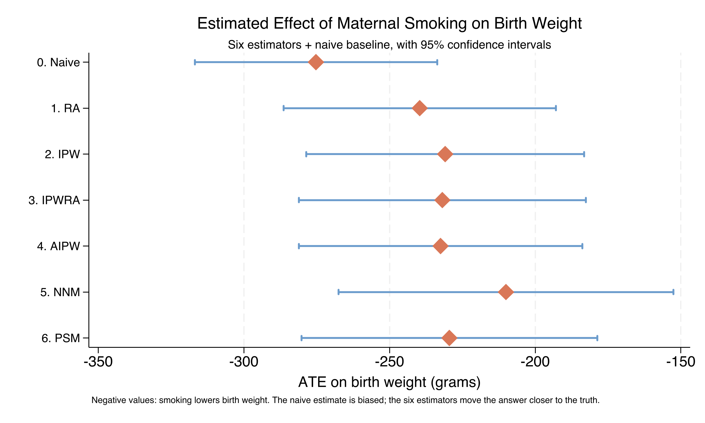

# The Tension {.divider background-color="#d97757"}

[Act I]{.act}

## Smokers' babies weigh 275 g less — but is that smoking, or who smokes?

A raw comparison says smokers' newborns are **275 grams lighter**. Striking — and almost certainly wrong as a *causal* number.

. . .

Smokers are younger, less educated, less often married, less likely to seek early prenatal care. *Each alone predicts a lighter baby.*

::: {.notes}
This is the central tension of observational causal inference. Mothers who smoke are younger, less educated, less likely to be married, and less likely to get early prenatal care — and each of those characteristics, on its own, predicts a lighter baby. The 275 g gap mixes the effect of smoking with the effect of every characteristic that differs between smokers and non-smokers. The whole tutorial is about subtracting that second piece — the selection bias — and seeing what is left.
:::

## One unadjusted shift — and we cannot yet say what causes it


::: {.notes}
Spoiler figure for Act I. Don't explain the mechanism yet — just plant that the two distributions are clearly separated, and that this picture is exactly what confounding produces. We earn the adjusted answer in Act II and resolve it in Act III.
:::

## Where we're going

::: {.incremental}
- The estimand: ATE and ATT under the potential-outcomes framework
- What makes adjustment credible: unconfoundedness + overlap
- Six estimators on four routes — outcome, treatment, both, or neither
- The payoff: do they agree, and what does it mean if they do?
:::

# The Investigation {.divider background-color="#6a9bcc"}

[Act II]{.act}

## The lab: 4,642 births, 864 smokers, six pre-treatment confounders

::: {.incremental}
- **Outcome** $Y$ — infant birth weight in grams (`bweight`)
- **Treatment** $D$ — mother smoked during pregnancy (`mbsmoke`)
- **Confounders** $X$ — age, education, marital status, prenatal care, parity, father's age
:::

[Smokers are 18.6% of the sample (864 of 4,642). The minority-treatment imbalance is exactly why a difference of means is risky.]{.comment}

::: {.notes}
cattaneo2.dta, popularized by Cattaneo (2010). These six covariates are pre-treatment by construction — the basic discipline of a credible adjustment set. The same X that drives the smoking decision also drives birth weight, which is the back-door path every estimator must block.
:::

## We want one of two averages, not one mother's effect

$$\tau_{ATE}=E[Y(1)-Y(0)] \qquad \tau_{ATT}=E[Y(1)-Y(0)\mid D=1]$$

We never see both potential outcomes for the same mother — causal inference is **a missing-data problem in disguise**.

[ATE asks "what if smoking became universal?" · ATT asks "what is happening to those who currently smoke?"]{.comment}

::: {.notes}
The fundamental problem of causal inference: for each mother we observe Y(1) or Y(0), never both. Every estimator is a different way of imputing the missing potential outcome. ATE and ATT answer different policy questions and can diverge — we see that concretely for NNM in Act III.
:::

## Adjustment is credible only under two assumptions

:::: {.columns}
::: {.column width="50%"}
### Unconfoundedness

$$\{Y(0),Y(1)\}\perp D\mid X$$

Among mothers identical on $X$, smoking is *as good as random*. Bold, and not directly testable.
:::
::: {.column width="50%"}
### Overlap

$$0<e(X)<1$$

For every covariate profile, both smokers and non-smokers exist. **Testable** — we check it.
:::
::::

[Here $e(X)=\Pr(D=1\mid X)$ is the propensity score. SUTVA — no interference, one version of treatment — rounds out the three.]{.comment}

::: {.notes}
If unconfoundedness fails, ALL six estimators are biased in the same direction, including the doubly robust ones. If overlap fails, the comparison is partly undefined. None of the methods repairs an assumption violation — they only correct for what X can see. We return to this in the Devil's-Advocate slide.
:::

## Six estimators, four routes — what does each one model?

| Estimator | Outcome? | Treatment? | Core mechanic |
|---|:--:|:--:|---|
| RA | ✓ | — | Predict $Y(1),Y(0)$, average the gap |
| IPW | — | ✓ | Reweight by $1/\hat e(X)$ |
| IPWRA | ✓ | ✓ | RA *with* IPW weights |
| AIPW | ✓ | ✓ | RA + residual correction (efficient) |
| NNM | — | — | Match on covariates (Mahalanobis) |
| PSM | — | ✓ | Match on the propensity score |

[Doubly robust (IPWRA, AIPW): consistent if *either* model is right. NNM is the only fully model-free estimator.]{.comment}

::: {.notes}
RA models only the outcome; IPW and PSM model only the treatment; IPWRA and AIPW model both. NNM fits no parametric model at all. PSM is closer to IPW than to NNM — both lean entirely on a correct propensity model. This table is the mental map we return to as each method is added.
:::

## With no controls, OLS just restates the biased −275 g gap

``` {.stata code-line-numbers="1|2"}
regress bweight mbsmoke, vce(robust)
* mbsmoke coefficient: -275.25 g  (95% CI -316.8, -233.7;  t = -12.97)
```

[A precise estimate of the *wrong* quantity — it absorbs the causal effect plus every covariate that differs between the groups.]{.comment}

::: {.notes}
This is the biased reference point: the answer if we treat observational data as a randomized experiment. R² is only 3.4% — smoking alone explains little of birth-weight variation — but the average gap is estimated very precisely thanks to n = 4,642. Every adjusted estimator pulls this number toward zero.
:::

## Regression adjustment models the outcome and shrinks −275 g to −240 g

$$\hat\tau_{RA}=\frac{1}{n}\sum_{i=1}^{n}\big[\hat\mu_1(X_i)-\hat\mu_0(X_i)\big]$$

``` {.stata code-line-numbers="1"}
teffects ra (bweight mmarried mage prenatal1 fbaby) (mbsmoke), ate
* ATE = -239.6 g   ATT = -223.3 g
```

[Fit one outcome model per arm, predict both potential outcomes for everyone, average the gap. $\hat\mu_d(X)=E[Y\mid D=d,X]$.]{.comment}

::: {.notes}
The naive −275 g has shrunk by 35.6 g (13%) just by adjusting for marital status, age, prenatal care, and parity. The by-hand recreation — two regress calls, two predicts, a difference — recovers −239.64 g, matching teffects ra to four significant figures. That is the demystification: teffects ra is not a black box.
:::

## IPW models the treatment instead — and lands at −230.9 g

$$\hat\tau_{IPW}=\frac{1}{n}\sum_i\left[\frac{D_iY_i}{\hat e(X_i)}-\frac{(1-D_i)Y_i}{1-\hat e(X_i)}\right]$$

Reweight every mother by the inverse of her propensity to smoke — the reweighted sample mimics a randomized experiment.

[RA models birth weight; IPW models smoking. They agree to within ~9 g — the first strong signal the effect is real, not a one-model artifact.]{.comment}

::: {.notes}
The survey-sampling analogy: under-represented combinations (a married 35-year-old smoker) get more weight, so the reweighted sample looks randomized. probit-IPW gives −230.9 g; the by-hand logit version gives −232.1 g, within 1.2 g — the link function barely matters here.
:::

## Both distributions span (0,1): overlap holds, so IPW is stable


::: {.notes}
This is the key IPW diagnostic. Without overlap, IPW explodes — a non-smoker with ê(X) = 0.99 would get a weight of 100 and dominate the weighted mean. Here both groups reach across the interval, so the inverse weights stay bounded and the reweighting is credible.
:::

## Doubly robust buys insurance for under a gram: −231.9 g and −232.5 g

:::: {.columns}
::: {.column width="50%"}
### IPWRA

- RA run *with* IPW weights
- ATE $=-231.9$ g
- consistent if *either* model is right
:::
::: {.column width="50%"}
### AIPW

- RA + propensity-weighted residual term
- ATE $=-232.5$ g
- attains the efficiency bound
:::
::::

[Belt and suspenders: only a *simultaneous* failure of both models breaks them. They differ by 0.6 g.]{.comment}

::: {.notes}
IPWRA combines the two models by literally running weighted regression; AIPW adds an additive correction from semiparametric efficiency theory, which gives it the smallest possible asymptotic variance among regular doubly robust estimators. If the outcome model is exactly right, AIPW's correction vanishes and it collapses to RA. AIPW is the recommended default when both models are credible. Stata's aipw reports ATE only.
:::

## NNM fits no model at all — it finds each smoker a statistical twin

$$\hat\tau_{NNM}=\frac{1}{n}\sum_i (2D_i-1)\left[Y_i-\frac{1}{M}\sum_{j\in J_M(i)}Y_j\right]$$

For every smoking mother, find her closest non-smoker(s) in covariate space by **Mahalanobis distance**, then compare birth weights.

``` {.stata code-line-numbers="1-2"}
teffects nnmatch (bweight mmarried mage fage medu prenatal1) (mbsmoke), ///
   ematch(mmarried prenatal1) biasadj(mage fage medu) ate
* ATE = -210.1 g   ATT = -238.5 g
```

::: {.notes}
J_M(i) is the set of M nearest neighbors in the opposite treatment group; (2D_i − 1) flips the sign so smokers contribute (smoker − matched non-smoker) and vice versa. ematch() forces exact matches on the discrete variables; biasadj() corrects the continuous ones. The most assumption-light estimator — it pays for that freedom with the widest CI.
:::

## PSM collapses six covariates to one score and matches on it


::: {.notes}
PSM is the simplest matching distance because it is one-dimensional: the absolute difference in propensity scores. The Rosenbaum-Rubin theorem is what licenses it — matching on the scalar ê(X) is sufficient to balance the full covariate distribution. PSM gives ATE = −229.4 g, right inside the IPW/IPWRA/AIPW cluster.
:::

# The Resolution {.divider background-color="#00d4c8"}

[Act III]{.act}

## Five very different estimators converge on roughly −230 g {background-color="#141413"}

[−230 g]{.bignum}

[RA, IPW, IPWRA, AIPW, PSM all land between −229 and −240 g; NNM the lone outlier at −210 g]{.bignum-label}

::: {.notes}
This is the headline. Five methods that model the outcome, the treatment, both, or neither — different functional forms, different covariate sets, different identification arguments — all return a number within ±10 g of each other. That insensitivity to estimator choice is the strongest evidence the −230 g neighborhood is not an artifact of one model's specification.
:::

## The forest plot: adjustment rules out the naive −275 g



::: {.notes}
Reading top to bottom: the naive baseline's CI lies entirely below every adjusted point estimate except RA (right at its upper bound). The five-method cluster sits between −229 and −240 g; NNM at −210 g has the widest CI but it overlaps every other estimator's, so the disagreement is well within sampling variation. This single picture is the most useful output of the whole exercise.
:::

## ATT can flip the story: for NNM the treated lose more, not less

| Estimator | ATE (g) | ATT (g) |
|---|---:|---:|
| RA | −239.6 | −223.3 |
| IPW | −230.9 | −219.6 |
| IPWRA | −231.9 | −220.6 |
| NNM | −210.1 | [−238.5]{.key} |
| PSM | −229.4 | −224.6 |

[Four methods: ATT closer to zero than ATE. NNM reverses it — the actual smokers sit where smoking does *more* damage.]{.comment}

::: {.notes}
AIPW reports no ATT in Stata — a software detail, not a conceptual limit. NNM's ATT > ATE is a real feature of matching on observed covariates: the matched comparison weights the covariate region where actual smokers live, and there smoking is more harmful than at the population average. Which estimand to report depends on your policy question, not on which is "more correct."
:::

## Does matching make this causal? No — two assumptions still carry it

[Objection.]{.objection} Machine-matching or reweighting controls cannot manufacture identification.

. . .

[Response.]{.rebuttal} Correct. The −230 g is identified only under **unconfoundedness given $X$** and **overlap**. The six methods discipline *how* we adjust; none rules out an unmeasured confounder — stress, income, nutrition — that drives both smoking and birth weight. Convergence is reassuring, not proof.

::: {.notes}
Steelman, don't strawman. If a hidden confounder exists, all six estimators are biased in the same direction — agreement among them does NOT detect it. The honest next step is sensitivity analysis (Rosenbaum bounds, the E-value) or an instrumental variable. The tutorial closes by pointing readers there.
:::

## When five honest routes agree, trust the −230 g over the −275 g. {.divider background-color="#141413"}

::: {.notes}
The single takeaway. Adjustment moved the answer from −275 g to roughly −230 g and five very different estimators agreed there — but that convergence is conditional on unconfoundedness, which no estimator can verify. Report the estimand, check overlap, and stress-test the result against the confounders you could not measure.
:::
