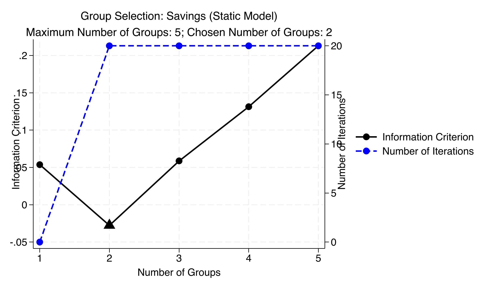
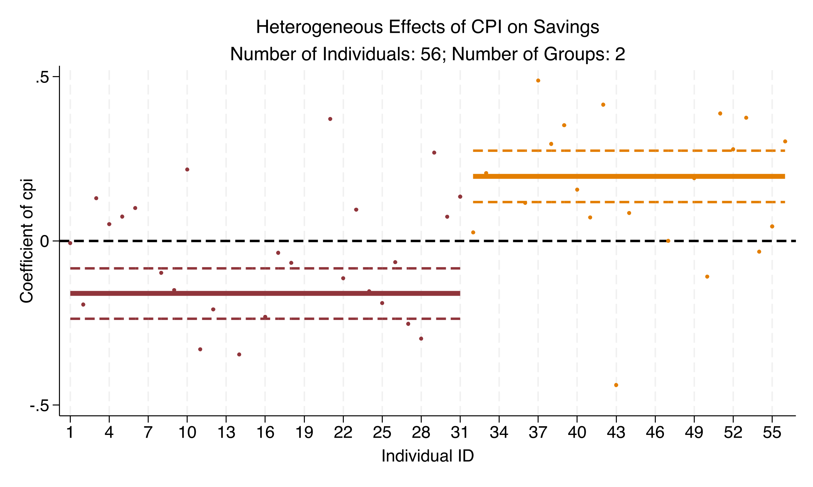
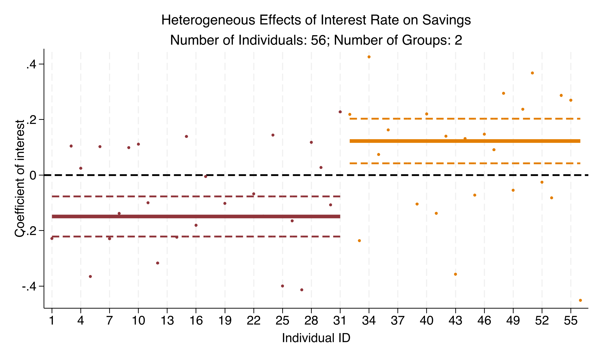
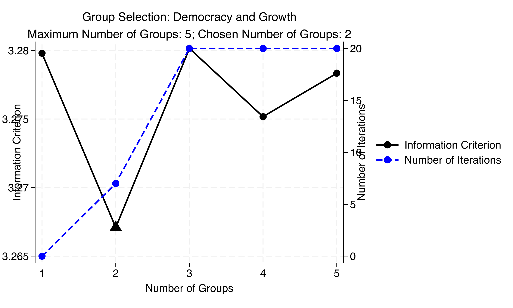
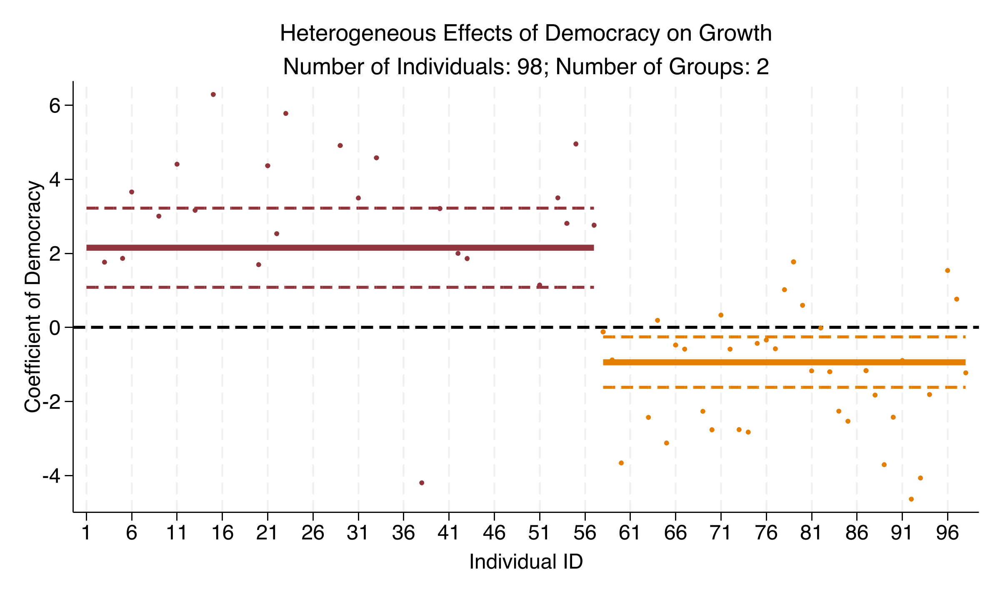

---
authors:
  - admin
categories:
  - Stata
  - LASSO
  - Panel Data
draft: false
featured: false
date: "2026-04-04T00:00:00Z"
external_link: ""
image:
  caption: ""
  focal_point: Smart
  placement: 3
links:
- icon: chalkboard-teacher
  icon_pack: fas
  name: "Slides (HTML)"
  url: slides/index.html
- icon: laptop-code
  icon_pack: fas
  name: "Web app"
  url: web_app/index.html
- icon: file-code
  icon_pack: fas
  name: "Stata do-file"
  url: analysis.do
- icon: book
  icon_pack: fas
  name: "Data dictionary"
  url: data/index.html
- icon: file-alt
  icon_pack: fas
  name: "Stata log"
  url: analysis.log
- icon: markdown
  icon_pack: fab
  name: "MD version"
  url: https://raw.githubusercontent.com/cmg777/starter-academic-v501/master/content/post/stata_panel_lasso_cluster/index.md
slides:
summary: Identify latent group structures in panel data using the Classifier-LASSO method (Su, Shi, Phillips 2016), revealing that the pooled democracy-growth effect of +1.055 masks a +2.151 effect in 57 countries and a -0.936 effect in 41 countries.
tags:
  - stata
  - panel
  - econometrics
  - world
  - panel data
title: "Identifying Latent Group Structures in Panel Data: The classifylasso Command in Stata"
url_code: ""
url_pdf: ""
url_slides: ""
url_video: ""
toc: true
diagram: true
---

## Abstract

Standard panel-data models force every unit to share the same slope coefficients, a homogeneity assumption that can disguise opposing behavioral responses behind a misleading average. This tutorial demonstrates the Classifier-LASSO (C-LASSO) method of Su, Shi, and Phillips (2016) to discover latent group structures in which countries within a group share slopes while groups differ, implemented through the `classifylasso` Stata command (Huang, Wang, and Zhou 2024). Two applications are used: a balanced panel of 56 countries observed over 15 years (840 observations, 1995—2010) on savings behavior, and a panel of 98 countries from 1970 to 2010 (4,018 observations) on democracy and growth. The method jointly estimates the number of groups, group memberships, and group-specific coefficients via penalized least squares, selecting the number of groups by an information criterion (consistently K = 2), using a postlasso step for valid inference and a half-panel jackknife to correct Nickell bias in dynamic specifications. In the dynamic savings model, CPI inflation reverses sign across groups (−0.160 in Group 1 versus +0.197 in Group 2, both p < 0.001), reconciling the insignificant pooled estimate of +0.030, while within R-squared rises from 0.20—0.24 (static) to 0.44—0.50 (dynamic). For democracy, the pooled fixed-effects effect of +1.055 (p = 0.005) masks a +2.151 effect in 57 countries (p < 0.001) and a −0.936 effect in 41 countries (p = 0.007) — a genuine sign reversal exemplifying Simpson's paradox. The implication is that pooled estimates can be qualitatively wrong, and C-LASSO offers a principled middle ground between fully homogeneous and fully heterogeneous panel models.

## 1. Overview

Do all countries respond the same way to inflation? To interest rates? To democratic transitions? Most panel data models assume yes. They force every country to share the same slope coefficients. That is a strong assumption --- and often a wrong one.

Here is a preview of what we will discover. When we estimate the effect of inflation on savings across 56 countries, the pooled model says: "no significant effect." But that average is a lie. One group of countries saves *less* when inflation rises. Another group saves *more*. The pooled estimate averages a negative and a positive effect, producing a misleading zero.

The **Classifier-LASSO** (C-LASSO) method solves this problem. Developed by Su, Shi, and Phillips (2016), it discovers **latent groups** in your panel data. Countries within each group share the same coefficients. Countries across groups can differ. Think of it like a sorting hat: rather than treating all countries as identical or all as unique, C-LASSO sorts them into a small number of groups with shared behavioral patterns.

This tutorial demonstrates the `classifylasso` Stata command (Huang, Wang, and Zhou 2024) with two applications:

1. **Savings behavior** across 56 countries (1995--2010) --- where inflation affects savings in *opposite directions* depending on the country group
2. **Democracy and economic growth** across 98 countries (1970--2010) --- where the pooled estimate of +1.05 masks a split of +2.15 in one group and -0.94 in another

**Learning objectives:**

- Understand why assuming homogeneous slopes can be misleading in panel data
- Learn the Classifier-LASSO method for identifying latent group structures
- Implement `classifylasso` in Stata with both static and dynamic specifications
- Use postestimation commands (`classogroup`, `classocoef`, `predict gid`) to visualize and interpret results
- Compare pooled fixed-effects estimates with group-specific C-LASSO estimates

The diagram below maps the tutorial's progression. We start simple and build complexity step by step.


### Key concepts at a glance

The post leans on a small vocabulary repeatedly. The rest of the tutorial assumes you can move between these terms quickly. Each concept below has three parts. The **definition** is always visible. The **example** and **analogy** sit behind clickable cards: open them when you need them, leave them collapsed for a quick scan. If a later section mentions "latent groups" or "Nickell bias" and the term feels slippery, this is the section to re-read.

**1. Slope heterogeneity** $\boldsymbol{\beta}\_i$ varies by $i$.
The slope coefficient on a regressor differs across units. Pooled regressions impose a single slope; if the truth is heterogeneous, the pooled slope is a contaminated average. C-LASSO discovers groups that share slopes.

<div class="concept-pair">
<details class="concept-card concept-example">
<summary>Example</summary>

In the savings application, `cpi` has a *negative* slope for one group of countries and a *positive* slope for another. The Static C-LASSO Group 1 coefficient on `cpi` is **-0.181** (p < 0.001) and the Group 2 coefficient is **+0.478** (p < 0.001). The pooled slope masks both signs. Slope heterogeneity is the headline phenomenon — countries differ qualitatively, not just quantitatively.

</details>

<details class="concept-card concept-analogy">
<summary>Analogy</summary>

Different recipes for different countries. One country adds salt for sweetness; another adds salt for savouriness. Averaging "salt effect on taste" across both gives a misleading near-zero. Heterogeneity says: there are at least two recipes hidden inside.

</details>
</div>

**2. Latent groups** $G\_k$, with $\boldsymbol{\beta}\_i = \boldsymbol{\alpha}\_k$.
Unobserved subsets of units that share the same slope vector. Latent because the group membership is not observed in advance — the algorithm discovers it. Each unit belongs to exactly one group.

<div class="concept-pair">
<details class="concept-card concept-example">
<summary>Example</summary>

C-LASSO with K = 2 partitions the 56 countries (840 obs over 15 years) into two groups based on their savings dynamics. Group 1 has `cpi` coefficient -0.181 (high-inflation-erodes-savings story); Group 2 has +0.478 (high-inflation-encourages-savings story). The grouping is learned from the data, not imposed.

</details>

<details class="concept-card concept-analogy">
<summary>Analogy</summary>

Teams whose roster is hidden until the match starts. The coach knows there are two teams; they do not know who plays for whom. The data tells you the rosters.

</details>
</div>

**3. LASSO penalty** $\lambda$ (regularization).
A tuning parameter that shrinks coefficients toward a common value (or toward zero). In C-LASSO it shrinks individual slopes $\boldsymbol{\beta}\_i$ toward group centres $\boldsymbol{\alpha}\_k$. Forces parsimony: without the penalty, every unit would have its own unique slope.

<div class="concept-pair">
<details class="concept-card concept-example">
<summary>Example</summary>

This post sweeps over a grid of $\lambda$ values and selects the one minimizing an information criterion. Higher $\lambda$ collapses more individual slopes onto fewer group centres; lower $\lambda$ allows more idiosyncratic variation across the 56 countries.

</details>

<details class="concept-card concept-analogy">
<summary>Analogy</summary>

A tax on unique flavour. Each restaurant wants its own recipe. The penalty taxes deviations from the chain template. Set the tax high — every restaurant ends up using the chain's recipe. Set it low — every restaurant has its own.

</details>
</div>

**4. Classifier-LASSO (C-LASSO).**
The estimator. Jointly estimates the number of groups, the group memberships, and the group-specific slopes. Su, Shi & Phillips (2016) introduced it for panel data. Implements as a penalized least squares with a product-form penalty over groups.

<div class="concept-pair">
<details class="concept-card concept-example">
<summary>Example</summary>

This post's bespoke C-LASSO code receives the candidate K's and returns the optimal partition plus group slopes. For the democracy application (98 countries × ~41 years = 4,018 obs), C-LASSO splits countries into two groups with opposite-signed `Democracy` effects on `lnPGDP` — Group 1 = +2.151 (p < 0.001), Group 2 = -0.936 (p = 0.007).

</details>

<details class="concept-card concept-analogy">
<summary>Analogy</summary>

A casting director who simultaneously picks teams *and* assigns recipes. The director does not know in advance how many teams to form or who plays for whom. C-LASSO solves both questions in one optimization.

</details>
</div>

**5. Information criterion (IC).**
A statistic balancing model fit (how well the chosen partition explains the data) against complexity (more groups = better fit but more parameters). Used to select the optimal number of groups $K$. Choose the K that minimizes IC.

<div class="concept-pair">
<details class="concept-card concept-example">
<summary>Example</summary>

This post computes IC for K = 1, 2, 3, 4. **K = 2 minimizes the IC** for both the savings and democracy applications. Adding a third group does not pay for itself — the marginal fit gain is too small to offset the parameter cost.

</details>

<details class="concept-card concept-analogy">
<summary>Analogy</summary>

The fit-vs-complexity referee. The referee charges you a penalty for each new group you add. If the new group fits the data well enough to overcome its penalty, keep it. Otherwise drop it.

</details>
</div>

**6. Postlasso step.**
A second-stage estimator that re-runs OLS on each estimated group *without* the penalty. Used for valid inference (standard errors, p-values, CIs). The penalized stage selects the partition; the postlasso stage delivers the inference.

<div class="concept-pair">
<details class="concept-card concept-example">
<summary>Example</summary>

After C-LASSO assigns countries to groups, the post re-runs `xtreg, fe` on each group. The reported `cpi` coefficients (-0.181 in Group 1, +0.478 in Group 2) are postlasso estimates with proper standard errors. Both significant at p < 0.001.

</details>

<details class="concept-card concept-analogy">
<summary>Analogy</summary>

Re-tasting after the casting freezes. Once the teams are set, you taste each team's dish on its own merits — no penalty for being unique within the team. The team's recipe is now its own.

</details>
</div>

**7. Nickell bias.**
The downward bias of the lagged-DV coefficient when fixed effects are applied to short panels. Within-demeaning correlates the lagged regressor with the demeaned error. C-LASSO with `lagsavings` inherits this problem and uses jackknife correction in the dynamic specification.

<div class="concept-pair">
<details class="concept-card concept-example">
<summary>Example</summary>

The dynamic savings model includes `lagsavings`. With $T \approx 15$ in the savings panel (56 countries × 15 years), plain FE on the lagged DV would underestimate persistence. The post applies a half-jackknife bias correction (Hsiao 1986; Hahn & Kuersteiner 2002) before running C-LASSO.

</details>

<details class="concept-card concept-analogy">
<summary>Analogy</summary>

A watermark on dynamic panels. Every fixed-effects estimate of the lagged-DV slope carries the watermark. The correction is the digital wash that removes it.

</details>
</div>

**8. Mean group estimator (MG).**
The benchmark "fully heterogeneous" estimator. Run a separate OLS for each unit; average the coefficients across units. Gives every unit its own slope. The opposite extreme from pooled OLS.

<div class="concept-pair">
<details class="concept-card concept-example">
<summary>Example</summary>

This post compares pooled OLS, MG, and C-LASSO. Pooled OLS imposes one slope (e.g. democracy effect on `lnPGDP` = +1.055, p = 0.005). MG allows 98 country-specific slopes. C-LASSO sits in the middle: K = 2 group slopes (+2.151 and -0.936). K = 2 captures most of the heterogeneity without the noise of fully unit-specific estimates.

</details>

<details class="concept-card concept-analogy">
<summary>Analogy</summary>

"Let every country have its own recipe" with no group structure. MG is the fully-permissive limit. C-LASSO chooses a parsimonious alternative.

</details>
</div>

---

## 2. The Problem: Homogeneous vs Heterogeneous Slopes

### 2.1 Three approaches to slope heterogeneity

Imagine 56 students taking the same exam. **Approach 1** assumes they all studied the same way --- one average study strategy explains everyone's score. **Approach 2** gives each student a unique strategy --- but with only a few data points per student, the estimates are noisy. **Approach 3** (C-LASSO) discovers that students naturally fall into 2--3 study groups. Students within a group share the same strategy. Students across groups differ.

The same logic applies to panel data. The standard fixed-effects model is:

$$y\_{it} = \mu\_i + \boldsymbol{\beta}' \mathbf{x}\_{it} + u\_{it}$$

Here, $y\_{it}$ is the outcome for country $i$ at time $t$. The term $\mu\_i$ captures country-specific intercepts (fixed effects). The slope vector $\boldsymbol{\beta}$ links the regressors $\mathbf{x}\_{it}$ to the outcome. The critical assumption: $\boldsymbol{\beta}$ is the **same for all countries**. Japan and Nigeria get the same coefficient on inflation. That may be wrong.

At the other extreme, we could run separate regressions for each country. But with only $T = 15$ time periods per country, individual estimates are noisy. We lose statistical power.

C-LASSO introduces a middle ground. It assumes countries belong to $K$ latent groups:

$$\boldsymbol{\beta}\_i = \boldsymbol{\alpha}\_k \quad \text{if} \quad i \in G\_k, \quad k = 1, \ldots, K$$

In words, country $i$ gets the slope coefficients of its group $G\_k$. The method estimates three things simultaneously: the number of groups $K$, which countries belong to which group, and each group's coefficients $\boldsymbol{\alpha}\_k$. You do not need to specify the groups in advance. The data reveals them.

### 2.2 Why not just use K-means?

A natural question: why not run individual regressions first and then cluster the coefficients with K-means? C-LASSO has two advantages. First, it estimates group membership and coefficients **jointly**. A two-step approach (estimate, then cluster) propagates first-stage errors into the grouping. Second, C-LASSO's penalty structure naturally pulls similar countries toward the same group. It is a statistically principled sorting mechanism, not an ad-hoc post-processing step.

---

## 3. The Classifier-LASSO Method

### 3.1 The C-LASSO objective function

C-LASSO minimizes a penalized least-squares objective:

$$Q\_{NT,\lambda}^{(K)} = \frac{1}{NT} \sum\_{i=1}^{N} \sum\_{t=1}^{T} (y\_{it} - \boldsymbol{\beta}\_i' \mathbf{x}\_{it})^2 + \frac{\lambda\_{NT}}{N} \sum\_{i=1}^{N} \prod\_{k=1}^{K} \|\boldsymbol{\beta}\_i - \boldsymbol{\alpha}\_k\|$$

The first term is the standard sum of squared residuals. It measures how well the model fits the data. The second term is the **penalty**. It encourages each country's coefficients $\boldsymbol{\beta}\_i$ to be close to one of the group centers $\boldsymbol{\alpha}\_k$.

Think of each group center as a **planet with gravitational pull**. If a country's coefficients are close to *any* planet, the product $\prod\_k \|\boldsymbol{\beta}\_i - \boldsymbol{\alpha}\_k\|$ shrinks toward zero. The penalty becomes small. The country gets pulled into that group. If the coefficients are far from all planets, the penalty stays large. The tuning parameter $\lambda\_{NT} = c\_\lambda T^{-1/3}$ controls how strong this gravitational pull is.

### 3.2 Three-step estimation procedure

The `classifylasso` command works in three steps:

1. **Sort countries into groups.** For each candidate number of groups $K$, the algorithm iteratively updates group centers and reassigns countries until convergence. Starting values come from unit-by-unit regressions.

2. **Re-estimate within groups (postlasso).** The LASSO penalty biases the coefficient estimates. So after sorting, we discard the penalized estimates and re-run plain OLS within each group. Think of it like a talent show: LASSO is the audition that selects who is in which group, but the final performance (the coefficient estimates) is unpenalized. This postlasso step gives us valid standard errors and confidence intervals.

3. **Pick the best $K$ (information criterion).** How many groups are there? The command tests $K = 1, 2, \ldots, K\_{\max}$ and picks the $K$ that minimizes an information criterion. The IC acts like a **referee** balancing two concerns: fit (more groups fit better) and complexity (more groups risk overfitting). It works like AIC or BIC. The tuning parameter $\rho\_{NT} = c\_\rho (NT)^{-1/2}$ controls how harshly the referee penalizes extra groups.

### 3.3 Dynamic panels and Nickell bias

What if your model includes a lagged dependent variable, like $y\_{i,t-1}$? This creates a problem called **Nickell bias**. When you demean the data to remove fixed effects, the demeaned lagged outcome becomes correlated with the demeaned error. The result: biased coefficients.

The `classifylasso` command offers a `dynamic` option to fix this. It uses the **half-panel jackknife** (Dhaene and Jochmans 2015). The idea is simple: split the time series in half. Estimate the model on each half. Combine the two estimates in a way that cancels the bias. Problem solved.

Now that we understand the method, let's apply it to real data.

---

## 4. Data Exploration: Savings

### 4.1 Load and describe the data

Our first application uses a panel of 56 countries over 15 years, from Su, Shi, and Phillips (2016). The outcome is the savings-to-GDP ratio. The regressors are lagged savings, CPI inflation, real interest rates, and GDP growth.

```stata
use "https://github.com/cmg777/starter-academic-v501/raw/master/content/post/stata_panel_lasso_cluster/refMaterials/saving.dta", clear
xtset code year
summarize savings lagsavings cpi interest gdp
```

```text
    Variable |        Obs        Mean    Std. dev.       Min        Max
-------------+---------------------------------------------------------
     savings |        840   -2.87e-08    1.000596  -2.495871   2.893858
  lagsavings |        840    5.81e-08    1.000596  -2.832278    2.91508
         cpi |        840    3.56e-09    1.000596  -2.773791   3.548945
    interest |        840   -7.17e-09    1.000596  -3.600348   3.277582
         gdp |        840    1.06e-08    1.000596  -3.554419   2.461317
```

The panel is strongly balanced: 56 countries $\times$ 15 years = 840 observations. All variables are standardized to mean zero and standard deviation one. This means coefficients are in standard-deviation units. A coefficient of 0.18 means "a one-SD increase in CPI is associated with a 0.18-SD change in savings." The balanced structure matters: C-LASSO requires all countries to be observed in all time periods.

### 4.2 Visualize cross-country heterogeneity

Before running any regressions, it helps to visualize how savings trajectories differ across countries. The `xtline` command overlays all 56 country lines on a single plot:

```stata
xtline savings, overlay ///
    title("Savings-to-GDP Ratio Across 56 Countries", size(medium)) ///
    subtitle("Each line represents one country", size(small)) ///
    ytitle("Savings / GDP") xtitle("Year") legend(off)
graph export "stata_panel_lasso_cluster_fig1_savings_scatter.png", replace width(2400)
```


*Figure 1: Savings-to-GDP ratio across 56 countries (1995--2010). Each line represents one country, revealing substantial heterogeneity in savings dynamics.*

The spaghetti plot tells a clear story: countries do not move in lockstep. Some maintain positive savings ratios throughout. Others swing below zero. The lines diverge, cross, and cluster --- suggesting that different countries follow fundamentally different savings dynamics. This is exactly the kind of heterogeneity that C-LASSO is designed to detect. Perhaps subsets of countries share similar responses, even if the full panel does not.

But first, let's see what the standard models say.

---

## 5. Baseline: Pooled and Fixed Effects Regressions

Before applying C-LASSO, we establish a benchmark by estimating the standard pooled OLS and fixed-effects models. These models assume that all 56 countries share the same slope coefficients.

```stata
* Pooled OLS
regress savings lagsavings cpi interest gdp

* Standard Fixed Effects
xtreg savings lagsavings cpi interest gdp, fe

* Robust Fixed Effects (reghdfe)
reghdfe savings lagsavings cpi interest gdp, absorb(code) vce(robust)
```

```text
                 Pooled OLS     FE (robust)
lagsavings           0.6051         0.6051
cpi                  0.0301         0.0301
interest             0.0059         0.0059
gdp                  0.1882         0.1882
```

The pooled OLS and fixed-effects estimates are virtually identical. R-squared is 0.438. Lagged savings dominates (coefficient 0.605, $p < 0.001$). GDP growth matters too (0.188, $p < 0.001$).

Now look at the two remaining variables. CPI: 0.030. Interest rate: 0.006. Both statistically insignificant. A textbook conclusion would be: "Inflation and interest rates do not affect savings."

But what if the average is lying? Imagine a city where half the neighborhoods warm up by 5 degrees and the other half cool down by 5 degrees. The citywide average temperature change is zero. A meteorologist reporting "no change" would be wrong --- there *are* changes, just in opposite directions. This is exactly what we will discover with C-LASSO.

---

## 6. Classifier-LASSO: Savings, Static Model

### 6.1 Estimation

We start with the simplest C-LASSO specification: a static model without the lagged dependent variable. This lets us focus on the core mechanics before adding complexity.

```stata
classifylasso savings cpi interest gdp, grouplist(1/5) tolerance(1e-4)
```

The command searches over $K = 1$ to $K = 5$ groups and reports the information criterion (IC) for each:

```text
Estimation 1: Group Number = 1; IC = 0.054
Estimation 2: Group Number = 2; IC = -0.028  ← minimum
Estimation 3: Group Number = 3; IC = 0.059
Estimation 4: Group Number = 4; IC = 0.131
Estimation 5: Group Number = 5; IC = 0.213
* Selected Group Number: 2
```

The IC is minimized at $K = 2$, with values rising monotonically from $K = 3$ onward. This clear U-shape provides strong evidence for exactly two latent groups in the data.

### 6.2 Group-specific coefficients

```stata
classoselect, postselection
predict gid_static, gid
tabulate gid_static
```

```text
Group 1 (34 countries, 510 obs):  Within R-sq. = 0.2019
         cpi |  -0.1813   (z = -4.29, p < 0.001)
    interest |  -0.1966   (z = -4.64, p < 0.001)
         gdp |   0.3346   (z =  7.98, p < 0.001)

Group 2 (22 countries, 330 obs):  Within R-sq. = 0.2369
         cpi |   0.4781   (z =  9.10, p < 0.001)
    interest |   0.2631   (z =  5.01, p < 0.001)
         gdp |   0.1117   (z =  2.23, p = 0.026)
```

The results are striking. Look at CPI.

In **Group 1** (34 countries), higher inflation *reduces* savings: coefficient $-0.181$ ($p < 0.001$). In **Group 2** (22 countries), higher inflation *increases* savings: coefficient $+0.478$ ($p < 0.001$). The sign flips completely.

The same reversal appears for the interest rate: $-0.197$ in Group 1 versus $+0.263$ in Group 2.

Now the pooled CPI coefficient of $+0.030$ makes sense. It was averaging $-0.181$ and $+0.478$ --- a negative and a positive effect canceling each other out. The "insignificant" result was not evidence of no effect. It was evidence of **two opposing effects** hidden inside the average.

Why the reversal? In Group 1, higher inflation erodes the real value of savings, discouraging people from saving. In Group 2, higher inflation may trigger **precautionary savings** --- households save *more* precisely because the economic environment feels uncertain. Same macroeconomic shock, opposite behavioral response.

### 6.3 Group selection plot

```stata
classogroup
graph export "stata_panel_lasso_cluster_fig2_group_selection_static.png", replace width(2400)
```


*Figure 2: Group selection for the static savings model. The information criterion (left axis) is minimized at K=2, with a clear U-shape from K=3 onward.*

The triangle marks the IC minimum at $K = 2$. The left axis shows IC values; the right axis shows iterations to convergence. Notice: $K = 2$ converged quickly (about 3 iterations). Models with $K \geq 3$ hit the maximum 20 iterations. When the algorithm struggles to converge, it is a sign of overparameterization --- too many groups for the data to support.

So far, we have found two groups with a static model. But we omitted lagged savings. Let's add it back.

---

## 7. Classifier-LASSO: Savings, Dynamic Model

### 7.1 Adding the lagged dependent variable

Savings are highly persistent. The pooled coefficient on `lagsavings` was 0.605 --- a country's savings this year strongly predicts its savings next year. Omitting this variable may bias everything else. We now add it back and replicate Su, Shi, and Phillips (2016). The `dynamic` option activates the half-panel jackknife to correct Nickell bias.

```stata
use "https://github.com/cmg777/starter-academic-v501/raw/master/content/post/stata_panel_lasso_cluster/refMaterials/saving.dta", clear
xtset code year
classifylasso savings lagsavings cpi interest gdp, ///
    grouplist(1/5) lambda(1.5485) tolerance(1e-4) dynamic
```

```text
* Selected Group Number: 2
The algorithm takes 9min57s.

Group 1 (31 countries, 465 obs):  Within R-sq. = 0.4988
  lagsavings |   0.6952   (z = 18.15, p < 0.001)
         cpi |  -0.1602   (z = -4.09, p < 0.001)
    interest |  -0.1490   (z = -4.04, p < 0.001)
         gdp |   0.2892   (z =  7.62, p < 0.001)

Group 2 (25 countries, 375 obs):  Within R-sq. = 0.4372
  lagsavings |   0.6939   (z = 19.45, p < 0.001)
         cpi |   0.1967   (z =  4.93, p < 0.001)
    interest |   0.1225   (z =  2.98, p = 0.003)
         gdp |   0.1127   (z =  2.38, p = 0.018)
```

Again, C-LASSO selects $K = 2$ groups. The sign reversal on CPI survives: $-0.160$ in Group 1 versus $+0.197$ in Group 2. Same for the interest rate: $-0.149$ versus $+0.123$.

Here is what is interesting about the `lagsavings` coefficient. Both groups show nearly identical persistence: 0.695 in Group 1 and 0.694 in Group 2. Think of it like a speedometer. Both groups of countries cruise at the same speed (savings persistence). But they swerve in opposite directions when they hit a pothole (an inflation or interest rate shock). The heterogeneity is about *reactions to shocks*, not about baseline behavior.

Adding lagged savings also improved the fit. Within R-squared jumped from 0.20--0.24 (static) to 0.44--0.50 (dynamic). The lagged variable clearly matters.

### 7.2 Coefficient plots

The `classocoef` postestimation command visualizes group-specific coefficients with 95% confidence bands:

```stata
classocoef cpi
graph export "stata_panel_lasso_cluster_fig3_coef_cpi.png", replace width(2400)

classocoef interest
graph export "stata_panel_lasso_cluster_fig4_coef_interest.png", replace width(2400)
```


*Figure 3: Heterogeneous effects of CPI on savings. Group 1 (31 countries) shows a negative effect; Group 2 (25 countries) shows a positive effect. Confidence bands do not overlap.*

This is the "smoking gun" figure. The two horizontal lines are the group-specific coefficients. The dashed lines show 95% confidence bands. The bands do not overlap. This is not a marginal difference. It is a robust sign reversal.

For 31 countries (Group 1), higher inflation reduces savings ($-0.160$, $p < 0.001$). For 25 countries (Group 2), higher inflation increases savings ($+0.197$, $p < 0.001$). A pooled model averages these opposing forces and finds CPI "insignificant." That is aggregation bias at work.


*Figure 4: Heterogeneous effects of the interest rate on savings. The same sign reversal pattern as CPI: negative in Group 1, positive in Group 2.*

The interest rate tells the same story. Group 1 countries save *less* when rates rise ($-0.149$). Group 2 countries save *more* ($+0.123$).

Why? One interpretation: in Group 1 (more developed financial markets), higher returns make consumption more attractive --- the **substitution effect** dominates. In Group 2 (limited financial access), higher returns make saving more rewarding --- the **income effect** dominates.

We have now established that latent groups exist in savings data. The next question: does the same pattern appear in a completely different economic context?

---

## 8. Democracy Application: Does Democracy Cause Growth?

### 8.1 The Acemoglu et al. (2019) question

"Democracy does cause growth." That is the title of a famous 2019 paper by Acemoglu, Naidu, Restrepo, and Robinson in the *Journal of Political Economy*. Their evidence: a pooled two-way fixed-effects model with lagged GDP finds a positive, significant effect.

But we have learned to be skeptical of pooled estimates. Does this average apply to all 98 countries? Or does it mask the same kind of sign reversal we found in savings?

### 8.2 Data exploration

```stata
use "https://github.com/cmg777/starter-academic-v501/raw/master/content/post/stata_panel_lasso_cluster/refMaterials/democracy.dta", clear
xtset country year
summarize lnPGDP Democracy ly1
tabulate Democracy
```

```text
    Variable |        Obs        Mean    Std. dev.       Min        Max
-------------+---------------------------------------------------------
      lnPGDP |      4,018    758.5558    162.9137   405.6728   1094.003
   Democracy |      4,018    .5450473    .4980286          0          1
         ly1 |      3,920    757.7754    162.6702   405.6728   1094.003

  Democracy |      Freq.     Percent
------------+-----------------------------------
          0 |      1,828       45.50
          1 |      2,190       54.50
```

The panel covers 98 countries from 1970 to 2010 --- 4,018 observations. The binary `Democracy` indicator is 1 for democratic country-years and 0 otherwise. About 55% of observations are democratic, reflecting the global wave of democratization. The dependent variable `lnPGDP` (log per-capita GDP, scaled) ranges from 406 to 1,094 --- the full spectrum from low-income to high-income countries.

### 8.3 Pooled fixed-effects benchmark

```stata
reghdfe lnPGDP Democracy ly1, absorb(country year) cluster(country)
```

```text
HDFE Linear regression                            Number of obs   =      3,920
                                                  R-squared       =     0.9991
                                                  Within R-sq.    =     0.9607

                               (Std. err. adjusted for 98 clusters in country)
      lnPGDP | Coefficient  Robust std. err.      t    P>|t|
   Democracy |   1.054992    .369806          2.85   0.005
         ly1 |    .970495   .0059964        161.85   0.000
```

Democracy is associated with a 1.055-unit increase in log per-capita GDP ($p = 0.005$, clustered SE = 0.370). Lagged GDP has a coefficient of 0.970 --- strong persistence. This replicates Acemoglu et al. (2019): on average, democracy promotes growth.

On average. But we already know what "on average" can hide. Let's run C-LASSO.

### 8.4 C-LASSO: revealing the heterogeneity

```stata
classifylasso lnPGDP Democracy ly1, ///
    grouplist(1/5) rho(0.2) absorb(country year) ///
    cluster(country) dynamic optmaxiter(300)
```

```text
* Selected Group Number: 2
The algorithm takes 2h33min41s.

Group 1 (57 countries, 2,280 obs):  Within R-sq. = 0.9609
   Democracy |   2.151397   (z = 3.94, p < 0.001)
         ly1 |   1.032752   (z = 149.97, p < 0.001)

Group 2 (41 countries, 1,640 obs):  Within R-sq. = 0.9538
   Democracy |  -0.935589   (z = -2.69, p = 0.007)
         ly1 |   0.979327   (z = 95.73, p < 0.001)
```

This is the tutorial's most striking finding.

The pooled coefficient of $+1.055$ is **not representative of any actual country group**. It is a weighted average of two fundamentally different effects:

- **Group 1** (57 countries): democracy effect = $+2.151$ ($p < 0.001$). More than twice the pooled estimate.
- **Group 2** (41 countries): democracy effect = $-0.936$ ($p = 0.007$). Negative and significant.

The coefficient literally changes sign. For 58% of countries, democratic transitions are associated with GDP gains. For the remaining 42%, they are associated with GDP declines. The pooled model sees one number. C-LASSO sees two stories.

Note: these are conditional associations within the panel model. A causal interpretation requires the same identifying assumptions as Acemoglu et al. (2019).

### 8.5 Visualizing the democracy-growth split

```stata
classogroup
graph export "stata_panel_lasso_cluster_fig5_democracy_selection.png", replace width(2400)

classocoef Democracy
graph export "stata_panel_lasso_cluster_fig6_democracy_coef.png", replace width(2400)
```


*Figure 5: Group selection for the democracy-growth model. IC is minimized at K=2, though values are close across all K (range 3.267--3.280).*

The IC selects $K = 2$. But look closely: the IC values range from 3.267 to 3.280 --- a span of just 0.013. The 2-group structure is optimal but not overwhelmingly so. This is a useful reminder: always check sensitivity to the tuning parameter $\rho$.


*Figure 6: Heterogeneous effects of democracy on economic growth. Group 1 (57 countries) shows a positive effect (+2.15); Group 2 (41 countries) shows a negative effect (-0.94). The pooled estimate of +1.05 describes neither group.*

This is the key figure of the tutorial. Each dot is one country's individual coefficient estimate. The horizontal lines show group-specific postlasso estimates with 95% confidence bands.

The polarization is unmistakable. Group 1 (left cluster): strongly positive. Group 2 (right cluster): negative. Neither group's confidence band crosses zero. Both effects are statistically significant.

This is not "some countries benefit, others see no effect." It is a genuine sign reversal. Democracy is associated with growth in one group and with decline in another.

---

## 9. Comparison: What the Pooled Model Misses

### 9.1 Summary table

| | Pooled FE | C-LASSO Group 1 | C-LASSO Group 2 |
|---|---|---|---|
| **Democracy coefficient** | +1.055 | +2.151 | -0.936 |
| **Standard error** | 0.370 | 0.546 | 0.348 |
| **p-value** | 0.005 | < 0.001 | 0.007 |
| **Lagged GDP** | 0.970 | 1.033 | 0.979 |
| **Countries** | 98 | 57 | 41 |
| **Observations** | 3,920 | 2,280 | 1,640 |

### 9.2 Simpson's paradox in panel data

This is **Simpson's paradox** --- the phenomenon where a trend that appears in aggregated data reverses when you look at subgroups.

Here is a concrete analogy. A hospital treats two types of patients: mild cases and severe cases. For mild cases, Treatment A has a higher survival rate. For severe cases, Treatment A also has a higher survival rate. But when you pool all patients together, Treatment B appears better --- because it treats a disproportionate number of mild (easy) cases. The aggregate reverses the subgroup trend.

The same thing happened here. The pooled democracy estimate of $+1.055$ sits between $+2.151$ and $-0.936$. It describes neither group accurately. A policymaker relying on the pooled result would conclude that democracy universally promotes growth. They would miss that for 41 countries (42% of the sample), the relationship runs in the opposite direction.

The savings model showed the same pattern. The insignificant pooled CPI coefficient ($+0.030$) masked significant effects of $-0.160$ and $+0.197$. When effects have opposite signs, pooling does not just underestimate the magnitude. It produces a qualitatively wrong conclusion.

### 9.3 Robustness of the group structure

Across all three C-LASSO specifications --- static savings, dynamic savings, and democracy --- the IC consistently selected $K = 2$ groups. The CPI sign reversal survived the switch from static to dynamic, despite a shift in group composition (34/22 to 31/25). This consistency suggests the latent groups are real structural features of the data, not artifacts of a particular specification.

---

## 10. Summary and Takeaways

### 10.1 What we learned

- **Pooled estimates can be misleading.** The insignificant pooled CPI coefficient ($+0.030$) in the savings model masked opposing effects of $-0.160$ and $+0.197$ in two latent groups. The pooled democracy coefficient ($+1.055$) masked a split of $+2.151$ versus $-0.936$.

- **C-LASSO finds latent groups.** In all three specifications, the information criterion selected $K = 2$ groups, revealing binary latent structures in both datasets. The `classifylasso` command handles the full workflow: estimation, group selection, and postestimation.

- **The `dynamic` option corrects Nickell bias.** When lagged dependent variables are included, the half-panel jackknife bias correction preserves the group structure while improving within-group R-squared (from 0.20--0.24 in the static model to 0.44--0.50 in the dynamic model).

- **Postestimation tools aid interpretation.** The `classogroup` command visualizes the information criterion, `classocoef` plots group-specific coefficients with confidence bands, and `predict gid` assigns countries to groups.

### 10.2 Limitations

Three caveats. First, the IC values in the democracy model were very close across $K = 1$ through $K = 5$ (range 3.267--3.280). The 2-group structure is optimal but not dominant. Second, the datasets use numeric country codes, not names. We cannot easily identify which countries are in which group. Third, C-LASSO is computationally intensive. The democracy model took over 2.5 hours. Plan accordingly.

### 10.3 Exercises

1. **Sensitivity analysis.** Re-run the democracy model with `rho(0.5)` and `rho(1.0)` instead of `rho(0.2)`. Does the selected number of groups change? How sensitive are the group assignments to this tuning parameter?

2. **Extended lag structure.** Following the reference `empirical.do`, estimate the democracy model with 2, 3, and 4 lags of GDP (`ly1-ly2`, `ly1-ly3`, `ly1-ly4`). Do the group-specific democracy coefficients remain stable?

3. **Static vs dynamic comparison.** Run `classifylasso savings cpi interest gdp` (without `dynamic`) on the savings data and compare group assignments with the dynamic model using `tabulate gid_static gid_dynamic`. How many countries switch groups?

---

## References

1. Su, L., Shi, Z., and Phillips, P. C. B. (2016). [Identifying latent structures in panel data](https://doi.org/10.3982/ECTA12560). *Econometrica*, 84(6), 2215--2264.

2. Huang, W., Wang, Y., and Zhou, L. (2024). [Identify latent group structures in panel data: The classifylasso command](https://doi.org/10.1177/1536867X241233664). *Stata Journal*, 24(1), 173--203.

3. Acemoglu, D., Naidu, S., Restrepo, P., and Robinson, J. A. (2019). [Democracy does cause growth](https://doi.org/10.1086/700936). *Journal of Political Economy*, 127(1), 47--100.

4. Dhaene, G. and Jochmans, K. (2015). [Split-panel jackknife estimation of fixed-effect models](https://doi.org/10.1093/restud/rdv007). *Review of Economic Studies*, 82(3), 991--1030.

#### Acknowledgements

AI tools (Claude Code, Gemini, NotebookLM) were used to make the contents of this post more accessible to students. Nevertheless, the content in this post may still have errors. Caution is needed when applying the contents of this post to true research projects.
