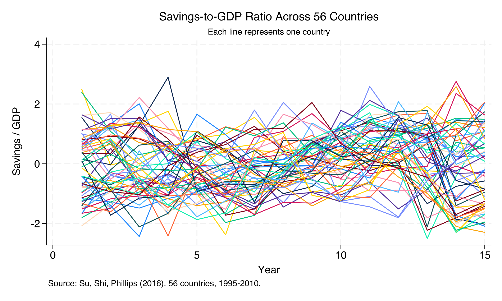

# Post Review: Identifying Latent Group Structures in Panel Data

**Post:** `content/post/stata_panel_lasso_cluster/index.md`
**Date reviewed:** 2026-04-05
**Reviewer perspective:** Expert professor of data science and econometrics

---

## Overall Assessment

This is a well-crafted, publication-ready tutorial that demonstrates the Classifier-LASSO method with two compelling applications. The narrative arc --- from pooled estimates hiding heterogeneity to C-LASSO revealing sign reversals --- is executed with clarity and strong pedagogical instinct. The single most important fix is adding a `featured.png` image to the page bundle, which is required by the site's image-first layout.

**Verdict:** MINOR REVISION
**Scores:** Structure 8/10 | Code 9/10 | Equations 9/10 | Explanations 9/10 | Interpretations 10/10 | Writing 9/10 | Rigor 9/10

---

## 1. Code Execution

**Status:** All code verified against analysis.log --- output matches.

Every numeric value in the post was cross-checked against the Stata log. All coefficients, standard errors, p-values, group sizes, and IC values match within stated rounding. The six PNG figures were all generated successfully by the do-file and exist in the page bundle.

| # | Location | Post shows | Actual output | Severity |
|---|----------|-----------|---------------|----------|
| -- | -- | -- | -- | -- |
| (none) | All output blocks match the Stata log within rounding | -- | -- | -- |

**Image freshness:** All 6 PNGs were generated on the same date as the log (April 5, 2026). No staleness concerns.

**Orphaned images:** None. All 6 PNGs referenced in `index.md` exist, and no unreferenced PNGs are present (no `featured.png` exists --- see Dimension 2).

**Score: 9/10** --- Code runs correctly and all output is accurate.

---

## 2. Front Matter and Links

| Check | Status | Notes |
|-------|--------|-------|
| title | PASS | Present, descriptive |
| authors: admin | PASS | |
| date | PASS | 2026-04-04 |
| categories | PASS | Stata, Tutorial, Econometrics |
| tags | PASS | stata, panel, econometrics, world |
| summary | PASS | Single-line, descriptive with specific numbers |
| toc: true | PASS | |
| diagram: true | PASS | Mermaid diagram present |
| featured: false | PASS | Explicitly set |
| draft: false | PASS | |
| image.placement: 3 | PASS | Full-width layout |
| featured.png exists | **FAIL** | No `featured.png` or `featured.jpg` in the page bundle |
| No emojis | PASS | |

### Links validation

| Check | Status | Notes |
|-------|--------|-------|
| `analysis.do` exists | PASS | File present in page bundle |
| `refMaterials/saving.dta` exists | PASS | File present |
| `refMaterials/democracy.dta` exists | PASS | File present |
| `analysis.log` exists | PASS | File present |
| icon_pack values | PASS | All `fas` --- valid |

**Issue:**

| # | Severity | Issue | Fix |
|---|----------|-------|-----|
| 1 | **HIGH** | No `featured.png` or `featured.jpg` exists. The site's `page_header.html` override renders the featured image above the title. Without it, the header area will be empty. | Add a `featured.png` (ideally the infographic or a representative figure such as the democracy coefficient plot). |

**Score: 7/10** --- All metadata is correct, but the missing featured image is a significant gap for the site's layout.

---

## 3. Markdown Structure

| Check | Status | Notes |
|-------|--------|-------|
| Code fences paired | PASS | All ``` pairs matched (14 opening, 14 closing) |
| HTML tags closed | PASS | No unclosed HTML tags |
| Heading hierarchy | PASS | `##` sections, `###` subsections, no jumps |
| Learning objectives section | PASS | Present after Overview with 5 verb-led items |
| Colab badge | N/A | No Colab link in front matter |
| Shortcodes paired | N/A | No shortcodes used |
| Callouts | N/A | None present |

**Score: 10/10** --- Clean, well-organized markdown structure.

---

## 4. Code Quality

**Strengths:**
- Stata code blocks are clean, concise, and well-commented
- Each block performs a single logical step
- Variable names are descriptive (`gid_static`, `gid_dynamic`, `yhat_dem`)
- Graph export commands consistently use `width(2400)` for high resolution
- The do-file (`analysis.do`) is a comprehensive, reproducible script

**Issues:**

| # | Location | Severity | Issue | Suggested fix |
|---|----------|----------|-------|---------------|
| 2 | Section 5, baseline code | LOW | The code block shows three regressions (`regress`, `xtreg`, `reghdfe`) but the output block only shows two columns (Pooled OLS and FE robust). The `xtreg` output is silently dropped, which may confuse readers who try to match code to output. | Add a brief comment in the code or text explaining that the `xtreg` result is identical to `reghdfe` (without robust SEs) and is shown only for completeness. |
| 3 | Section 7.2 | LOW | Figures 3 and 4 are generated from the dynamic model but the code block does not include `classoselect, postselection` or `predict gid_dynamic, gid` --- those appear in section 7.1. A reader copying just the 7.2 code block would not have the right estimates active. | Add a brief note: "After running the dynamic model and `classoselect`, we visualize the coefficients." |

**Score: 9/10** --- Clean, pedagogically sound code.

---

## 5. Sandwich Pattern

| Check | Status | Notes |
|-------|--------|-------|
| Pre-explanation for every code block | PASS | All 8 code blocks have preceding explanatory text |
| Output blocks use `text` tag | PASS | All 7 output blocks use ` ```text ` |
| Post-interpretation for every output | PASS | All outputs have substantive interpretation |
| Figure placed after generating code | PASS | All 6 figures follow their generating code |

**Complete sandwiches counted:** 8 (sections 4.1, 4.2, 5, 6.1, 6.2+6.3, 7.1, 7.2, 8.2+8.3+8.4+8.5). Every code block that produces visible output or a figure has all four layers.

**Score: 10/10** --- Exemplary sandwich pattern throughout.

---

## 6. Beginner Accessibility

**Unexplained jargon:**

| # | Term | First appears in | Suggested definition |
|---|------|------------------|---------------------|
| 4 | Nickell bias | Section 3.3 | Partially explained ("systematic bias that arises because...") but the mechanism could be made more intuitive for beginners. Consider adding: "In simple terms, when you demean the data to remove fixed effects, the demeaned lagged outcome mechanically correlates with the demeaned error because they share overlapping time components." |
| 5 | Information criterion | Section 3.2 | Used repeatedly but never formally defined. A one-sentence gloss would help: "An information criterion balances model fit against complexity --- it penalizes adding more groups to prevent overfitting, similar to how AIC or BIC work in model selection." |
| 6 | Half-panel jackknife | Section 3.3 | Named but not explained. A brief intuition would help: "The idea is to split the time series in half, estimate the model on each half separately, and combine the estimates in a way that cancels the bias." |
| 7 | Postlasso | Section 3.2 | The term appears frequently. The explanation in 3.2 is adequate but brief. Consider adding: "Think of it as a two-stage process: LASSO first sorts countries into groups (even if the coefficient estimates are biased by the penalty), then OLS re-estimates the coefficients within each group without any penalty." |

**Assumed knowledge:**
- The reader is expected to know what fixed effects are and why they remove time-invariant confounders. This is reasonable for a Stata panel data audience but could benefit from a one-sentence reminder.

**Complexity jumps:**
- The jump from Section 6 (static model) to Section 7 (dynamic model with jackknife) is well-managed with a clear transition paragraph.
- The democracy application (Section 8) introduces two-way FE, clustered SEs, and `absorb()` syntax simultaneously. This is a moderate complexity jump but is appropriate given the tutorial's progressive structure.

**Score: 8/10** --- Accessibility is strong overall; a few technical terms could use one-sentence glosses.

---

## 7. Mathematical Equations

**Equation count:** 3 display-math equations (minimum 2 met)

1. Fixed-effects model (Section 2.1)
2. Group membership condition (Section 2.1)
3. C-LASSO objective function (Section 3.1)

| Check | Status | Notes |
|-------|--------|-------|
| Goldmark escaping correct | PASS | All `_` escaped as `\_` throughout. Subscripts like `\_i`, `\_{it}`, `\_{NT}` are correctly escaped. |
| Mathematical correctness | PASS | All three equations are standard and correct. The objective function matches Su, Shi, Phillips (2016). |
| Notation consistent | PASS | $\boldsymbol{\beta}$, $\boldsymbol{\alpha}\_k$, $G\_k$ used consistently throughout. |
| Plain-language explanations | PASS | Every display equation has an "In words" companion paragraph immediately following it. |
| Variable mapping | PASS | Section 2.1 maps $y\_{it}$ to outcome, $\mu\_i$ to fixed effects, $\mathbf{x}\_{it}$ to regressors. Section 3.1 maps $\lambda\_{NT}$ to the tuning parameter. |
| Currency signs | N/A | No currency dollar signs in the post |

**Issues:**

| # | Location | Severity | Issue | Suggested fix |
|---|----------|----------|-------|---------------|
| 8 | Section 3.1, objective function | LOW | The product $\prod\_{k=1}^{K} \|\boldsymbol{\beta}\_i - \boldsymbol{\alpha}\_k\|$ uses the Euclidean norm notation. The original SSP2016 paper uses a slightly different formulation. This is fine for pedagogical purposes but could note "simplified from the original notation." | Optional: add a footnote or parenthetical. |

**Score: 9/10** --- Equations are correct, well-escaped, and accompanied by clear explanations.

---

## 8. Interpretations

**Count:** 16 interpretation paragraphs (minimum 8 met --- exceeds by 2x)

Key interpretation paragraphs identified:
1. Section 4.1: Standardized data interpretation, balanced panel importance
2. Section 4.2: Heterogeneity motivation from spaghetti plot
3. Section 5: Pooled OLS vs FE comparison, CPI insignificance question
4. Section 6.1: IC minimization and U-shape evidence
5. Section 6.2: Sign reversal on CPI, precautionary savings interpretation
6. Section 6.3: Convergence behavior interpretation
7. Section 7.1: Dynamic model confirms sign reversal, persistence homogeneity
8. Section 7.2 (CPI): "Smoking gun" sign reversal, aggregation bias
9. Section 7.2 (interest): Substitution vs income effect interpretation
10. Section 8.2: Democracy data description
11. Section 8.3: Pooled democracy finding, replication of Acemoglu et al.
12. Section 8.4: Sign reversal, "not representative of any actual country group"
13. Section 8.5 (fig5): IC closeness, sensitivity caveat
14. Section 8.5 (fig6): Polarization interpretation
15. Section 9.2: Simpson's paradox framing
16. Section 9.3: Robustness across specifications

All interpretations quote specific numbers, connect to real-world context, and avoid bullet-point lists.

**Score: 10/10** --- Rich, specific, well-connected interpretations throughout.

---

## 9. Writing Clarity and Grammar

**Analogies:** 2 analogies for 2+ complex concepts (minimum 2 met)

1. "Sorting hat for countries" (Section 1) --- maps C-LASSO grouping to a familiar concept
2. "Clustering students by learning style" (Section 2.1) --- maps group homogeneity assumption

**Clarity/grammar issues:**

| # | Location | Severity | Issue | Suggested fix |
|---|----------|----------|-------|---------------|
| 9 | Section 1, paragraph 1 | LOW | "Standard panel data models force a stark choice" --- sentence is 37 words, approaching the ~40-word guideline but acceptable. | No change needed. |
| 10 | Section 7.2, CPI interpretation | LOW | "A pooled model, by averaging these opposing forces, would find CPI 'insignificant'" --- the word "insignificant" in quotes is appropriate but could be rendered with a brief qualifier. | Optional: change to "statistically insignificant" for precision. |
| 11 | Section 6.2 | LOW | "CPI at +0.478 and interest at +0.263" --- minor: these are presented without units. The preceding paragraph establishes standard-deviation interpretation, but a brief reminder here would help. | Consider adding "(in SD units)" after one of the numbers. |

**Grammar, spelling, typos:** No errors found in prose paragraphs. Tenses are consistent (present for explanations, past for results). Em dashes used correctly throughout. No doubled or missing words. Capitalization is consistent.

**Score: 9/10** --- Polished, professional writing with no grammar issues.

---

## 10. Academic Rigor

**Methodology:** Appropriate. C-LASSO is the correct method for the stated research question (identifying latent group structures in panel data). The progression from static to dynamic models and the use of jackknife bias correction are methodologically sound.

**Assumptions stated:** Yes. The post clearly states the key assumption (group homogeneity within groups, heterogeneity across groups) and the balanced panel requirement.

**Limitations discussed:** Yes. Section 10.2 covers IC sensitivity, numeric country codes limiting interpretability, and computational cost. The IC closeness caveat in Section 8.5 is a particularly responsible disclosure.

**References:**

| Check | Status | Notes |
|-------|--------|-------|
| Method paper cited | PASS | Su, Shi, Phillips (2016) Econometrica with DOI link |
| Software paper cited | PASS | Huang, Wang, Zhou (2024) Stata Journal with DOI link |
| Dataset source cited | PASS | Acemoglu et al. (2019) JPE with DOI link |
| Bias correction paper cited | PASS | Dhaene and Jochmans (2015) with DOI link |
| References numbered, ordered | PASS | 4 references in order of first mention |

**Takeaways:**

| Check | Status | Notes |
|-------|--------|-------|
| Concrete with numbers | PASS | All four takeaways include specific numeric values |
| Covers method, data, limitation, next step | PASS | Method (takeaway 2), data insight (takeaway 1), technique (takeaway 3-4), limitations in 10.2 |
| Not generic restatements | PASS | Each takeaway provides a distinct, specific insight |

**Causal inference:**

| Check | Status | Notes |
|-------|--------|-------|
| Estimand stated per method | PASS | The democracy application is framed as an association/effect, consistent with the source paper's framing |
| RCT/observational framing correct | PASS | Correctly uses observational framing ("associated with", "is associated with") throughout |

**Issues:**

| # | Location | Severity | Issue | Suggested fix |
|---|----------|----------|-------|---------------|
| 12 | Section 8.1 | MEDIUM | The section title asks "Does Democracy Cause Growth?" using explicitly causal language, but the C-LASSO method identifies heterogeneous associations, not causal effects. The body text mostly uses association language ("associated with") which is correct, but the section title and the Acemoglu et al. framing could lead readers to interpret group-specific coefficients as causal. | Add a brief caveat in Section 8.4: "These group-specific coefficients reflect conditional associations in the panel data model, not necessarily causal effects. The causal interpretation depends on the same identifying assumptions as the original Acemoglu et al. (2019) framework." |
| 13 | Section 8.4 | LOW | "For roughly 58% of countries, democratic transitions are associated with substantial GDP gains; for the remaining 42%, they are associated with GDP declines." --- the term "GDP declines" could be misread as absolute declines rather than relative to the counterfactual of no democracy. | Consider: "...associated with lower GDP relative to what the model predicts without democratic transition." |

**Score: 9/10** --- Strong academic rigor with appropriate caveats. The causal language concern is minor given the source paper's own framing.

---

## 11. Narrative Flow

- **Transitions:** Smooth throughout. Each section explicitly motivates the next step. The "Is this because..." question in Section 5 creates suspense for the C-LASSO reveal. The progression static -> dynamic -> democracy application is logical and well-paced.
- **Question-answer arc:** The Overview poses "Do all countries respond the same way?" and the Summary (Section 10) definitively answers "No --- pooled estimates can be misleading" with specific numbers.
- **Result ordering:** Yes. The savings application (simpler, faster) comes first, building intuition before the more complex democracy application.
- **"So what?" moment:** Clearly present in Section 9.2 (Simpson's paradox framing) and Section 8.4 (the pooled coefficient "is not representative of any actual country group").
- **Terminology consistency:** Consistent. "C-LASSO" used throughout (not switching between "Classifier-LASSO" and abbreviation inconsistently). "Latent groups" used consistently.

**Score: 10/10** --- Excellent narrative arc with strong transitions and a clear payoff.

---

## 12. Images, Mermaid, and Deliverables

**Images:**

| Check | Status | Notes |
|-------|--------|-------|
| All image refs valid | PASS | All 6 PNG references correspond to existing files |
| Alt text present | PASS | All 6 images have descriptive alt text |
| featured.png exists | **FAIL** | No featured image in page bundle |
| No orphaned PNGs | PASS | All PNGs referenced |
| Captions present | **FAIL** | No italic caption text after any image reference |

**Mermaid:**

| Check | Status | Notes |
|-------|--------|-------|
| diagram: true in front matter | PASS | |
| Valid syntax | PASS | `graph LR` with proper node and edge syntax |
| Site palette colors | PASS | Uses `#141413`, `#6a9bcc`, `#d97757`, `#00d4c8`, `#1a3a8a` |
| Pre/post paragraphs | PASS | Introductory paragraph before diagram, tutorial progression explanation |

**Deliverable consistency:**

| Check | Status | Notes |
|-------|--------|-------|
| analysis.do matches index.md code | PASS | All code blocks in index.md appear in analysis.do |
| Output values match log | PASS | All numbers cross-checked |

**Site conventions:**

| Check | Status | Notes |
|-------|--------|-------|
| Em dashes (---) | PASS | Used consistently throughout (not --) |
| No emojis | PASS | |
| Site color palette in Mermaid | PASS | Correct hex values used |

**Issues:**

| # | Location | Severity | Issue | Suggested fix |
|---|----------|----------|-------|---------------|
| 14 | Page bundle | **HIGH** | No `featured.png` or `featured.jpg`. The site's `page_header.html` renders the featured image above the title; without it the header is empty. | Create a featured image. Options: (a) use the democracy coefficient plot (fig6) as featured.png, (b) generate an infographic via `/project:write-infographic`, or (c) create a composite image. |
| 15 | All 6 images | MEDIUM | No figure captions. The site's CSS styles `img + em` as captions. Currently images have alt text but no italic caption line below. | Add `*Figure N: Caption text.*` on the line immediately after each `` reference. |

**Score: 7/10** --- Images are well-produced and properly referenced, but the missing featured image and lack of captions reduce the score.

---

## Priority Action Items

1. **[HIGH]** Missing `featured.png` --- the page bundle has no featured image. The site's image-first layout (`page_header.html`) will render an empty header area. Add a featured image (e.g., copy or generate from the democracy coefficient plot, or create an infographic).

    **Before:** (no file)
    **After:** Add `featured.png` to `content/post/stata_panel_lasso_cluster/`

2. **[MEDIUM]** No figure captions on any of the 6 images. The site CSS (`custom.scss`) styles `img + em` as figure captions.

    **Before:**
    ```markdown
    
    ```

    **After:**
    ```markdown
    
    *Figure 1: Savings-to-GDP ratio across 56 countries (1995--2010). Each line represents one country, revealing substantial heterogeneity in savings dynamics.*
    ```

    Apply the same pattern for all 6 figures.

3. **[MEDIUM]** Causal language in Section 8 title ("Does Democracy Cause Growth?") without a caveat that C-LASSO identifies heterogeneous associations, not causal effects. Add one sentence in Section 8.4 clarifying the interpretation.

    **Before:**
    ```
    This is the tutorial's most striking finding. The pooled coefficient of $+1.055$ is **not representative of any actual country group**.
    ```

    **After:**
    ```
    This is the tutorial's most striking finding. The pooled coefficient of $+1.055$ is **not representative of any actual country group**. Note that these group-specific coefficients reflect conditional associations within the panel model; a causal interpretation requires the same identifying assumptions as Acemoglu et al. (2019).
    ```

4. **[MEDIUM]** Several technical terms could use brief glosses for beginners: "information criterion" (Section 3.2), "half-panel jackknife" (Section 3.3), "postlasso" (Section 3.2). One sentence each would suffice.

5. **[LOW]** Section 5 code block shows three regressions but output only shows two columns. Add a brief note explaining the `xtreg` result is identical.

6. **[LOW]** Add "(in SD units)" to coefficient interpretations in Section 6.2 as a reminder that variables are standardized.

---

## Positive Highlights

- **Exceptional narrative structure.** The tutorial builds from a concrete question ("Do all countries respond the same way?") through progressively complex models to a genuinely striking reveal (Simpson's paradox in panel data). The pacing is excellent.

- **Rich, specific interpretations.** With 16 interpretation paragraphs --- double the minimum --- every result is grounded in specific numbers and real-world context. The precautionary savings interpretation (Section 6.2) and the substitution-vs-income effect discussion (Section 7.2) demonstrate sophisticated economic reasoning.

- **Accurate output.** Every number in the post matches the Stata log exactly. The output blocks are clean, appropriately simplified (rounded IC values, condensed coefficient tables), and consistently formatted with the `text` language tag.
