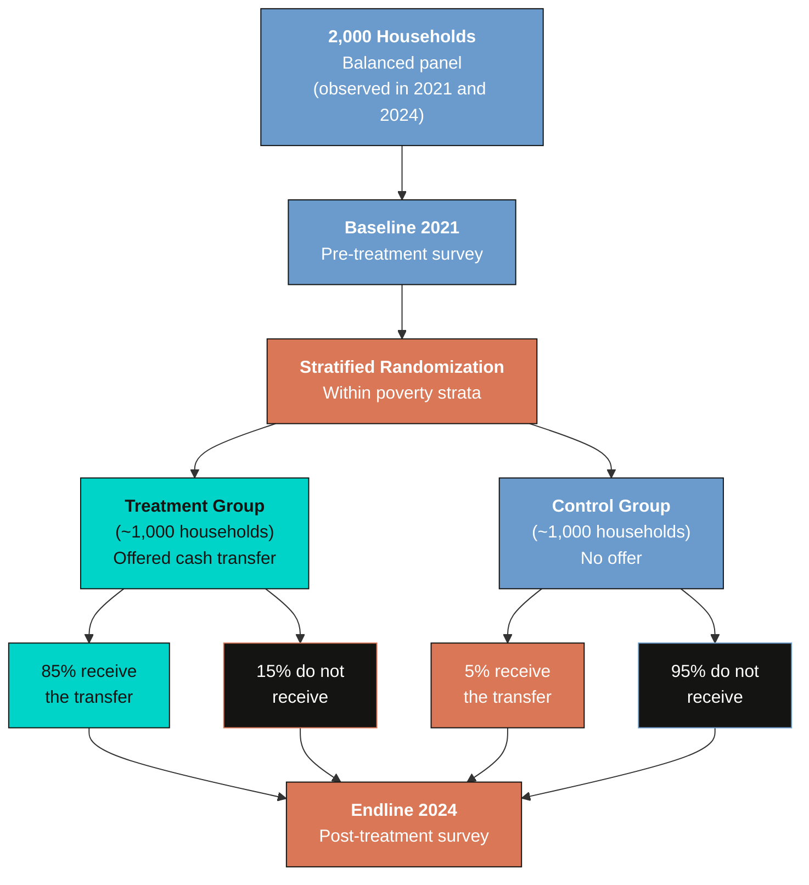
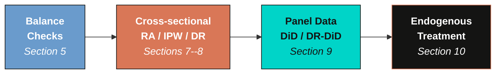
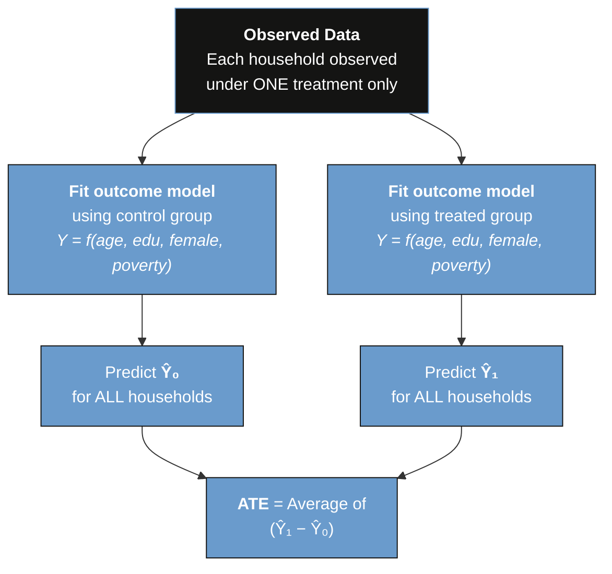
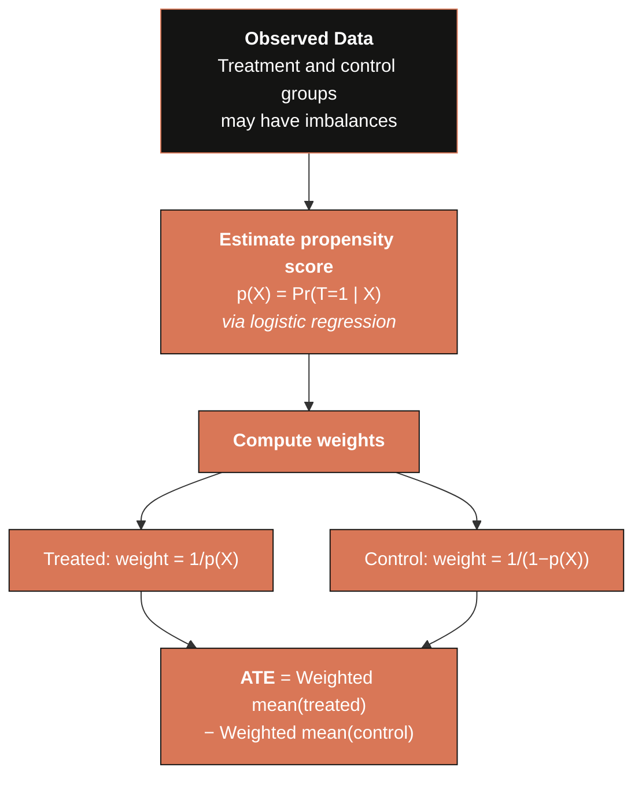
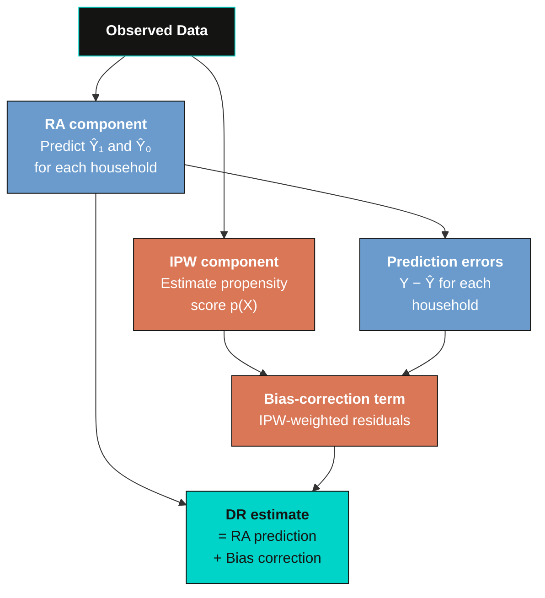
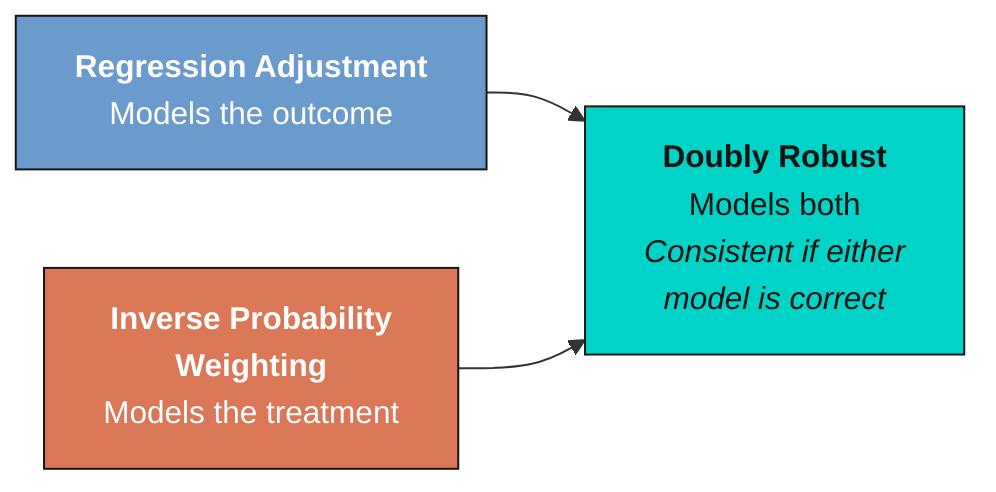
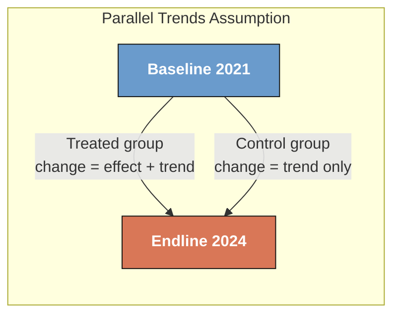
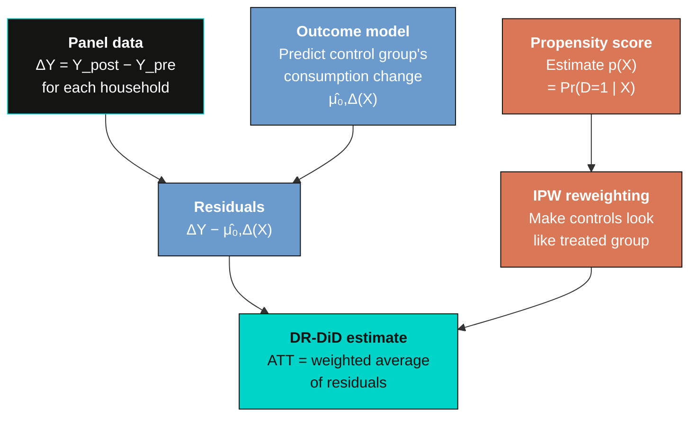
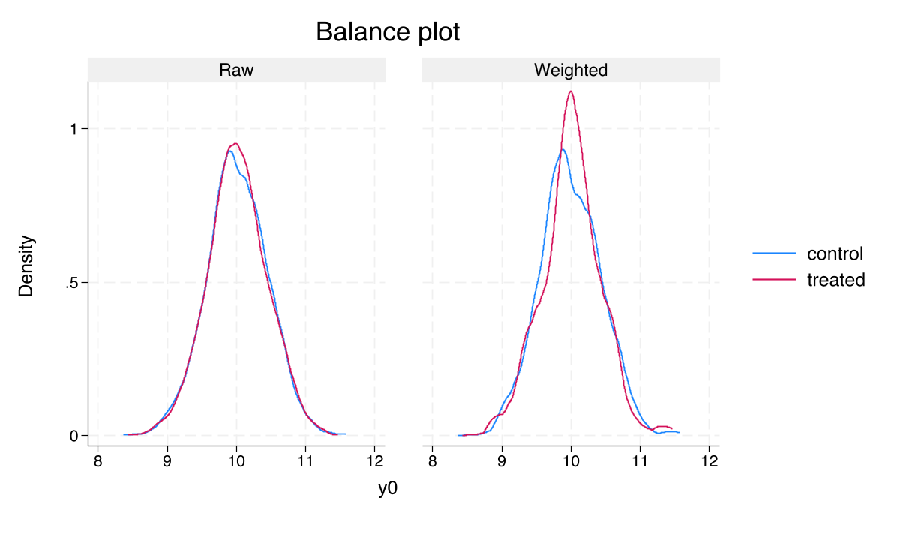

---
authors:
  - admin
categories:
  - Stata
  - Causal Inference
  - Panel Data
draft: false
featured: false
date: "2026-03-24T00:00:00Z"
external_link: ""
image:
  caption: ""
  focal_point: Smart
  placement: 3
links:
- icon: file-code
  icon_pack: fas
  name: "Stata do-file"
  url: analysis.do
- icon: database
  icon_pack: fas
  name: "Dataset (.dta)"
  url: https://github.com/quarcs-lab/data-open/raw/master/ametrics/dataSIM4RCT.dta
- icon: file-alt
  icon_pack: fas
  name: "Stata log"
  url: analysis.log
slides:
summary: Evaluate the causal effect of a cash transfer program on household consumption using regression adjustment, inverse probability weighting, doubly robust, and difference-in-differences methods in Stata
tags:
  - stata
  - causal
  - causal inference
  - rct
  - panel
title: "Evaluating a Cash Transfer Program (RCT) with Panel Data in Stata"
url_code: ""
url_pdf: ""
url_slides: ""
url_video: ""
toc: true
diagram: true
---

## 1. Overview

Cash transfer programs are among the most common development interventions worldwide. Governments and international organizations spend billions of dollars each year providing direct cash transfers to low-income households. But how do we rigorously evaluate whether these programs actually work? This tutorial walks through the complete workflow of analyzing a **randomized controlled trial (RCT)** with **panel data** in Stata --- from verifying that randomization succeeded, to estimating treatment effects using increasingly sophisticated methods, to comparing results across all approaches.

We use simulated data from a hypothetical cash transfer program targeting 2,000 households in a developing country. The key advantage of simulated data is that we know the **true treatment effect** before we begin: the program increases household consumption by **12%** (0.12 log points). This known ground truth gives us a perfect benchmark to evaluate how well each econometric method recovers the correct answer.

The tutorial progresses from simple to sophisticated. We start with basic balance checks, then estimate treatment effects three different ways using only endline data --- regression adjustment (RA), inverse probability weighting (IPW), and doubly robust (DR) methods. Next, we unlock the full power of panel data with difference-in-differences (DiD) and its doubly robust extension (DRDID). Finally, we address the real-world complication of imperfect compliance.

### Learning objectives

- Verify baseline balance using t-tests, standardized mean differences, and balance plots
- Distinguish between ATE and ATT and identify which estimand each method targets
- Understand three estimation strategies --- regression adjustment, inverse probability weighting, and doubly robust --- and when to use each
- Estimate treatment effects using all three approaches and compare their results
- Leverage panel data structure with difference-in-differences and understand why DiD estimates ATT
- Apply doubly robust difference-in-differences (DRDID) for modern panel data analysis
- Separate the effect of treatment offer from treatment receipt under imperfect compliance

---

## 2. Study design

This RCT evaluates a cash transfer program designed to boost household consumption. The study tracks 2,000 households across two survey waves --- a **baseline** in 2021 (before the program) and an **endline** in 2024 (after the program was implemented). The diagram below summarizes the experimental design.



The randomization was **stratified by poverty status** (block randomization), ensuring that treatment and control groups started with similar proportions of poor and non-poor households. A critical real-world feature of this study is **imperfect compliance** --- only 85% of households offered the treatment actually received the cash transfer, while 5% of control households received it through other channels.

### Variables

| Variable | Description | Type |
|----------|-------------|------|
| `id` | Household identifier | Panel ID |
| `year` | Survey year (2021 or 2024) | Time variable |
| `post` | Endline indicator (1 = 2024) | Binary |
| `treat` | Random assignment to offer (intent-to-treat) | Binary |
| `D` | Actual receipt of cash transfer | Binary (endogenous) |
| `y` | Log monthly consumption | Continuous (outcome) |
| `age` | Age of household head | Continuous |
| `female` | Female-headed household | Binary |
| `poverty` | Poverty status at baseline | Binary |
| `edu` | Years of education | Continuous |
| `y0` | Log monthly consumption at baseline (pre-treatment) | Continuous |

> **Offer vs. receipt** --- The variable `treat` captures random assignment to the program offer. It is exogenous (determined by randomization) and unrelated to household characteristics. The variable `D` captures actual receipt of the cash transfer. It is **endogenous** --- households that chose to take up the program may differ systematically from those that did not. Most methods in this tutorial estimate the effect of the **offer** (intent-to-treat). Section 10 addresses the effect of **receipt**.

---

## 3. Analytical roadmap

The diagram below shows the progression of methods we will use. Each stage builds on the previous one, adding complexity and robustness.



We first establish that randomization worked (balance checks). Then we estimate treatment effects three ways using only endline data --- regression adjustment, inverse probability weighting, and doubly robust methods. Next, we leverage the full panel structure with difference-in-differences. Finally, we address imperfect compliance by separating the effect of the offer from the effect of receipt.

---

## 4. Data loading and exploration

We begin by loading the simulated dataset from a public GitHub repository and examining its structure.

```stata
use "https://github.com/quarcs-lab/data-open/raw/master/ametrics/dataSIM4RCT.dta", clear
des y age edu female poverty treat D
```

```text
Contains data
  Observations:         4,000
    Variables:             10

Variable      Storage   Display    Value
    name         type    format    label      Variable label
─────────────────────────────────────────────────────────────
y             float     %9.0g                 Log monthly consumption
age           float     %9.0g
edu           float     %9.0g
female        float     %9.0g
poverty       float     %9.0g
treat         float     %9.0g                 Assignment to offer (Z)
D             float     %9.0g                 Receipt of cash transfer
```

The dataset contains 4,000 observations --- 2,000 households observed at two time points (baseline 2021 and endline 2024). The outcome variable `y` is log monthly consumption, `treat` is the random assignment indicator, and `D` is the actual receipt indicator.

Now let us examine summary statistics at baseline and endline separately.

```stata
sum y age edu female poverty treat D if post==0
```

```text
    Variable |        Obs        Mean    Std. dev.       Min        Max
─────────────+─────────────────────────────────────────────────────────
           y |      2,000     10.0154    .4348886   8.454445   11.48253
         age |      2,000      35.126    9.650839         18         68
         edu |      2,000     12.0275      1.9889          6         18
      female |      2,000       .5085    .5000528          0          1
     poverty |      2,000       .3125    .4636283          0          1
       treat |      2,000        .518    .4998009          0          1
           D |      2,000           0           0          0          0
```

At baseline, mean log consumption is approximately 10.02, the average household head is 35 years old with 12 years of education, about 51% of households are female-headed, and 31% are in poverty. Treatment assignment (`treat`) is approximately 50%, as expected from the randomization. Crucially, the receipt variable `D` is zero for all households at baseline --- the program had not yet been implemented.

```stata
sum y age edu female poverty treat D if post==1
```

```text
    Variable |        Obs        Mean    Std. dev.       Min        Max
─────────────+─────────────────────────────────────────────────────────
           y |      2,000     10.1137    .4382183   8.638689   11.55002
         age |      2,000      35.126    9.650839         18         68
         edu |      2,000     12.0275      1.9889          6         18
      female |      2,000       .5085    .5000528          0          1
     poverty |      2,000       .3125    .4636283          0          1
       treat |      2,000        .518    .4998009          0          1
           D |      2,000       .4615    .4986402          0          1
```

At endline, mean consumption has risen to approximately 10.11, reflecting both the natural time trend and the treatment effect. The receipt variable `D` is now non-zero --- about 46% of all households received the cash transfer (combining treated households who took up the program and control households who received it through other channels).

Finally, we declare the panel structure so Stata knows we have repeated observations.

```stata
xtset id year
```

```text
Panel variable: id (strongly balanced)
 Time variable: year, 2021 to 2024, but with gaps
         Delta: 1 unit
```

The panel is **strongly balanced** --- all 2,000 households appear in both survey waves, with no attrition. This is an ideal scenario that simplifies our analysis.

---

## 5. Baseline balance checks

Before estimating any treatment effects, we must verify that randomization produced comparable treatment and control groups at baseline. This is the most fundamental quality check in any RCT.

### 5.1 T-tests and proportion tests

We compare the treatment and control groups on all baseline characteristics using two-sample t-tests for continuous variables and proportion tests for binary variables.

```stata
ttest y      if post==0, by(treat)
ttest age    if post==0, by(treat)
ttest edu    if post==0, by(treat)
prtest female  if post==0, by(treat)
prtest poverty if post==0, by(treat)
```

```text
Variable    | Control Mean  Treat Mean   Diff       p-value
────────────+──────────────────────────────────────────────
y           |   10.025       10.006     0.019       0.330
age         |   35.335       34.931     0.404       0.350
edu         |   11.974       12.077    -0.103       0.247
female      |    0.484        0.531    -0.046       0.038 **
poverty     |    0.307        0.318    -0.011       0.612
```

Most variables show no statistically significant differences between the treatment and control groups. However, the variable `female` has a p-value of 0.038 --- a statistically significant imbalance. The treatment group has about 4.6 percentage points more female-headed households than the control group. This imbalance occurred purely by chance but must be addressed in our estimation.

### 5.2 Balance table with standardized mean differences

P-values are sensitive to sample size --- a large sample can make tiny differences "significant." Standardized mean differences (SMDs) provide a scale-free measure of imbalance that is more informative. The SMD is computed as the difference in group means divided by the pooled standard deviation --- this puts all variables on the same scale regardless of their units. The common rule of thumb is that SMDs below 10% indicate adequate balance.

```stata
capture ssc install ietoolkit, replace
iebaltab y age edu female poverty if post==0, grpvar(treat)
```

```text
                         (1)          (2)         (2)-(1)
                     Control    Treatment    Difference

  y                   10.025       10.006         0.019
                     (0.014)      (0.014)       (0.019)

  age                 35.335       34.931         0.404
                     (0.316)      (0.295)       (0.432)

  edu                 11.974       12.077        -0.103
                     (0.063)      (0.063)       (0.089)

  female               0.484        0.531       -0.046**
                     (0.016)      (0.016)       (0.022)

  poverty              0.307        0.318        -0.011
                     (0.015)      (0.014)       (0.021)

  N                      964        1,036
```

The balance table confirms our t-test findings. With 964 control and 1,036 treatment households, all variables are well balanced except `female`, which shows a statistically significant difference (marked with **). The outcome variable `y` has a negligible difference of 0.019 at baseline --- the groups started with essentially identical consumption levels.

### 5.3 Visual balance plot

A balance plot provides a visual overview of all SMDs at once, making it easy to spot problematic variables.

```stata
net install balanceplot, from("https://tdmize.github.io/data") replace
balanceplot y age edu i.female i.poverty, group(treat) table nodropdv
```


The balance plot shows that all SMDs fall below the 10% threshold (indicated by the dashed vertical lines). The variable `female` has the largest SMD at approximately 9.3% --- close to but still below the conventional threshold. The remaining variables --- consumption, age, education, and poverty --- all have SMDs well below 5%. Overall, randomization was successful, but we should control for `female` (and other covariates) in our estimation to improve precision.

### 5.4 AIPW as a formal balance test

As a final and more formal balance check, we can use the Augmented Inverse Probability Weighting (AIPW) estimator on **baseline data only**. If randomization was successful, the estimated "treatment effect" at baseline should be zero --- since the program had not yet been implemented, there should be no difference between groups.

```stata
preserve
keep if post==0
teffects aipw (y age edu i.female i.poverty) (treat age edu i.female i.poverty)
```

> **Tip:** The `preserve` command saves a snapshot of the current data. After the balance analysis, use `restore` to return to the full dataset. The companion do-file handles this automatically.

```text
Treatment-effects estimation                   Number of obs     =      2,000
Estimator      : augmented IPW
Outcome model  : linear
Treatment model: logit

──────────────────────────────────────────────────────────────────────────────
             |               Robust
           y |   Coefficient  std. err.      z    P>|z|     [95% conf. interval]
─────────────+────────────────────────────────────────────────────────────────
ATE          |
       treat |
   (1 vs 0)  |  -.0244086    .018861    -1.29   0.196    -.0613754    .0125582
─────────────+────────────────────────────────────────────────────────────────
POmean       |
       treat |
          0  |   10.02792   .0138363   724.75   0.000      10.0008    10.05504
──────────────────────────────────────────────────────────────────────────────
```

The AIPW-estimated "ATE" at baseline is -0.024 with a p-value of 0.196 --- not statistically significant. This confirms that there is no detectable pre-treatment difference between the groups after adjusting for covariates. The treatment and control groups were statistically comparable before the program began.

Now we run the diagnostic checks for the AIPW model.

```stata
tebalance overid
```

```text
Overidentification test for covariate balance
    H0: Covariates are balanced
    chi2(5)  =   3.216
    Prob > chi2 = 0.6670
```

The overidentification test fails to reject the null hypothesis of covariate balance (p = 0.667). There is no statistical evidence of residual imbalance after weighting.

```stata
tebalance summarize
```

```text
                |Standardized differences          Variance ratio
                |        Raw    Weighted           Raw   Weighted
----------------+------------------------------------------------
            age |  -.0417918    .0002505      .9318894   .9446877
            edu |   .0519015   -6.96e-06      1.071677   1.078214
         female |
             1  |   .0929611    6.51e-06      .9970775   .9999996
        poverty |
             1  |   .0226764    .0002864      1.018475   1.000233
```

The balance summary reveals that the raw standardized differences (before weighting) show the `female` imbalance at 0.093, consistent with our earlier findings. After weighting, all standardized differences shrink to near zero (all below 0.001) --- excellent balance. The variance ratios are all close to 1.0, indicating similar spread across groups.

```stata
tebalance density y
```


The density plot confirms that after AIPW weighting, the distributions of log consumption in the treatment and control groups overlap almost perfectly. Any small pre-existing differences in the outcome variable have been eliminated by the weighting scheme.

```stata
teffects overlap
```


The overlap plot shows that propensity scores for both groups are concentrated between approximately 0.43 and 0.55 --- well within the range where matching and weighting are feasible. There are no extreme propensity scores near 0 or 1, confirming that the common support condition is satisfied. This is expected in a well-designed RCT where treatment probability is approximately 0.50 for all households.

```stata
restore
```

This AIPW-based balance analysis also serves a pedagogical purpose: it introduces the concept of **doubly robust** estimation before we use it for treatment effect estimation in Section 8.

---

## 6. What are we estimating? ATE vs. ATT

Before diving into estimation, we need to be precise about **what** we are trying to estimate. There are two fundamental causal quantities in program evaluation.

The **Average Treatment Effect (ATE)** answers the policymaker's question: *"What would happen if we scaled this program to the entire population?"*

$$ATE = E[Y(1) - Y(0)]$$

where $Y(1)$ is the potential outcome under treatment and $Y(0)$ is the potential outcome under control, averaged over the **entire population** (both treated and untreated).

The **Average Treatment Effect on the Treated (ATT)** answers the evaluator's question: *"Did the program benefit those who were assigned to it?"*

$$ATT = E[Y(1) - Y(0) \mid T = 1]$$

This averages the treatment effect only over the **treated group** --- the households that were assigned to receive the cash transfer.

In a well-designed RCT with **homogeneous treatment effects** (the program affects everyone equally), ATE and ATT are the same. But when treatment effects are **heterogeneous** (the program benefits some households more than others), they can differ. For example, if poorer households benefit more from cash transfers and the treatment group has a higher share of poor households, the ATT could be larger than the ATE.

Understanding this distinction is critical because different methods target different estimands. Cross-sectional methods (RA, IPW, DR) can estimate **either** ATE or ATT. Difference-in-differences inherently estimates the **ATT only**. We will return to this point in Section 9.

> **Note on RCTs** --- In a randomized experiment, treatment assignment is independent of potential outcomes. This means that simple comparisons between treatment and control groups are already unbiased estimates of the ATE. When we add covariates (regression adjustment, IPW, doubly robust), we are not removing bias --- we are **improving precision** by accounting for residual variation. This is different from observational studies, where covariate adjustment is needed to address confounding.

---

## 7. Three strategies for causal estimation

We now understand *what* we want to estimate (ATE and ATT from Section 6). The question becomes *how* to estimate it. Three families of methods exist, each taking a fundamentally different approach to solving the missing-data problem at the heart of causal inference. Each method models a different part of the data-generating process, and understanding these differences is essential for interpreting results and choosing the right tool.

### 7.1 Regression Adjustment (RA) --- modeling the outcome

Regression adjustment solves the missing-data problem by **predicting the unobserved potential outcomes**. It fits separate regression models for treated and untreated groups. For each household, it uses these models to predict two potential outcomes: what consumption would be if treated, $\hat{\mu}\_1(X\_i)$, and what consumption would be if untreated, $\hat{\mu}\_0(X\_i)$. Since we only observe one of these for each household, the model fills in the missing counterfactual. The treatment effect for each household is the difference between the two predictions, and the ATE is the average across all households.

The Stata documentation describes this succinctly: *"RA estimators use means of predicted outcomes for each treatment level to estimate each POM. ATEs and ATETs are differences in estimated POMs."*

**Analogy --- predicting exam scores.** Imagine two study methods (A and B) being tested on students. You observe each student using only one method. RA fits a model predicting test scores based on student characteristics (prior GPA, hours studied) separately for method-A and method-B users. Then, for *every* student, it predicts what their score would have been under *both* methods --- even the one they did not use. The average difference in predicted scores is the treatment effect.



**The RA estimator.** Formally, the ATE under regression adjustment is:

$$\hat{\tau}\_{RA}^{ATE} = \frac{1}{N} \sum\_{i=1}^{N} \left[ \hat{\mu}\_1(X\_i) - \hat{\mu}\_0(X\_i) \right]$$

where $\hat{\mu}\_1(X)$ is the predicted outcome under treatment (fitted from treated observations) and $\hat{\mu}\_0(X)$ is the predicted outcome under control (fitted from untreated observations), both evaluated at each household's covariates $X\_i$. In plain language: for each household, the model predicts what their consumption would be if they received the cash transfer and what it would be if they did not. The difference is the household's estimated treatment effect. Averaging these across all $N$ households gives the ATE.

For the ATT, we restrict the average to treated units only:

$$\hat{\tau}\_{RA}^{ATT} = \frac{1}{N\_1} \sum\_{i: T\_i = 1} \left[ \hat{\mu}\_1(X\_i) - \hat{\mu}\_0(X\_i) \right]$$

where $N\_1$ is the number of treated households.

**Mini example from our data.** Consider Household A: a 40-year-old female in poverty with 10 years of education. The treated outcome model predicts her consumption at 10.17 log points. The untreated outcome model predicts 10.05. Her estimated individual treatment effect is $10.17 - 10.05 = 0.12$. Averaging such predictions over all 2,000 endline households gives the ATE.

**Stata implementation.** The `teffects ra` command fits linear outcome models by default. The first parenthesis specifies the outcome model (outcome variable + covariates), and the second specifies the treatment variable: `teffects ra (y c.age c.edu i.female i.poverty) (treat), ate`.

**What can go wrong --- model misspecification.** RA's Achilles heel is that it relies entirely on the outcome model being correctly specified. If consumption depends on age nonlinearly (for example, a U-shaped relationship), but we assume a linear model, the predictions $\hat{\mu}\_1$ and $\hat{\mu}\_0$ will be systematically wrong, biasing the ATE. As the Stata manual notes, RA works well when the outcome model is correct, but "relying on a correctly specified outcome model with little data is extremely risky." RA gives the right answer **only if the outcome model is correct**. If it is wrong, the ATE estimate can be biased even with infinite data.

What if we are unsure about the functional form of the outcome model? Is there an approach that avoids modeling the outcome entirely?

### 7.2 Inverse Probability Weighting (IPW) --- modeling the treatment assignment

IPW takes the opposite approach. Instead of modeling consumption, it models the probability of being assigned to treatment --- the **propensity score**, defined as $p(X) = \Pr(T = 1 \mid X)$. It then reweights observations so that the treatment and control groups become comparable. The Stata documentation explains: *"IPW estimators use weighted averages of the observed outcome variable to estimate means of the potential outcomes. The weights account for the missing data inherent in the potential-outcome framework."*

The logic is elegant: in a perfectly randomized experiment, every household has the same 50% chance of treatment, and a simple comparison of means is unbiased. When chance imbalances arise (like our 9.3% gender SMD), the estimated propensity scores deviate slightly from 0.50. IPW corrects for these imbalances by making the reweighted sample look as if randomization had been perfect --- without ever modeling the outcome.

**Analogy --- opinion polling.** Election pollsters know their survey overrepresents some demographics. If 60% of respondents are college graduates but only 35% of voters are, pollsters give lower weight to each college graduate's response and higher weight to non-graduates. IPW does the same thing for treatment groups --- it reweights households so the treated and control groups have the same covariate distribution.



**The propensity score.** The propensity score is estimated via logistic regression:

$$\hat{p}(X\_i) = \Pr(T\_i = 1 \mid X\_i) = \text{logit}^{-1}(\hat{\alpha} + \hat{\beta}' X\_i)$$

In plain language: we fit a logistic model predicting whether each household was assigned to treatment, based on their covariates (age, education, gender, poverty status). The predicted probability is their propensity score.

**The IPW estimator.** The ATE under IPW is:

$$\hat{\tau}\_{IPW}^{ATE} = \frac{1}{N} \sum\_{i=1}^{N} \left[ \frac{T\_i \cdot Y\_i}{\hat{p}(X\_i)} - \frac{(1 - T\_i) \cdot Y\_i}{1 - \hat{p}(X\_i)} \right]$$

Each treated household's outcome is divided by its probability of being treated --- this upweights treated households that "look like" control households (the Stata manual calls this placing "a larger weight on those observations for which $y\_{1i}$ is observed even though its observation was not likely"). Each control household's outcome is divided by its probability of being in the control group. The reweighting creates a pseudo-population where treatment assignment is independent of covariates.

For the ATT, only the control group needs reweighting (because the treated group is already the reference population):

$$\hat{\tau}\_{IPW}^{ATT} = \frac{1}{N\_1} \sum\_{i=1}^{N} \left[ T\_i \cdot Y\_i - \frac{(1 - T\_i) \cdot \hat{p}(X\_i) \cdot Y\_i}{1 - \hat{p}(X\_i)} \right]$$

**Mini example from our data.** In our RCT, a female household in poverty might have $\hat{p}(X) = 0.52$ (slightly more likely to be treated due to the gender imbalance). If treated, her weight is $1/0.52 = 1.92$. If in the control group, her weight is $1/(1 - 0.52) = 2.08$. A male non-poor household might have $\hat{p}(X) = 0.49$, giving weights close to 2.0 in either group. These mild adjustments rebalance the groups to remove the chance gender imbalance.

**Why IPW matters even in RCTs.** In a perfect RCT, the true propensity score is exactly 0.50 for everyone, and IPW does nothing. But finite samples produce chance imbalances. IPW uses the estimated propensity scores (which deviate slightly from 0.50) to correct for these imbalances without making any assumptions about how covariates affect the outcome.

**Stata implementation.** The `teffects ipw` command fits a logistic treatment model by default. Note that the first parenthesis specifies only the outcome variable (no covariates --- IPW does not model the outcome), and the second specifies the treatment model: `teffects ipw (y) (treat c.age c.edu i.female i.poverty), ate`.

**What can go wrong --- extreme weights.** IPW's vulnerability is extreme propensity scores. If $\hat{p}(X) = 0.01$ for some household, the weight becomes $1/0.01 = 100$ --- that single household dominates the ATE estimate, causing high variance and instability. The Stata manual warns: *"When propensity scores are extreme (near 0 or 1), the inverse weights become very large, producing unstable estimates."* This happens when the treatment and control groups have poor **overlap** --- some covariate combinations appear only in one group. In our well-designed RCT, all propensity scores are between 0.43 and 0.55 (we verified this in Section 5.4), so extreme weights are not a concern.

RA works well if the outcome model is correct but can be biased if it is wrong. IPW works well if the propensity score model is correct but can be unstable if it is wrong. Is there a method that protects us against both types of misspecification?

### 7.3 Doubly Robust (DR) --- modeling both

Doubly robust methods combine RA and IPW into a single estimator. They fit an outcome model **and** estimate a propensity score. The key property --- the reason they are called "doubly robust" --- is that the estimator is consistent (converges to the true treatment effect with enough data) if **either** the outcome model **or** the propensity score model is correctly specified. You do not need both to be right --- just one.

The Stata manual describes this property: *"AIPW estimators model both the outcome and the treatment probability. A surprising fact is that only one of the two models must be correctly specified to consistently estimate the treatment effects."*

**Analogy --- backup power.** Think of a house with two independent power sources: the electrical grid (the outcome model) and a solar panel system (the propensity score model). If the grid goes down (outcome model is misspecified), solar power keeps the lights on. If clouds block the solar panels (propensity score model is wrong), the grid still works. As long as at least one power source is functioning, the house stays lit. That is doubly robust estimation --- as long as at least one model is correct, the estimator gives the right answer.



**The AIPW estimator.** The most common doubly robust form is Augmented Inverse Probability Weighting (AIPW):

$$\hat{\tau}\_{DR}^{ATE} = \frac{1}{N} \sum\_{i=1}^{N} \left[ \hat{\mu}\_1(X\_i) - \hat{\mu}\_0(X\_i) + \frac{T\_i (Y\_i - \hat{\mu}\_1(X\_i))}{\hat{p}(X\_i)} - \frac{(1 - T\_i)(Y\_i - \hat{\mu}\_0(X\_i))}{1 - \hat{p}(X\_i)} \right]$$

This equation has two clearly interpretable components:

- **RA component** (first two terms): $\hat{\mu}\_1(X\_i) - \hat{\mu}\_0(X\_i)$ --- the regression adjustment prediction, exactly as in Section 7.1

- **Bias-correction component** (last two terms): IPW-weighted residuals $(Y\_i - \hat{\mu})$ --- the difference between actual and predicted outcomes, weighted by inverse propensity scores

In plain language: start with the RA prediction of each household's treatment effect. Then ask: how far off was that prediction from reality? Weight those prediction errors by the propensity score. If RA was already right, the errors average to zero and you just get RA. If RA was wrong but IPW is right, the weighted errors exactly cancel the RA bias.

**Why the magic works --- four scenarios.**

1. **Outcome model correct, propensity model wrong:** The residuals $(Y\_i - \hat{\mu})$ are zero on average, so the correction terms vanish. DR reduces to RA. Correct answer.
2. **Propensity model correct, outcome model wrong:** The IPW reweighting is valid, so the correction terms fix the RA bias. Correct answer.
3. **Both models correct:** Both components work together, producing the most efficient estimate.
4. **Both models wrong:** Neither safety net catches the error. The estimate can be biased. DR provides insurance, not invincibility.

**AIPW vs. IPWRA in Stata.** Stata offers two doubly robust commands. `teffects aipw` augments the IPW estimator with an outcome-model correction (the equation above). `teffects ipwra` applies propensity score weights to the regression adjustment --- arriving at the same property from the other direction. Both are doubly robust and produce nearly identical results in practice.

**Stata implementation.** Both commands require specifying the outcome model in the first parenthesis and the treatment model in the second: `teffects ipwra (y c.age c.edu i.female i.poverty) (treat c.age c.edu i.female i.poverty), vce(robust)`.

**What can go wrong.** DR fails only when **both** models are wrong. This is much less likely than either single model being wrong --- getting at least one model approximately right is much easier than getting both perfectly right. However, the Stata manual notes: *"When both the outcome and the treatment model are misspecified, which estimator is more robust is a matter of debate."* Using flexible specifications (polynomials, interactions) reduces the risk of both models failing simultaneously.

### Comparison of the three approaches

| Feature | RA | IPW | DR (AIPW/IPWRA) |
|---------|-----|------|-----|
| Models the outcome? | Yes | No | Yes |
| Models the treatment? | No | Yes | Yes |
| Key equation | $\hat{\mu}\_1(X) - \hat{\mu}\_0(X)$ | $T \cdot Y / \hat{p}(X)$ | RA + IPW-weighted residuals |
| Consistent if outcome model correct? | Yes | --- | Yes |
| Consistent if treatment model correct? | --- | Yes | Yes |
| Main vulnerability | Outcome misspecification | Extreme weights | Both models wrong |
| Stata command | `teffects ra` | `teffects ipw` | `teffects ipwra` / `teffects aipw` |



The doubly robust estimator combines the strengths of both RA and IPW. It is the **standard recommendation in modern causal inference** because it provides an extra layer of protection against model misspecification. Now that we understand what each method does, what it assumes, and what can go wrong, let us apply all three to our cash transfer data and compare their results.

---

## 8. Cross-sectional estimation at endline --- RA, IPW, and DR

We now estimate treatment effects using only endline data. For each method, we compute both the **ATE** (the policymaker's quantity) and the **ATT** (the evaluator's quantity).

### 8.1 Simple difference in means

The simplest approach is to compare mean outcomes between treated and control groups at endline.

```stata
use "https://github.com/quarcs-lab/data-open/raw/master/ametrics/dataSIM4RCT.dta", clear
keep if post==1

reg y treat, robust
```

```text
Linear regression                               Number of obs     =      2,000
                                                F(1, 1998)        =      35.43
                                                Prob > F          =     0.0000
                                                R-squared         =     0.0174
                                                Root MSE          =     .43449

──────────────────────────────────────────────────────────────────────────────
             |               Robust
           y |   Coefficient  std. err.      t    P>|t|     [95% conf. interval]
─────────────+────────────────────────────────────────────────────────────────
       treat |   .1157465   .0194443     5.95   0.000     .0776132    .1538798
       _cons |   10.05374   .014001    718.07   0.000     10.02628    10.0812
──────────────────────────────────────────────────────────────────────────────
```

The simple difference in means yields an estimate of 0.116 (SE = 0.019, p < 0.001, 95% CI [0.078, 0.154]). Because the outcome is in logs, this means being offered the cash transfer increased household consumption by approximately 11.6%. This estimate is close to the true effect of 12% and is our benchmark for comparison. However, it does not adjust for the gender imbalance we discovered at baseline.

### 8.2 Regression Adjustment --- ATE and ATT

Regression adjustment models the outcome as a function of treatment and covariates, then computes predicted outcomes under treatment and control for each observation.

```stata
* RA: Average Treatment Effect (ATE)
teffects ra (y c.age c.edu i.female i.poverty) (treat), ate
```

```text
Treatment-effects estimation                   Number of obs     =      2,000
Estimator      : regression adjustment
Outcome model  : linear
──────────────────────────────────────────────────────────────────────────────
             |               Robust
           y |   Coefficient  std. err.      z    P>|z|     [95% conf. interval]
─────────────+────────────────────────────────────────────────────────────────
ATE          |
       treat |
   (1 vs 0)  |   .1125431   .0190927     5.89   0.000     .0751221    .1499641
─────────────+────────────────────────────────────────────────────────────────
POmean       |
       treat |
          0  |   10.05503   .0138703   724.93   0.000     10.02785    10.08222
──────────────────────────────────────────────────────────────────────────────
```

```stata
* RA: Average Treatment Effect on the Treated (ATT)
teffects ra (y c.age c.edu i.female i.poverty) (treat), atet
```

```text
Treatment-effects estimation                   Number of obs     =      2,000
Estimator      : regression adjustment
Outcome model  : linear
──────────────────────────────────────────────────────────────────────────────
             |               Robust
           y |   Coefficient  std. err.      z    P>|z|     [95% conf. interval]
─────────────+────────────────────────────────────────────────────────────────
ATET         |
       treat |
   (1 vs 0)  |   .1132537   .0191498     5.91   0.000     .0757208    .1507865
─────────────+────────────────────────────────────────────────────────────────
POmean       |
       treat |
          0  |   10.05623   .0140082   717.88   0.000     10.02878    10.08369
──────────────────────────────────────────────────────────────────────────────
```

The RA estimates are ATE = 0.113 (SE = 0.019, 95% CI [0.075, 0.150]) and ATT = 0.113 (SE = 0.019, 95% CI [0.076, 0.151]). The ATE and ATT are nearly identical, which confirms that treatment effects are approximately **homogeneous** across households. The RA approach models the outcome with covariates (age, education, gender, poverty), which adjusts for the baseline gender imbalance and can improve precision.

### 8.3 Inverse Probability Weighting --- ATE and ATT

IPW reweights observations based on their estimated probability of treatment, without modeling the outcome.

```stata
* IPW: Average Treatment Effect (ATE)
teffects ipw (y) (treat c.age c.edu i.female i.poverty), ate
```

```text
Treatment-effects estimation                   Number of obs     =      2,000
Estimator      : inverse-probability weights
Outcome model  : weighted mean
Treatment model: logit
──────────────────────────────────────────────────────────────────────────────
             |               Robust
           y |   Coefficient  std. err.      z    P>|z|     [95% conf. interval]
─────────────+────────────────────────────────────────────────────────────────
ATE          |
       treat |
   (1 vs 0)  |   .1126713   .0190886     5.90   0.000     .0752583    .1500844
─────────────+────────────────────────────────────────────────────────────────
POmean       |
       treat |
          0  |   10.05495   .0138651   725.20   0.000     10.02778    10.08213
──────────────────────────────────────────────────────────────────────────────
```

```stata
* IPW: Average Treatment Effect on the Treated (ATT)
teffects ipw (y) (treat c.age c.edu i.female i.poverty), atet
```

```text
Treatment-effects estimation                   Number of obs     =      2,000
Estimator      : inverse-probability weights
Outcome model  : weighted mean
Treatment model: logit
──────────────────────────────────────────────────────────────────────────────
             |               Robust
           y |   Coefficient  std. err.      z    P>|z|     [95% conf. interval]
─────────────+────────────────────────────────────────────────────────────────
ATET         |
       treat |
   (1 vs 0)  |   .1134031   .0191397     5.93   0.000     .0758899    .1509162
─────────────+────────────────────────────────────────────────────────────────
POmean       |
       treat |
          0  |   10.05608   .0140004   718.27   0.000     10.02864    10.08352
──────────────────────────────────────────────────────────────────────────────
```

The IPW estimates are ATE = 0.113 (SE = 0.019, 95% CI [0.075, 0.150]) and ATT = 0.113 (SE = 0.019, 95% CI [0.076, 0.151]). These are very close to the RA results, which is expected in a well-designed RCT where propensity scores are near 0.50 for all households. Notice that IPW does **not** model the outcome --- it only models the treatment assignment process using the propensity score. The close agreement between RA and IPW gives us confidence that both the outcome model and the treatment model are approximately correct.

### 8.4 Doubly Robust --- ATE and ATT (IPWRA)

The doubly robust IPWRA estimator combines outcome modeling and propensity score weighting.

```stata
* IPWRA: Average Treatment Effect (ATE)
teffects ipwra (y c.age c.edu i.female i.poverty) ///
               (treat c.age c.edu i.female i.poverty), vce(robust)
```

```text
Treatment-effects estimation                   Number of obs     =      2,000
Estimator      : IPW regression adjustment
Outcome model  : linear
Treatment model: logit
──────────────────────────────────────────────────────────────────────────────
             |               Robust
           y |   Coefficient  std. err.      z    P>|z|     [95% conf. interval]
─────────────+────────────────────────────────────────────────────────────────
ATE          |
       treat |
   (1 vs 0)  |    .112639   .0190901     5.90   0.000     .0752231    .1500549
─────────────+────────────────────────────────────────────────────────────────
POmean       |
       treat |
          0  |     10.055   .0138677   725.07   0.000     10.02782    10.08218
──────────────────────────────────────────────────────────────────────────────
```

```stata
* IPWRA: Average Treatment Effect on the Treated (ATT)
teffects ipwra (y c.age c.edu i.female i.poverty) ///
               (treat c.age c.edu i.female i.poverty), atet vce(robust)
```

```text
Treatment-effects estimation                   Number of obs     =      2,000
Estimator      : IPW regression adjustment
Outcome model  : linear
Treatment model: logit
──────────────────────────────────────────────────────────────────────────────
             |               Robust
           y |   Coefficient  std. err.      z    P>|z|     [95% conf. interval]
─────────────+────────────────────────────────────────────────────────────────
ATET         |
       treat |
   (1 vs 0)  |   .1133162   .0191469     5.92   0.000     .0757889    .1508435
─────────────+────────────────────────────────────────────────────────────────
POmean       |
       treat |
          0  |   10.05617   .0140019   718.20   0.000     10.02873    10.08361
──────────────────────────────────────────────────────────────────────────────
```

The doubly robust IPWRA estimates are ATE = 0.113 (SE = 0.019, 95% CI [0.075, 0.150]) and ATT = 0.113 (SE = 0.019, 95% CI [0.076, 0.151]). These are very close to the RA and IPW estimates, confirming that all three approaches converge in this well-designed RCT. The DR method provides the most reliable cross-sectional estimate because it is protected against misspecification of either the outcome or treatment model.

### 8.5 Doubly Robust --- AIPW alternative

As a robustness check, we can also compute the doubly robust estimate using the AIPW formulation instead of IPWRA.

```stata
* AIPW: Average Treatment Effect (ATE)
teffects aipw (y c.age c.edu i.female i.poverty) ///
              (treat c.age c.edu i.female i.poverty)
```

```text
Treatment-effects estimation                    Number of obs     =      2,000
Estimator      : augmented IPW
Outcome model  : linear by ML
Treatment model: logit
──────────────────────────────────────────────────────────────────────────────
             |               Robust
           y |   Coefficient  std. err.      z    P>|z|     [95% conf. interval]
─────────────+────────────────────────────────────────────────────────────────
ATE          |
       treat |
   (1 vs 0)  |   .1126412   .0190903     5.90   0.000      .075225    .1500574
─────────────+────────────────────────────────────────────────────────────────
POmean       |
       treat |
          0  |     10.055    .013868   725.05   0.000     10.02782    10.08218
──────────────────────────────────────────────────────────────────────────────
```

The AIPW estimate of ATE = 0.113 (SE = 0.019, 95% CI [0.075, 0.150]) is virtually identical to the IPWRA result (0.113). Both are doubly robust --- the difference lies in the computational approach (AIPW augments the IPW estimator with a bias-correction term, while IPWRA applies IPW weights to the regression adjustment), but the theoretical properties and estimates are the same.

### 8.6 Cross-sectional comparison

The table below summarizes all cross-sectional estimates.

| Method | Approach | Estimand | Estimate | SE | 95% CI | Contains 0.12? |
|--------|----------|----------|:--------:|:---:|:------:|:-:|
| Simple regression | None | ATE | 0.116 | 0.019 | [0.078, 0.154] | Yes |
| Regression Adjustment | Outcome model | ATE | 0.113 | 0.019 | [0.075, 0.150] | Yes |
| Regression Adjustment | Outcome model | ATT | 0.113 | 0.019 | [0.076, 0.151] | Yes |
| Inverse Prob. Weighting | Treatment model | ATE | 0.113 | 0.019 | [0.075, 0.150] | Yes |
| Inverse Prob. Weighting | Treatment model | ATT | 0.113 | 0.019 | [0.076, 0.151] | Yes |
| IPWRA (Doubly Robust) | Both models | ATE | 0.113 | 0.019 | [0.075, 0.150] | Yes |
| IPWRA (Doubly Robust) | Both models | ATT | 0.113 | 0.019 | [0.076, 0.151] | Yes |
| **True effect** | | | **0.12** | | | |

Several patterns emerge from this comparison. First, **ATE and ATT are nearly identical** for every method, confirming that treatment effects are homogeneous across households. Second, **RA, IPW, and DR all give remarkably similar results** (all approximately 0.113) because, in this well-designed RCT, randomization ensures that both the outcome model and the propensity score model are approximately correct. Third, the simple difference in means (0.116) is slightly higher than the covariate-adjusted estimates (0.113), reflecting the precision improvement from controlling for covariates including the gender imbalance. Finally, all confidence intervals contain the true effect of 0.12 --- every method successfully recovers the correct answer.

The real value of doubly robust methods becomes apparent in less ideal settings. When one model might be misspecified --- a common situation in practice --- DR methods provide insurance that RA or IPW alone cannot offer.

---

## 9. Leveraging panel data --- Difference-in-Differences

All estimates in Section 8 used only endline data. But we have panel data --- the same 2,000 households observed before and after the intervention. Can we do better?

### 9.1 Why use panel data?

Cross-sectional methods (RA, IPW, DR) compare treated and control groups at a single point in time --- the endline. They control for **observable** covariates like age, education, and gender. But there may be **unobservable** characteristics --- household motivation, geographic advantages, cultural factors --- that differ between groups and affect consumption. No amount of cross-sectional covariate adjustment can control for these, because we simply do not observe them.

**Analogy --- comparing students across schools.** Imagine comparing test scores between students at a charter school (treatment) and a traditional school (control). You can adjust for observable differences like family income and prior grades. But what about unmeasured factors --- parental involvement, neighborhood quality, student ambition? A cross-sectional comparison cannot disentangle the school effect from these hidden differences. Now suppose you observe the *same students* before and after they switch schools. By comparing each student's score change, you automatically cancel out all fixed student characteristics --- because they are the same at both time points. That is the power of panel data.

Panel data methods like difference-in-differences (DiD) solve this problem by comparing each household **to itself** over time. By looking at how each household's consumption changed from baseline to endline, we effectively control for all **time-invariant unobservable characteristics** (household fixed effects). This is a powerful advantage that cross-sectional methods cannot replicate.

#### The DiD estimator

The DiD estimator computes a simple but powerful quantity --- a "difference of differences":

$$\hat{\tau}\_{DiD} = \underbrace{(\bar{Y}\_{treat,post} - \bar{Y}\_{treat,pre})}\_{\text{Change for treated}} - \underbrace{(\bar{Y}\_{control,post} - \bar{Y}\_{control,pre})}\_{\text{Change for control}}$$

The first difference ($\bar{Y}\_{treat,post} - \bar{Y}\_{treat,pre}$) captures the treatment group's change over time --- the treatment effect **plus** any common time trend (e.g., economic growth that affects all households). The second difference ($\bar{Y}\_{control,post} - \bar{Y}\_{control,pre}$) captures the control group's change --- the common time trend **only**, since they did not receive treatment. Subtracting the second from the first removes the time trend, isolating the treatment effect.

**Mini example from our data.** Suppose the treated group's average log consumption went from 10.01 at baseline to 10.17 at endline (change = +0.16). The control group went from 10.03 to 10.06 (change = +0.03). The DiD estimate is $0.16 - 0.03 = 0.13$ --- close to the true effect of 0.12. The control group's +0.03 change captures the natural time trend that would have affected everyone, and subtracting it isolates the treatment effect.

#### The parallel trends assumption

The key identifying assumption of DiD is the **parallel trends assumption (PTA)**: absent the treatment, the treatment and control groups would have followed the same time trend. Formally:

> **Notation note** --- In the DiD literature and in the Sant'Anna and Zhao (2020) paper, $D$ denotes treatment group assignment (equivalent to our `treat` variable). This differs from our data dictionary where `D` is the receipt indicator. In this section and Section 9.4, we follow the paper's convention: $D = 1$ means assigned to treatment, $D = 0$ means assigned to control.

$$E[Y\_1(0) - Y\_0(0) \mid D = 1] = E[Y\_1(0) - Y\_0(0) \mid D = 0]$$

This says that the average change in *untreated* potential outcomes is the same for the treated and control groups. Note that this does **not** require the two groups to have the same *level* of consumption --- only the same *trend*. The treated group can start higher or lower, as long as their consumption would have evolved at the same rate as the control group in the absence of the program.

In an RCT, the parallel trends assumption is very plausible because randomization ensures the groups were similar at baseline. Any pre-existing differences between groups occurred by chance and are unlikely to produce different time trends. This makes DiD a strong estimator in our setting.



### 9.2 Why does DiD estimate ATT and not ATE?

This is a point that many beginners miss, so it is worth explaining carefully.

Recall from Section 6 that the ATT is $E[Y\_1(1) - Y\_1(0) \mid D = 1]$ --- the effect on those who were treated. Sant'Anna and Zhao (2020) make this explicit: the main challenge is computing $E[Y\_1(0) \mid D = 1]$ --- what would the treated group's consumption have been at endline *without* the program?

DiD solves this by using the control group's time trend as a stand-in. Specifically, it constructs the counterfactual for the treated group as:

$$\underbrace{E[Y\_1(0) \mid D = 1]}\_{\text{Counterfactual}} = \underbrace{E[Y\_0 \mid D = 1]}\_{\text{Treated at baseline}} + \underbrace{(E[Y\_1 \mid D = 0] - E[Y\_0 \mid D = 0])}\_{\text{Control group's time trend}}$$

This counterfactual is **specific to the treated group** --- it starts from their baseline level and adds the control group's trend. DiD therefore estimates what happened to the treated group relative to this counterfactual. This is precisely the ATT.

**Why not the ATE?** To estimate the ATE, we would also need the treatment effect for the untreated --- what would happen if we gave the program to those who did not receive it. DiD does not provide this, because the counterfactual it constructs runs in only one direction (control trend applied to treated baseline, not treated trend applied to control baseline).

**In our RCT context**, since treatment was randomly assigned, ATE and ATT are likely very similar (as we saw in Section 8). But in observational studies with heterogeneous treatment effects, this distinction matters greatly. A job-training program might have a larger effect on those who voluntarily enrolled (ATT) than it would have on randomly selected workers (ATE).

### 9.3 Basic DiD with panel fixed effects

We now implement the basic DiD estimator using Stata's `xtdidregress` command, which handles the panel structure and computes clustered standard errors.

```stata
use "https://github.com/quarcs-lab/data-open/raw/master/ametrics/dataSIM4RCT.dta", clear

* Create the treatment-post interaction
gen treat_post = treat * post
label var treat_post "Treated x Post (1 only for treated in 2024)"

* Declare panel structure
xtset id year

* Basic DiD with individual fixed effects
xtdidregress (y) (treat_post), group(id) time(year) vce(cluster id)
```

```text
                                                Number of obs     =      4,000
                                                Number of groups  =      2,000

Outcome model  : linear
Treatment model: none
──────────────────────────────────────────────────────────────────────────────
             |              Robust
           y |   Coefficient  std. err.      t    P>|t|     [95% conf. interval]
─────────────+────────────────────────────────────────────────────────────────
ATET         |
  treat_post |   .1347161   .0272737     4.94   0.000     .0812282    .188204
──────────────────────────────────────────────────────────────────────────────
```

The basic DiD estimate of the ATT is 0.135 (SE = 0.027, p < 0.001, 95% CI [0.081, 0.188]). This is slightly higher than the cross-sectional estimates (0.113--0.116) but still contains the true effect of 0.12 within its confidence interval. The wider standard error (0.027 vs. 0.019) reflects the additional variability introduced by differencing within households. Standard errors are clustered at the household level to account for serial correlation within panels.

The key advantage of this DiD estimate is that it controls for all **time-invariant unobservable characteristics** of each household. In an RCT, randomization already handles confounding, so the cross-sectional and panel estimates are similar. But in observational settings, DiD's ability to absorb household fixed effects can correct biases that cross-sectional methods cannot.

### 9.4 From cross-sectional DR to panel DR --- Doubly Robust DiD (DRDID)

In Section 7, we saw that doubly robust methods combine outcome modeling and propensity score modeling for cross-sectional data. **DRDID extends this logic to the panel setting.** It combines the DiD framework (using pre/post variation) with doubly robust covariate adjustment.

This approach was introduced by Sant'Anna and Zhao (2020) in a landmark paper published in the *Journal of Econometrics*. They proposed estimators that are "consistent if either (but not necessarily both) a propensity score or outcome regression working models are correctly specified" --- bringing the doubly robust property from the cross-sectional world into the DiD framework.

#### Why do we need DRDID?

Recall from Section 9.2 that basic DiD relies on the **parallel trends assumption** --- absent treatment, the treated and control groups would have followed the same time trend. But what if parallel trends holds only **conditional on covariates**? For example, what if consumption trends differ between poor and non-poor households, but within each poverty group the trends are parallel?

In this case, we need a **conditional** parallel trends assumption:

$$E[Y\_1(0) - Y\_0(0) \mid D = 1, X] = E[Y\_1(0) - Y\_0(0) \mid D = 0, X]$$

This says that the average change in untreated potential outcomes is the same for treated and control groups *who share the same covariates* $X$. Note that this allows for covariate-specific time trends (e.g., different consumption growth rates for poor and non-poor households) while still identifying the ATT.

Under this conditional parallel trends assumption, there are two ways to estimate the ATT:

- **Outcome regression (OR) approach** --- model how the outcome evolves over time for the control group, and use that model to predict the counterfactual evolution for the treated group
- **IPW approach** --- reweight the control group so its covariate distribution matches the treated group, then compute the standard DiD

The problem is the same as in the cross-sectional case: OR requires a correctly specified outcome model, and IPW requires a correctly specified propensity score model. Sant'Anna and Zhao's insight was that **you can combine both into a single estimator that works if either model is correct**.

#### The DRDID estimator for panel data

When panel data are available (as in our case --- same households observed at baseline and endline), the DRDID estimator takes a particularly clean form. Let $\Delta Y\_i = Y\_{i,post} - Y\_{i,pre}$ denote each household's change in consumption. The DR DID estimator is:

$$\hat{\tau}\_{DR}^{DiD} = \frac{1}{N\_1} \sum\_{i=1}^{N} \left[ w\_1(D\_i) - w\_0(D\_i, X\_i) \right] \left[ \Delta Y\_i - \hat{\mu}\_{0,\Delta}(X\_i) \right]$$

where:

- $w\_1(D\_i) = D\_i / \bar{D}$ assigns equal weight to each treated unit (the fraction treated)
- $w\_0(D\_i, X\_i)$ reweights control units using the propensity score $\hat{p}(X)$, so they resemble the treated group
- $\hat{\mu}\_{0,\Delta}(X\_i) = \hat{\mu}\_{0,post}(X\_i) - \hat{\mu}\_{0,pre}(X\_i)$ is the predicted change in consumption for the control group, fitted from control-group data

In plain language: for each household, compute the change in consumption over time ($\Delta Y$) and subtract the model-predicted change for the control group ($\hat{\mu}\_{0,\Delta}$). This residual captures the treatment effect plus any prediction error. Then reweight these residuals using IPW so that the control group matches the treated group's covariate profile.

#### Why is this doubly robust?

The doubly robust property works through the same logic as in the cross-sectional case (Section 7.3), but applied to **changes** rather than levels:

1. **If the outcome model is correct** ($\hat{\mu}\_{0,\Delta}(X) = E[\Delta Y \mid D=0, X]$), then the residuals $\Delta Y\_i - \hat{\mu}\_{0,\Delta}(X\_i)$ average to zero for the control group, regardless of the propensity score weights. The estimator reduces to an outcome-regression DiD. Correct answer.

2. **If the propensity score model is correct** ($\hat{p}(X) = \Pr(D=1 \mid X)$), the IPW reweighting makes the control group comparable to the treated group, regardless of the outcome model. The correction term fixes any bias from a misspecified outcome model. Correct answer.

3. **If both are correct**, the estimator achieves the **semiparametric efficiency bound** --- it is the most precise estimator possible given the assumptions. Sant'Anna and Zhao proved this formally.

4. **If both are wrong**, the estimator can be biased --- double robustness provides one layer of insurance, not two.



#### What DRDID adds over basic DiD and TWFE

Sant'Anna and Zhao (2020) also showed that the standard two-way fixed effects (TWFE) estimator --- the workhorse of applied economics --- can produce misleading results when treatment effects are heterogeneous across covariates. Specifically, the TWFE estimator implicitly assumes (i) that treatment effects are the same for all covariate values, and (ii) that there are no covariate-specific time trends. When these assumptions fail, "the estimand is, in general, different from the ATT, and policy evaluation based on it may be misleading." DRDID avoids both of these pitfalls by allowing for flexible outcome models and covariate-specific trends.

#### Stata implementation

The `drdid` package (Rios-Avila, Sant'Anna, and Callaway) implements the estimators from the paper.

```stata
* Install the drdid package (only needed once)
ssc install drdid, replace

* Doubly Robust DiD with DRIPW estimator
drdid y c.age c.edu i.female i.poverty, ivar(id) time(year) treatment(treat) dripw
```

```text
Doubly robust difference-in-differences estimator
Outcome model  : least squares
Treatment model: inverse probability

──────────────────────────────────────────────────────────────────────────────
             |   Coefficient  std. err.      z    P>|z|     [95% conf. interval]
─────────────+────────────────────────────────────────────────────────────────
ATET         |   .1374784    .027387     5.02   0.000     .0838008     .191156
──────────────────────────────────────────────────────────────────────────────
```

The DRDID estimate of the ATT is 0.137 (SE = 0.027, p < 0.001, 95% CI [0.084, 0.191]). The `dripw` option specifies the Doubly Robust Inverse Probability Weighting estimator, which uses a linear least squares model for the outcome evolution of the control group and a logistic model for the propensity score. The result is slightly higher than basic DiD (0.135) and close to the true effect of 0.12.

**Alternative: Stata 17+ built-in command.** Stata 17 and later versions include a built-in doubly robust DiD estimator that does not require installing external packages.

```stata
xthdidregress aipw (y c.age c.edu i.female i.poverty) ///
                   (treat_post c.age c.edu i.female i.poverty), group(id)
```

```text
Heterogeneous-treatment-effects regression            Number of obs    = 4,000
                                                      Number of panels = 2,000
Estimator:       Augmented IPW
Panel variable:  id
Treatment level: id
Control group:   Never treated

                                 (Std. err. adjusted for 2,000 clusters in id)
──────────────────────────────────────────────────────────────────────────────
             |               Robust
Cohort       |       ATET   std. err.      z    P>|z|     [95% conf. interval]
─────────────+────────────────────────────────────────────────────────────────
        year |
       2024  |   .1374784    .027387     5.02   0.000     .0838008     .191156
──────────────────────────────────────────────────────────────────────────────
Note: ATET computed using covariates.
```

The `xthdidregress aipw` command produces the same ATT estimate of 0.137 (SE = 0.027, 95% CI [0.084, 0.191]) as the `drdid` package --- confirming that both implement the same doubly robust DiD methodology. The output labels the result as "Cohort year 2024" because `xthdidregress` is designed for settings with staggered treatment adoption across multiple cohorts; in our two-period design, there is only one treatment cohort (households treated in 2024). As the Stata manual explains, "AIPW models both treatment and outcome. If at least one of the models is correctly specified, it provides consistent estimates, a property called double robustness."

The agreement between `drdid` (community package) and `xthdidregress aipw` (built-in) provides a useful robustness check --- researchers can verify their results using both implementations.

#### Panel data vs. repeated cross-sections

An important result from Sant'Anna and Zhao (2020) is that panel data are **strictly more efficient** than repeated cross-sections for estimating the ATT under the DiD framework. The intuition is straightforward: with panel data, we observe each household's individual change over time ($\Delta Y\_i$), which eliminates household-level variation. With repeated cross-sections, we can only compare group averages at different time points, which introduces additional noise. The efficiency gain is larger when the sample sizes in the pre and post periods are more imbalanced.

In our study, we have a balanced panel (same 2,000 households at baseline and endline), so we benefit from this efficiency advantage.

### 9.5 Cross-sectional vs. panel comparison

The table below compares our best cross-sectional estimates with the panel-based DiD estimates.

| Method | Approach | Estimand | Data Used | Estimate | SE | 95% CI | Contains 0.12? |
|--------|----------|----------|-----------|:--------:|:---:|:------:|:-:|
| Simple regression | None | ATE | Endline only | 0.116 | 0.019 | [0.078, 0.154] | Yes |
| RA | Outcome model | ATE | Endline only | 0.113 | 0.019 | [0.075, 0.150] | Yes |
| IPW | Treatment model | ATE | Endline only | 0.113 | 0.019 | [0.075, 0.150] | Yes |
| DR (IPWRA) | Both models | ATE | Endline only | 0.113 | 0.019 | [0.075, 0.150] | Yes |
| Basic DiD | Panel FE | **ATT** | **Both waves** | 0.135 | 0.027 | [0.081, 0.188] | Yes |
| DR-DiD (`drdid`) | Both + Panel | **ATT** | **Both waves** | 0.137 | 0.027 | [0.084, 0.191] | Yes |
| DR-DiD (`xthdidregress`) | Both + Panel | **ATT** | **Both waves** | 0.137 | 0.027 | [0.084, 0.191] | Yes |
| **True effect** | | | | **0.12** | | | |

Several important patterns emerge from this comparison. Cross-sectional methods estimate **ATE** using only endline data, while DiD methods estimate **ATT** using both survey waves. The two DR-DiD implementations (`drdid` and `xthdidregress aipw`) produce identical results, confirming methodological consistency. The DiD estimates (0.135--0.137) are slightly higher than the cross-sectional estimates (0.113), but **all confidence intervals contain the true effect of 0.12**. DiD's wider standard errors (0.027 vs. 0.019) reflect the additional variability from differencing within households.

The key value of DiD is **not** tighter standard errors --- it is **robustness to time-invariant unobservables.** In observational settings where randomization does not hold, DiD can correct biases that cross-sectional methods cannot address. In this RCT, randomization already handles confounding, so the estimates are similar. DRDID adds doubly robust protection on top of DiD, making it the most robust panel method available.

---

## 10. Offer vs. receipt --- endogenous treatment (advanced)

> **Note:** This section addresses the advanced topic of imperfect compliance and endogenous treatment. Readers new to causal inference may wish to skip this section on a first reading and return to it later.

### 10.1 The compliance problem

All estimates in Sections 8 and 9 measure the effect of **being offered** the cash transfer (`treat`), not the effect of **actually receiving** it (`D`). This is the intent-to-treat (ITT) approach --- it captures the policy-relevant effect of the offer, regardless of whether households complied.

But what about the effect of actual receipt? This is more complex because compliance is **not random**. Only 85% of treated households received the transfer, and 5% of control households received it through other channels. The households that chose to take up the program may differ systematically from those that did not --- they may be more motivated, more financially constrained, or better connected. Naively comparing receivers to non-receivers would introduce **selection bias**.

The solution is to use the random assignment (`treat`) as an **instrumental variable** for actual receipt (`D`). Because `treat` was randomly assigned, it is independent of household characteristics and satisfies the requirements for a valid instrument. This allows us to isolate the causal effect of receipt, at least for the subset of households whose receipt was determined by the offer (the "compliers").

**Analogy --- prescriptions and pills.** Imagine a doctor randomly prescribes a medication to some patients, but not all patients fill their prescription. We cannot simply compare those who took the pill to those who did not, because pill-takers may be more health-conscious. Instead, we use the random prescription (the "offer") as a nudge --- it strongly predicts whether you take the pill but does not directly affect your health except through the pill. That is the instrumental variable approach: using the random offer to estimate the causal effect of actual receipt.

### 10.2 Endogenous treatment regression

Stata's `etregress` command estimates the effect of an endogenous treatment variable, using the random assignment as an excluded instrument.

```stata
use "https://github.com/quarcs-lab/data-open/raw/master/ametrics/dataSIM4RCT.dta", clear
keep if post==1

* Endogenous treatment regression
etregress y c.age i.female i.poverty c.edu, ///
    treat(D = treat c.age i.female i.poverty c.edu) vce(robust)

* Mark estimation sample
gen byte esample = e(sample)

* ATE of receipt
margins r.D if esample==1

* ATT of receipt
margins, predict(cte) subpop(if D==1 & esample==1)
```

```text
Linear regression with endogenous treatment             Number of obs =  2,000
Estimator: Maximum likelihood                           Wald chi2(5)  =  92.23
Log pseudolikelihood = -1797.6297                       Prob > chi2   = 0.0000
──────────────────────────────────────────────────────────────────────────────
             |               Robust
             | Coefficient  std. err.      z    P>|z|     [95% conf. interval]
─────────────+────────────────────────────────────────────────────────────────
y            |
         age |    .003187   .0010016     3.18   0.001      .001224    .0051501
    1.female |   .0801465   .0189552     4.23   0.000      .042995     .117298
   1.poverty |  -.1030302   .0205984    -5.00   0.000    -.1434023    -.062658
         edu |   .0182634   .0045243     4.04   0.000     .0093959    .0271308
         1.D |      .1471   .0246775     5.96   0.000     .0987329    .1954671
       _cons |   9.705642   .0694641   139.72   0.000     9.569495    9.841789
─────────────+────────────────────────────────────────────────────────────────
D            |
       treat |    2.55806   .0802103    31.89   0.000      2.40085    2.715269
       _cons |  -1.844408   .2847883    -6.48   0.000    -2.402582   -1.286233
─────────────+────────────────────────────────────────────────────────────────
     /athrho |  -.0060068   .0481062    -0.12   0.901    -.1002933    .0882796
       sigma |   .4245195   .0066426                       .411698    .4377404
──────────────────────────────────────────────────────────────────────────────
Wald test of indep. eqns. (rho = 0): chi2(1) =     0.02   Prob > chi2 = 0.9006

ATE of receipt (margins r.D):
──────────────────────────────────────────────────────────────────────────────
           D |   Contrast   std. err.     [95% conf. interval]
─────────────+────────────────────────────────────────────────────────────────
   (1 vs 0)  |      .1471   .0246775      .0987329    .1954671
──────────────────────────────────────────────────────────────────────────────

ATT of receipt (margins, predict(cte)):
──────────────────────────────────────────────────────────────────────────────
       _cons |     Margin   std. err.      z    P>|z|     [95% conf. interval]
─────────────+────────────────────────────────────────────────────────────────
             |      .1471   .0246775     5.96   0.000     .0987329    .1954671
──────────────────────────────────────────────────────────────────────────────
```

The `etregress` output reveals several important findings. The coefficient on `D` (receipt) is 0.147 (SE = 0.025, p < 0.001, 95% CI [0.099, 0.195]), which is the estimated effect of actually receiving the cash transfer. This is larger than the offer-based estimates (0.113--0.116) because not everyone who was offered the program received it --- the per-recipient effect is naturally larger than the per-offer effect. The Wald test of independent equations (rho = 0) has p = 0.901, indicating no evidence of endogeneity --- consistent with a well-designed RCT where unobservable factors do not drive both treatment receipt and consumption. The `margins` commands confirm that both the ATE and ATT of receipt are 0.147 (identical in this case because the model assumes a constant treatment effect).

### 10.3 Doubly robust estimation of receipt effect

We can also estimate the receipt effect using a doubly robust approach, incorporating the baseline outcome `y0` as an additional control variable (an ANCOVA-style adjustment) and including `treat` (the random assignment) as a covariate in the treatment model for `D`.

```stata
use "https://github.com/quarcs-lab/data-open/raw/master/ametrics/dataSIM4RCT.dta", clear
keep if post==1

* Doubly robust ATE of receipt, controlling for baseline outcome
teffects ipwra (y y0 c.age i.female i.poverty c.edu) ///
               (D c.age i.female i.poverty c.edu treat), vce(robust)

* Diagnostic checks
tebalance summarize age edu i.female i.poverty
tebalance summarize, baseline
tebalance density y0
tebalance density age
teffects overlap
```

```text
Treatment-effects estimation                    Number of obs     =      2,000
Estimator      : IPW regression adjustment
Outcome model  : linear
Treatment model: logit
──────────────────────────────────────────────────────────────────────────────
             |               Robust
           y |   Coefficient  std. err.      z    P>|z|     [95% conf. interval]
─────────────+────────────────────────────────────────────────────────────────
ATE          |
           D |
   (1 vs 0)  |   .1172686   .0322495     3.64   0.000     .0540608    .1804764
─────────────+────────────────────────────────────────────────────────────────
POmean       |
           D |
          0  |   10.03361   .0171459   585.19   0.000           10    10.06722
──────────────────────────────────────────────────────────────────────────────
```

The doubly robust estimate of the ATE of receipt is 0.117 (SE = 0.032, 95% CI [0.054, 0.180]). This is slightly lower than the `etregress` estimate (0.147) and closer to the true effect of 0.12. The wider standard error (0.032 vs. 0.025) reflects the additional flexibility of the doubly robust approach. This specification includes `y0` (the baseline outcome) in the outcome model, which controls for pre-treatment differences in consumption levels. The variable `treat` appears in the treatment model for `D` because random assignment is the strongest predictor of receipt.

The diagnostic graphs below verify adequate covariate balance and propensity score overlap for the receipt model.




The density and overlap plots confirm that the IPWRA weighting achieves good balance between receivers and non-receivers. After weighting, the effective sample sizes are approximately 999 treated and 1,001 control (rebalanced from the raw 923 receivers and 1,077 non-receivers). The weighted covariate means are closely aligned --- for example, the weighted mean age is 35.0 for receivers versus 35.2 for non-receivers, and the weighted poverty rate is 31.1% versus 31.4%. The propensity scores show sufficient overlap for reliable estimation.

---

## 11. Comparing all estimates --- the big picture

The table below brings together all estimates from the tutorial, providing a comprehensive overview of how different methods, estimands, and data structures relate to each other.

| # | Method | Approach | Estimand | Data | Estimate | SE | 95% CI | Contains 0.12? |
|---|--------|----------|----------|------|:--------:|:---:|:------:|:-:|
| 1 | Simple regression | None | ATE (offer) | Endline | 0.116 | 0.019 | [0.078, 0.154] | Yes |
| 2 | Regression Adjustment | Outcome model | ATE (offer) | Endline | 0.113 | 0.019 | [0.075, 0.150] | Yes |
| 3 | Regression Adjustment | Outcome model | ATT (offer) | Endline | 0.113 | 0.019 | [0.076, 0.151] | Yes |
| 4 | Inverse Prob. Weighting | Treatment model | ATE (offer) | Endline | 0.113 | 0.019 | [0.075, 0.150] | Yes |
| 5 | Inverse Prob. Weighting | Treatment model | ATT (offer) | Endline | 0.113 | 0.019 | [0.076, 0.151] | Yes |
| 6 | IPWRA (Doubly Robust) | Both models | ATE (offer) | Endline | 0.113 | 0.019 | [0.075, 0.150] | Yes |
| 7 | IPWRA (Doubly Robust) | Both models | ATT (offer) | Endline | 0.113 | 0.019 | [0.076, 0.151] | Yes |
| 8 | Basic DiD | Panel FE | ATT (offer) | Panel | 0.135 | 0.027 | [0.081, 0.188] | Yes |
| 9 | DR-DiD (`drdid`) | Both + Panel | ATT (offer) | Panel | 0.137 | 0.027 | [0.084, 0.191] | Yes |
| 10 | DR-DiD (`xthdidregress`) | Both + Panel | ATT (offer) | Panel | 0.137 | 0.027 | [0.084, 0.191] | Yes |
| 11 | Endogenous treatment (`etregress`) | IV | ATE (receipt) | Endline | 0.147 | 0.025 | [0.099, 0.195] | Yes |
| 12 | DR receipt (`teffects ipwra`) | Both models | ATE (receipt) | Endline | 0.117 | 0.032 | [0.054, 0.180] | Yes |
| | **True effect** | | | | **0.12** | | | |

### Four key takeaways

**1. RA vs. IPW vs. DR.** In this well-designed RCT, all three cross-sectional approaches give remarkably similar results (0.113--0.116). This convergence occurs because randomization ensures that both the outcome model and the propensity score model are approximately correct. The differences are small --- but in observational studies, where one model might be misspecified, the choice of method matters much more. Doubly robust methods are the safest bet because they remain consistent if either model is correct.

**2. ATE vs. ATT.** For all cross-sectional methods, ATE and ATT are nearly identical (0.113--0.116). This confirms that treatment effects are roughly homogeneous across households in this simulation. When treatment effects are heterogeneous --- for example, if the program benefits poorer households more --- ATE and ATT can diverge. The researcher must choose the estimand that matches their policy question: ATE for scaling decisions, ATT for program evaluation.

**3. Cross-sectional vs. DiD.** DiD estimates (0.135--0.137) are slightly higher than cross-sectional estimates (0.113--0.116), but all confidence intervals contain the true effect of 0.12. DiD's main advantage is controlling for **time-invariant unobservable** household characteristics --- less important in an RCT (where randomization handles confounding) but critical in quasi-experimental settings. DRDID extends the doubly robust logic to the panel setting, providing the most robust estimator in our toolkit. DiD inherently estimates the **ATT** because its counterfactual is constructed specifically for the treated group.

**4. Offer vs. receipt.** The effect of actually receiving the cash transfer (0.117--0.147) is larger than the effect of being offered it (0.113--0.116), because imperfect compliance dilutes the offer-based estimates. The doubly robust receipt estimate (0.117) is closest to the true effect of 0.12, while the endogenous treatment model (0.147) is slightly higher. All confidence intervals contain 0.12.

---

## 12. Summary and key takeaways

The cash transfer program increased household consumption by approximately **11--14%** across all estimation methods, close to the true effect of **12%**. Every confidence interval contained the true value, demonstrating that all methods successfully recovered the correct answer.

### Seven methodological lessons

1. **Always verify baseline balance** before estimating treatment effects. Even with randomization, chance imbalances can occur --- as we saw with the gender variable (SMD = 9.3%).

2. **Be explicit about your estimand.** ATE answers the policymaker's question ("What if we scale this up?"), while ATT answers the evaluator's question ("Did it help the participants?"). Different methods target different estimands.

3. **Regression adjustment models the outcome; IPW models treatment assignment; doubly robust does both.** These three approaches represent fundamentally different strategies for causal estimation. Understanding what each models --- and what can go wrong --- is essential for choosing the right method.

4. **In a well-designed RCT, all three approaches converge.** But doubly robust methods provide insurance against model misspecification, making them the standard recommendation in modern causal inference.

5. **Panel data controls for time-invariant unobservables** that cross-sectional methods cannot address. By comparing each household to itself over time, DiD absorbs household fixed effects --- motivation, geography, family culture --- that are invisible to cross-sectional approaches.

6. **DiD inherently estimates the ATT** because its counterfactual is specific to the treated group. The control group's time trend provides a counterfactual for what the treated group would have experienced without the program --- but it does not tell us what would happen if the program were given to the untreated.

7. **Doubly robust DiD (DRDID)** extends the DR logic to the panel setting. It combines the power of DiD (controlling for household fixed effects) with the robustness of doubly robust estimation (protection against model misspecification), making it the most robust panel estimator available.

### Limitations

- This tutorial uses **simulated data** with known parameters. Real-world data may exhibit more complex compliance patterns, heterogeneous effects, and missing data.
- The panel has only **two periods** (baseline and endline), limiting our ability to test for pre-treatment trends or estimate dynamic treatment effects.
- Treatment effects are **homogeneous** by construction. In practice, researchers should explore heterogeneity across subgroups.

### Next steps

- Apply these methods to **real-world RCT data** from actual cash transfer programs
- Explore **heterogeneous treatment effects** by gender, poverty status, or education level
- Extend to **multi-period panels** with staggered treatment adoption, using modern DiD methods (Callaway and Sant'Anna, 2021)

---

## 13. Exercises

1. **Heterogeneous effects by gender.** Estimate treatment effects separately for male-headed and female-headed households using IPWRA. Are the effects different? Does ATE still equal ATT when you restrict to subgroups?

2. **Model misspecification.** Compare the RA, IPW, and DR estimates when you deliberately misspecify the outcome model by omitting `edu` and `age` from the covariate list. Which method is most robust to this misspecification? What does this tell you about the value of doubly robust estimation?

3. **Basic DiD vs. doubly robust DiD.** Re-run the DiD analysis using the basic `xtdidregress` command (no covariates) and compare it with the `drdid` results (with covariates). How much do the estimates differ? What does this tell you about the role of covariate adjustment in DiD?

---

## References

1. [Stata `teffects` documentation --- Treatment-effects estimation](https://www.stata.com/manuals/teteffects.pdf)
2. [Sant'Anna, P.H.C. & Zhao, J. (2020). Doubly Robust Difference-in-Differences Estimators. *Journal of Econometrics*, 219(1), 101--122](https://doi.org/10.1016/j.jeconom.2020.06.003)
3. [Imbens, G. & Rubin, D. (2015). *Causal Inference for Statistics, Social, and Biomedical Sciences*. Cambridge University Press](https://doi.org/10.1017/CBO9781139025751)
4. [Rios-Avila, F., Sant'Anna, P.H.C., & Callaway, B. `drdid` --- Doubly Robust DID estimators for Stata](https://friosavila.github.io/stpackages/drdid.html)
5. [World Bank `ietoolkit` / `iebaltab` documentation](https://dimewiki.worldbank.org/iebaltab)
6. [Mize, T. `balanceplot` --- Stata module for covariate balance visualization](https://tdmize.github.io/data/)
7. [RCT Analysis: Cash Transfers, Panel Data, and Doubly Robust Estimation (YouTube)](https://youtu.be/Gr_fu5deDMk)
