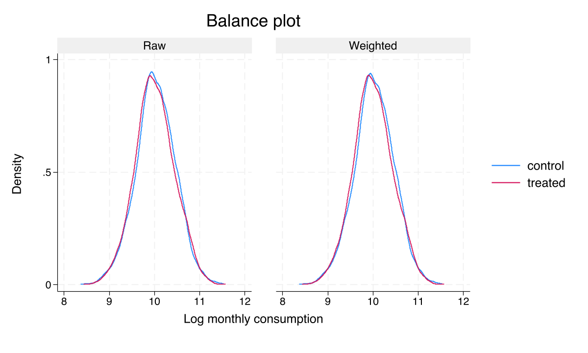
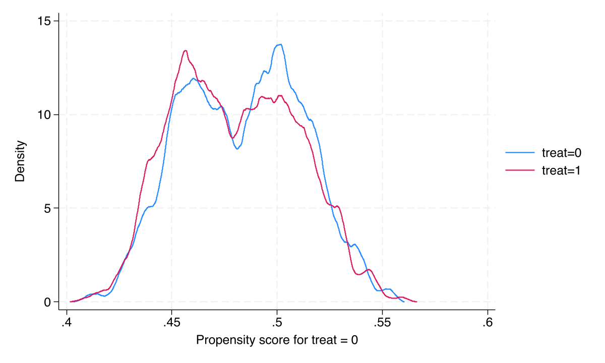
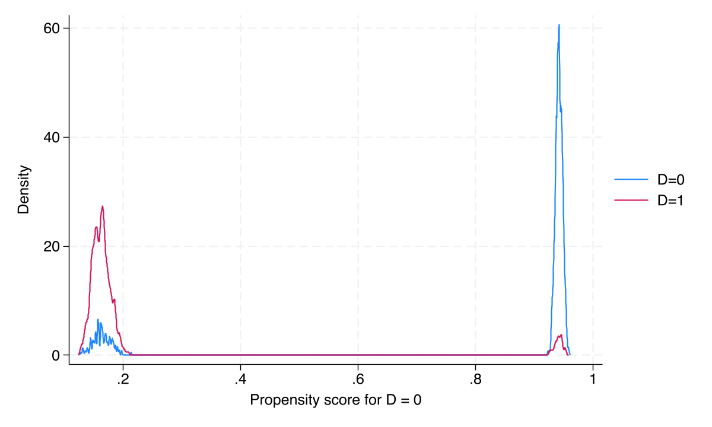

# The Tension {.divider background-color="#d97757"}

[Act I]{.act}

## Governments spend billions on cash transfers — but does the money actually raise welfare?

Cash transfers are among the most common development interventions worldwide. The hard part is not sending the money — it is *proving* it worked.

. . .

We sidestep the usual ambiguity with a simulation where the answer is known in advance: the program raises consumption by **12%** ($0.12$ log points). *Can a toolkit of estimators recover a number we already know?*

::: {.notes}
Open with the policy stakes, then reveal the pedagogical trick: simulated data with a known true effect of 0.12 log points. The whole talk is a controlled experiment on the estimators themselves — we judge each method by how close it lands to a ground truth we planted.
:::

## One dataset, twelve estimates — and the spread already tells a story

| Estimator family | Estimand | Estimate |
|---|:--:|:--:|
| Cross-sectional (RA / IPW / DR) | ATE (offer) | [0.113]{.key} |
| Difference-in-differences | ATT (offer) | 0.135–0.137 |
| Endogenous treatment (IV) | ATE (receipt) | 0.147 |
| **True effect** | — | **0.12** |

[Twelve specifications, three estimands, one truth at $0.12$ — and *every* 95% CI covers it.]{.comment}

::: {.notes}
This is the spoiler table. Don't defend each row yet — just plant that the methods cluster tightly and the true value sits inside every interval. We earn each estimator in Act II and return to this picture at the close.
:::

## Where we're going

::: {.incremental}
- Did randomization actually balance the groups?
- Three cross-sectional strategies — model the outcome, the treatment, or both
- Panel power: difference-in-differences and its doubly-robust cousin
- Offer vs. receipt — what imperfect compliance changes
:::

::: {.notes}
The roadmap mirrors the post's learning objectives. Each stage adds robustness: balance → cross-section → panel → compliance. Keep it to four beats so the audience can hold the whole arc.
:::

# The Investigation {.divider background-color="#6a9bcc"}

[Act II]{.act}

## The lab: 2,000 households, two waves, one known answer

::: {.incremental}
- **Outcome** — log monthly consumption ($y$); true effect $= 0.12$
- **Design** — balanced panel, baseline 2021 + endline 2024, 4,000 rows
- **Assignment** — `treat` randomized within poverty strata (intent-to-treat)
- **Receipt** — `D`, endogenous: only 85% of offered households took up
:::

[State the wedge early: random `treat` is exogenous; actual `D` is a choice. Most of the deck estimates the *offer* effect; Act III's coda returns to *receipt*.]{.comment}

::: {.notes}
The simulated panel is strongly balanced — every household appears in both waves, no attrition. Distinguish offer (treat, exogenous by randomization) from receipt (D, endogenous by self-selection). 51.8% were offered; 46.15% received. That 5.65pp gap is the compliance problem we postpone to Act III.
:::

## Randomization worked: every covariate sits under the 10% balance threshold


::: {.notes}
The first thing to verify in any RCT. SMD is the scale-free imbalance measure: mean gap over pooled SD. Everything clears 10%; female is the lone borderline at 9.3% — a chance imbalance, not a design flaw. We will control for it, not to remove bias, but to recover the precision randomization left on the table.
:::

## The only chance imbalance is female-headship — and it is borderline, not broken

| Covariate | Control | Treatment | SMD |
|---|---:|---:|---:|
| Consumption $y$ | 10.025 | 10.006 | <0.05 |
| Age | 35.34 | 34.93 | <0.05 |
| Education | 11.97 | 12.08 | <0.05 |
| Female-headed | 0.484 | 0.531 | [0.093]{.key} |
| Poverty | 0.307 | 0.318 | <0.05 |

[$p = 0.038$ for `female` — significant, but an SMD of $9.3\%$ is the right lens: large $n$ makes tiny gaps "significant."]{.comment}

::: {.notes}
P-values mislead at large n — they flag a 4.6pp gender gap as "significant" while the SMD says it is small and below threshold. The lesson: judge balance with standardized differences, not p-values. We carry female (and the others) into estimation as precision controls.
:::

## A formal balance check: AIPW on baseline data should — and does — find nothing

$$\hat\tau_{\text{baseline}} = -0.024 \quad (p = 0.196)$$

Run the doubly-robust estimator on **baseline only**, before the program exists. A null "effect" is exactly what a clean randomization predicts.

[Overidentification test: $\chi^2(5) = 3.22$, $p = 0.667$ — no residual imbalance after weighting.]{.comment}

::: {.notes}
This is a clever pre-flight: if randomization is real, a treatment effect estimated before treatment must be zero. AIPW returns -0.024, n.s., and the overid test fails to reject balance. It doubles as a soft introduction to doubly-robust estimation before we lean on it for real.
:::

## After weighting, the two groups' consumption distributions become indistinguishable



::: {.notes}
Visual companion to the balance test. Any small pre-existing gap in the outcome distribution is erased by the weighting scheme — the weighted treatment and control densities lie on top of each other.
:::

## Propensities cluster near 0.5 — exactly the comfortable regime for weighting



::: {.notes}
Common support is satisfied: no extreme propensities means no exploding inverse weights. This is the well-behaved world a designed RCT gives you — propensity ≈ 0.50 for everyone — which is *why* RA, IPW, and DR are about to agree.
:::

## What are we even estimating? ATE and ATT are different questions

:::: {.columns}
::: {.column width="50%"}
### ATE
$$E[Y(1) - Y(0)]$$

- The *policymaker's* question
- "What if we scale to everyone?"
:::
::: {.column width="50%"}
### ATT
$$E[Y(1) - Y(0) \mid T = 1]$$

- The *evaluator's* question
- "Did it help the participants?"
:::
::::

[Under randomization with homogeneous effects, ATE $=$ ATT. DiD will only ever give us the ATT.]{.comment}

::: {.notes}
Name the estimand for every method — this is the discipline the post insists on. Cross-sectional teffects can target either ATE or ATT. DiD is structurally ATT-only because its counterfactual is built for the treated group. Foreshadow that distinction now.
:::

## In an RCT, controls don't remove bias — they buy precision

[Randomized treatment is independent of potential outcomes, so the raw difference in means is *already* unbiased.]{.comment}

. . .

Adding covariates (RA, IPW, doubly robust) does **not** fix confounding here — there is none. It soaks up residual variation, tightening the estimate. *In observational studies the same controls would be doing the heavy lifting of identification.*

::: {.notes}
This is the single most important conceptual point for an RCT audience, and the most commonly muddled. Distinguish the randomized framing (adjustment = precision) from the observational framing (adjustment = bias removal). The estimators are identical; their *job* is not.
:::

## Three strategies, three things to model: outcome, treatment, or both

:::: {.columns}
::: {.column width="50%"}
### RA — model the outcome
- Fits $\hat\mu_1(X)$, $\hat\mu_0(X)$
- ATE $= \frac1N\sum[\hat\mu_1 - \hat\mu_0]$
- Fails if outcome model wrong
:::
::: {.column width="50%"}
### IPW — model the treatment
- Fits propensity $\hat p(X)$
- Reweights by $1/\hat p$, $1/(1-\hat p)$
- Fails on extreme weights
:::
::::

[Doubly robust (AIPW / IPWRA) fits **both** — and is consistent if *either* one is correct.]{.comment}

::: {.notes}
RA predicts the missing counterfactual from an outcome model; IPW reweights observed outcomes by inverse propensity; DR stitches them together. Each fails in a different way — outcome misspecification vs. extreme weights — which is exactly why combining them is insurance.
:::

## Doubly robust estimation: one model can be wrong and the answer still holds

$$\hat\tau_{DR}^{ATE} = \frac1N \sum_{i=1}^{N}\Big[\hat\mu_1(X_i) - \hat\mu_0(X_i) + \frac{T_i\,(Y_i - \hat\mu_1)}{\hat p(X_i)} - \frac{(1-T_i)(Y_i - \hat\mu_0)}{1 - \hat p(X_i)}\Big]$$

The first two terms are the RA prediction; the last two are IPW-weighted residuals that cancel RA's bias when the propensity model is right.

[Belt and suspenders: if the belt fails, the suspenders hold. Only *both* wrong is fatal.]{.comment}

::: {.notes}
Walk the two pieces. If the outcome model is right, residuals average to zero and DR collapses to RA. If the propensity model is right, the weighted residuals fix the RA bias. Getting at least one model approximately right is far easier than getting both perfect — that is the whole appeal.
:::

## The cross-sectional toolkit is six lines of teffects

``` {.stata code-line-numbers="1|3|5|7"}
keep if post==1
* RA — models the outcome only
teffects ra    (y c.age c.edu i.female i.poverty) (treat), ate
* IPW — models the treatment only
teffects ipw   (y) (treat c.age c.edu i.female i.poverty), ate
* Doubly robust — models both
teffects ipwra (y c.age c.edu i.female i.poverty) (treat c.age c.edu i.female i.poverty), vce(robust)
```

::: {.notes}
The grammar is the lesson: where the covariates sit tells you what's being modeled. RA puts them in the outcome parenthesis; IPW in the treatment parenthesis; IPWRA in both. AIPW is the alternative DR form and gives the same answer. Full do-file ships with the post.
:::

## The headline cross-sectional result: every method converges on 0.113 {background-color="#141413"}

[0.113]{.bignum}

[ATE of the offer · RA, IPW, and doubly-robust IPWRA agree to three decimals (SE 0.019)]{.bignum-label}

::: {.notes}
This is the Act-II payoff. The simple diff-in-means is 0.116; covariate-adjusted RA/IPW/DR all land at 0.113. They converge because randomization makes both the outcome model and the propensity model approximately correct — so there is nothing for them to disagree about. ATE and ATT are also nearly identical (0.113 each), confirming homogeneous effects.
:::

## RA, IPW, and DR agree because randomization made every model approximately right

| Method | Models | Estimand | Estimate | 95% CI |
|---|---|:--:|:--:|:--:|
| Simple diff-in-means | none | ATE | 0.116 | [0.078, 0.154] |
| Regression adjustment | outcome | ATE | 0.113 | [0.075, 0.150] |
| Inverse prob. weighting | treatment | ATE | 0.113 | [0.075, 0.150] |
| IPWRA (doubly robust) | both | ATE | [0.113]{.key} | [0.075, 0.150] |
| **True effect** | — | — | **0.12** | — |

[Adjusted estimates ($0.113$) sit just below the raw $0.116$ — that gap *is* the precision gain from controlling for the gender imbalance.]{.comment}

::: {.notes}
The convergence is the reassuring signal: when methods that model different things agree, you trust the design. The 0.003 drop from 0.116 to 0.113 is the covariate adjustment doing its precision job. In a messier observational dataset these rows would scatter, and DR would be the one to trust.
:::

## Panel data lets each household be its own control — differencing out the invisible

[Cross-sectional adjustment can only control for what you *observe*.]{.objection}

. . .

[Difference-in-differences compares each household to *itself* over time, cancelling every time-invariant unobservable — motivation, geography, family culture.]{.rebuttal}

::: {.notes}
The motivation for going panel. Observable covariates leave unobservable confounders untouched. By comparing within-household change baseline→endline, DiD differences out anything fixed about the household. In this RCT randomization already handled confounding, so the gain is conceptual robustness, not a new number.
:::

## DiD is a difference of differences — the control trend is the counterfactual

$$\hat\tau_{DiD} = \underbrace{(\bar Y_{T,post} - \bar Y_{T,pre})}_{\text{effect}\,+\,\text{trend}} - \underbrace{(\bar Y_{C,post} - \bar Y_{C,pre})}_{\text{trend only}}$$

The treated change carries the effect *plus* the common time trend; the control change carries the trend *alone*. Subtract, and the trend cancels.

[Identification rides on **parallel trends** — plausible here because randomization equalized the groups at baseline.]{.comment}

::: {.notes}
The control group's drift (e.g. nationwide income growth) is what the treated group would have experienced anyway. Subtracting it isolates the program. The identifying assumption is parallel trends, not equal levels — groups can start anywhere as long as they would have moved together absent treatment. Randomization makes that very credible.
:::

## Panel DiD recovers 0.135 — and it is structurally an ATT, not an ATE

``` {.stata code-line-numbers="1|3"}
gen treat_post = treat * post
xtdidregress (y) (treat_post), group(id) time(year) vce(cluster id)
*  ATET = 0.135  (SE 0.027)  95% CI [0.081, 0.188]
```

[0.135]{.key} sits a touch above the cross-sectional $0.113$, with a wider SE ($0.027$ vs $0.019$) — the price of differencing within households.

::: {.notes}
DiD estimates the ATT because its counterfactual — control trend applied to the treated baseline — is constructed only for the treated group. The wider SE is not a defect: it reflects honest within-household differencing. The headline value still covers 0.12. Standard errors clustered at the household level.
:::

## Doubly robust DiD: Sant'Anna–Zhao bring the "either model" guarantee to panels

$$\hat\tau_{DR}^{DiD} = \frac{1}{N_1}\sum_{i=1}^{N}\big[w_1(D_i) - w_0(D_i, X_i)\big]\big[\Delta Y_i - \hat\mu_{0,\Delta}(X_i)\big]$$

Subtract the control-group's *predicted change* from each household's actual change $\Delta Y_i$, then IPW-reweight so controls resemble the treated. Consistent if **either** model is right.

[Needs only **conditional** parallel trends — covariate-specific time trends are allowed.]{.comment}

::: {.notes}
This is the panel analogue of cross-sectional AIPW, applied to changes rather than levels. It relaxes parallel trends to a conditional version: trends can differ across covariate groups (poor vs non-poor) and the ATT is still identified. When both models are right it hits the semiparametric efficiency bound. It also dodges the heterogeneity traps of naive two-way fixed effects.
:::

# The Resolution {.divider background-color="#00d4c8"}

[Act III]{.act}

## Two independent DR-DiD implementations agree exactly on 0.137 {background-color="#141413"}

[0.137]{.bignum}

[ATT of the offer · `drdid` and `xthdidregress aipw` match to four decimals (SE 0.027)]{.bignum-label}

::: {.notes}
The community drdid package and Stata 17's built-in xthdidregress aipw return identical 0.137 — a clean cross-implementation check. xthdidregress labels it "cohort 2024" because it is built for staggered adoption; our two-period design has a single cohort. The DR-DiD is the most robust panel estimator in the toolkit.
:::

## Cross-section vs. panel: different estimands, different data, same truth inside the bars

| Method | Estimand | Data | Estimate | 95% CI |
|---|:--:|:--:|:--:|:--:|
| RA / IPW / DR | ATE | endline | 0.113 | [0.075, 0.150] |
| Basic DiD | ATT | both waves | 0.135 | [0.081, 0.188] |
| DR-DiD (`drdid`) | ATT | both waves | [0.137]{.key} | [0.084, 0.191] |
| DR-DiD (`xthdidregress`) | ATT | both waves | 0.137 | [0.084, 0.191] |
| **True effect** | — | — | **0.12** | — |

[DiD's value is **not** a tighter SE — it is robustness to time-invariant unobservables.]{.comment}

::: {.notes}
The DiD estimates (0.135–0.137) sit slightly above the cross-sectional 0.113, but every interval brackets 0.12. The reason to reach for DiD is not precision — its SEs are wider — but insurance against fixed confounders that randomization would not be providing in an observational world.
:::

## Offer vs. receipt: only 85% complied, so the per-recipient effect is larger

Most of the deck estimated the *offer* (`treat`, intent-to-treat). The effect of *receipt* (`D`) needs the random offer as an **instrument**, because take-up is a choice.

| Specification | Estimand | Estimate | 95% CI |
|---|:--:|:--:|:--:|
| `etregress` (IV) | ATE (receipt) | 0.147 | [0.099, 0.195] |
| `teffects ipwra` + $y_0$ | ATE (receipt) | [0.117]{.key} | [0.054, 0.180] |

[The doubly-robust receipt estimate ($0.117$) lands closest to the truth; both cover $0.12$.]{.comment}

::: {.notes}
treat is the valid instrument for D: randomized, strongly predictive of receipt, affecting consumption only through the transfer. etregress gives 0.147 — larger than the offer effect because non-compliers dilute the ITT. The DR receipt estimate, controlling for baseline y0, is 0.117, nearest to 0.12. The Wald test rho=0 (p=0.901) finds no endogeneity, as expected in a clean RCT.
:::

## Receipt-model overlap holds too — the IV story rests on solid balance



::: {.notes}
A robustness companion to the receipt estimate. After IPWRA weighting the effective samples rebalance to roughly 999 vs 1,001, weighted covariate means align (age 35.0 vs 35.2, poverty 31.1% vs 31.4%), and propensity overlap is sufficient. The receipt analysis is not resting on a fragile extrapolation.
:::

## Does any of this *make* the result causal? No — design does, methods only discipline

[Objection.]{.objection} Twelve estimators all near 0.12 — surely that proves the cash transfer caused the gain?

. . .

[Response.]{.rebuttal} The *randomization* identifies the effect; the estimators merely recover it efficiently and robustly. On real observational data the same methods rest on conditional independence and parallel trends — assumptions a clean RCT hands you for free but the world rarely does.

::: {.notes}
Steelman then answer. The convergence is reassuring because the design is sound, not because averaging methods manufactures identification. The pedagogical point of the simulation is to show *what good methods do when the design is good* — so you recognize the difference when the design is not.
:::

# When the design is clean, every honest estimator finds the same truth — and that agreement is the point. {.divider background-color="#141413"}

::: {.notes}
The single takeaway resolving the Act-I hook. We planted 0.12 and recovered 0.11–0.14 across twelve specifications, every CI covering the truth. In an RCT, convergence across RA, IPW, DR, DiD, and DR-DiD is a feature — and doubly-robust panel methods are the insurance you carry into the messier, non-randomized settings where that convergence is no longer free.
:::
