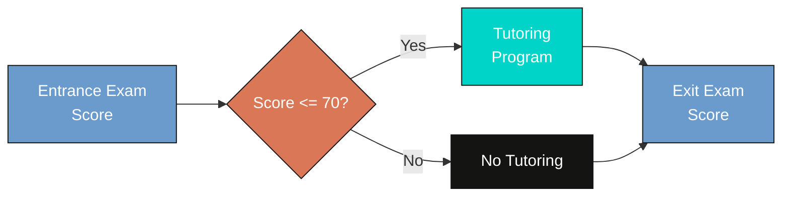
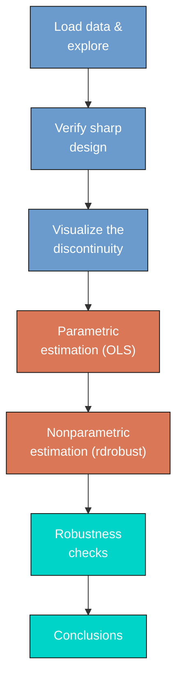
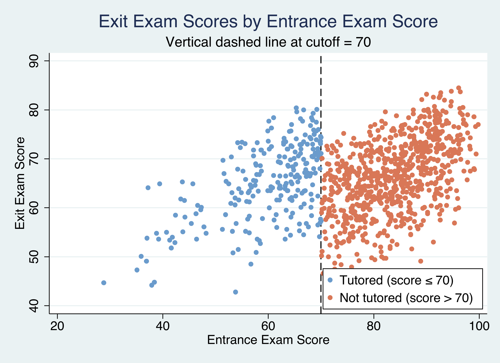
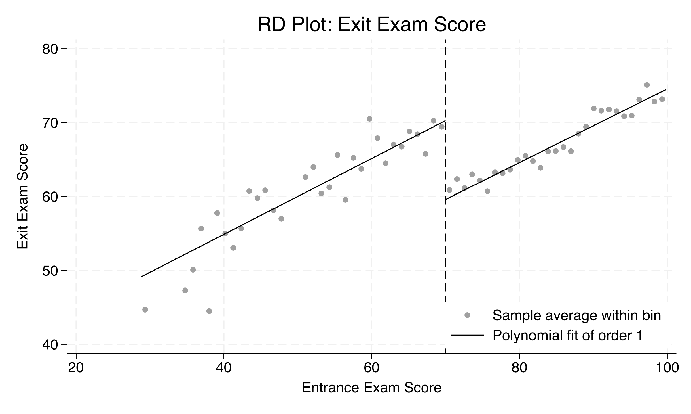
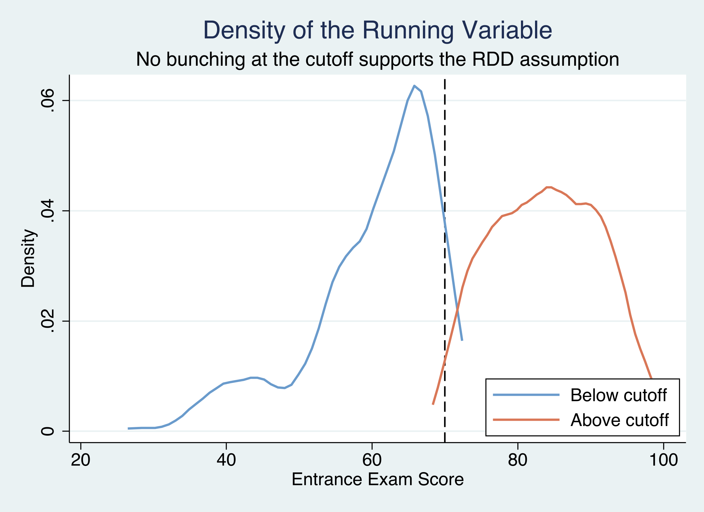
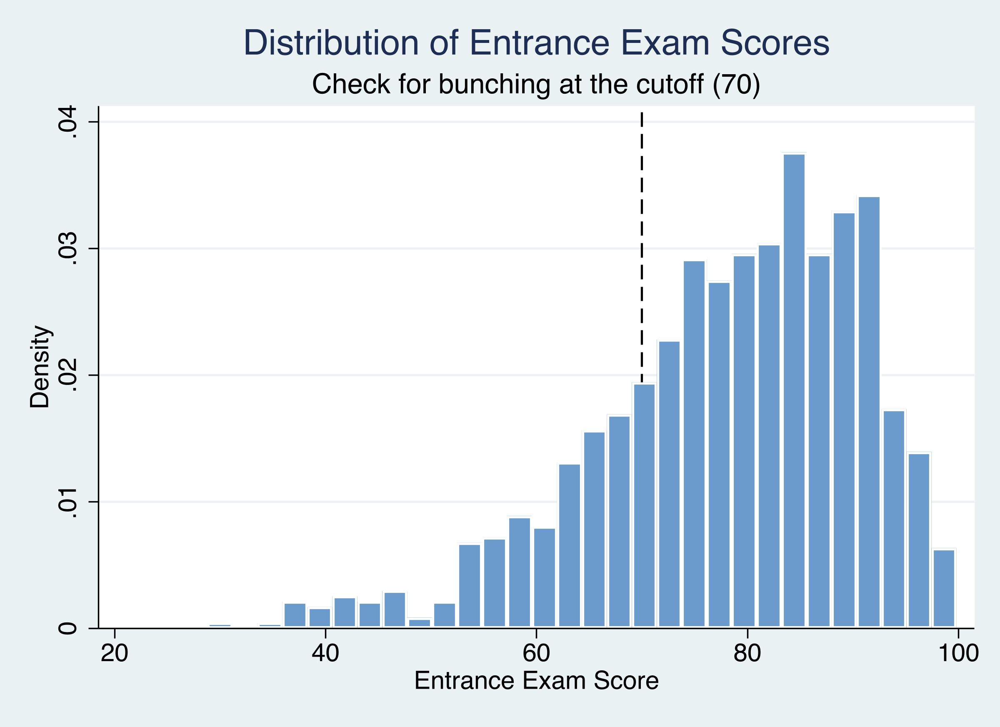
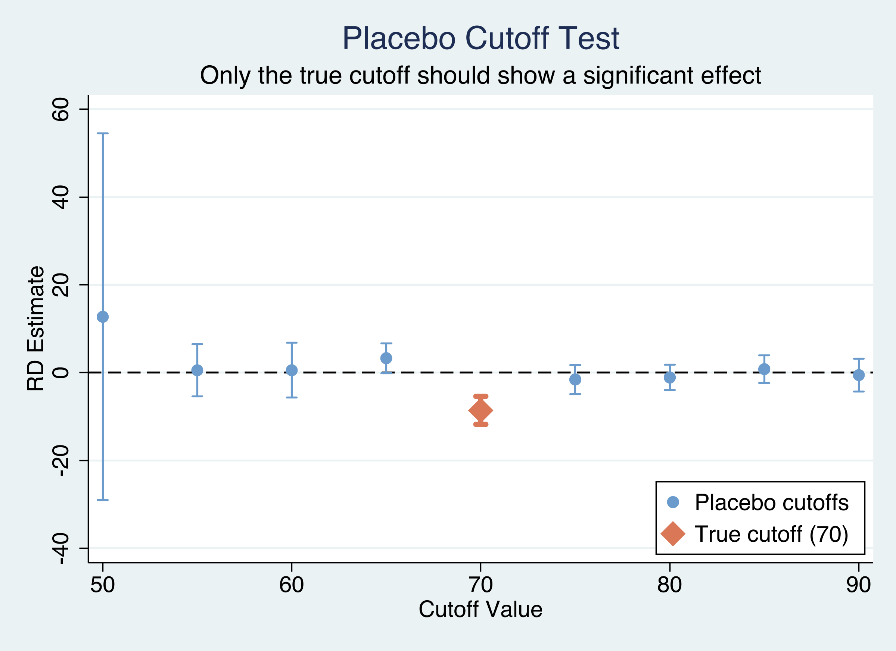

---
authors:
  - admin
categories:
  - Stata
  - Causal Inference
  - Regression Discontinuity (RDD)
draft: false
featured: false
date: "2026-04-23T00:00:00Z"
external_link: ""
image:
  caption: ""
  focal_point: Smart
  placement: 3
links:
- icon: file-code
  icon_pack: fas
  name: "Stata do-file"
  url: analysis.do
- icon: database
  icon_pack: fas
  name: "Dataset (.dta)"
  url: https://github.com/quarcs-lab/data-open/raw/master/isds/tutoring.dta
- icon: file-alt
  icon_pack: fas
  name: "Stata log"
  url: analysis.log
slides:
summary: Evaluate the causal effect of a school tutoring program on student exit exam scores using sharp regression discontinuity design with parametric OLS and nonparametric rdrobust estimation in Stata
tags:
  - stata
  - causal
  - causal inference
  - regression discontinuity
  - rdd
title: "Regression Discontinuity Design (RDD) in Stata: Evaluating a Tutoring Program"
url_code: ""
url_pdf: ""
url_slides: ""
url_video: ""
toc: true
diagram: true
---

## 1. Overview

Educational institutions constantly strive to improve student outcomes and close achievement gaps. One common strategy is to provide targeted tutoring to students who are struggling academically. But does tutoring actually work? And how can we rigorously measure its effect when we cannot randomly assign students to receive it?

In this tutorial, we evaluate a school tutoring program using **regression discontinuity design (RDD)** --- one of the most credible quasi-experimental methods available. A school district administered a standardized entrance exam to all students and automatically enrolled anyone who scored **70 or below** into a free tutoring program. Students above the cutoff received no tutoring. Because of this sharp, rule-based assignment, students who scored just below 70 are nearly identical to those who scored just above --- they just happened to fall on different sides of the threshold. By comparing outcomes for students near the cutoff, we can estimate the **causal effect** of tutoring on end-of-year exit exam scores.

The central question is: **Did the tutoring program improve student performance on the exit exam?** RDD allows us to answer this question credibly because the assignment rule creates a natural experiment at the cutoff.



The diagram above shows the assignment mechanism. The entrance exam score is the *running variable* --- the variable that determines treatment. The cutoff at 70 creates a sharp boundary: everyone below gets tutoring, everyone above does not. This sharp rule is what makes the design credible.

### Learning objectives

By the end of this tutorial, you will be able to:

- **Understand** what regression discontinuity design is and when it applies
- **Verify** whether an RDD is sharp or fuzzy using cross-tabulations
- **Estimate** the local average treatment effect (LATE) using both parametric OLS and nonparametric methods
- **Assess** the validity of an RDD using density tests, placebo cutoffs, and bandwidth sensitivity
- **Implement** the `rdrobust` and `rddensity` packages in Stata

---

## 2. Key concepts at a glance

The post leans on a small vocabulary repeatedly. The rest of the tutorial assumes you can move between these terms quickly. Each concept below has three parts. The **definition** is always visible. The **example** and **analogy** sit behind clickable cards: open them when you need them, leave them collapsed for a quick scan. If a later section mentions "LATE" or "density test" and the term feels slippery, this is the section to re-read.

**1. Running variable.**
The variable that determines treatment assignment. Must be continuous (or finely graded) so that units just above and below the cutoff are comparable. Manipulation of the running variable invalidates the design.

<div class="concept-pair">
<details class="concept-card concept-example">
<summary>Example</summary>

In this tutorial the running variable is `entrance_exam` (range 28.8–99.8). Students with scores below 70 received tutoring; those at or above 70 did not. The running variable is the dial that triggers the program.

</details>

<details class="concept-card concept-analogy">
<summary>Analogy</summary>

The dial that decides who gets in. Below the line, you're in. At or above, you're out. RDD only works if the dial cannot be tampered with.

</details>
</div>

**2. Cutoff** $c = 70$.
The threshold value of the running variable separating treated from untreated. Set ex-ante by the program rule, not by data analysis. The estimator extracts the causal effect from the discontinuity *at* this point.

<div class="concept-pair">
<details class="concept-card concept-example">
<summary>Example</summary>

This program's cutoff is 70 points. Students scoring 69 receive tutoring; students scoring 70 do not. The 1-point gap defines the comparison.

</details>

<details class="concept-card concept-analogy">
<summary>Analogy</summary>

The velvet rope at a club. Below the line, you walk in. At or above, you stand outside. Where the rope sits is set by the bouncer, not by the line of customers.

</details>
</div>

**3. Sharp vs fuzzy design.**
*Sharp*: treatment is a deterministic function of the running variable. Everyone below the cutoff is treated, no one above is. *Fuzzy*: the cutoff changes the probability of treatment, but some units cross over. Our design is sharp.

<div class="concept-pair">
<details class="concept-card concept-example">
<summary>Example</summary>

100% of students with `entrance_exam` below 70 are flagged for tutoring; 0% of those at or above. Compliance is perfect --- that's a sharp design. A fuzzy design would have, say, 70% take-up below and 5% above the cutoff.

</details>

<details class="concept-card concept-analogy">
<summary>Analogy</summary>

"No exceptions" vs "the bouncer sometimes waves people through." Sharp is a deterministic gate. Fuzzy is a noisy gate where some people slip through against the rule.

</details>
</div>

**4. Local average treatment effect (LATE)** $\tau = \lim\_{x \to c^-} E[Y \mid X = x] - \lim\_{x \to c^+} E[Y \mid X = x]$.
The treatment effect *at* the cutoff. The discontinuity in the conditional expectation function. Cannot be extrapolated to units far from the cutoff: students at score 30 or 95 may respond differently than those at 69 or 71.

<div class="concept-pair">
<details class="concept-card concept-example">
<summary>Example</summary>

`rdrobust` returns LATE = -8.58 (CI [-12.14, -4.54]) on `exit_exam`. The naive OLS estimate of 10.80 conflates the LATE with selection --- students who would score badly *anyway* are the ones who scored below 70 on the entrance exam. The clean LATE is around the cutoff only.

</details>

<details class="concept-card concept-analogy">
<summary>Analogy</summary>

The effect on the people right at the rope. The LATE tells you what the program does for borderline cases. It says nothing about students who scored very high or very low.

</details>
</div>

**5. Continuity assumption.**
Required for RDD identification. *Potential outcomes* must be smooth (continuous) through the cutoff. Equivalently: absent treatment, students just below the cutoff would perform similarly on the exit exam to students just above. Manipulation of the running variable would violate continuity.

<div class="concept-pair">
<details class="concept-card concept-example">
<summary>Example</summary>

If students at 69 and 71 differ only because of the tutoring program, continuity holds. If students could secretly retake the entrance exam to land just below 70, that selection would break continuity. We test continuity indirectly via the McCrary density test.

</details>

<details class="concept-card concept-analogy">
<summary>Analogy</summary>

The path is smooth, no cliff, at the rope. The line of customers grows continuously denser as you walk along; no sudden gap right at the velvet rope. Continuity says the *underlying behaviour* of customers does not jump at the gate --- only the gate itself enforces a discrete change.

</details>
</div>

**6. Bandwidth** $h$.
The window of running-variable values around the cutoff used for local-polynomial estimation. Smaller bandwidths reduce bias (closer to the cutoff = more comparable units) but increase variance (fewer observations). `rdrobust` selects the bandwidth via a data-driven MSE-optimal procedure.

<div class="concept-pair">
<details class="concept-card concept-example">
<summary>Example</summary>

`rdrobust` chooses an optimal bandwidth of 9.98 points on `entrance_exam`. The LATE estimator uses students with `entrance_exam` between 60.02 and 79.98 --- a window of about 20 points around the cutoff of 70. Outside that window, students are too different from cutoff students to inform the estimate.

</details>

<details class="concept-card concept-analogy">
<summary>Analogy</summary>

How close you stand to the rope to measure. Standing right at the rope, you see the boundary clearly but only count a few people. Standing far away, you count everyone but mix the boundary with everything else. The bandwidth is the trade-off.

</details>
</div>

**7. Density (McCrary) test.**
A formal test for manipulation of the running variable. The test inspects the density of `entrance_exam` for a discontinuity *at* the cutoff. A significant jump (more mass just below than just above) would suggest students manipulated their scores to qualify for treatment.

<div class="concept-pair">
<details class="concept-card concept-example">
<summary>Example</summary>

This study's McCrary test returns p = 0.58. We fail to reject the null of smooth density. There is no statistical evidence that students bunched their entrance exam scores to fall below 70.

</details>

<details class="concept-card concept-analogy">
<summary>Analogy</summary>

Does the line have a suspicious clump just outside the rope? If many people seem to bunch right below the cutoff, you suspect they're gaming the rule. If the crowd density is smooth across the rope, the dial is honest.

</details>
</div>

---

## 3. Analytical roadmap

Our analysis follows a "see it, verify it, estimate it, stress-test it" logic:



We start by understanding the data and verifying the sharp design. Then we visualize the discontinuity to build intuition before any estimation. Next, we estimate the treatment effect using both parametric (OLS) and nonparametric (rdrobust) methods. Finally, we stress-test the results with bandwidth sensitivity analysis, kernel comparisons, a McCrary density test, and placebo cutoff tests.

---

## 4. Data loading and exploration

We begin by loading the data and examining the key variables. The dataset contains 1,000 students with their entrance exam scores, exit exam scores, and tutoring status.

```stata
* Import data
use "https://github.com/quarcs-lab/data-open/raw/master/isds/tutoring.dta", clear
des
sum
```

```text
Contains data from tutoring.dta
 Observations:         1,000
    Variables:             5

Variable      Storage   Display    Value
    name         type    format    label      Variable label
-------------------------------------------------------------------------------
id              int     %8.0g                 ID of student
entrance_exam   float   %9.0g                 Entrance exam score
tutoring_text   str8    %9s                   Enrolled in the tutoring program?
exit_exam       float   %9.0g                 Exit exam score
tutoring        float   %9.0g                 Enrolled in the tutoring program?
                                                (Yes = 1, No=0)

    Variable |        Obs        Mean    Std. dev.       Min        Max
-------------+---------------------------------------------------------
          id |      1,000       500.5    288.8194          1       1000
entrance_e~m |      1,000     78.1427     12.7265       28.8       99.8
   exit_exam |      1,000     66.1646    7.625894       42.8       84.5
    tutoring |      1,000        .241    .4279043          0          1
```

The dataset contains 1,000 students with entrance exam scores ranging from 28.8 to 99.8 (mean = 78.1, SD = 12.7) and exit exam scores ranging from 42.8 to 84.5 (mean = 66.2, SD = 7.6). Of the 1,000 students, 241 (24.1%) were enrolled in the tutoring program. The entrance exam distribution is right-skewed --- most students scored above the 70-point cutoff, which explains why only about a quarter of the sample received tutoring.

We also create two helper variables: a numeric treatment indicator (`treat`) and a centered version of the running variable (`centered`). Centering at the cutoff makes the treatment coefficient directly interpretable as the discontinuity jump.

```stata
* Create treatment indicator and center the running variable
clonevar treat = tutoring
gen centered = entrance_exam - 70
```

Now let us verify whether the design is truly sharp.

---

## 5. Verifying the sharp design

In a sharp RDD, treatment assignment is a deterministic function of the running variable at the cutoff. Every student at or below 70 must receive tutoring, and every student above 70 must not. Any deviation would make this a *fuzzy* RDD, requiring a different estimation strategy.

```stata
* Cross-tabulate treatment by position relative to cutoff
gen byte below_cutoff = (entrance_exam <= 70)
tab below_cutoff treat, row
```

```text
 Scored at |
  or below | Tutoring program (1 =
    cutoff |     Yes, 0 = No)
      (70) |         0          1 |     Total
-----------+----------------------+----------
         0 |       759          0 |       759
           |    100.00       0.00 |    100.00
-----------+----------------------+----------
         1 |         0        241 |       241
           |      0.00     100.00 |    100.00
-----------+----------------------+----------
     Total |       759        241 |     1,000
           |     75.90      24.10 |    100.00
```

The cross-tabulation confirms perfect compliance: 100% of students at or below the cutoff (n = 241) received tutoring, and 100% of students above the cutoff (n = 759) did not. There are zero crossovers in either direction, confirming that this is a **sharp** RDD. This is the strongest possible form of the design --- treatment status is completely determined by the entrance exam score, with no exceptions.

With the sharp design confirmed, let us now visualize the discontinuity in outcomes.

---

## 6. Visualizing the discontinuity

### 6.1 Raw scatter plot

The signature visualization in any RDD is a scatter plot of the outcome against the running variable, with a vertical line at the cutoff. If the tutoring program has an effect, we should see a *jump* in exit exam scores at the cutoff.

```stata
twoway (scatter exit_exam entrance_exam if treat==1, ///
        mcolor("106 155 204") msize(small) msymbol(circle)) ///
       (scatter exit_exam entrance_exam if treat==0, ///
        mcolor("217 119 87") msize(small) msymbol(circle)), ///
    xline(70, lcolor(black) lwidth(medium) lpattern(dash)) ///
    legend(order(1 "Tutored" 2 "Not tutored") position(5) ring(0) col(1)) ///
    title("Exit Exam Scores by Entrance Exam Score") ///
    xtitle("Entrance Exam Score") ytitle("Exit Exam Score")
```


*Figure 1: Exit exam scores by entrance exam score. Blue dots are tutored students (score ≤ 70), orange dots are non-tutored. The dashed line marks the cutoff at 70.*

The scatter plot reveals a clear pattern: tutored students (blue dots, left of cutoff) tend to score higher on the exit exam than what the non-tutored trend (orange dots, right of cutoff) would predict at the same entrance exam levels. Both groups show a positive relationship between entrance and exit scores --- higher entrance scores predict higher exit scores --- but there is a visible upward shift for the tutored group near the cutoff.

### 6.2 RD plot with fitted lines

To see the discontinuity more clearly, we use `rdplot` from the `rdrobust` package. This command creates a binned scatter plot with local polynomial fits on each side of the cutoff. Think of it as a cleaned-up version of the raw scatter that smooths out individual variation.

```stata
ssc install rdrobust, replace
rdplot exit_exam entrance_exam, c(70) p(1)
```


*Figure 2: RD plot with binned averages and local linear fits. The downward jump at the cutoff reveals the tutoring effect.*

The RD plot makes the discontinuity unmistakable. The binned averages (dots) follow a clear upward trend on both sides of the cutoff, but there is a sharp **downward jump** at 70 when moving from left to right. The local linear fits (lines) show that tutored students near the cutoff score about 8--10 points higher than what the non-tutored trend would predict. This visual evidence strongly suggests that the tutoring program has a meaningful positive effect.

> **Why is the jump downward?** Because the plot moves left to right: from the tutored group (higher scores due to tutoring) to the non-tutored group. The jump *down* means tutored students score *higher* than non-tutored students at the cutoff.

Next, we move from visual evidence to formal estimation.

---

## 7. Parametric estimation (OLS)

The simplest way to estimate the RDD treatment effect is with ordinary least squares (OLS). We regress the exit exam score on the entrance exam score and a treatment indicator. The coefficient on the treatment indicator captures the jump in exit scores at the cutoff.

### 7.1 Simple linear model

This model assumes the same linear slope on both sides of the cutoff:

$$
\text{exit}\_i = \beta\_0 + \beta\_1 \cdot \text{entrance}\_i + \tau \cdot \text{treat}\_i + \varepsilon\_i
$$

In words, this says: a student's exit exam score depends on their entrance exam score (the slope \\(\beta\_1\\)) plus a jump of \\(\tau\\) points if they received tutoring. The coefficient \\(\tau\\) is our estimate of the treatment effect.

```stata
reg exit_exam entrance_exam treat, robust
```

```text
Linear regression                               Number of obs     =      1,000
                                                F(2, 997)         =     199.06
                                                Prob > F          =     0.0000
                                                R-squared         =     0.2685
                                                Root MSE          =     6.5288

------------------------------------------------------------------------------
             |               Robust
   exit_exam | Coefficient  std. err.      t    P>|t|     [95% conf. interval]
-------------+----------------------------------------------------------------
entrance_e~m |   .5097654   .0260511    19.57   0.000     .4586441    .5608868
       treat |   10.80043   .8063233    13.39   0.000      9.21815    12.38272
       _cons |   23.72725   2.202253    10.77   0.000     19.40566    28.04883
------------------------------------------------------------------------------
```

The simple linear model estimates that tutoring raises exit exam scores by **10.80 points** (95% CI: 9.22 to 12.38, p < 0.001). The entrance exam slope of 0.51 means that each additional point on the entrance exam is associated with about half a point higher on the exit exam. The model explains 26.9% of the variation in exit exam scores (R-squared = 0.2685). This estimate uses the full sample of 1,000 students and assumes a common linear relationship between entrance and exit exam scores on both sides of the cutoff.

### 7.2 Allowing different slopes

The simple model forces the same slope on both sides of the cutoff. A more flexible specification allows different slopes by interacting the centered running variable with the treatment indicator. We also fit a quadratic specification:

```stata
* Model 2: Different slopes on each side
gen interact = centered * treat
reg exit_exam centered treat interact, robust
estimates store m2_interact

* Model 3: Quadratic specification
gen centered2 = centered^2
reg exit_exam centered centered2 treat ///
    c.centered#c.treat c.centered2#c.treat, robust
estimates store m3_quadratic
```

### 7.3 Comparing parametric models

```stata
estimates table m1_linear m2_interact m3_quadratic, ///
    b(%9.3f) se(%9.3f) stats(r2 N)
```

```text
--------------------------------------------------
    Variable | m1_linear   m2_inte~t   m3_quad~c
-------------+------------------------------------
       treat |    10.800      10.797       9.223
             |     0.806       0.816       1.198
    centered |                 0.510       0.328
             |                 0.032       0.125
    interact |                -0.001
             |                 0.055
   centered2 |                             0.007
             |                             0.004
-------------+------------------------------------
          r2 |     0.268       0.268       0.271
           N |      1000        1000        1000
--------------------------------------------------
                                      Legend: b/se
```

The three parametric specifications tell a consistent story. Model 1 (same slope) and Model 2 (different slopes) produce nearly identical treatment effects of 10.800 and 10.797 points, respectively. The interaction term in Model 2 is essentially zero (-0.001, p = 0.98), indicating that the relationship between entrance and exit exams has the same slope on both sides of the cutoff. Model 3 (quadratic) gives a somewhat lower estimate of 9.22 points with a wider confidence interval (SE = 1.20 vs 0.81). All three R-squared values are virtually identical (0.268--0.271), suggesting that higher-order polynomials add no meaningful explanatory power.

| Model | Specification | Treatment effect | SE | R-squared |
|-------|--------------|-----------------|-----|-----------|
| 1 | Linear, same slope | 10.800 | 0.806 | 0.268 |
| 2 | Linear, different slopes | 10.797 | 0.816 | 0.268 |
| 3 | Quadratic | 9.223 | 1.198 | 0.271 |

However, parametric models impose functional form assumptions on the entire sample. The nonparametric approach, which we turn to next, avoids these assumptions by focusing only on observations near the cutoff.

---

## 8. Nonparametric estimation with rdrobust

The [`rdrobust`](https://rdpackages.github.io/rdrobust/) package implements the data-driven, nonparametric RDD estimation procedure from Cattaneo, Idrobo, and Titiunik (2019). Instead of fitting a regression through the entire sample, `rdrobust` focuses on observations within a *bandwidth* --- a narrow window around the cutoff --- and fits local polynomials on each side. The bandwidth is chosen automatically to minimize mean squared error.

$$
\hat{\tau}\_{RD} = \lim\_{x \downarrow c} E[Y\_i | X\_i = x] - \lim\_{x \uparrow c} E[Y\_i | X\_i = x]
$$

In words, the RD estimator measures the difference between the expected outcome just to the right of the cutoff (\\(c\\)) and just to the left. If there is a jump in outcomes at the cutoff, that jump is the treatment effect.

```stata
rdrobust exit_exam entrance_exam, c(70)
```

```text
Sharp RD estimates using local polynomial regression.

     Cutoff c = 70 | Left of c  Right of c            Number of obs =       1000
-------------------+----------------------            BW type       =      mserd
     Number of obs |       237         763            Kernel        = Triangular
Eff. Number of obs |       144         256            VCE method    =         NN
    Order est. (p) |         1           1
    Order bias (q) |         2           2
       BW est. (h) |     9.984       9.984
       BW bias (b) |    14.578      14.578
         rho (h/b) |     0.685       0.685

                   | Point         | Robust Inference
                   | Estimate      | z-stat        P>|z|    [95% Conf. Interval]
-------------------+--------------------------------------------------------------
         RD Effect | -8.5793       | -4.3034       0.000    -12.1422    -4.54297
```

The nonparametric estimator finds an RD effect of **-8.58 points** (robust 95% CI: -12.14 to -4.54, p < 0.001). The MSE-optimal bandwidth is 9.98 points, meaning only students who scored between 60 and 80 on the entrance exam are used in the estimation --- 400 students in total (144 below the cutoff, 256 above).

> **Why is the sign negative?** The `rdrobust` convention estimates the jump from left to right across the cutoff. Since tutored students (left side, below 70) score *higher* than non-tutored students (right side, above 70), the jump going rightward is downward --- hence negative. This is the same finding as the positive parametric coefficient on `treat` (+10.80): both tell us that tutoring improves scores. The magnitude is slightly smaller (8.6 vs 10.8) because `rdrobust` focuses only on students near the cutoff rather than the full sample.

To verify that the result is not sensitive to the choice of kernel weighting function, we also estimate with uniform and Epanechnikov kernels:

| Kernel | Bandwidth | RD effect | 95% CI |
|--------|-----------|-----------|--------|
| Triangular | 9.984 | -8.579 | [-12.142, -4.543] |
| Uniform | 7.223 | -8.200 | [-11.775, -4.049] |
| Epanechnikov | 8.179 | -8.388 | [-12.175, -4.197] |

All three kernels produce estimates between -8.20 and -8.58, all significant at p < 0.001. The choice of kernel function has minimal impact on the results.

---

## 9. Robustness and validity checks

A credible RDD requires more than just a significant estimate. We need to verify the assumptions underlying the design. This section presents four robustness checks: bandwidth sensitivity, density testing, and placebo cutoff analysis.

### 9.1 Bandwidth sensitivity

A key concern in RDD is that results might depend on the analyst's choice of bandwidth. If the estimate changes dramatically when the bandwidth is widened or narrowed, the finding is fragile. We estimate the RD effect at bandwidths ranging from 5 to 20 points around the cutoff:

```stata
foreach bw in 5 7 10 12 15 20 {
    quietly rdrobust exit_exam entrance_exam, c(70) h(`bw')
    di "`bw'" _col(10) %9.3f e(tau_cl) _col(23) %9.3f e(se_tau_cl)
}
```

```text
BW       Coef         SE          p-value
----     ---------    ---------   ---------
5           -8.202        2.337        0.000
7           -8.237        1.919        0.000
10          -8.581        1.615        0.000
12          -8.675        1.486        0.000
15          -8.842        1.312        0.000
20          -9.157        1.131        0.000
```

The estimate is remarkably stable: it ranges from -8.20 (BW = 5) to -9.16 (BW = 20), a spread of less than 1 point. All estimates are significant at p < 0.001, even at the narrowest bandwidth of 5 points where only a handful of students are used. As expected, narrower bandwidths produce larger standard errors (2.34 at BW = 5 vs 1.13 at BW = 20) because they use fewer observations. This stability is strong evidence that the estimated effect is genuine.

### 9.2 McCrary density test

The key identifying assumption of RDD is that students cannot precisely manipulate their entrance exam scores to fall on a specific side of the cutoff. If students could --- for example, by deliberately scoring below 70 to qualify for tutoring --- we would see unusual bunching in the distribution of entrance scores near 70.

The McCrary density test, implemented via the [`rddensity`](https://rdpackages.github.io/rddensity/) package, formally tests whether the density of the running variable is continuous at the cutoff:

```stata
ssc install rddensity, replace
rddensity entrance_exam, c(70)
```

```text
RD Manipulation test using local polynomial density estimation.

     c =    70.000 | Left of c  Right of c
-------------------+----------------------
     Number of obs |       237         763
Eff. Number of obs |       208         577
       BW est. (h) |    22.444      19.966

            Method |      T          P>|T|
-------------------+----------------------
            Robust |   -0.5521      0.5809
```

The density test yields a p-value of **0.58**, providing no evidence that students manipulated their entrance exam scores. Under the null hypothesis that the density is continuous at the cutoff, we would expect a p-value near 0.50 by chance --- and 0.58 is well within the expected range. This strongly supports the validity of the research design.

We can visualize this by plotting kernel density estimates separately for each side of the cutoff:


*Figure 3: Density of entrance exam scores on each side of the cutoff. Similar heights at the threshold indicate no manipulation (McCrary test p = 0.58).*

The two density curves approach the cutoff at similar heights, visually confirming the absence of bunching. There is no pile-up of students just below 70, which would be the tell-tale sign of manipulation.

We can also check the histogram of the raw entrance exam scores:


*Figure 4: Distribution of entrance exam scores. No bunching or heaping is visible near the 70-point cutoff.*

The histogram shows a smooth transition through the cutoff with no visible spike or dip near 70. Together, the formal test (p = 0.58), the density plot, and the histogram all support the no-manipulation assumption.

### 9.3 Placebo cutoff tests

If the tutoring effect is genuine, the discontinuity should appear *only* at the true cutoff of 70. If we test for discontinuities at other values (50, 55, 60, 65, 75, 80, 85, 90), we should find nothing significant --- there is no reason for a jump in exit scores at, say, 55 or 85.

```stata
foreach c in 50 55 60 65 70 75 80 85 90 {
    quietly rdrobust exit_exam entrance_exam, c(`c')
    di "`c'" _col(10) %9.3f e(tau_cl) _col(23) %9.3f e(pv_cl)
}
```

```text
Cutoff   Coef         SE          p-value
------   ---------    ---------   ---------
50          12.728       21.302        0.550
55           0.557        3.052        0.855
60           0.569        3.193        0.859
65           3.296        1.742        0.058
70 *        -8.579        1.617        0.000
75          -1.548        1.691        0.360
80          -1.095        1.472        0.457
85           0.817        1.605        0.611
90          -0.540        1.900        0.776
```


*Figure 5: Placebo cutoff test. Only the true cutoff at 70 (orange diamond) shows a significant effect; all placebo cutoffs straddle zero.*

The results are unambiguous: the true cutoff of 70 is the **only** value with a significant discontinuity (p < 0.001). All eight placebo cutoffs have p-values well above 0.05, ranging from 0.058 (cutoff 65) to 0.855 (cutoff 55). The marginally non-significant result at cutoff 65 (p = 0.058) likely reflects spillover from the true discontinuity --- since the optimal bandwidth is about 10 points, the estimation windows for cutoff 65 and cutoff 70 overlap. The placebo cutoff figure makes this visually clear: only the orange diamond (true cutoff at 70) has a confidence interval that excludes zero.

---

## 10. Discussion

Returning to our central question: **Did the tutoring program improve student performance on the exit exam?**

The evidence overwhelmingly says **yes**. Across all estimation approaches, the tutoring program raised exit exam scores by approximately **9 to 11 points** at the cutoff:

| Approach | Estimate | 95% CI | p-value |
|----------|----------|--------|---------|
| Parametric OLS (linear) | +10.80 | [9.22, 12.38] | < 0.001 |
| Parametric OLS (quadratic) | +9.22 | [6.87, 11.57] | < 0.001 |
| Nonparametric (rdrobust) | 8.58 | [4.54, 12.14] | < 0.001 |

This 9--11 point improvement represents roughly **13--16% of the mean exit exam score** (66.2 points) --- a substantial educational gain.

The design passes all validity checks. The RDD is perfectly sharp (100% compliance), the McCrary density test shows no evidence of score manipulation (p = 0.58), the estimate is stable across bandwidths (ranging from -8.20 to -9.16 across BW = 5 to 20), robust to kernel choice (triangular, uniform, Epanechnikov all yield similar results), and placebo cutoff tests confirm that the discontinuity is unique to the true cutoff of 70.

For policymakers, these results suggest that rule-based tutoring programs --- where eligibility is determined by a test score cutoff --- can be effective. An improvement of 9--11 points on an exit exam is meaningful: it could be the difference between passing and failing, or between qualifying for an advanced program and being held back. The sharp rule-based assignment also makes the program straightforward to implement and evaluate.

However, a key limitation of RDD is that the estimated effect is **local** to the cutoff. We know that tutoring helps students who scored near 70, but we cannot say whether it would help a student who scored 30 or 90. Extrapolating the RDD estimate to the full population of students would require additional assumptions about how the treatment effect varies across the score distribution.

---

## 11. Summary and next steps

### Key takeaways

1. **Tutoring works.** The program raised exit exam scores by 9--11 points at the cutoff (13--16% of the mean), a substantively large effect that is robust across all specifications.

2. **Sharp RDD is credible here.** The assignment rule is perfectly enforced (100% compliance), and all validity checks pass --- no manipulation (density test p = 0.58), no spurious discontinuities at placebo cutoffs, and stable estimates across bandwidths.

3. **Parametric and nonparametric methods agree.** OLS estimates the effect at 10.80 points (full sample), while rdrobust estimates it at 8.58 points (local to the cutoff). The difference reflects scope (global vs. local) rather than disagreement.

4. **The `rdrobust` package makes RDD accessible.** Data-driven bandwidth selection, robust inference, and built-in plotting tools reduce the number of arbitrary analyst choices.

### Limitations

- The effect is local to the cutoff (LATE), not generalizable to all students
- No covariates are available for additional smoothness checks
- We cannot test for heterogeneous effects by student characteristics

### Next steps

- **Fuzzy RDD.** Apply the methods to settings where compliance is imperfect (e.g., students can opt out of the program)
- **Covariates.** Incorporate pre-treatment variables to improve precision and run covariate smoothness tests
- **Heterogeneity.** Explore whether the tutoring effect varies by student characteristics using subgroup analysis

---

## 12. Exercises

1. **Alternative polynomials.** Re-estimate the parametric model using cubic and quartic polynomials. Do the treatment effect estimates change substantially? What happens to the standard errors as the polynomial order increases?

2. **Asymmetric bandwidths.** Run `rdrobust` with different bandwidths on each side of the cutoff (e.g., `h(8 12)`). Does allowing asymmetric bandwidths change the estimate or improve precision?

3. **Donut hole RDD.** Some researchers worry that observations exactly at the cutoff are unusual. Re-estimate the effect after dropping students who scored exactly 70 (a "donut hole" approach). Does the estimate change?

---

## References

1. [Cattaneo, M. D., Idrobo, N., and Titiunik, R. (2019). A Practical Introduction to Regression Discontinuity Designs: Foundations. Cambridge University Press.](https://rdpackages.github.io/references/Cattaneo-Idrobo-Titiunik_2019_CUP.pdf)
2. [Cattaneo, M. D., Jansson, M., and Ma, X. (2020). Simple Local Polynomial Density Estimators. Journal of the American Statistical Association, 115(531), 1449-1455.](https://doi.org/10.1080/01621459.2019.1635480)
3. [rdrobust -- Stata package for RDD estimation](https://rdpackages.github.io/rdrobust/)
4. [rddensity -- Stata package for density discontinuity testing](https://rdpackages.github.io/rddensity/)
5. [Heiss, A. (2023). Regression Discontinuity. Program Evaluation for Public Service.](https://evalsp23.classes.andrewheiss.com/example/rdd.html)

---

## AI acknowledgement

This tutorial was written with the assistance of Claude (Anthropic), which helped draft the narrative, interpretations, and code documentation. All statistical analyses were executed in Stata 18.0, and all results were verified against the actual Stata output.
