---
authors:
  - admin
categories:
  - Stata
  - Synthetic Control
date: "2026-04-26T00:00:00Z"
draft: false
featured: false
external_link: ""
image:
  caption: ""
  focal_point: Smart
  placement: 3
links:
- icon: laptop-code
  icon_pack: fas
  name: "Web app"
  url: web_app/index.html
- icon: file-code
  icon_pack: fas
  name: "Stata do-file"
  url: analysis.do
- icon: database
  icon_pack: fas
  name: "Dataset (.dta)"
  url: https://github.com/quarcs-lab/data-open/raw/master/isds/smoking_sc.dta
- icon: file-alt
  icon_pack: fas
  name: "Stata log"
  url: analysis.log
- icon: markdown
  icon_pack: fab
  name: "MD version"
  url: https://raw.githubusercontent.com/cmg777/starter-academic-v501/master/content/post/stata_sc/index.md
slides:
summary: Estimate the causal effect of California's Proposition 99 tobacco control program on cigarette sales using the synthetic control method in Stata, with in-space placebo, in-time placebo, and leave-one-out robustness tests
tags:
  - stata
  - causal
  - causal inference
  - synthetic control
  - policy evaluation
title: "The Synthetic Control Method in Stata: Did California's Tobacco Tax Cut Smoking?"
url_code: ""
url_pdf: ""
url_slides: ""
url_video: ""
toc: true
diagram: true
---

## Abstract

National declines in smoking make it difficult to isolate whether California's 1988 Proposition 99 — which raised the cigarette tax by 25 cents per pack and funded anti-smoking education from January 1989 — actually reduced cigarette consumption, because a simple before-and-after comparison confounds the policy with secular trends already pushing sales downward everywhere. This tutorial estimates the causal effect of Proposition 99 on per capita cigarette sales using the synthetic control method (SCM) of Abadie, Diamond, and Hainmueller (2010), implemented in Stata with the `synth2` package. The data are a strongly balanced panel of 39 US states observed annually from 1970 to 2000 (1,209 observations), from the QuarCS Lab repository, with cigarette sales as the outcome and log income, the share aged 15–24, retail price, and beer consumption as predictors. A "synthetic California" is built from a convex combination of donor states and validated with three inference tools: an in-space placebo test, an in-time placebo test (fake 1985 treatment), and leave-one-out robustness. The synthetic control achieves excellent pre-treatment fit (R-squared = 0.974, RMSE = 1.76 packs) and is composed of just five states, dominated by Utah (33.4%). The estimated ATT averages -19.0 packs per capita per year, growing from -7.6 packs in 1989 to a 25.8-pack (38%) gap by 2000, with an in-space placebo p-value of 0.026 (California's MSPE ratio of 123.5 ranks highest of all states), no spurious pre-1989 effect, and leave-one-out estimates stable within [-28.4, -23.5] packs. The results indicate that comprehensive tobacco control programs combining taxation and education can produce large, sustained reductions in smoking.

## 1. Overview

In 1988, California voters approved **Proposition 99**, a sweeping tobacco control initiative that raised cigarette taxes by 25 cents per pack and funded anti-smoking education campaigns. The law took effect in January 1989, making California one of the first US states to implement a comprehensive tobacco control program. But did it actually reduce cigarette consumption? And by how much?

Answering this question is harder than it sounds. We cannot simply compare California's cigarette sales before and after 1989, because national trends --- declining smoking rates, rising health awareness, federal regulations --- were already pushing sales downward everywhere. We need a credible **counterfactual**: what would California's cigarette sales have looked like *without* Proposition 99?

The **synthetic control method (SCM)**, introduced by Abadie, Diamond, and Hainmueller (2010), solves this problem by constructing a weighted combination of untreated states that closely matches California's pre-treatment cigarette sales trajectory. This "synthetic California" serves as the counterfactual, and the gap between actual California and its synthetic counterpart measures the causal effect of the policy.

This tutorial walks through the complete SCM workflow in Stata using the `synth2` package: from data exploration and baseline estimation, through three inference approaches (in-space placebo, in-time placebo, and leave-one-out robustness), to a final assessment of statistical significance.

### Learning objectives

- Understand the synthetic control method and when it applies (single treated unit, aggregate data, long pre-treatment period)
- Construct a synthetic control for California using the `synth2` command in Stata
- Assess pre-treatment fit quality using predictor balance tables, R-squared, and RMSE
- Interpret unit weights and predictor weights in the synthetic control
- Evaluate statistical significance using in-space placebo tests and Fisher exact p-values
- Validate results with in-time placebo tests and leave-one-out robustness checks
- Distinguish between ATT and ATE in the synthetic control framework

### Methodological roadmap

The analysis follows a four-stage progression, from estimation to validation:

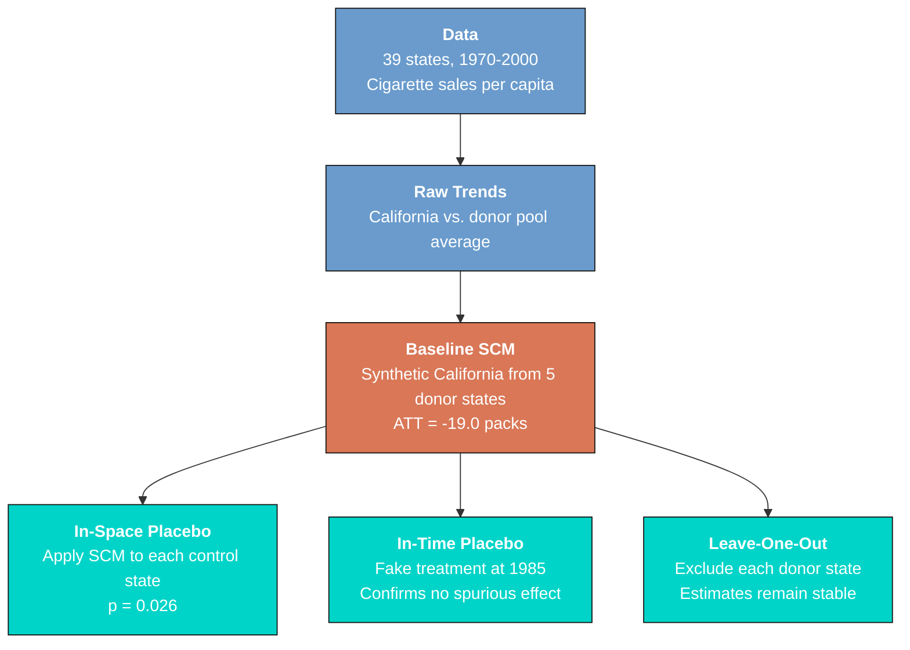

The baseline SCM (orange) produces the core treatment effect estimate. The three inference tools (teal) each test the estimate's credibility from a different angle: the in-space placebo asks "is this effect unusual compared to other states?", the in-time placebo asks "does a fake treatment produce similar results?", and the leave-one-out analysis asks "does any single donor state drive the results?"

### Key concepts at a glance

The post leans on a small vocabulary repeatedly. The rest of the tutorial assumes you can move between these terms quickly. Each concept below has three parts. The **definition** is always visible. The **example** and **analogy** sit behind clickable cards: open them when you need them, leave them collapsed for a quick scan. If a later section mentions "in-space placebo" or "MSPE ratio" and the term feels slippery, this is the section to re-read.

**1. Synthetic Control Method (SCM).**
A weighted average of donor (untreated) units, designed to reproduce the treated unit's pre-treatment trajectory. The post-treatment trajectory of the synthetic counterfactual is the missing potential outcome for the treated unit. Originated by Abadie and Gardeazabal (2003).

<div class="concept-pair">
<details class="concept-card concept-example">
<summary>Example</summary>

We construct a "Synthetic California" from a weighted combination of the 39 other US states. The weights are picked so that pre-1989 `cigsale` and the predictors (`lnincome`, `age15to24`, `retprice`, `beer`) match the real California as closely as possible. After 1989 (Proposition 99), the synthetic continues without the tax; the gap is the ATT.

</details>

<details class="concept-card concept-analogy">
<summary>Analogy</summary>

Building a sock-puppet twin. We assemble a stand-in for the treated unit out of pieces of donor units. The stand-in's pre-treatment behaviour mimics the treated unit's. After treatment, the stand-in tells us what would have happened.

</details>
</div>

**2. Donor pool.**
The set of untreated units from which the synthetic control is built. Must include units that did not experience the treatment and are otherwise comparable. The pool here excludes states that adopted similar tobacco-control measures during the study window.

<div class="concept-pair">
<details class="concept-card concept-example">
<summary>Example</summary>

This study's donor pool is 39 US states excluding California and three states with their own tax events. The pool intentionally drops contaminated states so that the synthetic California is built only from clean controls. The `state` and `year` identifiers index the panel.

</details>

<details class="concept-card concept-analogy">
<summary>Analogy</summary>

The casting list for an audition. The role goes to a weighted blend of candidates. The casting director draws only from people who do not have the trait being studied — they have to play the *counterfactual*.

</details>
</div>

**3. Predictor balance / pre-treatment fit** $\mathrm{RMSE}\_{pre}$.
How closely the synthetic mimics the treated unit on covariates AND on the pre-treatment outcome. Low pre-treatment RMSE means high credibility for the post-treatment gap. Predictor balance tables show the side-by-side comparison.

<div class="concept-pair">
<details class="concept-card concept-example">
<summary>Example</summary>

Synthetic California achieves $R^2 = 0.9743$ on pre-1989 `cigsale` and an RMSE of 1.76 packs/capita. The synthetic's pre-treatment trajectory tracks the real California's almost perfectly — the post-1989 gap is therefore informative.

</details>

<details class="concept-card concept-analogy">
<summary>Analogy</summary>

How convincing the sock puppet is *before* the moment of divergence. If puppet and original do the same gestures pre-treatment, the audience trusts the divergence post-treatment. If the puppet is already off-model pre-treatment, divergence proves nothing.

</details>
</div>

**4. ATT (treatment effect)** $\widehat{\mathrm{ATT}}\_t = Y\_{1t} - \hat{Y}\_{1t}^N$.
The post-treatment difference between the treated unit's actual outcome and its synthetic counterfactual. The headline causal estimate. Reported either year-by-year or averaged over a horizon.

<div class="concept-pair">
<details class="concept-card concept-example">
<summary>Example</summary>

The 1989–2000 average ATT for California is **-19.0 packs/capita**. The effect grows from -7.6 packs in 1989 to -26.4 packs in 1999. By 2000, real California sells 41.6 packs vs synthetic California's 67.4 — a 25.8-pack gap, or 38% reduction in `cigsale`.

</details>

<details class="concept-card concept-analogy">
<summary>Analogy</summary>

The moment the puppet breaks character. Pre-treatment, puppet and original move identically. Post-treatment, the puppet keeps following the script of "no policy" while the original veers off. The gap *is* the treatment effect.

</details>
</div>

**5. In-space placebo test.**
Run the synthetic-control algorithm on every donor state as if it had been treated. Most placebo gaps should be small. The treated unit's gap should stand out. The fraction of placebos with larger gaps is a pseudo p-value.

<div class="concept-pair">
<details class="concept-card concept-example">
<summary>Example</summary>

Running SCM on each of the 39 donor states gives a distribution of post-1989 placebo gaps. California's gap sits in the extreme tail; only one donor produces a larger gap. The pseudo p-value is **0.026** — significant at the 5% level.

</details>

<details class="concept-card concept-analogy">
<summary>Analogy</summary>

Does the trick work on people who weren't actually treated? If your "miracle drug" cures fake patients too, the cure is placebo. The in-space placebo runs the same algorithm on never-treated states to see whether a gap appears spuriously.

</details>
</div>

**6. In-time placebo test.**
Pretend the treatment happened earlier than it actually did and re-run the algorithm. The synthetic should track the real treated unit through the *fake* treatment date and *only* diverge at the *real* treatment date. A pre-real-treatment gap signals concern.

<div class="concept-pair">
<details class="concept-card concept-example">
<summary>Example</summary>

We re-run SCM pretending Proposition 99 took effect in 1980. Real California and synthetic California still track each other through 1988 and only diverge after 1989. The in-time placebo gives the design clean credibility.

</details>

<details class="concept-card concept-analogy">
<summary>Analogy</summary>

Pretending the treatment happened earlier. If your patient's symptoms started improving *before* you gave the drug, the drug isn't doing the work. The in-time placebo checks for prophetic improvement.

</details>
</div>

**7. MSPE ratio.**
Mean Squared Prediction Error post-treatment divided by MSPE pre-treatment. A high ratio means the post-treatment error is much larger than the pre-treatment error — the treatment effect dominates noise. The ratio is the more conservative inference statistic.

<div class="concept-pair">
<details class="concept-card concept-example">
<summary>Example</summary>

California's MSPE ratio is well above the donor-state distribution. The signal-to-noise interpretation: California's post-1989 gap is large *relative to* its (already small) pre-1989 fit error of RMSE 1.76 packs.

</details>

<details class="concept-card concept-analogy">
<summary>Analogy</summary>

Signal-to-noise score. A radio that hisses through music has low signal-to-noise. A radio that plays cleanly has a high ratio. MSPE-ratio is the same idea: how much louder is the treatment signal than the pre-treatment static?

</details>
</div>

**8. Leave-one-out (LOO).**
Repeat the SCM dropping each donor state in turn. If the estimate is stable across all leave-one-out specifications, no single donor is driving the result. If dropping one donor changes the headline materially, the result is fragile.

<div class="concept-pair">
<details class="concept-card concept-example">
<summary>Example</summary>

LOO across the 39 donors gives 2000 effect estimates ranging from -28.4 to -23.5 packs/capita. The 4.9-pack spread is small relative to the headline -25.8-pack gap. Utah carries the largest single donor weight (0.3340, or 33.4%) but dropping it does not break the result.

</details>

<details class="concept-card concept-analogy">
<summary>Analogy</summary>

Does any single ingredient carry the dish? Pull the saffron, taste again. Pull the salt, taste again. If the dish still tastes right after every removal, the recipe is robust.

</details>
</div>

---

## 2. Study design

### The policy intervention

California's Proposition 99 was a ballot initiative that:

- Raised the state cigarette tax by **25 cents per pack** (from 10 to 35 cents)
- Earmarked revenue for **anti-smoking education**, health services, and environmental programs
- Went into effect on **January 1, 1989**

This makes 1989 the treatment date, with 1970--1988 as the pre-treatment period and 1989--2000 as the post-treatment period.

### Why synthetic control?

Standard methods like difference-in-differences require a **parallel trends assumption** --- that treated and control units would have followed similar trajectories absent the treatment. With only one treated unit (California) and aggregate state-level data, this assumption is hard to test. The SCM instead constructs an explicit counterfactual by finding optimal weights for donor states, and the quality of the match is directly observable in the pre-treatment period.

### Variables

| Variable | Description | Role |
|----------|-------------|------|
| `state` | State identifier (1--39) | Panel unit |
| `year` | Year (1970--2000) | Time variable |
| `cigsale` | Cigarette sales per capita (packs) | Outcome |
| `lnincome` | Log personal income per capita | Predictor |
| `age15to24` | % population aged 15--24 | Predictor |
| `retprice` | Average retail cigarette price | Predictor |
| `beer` | Beer consumption per capita | Predictor |

> **Estimand: ATT (Average Treatment Effect on the Treated).** The SCM estimates the treatment effect specifically on California --- the one unit that received the intervention. It does not estimate what would happen if other states adopted similar policies (which would be the ATE). This distinction matters because California's response may differ from other states due to its unique demographics, economy, and political environment.

---

## 3. Data loading and exploration

We begin by loading the dataset, declaring the panel structure, and examining the key variables. The dataset is publicly available from the QuarCS Lab data repository.

```stata
* Load the dataset
use "https://github.com/quarcs-lab/data-open/raw/master/isds/smoking_sc.dta", clear

* Inspect variables
describe

* Summary statistics
summarize

* Declare panel structure
xtset state year

* Panel decomposition
xtsum
```

```text
Observations: 1,209 (Tobacco Sales in 39 US States)
Variables: 7

    Variable |        Obs        Mean    Std. dev.       Min        Max
-------------+---------------------------------------------------------
       state |      1,209          20    11.25929          1         39
        year |      1,209        1985    8.947973       1970       2000
     cigsale |      1,209    118.8932     32.7674       40.7      296.2
    lnincome |      1,014    9.861634    .1706769   9.397449   10.48662
        beer |        546     23.4304     4.22319        2.5       40.4
   age15to24 |        819     .175472    .0151589   .1294482   .2036753
    retprice |      1,209    108.3419    64.38199       27.3      351.2

Panel variable: state (strongly balanced)
Time variable: year, 1970 to 2000
```

The panel is **strongly balanced** --- all 39 states are observed in every year from 1970 to 2000, giving 1,209 total observations. Cigarette sales average 118.9 packs per capita with substantial variation (SD = 32.8, range 40.7 to 296.2). The between-state variation (SD = 26.5) exceeds the within-state variation (SD = 19.7), reflecting persistent differences in smoking culture across states. Not all covariates are available for the full panel --- beer consumption covers 14 years and age 15--24 covers 21 years --- but the `synth2` command handles this by averaging over the specified predictor window (1980--1988).

Next, we identify California's numeric code in the dataset using the value label:

```stata
* Identify California's state code
label list
```

```text
state:
           1 Alabama
           2 Arkansas
           3 California
           4 Colorado
           5 Connecticut
           ...
          39 Wyoming
```

California is encoded as **state == 3**. This identifier is required for the `trunit()` option in `synth2`. With the data structure confirmed, we can now visualize California's cigarette sales trajectory relative to the rest of the country.

---

## 4. Raw trends: California vs. the donor pool

Before applying the SCM, it helps to see how California compares to a simple average of all potential donor states. This motivates why a more sophisticated counterfactual is needed.

```stata
preserve
gen california = (state == 3)
collapse (mean) cigsale, by(year california)

twoway (connected cigsale year if california==1, ///
        msymbol(O) mcolor("106 155 204") lcolor("106 155 204") ///
        lwidth(medthick)) ///
       (connected cigsale year if california==0, ///
        msymbol(T) mcolor("128 128 128") lcolor("128 128 128") ///
        lwidth(medium) lpattern(dash)), ///
    xline(1989, lcolor("217 119 87") lpattern(dash) lwidth(medium)) ///
    ytitle("Cigarette Sales (packs per capita)") xtitle("Year") ///
    legend(order(1 "California" 2 "Donor Pool Average") position(6)) ///
    title("Cigarette Sales: California vs. Donor Pool") ///
    graphregion(color(white)) plotregion(color(white))
graph export "stata_sc_raw_trends.png", replace width(2400)
restore
```

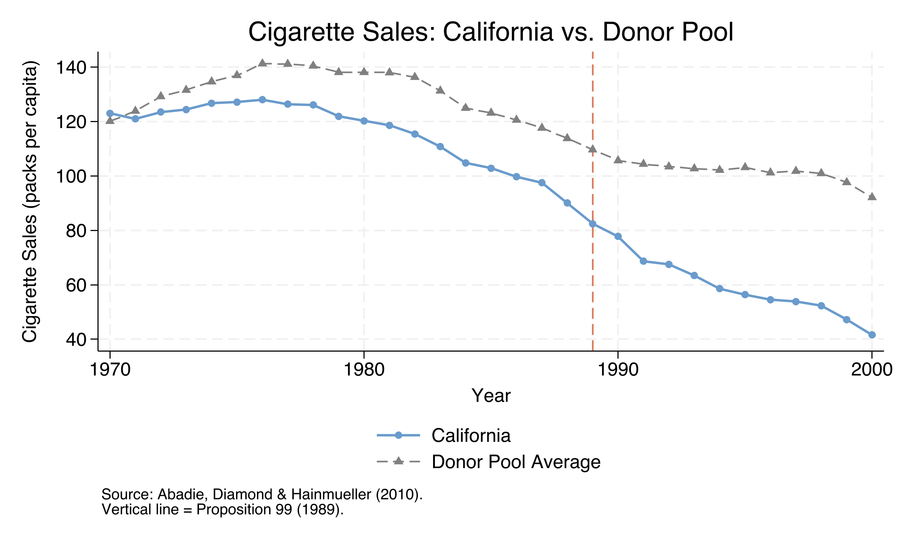

Before 1989, California's cigarette sales broadly tracked the donor pool average, though with some divergence in the early 1970s. After Proposition 99, California's sales drop sharply while the average control state continues a more gradual decline. By 2000, the gap is visually striking. However, a simple unweighted average is a crude comparator --- it gives equal weight to states like Kentucky (213 packs per capita) and Utah (64 packs), despite these having very different smoking patterns from California. The SCM addresses this by finding an *optimal* weighted combination of donor states that matches California's pre-treatment trajectory as closely as possible.

---

## 5. The synthetic control method

### Core idea

The SCM constructs a **synthetic version** of the treated unit as a weighted average of untreated units (the "donor pool"). Think of it like building a custom comparison group from scratch: instead of comparing California to any single state or a simple average, we blend several states together in proportions that best reproduce California's pre-treatment cigarette sales and economic characteristics.

### The optimization problem

Formally, the SCM solves a nested optimization. The **outer problem** finds predictor weights $v\_m$ that determine how much each covariate matters for matching. The **inner problem** finds unit weights $w\_j$ that minimize the weighted distance between California and its synthetic counterpart:

$$\min\_{W} \sum\_{m=1}^{M} v\_m \left( X\_{1m} - \sum\_{j=2}^{J+1} w\_j X\_{jm} \right)^2$$

In words, this equation minimizes the squared difference between California's predictor values ($X\_{1m}$) and the weighted average of donor states' predictor values ($\sum w\_j X\_{jm}$), where $v\_m$ controls how much weight each predictor receives. The weights $w\_j$ are constrained to be non-negative and sum to one, ensuring the synthetic control is a convex combination of real states.

### The treatment effect

Once the optimal weights $w\_j^*$ are found, the estimated treatment effect at each post-treatment time $t$ is simply the gap between actual and synthetic outcomes:

$$\hat{\tau}\_t = Y\_{1t} - \sum\_{j=2}^{J+1} w\_j^* Y\_{jt}$$

In words, the treatment effect in year $t$ equals California's actual cigarette sales minus the synthetic California's predicted sales. A negative $\hat{\tau}\_t$ means Proposition 99 *reduced* cigarette sales relative to what they would have been without the policy. The average treatment effect over the post-treatment period (ATT) is simply the mean of all $\hat{\tau}\_t$.

### Key assumptions

1. **No interference:** Proposition 99 did not affect cigarette sales in other states (e.g., through cross-border shopping effects).
2. **No anticipation:** States in the donor pool did not implement similar policies during the pre-treatment period.
3. **Good pre-treatment fit:** The synthetic control closely reproduces California's pre-1989 trajectory.

With the method established, let us now estimate the synthetic control for California.

---

## 6. Baseline synthetic control estimate

The `synth2` command performs the full SCM estimation. We specify seven predictors: four economic/demographic variables averaged over 1980--1988, plus cigarette sales at three specific pre-treatment years (1975, 1980, 1988) to anchor the trajectory match.

```stata
synth2 cigsale lnincome age15to24 retprice beer ///
    cigsale(1988) cigsale(1980) cigsale(1975), ///
    trunit(3) trperiod(1989) xperiod(1980(1)1988) ///
    nested allopt
```

The key options are:

- `trunit(3)` --- treated unit is California (state == 3)
- `trperiod(1989)` --- treatment begins in 1989
- `xperiod(1980(1)1988)` --- average covariates over 1980--1988 for matching
- `nested` --- use nested optimization (outer V-weights, inner W-weights)
- `allopt` --- try multiple starting values to avoid local optima

### Pre-treatment fit

```text
Fitting results in the pretreatment periods:
 Treated Unit: California    Treatment Time: 1989
 Number of Control Units  =  38     Root Mean Squared Error  = 1.75567
 Number of Covariates     =   7     R-squared                = 0.97434
```

The synthetic control explains **97.4% of the pre-treatment variation** in California's cigarette sales (R-squared = 0.974), with a Root Mean Squared Error (RMSE) of just 1.76 packs per capita. This is an excellent fit --- the synthetic California closely reproduces the real California's trajectory over the 19 pre-treatment years.

### Predictor balance

```text
   Covariate   |  V.weight    Treated    Synthetic Control     Average Control
      lnincome |   0.0000     10.0766      9.8588    -2.16%     9.8292    -2.45%
     age15to24 |   0.5459      0.1735      0.1735    -0.01%     0.1725    -0.59%
      retprice |   0.0174     89.4222     89.4108    -0.01%    87.2661    -2.41%
          beer |   0.0031     24.2800     24.2278    -0.21%    23.6553    -2.57%
 cigsale(1988) |   0.0049     90.1000     91.6677     1.74%   113.8237    26.33%
 cigsale(1980) |   0.0066    120.2000    120.5017     0.25%   138.0895    14.88%
 cigsale(1975) |   0.4221    127.1000    127.1112     0.01%   136.9316     7.74%
```

All seven predictor biases between California and its synthetic counterpart are below 2.2%, with five below 0.3%. Compare this to the simple average control, which shows biases up to 26.3% for 1988 cigarette sales. The SCM dramatically improves the match. The two dominant V-weights are **age 15--24** (0.546) and **cigarette sales in 1975** (0.422), meaning these predictors drive the matching optimization. Log income receives essentially zero weight, suggesting it contributes little to distinguishing California from its synthetic counterpart.

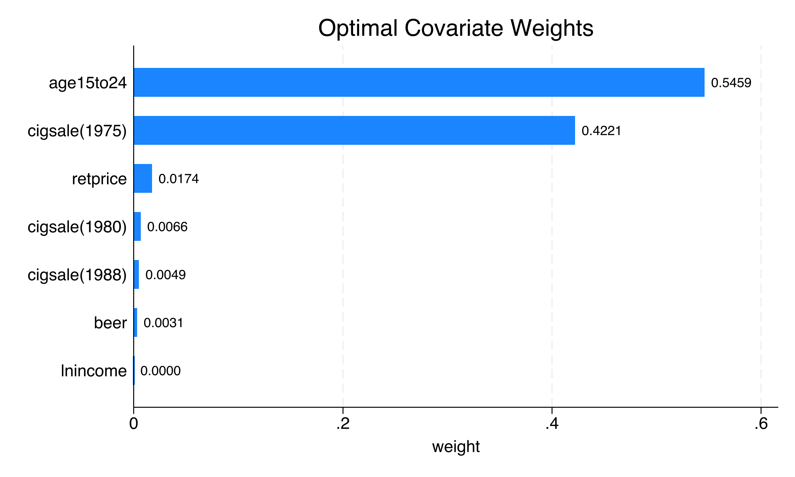

### Unit weights: who makes up synthetic California?

```text
Optimal Unit Weights:
     Unit    |    U.weight
        Utah |     0.3340
      Nevada |     0.2350
     Montana |     0.2020
    Colorado |     0.1610
 Connecticut |     0.0680
```

Only **five of 38** donor states receive positive weight. Synthetic California is one-third Utah (33.4%), about one-quarter Nevada (23.5%), one-fifth Montana (20.2%), with Colorado (16.1%) and Connecticut (6.8%) making up the rest. All 33 other states receive exactly zero weight. This sparsity is typical of SCM --- the method selects states with the most similar pre-treatment trajectories, not necessarily the most geographically proximate ones.

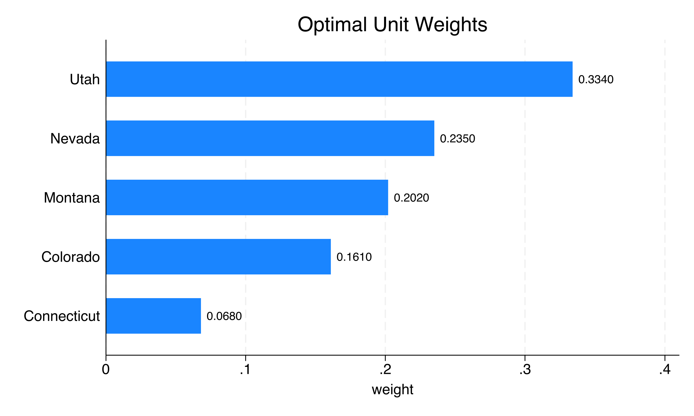

### Treatment effects

```text
 Time | Actual Outcome  Synthetic Outcome  Treatment Effect
 1989 |       82.4000            89.9945           -7.5945
 1990 |       77.8000            87.5039           -9.7039
 1993 |       63.4000            81.1897          -17.7897
 1997 |       53.8000            77.7123          -23.9123
 1999 |       47.2000            73.5711          -26.3711
 2000 |       41.6000            67.3550          -25.7550
 Mean |       60.3500            79.3518          -19.0018
```

The treatment effect grows progressively from **-7.6 packs** in 1989 to **-26.4 packs** by 1999, with the average over all 12 post-treatment years equaling **-19.0 packs per capita**. By 2000, California's actual sales (41.6 packs) were 25.8 packs below the synthetic counterfactual (67.4 packs) --- a 38% reduction. The widening gap suggests that the tobacco control program's impact compounded over time, consistent with cumulative behavioral change and declining social acceptability of smoking.

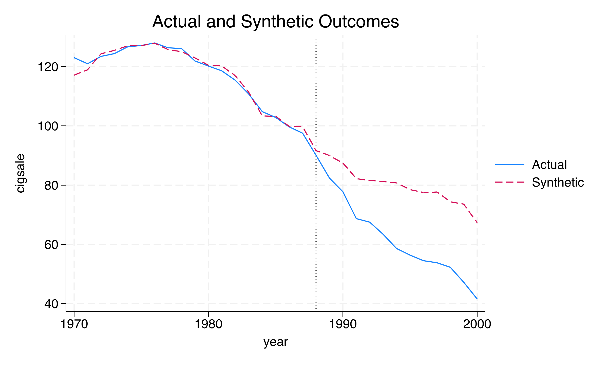

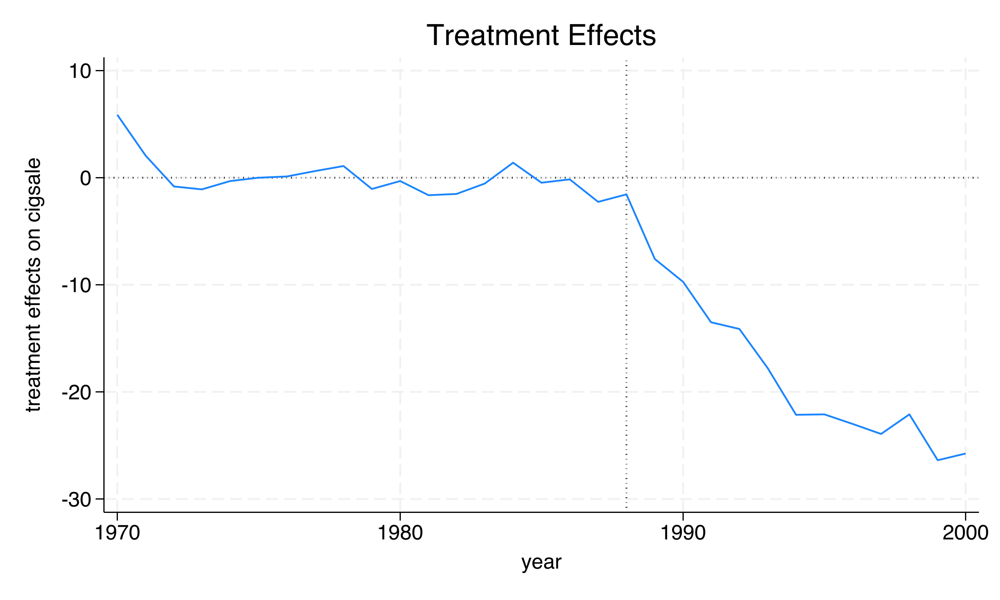

The `pred` graph confirms the excellent pre-treatment fit: the two lines are nearly indistinguishable from 1970 to 1988. After 1989, actual California falls sharply below the synthetic control. The `eff` graph shows this gap growing steadily, plateauing around -25 to -26 packs in 1999--2000. But is this effect "real" or could it be a statistical artifact? The next three sections test this question using placebo tests and robustness checks.

---

## 7. In-space placebo test

### Concept

The in-space placebo test is the primary inference tool for SCM. The idea is simple: apply the same SCM procedure to every control state, pretending each one is "treated" in 1989. If California's estimated effect is unusually large compared to these placebo effects, we have evidence of a genuine policy impact rather than a chance occurrence.

Think of it as a **permutation test**: if we randomly assigned the "treatment" label to any state, how often would we see an effect as large as California's? If the answer is "rarely," the effect is statistically significant.

```stata
synth2 cigsale lnincome age15to24 retprice beer ///
    cigsale(1988) cigsale(1980) cigsale(1975), ///
    trunit(3) trperiod(1989) xperiod(1980(1)1988) ///
    nested placebo(unit cut(2)) sigf(6)
```

The `placebo(unit)` option runs the SCM for each control state. The `cut(2)` filter excludes states whose pre-treatment MSPE is more than twice California's, removing states with poor pre-treatment fit that would distort the comparison. The `sigf(6)` option uses 6 significant figures for convergence (slightly relaxed from the default 7 to ensure all 38 optimizations converge).

### MSPE ratio ranking

The post/pre Mean Squared Prediction Error (MSPE) ratio measures how much worse a state's fit becomes after 1989 relative to before. A state with a genuine treatment effect should have a large ratio --- its post-treatment gap dwarfs its pre-treatment fit.

```text
      Unit     |  Pre MSPE  Post MSPE   Post/Pre MSPE
    California |    3.1668   391.2533       123.5490
       Georgia |    1.4610   116.8893        80.0074
      Virginia |    2.7825   219.8136        78.9994
      Missouri |    1.2009    85.1794        70.9308
         Texas |    4.6691   239.8559        51.3707
```

California's MSPE ratio of **123.5** is the highest among all states --- far exceeding Georgia (80.0), Virginia (79.0), and Missouri (70.9). This means California's post-treatment deterioration in fit is the most extreme in the entire donor pool, consistent with a genuine policy effect.

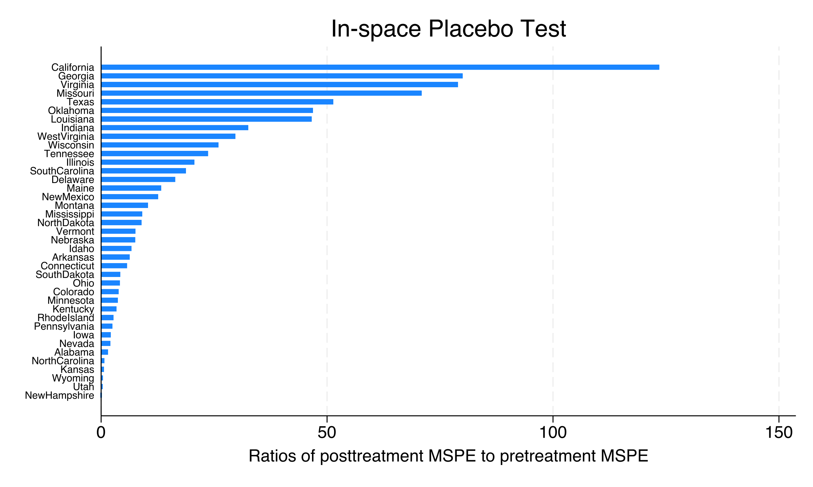

### Statistical significance

```text
Note: (1) Using all control units, the probability of obtaining a
      post/pretreatment MSPE ratio as large as California's is 0.0256.
      (2) Excluding control units with pretreatment MSPE 2 times larger
      than the treated unit, the probability is 0.0500.
```

Using all 39 states, the probability of California's MSPE ratio occurring by chance is **p = 0.026** (1/39). After applying the `cut(2)` filter --- which removes 19 states with pre-treatment MSPE more than twice California's, leaving 20 states with comparable fit quality --- the p-value is **p = 0.050** (1/20).

### Pointwise p-values

The left-sided p-values (appropriate because the treatment effect is negative) show significance at the 5% level in 8 of 12 post-treatment years:

```text
 Time |  Treatment Effect   Left-sided p-value
 1989 |          -7.4201            0.0500
 1990 |          -9.5789            0.1000
 1991 |         -13.2182            0.1500
 1992 |         -13.9061            0.1000
 1993 |         -17.6228            0.0500
 1997 |         -23.8174            0.0500
 2000 |         -25.5478            0.0500
```

The four years with weaker significance (1990--1992 and 1998, with p = 0.10--0.15) reflect periods when the treatment effect was smaller in magnitude. From 1993 onward, California ranks as the most extreme state in most years, with 1998 (p = 0.10) being the sole late-period exception.

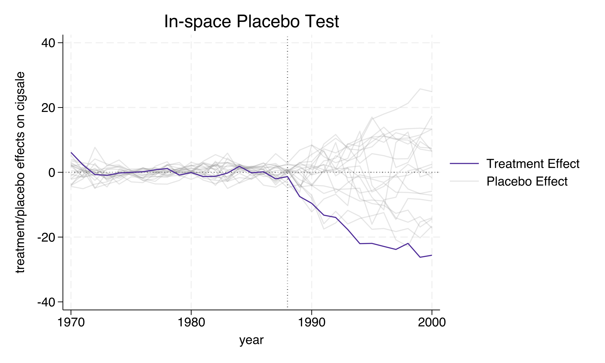

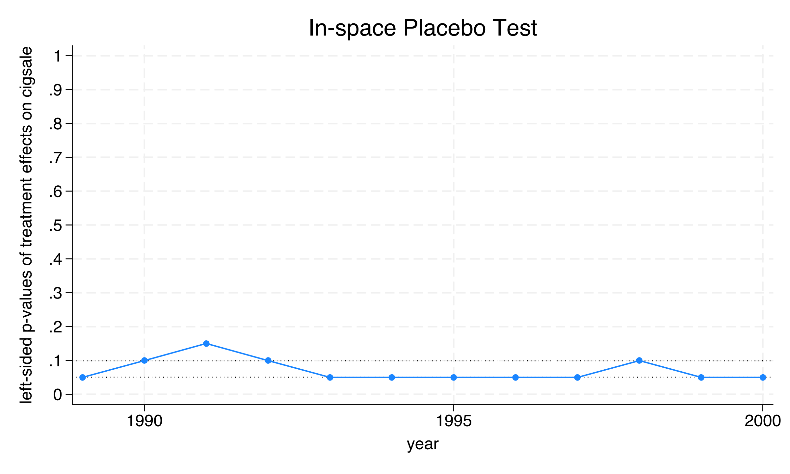

The spaghetti plot provides the most intuitive visual: California's treatment effect trajectory (the bold line plunging downward) is a dramatic outlier compared to the tight band of placebo effects hovering near zero. This visual evidence, combined with the formal p-values, supports the conclusion that Proposition 99 genuinely reduced cigarette sales. Next, we test whether the model would detect a spurious effect at a fake treatment date.

---

## 8. In-time placebo test

### Concept

The in-time placebo test checks the model's internal validity by assigning a **fake treatment date** before the actual intervention. If the model is well-specified, it should find **no significant effect** at the fake date --- and only detect the real effect after 1989.

We choose 1985 as the fake treatment year (four years before the actual policy). This requires two modifications to the baseline specification: (1) drop `cigsale(1988)` from the predictors because it would be "post-treatment" relative to the fake date, and (2) shorten the predictor averaging window to `xperiod(1980(1)1984)`.

```stata
synth2 cigsale lnincome age15to24 retprice beer ///
    cigsale(1980) cigsale(1975), ///
    trunit(3) trperiod(1989) xperiod(1980(1)1984) ///
    nested placebo(period(1985))
```

### Results

```text
In-time placebo test (fake treatment at 1985):
 Time | Actual Outcome  Synthetic Outcome  Treatment Effect
 1985 |      102.8000           106.1262           -3.3262
 1986 |       99.7000           103.2850           -3.5850
 1987 |       97.5000           106.1524           -8.6524
 1988 |       90.1000            98.4873           -8.3873

Real treatment period (1989-2000):
 1989 |       82.4000            96.5237          -14.1237
 1994 |       58.6000            77.9078          -19.3078
 2000 |       41.6000            67.1861          -25.5861
```

During the fake treatment period (1985--1988), the estimated effects range from **-3.3 to -8.7 packs** --- substantially smaller than the post-1989 effects of **-14.1 to -25.6 packs**. The fake-period effects are not exactly zero (averaging about -6.0 packs), reflecting the reduced pre-treatment fit when the training window is shortened from 9 years (1980--1988) to 5 years (1980--1984). This is confirmed by the lower R-squared (0.953 vs. 0.974 for the baseline). Despite this imperfection, the critical finding is clear: a **sharp discontinuity** appears at 1989 --- the real treatment date --- where the effect approximately doubles from -8.4 (1988) to -14.1 (1989) and continues deepening thereafter.

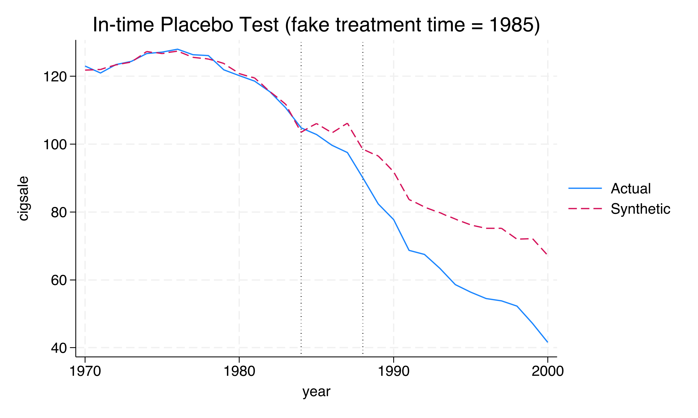

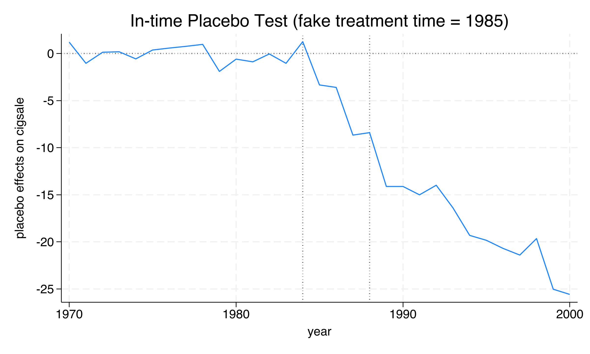

The in-time placebo validates that the model does not spuriously detect large effects in the pre-treatment period. The real policy impact begins precisely when we expect it --- at the onset of Proposition 99 in 1989. Next, we test whether the results depend on any single state in the donor pool.

---

## 9. Leave-one-out robustness

### Concept

The leave-one-out (LOO) analysis tests whether the treatment effect estimate is **driven by any single donor state**. Since synthetic California is composed of only five states (with Utah alone accounting for 33.4%), it is important to verify that removing any one of them does not fundamentally change the results.

The `loo` option re-runs the SCM after excluding each weighted donor state one at a time:

```stata
synth2 cigsale lnincome age15to24 retprice beer ///
    cigsale(1988) cigsale(1980) cigsale(1975), ///
    trunit(3) trperiod(1989) xperiod(1980(1)1988) ///
    nested loo frame(california) savegraph(california, replace)
```

### Results

```text
Leave-one-out treatment effects:
 Time |    Treatment Effect   Treatment Effect (LOO)
      |                              Min           Max
 1989 |            -7.3304       -9.9509       -5.9892
 1994 |           -22.0229      -24.7112      -20.0141
 1997 |           -23.9288      -30.6150      -17.9877
 2000 |           -25.6107      -28.3503      -23.4850
```

The treatment effect remains **consistently negative and substantial** across all LOO iterations. For the year 2000, the baseline estimate is -25.6 packs and the LOO range is [-28.4, -23.5] --- a spread of 4.9 packs, or about 19% of the baseline estimate. The widest variation occurs in 1997, where the LOO range spans from -30.6 to -18.0 (a 12.6-pack spread), likely driven by removing Nevada (the second-largest weighted state). Critically, **no LOO iteration produces a treatment effect near zero** in any year, confirming that the finding of a large negative effect is not an artifact of any single donor state.

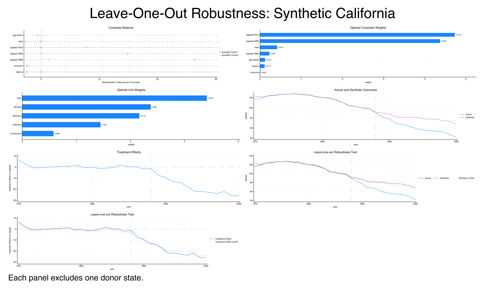

The LOO analysis provides the final piece of evidence: the treatment effect is robust to perturbations in the donor pool composition. With three independent validation checks (in-space placebo, in-time placebo, and LOO) all supporting the baseline finding, we can proceed with confidence to the discussion.

---

## 10. Discussion

### Answering the case study question

**Did California's Proposition 99 reduce cigarette consumption?** The evidence strongly suggests yes. The SCM estimates that Proposition 99 reduced California's per capita cigarette sales by an average of **19.0 packs per capita per year** over the 12-year post-treatment period. This effect was not instantaneous but grew progressively, from -7.6 packs in 1989 to -26.4 packs by 1999 --- consistent with cumulative behavioral change as anti-smoking campaigns took hold and social norms shifted.

To put this in perspective: California's actual cigarette sales in 2000 were 41.6 packs per capita, while the synthetic control predicts they would have been 67.4 packs without the policy. That is a **38% reduction** --- roughly 26 fewer packs per person per year. For a state with approximately 34 million residents in 2000, this translates to nearly **900 million fewer packs** sold annually.

### Statistical significance

The in-space placebo test yields a p-value of 0.026 (using all 39 states) or 0.050 (after filtering to states with comparable pre-treatment fit). While the filtered p-value sits exactly at the conventional 5% threshold --- a consequence of having only 20 qualifying comparison units --- the unfiltered p-value is well below 5%, and the visual evidence from the spaghetti plot leaves little doubt that California is an outlier.

### Robustness

Three independent checks support the baseline finding:

| Validation approach | Key result |
|---------------------|------------|
| In-space placebo | California's MSPE ratio (123.5) is the largest among 39 states |
| In-time placebo | Fake 1985 effects (-3 to -9 packs) are 2--4x smaller than real post-1989 effects (-14 to -26 packs) |
| Leave-one-out | Year 2000 effect ranges from -23.5 to -28.4 packs across all LOO iterations |

### Implications for policymakers

This analysis provides evidence that comprehensive tobacco control programs --- combining tax increases with funded anti-smoking campaigns --- can produce large and sustained reductions in cigarette consumption. The growing effect over time suggests that the program's benefits compound, potentially through intergenerational effects (fewer young people starting to smoke) and reinforcing social norms. These findings have influenced subsequent tobacco control policies in other US states and internationally.

---

## 11. Summary and key takeaways

1. **Proposition 99 reduced California's cigarette sales by 19.0 packs per capita (ATT).** The effect grew from -7.6 packs in 1989 to -26.4 packs by 1999, representing a 38% reduction relative to the counterfactual by 2000. Comprehensive tobacco control programs with both taxation and education components can produce large, sustained behavioral change.

2. **The synthetic control achieves excellent pre-treatment fit (R-squared = 0.974).** With an RMSE of just 1.76 packs, the weighted combination of five donor states reproduces California's pre-1989 trajectory almost perfectly. This validates the counterfactual --- we can trust that the post-treatment divergence reflects the policy's impact rather than pre-existing differences.

3. **Only five states compose synthetic California, with Utah dominant at 33.4%.** The SCM selects states by trajectory similarity, not geography. Nevada (23.5%), Montana (20.2%), Colorado (16.1%), and Connecticut (6.8%) complete the synthetic control. All 33 other states receive zero weight --- the method is inherently sparse.

4. **California's effect is statistically significant (p = 0.026).** The in-space placebo test shows that California's post/pre MSPE ratio (123.5) is the highest among all 39 states. The probability of obtaining such an extreme ratio by chance is just 2.6%.

5. **SCM inference is limited by the number of comparison units.** With 20 qualifying states after the cut(2) filter, the smallest achievable p-value is 0.05 (1/20). Researchers should report both filtered and unfiltered p-values and acknowledge this inherent limitation of permutation-based inference.

6. **The in-time placebo confirms no pre-existing trend.** Fake effects at 1985 (-3 to -9 packs) are substantially smaller than real effects after 1989 (-14 to -26 packs), and a clear discontinuity appears at 1989. The non-zero fake effects reflect imperfect fit with a shortened training window, not a genuine pre-treatment effect.

### Limitations

- The analysis covers only the period through 2000. California's long-term tobacco trajectory after 2000 may differ as other states adopted similar policies.
- The donor pool excludes states that implemented major tobacco control programs during the study period. If excluded states are systematically different from included ones, the counterfactual may be biased.
- SCM produces no standard errors or confidence intervals --- inference relies entirely on the placebo-based permutation approach.
- The five-state synthetic control is sensitive to the predictor specification. Changing the set of predictors or the averaging window can alter the donor weights and the ATT estimate (as seen in the in-time placebo specification, where the ATT shifts from -19.0 to -17.7).

### Next steps

- Apply the SCM to other states that implemented tobacco control programs after California (e.g., Massachusetts, Oregon)
- Explore **heterogeneous effects** by analyzing how the treatment effect varies across post-treatment years using rolling-window or recursive estimations
- Compare SCM estimates with **difference-in-differences** approaches applied to the same data
- Investigate **conformal inference** methods (Chernozhukov et al., 2021) for formal confidence intervals in the SCM framework

---

## 12. Exercises

1. **Modify the predictor set.** Re-run the baseline SCM without `beer` and `age15to24`. How do the unit weights and the ATT change? Does the pre-treatment fit deteriorate? What does this tell you about the importance of predictor choice in SCM?

2. **Change the MSPE filter.** Re-run the in-space placebo test with `cut(5)` instead of `cut(2)` (retaining states with pre-MSPE up to 5 times California's). How does the number of qualifying comparison units change? How does the p-value change? What are the trade-offs of a more inclusive vs. restrictive filter?

3. **Compare with simple difference-in-differences.** Estimate a two-way fixed effects (TWFE) regression of cigarette sales on a California-post-1989 interaction term with state and year fixed effects using all 39 states. How does the TWFE estimate compare to the SCM estimate of -19.0 packs? Which approach do you find more credible for this single-state policy evaluation, and why?

---

## References

1. [Abadie, A., Diamond, A. & Hainmueller, J. (2010). Synthetic Control Methods for Comparative Case Studies: Estimating the Effect of California's Tobacco Control Program. *Journal of the American Statistical Association*, 105(490), 493--505.](https://doi.org/10.1198/jasa.2009.ap08746)
2. [Abadie, A. (2021). Using Synthetic Controls: Feasibility, Data Requirements, and Methodological Aspects. *Journal of Economic Literature*, 59(2), 391--425.](https://doi.org/10.1257/jel.20191450)
3. [Yan, Y. & Chen, Z. (2023). `synth2`: Synthetic Control Method with Placebo Tests, Robustness Test and Visualization. Stata Package.](https://github.com/yanyachen/synth2)
4. [Chernozhukov, V., Wuthrich, K. & Zhu, Y. (2021). An Exact and Robust Conformal Inference Method for Counterfactual and Synthetic Controls. *Journal of the American Statistical Association*, 116(536), 1849--1864.](https://doi.org/10.1080/01621459.2021.1920957)
