---
authors:
  - admin
categories:
  - Stata
  - Synthetic Control
date: "2026-04-26T00:00:00Z"
draft: false
featured: false
external_link: ""
image:
  caption: ""
  focal_point: Smart
  placement: 3
links:
- icon: chalkboard-teacher
  icon_pack: fas
  name: "Slides (HTML)"
  url: slides/index.html
- icon: laptop-code
  icon_pack: fas
  name: "Web app"
  url: web_app/index.html
- icon: file-code
  icon_pack: fas
  name: "Stata do-file"
  url: analysis.do
- icon: database
  icon_pack: fas
  name: "Dataset (.dta)"
  url: https://github.com/quarcs-lab/data-open/raw/master/isds/smoking_sc.dta
- icon: file-alt
  icon_pack: fas
  name: "Stata log"
  url: analysis.log
- icon: markdown
  icon_pack: fab
  name: "MD version"
  url: https://raw.githubusercontent.com/cmg777/starter-academic-v501/master/content/post/stata_sc/index.md
slides:
summary: Estimate the causal effect of Proposition 99, the California tobacco control program, on cigarette sales using the synthetic control method in Stata, with in-space placebo, in-time placebo, and leave-one-out robustness tests
tags:
  - stata
  - causal
  - causal inference
  - synthetic control
  - policy evaluation
title: "The Synthetic Control Method in Stata: Did Proposition 99 Cut Smoking in California?"
url_code: ""
url_pdf: ""
url_slides: ""
url_video: ""
toc: true
diagram: true
---

## Abstract

National declines in smoking make it difficult to isolate the effect of Proposition 99 in California. Approved in 1988, the measure raised the cigarette tax by 25 cents per pack and funded anti-smoking education from January 1989. A simple before-and-after comparison confounds the policy with trends that were already reducing sales everywhere. This tutorial estimates the causal effect of Proposition 99 with the synthetic control method (SCM) of Abadie, Diamond, and Hainmueller (2010). It uses the `synth2` package in Stata. The data form a strongly balanced panel of 39 US states from 1970 to 2000 (1,209 observations), taken from the QuaRCS Lab repository. Cigarette sales per capita are the outcome. The seven predictors are log GDP per capita, the share aged 15–24, the retail price, beer consumption, and cigarette sales in 1975, 1980, and 1988. A "synthetic California" is built from donor states and examined with an in-space placebo, an in-time placebo with a fake 1985 treatment, and leave-one-out robustness. The pre-treatment fit is close but not exact, with an R-squared of 0.974 in `synth2` and a root mean squared error (RMSE) of 1.756 packs. Only five states receive positive weight, led by Utah (33.4%). The estimated average treatment effect on the treated (ATT) is −19.00 packs per capita per year. The gap grows from −7.59 packs in 1989 to −26.37 packs in 1999 and stands at −25.76 packs (38%) in 2000. The gaps of 1999 and 2000 may also reflect Proposition 10, which raised the tax by a further 50 cents per pack in January 1999. California has the highest ratio of post-treatment to pre-treatment mean squared prediction error (MSPE) of all 39 states, at 123.5. The in-space placebo p-value is therefore 0.026. The fake date yields much smaller effects. Leave-one-out gaps for 2000 stay within [−28.35, −23.49] packs. The results suggest that comprehensive tobacco control programs combining taxation and education can produce large, sustained reductions in smoking.

## 1. Overview

In 1988, California voters approved **Proposition 99**, a sweeping tobacco control initiative. It raised cigarette taxes by 25 cents per pack and funded anti-smoking education campaigns. The law took effect in January 1989, which made California one of the first US states with a comprehensive tobacco control program. The question is whether the program actually reduced cigarette consumption and, if so, by how much.

Answering this question is harder than it sounds. We cannot simply compare cigarette sales in California before and after 1989, because national trends were already pushing sales downward everywhere. These trends included declining smoking rates, rising health awareness, and federal regulations. We therefore need a credible **counterfactual**: the cigarette sales that California would have recorded *without* Proposition 99.

The **synthetic control method (SCM)** addresses this problem. Abadie, Diamond, and Hainmueller (2010) developed it for comparative case studies, building on Abadie and Gardeazabal (2003). The method constructs a weighted combination of untreated states that closely matches the pre-treatment trajectory of cigarette sales in California. This "synthetic California" serves as the counterfactual, and the gap between actual California and its synthetic counterpart measures the causal effect of the policy.

This tutorial walks through the complete SCM workflow in Stata with the `synth2` package of Yan and Chen (2023). It begins with data exploration and baseline estimation. It then applies three inference approaches: an in-space placebo, an in-time placebo, and leave-one-out robustness. It closes with a final assessment of statistical significance.

### Learning objectives

- Understand the synthetic control method and when it applies (single treated unit, aggregate data, long pre-treatment period)
- Construct a synthetic control for California using the `synth2` command in Stata
- Assess pre-treatment fit quality using predictor balance tables, R-squared, and RMSE
- Interpret unit weights and predictor weights in the synthetic control
- Evaluate statistical significance using in-space placebo tests and Fisher exact p-values
- Validate results with in-time placebo tests and leave-one-out robustness checks
- Distinguish between ATT and ATE in the synthetic control framework

### Methodological roadmap

The analysis follows a four-stage progression, from estimation to validation. It starts with the data and the raw trends, which motivate the method. The baseline SCM then produces the core estimate, and three inference tools test it. The diagram below summarizes this sequence.

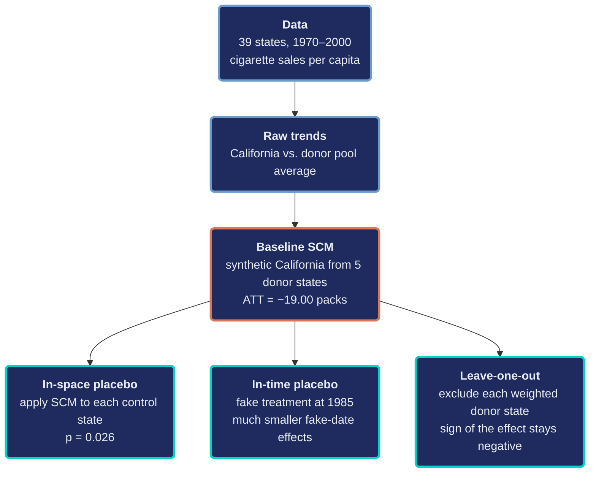
```mermaid
graph TD
    DATA("<b>Data</b><br/>39 states, 1970–2000<br/>cigarette sales per capita")
    RAW("<b>Raw trends</b><br/>California vs. donor pool average")
    SCM("<b>Baseline SCM</b><br/>synthetic California from 5 donor states<br/>ATT = −19.00 packs")
    SPACE("<b>In-space placebo</b><br/>apply SCM to each control state<br/>p = 0.026")
    TIME("<b>In-time placebo</b><br/>fake treatment at 1985<br/>much smaller fake-date effects")
    LOO("<b>Leave-one-out</b><br/>exclude each weighted donor state<br/>sign of the effect stays negative")

    DATA --> RAW
    RAW --> SCM
    SCM --> SPACE
    SCM --> TIME
    SCM --> LOO
    classDef blue fill:#1f2b5e,stroke:#6a9bcc,stroke-width:3px,color:#e8ecf2
    classDef orange fill:#1f2b5e,stroke:#d97757,stroke-width:3px,color:#e8ecf2
    classDef teal fill:#1f2b5e,stroke:#00d4c8,stroke-width:3px,color:#e8ecf2
    class DATA,RAW blue
    class SCM orange
    class SPACE,TIME,LOO teal
```

The baseline SCM (orange) produces the core estimate of the treatment effect. The three inference tools (teal) test the credibility of this estimate from different angles. The in-space placebo asks whether the effect is unusual compared with other states. The in-time placebo asks whether a fake treatment date produces similar results. The leave-one-out analysis asks whether any single donor state drives the results.

### Key concepts at a glance

The post relies repeatedly on a small vocabulary, and the rest of the tutorial assumes familiarity with these terms. Each concept below has three parts. The **definition** is always visible. The **example** and the **analogy** sit behind clickable cards, which readers can open when needed or leave collapsed for a quick scan. When a later section mentions an "in-space placebo" or an "MSPE ratio" and the term feels unclear, this section is the place to return to.

**1. Synthetic Control Method (SCM).**
The SCM builds a weighted average of donor (untreated) units that reproduces the pre-treatment trajectory of the treated unit. After treatment, the path of this synthetic unit estimates the missing potential outcome of the treated unit. The method originated with Abadie and Gardeazabal (2003).

<div class="concept-pair">
<details class="concept-card concept-example">
<summary>Example</summary>

We construct a "synthetic California" from a weighted combination of the 38 other states in the data. The weights are chosen so that pre-1989 `cigsale` and the predictors (`lnincome`, `age15to24`, `retprice`, `beer`) match the real California as closely as possible. From 1989, when Proposition 99 takes effect, the synthetic unit continues without the program. Each yearly gap between the two series is an effect estimate, and the ATT is their 1989–2000 average.

</details>

<details class="concept-card concept-analogy">
<summary>Analogy</summary>

Building a synthetic control resembles building a sock-puppet twin. We assemble a stand-in for the treated unit out of pieces of donor units, and its pre-treatment behavior mimics that of the treated unit. After treatment, the stand-in shows what would have happened without the intervention.

</details>
</div>

**2. Donor pool.**
The donor pool is the set of untreated units from which the synthetic control is built. It should contain only units that did not experience the treatment and that are otherwise comparable. In this application, the data already omit states that adopted similar tobacco control measures during the study window.

<div class="concept-pair">
<details class="concept-card concept-example">
<summary>Example</summary>

The donor pool of this study holds the 38 states other than California. Abadie, Diamond, and Hainmueller (2010) built these data without the District of Columbia. They also left out states that had large tobacco control programs or that raised cigarette taxes by 50 cents or more over 1989–2000. The code removes no further states, so every state in the panel except California serves as a potential donor.

</details>

<details class="concept-card concept-analogy">
<summary>Analogy</summary>

The donor pool works like the casting list for an audition. The role goes to a weighted blend of candidates rather than to a single actor. The casting director draws only from people who lack the trait being studied, because they must play the *counterfactual*.

</details>
</div>

**3. Predictor balance / pre-treatment fit** $\mathrm{RMSE}\_{pre}$.
This concept describes how closely the synthetic unit mimics the treated unit, both on the covariates and on the pre-treatment outcome. A low pre-treatment RMSE supports the credibility of the post-treatment gap, although it does not guarantee it. Predictor balance tables show the comparison side by side.

<div class="concept-pair">
<details class="concept-card concept-example">
<summary>Example</summary>

For pre-1989 `cigsale`, `synth2` reports $R^2 = 0.9743$ and an RMSE of 1.756 packs per capita. Its R-squared formula divides by the variation of the synthetic series, whereas the conventional R-squared with the same weights is 0.976. The fit is close but not exact, since the largest pre-treatment gap is 5.88 packs, in 1970. The post-1989 gap is still informative, provided that this early discrepancy is kept in mind.

</details>

<details class="concept-card concept-analogy">
<summary>Analogy</summary>

Pre-treatment fit measures how convincing the sock puppet is *before* the moment of divergence. If puppet and original make the same gestures before treatment, the audience trusts the divergence after treatment. If the puppet is already off-model before treatment, the later divergence proves little.

</details>
</div>

**4. ATT (treatment effect)** $\widehat{\mathrm{ATT}}\_t = Y\_{1t} - \hat{Y}\_{1t}^N$.
The treatment effect is the post-treatment difference between the actual outcome of the treated unit and its synthetic counterfactual. It is the headline causal estimate of the analysis. Researchers report it year by year or as an average over a horizon.

<div class="concept-pair">
<details class="concept-card concept-example">
<summary>Example</summary>

The 1989–2000 average ATT for California is **−19.00 packs per capita**. The effect grows from −7.59 packs in 1989 to −26.37 packs in 1999, although not in every single year. In 2000, real California sells 41.6 packs, against 67.4 packs for synthetic California. This difference is a 25.76-pack gap, or a 38% reduction in `cigsale`.

</details>

<details class="concept-card concept-analogy">
<summary>Analogy</summary>

The treatment effect is the moment the puppet breaks character. Before treatment, puppet and original move almost identically. After treatment, the puppet keeps following the script of "no policy" while the original veers off. The gap between them *is* the treatment effect.

</details>
</div>

**5. In-space placebo test.**
The in-space placebo test runs the synthetic control algorithm on every donor state as if it had been treated. Most placebo gaps should be small, while the gap of the treated unit should stand out. The permutation p-value is the share of all units, the treated one included, whose MSPE ratio is at least as large as the treated ratio.

<div class="concept-pair">
<details class="concept-card concept-example">
<summary>Example</summary>

Running the SCM on each of the 38 donor states gives a distribution of post-1989 placebo gaps. No state has a larger post/pre MSPE ratio than California, which ranks 1 of 39. The resulting permutation p-value is **0.026**, which is significant at the 5% level.

</details>

<details class="concept-card concept-analogy">
<summary>Analogy</summary>

The in-space placebo asks whether the trick also works on people who were not actually treated. If an analysis credits a "miracle drug" with curing patients who never took it, the analysis itself is suspect. The in-space placebo runs the same algorithm on never-treated states to see whether a gap appears spuriously.

</details>
</div>

**6. In-time placebo test.**
The in-time placebo test pretends that the treatment happened earlier than it did and reruns the algorithm. Ideally, the synthetic unit tracks the treated unit through the *fake* treatment date and diverges *only* at the *real* treatment date. A gap that opens before the real treatment date signals concern.

<div class="concept-pair">
<details class="concept-card concept-example">
<summary>Example</summary>

We rerun the SCM as if Proposition 99 had taken effect in 1985. The fake-window gaps range from −3.33 to −8.65 packs over 1985–1988, against −13.97 to −25.59 packs from 1989 onward. The effects at the fake date are much smaller than the real effects, although they are not zero.

</details>

<details class="concept-card concept-analogy">
<summary>Analogy</summary>

The in-time placebo resembles checking the timing of a recovery. If the symptoms of a patient started improving *before* the drug was given, the drug may not be doing the work. The in-time placebo checks for this kind of premature improvement.

</details>
</div>

**7. MSPE ratio.**
The MSPE ratio divides the mean squared prediction error after treatment by the MSPE before treatment. A high ratio means that the post-treatment error is much larger than the pre-treatment error, so the treatment effect dominates the noise. Because a poor pre-treatment fit enlarges the denominator, poorly fitted placebos tend to receive small ratios. The ratio therefore needs no cutoff to exclude them.

<div class="concept-pair">
<details class="concept-card concept-example">
<summary>Example</summary>

The MSPE ratio of California, 123.5, is well above the distribution of the donor states. This ratio comes from the refit of California inside the placebo run, which uses `sigf(6)` and no `allopt`. That refit has an RMSE of 1.780 and a pre-treatment MSPE of 3.17, against 1.756 and 3.08 in the baseline. In signal-to-noise terms, the post-1989 gap of California is large *relative to* its small pre-1989 fit error.

</details>

<details class="concept-card concept-analogy">
<summary>Analogy</summary>

The MSPE ratio works like a signal-to-noise score. A radio that hisses through the music has a low signal-to-noise ratio, while a radio that plays cleanly has a high one. The MSPE ratio applies the same idea by asking how much louder the treatment signal is than the pre-treatment static.

</details>
</div>

**8. Leave-one-out (LOO).**
The leave-one-out check repeats the SCM, dropping each donor with positive weight in turn. If the estimate is stable across all leave-one-out specifications, no single donor drives the result. If dropping one donor changes the headline materially, the result is fragile.

<div class="concept-pair">
<details class="concept-card concept-example">
<summary>Example</summary>

Dropping each of the five donors with positive weight gives effect estimates for 2000 from −28.35 to −23.49 packs per capita. The 4.87-pack spread is small relative to the gap of −25.61 packs in the refit of the same run (−25.76 in the baseline). Utah carries the largest single donor weight (0.334, or 33.4%), but dropping it does not break the result.

</details>

<details class="concept-card concept-analogy">
<summary>Analogy</summary>

The leave-one-out check asks whether any single ingredient carries the dish. The cook removes the saffron and tastes again, then removes the salt and tastes again. If the dish still tastes right after every removal, the recipe is robust.

</details>
</div>

---

## 2. Study design

### The policy intervention

Proposition 99 was a California ballot initiative that combined a higher tax with earmarked spending. Its main features also determine the treatment date used in this tutorial. The list below summarizes them.

- Raised the state cigarette tax by **25 cents per pack** (from 10 to 35 cents)
- Earmarked revenue for **anti-smoking education**, health services, and environmental programs
- Went into effect on **January 1, 1989**

These features make 1989 the treatment date. The pre-treatment period therefore covers 1970–1988, and the post-treatment period covers 1989–2000. This split leaves a long pre-treatment period to build the synthetic control and a long post-treatment period to measure the effect.

### Why synthetic control?

Standard methods such as difference-in-differences require a **parallel trends assumption**. This assumption states that treated and control units would have followed similar trajectories in the absence of treatment. With only one treated unit (California) and aggregate state-level data, the assumption is hard to test. The SCM instead constructs an explicit counterfactual by finding optimal weights for the donor states. The quality of the match is then directly observable in the pre-treatment period.

### Variables

| Variable | Description | Role |
|----------|-------------|------|
| `state` | State identifier (1–39) | Panel unit |
| `year` | Year (1970–2000) | Time variable |
| `cigsale` | Cigarette sales per capita (packs) | Outcome |
| `lnincome` | Log of state GDP per capita | Predictor |
| `age15to24` | Share of the population aged 15–24 (a fraction) | Predictor |
| `retprice` | Average retail cigarette price | Predictor |
| `beer` | Beer consumption per capita | Predictor |

> **Estimand: ATT (Average Treatment Effect on the Treated).** The SCM estimates the treatment effect specifically for California, the one unit that received the intervention. It does not estimate the average effect across all states, which is the ATE, nor the effect that a similar policy would have in other states. This distinction matters because the response of California may differ from that of other states. Its demographics, economy, and political environment are distinctive.

---

## 3. Data loading and exploration

We begin by loading the dataset, declaring the panel structure, and examining the key variables. The dataset is publicly available from the QuaRCS Lab data repository. The code below reads the file directly from its URL, so no local copy is needed.

```stata
* Load the dataset
use "https://github.com/quarcs-lab/data-open/raw/master/isds/smoking_sc.dta", clear

* Inspect variables
describe

* Summary statistics
summarize

* Declare panel structure
xtset state year

* Panel decomposition
xtsum
```

```text
Observations: 1,209 (Tobacco Sales in 39 US States)
Variables: 7

    Variable |        Obs        Mean    Std. dev.       Min        Max
-------------+---------------------------------------------------------
       state |      1,209          20    11.25929          1         39
        year |      1,209        1985    8.947973       1970       2000
     cigsale |      1,209    118.8932     32.7674       40.7      296.2
    lnincome |      1,014    9.861634    .1706769   9.397449   10.48662
        beer |        546     23.4304     4.22319        2.5       40.4
   age15to24 |        819     .175472    .0151589   .1294482   .2036753
    retprice |      1,209    108.3419    64.38199       27.3      351.2

Panel variable: state (strongly balanced)
Time variable: year, 1970 to 2000
```

The panel is **strongly balanced**: all 39 states are observed in every year from 1970 to 2000, which gives 1,209 observations. Cigarette sales average 118.9 packs per capita with substantial variation (SD = 32.8, range 40.7 to 296.2). The `xtsum` table, omitted above, splits the standard deviation of sales into a between-state part (26.5) and a within-state part (19.7). The between-state part is the larger of the two, which reflects persistent differences in smoking culture across states. Not all covariates cover the full panel. Beer consumption covers 14 years, the age 15–24 share covers 21 years, and log GDP per capita covers 26 years (1972–1997). The `synth2` command handles these gaps by averaging the available values within the predictor window (1980–1988).

Next, we identify the numeric code of California in the dataset. The value label of `state` maps each numeric code to a state name. The `label list` command prints this mapping.

```stata
* Identify the state code of California
label list
```

```text
state:
           1 Alabama
           2 Arkansas
           3 California
           4 Colorado
           5 Connecticut
           ...
          39 Wyoming
```

California is encoded as **state == 3**. This identifier is required for the `trunit()` option in `synth2`. With the data structure confirmed, we can now compare the trajectory of cigarette sales in California with that of the rest of the country.

---

## 4. Raw trends: California vs. the donor pool

Before applying the SCM, it helps to see how California compares with a simple average of all potential donor states. This comparison motivates the need for a more sophisticated counterfactual. The code below collapses the data into two yearly series and plots them together.

```stata
preserve
gen california = (state == 3)
collapse (mean) cigsale, by(year california)

twoway (connected cigsale year if california==1, ///
        msymbol(O) mcolor("106 155 204") lcolor("106 155 204") ///
        lwidth(medthick)) ///
       (connected cigsale year if california==0, ///
        msymbol(T) mcolor("128 128 128") lcolor("128 128 128") ///
        lwidth(medium) lpattern(dash)), ///
    xline(1989, lcolor("217 119 87") lpattern(dash) lwidth(medium)) ///
    ytitle("Cigarette Sales (packs per capita)") xtitle("Year") ///
    legend(order(1 "California" 2 "Donor Pool Average") position(6)) ///
    title("Cigarette Sales: California vs. Donor Pool") ///
    graphregion(color(white)) plotregion(color(white))
graph export "stata_sc_raw_trends.png", replace width(2400)
restore
```

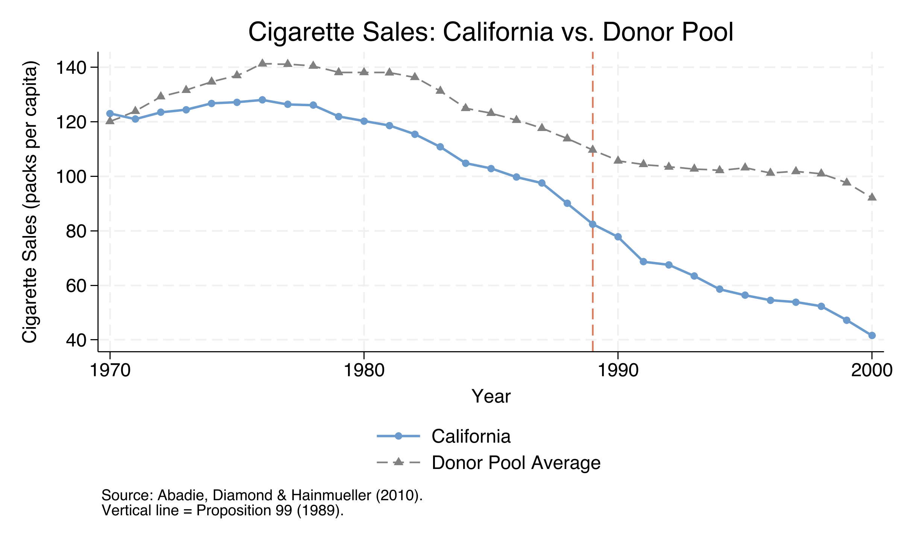

Even before 1989, California did not track the donor pool average closely. Its sales were slightly above the average in 1970, fell below it from 1971 onward, and trailed it by 23.72 packs in 1988. After Proposition 99, sales in California dropped sharply, while the average control state continued a more gradual decline. By 2000, the gap was visually striking.

A simple unweighted average, however, is a crude comparator. It gives equal weight to states such as New Hampshire (213 packs per capita on average) and Utah (64 packs). The smoking patterns of these states differ greatly from that of California. The SCM addresses this problem by finding an *optimal* weighted combination of donor states that matches the pre-treatment trajectory of California as closely as possible. Such a combination need not consist of similar states. Section 6 shows that a blend of low-sales Utah and high-sales Nevada helps match California, although neither state resembles it on its own.

---

## 5. The synthetic control method

### Core idea

The SCM constructs a **synthetic version** of the treated unit as a weighted average of untreated units, the "donor pool." The idea resembles building a custom comparison group from scratch. Instead of comparing California with a single state or a simple average, we blend several states. Their proportions are chosen to reproduce the pre-treatment cigarette sales and economic characteristics of California.

### The optimization problem

Formally, the SCM solves a nested optimization. The **outer problem** finds predictor weights $v\_m$ that determine how much each covariate matters for matching. It chooses these weights to minimize the mean squared gap in pre-1989 cigarette sales between actual and synthetic California. The **inner problem** finds unit weights $w\_j$ that minimize the weighted distance between California and its synthetic counterpart:

$$\min\_{W} \sum\_{m=1}^{M} v\_m \left( X\_{1m} - \sum\_{j=2}^{J+1} w\_j X\_{jm} \right)^2$$

In words, this equation compares the predictor values of California ($X\_{1m}$) with the weighted average of the predictor values of the donor states ($\sum w\_j X\_{jm}$). It minimizes the squared difference between the two, and the weight $v\_m$ controls how much each predictor matters in this distance. The weights $w\_j$ must be nonnegative and sum to one, so the synthetic control is a convex combination of real states.

### The treatment effect

Once the optimal weights $w\_j^*$ are found, the synthetic outcome in each year is a weighted average of donor outcomes. The estimated treatment effect at each post-treatment time $t$ is the gap between the actual and synthetic outcomes. The following equation states this gap formally:

$$\hat{\tau}\_t = Y\_{1t} - \sum\_{j=2}^{J+1} w\_j^* Y\_{jt}$$

In words, the treatment effect in year $t$ equals the actual cigarette sales of California minus the predicted sales of synthetic California. A negative $\hat{\tau}\_t$ means that Proposition 99 *reduced* cigarette sales relative to what they would have been without the policy. The average treatment effect over the post-treatment period (ATT) is the mean of all $\hat{\tau}\_t$.

### Key assumptions

1. **No interference:** Proposition 99 did not affect cigarette sales in other states (e.g., through cross-border shopping).
2. **No anticipation:** Cigarette sales in California did not respond to the policy before 1989.
3. **No donor contamination:** Donor states adopted no similar programs during the sample period.
4. **Good pre-treatment fit:** The synthetic control closely reproduces the pre-1989 trajectory of California.

With the method established, we can now estimate the synthetic control for California. The next section applies `synth2` to the full set of predictors. It reports the pre-treatment fit, the donor weights, and the estimated effects.

---

## 6. Baseline synthetic control estimate

The `synth2` command performs the full SCM estimation. We specify seven predictors: four economic and demographic variables averaged over 1980–1988, plus cigarette sales in three pre-treatment years (1975, 1980, and 1988). The three lagged outcomes anchor the match to the trajectory of cigarette sales.

```stata
synth2 cigsale lnincome age15to24 retprice beer ///
    cigsale(1988) cigsale(1980) cigsale(1975), ///
    trunit(3) trperiod(1989) xperiod(1980(1)1988) ///
    nested allopt
```

Five options control the estimation. The first three define the treated unit and the time windows. The last two govern the optimization.

- `trunit(3)`: the treated unit is California (state == 3)
- `trperiod(1989)`: treatment begins in 1989
- `xperiod(1980(1)1988)`: average the covariates over 1980–1988 for matching
- `nested`: use nested optimization (outer V-weights, inner W-weights)
- `allopt`: run the nested optimization from three starting points to avoid local optima

### Pre-treatment fit

The first part of the output reports how well synthetic California fits the years before 1989. The two statistics to read are the root mean squared error (RMSE) and the R-squared on the right. The RMSE is measured in packs per capita, so we can compare it directly with the level of sales.

```text
Fitting results in the pretreatment periods:
 Treated Unit: California    Treatment Time: 1989
 Number of Control Units  =  38     Root Mean Squared Error  = 1.75567
 Number of Covariates     =   7     R-squared                = 0.97434
```

The pre-treatment fit is close but not exact. The RMSE is 1.756 packs per capita over the 19 pre-treatment years, and `synth2` reports an R-squared of 0.974. This R-squared divides by the variation of the synthetic series rather than that of actual California. It should therefore not be read as a share of explained variation. The conventional R-squared, computed with the same weights, is 0.976. The largest pre-treatment gap is 5.88 packs, in 1970, and the later years fit more closely. Because `synth2` prints no synthetic values before 1989, we obtain the conventional R-squared and the 1970 gap by recomputing the 1970–1988 synthetic path with the five rounded weights. The Python script `build_web_app_data.py`, which accompanies this post, performs this calculation and checks it against the values that the log reports.

### Predictor balance

The balance table compares the seven predictors across three groups. For each predictor, it reports the V-weight, the value for California, and the values for synthetic California and the simple donor average. Each comparison value is followed by its percentage difference from California, which `synth2` calls the bias.

```text
   Covariate   |  V.weight    Treated    Synthetic Control     Average Control
      lnincome |   0.0000     10.0766      9.8588    -2.16%     9.8292    -2.45%
     age15to24 |   0.5459      0.1735      0.1735    -0.01%     0.1725    -0.59%
      retprice |   0.0174     89.4222     89.4108    -0.01%    87.2661    -2.41%
          beer |   0.0031     24.2800     24.2278    -0.21%    23.6553    -2.57%
 cigsale(1988) |   0.0049     90.1000     91.6677     1.74%   113.8237    26.33%
 cigsale(1980) |   0.0066    120.2000    120.5017     0.25%   138.0895    14.88%
 cigsale(1975) |   0.4221    127.1000    127.1112     0.01%   136.9316     7.74%
```

Six of the seven predictors are closely matched. Their biases are at most 1.74% in absolute value, and five are below 0.3%. The simple average of the control states, by contrast, shows biases of up to 26.3% for cigarette sales in 1988. The SCM therefore improves the match on these six predictors dramatically.

Log GDP per capita is the exception. Its bias of −2.16% looks small, but it compares logarithms. Synthetic California falls short by 0.22 log points (9.8588 against 10.0766), which implies a GDP per capita about 20% lower. The simple donor average misses by 0.25 log points, so the SCM barely improves the income match. This income gap deserves attention when we interpret the counterfactual.

The two dominant V-weights are **age 15–24** (0.546) and **cigarette sales in 1975** (0.422). In this solution, these two predictors carry most of the weight in the matching. However, the V-weights are poorly identified. The refit of California inside the placebo run gives `age15to24` a weight of only 0.002 and cigarette sales in 1975 a weight of 0.768. The claim that these two predictors drive the matching is therefore fragile. Log GDP per capita receives essentially zero weight in both fits, which explains why the optimizer leaves it nearly unmatched.

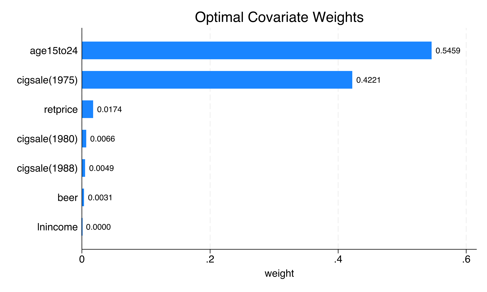

### Unit weights: who makes up synthetic California?

The next part of the output lists the donor states with positive weight. Each weight is the share of a donor in synthetic California, and the weights sum to one. States absent from this list receive a weight of zero.

```text
Optimal Unit Weights:
     Unit    |    U.weight
        Utah |     0.3340
      Nevada |     0.2350
     Montana |     0.2020
    Colorado |     0.1610
 Connecticut |     0.0680
```

Only **five of 38** donor states receive positive weight. Synthetic California is one-third Utah (33.4%), about one-quarter Nevada (23.5%), and one-fifth Montana (20.2%), with Colorado (16.1%) and Connecticut (6.8%) making up the rest. All 33 other states receive a reported weight of zero. This sparsity is typical of the SCM (Abadie, 2021). The method chooses the combination whose weighted predictors match California, not the individually most similar states. Utah, with low sales, and Nevada, with high sales, bracket California, so no single donor needs to resemble it.

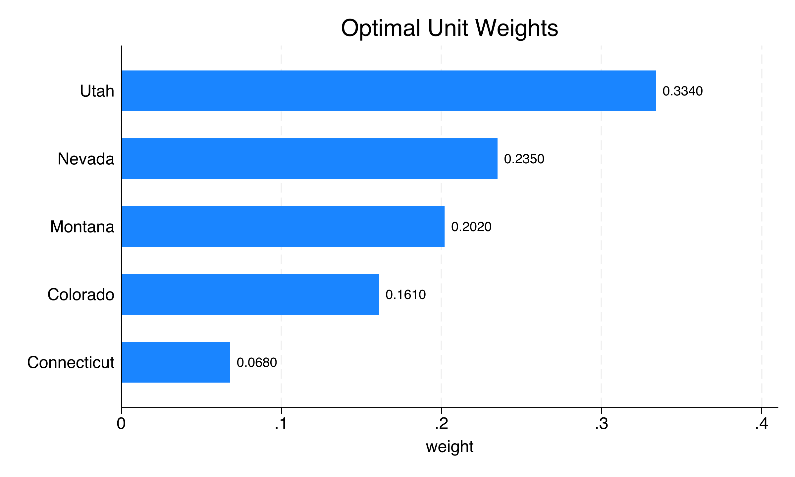

### Treatment effects

The last table of the baseline run reports the results after treatment, year by year. Each row shows actual sales, synthetic sales, and their difference, which is the treatment effect. The excerpt keeps six of the 12 years, and its last row averages all 12 gaps to give the ATT.

```text
 Time | Actual Outcome  Synthetic Outcome  Treatment Effect
 1989 |       82.4000            89.9945           -7.5945
 1990 |       77.8000            87.5039           -9.7039
 1993 |       63.4000            81.1897          -17.7897
 1997 |       53.8000            77.7123          -23.9123
 1999 |       47.2000            73.5711          -26.3711
 2000 |       41.6000            67.3550          -25.7550
 Mean |       60.3500            79.3518          -19.0018
```

The treatment effect grows from **−7.59 packs** in 1989 to **−26.37 packs** in 1999, and its average over the 12 post-treatment years is **−19.00 packs per capita**. The growth is not monotonic: the gap narrows slightly in 1995, more clearly in 1998, and again in 2000. In 2000, actual sales in California (41.6 packs) were 25.76 packs below the synthetic counterfactual (67.4 packs), a 38% reduction. The widening gap through 1997 suggests that the impact of the program compounded over time. This pattern is consistent with cumulative behavioral change and the declining social acceptability of smoking. The jump in 1999 is harder to attribute, however, because Proposition 10 raised the state cigarette tax by a further 50 cents per pack in January 1999. Without 1999 and 2000, the average gap over 1989–1998 is −17.59 packs, about 1.4 packs smaller in absolute value than the ATT.

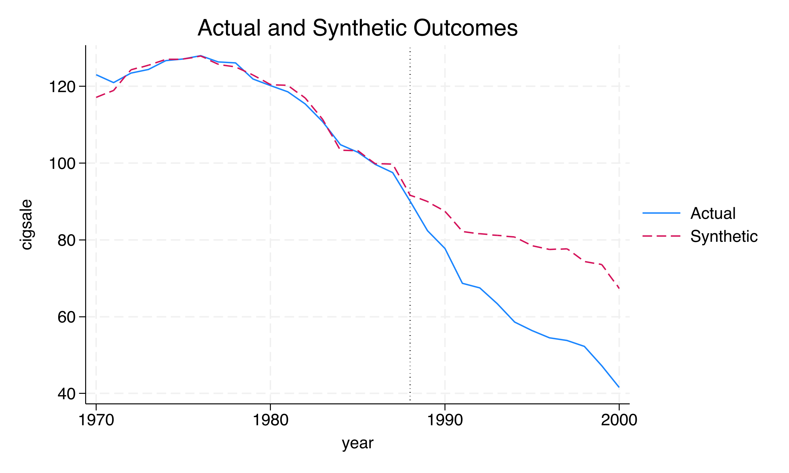

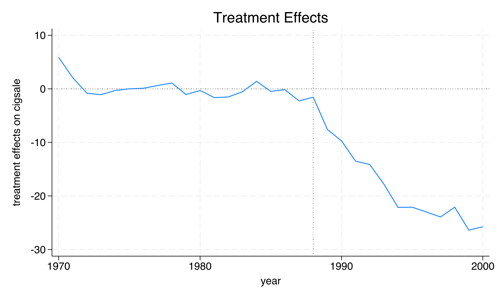

The `pred` graph shows a close pre-treatment fit in every year except 1970, when the gap is 5.88 packs. After 1989, actual California falls sharply below the synthetic control. The `eff` graph shows this gap widening, although not monotonically, since it narrows most clearly in 1998 before reaching −26.37 packs in 1999 and −25.76 packs in 2000. The remaining question is whether this effect is real or a statistical artifact. The next three sections address it with placebo tests and robustness checks.

---

## 7. In-space placebo test

### Concept

The in-space placebo test is the primary inference tool for the SCM. The idea is simple: we apply the same procedure to every control state, as if each one had been "treated" in 1989. If the estimated effect for California is unusually large compared with these placebo effects, we have evidence of a genuine policy impact rather than a chance occurrence.

The test works as a **permutation test**. Suppose that we assigned the "treatment" label at random to any state. The question is how often we would then see an effect as large as that of California. If the answer is "rarely," the effect is statistically significant.

```stata
synth2 cigsale lnincome age15to24 retprice beer ///
    cigsale(1988) cigsale(1980) cigsale(1975), ///
    trunit(3) trperiod(1989) xperiod(1980(1)1988) ///
    nested placebo(unit cut(2)) sigf(6)
```

The `placebo(unit)` option runs the SCM for each control state. The `cut(2)` filter excludes states whose pre-treatment MSPE is more than twice that of California. These states fit poorly before treatment, so their post-treatment gaps say little about what a well-fitted unit would show. The `sigf(6)` option lowers the precision of the optimizer to six significant figures, which helps all 38 placebo optimizations converge.

### MSPE ratio ranking

The post/pre MSPE ratio measures how much worse the fit of a state becomes after 1989 relative to before. A state with a genuine treatment effect should have a large ratio, because its post-treatment gap dwarfs its pre-treatment error. The table below lists the five highest ratios.

```text
      Unit     |  Pre MSPE  Post MSPE   Post/Pre MSPE
    California |    3.1668   391.2533       123.5490
       Georgia |    1.4610   116.8893        80.0074
      Virginia |    2.7825   219.8136        78.9994
      Missouri |    1.2009    85.1794        70.9308
         Texas |    4.6691   239.8559        51.3707
```

The MSPE ratio of California, **123.5**, is the highest among all states. It far exceeds the ratios of Georgia (80.0), Virginia (79.0), and Missouri (70.9). This ratio uses the pre-treatment MSPE of the refit inside the placebo run, 3.17 (RMSE 1.780), rather than the baseline MSPE of 3.08 (RMSE 1.756). The post-treatment deterioration in fit for California is the most extreme of all units in the test. This pattern is consistent with a genuine policy effect.

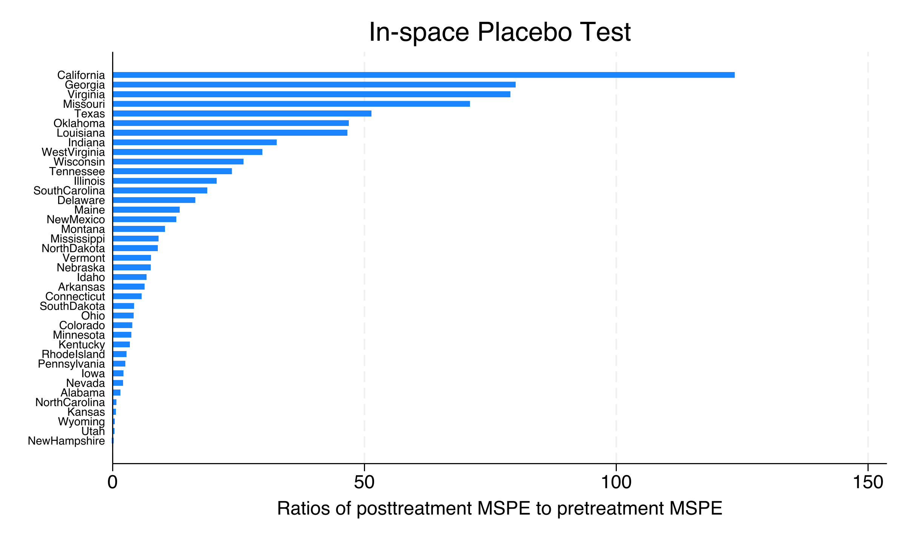

### Statistical significance

The `synth2` command turns the ranking of MSPE ratios into two permutation p-values. The first uses all 39 units, and the second keeps only the 20 units that pass the `cut(2)` filter. Each p-value equals the rank of California divided by the number of units in the comparison.

```text
Note: (1) Using all control units, the probability of obtaining a
      post/pretreatment MSPE ratio as large as California's is 0.0256.
      (2) Excluding control units with pretreatment MSPE 2 times larger
      than the treated unit, the probability is 0.0500.
```

Using all 39 states, the probability of obtaining an MSPE ratio as large as that of California by chance is **p = 0.026** (1/39). The `cut(2)` filter removes 19 states whose pre-treatment MSPE is more than twice that of California. The remaining 20 states have comparable fit quality, and the p-value among them is **p = 0.050** (1/20). All 19 excluded states have ratios below that of California, and the highest, for Indiana, is 32.6. Removing them cannot change the rank of California. The cut only shrinks the reference set from 39 to 20 units, which raises the smallest attainable p-value from 0.026 to 0.050. It matters more for the pointwise p-values below, which compare yearly gaps rather than ratios.

### Pointwise p-values

The pointwise p-values test the gap in each post-treatment year separately. These permutation p-values are also called Fisher exact p-values. Each one compares the gap of California with the gaps of the 19 placebo states that `cut(2)` retains. The effects come from the refit inside the placebo run, which uses `sigf(6)` and no `allopt`. The 1989 effect is therefore −7.42 packs, against −7.59 in the baseline.

The left-sided p-values are the appropriate ones here, because the treatment effect is negative. They show significance at the 5% level in 8 of 12 post-treatment years. The excerpt below keeps seven of the 12 years. Among the omitted years, 1994–1996 and 1999 have p = 0.050, and 1998 has p = 0.100.

```text
 Time |  Treatment Effect   Left-sided p-value
 1989 |          -7.4201            0.0500
 1990 |          -9.5789            0.1000
 1991 |         -13.2182            0.1500
 1992 |         -13.9061            0.1000
 1993 |         -17.6228            0.0500
 1997 |         -23.8174            0.0500
 2000 |         -25.5478            0.0500
```

The four years with weaker significance are 1990–1992 and 1998, with p-values of 0.100–0.150. In those years, one or two retained placebo states show a gap at least as negative as that of California. Effect size alone does not explain this pattern, because the smallest effect, in 1989, still reaches p = 0.050. From 1993 onward, California is the most extreme state in every year except 1998 (p = 0.100).

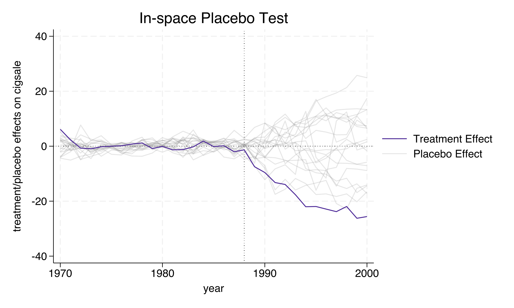

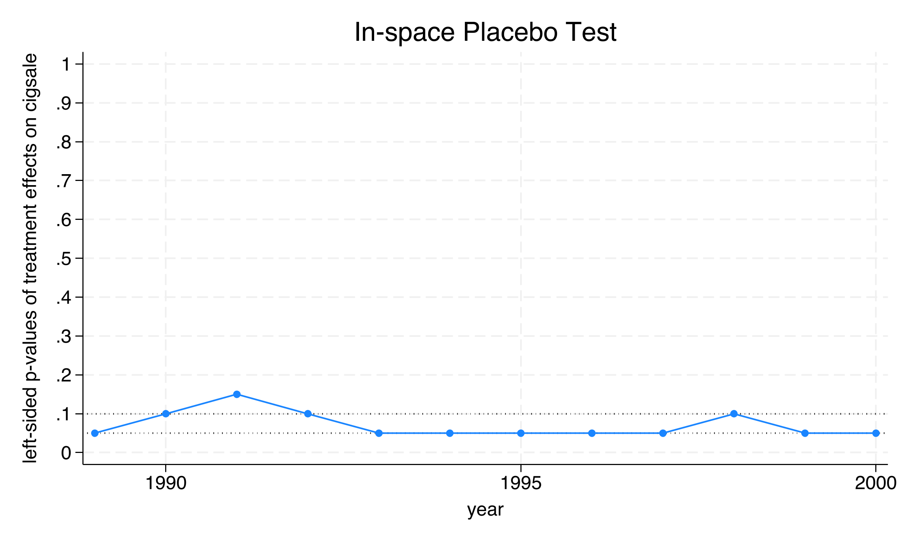

The spaghetti plot provides the most intuitive visual evidence. It shows California (purple) together with the 19 placebo states retained by `cut(2)` (gray). Before 1989, all the lines stay in a tight band around zero. After 1989, the placebo gaps fan out in both directions, but the line for California plunges below almost all of them. This visual evidence, combined with the formal p-values, supports the conclusion that Proposition 99 genuinely reduced cigarette sales. Next, we test whether the model detects a spurious effect at a fake treatment date.

---

## 8. In-time placebo test

### Concept

The in-time placebo test checks the internal validity of the model by assigning a **fake treatment date** before the actual intervention. If the model is well specified, it should find **only small gaps** at the fake date. It should detect an effect only after the real date of 1989.

We choose 1985 as the fake treatment year, four years before the actual policy. This choice requires two modifications to the baseline specification. First, we drop `cigsale(1988)` from the predictors, because it would be "post-treatment" relative to the fake date. Second, we shorten the predictor averaging window to `xperiod(1980(1)1984)`. The fit period of the fake-date model is 1970–1984, the years before the fake treatment.

```stata
synth2 cigsale lnincome age15to24 retprice beer ///
    cigsale(1980) cigsale(1975), ///
    trunit(3) trperiod(1989) xperiod(1980(1)1984) ///
    nested placebo(period(1985))
```

### Results

The in-time output lists the yearly gaps of the model with the fake 1985 date. The first block covers the fake treatment window, 1985–1988, and the second shows three years of the real treatment period. We compare the size of the gaps across the two windows.

```text
In-time placebo test (fake treatment at 1985):
 Time | Actual Outcome  Synthetic Outcome  Treatment Effect
 1985 |      102.8000           106.1262           -3.3262
 1986 |       99.7000           103.2850           -3.5850
 1987 |       97.5000           106.1524           -8.6524
 1988 |       90.1000            98.4873           -8.3873

Real treatment period (1989-2000):
 1989 |       82.4000            96.5237          -14.1237
 1994 |       58.6000            77.9078          -19.3078
 2000 |       41.6000            67.1861          -25.5861
```

During the fake treatment window (1985–1988), the estimated effects range from **−3.33 to −8.65 packs**. These effects are substantially smaller than the effects of **−13.97 to −25.59 packs** from 1989 onward in the same run. The fake-window effects are not zero, however, and they average −5.99 packs. The two figures below show that the fake-date model tracks California closely over 1970–1984, so these gaps open only after the fake date. They may reflect prediction error of the reduced model, which has a shorter fit period (1970–1984) and one predictor fewer. Genuine changes in California before 1989 could also produce them, and the test cannot separate the two explanations.

Because the command keeps `trperiod(1989)`, `synth2` also estimates the reduced specification with the real date. This specification drops the 1988 lag, which leaves six predictors instead of seven, and it averages the covariates over 1980–1984 instead of 1980–1988. Its R-squared with the 1989 date is 0.953, against 0.974 for the baseline. This statistic does not describe the fake-1985 model, however, because `synth2` does not print the fit of that model.

The timing of the gaps gives a weaker signal than their size. The gap steps down by 5.74 packs in 1989, from −8.39 to −14.12. It had already stepped down by 5.07 packs in 1987, from −3.59 in 1986 to −8.65. The stronger evidence is the size of the later gaps, which widen after 1992 and reach −25.59 in 2000.

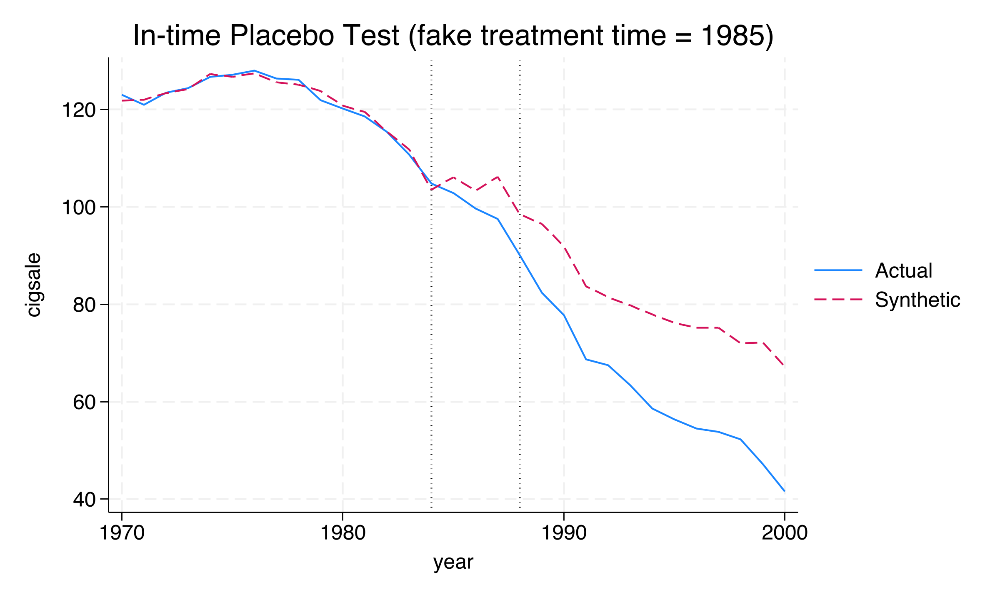

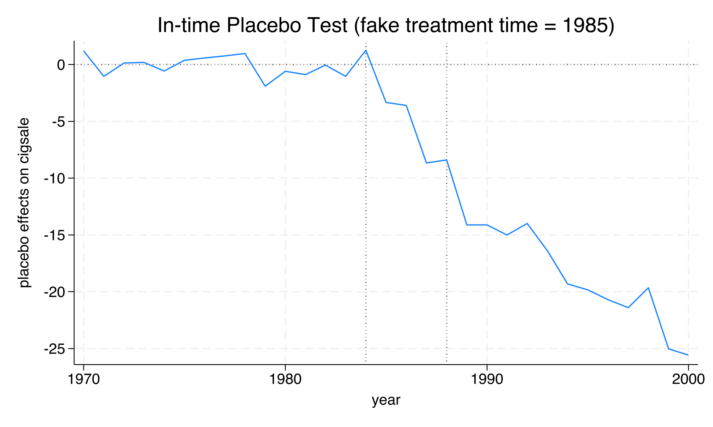

In sum, the in-time placebo yields much smaller effects at the fake date than after the real date. Because the fake-window gaps are not zero, the test cannot fully rule out earlier changes in California. The step in 1989 is also barely larger than the step in 1987. The test therefore supports the timing of the effect only in part. Next, we test whether the results depend on any single state in the donor pool.

---

## 9. Leave-one-out robustness

### Concept

The leave-one-out (LOO) analysis tests whether the estimated treatment effect is **driven by any single donor state**. Synthetic California is composed of only five states, and Utah alone accounts for 33.4% of it. It is therefore important to verify that removing any one of them does not fundamentally change the results.

The `loo` option reruns the SCM after excluding each donor state with positive weight, one at a time. With five weighted donors, the command produces five leave-one-out fits. It first refits the baseline without `allopt`, so its reference estimates differ slightly from the baseline estimates above.

```stata
synth2 cigsale lnincome age15to24 retprice beer ///
    cigsale(1988) cigsale(1980) cigsale(1975), ///
    trunit(3) trperiod(1989) xperiod(1980(1)1988) ///
    nested loo frame(california) savegraph(california, replace)
```

### Results

The leave-one-out output compares the refitted baseline with the five leave-one-out fits. The Treatment Effect column gives the effect of the refit that uses all donors. The last two columns give, for each year, the most and least negative effects across the five exclusions. The excerpt keeps four of the 12 post-treatment years.

```text
Leave-one-out treatment effects:
 Time |    Treatment Effect   Treatment Effect (LOO)
      |                              Min           Max
 1989 |            -7.3304       -9.9509       -5.9892
 1994 |           -22.0229      -24.7112      -20.0141
 1997 |           -23.9288      -30.6150      -17.9877
 2000 |           -25.6107      -28.3503      -23.4850
```

The size of the effect varies across the LOO iterations. For the year 2000, the refitted baseline of this run gives −25.61 packs, and the LOO range is [−28.35, −23.49]. This spread of 4.87 packs is about 19% of the refitted estimate. The widest variation occurs in 1997, when the LOO range spans from −30.62 to −17.99, a 12.63-pack spread. The log does not identify which excluded donor produces each extreme.

The sign of the effect, by contrast, is **consistently negative**. Every LOO gap stays below zero in all 12 post-treatment years, so the sign does not depend on any single donor state. Even so, the smallest gap, −5.74 packs in 1990, is about the size of the largest pre-treatment gap of the baseline fit (5.88 packs, in 1970). The sign is therefore least secure in the early years.

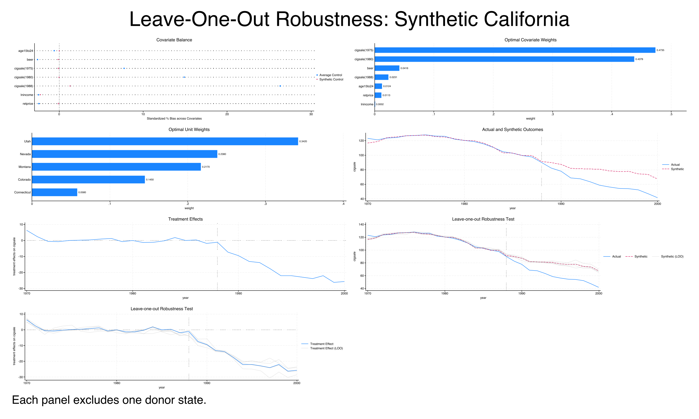

The note printed under this figure is inaccurate. The first five panels show the refit with all donors, and only the gray lines in the last two panels each drop one donor. The figure comes from the original run, and the corrected do-file now writes an accurate note.

The LOO analysis provides the final piece of evidence. The sign of the effect survives the removal of any one weighted donor, although its size varies by up to 12.63 packs in 1997. Together, the three validation checks support the baseline finding, with the in-time placebo offering only partial support for its timing. We now turn to the discussion.

---

## 10. Discussion

### Answering the case study question

**Did Proposition 99 reduce cigarette consumption in California?** The evidence strongly suggests that it did. The SCM estimates that Proposition 99 reduced cigarette sales in California by an average of **19.00 packs per capita per year** over the 12-year post-treatment period. This effect was not instantaneous. It grew, although not monotonically, from −7.59 packs in 1989 to −26.37 packs in 1999. This pattern is consistent with cumulative behavioral change as anti-smoking campaigns took hold and social norms shifted. Part of the late gap may also reflect a further tax increase under Proposition 10 in January 1999.

To put this effect in perspective, actual cigarette sales in California in 2000 were 41.6 packs per capita. The synthetic control predicts that they would have been 67.4 packs without the policy. That difference is a **38% reduction**, or roughly 26 fewer packs per person in that year. For a state with approximately 34 million residents in 2000, it translates to nearly **900 million fewer packs** sold in that year alone.

### Statistical significance

The in-space placebo test yields a p-value of 0.026 when it uses all 39 states. After filtering to states with comparable pre-treatment fit, the p-value is 0.050. The filtered p-value sits exactly at the conventional 5% threshold, a consequence of having only 20 qualifying comparison units. The unfiltered p-value of 0.026 reflects the same first rank within a larger reference set of 39 units. The spaghetti plot also shows California as a clear outlier after the treatment.

### Robustness

Three distinct checks support the baseline finding. Each check probes a different threat to the estimate. The table below summarizes their key results.

| Validation approach | Key result |
|---------------------|------------|
| In-space placebo | The MSPE ratio of California (123.5) is the largest among 39 states |
| In-time placebo | Gaps after 1989 (−13.97 to −25.59 packs) are 2.3–4.3 times the average fake-date gap (−5.99 packs) |
| Leave-one-out | The year 2000 effect ranges from −23.49 to −28.35 packs across all LOO iterations |

### Implications for policymakers

This analysis provides evidence that comprehensive tobacco control programs, which combine tax increases with funded anti-smoking campaigns, can produce large and sustained reductions in cigarette consumption. The growing effect over time suggests that the benefits of the program compound, although the gaps of 1999 and 2000 may also reflect the tax increase of Proposition 10. Possible channels include intergenerational effects, such as fewer young people starting to smoke, and reinforcing social norms. Other states may find such combined programs worth considering, although their effects elsewhere could differ from the effect estimated for California.

---

## 11. Summary and key takeaways

1. **Proposition 99 reduced cigarette sales in California by an average of 19.00 packs per capita per year (ATT).** The effect grew from −7.59 packs in 1989 to −26.37 packs in 1999. In 2000, the gap of 25.76 packs equaled a 38% reduction relative to the counterfactual. The gaps of 1999 and 2000 may also reflect Proposition 10, which raised the tax by a further 50 cents per pack in January 1999. Over 1989–1998 alone, the gaps average −17.59 packs. Comprehensive tobacco control programs with both taxation and education components can produce large, sustained behavioral change.

2. **The synthetic control achieves a close pre-treatment fit (R-squared = 0.974 in `synth2`).** With an RMSE of 1.756 packs, the weighted combination of five donor states reproduces the pre-1989 trajectory of California closely. The fit is not exact, however, since the gap reaches 5.88 packs in 1970. The `synth2` R-squared divides by the variation of the synthetic series, and the conventional value is 0.976. A close fit supports the counterfactual, but it does not by itself prove that the post-treatment divergence reflects the impact of the policy.

3. **Only five states compose synthetic California, with Utah dominant at 33.4%.** The SCM selects a combination that matches the predictors of California, not individually similar or nearby states. Nevada (23.5%), Montana (20.2%), Colorado (16.1%), and Connecticut (6.8%) complete the synthetic control. All 33 other states receive zero weight, which illustrates the typical sparsity of the method.

4. **The effect in California is statistically significant (p = 0.026).** The in-space placebo test shows that the post/pre MSPE ratio of California (123.5) is the highest among all 39 states. The probability of obtaining such an extreme ratio by chance is just 2.6%.

5. **SCM inference is limited by the number of comparison units.** With 20 qualifying states after the cut(2) filter, the smallest achievable p-value is 0.050 (1/20). Researchers should report both filtered and unfiltered p-values and acknowledge this inherent limitation of permutation-based inference.

6. **The in-time placebo shows much smaller effects at the fake date.** Fake effects from 1985 (−3.33 to −8.65 packs) are substantially smaller than real effects after 1989 (−13.97 to −25.59 packs). The step in 1989, however, is barely larger than the step in 1987. The nonzero fake effects may reflect prediction error of the reduced model, which has a shorter fit period (1970–1984) and one predictor fewer. The test, however, cannot rule out a genuine pre-treatment change.

7. **Leave-one-out refits keep every gap negative.** Dropping each of the five weighted donors in turn gives gaps for 2000 from −28.35 to −23.49 packs. The spread is wider in 1997, when it reaches 12.63 packs. No single donor therefore drives the sign of the effect, although its size varies with the excluded donor.

### Limitations

- The analysis covers only the period through 2000. Extending the window beyond 2000 is difficult, because other states adopted similar policies and would no longer be valid donors.
- The donor pool excludes states that implemented major tobacco control programs during the study period. Excluding these states leaves fewer donors that resemble California, which can weaken the fit.
- The SCM, as applied here, produces no standard errors or confidence intervals. Inference relies entirely on the placebo-based permutation approach.
- The five-state synthetic control is sensitive to the predictor specification. Changing the set of predictors or the averaging window can alter the donor weights and the ATT estimate. For example, reestimating the reduced in-time specification with the true date of 1989 shifts the ATT from −19.00 to −17.71.
- The 1999–2000 gaps may also reflect Proposition 10, which raised the state cigarette tax by 50 cents per pack in January 1999, so these gaps cannot be attributed to Proposition 99 alone.

### Next steps

- Apply the SCM to other states that implemented tobacco control programs after California (e.g., Massachusetts, Oregon)
- Explore **heterogeneous effects** by analyzing how the treatment effect varies across post-treatment years using rolling-window or recursive estimations
- Compare SCM estimates with **difference-in-differences** approaches applied to the same data
- Investigate **conformal inference** methods (Chernozhukov et al., 2021) for formal confidence intervals in the SCM framework

---

## 12. Exercises

1. **Modify the predictor set.** Rerun the baseline SCM without `beer` and `age15to24`. How do the unit weights and the ATT change? Does the pre-treatment fit deteriorate? What does this tell you about the importance of predictor choice in SCM?

2. **Change the MSPE filter.** Rerun the in-space placebo test with `cut(5)` instead of `cut(2)`, retaining states with a pre-MSPE up to 5 times that of California. How does the number of qualifying comparison units change? How does the p-value change? What are the trade-offs of a more inclusive versus a more restrictive filter?

3. **Compare with simple difference-in-differences.** Estimate a two-way fixed effects (TWFE) regression of cigarette sales on an interaction of a California indicator with an indicator for 1989 or later, with state and year fixed effects using all 39 states. How does the TWFE estimate compare to the SCM estimate of −19.00 packs? Which approach do you find more credible for this single-state policy evaluation, and why?

---

## References

1. [Abadie, A., Diamond, A., & Hainmueller, J. (2010). Synthetic Control Methods for Comparative Case Studies: Estimating the Effect of California's Tobacco Control Program. *Journal of the American Statistical Association*, 105(490), 493–505.](https://doi.org/10.1198/jasa.2009.ap08746)
2. [Abadie, A., & Gardeazabal, J. (2003). The Economic Costs of Conflict: A Case Study of the Basque Country. *American Economic Review*, 93(1), 113–132.](https://doi.org/10.1257/000282803321455188)
3. [Abadie, A. (2021). Using Synthetic Controls: Feasibility, Data Requirements, and Methodological Aspects. *Journal of Economic Literature*, 59(2), 391–425.](https://doi.org/10.1257/jel.20191450)
4. [Yan, G., & Chen, Q. (2023). `synth2`: Synthetic Control Method with Placebo Tests, Robustness Test, and Visualization. *The Stata Journal*, 23(3), 597–624.](https://doi.org/10.1177/1536867X231195278)
5. [Chernozhukov, V., Wüthrich, K., & Zhu, Y. (2021). An Exact and Robust Conformal Inference Method for Counterfactual and Synthetic Controls. *Journal of the American Statistical Association*, 116(536), 1849–1864.](https://doi.org/10.1080/01621459.2021.1920957)
