---
authors:
  - admin
categories:
  - Stata
  - Causal Inference
  - Synthetic Control
  - Difference-in-Differences (DiD)
draft: false
featured: false
date: "2026-06-07T00:00:00Z"
external_link: ""
image:
  caption: ""
  focal_point: Smart
  placement: 3
links:
- icon: chalkboard-teacher
  icon_pack: fas
  name: "Slides (HTML)"
  url: slides/index.html
- icon: laptop-code
  icon_pack: fas
  name: "Web app"
  url: web_app/index.html
- icon: file-code
  icon_pack: fas
  name: "Stata do-file"
  url: analysis.do
- icon: database
  icon_pack: fas
  name: "Dataset (.dta)"
  url: prop99_example.dta
- icon: file-alt
  icon_pack: fas
  name: "Stata log"
  url: analysis.log
- icon: file-pdf
  icon_pack: fas
  name: "Slides (PDF)"
  url: https://carlos-mendez.org/post/stata_sdid/sdid.pdf
- icon: podcast
  icon_pack: fas
  name: AI Podcast
  url: "/post/stata_sdid/#podcast-player"
- icon: markdown
  icon_pack: fab
  name: "MD version"
  url: https://raw.githubusercontent.com/cmg777/starter-academic-v501/master/content/post/stata_sdid/index.md
slides:
summary: Introduce and derive synthetic difference-in-differences, then apply it to California's Proposition 99 — comparing SDID with the original difference-in-differences and synthetic control (synth2), and how to run placebo inference with a single treated unit.
tags:
  - stata
  - causal
  - causal inference
  - synthetic control
  - difference in differences
  - sdid
  - panel
  - policy evaluation
title: "Synthetic Difference-in-Differences (SDID) in Stata: Re-evaluating California's Proposition 99"
url_code: ""
url_pdf: ""
url_slides: ""
url_video: ""
toc: true
diagram: true
---

## Abstract

Comparative case studies—where a single large unit adopts a policy and the analyst must recover its causal effect without ever observing the untreated counterfactual—are a recurring challenge in policy evaluation, and the canonical example is California's Proposition 99, the 1988 ballot measure that raised the cigarette excise tax by 25 cents a pack and funded an anti-smoking campaign. This tutorial introduces and derives synthetic difference-in-differences (SDID) and applies it to re-evaluate Proposition 99, contrasting it with classic difference-in-differences (DiD) and synthetic control (SC). The data are the canonical strongly balanced panel distributed with the `sdid` package (originally from Abadie, Diamond, and Hainmueller 2010): 39 US states observed annually from 1970 to 2000—1,209 observations, of which only 12 are treated—with annual cigarette sales in packs per capita as the sole outcome and California as the single treated unit from 1989. The methods estimate the average treatment effect on the treated by writing DiD, SC, and SDID as one weighted two-way fixed-effects regression in Stata, using the `sdid` command (Clarke et al. 2024) and cross-checking SC against `synth2`. All three estimators agree the policy reduced smoking but disagree on magnitude: the 2×2 DiD gives −27.35 packs per capita, synthetic control −19.48 (pre-period RMSE 1.66, R² 0.98, leaning on Utah, Montana, and Nevada), and SDID −15.60—roughly a 20% reduction—with SDID's time weights concentrated entirely on 1986–1988. With one treated unit, placebo inference is the only valid procedure: the placebo standard error is 9.88 (95% CI [−35.0, 3.8], including zero) while the permutation test ranks California's effect extreme (p = 0.026). The implication is that a single `sdid` command unifies all three estimators, and SDID is the preferred single number because, by allowing a constant level gap and up-weighting the informative late-1980s years, it relies least on the exact parallel-trends assumption the others lean on hardest.

## 1. Overview

In November 1988 California voters passed **Proposition 99**, which raised the cigarette excise tax by 25 cents a pack and funded a large anti-smoking campaign. Did it actually reduce smoking? This is the textbook question of **comparative case study** research: a single, large unit (California) adopts a policy, and we want the causal effect even though we can never observe the California that *did not* pass Proposition 99.

This tutorial builds up to **synthetic difference-in-differences (SDID)**, the estimator of Arkhangelsky, Athey, Hsiao, Imbens, and Wager (2021), and applies it with the `sdid` command of Clarke, Pailañir, Athey, and Imbens (2024). SDID is best understood as the marriage of two older ideas:

- **Difference-in-differences (DiD)** — compare California's before/after change to the before/after change of *all* control states.
- **Synthetic control (SC)** — build a "synthetic California" as a weighted average of control states that tracks California before the policy.

SDID keeps the best of both: like SC it chooses **unit weights** so the comparison group resembles California, and like DiD it allows a **constant level gap** between California and its comparison group (a unit fixed effect). It then adds one more ingredient SC lacks — **time weights** that emphasize the pre-policy years most predictive of the post-policy period.

A second theme runs through the whole tutorial, and it is worth stating up front. As Clarke et al. (2024) put it, *along with SDID, the `sdid` command implements standard synthetic control and difference-in-differences in an **identical framework**, allowing estimation, inference, and graphical output in a computationally efficient way.* We will show this concretely: the **same command**, changing only one option, reproduces the raw difference-in-differences and the classic synthetic control — and we cross-check the latter against the dedicated `synth2` command.

### Learning objectives

By the end you will be able to:

- **Derive** the SDID estimator as a weighted two-way fixed-effects regression and read its unit-weight and time-weight optimization problems.
- **Distinguish** SDID from the original DiD and SC — conceptually (which weights, which fixed effects) and quantitatively (on the same data).
- **Estimate** the effect of Proposition 99 with `sdid`, and reproduce DiD and SC from the very same command.
- **Compare** the SDID synthetic against a classical synthetic control fit with `synth2`.
- **Conduct** valid inference when there is a single treated unit, using placebo (permutation) methods — and recognize when other procedures (bootstrap, jackknife) do and do not apply.

### What we are estimating

Throughout, the estimand is the **average treatment effect on the treated (ATT)** — the effect of Proposition 99 *on California*, over the post-1988 period:

$$
\tau = \frac{1}{N\_{tr}\\, T\_{post}} \sum\_{i:\\, W\_i = 1}\ \sum\_{t > T\_{pre}} \left[\\, Y\_{it}(1) - Y\_{it}(0) \\,\right]
$$

In words: average, over treated units and post-treatment years, the difference between the outcome with the policy, $Y\_{it}(1)$, and the outcome that *would have occurred* without it, $Y\_{it}(0)$. Here there is exactly one treated unit ($N\_{tr} = 1$, California), and $Y\_{it}(0)$ is never observed after 1988 — every method in this tutorial is a different way of **imputing that missing counterfactual**. Because California was *not* randomly assigned to treatment, this is an **observational** design: identification rests on assumptions (a stable comparison group, no large contemporaneous shocks unique to California) rather than on randomization.

### Key concepts at a glance

<details>
<summary><b>Counterfactual</b> — what California's smoking would have been without Proposition 99.</summary>

Every estimator here is a recipe for the dashed line "California if the policy had never passed." DiD, SC, and SDID disagree only about how to build it.

</details>

<details>
<summary><b>Unit weights (ω)</b> — how much each control state counts toward the synthetic California.</summary>

DiD gives every control the same weight ($1/N\_{co}$). SC and SDID instead pick weights so the weighted controls reproduce California's pre-policy outcome path. SC concentrates weight on a handful of states; SDID spreads it more widely.

</details>

<details>
<summary><b>Time weights (λ)</b> — how much each pre-policy year counts.</summary>

This is SDID's signature. Rather than treat every pre-1989 year equally, SDID up-weights the pre-period years that best predict the post-period — here, 1986–1988. SC and DiD have no time weights.

</details>

<details>
<summary><b>Unit fixed effects (α)</b> — a constant level gap between California and its synthetic comparison.</summary>

DiD and SDID include them, so the comparison group only needs to move *in parallel* with California, not sit at the same level. Classic SC omits them and instead tries to match California's level outright.

</details>

<details>
<summary><b>Placebo inference</b> — how we get a standard error with only one treated unit.</summary>

We pretend, one at a time, that a control state was "treated," re-estimate the effect, and build the distribution of these placebo effects. If California's real effect is extreme relative to that distribution, it is unlikely to be noise.

</details>

---

## 2. The Proposition 99 case study

We use the canonical dataset distributed with the `sdid` package (originally from Abadie, Diamond, and Hainmueller 2010, and used by Arkhangelsky et al. 2021). It is a **strongly balanced panel**: 39 US states observed annually from 1970 to 2000, with one outcome — annual cigarette sales in **packs per capita**. California is the single treated unit; the policy bites from **1989** onward. The remaining 38 states (which did not pass comparable large-scale tobacco programs in this window) form the **donor pool**.

| Variable | Role | Description |
|---|---|---|
| `state` | unit id | 39 US states (California + 38 controls) |
| `year` | time id | 1970–2000 (19 pre-, 12 post-treatment years) |
| `packspercapita` | outcome $Y\_{it}$ | annual cigarette pack sales per capita |
| `treated` | treatment $W\_{it}$ | 1 for California in 1989–2000, else 0 |

One feature matters for a fair comparison: this panel contains **only the outcome** — no income, price, or demographic covariates. That is deliberate here. It means synthetic control and SDID see *exactly the same information* (California's and the donors' pre-period smoking paths), so any difference in their answers comes from the **estimator**, not from a different set of predictors.

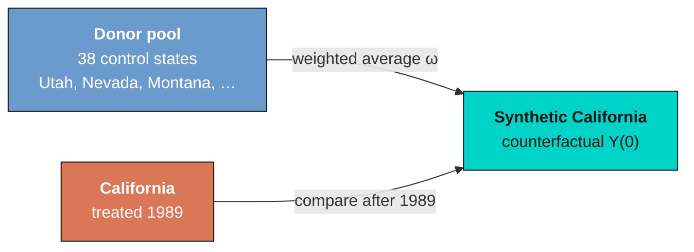

Let us first look at the data with no model at all — California against the simple average of the 38 control states.

```stata
use prop99_example.dta, clear
describe
encode state, gen(id)
xtset id year
```

```text
Contains data from prop99_example.dta
 Observations:         1,209
    Variables:             4
-------------------------------------------------------------------------------
Variable      Storage   Display    Value
    name         type    format    label      Variable label
-------------------------------------------------------------------------------
state           str14   %14s                  State
year            int     %8.0g                 Year
packspercapita  float   %9.0g                 PacksPerCapita
treated         byte    %8.0g
-------------------------------------------------------------------------------

Panel variable: id (strongly balanced)
 Time variable: year, 1970 to 2000
         Delta: 1 unit
```

The panel is strongly balanced (no gaps), which every method below requires. The figure compares California to the raw control average.

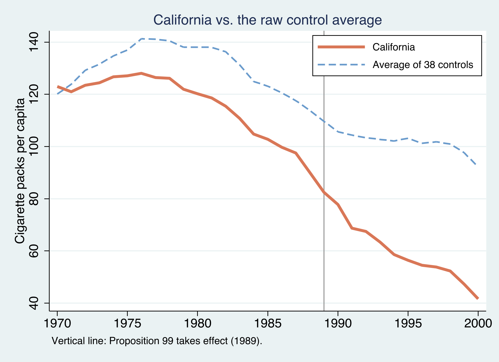

California (orange) already smoked **less** than the average control state and was declining throughout the 1980s. After 1989 the gap widens visibly. But two problems jump out: California sits on a **different level** than the average donor, and it was already on a **different trend** before 1989. A credible estimate must deal with both — the job of the three estimators below.

---

## 3. Three estimators, one equation

The cleanest way to see how DiD, SC, and SDID relate is to write them all as the **same** weighted two-way fixed-effects (TWFE) regression and change only the weights. This is the unifying view of Arkhangelsky et al. (2021).

### Synthetic difference-in-differences

SDID solves a weighted TWFE regression:

$$
\left(\hat{\tau}^{sdid}, \hat{\mu}, \hat{\alpha}, \hat{\beta}\right) = \underset{\tau,\mu,\alpha,\beta}{\arg\min} \sum\_{i=1}^{N} \sum\_{t=1}^{T} \left(Y\_{it} - \mu - \alpha\_i - \beta\_t - W\_{it}\\,\tau\right)^{2} \hat{\omega}\_i^{sdid}\ \hat{\lambda}\_t^{sdid}
$$

Reading the symbols against the Stata variables: $Y\_{it}$ is `packspercapita`; $W\_{it}$ is `treated`; $\alpha\_i$ is a state fixed effect (one per `state`); $\beta\_t$ is a year fixed effect (one per `year`); and $\tau$ is the ATT we want. The two extra terms are the difference from ordinary regression: $\hat{\omega}\_i^{sdid}$ is a **unit weight** (how much state $i$ counts) and $\hat{\lambda}\_t^{sdid}$ is a **time weight** (how much year $t$ counts). Set those weights to special values and you recover the older estimators.

### The original difference-in-differences

DiD is the **special case with no weighting** — every unit and every year counts equally:

$$
\left(\hat{\tau}^{did}, \hat{\mu}, \hat{\alpha}, \hat{\beta}\right) = \underset{\tau,\mu,\alpha,\beta}{\arg\min} \sum\_{i=1}^{N} \sum\_{t=1}^{T} \left(Y\_{it} - \mu - \alpha\_i - \beta\_t - W\_{it}\\,\tau\right)^{2}
$$

This is just two-way fixed-effects regression. Its credibility hinges entirely on **parallel trends**: the assumption that, absent the policy, California would have moved in lockstep with the *average* control state. The raw-trends figure already makes that assumption look shaky.

### The original synthetic control

SC keeps **unit weights** but drops the **time weights** *and* the **unit fixed effects** $\alpha\_i$:

$$
\left(\hat{\tau}^{sc}, \hat{\mu}, \hat{\beta}\right) = \underset{\tau,\mu,\beta}{\arg\min} \sum\_{i=1}^{N} \sum\_{t=1}^{T} \left(Y\_{it} - \mu - \beta\_t - W\_{it}\\,\tau\right)^{2} \hat{\omega}\_i^{sc}
$$

Without $\alpha\_i$, SC cannot absorb a level gap, so it must build a synthetic California that matches California's pre-period outcomes in **both level and trend**. That is a demanding requirement — and the reason SC sometimes cannot find a good fit.

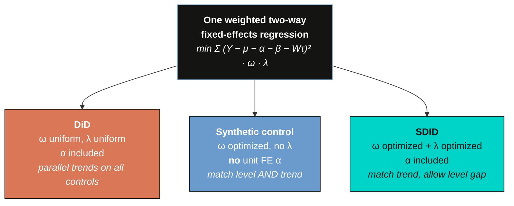

### How the weights are chosen

The **unit weights** make the weighted controls track California's pre-period path, with a small ridge penalty for stability:

$$
\hat{\omega}^{sdid} = \underset{\omega \in \Omega}{\arg\min} \sum\_{t=1}^{T\_{pre}} \left(\omega\_0 + \sum\_{i=1}^{N\_{co}} \omega\_i\\, Y\_{it} - \frac{1}{N\_{tr}} \sum\_{i=N\_{co}+1}^{N} Y\_{it}\right)^{2} + \zeta^{2}\\, T\_{pre}\\, \lVert \omega \rVert\_2^{2}
$$

In words: choose nonnegative weights summing to one (the set $\Omega$) so the weighted control outcome, plus an intercept $\omega\_0$, comes as close as possible to the treated outcome **in every pre-treatment year**. The intercept $\omega\_0$ is what lets SDID match California's *trend* without matching its *level*. The penalty $\zeta^{2} T\_{pre} \lVert \omega \rVert\_2^2$ discourages putting all weight on one or two donors; Arkhangelsky et al. set $\zeta = (N\_{tr} T\_{post})^{1/4}\\, \hat{\sigma}$, with $\hat{\sigma}$ the standard deviation of first-differenced control outcomes.

The **time weights** are the mirror image — they find pre-period years whose weighted average lines up with the post-period:

$$
\hat{\lambda}^{sdid} = \underset{\lambda \in \Lambda}{\arg\min} \sum\_{i=1}^{N\_{co}} \left(\lambda\_0 + \sum\_{t=1}^{T\_{pre}} \lambda\_t\\, Y\_{it} - \frac{1}{T\_{post}} \sum\_{t=T\_{pre}+1}^{T} Y\_{it}\right)^{2} + \zeta\_{\lambda}^{2}\\, N\_{co}\\, \lVert \lambda \rVert^{2}
$$

This says: find pre-period year weights so the weighted pre-period control outcome matches each control's *post-period average*. Years that look most like the post-period get the most weight. We will see SDID place essentially all pre-period weight on **1986–1988**.

| | Unit weights ω | Time weights λ | Unit FE α | Must match |
|---|:---:|:---:|:---:|---|
| **DiD** | uniform | uniform | yes | parallel trends vs. all controls |
| **SC** | optimized | none | **no** | California's level *and* trend |
| **SDID** | optimized | optimized | yes | California's trend (level gap allowed) |

---

## 4. Loading the data

We already loaded and `xtset` the panel above. The `sdid` command takes the data in **long form** and needs four arguments — outcome, unit, time, and a 0/1 treatment indicator — so no further reshaping is required. The `synth2` command additionally needs a numeric panel id and `xtset`, which we created with `encode`.

```stata
summarize packspercapita
tab treated
```

```text
    Variable |        Obs        Mean    Std. dev.       Min        Max
-------------+---------------------------------------------------------
packsperca~a |      1,209    122.6493    35.04942       40.7      296.2

    treated |      Freq.     Percent        Cum.
------------+-----------------------------------
          0 |      1,197       99.01       99.01
          1 |         12        0.99      100.00
------------+-----------------------------------
```

Only **12** of 1,209 observations are treated — California in its 12 post-1988 years. This extreme imbalance (one treated unit) is the defining feature of a comparative case study and, as we will see in Section 9, dictates how inference must be done.

---

## 5. A first look: the original difference-in-differences

The simplest credible estimate is a **2×2 difference-in-differences**: compare California's change from before to after 1989 with the control states' change over the same window. The "difference in differences" removes anything common to all states (the nationwide decline in smoking) and anything fixed about California (its lower baseline level).

```stata
gen byte cal  = state=="California"
gen byte post = year>=1989
reg packspercapita i.cal##i.post
```

```text
------------------------------------------------------------------------------
packsperca~a | Coefficient  Std. err.      t    P>|t|     [95% conf. interval]
-------------+----------------------------------------------------------------
       1.cal |    -14.359   6.788699    -2.12   0.035    -27.67799   -1.040019
      1.post |  -28.51142   1.747208   -16.32   0.000    -31.93932   -25.08351
             |
    cal#post |
        1 1  |  -27.34911   10.91131    -2.51   0.012    -48.75638   -5.941839
             |
       _cons |   130.5695   1.087062   120.11   0.000     128.4368    132.7023
------------------------------------------------------------------------------
```

The interaction `cal#post` **= −27.35** is the DiD estimate: relative to the control states, California's smoking fell by about **27 packs per capita** after Proposition 99. We can read the four group means straight off the table: control states averaged 130.57 packs before and 102.06 after (a drop of 28.5), while California went from 116.21 to 60.35 (a drop of 55.86). The difference of those drops, $-55.86 - (-28.51) = -27.35$, is the DiD.

But this number trusts the **parallel-trends** assumption against the *simple average* of 38 very different states — and the raw-trends figure showed California was already drifting away from that average before 1989. If California was on a steeper downward path for reasons unrelated to the policy, DiD will overstate the effect. This is the weakness synthetic methods are designed to fix.

---

## 6. The original synthetic control with `synth2`

Synthetic control replaces the *simple* average of controls with a *weighted* average chosen to track California before 1989. We fit it with **`synth2`** (Yan and Chen 2023), a modern wrapper around Abadie's `synth` that adds placebo tests and visualization. Because our panel has only the outcome, we match on the **full pre-period path** — each pre-1989 year of `packspercapita` enters as its own predictor. This is the fair, like-for-like analog to what SDID uses.

```stata
* California is id 3 after encode (alphabetical)
local preds
forvalues y = 1970/1988 {
    local preds "`preds' packspercapita(`y')"
}
synth2 packspercapita `preds', trunit(3) trperiod(1989) figure
```

```text
 Number of Control Units  =         38     Root Mean Squared Error  =    1.65640
 Number of Covariates     =         19     R-squared                =    0.97699

Optimal Unit Weights:
---------------------------
     Unit     |    U.weight
--------------+------------
         Utah |     0.3940
      Montana |     0.2320
       Nevada |     0.2050
  Connecticut |     0.1090
 NewHampshire |     0.0450
     Colorado |     0.0150
---------------------------
Note: The average treatment effect over the posttreatment period is -19.4814.
```

The pre-period fit is excellent — a root mean squared prediction error of **1.66 packs** and an $R^2$ of **0.98**, meaning synthetic California reproduces real California almost exactly before 1989. The synthetic is built from just **six** donors, dominated by **Utah (0.39), Montana (0.23), and Nevada (0.21)** — states that smoked like California before the program. The estimated effect averages **−19.48 packs per capita** over 1989–2000, smaller than the naive DiD's −27.35: once we compare California to states that actually looked like it, part of the apparent drop turns out to be the wrong comparison group, not the policy.

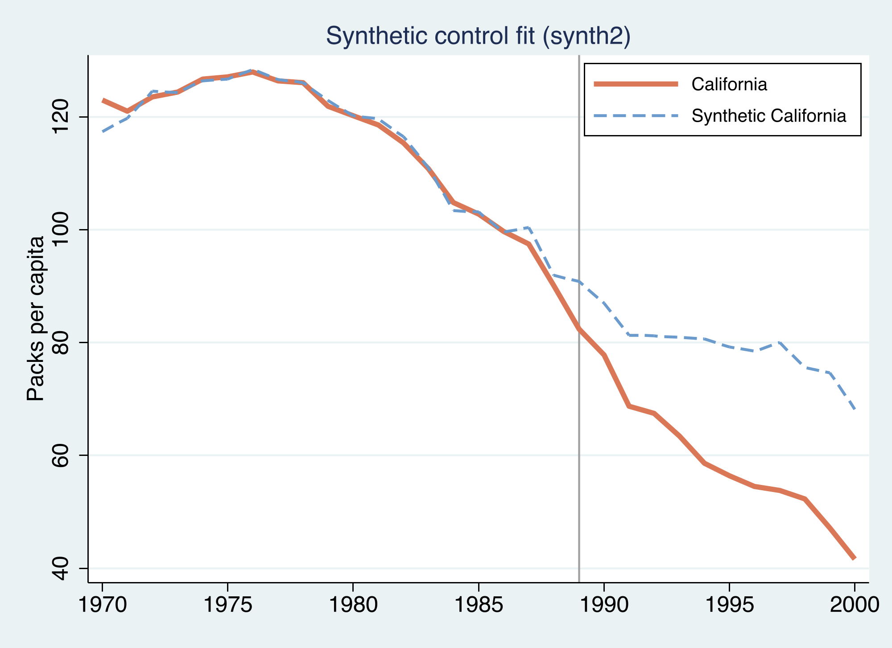

The fit before 1989 is the whole credibility argument for synthetic control: if the synthetic matches California for nineteen years and then diverges exactly when the policy starts, the divergence is plausibly the policy. The next figure shows the same thing as a single **gap** series.

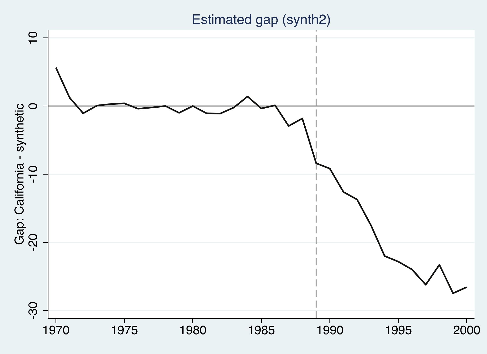

The gap is essentially flat and near zero through 1988 — the pre-period fit is good — and then opens up after the policy, reaching roughly **−27 packs by 2000**. Averaged over the post-period, that is the −19.5 headline. The growing gap is consistent with a program whose effect compounds as the tax and campaign change long-run behavior.

---

## 7. Synthetic difference-in-differences with `sdid`

Now SDID. The syntax mirrors the data structure — outcome, unit, time, treatment — and one option, `vce()`, selects the inference method. We start with `vce(noinference)` to focus on the point estimate and the diagnostic graph.

```stata
sdid packspercapita state year treated, method(sdid) vce(noinference) graph
```

```text
Synthetic Difference-in-Differences Estimator

-----------------------------------------------------------------------------
packsperca~a |     ATT     Std. Err.     t      P>|t|    [95% Conf. Interval]
-------------+---------------------------------------------------------------
     treated | -15.60383          .        .        .           .           .
-----------------------------------------------------------------------------
```

The SDID estimate is **−15.60 packs per capita** — smaller again than both DiD (−27.35) and SC (−19.48). Relative to the level SDID implies California *would* have smoked, this is roughly a **20% reduction**, and it is the number reported in Arkhangelsky et al. (2021). Why is it smaller than SC's? Because SDID does two things SC does not: it allows a constant level gap (so it is not forced to fit California's *level*, only its *trend*), and it down-weights pre-period years that look nothing like the late 1980s. Both make the comparison more conservative.

The `graph` option produces SDID's signature diagnostic.


Two things are worth noticing. First, the synthetic "Control" line sits **above** California throughout — SDID does not try to close that level gap, because the unit fixed effect absorbs it. What SDID cares about is whether the two lines stay **parallel** before 1989 (they do) and then diverge after (they do). Second, the green shaded ribbon shows the **time weights** $\hat{\lambda}\_t$ — and they are not uniform.

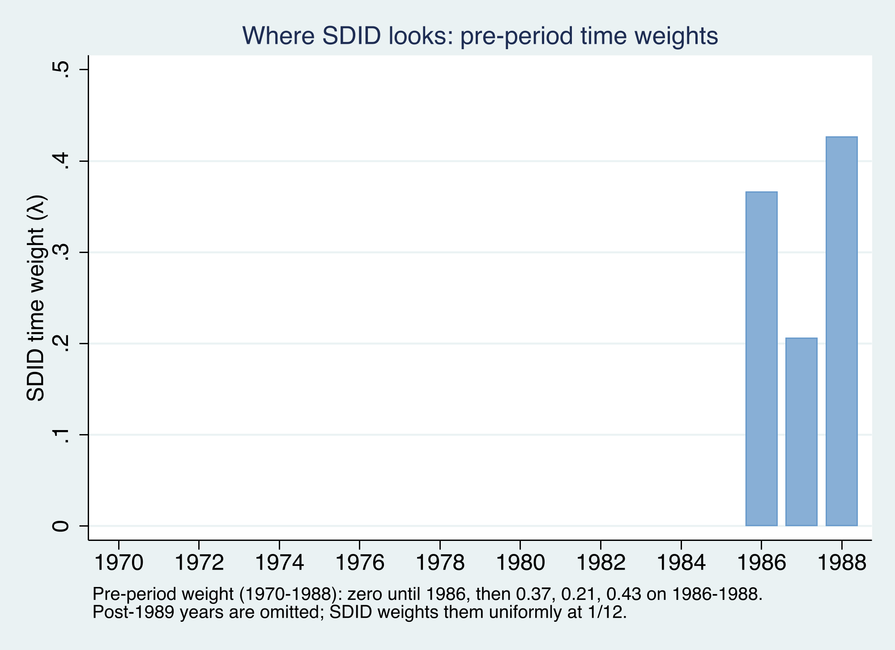

This is SDID's distinctive move. Of the nineteen pre-policy years, it places **all** pre-period weight on **1986–1988** — the years most similar to the post-1989 period — and zero on 1970–1985. Intuitively, smoking behavior and its determinants in 1972 tell us little about the counterfactual for 1995; the late 1980s tell us much more. DiD and SC, by contrast, treat 1972 and 1988 as equally informative. We can confirm which states and years carry weight by asking `sdid` to return them:

```stata
sdid packspercapita state year treated, vce(noinference) returnweights mattitles
```

The returned unit weights $\hat{\omega}\_i$ are **diffuse** compared with synthetic control's: the largest are Nevada (0.12), New Hampshire (0.11), Connecticut (0.08), Delaware (0.07), and Colorado (0.06), with positive weight spread across roughly twenty states. Where `synth2` leaned on six donors, SDID's ridge penalty spreads the weight — trading a little pre-period fit for a more stable, less idiosyncratic comparison group. Both methods nonetheless agree on the *kind* of state that resembles California: Nevada, Utah, Montana, Connecticut, and Colorado appear prominently in both.

---

## 8. One command, three estimators

Here is the practical payoff emphasized by Clarke et al. (2024): the `sdid` command implements all three estimators in an **identical framework**. You do not switch packages or rewrite your model — you change the single option `method()`. Estimation, inference (`vce()`), and the diagnostic `graph` all work the same way for each.

```stata
sdid packspercapita state year treated, method(did)  vce(noinference) graph
sdid packspercapita state year treated, method(sc)   vce(noinference) graph
sdid packspercapita state year treated, method(sdid) vce(noinference) graph
```

```text
DiD (sdid framework)  = -27.34911
SC  (sdid framework)  = -19.61966
SDID                  = -15.60383
```

This is a strong internal consistency check. The framework's `method(did)` returns **−27.349** — *identical*, to the decimal, to the raw 2×2 interaction we computed by hand with `reg` in Section 5. And `method(sc)` returns **−19.620**, essentially the same as the **−19.481** from the standalone `synth2` command (the tiny gap reflects different regularization: `sdid` matches the full pre-period path with a ridge penalty, while `synth2` optimizes Abadie's predictor-weighting V-matrix). In other words, the unified command reproduces the two classic estimators we obtained by entirely separate routes — which is exactly the claim that they are special cases of one weighted regression. And because the optimal weights are computed once and reused across `vce()` options, doing so is computationally cheap.

The same `graph` option yields each method's diagnostic, so they can be read side by side.

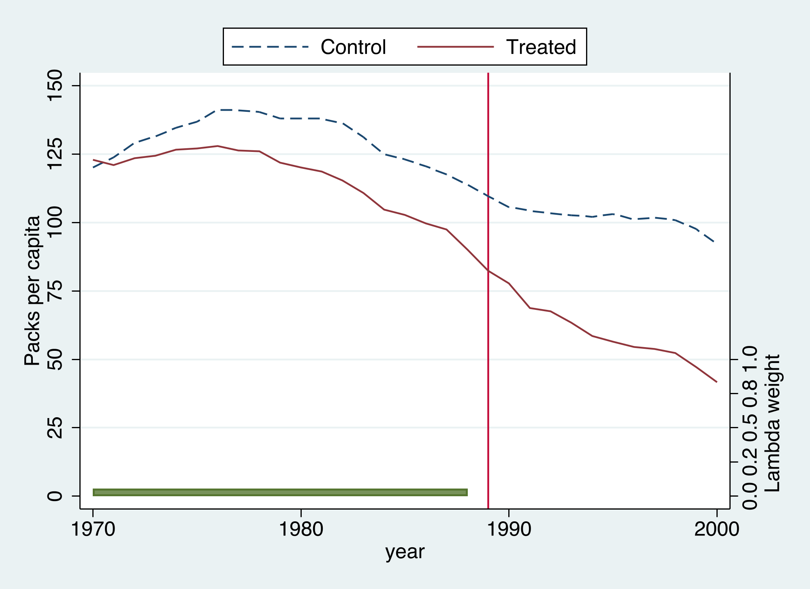

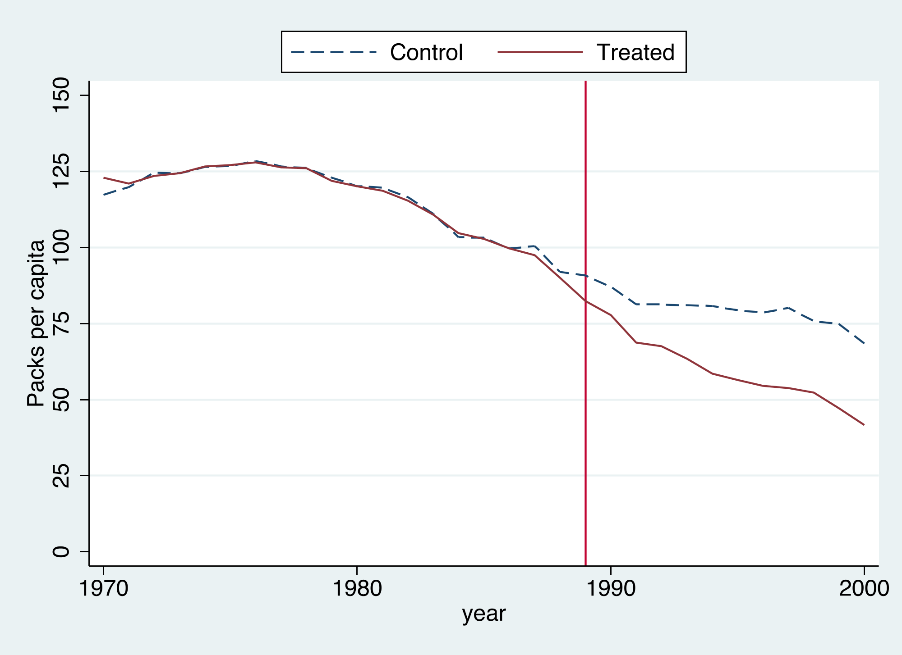

Stacking all four counterfactuals on one chart makes the ranking transparent. To put them on a common scale, the SDID counterfactual is anchored to California by its $\lambda$-weighted pre-period gap (recall SDID identifies effects only up to a constant level, which the unit fixed effect absorbs).

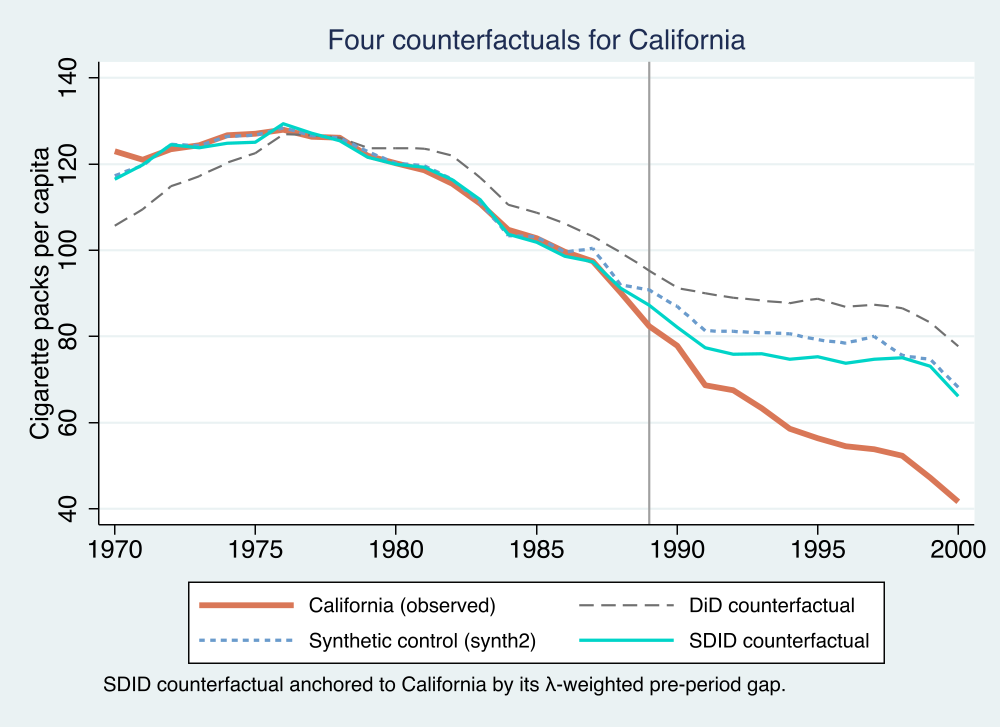

The story is consistent across methods — Proposition 99 **reduced** smoking — but the magnitude depends on how the counterfactual is built. The naive DiD is the most extreme because it compares California to a control average that was already on a different trajectory. Synthetic control fixes the comparison group and shrinks the estimate to about −19.5. SDID, by additionally allowing a level gap and weighting the informative late-1980s years, is the most conservative at −15.6. Reasonable methods bracket the truth; SDID's contribution is to be robust to the assumption — exact parallel trends — that the others lean on hardest.

Collecting every estimate in one place:

| Method | Command | ATT (packs per capita) |
|---|---|:---:|
| Raw 2×2 DiD | `reg y i.cal##i.post` | −27.35 |
| DiD (unified) | `sdid …, method(did)` | −27.35 |
| Synthetic control | `synth2 …` | −19.48 |
| SC (unified) | `sdid …, method(sc)` | −19.62 |
| **SDID** | `sdid …, method(sdid)` | **−15.60** |

---

## 9. Inference: how sure are we?

A point estimate is not enough; we need a standard error. SDID's variance feeds a familiar normal-approximation confidence interval:

$$
\hat{\tau}^{sdid} \pm z\_{\alpha/2} \sqrt{\hat{V}\_{\tau}}
$$

Arkhangelsky et al. (2021) offer three ways to estimate $\hat{V}\_{\tau}$: a **bootstrap**, a **jackknife**, and a **placebo** (permutation) procedure. The choice is not free here — it is forced by our design. With a **single treated unit**:

- The **jackknife** is literally **undefined**. It works by deleting one unit at a time and re-estimating; when it deletes California, there is no treated unit left, so the treated-removed estimate does not exist.
- The **bootstrap** relies on resampling *many* treated units; its asymptotics require the number of treated units to grow. With one treated unit it is unreliable.
- The **placebo** procedure is the one valid option. It keeps the controls, repeatedly assigns the treatment structure to a *control* state as a fake "placebo" treatment, re-estimates the effect, and uses the spread of those placebo estimates as the variance.

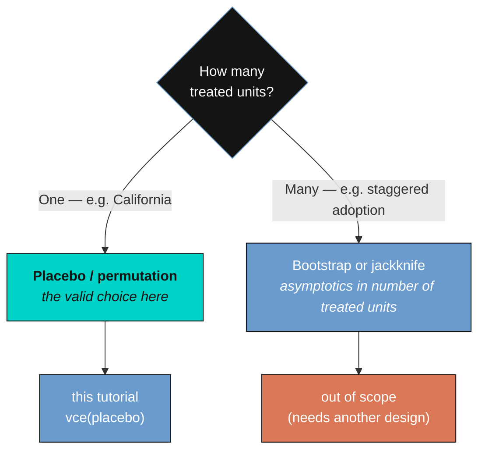

So we run placebo inference, the appropriate choice for a comparative case study.

```stata
sdid packspercapita state year treated, vce(placebo) seed(1213)
```

```text
Synthetic Difference-in-Differences Estimator

-----------------------------------------------------------------------------
packsperca~a |     ATT     Std. Err.     t      P>|t|    [95% Conf. Interval]
-------------+---------------------------------------------------------------
     treated | -15.60383    9.87941    -1.58    0.114   -34.96712     3.75946
-----------------------------------------------------------------------------
95% CIs and p-values are based on large-sample approximations.
```

The placebo standard error is **9.88**, giving a 95% interval of roughly **[−35.0, 3.8]**. Notice this interval **includes zero**: by the normal-approximation criterion, we cannot reject "no effect" at the 5% level ($p = 0.114$). With a single treated unit and a noisy donor pool, the SDID interval is genuinely wide — honest about how hard it is to be certain from one case.

But the normal approximation is not the only — or the sharpest — way to use the placebo distribution. We can also run an explicit **permutation test**: assign the placebo treatment to each control state in turn, collect the placebo effects, and ask how California's real estimate ranks against them.

```stata
* assign each control as a placebo-treated unit, collect placebo ATTs
drop if state=="California"
levelsof state, local(ctrls)
foreach s of local ctrls {
    preserve
        gen byte ptreat = (state=="`s'") & (year>=1989)
        sdid packspercapita state year ptreat, vce(noinference)
        * store e(ATT)
    restore
}
```

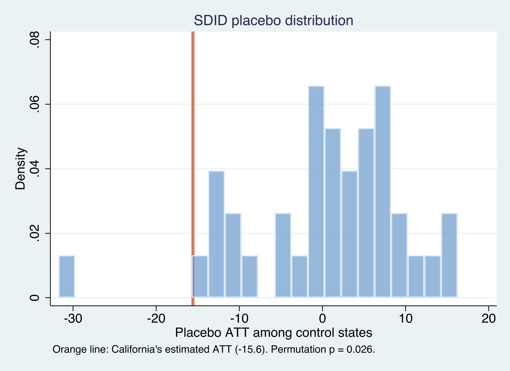

The placebo effects for control states cluster around **zero** — reassuring, since those states passed no comparable policy — while California's **−15.6** lands far in the left tail. Only **1 of 38** control states produced a placebo effect as large in magnitude as California's, a permutation **p-value of 0.026**. So the two inferential lenses tell complementary stories: the rank-based permutation test says California's drop is very unlikely to be noise (significant at 5%), while the conservative normal-approximation interval reminds us that, with a single treated unit, the *precision* of the magnitude is limited. Reporting both is the honest summary.

### Other inference designs (out of scope)

It would be wrong to conclude that bootstrap and jackknife are "bad" — they are simply built for a **different design**. They come into their own when there are **many treated units**, especially under **staggered adoption**, where units adopt the policy at different times. In that setting the ATT is an average of adoption-cohort-specific effects,

$$
\widehat{ATT} = \sum\_{a \in A} \frac{T\_{post}^{a}}{T\_{post}}\ \hat{\tau}\_a^{sdid}
$$

and with many treated units the asymptotic arguments behind the bootstrap and jackknife hold. The `sdid` command supports all of this — `vce(bootstrap)`, `vce(jackknife)`, covariate adjustment, and staggered timing — but those tools require a genuinely different research design (multiple treated units adopting at multiple times) than California's single 1989 intervention. We deliberately keep this tutorial to the **block design with one treated unit**, where the placebo procedure is the right and sufficient tool. The staggered case, with its own estimation and inference, is a natural next tutorial.

---

## 10. Robustness and discussion

What should we take away about Proposition 99? Three independent constructions of the counterfactual — DiD, synthetic control, and SDID — all agree the policy **reduced** smoking, with estimates from −15.6 to −27.3 packs per capita. The disagreement is informative rather than alarming: it maps directly onto how much each method trusts the comparison group.

- **DiD (−27.35)** trusts that California would have moved parallel to the *average* of 38 heterogeneous states. The pre-period figure shows that average was already diverging from California, so DiD likely overstates the effect.
- **Synthetic control (−19.48)** fixes the comparison group to states that actually resembled California (Utah, Montana, Nevada). Its pre-period fit is excellent (RMSE 1.66), which is the evidence for its credibility.
- **SDID (−15.60)** additionally allows a constant level gap and concentrates on the informative late-1980s years. It is the most robust to a violation of exact parallel trends, and the most conservative.

The honest range, then, is something like "Proposition 99 cut cigarette consumption by **roughly 16–20 packs per capita per year**, plausibly larger by the end of the 1990s," with SDID the preferred single number because it leans least on the assumption most likely to fail.

A few caveats apply to all three estimates. With **one treated unit**, statistical power is inherently limited — the SDID confidence interval includes zero even though the permutation test is significant, and no method can fully escape that. The placebo variance assumes **homoskedasticity across units** (the placebo treatments are drawn only from controls). And like every comparative case study, identification assumes **no other large shock hit California alone** in 1989 and **no spillovers** to the donor states (if Californians bought cigarettes across state lines, neighboring donors are contaminated). These are assumptions to argue substantively, not settle statistically.

---

## 11. Summary and key takeaways

- **Method.** SDID is one weighted two-way fixed-effects regression. DiD is the special case with uniform weights; synthetic control is the special case with unit weights but no time weights and no unit fixed effect. SDID uses **both** unit and time weights and keeps the unit fixed effect, so it matches California's pre-period *trend* while allowing a constant *level* gap.
- **Data.** On the Proposition 99 panel, the estimates are DiD **−27.35**, synthetic control **−19.48**, and SDID **−15.60** packs per capita — the same direction, with magnitude shrinking as the comparison group becomes more credible. SDID's time weights land entirely on **1986–1988**.
- **One framework.** The single `sdid` command reproduced the hand-computed 2×2 DiD *exactly* (−27.35) and the standalone `synth2` synthetic control closely (−19.62 vs −19.48), confirming that all three are special cases of one estimator and can be run, with inference and graphs, from one command.
- **Inference.** With a single treated unit, **placebo** is the valid procedure: jackknife is undefined and the bootstrap is unreliable. The placebo SE is 9.88 (95% CI [−35.0, 3.8], which includes zero), while the permutation test gives **p = 0.026**. Report both.
- **Limitation and next step.** One treated unit means limited power. The natural extension is **staggered adoption** with many treated units, where `vce(bootstrap)` and `vce(jackknife)` become appropriate and covariates can be added — a different design, and a good follow-up tutorial.

---

## 12. Exercises

1. **Weights side by side.** Re-run `sdid …, method(sc) vce(noinference) returnweights` and compare its unit weights to the `synth2` donor weights from Section 6. Which states appear in both? Why does the `sdid` version spread weight more widely? (Hint: the ridge penalty $\zeta$.)
2. **Placebo stability.** Re-estimate `sdid …, vce(placebo) seed(1213)` with a different `seed()` and with more replications via `reps()`. How much does the standard error move? What does that tell you about reading a single placebo SE to three decimal places?
3. **Time weights matter.** Inspect `e(lambda)` after the SDID run and confirm the weight on 1986–1988. Then think through: if you forced uniform time weights (as DiD and SC do), would you expect the estimate to move toward or away from the DiD number? Check your intuition by comparing `method(sdid)` with `method(sc)`.

---

## References

1. Arkhangelsky, D., Athey, S., Hsiao, D. A., Imbens, G. W., and Wager, S. (2021). [Synthetic Difference-in-Differences](https://doi.org/10.1257/aer.20190159). *American Economic Review* 111(12): 4088–4118.
2. Clarke, D., Pailañir, D., Athey, S., and Imbens, G. (2024). [On Synthetic Difference-in-Differences and Related Estimation Methods in Stata](https://doi.org/10.1177/1536867X241297184). *The Stata Journal* (st0757). The `sdid` command.
3. Abadie, A., Diamond, A., and Hainmueller, J. (2010). [Synthetic Control Methods for Comparative Case Studies: Estimating the Effect of California's Tobacco Control Program](https://doi.org/10.1198/jasa.2009.ap08746). *Journal of the American Statistical Association* 105(490): 493–505.
4. Abadie, A., and Gardeazabal, J. (2003). [The Economic Costs of Conflict: A Case Study of the Basque Country](https://doi.org/10.1257/000282803321455188). *American Economic Review* 93(1): 113–132.
5. Yan, G., and Chen, Q. (2023). [synth2: Synthetic Control Method with Placebo Tests, Robustness Test and Visualization](https://doi.org/10.1177/1536867X231195278). *The Stata Journal* 23(3): 597–624. The `synth2` command.

**Related tutorials on this site:** [Synthetic control in Stata](/post/stata_sc/) · [Difference-in-differences in Stata](/post/stata_did/) · [Sensitivity analysis for parallel trends (honestdid)](/post/stata_honestdid/) · [Bayesian spatial synthetic control for Proposition 99 (R)](/post/r_sc_bayes_spatial/)

## Acknowledgments

The analysis uses the `sdid` (Clarke, Pailañir, Athey, and Imbens) and `synth2` (Yan and Chen) Stata packages and the Proposition 99 dataset distributed with `sdid`. AI tools (Claude Code, with NotebookLM for the audio summary) assisted in drafting and exposition; all code was executed and all numbers verified by the author, who is responsible for any remaining errors.

---

<style>
.podcast-overlay {
  display: none;
  position: fixed;
  bottom: 0;
  left: 0;
  right: 0;
  z-index: 9999;
  animation: podSlideUp 0.35s ease-out;
}
@keyframes podSlideUp {
  from { transform: translateY(100%); }
  to { transform: translateY(0); }
}
.podcast-overlay.pod-closing {
  animation: podSlideDown 0.3s ease-in forwards;
}
@keyframes podSlideDown {
  from { transform: translateY(0); }
  to { transform: translateY(100%); }
}
.podcast-container {
  background: linear-gradient(135deg, #1a1a2e 0%, #16213e 100%);
  padding: 18px 24px 20px;
  font-family: -apple-system, BlinkMacSystemFont, 'Segoe UI', Roboto, sans-serif;
  box-shadow: 0 -4px 32px rgba(0,0,0,0.5);
  border-top: 1px solid rgba(106,155,204,0.2);
}
.podcast-inner {
  max-width: 800px;
  margin: 0 auto;
}
.podcast-top-row {
  display: flex;
  align-items: center;
  gap: 14px;
  margin-bottom: 14px;
}
.podcast-icon {
  width: 42px;
  height: 42px;
  background: linear-gradient(135deg, #d97757, #e8956a);
  border-radius: 10px;
  display: flex;
  align-items: center;
  justify-content: center;
  flex-shrink: 0;
}
.podcast-icon svg {
  width: 22px;
  height: 22px;
  fill: #fff;
}
.podcast-title-block {
  flex: 1;
  min-width: 0;
}
.podcast-title-block h4 {
  margin: 0 0 1px 0;
  color: #f0ece2;
  font-size: 14px;
  font-weight: 600;
  letter-spacing: 0.02em;
  white-space: nowrap;
  overflow: hidden;
  text-overflow: ellipsis;
}
.podcast-title-block span {
  color: #8b9dc3;
  font-size: 11px;
}
.podcast-close-btn {
  background: none;
  border: none;
  cursor: pointer;
  padding: 6px;
  border-radius: 50%;
  display: flex;
  align-items: center;
  justify-content: center;
  transition: background 0.2s;
  flex-shrink: 0;
}
.podcast-close-btn:hover {
  background: rgba(255,255,255,0.1);
}
.podcast-close-btn svg {
  width: 20px;
  height: 20px;
  fill: #8b9dc3;
}
.podcast-progress-wrap {
  margin-bottom: 12px;
}
.podcast-time-row {
  display: flex;
  justify-content: space-between;
  font-size: 11px;
  color: #8b9dc3;
  margin-bottom: 5px;
  font-variant-numeric: tabular-nums;
}
.podcast-bar-bg {
  width: 100%;
  height: 6px;
  background: rgba(255,255,255,0.1);
  border-radius: 3px;
  cursor: pointer;
  position: relative;
  overflow: hidden;
  transition: height 0.15s;
}
.podcast-bar-buffered {
  position: absolute;
  top: 0;
  left: 0;
  height: 100%;
  background: rgba(106,155,204,0.25);
  border-radius: 3px;
  transition: width 0.3s;
}
.podcast-bar-progress {
  position: absolute;
  top: 0;
  left: 0;
  height: 100%;
  background: linear-gradient(90deg, #6a9bcc, #00d4c8);
  border-radius: 3px;
  transition: width 0.1s linear;
}
.podcast-bar-bg:hover {
  height: 10px;
  margin-top: -2px;
}
.podcast-controls-row {
  display: flex;
  align-items: center;
  justify-content: space-between;
}
.podcast-transport {
  display: flex;
  align-items: center;
  gap: 8px;
}
.podcast-btn {
  background: none;
  border: none;
  cursor: pointer;
  padding: 4px;
  display: flex;
  align-items: center;
  justify-content: center;
  border-radius: 50%;
  transition: all 0.2s;
}
.podcast-btn svg {
  fill: #c8d0e0;
  transition: fill 0.2s;
}
.podcast-btn:hover svg {
  fill: #f0ece2;
}
.podcast-btn-skip {
  position: relative;
}
.podcast-btn-skip span {
  position: absolute;
  font-size: 7px;
  font-weight: 700;
  color: #c8d0e0;
  top: 50%;
  left: 50%;
  transform: translate(-50%, -50%);
  pointer-events: none;
  margin-top: 1px;
}
.podcast-btn-play {
  width: 48px;
  height: 48px;
  background: linear-gradient(135deg, #d97757, #e8956a);
  border-radius: 50%;
  box-shadow: 0 3px 12px rgba(217,119,87,0.4);
  transition: all 0.2s;
}
.podcast-btn-play:hover {
  transform: scale(1.08);
  box-shadow: 0 5px 20px rgba(217,119,87,0.5);
}
.podcast-btn-play svg {
  fill: #fff;
  width: 22px;
  height: 22px;
}
.podcast-extras {
  display: flex;
  align-items: center;
  gap: 10px;
}
.podcast-volume-wrap {
  display: flex;
  align-items: center;
  gap: 5px;
}
.podcast-volume-wrap svg {
  fill: #8b9dc3;
  width: 16px;
  height: 16px;
  cursor: pointer;
  flex-shrink: 0;
}
.podcast-volume-wrap svg:hover {
  fill: #c8d0e0;
}
.podcast-volume-slider {
  -webkit-appearance: none;
  appearance: none;
  width: 60px;
  height: 4px;
  background: rgba(255,255,255,0.12);
  border-radius: 2px;
  outline: none;
  cursor: pointer;
}
.podcast-volume-slider::-webkit-slider-thumb {
  -webkit-appearance: none;
  appearance: none;
  width: 12px;
  height: 12px;
  background: #6a9bcc;
  border-radius: 50%;
  cursor: pointer;
}
.podcast-speed-btn {
  background: rgba(255,255,255,0.08);
  border: 1px solid rgba(255,255,255,0.12);
  color: #c8d0e0;
  font-size: 11px;
  font-weight: 600;
  padding: 3px 9px;
  border-radius: 12px;
  cursor: pointer;
  transition: all 0.2s;
  font-family: inherit;
  min-width: 40px;
  text-align: center;
}
.podcast-speed-btn:hover {
  background: rgba(106,155,204,0.2);
  border-color: #6a9bcc;
  color: #f0ece2;
}
.podcast-download-btn {
  background: none;
  border: 1px solid rgba(255,255,255,0.12);
  border-radius: 8px;
  padding: 4px 10px;
  cursor: pointer;
  display: flex;
  align-items: center;
  gap: 4px;
  color: #8b9dc3;
  font-size: 11px;
  font-family: inherit;
  text-decoration: none;
  transition: all 0.2s;
}
.podcast-download-btn:hover {
  border-color: #6a9bcc;
  color: #f0ece2;
  background: rgba(106,155,204,0.1);
}
.podcast-download-btn svg {
  width: 14px;
  height: 14px;
  fill: currentColor;
}
@media (max-width: 600px) {
  .podcast-container { padding: 14px 16px 16px; }
  .podcast-volume-wrap { display: none; }
  .podcast-title-block h4 { font-size: 13px; }
  .podcast-extras { gap: 8px; }
}
</style>

<div class="podcast-overlay" id="podOverlay">
<div class="podcast-container">
<div class="podcast-inner">
  <audio id="podAudio" preload="none" src="https://files.catbox.moe/wybbqc.m4a"></audio>

  <div class="podcast-top-row">
    <div class="podcast-icon">
      <svg viewBox="0 0 24 24"><path d="M12 1a5 5 0 0 0-5 5v4a5 5 0 0 0 10 0V6a5 5 0 0 0-5-5zm0 16a7 7 0 0 1-7-7H3a9 9 0 0 0 8 8.94V22h2v-3.06A9 9 0 0 0 21 10h-2a7 7 0 0 1-7 7z"/></svg>
    </div>
    <div class="podcast-title-block">
      <h4>AI Podcast: Synthetic Difference-in-Differences</h4>
      <span id="podDurationLabel">Click play to load</span>
    </div>
    <button class="podcast-close-btn" onclick="podClose()" title="Close player">
      <svg viewBox="0 0 24 24"><path d="M19 6.41L17.59 5 12 10.59 6.41 5 5 6.41 10.59 12 5 17.59 6.41 19 12 13.41 17.59 19 19 17.59 13.41 12z"/></svg>
    </button>
  </div>

  <div class="podcast-progress-wrap">
    <div class="podcast-time-row">
      <span id="podCurrent">0:00</span>
      <span id="podDuration">0:00</span>
    </div>
    <div class="podcast-bar-bg" id="podBarBg" onclick="podSeek(event)">
      <div class="podcast-bar-buffered" id="podBuffered"></div>
      <div class="podcast-bar-progress" id="podProgress"></div>
    </div>
  </div>

  <div class="podcast-controls-row">
    <div class="podcast-transport">
      <button class="podcast-btn podcast-btn-skip" onclick="podSkip(-15)" title="Back 15s">
        <svg width="26" height="26" viewBox="0 0 24 24"><path d="M12 5V1L7 6l5 5V7c3.31 0 6 2.69 6 6s-2.69 6-6 6-6-2.69-6-6H4c0 4.42 3.58 8 8 8s8-3.58 8-8-3.58-8-8-8z"/></svg>
        <span>15</span>
      </button>
      <button class="podcast-btn podcast-btn-play" id="podPlayBtn" onclick="podToggle()" title="Play">
        <svg id="podIconPlay" viewBox="0 0 24 24"><path d="M8 5v14l11-7z"/></svg>
        <svg id="podIconPause" viewBox="0 0 24 24" style="display:none"><path d="M6 19h4V5H6v14zm8-14v14h4V5h-4z"/></svg>
      </button>
      <button class="podcast-btn podcast-btn-skip" onclick="podSkip(15)" title="Forward 15s">
        <svg width="26" height="26" viewBox="0 0 24 24"><path d="M12 5V1l5 5-5 5V7c-3.31 0-6 2.69-6 6s2.69 6 6 6 6-2.69 6-6h2c0 4.42-3.58 8-8 8s-8-3.58-8-8 3.58-8 8-8z"/></svg>
        <span>15</span>
      </button>
    </div>
    <div class="podcast-extras">
      <div class="podcast-volume-wrap">
        <svg id="podVolIcon" onclick="podMute()" viewBox="0 0 24 24"><path d="M3 9v6h4l5 5V4L7 9H3zm13.5 3A4.5 4.5 0 0 0 14 8.5v7a4.47 4.47 0 0 0 2.5-3.5zM14 3.23v2.06a6.51 6.51 0 0 1 0 13.42v2.06A8.51 8.51 0 0 0 14 3.23z"/></svg>
        <input type="range" class="podcast-volume-slider" id="podVolume" min="0" max="1" step="0.05" value="0.8">
      </div>
      <button class="podcast-speed-btn" id="podSpeedBtn" onclick="podCycleSpeed()" title="Playback speed">1x</button>
      <a class="podcast-download-btn" href="https://files.catbox.moe/wybbqc.m4a" target="_blank" rel="noopener" title="Stream">
        <svg viewBox="0 0 24 24"><path d="M19 9h-4V3H9v6H5l7 7 7-7zM5 18v2h14v-2H5z"/></svg>
      </a>
    </div>
  </div>
</div>
</div>
</div>

<script>
(function(){
  var overlay = document.getElementById('podOverlay');
  var a = document.getElementById('podAudio');
  var speeds = [0.75, 1, 1.25, 1.5, 2];
  var si = 1;
  var opened = false;
  function fmt(s){
    if(isNaN(s)) return '0:00';
    var m=Math.floor(s/60), sec=Math.floor(s%60);
    return m+':'+(sec<10?'0':'')+sec;
  }
  document.addEventListener('click', function(e){
    var link = e.target.closest('a.btn-page-header');
    if(!link) return;
    var text = link.textContent.trim();
    if(text.indexOf('AI Podcast') === -1) return;
    e.preventDefault();
    e.stopPropagation();
    overlay.style.display = 'block';
    overlay.classList.remove('pod-closing');
    if(!opened){
      a.preload = 'metadata';
      a.load();
      opened = true;
    }
  });
  a.volume = 0.8;
  a.addEventListener('loadedmetadata', function(){
    document.getElementById('podDuration').textContent = fmt(a.duration);
    document.getElementById('podDurationLabel').textContent = fmt(a.duration) + ' minutes';
  });
  a.addEventListener('timeupdate', function(){
    document.getElementById('podCurrent').textContent = fmt(a.currentTime);
    var pct = a.duration ? (a.currentTime/a.duration)*100 : 0;
    document.getElementById('podProgress').style.width = pct+'%';
  });
  a.addEventListener('progress', function(){
    if(a.buffered.length>0){
      var pct = (a.buffered.end(a.buffered.length-1)/a.duration)*100;
      document.getElementById('podBuffered').style.width = pct+'%';
    }
  });
  a.addEventListener('ended', function(){
    document.getElementById('podIconPlay').style.display='';
    document.getElementById('podIconPause').style.display='none';
  });
  window.podToggle = function(){
    if(a.paused){a.play();document.getElementById('podIconPlay').style.display='none';document.getElementById('podIconPause').style.display='';}
    else{a.pause();document.getElementById('podIconPlay').style.display='';document.getElementById('podIconPause').style.display='none';}
  };
  window.podSkip = function(s){a.currentTime = Math.max(0,Math.min(a.duration||0,a.currentTime+s));};
  window.podSeek = function(e){
    var rect = document.getElementById('podBarBg').getBoundingClientRect();
    var pct = (e.clientX - rect.left)/rect.width;
    a.currentTime = pct * (a.duration||0);
  };
  window.podMute = function(){
    a.muted = !a.muted;
    document.getElementById('podVolume').value = a.muted ? 0 : a.volume;
  };
  window.podCycleSpeed = function(){
    si = (si+1) % speeds.length;
    a.playbackRate = speeds[si];
    document.getElementById('podSpeedBtn').textContent = speeds[si]+'x';
  };
  window.podClose = function(){
    overlay.classList.add('pod-closing');
    setTimeout(function(){ overlay.style.display='none'; }, 300);
    a.pause();
    document.getElementById('podIconPlay').style.display='';
    document.getElementById('podIconPause').style.display='none';
  };
  document.getElementById('podVolume').addEventListener('input', function(){
    a.volume = this.value;
    a.muted = false;
  });
  if(window.location.hash === '#podcast-player'){
    overlay.style.display = 'block';
    a.preload = 'metadata';
    a.load();
    opened = true;
  }
})();
</script>
