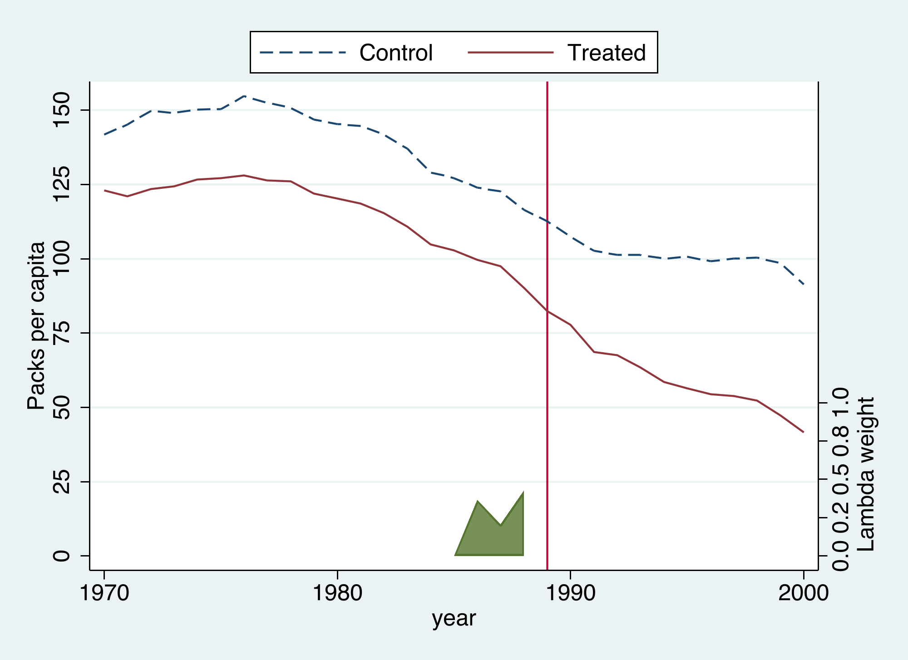

# The Tension {.divider background-color="#d97757"}

[Act I]{.act}

## Did Proposition 99 cut smoking? We can never observe the California that voted *no*

In November 1988, California raised its cigarette tax by 25 cents a pack and funded an anti-smoking campaign.

. . .

To measure the effect we need California's smoking *without* the law — a counterfactual we never get to see. *Every method here is a different way to imagine it.*

::: {.notes}
This is the textbook comparative case study: one large unit adopts a policy and we want the causal effect, even though the untreated California is forever unobserved. Set the stakes here — the whole talk is about how to build that dashed counterfactual line credibly.
:::

## Three estimators, one dataset, three different answers — from −27 to −16


::: {.notes}
The spoiler figure. Don't explain each line yet — just plant that the answer to "how big was the effect?" depends entirely on how you build the counterfactual, and the three credible methods bracket a range. We earn each line in Act II and return to this picture in Act III.
:::

## Where we're going

::: {.incremental}
- The case: Proposition 99 and a 39-state, 31-year panel
- Three estimators written as **one** weighted regression
- SDID's signature: unit weights *and* time weights
- Inference with a single treated unit — placebo, not bootstrap
:::

::: {.notes}
Built from the post's learning objectives. Teaching deck, so we give the audience a map. Each bullet is roughly one act-segment.
:::

# The Investigation {.divider background-color="#6a9bcc"}

[Act II]{.act}

## The lab: 39 states, 1970–2000, one outcome, one treated unit

::: {.incremental}
- **Outcome** $Y_{it}$ — annual cigarette sales, packs per capita
- **Treated** $W_{it}$ — California from 1989 only ($N_{tr}=1$)
- **Donor pool** — 38 control states, no comparable tobacco program
- **No covariates** — SC and SDID see *exactly* the same information
:::

[1,209 observations, of which only **12** are treated. That extreme imbalance is the defining feature of a comparative case study — and it dictates how we do inference.]{.comment}

::: {.notes}
The panel is strongly balanced (no gaps), which every method requires. The "outcome only, no covariates" design is deliberate: it means any difference between SC and SDID comes from the estimator, not from a different set of predictors. California is id 3 after an alphabetical encode.
:::

## The naive picture already warns us: California was on a different level *and* trend


::: {.notes}
California sits at a different level than the average donor and was already on a steeper downward trend before 1989. A credible estimate must deal with both problems. This figure is the motivation for everything that follows — it is why DiD against the simple average is shaky.
:::

## The estimand is the ATT — the effect of the policy *on California*

$$\tau = \frac{1}{N_{tr}\, T_{post}} \sum_{i:\, W_i = 1}\ \sum_{t > T_{pre}} \left[\, Y_{it}(1) - Y_{it}(0) \,\right]$$

[Average, over treated units and post-1988 years, of the outcome *with* the policy minus the outcome that *would* have occurred without it. With $N_{tr}=1$, every method is just a different way to impute the missing $Y_{it}(0)$.]{.comment}

::: {.notes}
Name the estimand explicitly: this is the average treatment effect on the treated, not a population ATE. Because California was not randomly assigned to treatment, this is an observational design — identification rests on a stable comparison group and no California-specific shock, not on randomization.
:::

## SDID is one weighted two-way fixed-effects regression

$$\left(\hat{\tau}^{sdid}, \hat{\mu}, \hat{\alpha}, \hat{\beta}\right) = \underset{\tau,\mu,\alpha,\beta}{\arg\min} \sum_{i=1}^{N} \sum_{t=1}^{T} \left(Y_{it} - \mu - \alpha_i - \beta_t - W_{it}\,\tau\right)^{2}\, \hat{\omega}_i^{sdid}\, \hat{\lambda}_t^{sdid}$$

[$\alpha_i$ is a state fixed effect, $\beta_t$ a year fixed effect, $\tau$ the ATT. The two extra terms — $\hat{\omega}_i$ (unit weight) and $\hat{\lambda}_t$ (time weight) — are everything that separates SDID from ordinary regression.]{.comment}

::: {.notes}
This is the unifying view of Arkhangelsky et al. (2021). Read the symbols against the Stata variables: Y is packspercapita, W is treated. Set the two weights to special values and you recover the older estimators — that is the next two slides.
:::

## Set both weights uniform and you get plain DiD; drop the time weights and unit FE and you get SC

:::: {.columns}
::: {.column width="50%"}
### DiD — special case

- $\hat{\omega}_i,\ \hat{\lambda}_t$ both **uniform**
- unit FE $\alpha_i$ **kept**
- credibility rests on parallel trends vs. *all* controls
:::
::: {.column width="50%"}
### SC — special case

- $\hat{\omega}_i$ **optimized**, no $\hat{\lambda}_t$
- unit FE $\alpha_i$ **dropped**
- must match California's *level* **and** trend
:::
::::

[SDID keeps the best of both: optimized $\hat{\omega}_i$ *and* $\hat{\lambda}_t$, with the unit FE retained — match the trend, allow a level gap.]{.comment}

::: {.notes}
DiD is just two-way fixed effects — uniform everything. SC keeps unit weights but, by dropping the unit fixed effect, must reproduce California's level outright, a demanding requirement and the reason SC sometimes cannot find a good fit. The contrast is genuinely inseparable, which is why it earns a two-column slide.
:::

## Unit weights make the synthetic track California's pre-period path

$$\hat{\omega}^{sdid} = \underset{\omega \in \Omega}{\arg\min} \sum_{t=1}^{T_{pre}} \left(\omega_0 + \sum_{i=1}^{N_{co}} \omega_i\, Y_{it} - \frac{1}{N_{tr}} \sum_{i=N_{co}+1}^{N} Y_{it}\right)^{2} + \zeta^{2}\, T_{pre}\, \lVert \omega \rVert_2^{2}$$

[The intercept $\omega_0$ lets SDID match California's *trend* without matching its *level*. The ridge penalty $\zeta^{2} T_{pre} \lVert \omega \rVert_2^{2}$ spreads weight across donors instead of betting on one or two.]{.comment}

::: {.notes}
Choose nonnegative weights summing to one (the set Ω) so the weighted control outcome, plus an intercept, comes as close as possible to California in every pre-treatment year. The penalty is what makes SDID's weights diffuse compared to classic SC — a deliberate trade of a little pre-period fit for a more stable comparison group.
:::

## Time weights are SDID's signature: which pre-years predict the post-period?

$$\hat{\lambda}^{sdid} = \underset{\lambda \in \Lambda}{\arg\min} \sum_{i=1}^{N_{co}} \left(\lambda_0 + \sum_{t=1}^{T_{pre}} \lambda_t\, Y_{it} - \frac{1}{T_{post}} \sum_{t=T_{pre}+1}^{T} Y_{it}\right)^{2} + \zeta_{\lambda}^{2}\, N_{co}\, \lVert \lambda \rVert^{2}$$

[Find pre-period year weights so the weighted pre-period outcome matches each control's *post-period average*. Years that look most like the post-period get the most weight — we will see all of it land on **1986–1988**.]{.comment}

::: {.notes}
This is the mirror image of the unit-weight problem. DiD and SC treat 1972 and 1988 as equally informative; SDID does not. The intuition: smoking behavior in 1972 tells us little about the 1995 counterfactual, while the late 1980s tell us a lot. This is the one ingredient SC lacks entirely.
:::

## Against the simple 38-state average, the 2×2 DiD says −27.35 packs

| Term | Coefficient | SE | Sig. 5%? |
|---|---:|---:|:--:|
| `cal#post` (DiD) | [−27.35]{.key} | 10.91 | yes |
| `1.post` | −28.51 | 1.75 | yes |
| `1.cal` | −14.36 | 6.79 | yes |

[The 2×2 DiD: California's before/after drop (−55.9) minus the controls' drop (−28.5) = **−27.35** packs.]{.comment}

::: {.notes}
This is the simplest credible estimate — a 2×2 difference-in-differences, computed by hand with reg packspercapita i.cal##i.post. But it trusts parallel trends against the simple average of 38 very different states, and the raw-trends figure already showed California drifting away from that average before 1989. If California was on a steeper path for unrelated reasons, DiD overstates the effect.
:::

## A weighted donor pool fits the pre-period almost perfectly — and shrinks the estimate to −19.48


::: {.notes}
Synthetic control replaces the simple average with a weighted average chosen to track California before 1989. Pre-period RMSE is 1.66 packs, R² 0.98 — synthetic California reproduces the real one almost exactly. Built from six donors dominated by Utah (0.39), Montana (0.23), Nevada (0.21). The estimate, −19.48, is smaller than the naive DiD: a better comparison group absorbs part of the apparent drop.
:::

## The gap hugs zero before 1989, then opens to about −27 by 2000


::: {.notes}
The flat pre-period gap is the whole credibility argument for synthetic control: if the synthetic matches California for nineteen years and then diverges exactly when the policy starts, the divergence is plausibly the policy. Averaged over the post-period, the growing gap gives the −19.5 headline. The compounding gap is consistent with a program whose effect builds over time.
:::

## SDID matches the *trend*, not the level — and lands at −15.60



::: {.notes}
The synthetic Control line sits above California throughout — SDID does not try to close that level gap because the unit fixed effect absorbs it. What matters is that the two lines stay parallel before 1989 and diverge after. SDID is −15.60, smaller than both DiD (−27.35) and SC (−19.48), roughly a 20% reduction — and the number reported in Arkhangelsky et al. (2021).
:::

## SDID puts *all* its pre-period weight on 1986–1988


::: {.notes}
Of nineteen pre-policy years, SDID weights only the three most similar to the post-1989 period and zero on 1970–1985. DiD and SC, by contrast, treat 1972 and 1988 as equally informative. This single picture is the clearest statement of what time weights buy you. Unit weights are also diffuse — Nevada 0.12, New Hampshire 0.11, Connecticut 0.08 — spread across roughly twenty states, where synth2 leaned on six.
:::

## One command, three estimators — change only `method()`

``` {.stata code-line-numbers="1|2|3"}
sdid packspercapita state year treated, method(did)  vce(noinference) graph
sdid packspercapita state year treated, method(sc)   vce(noinference) graph
sdid packspercapita state year treated, method(sdid) vce(noinference) graph
```

[`method(did)` returns −27.349 — identical to the hand-computed 2×2. `method(sc)` returns −19.620, essentially the standalone `synth2`'s −19.481. All three are special cases of one weighted regression.]{.comment}

::: {.notes}
This is Clarke et al.'s (2024) practical payoff: you don't switch packages or rewrite the model — one option flips the estimator, and estimation, inference (vce), and the diagnostic graph all work identically. The tiny SC gap reflects different regularization: sdid matches the full pre-period path with a ridge penalty, synth2 optimizes Abadie's predictor-weighting V-matrix. Because the weights are computed once and reused, it is computationally cheap.
:::

## Stacked side by side, the ranking is transparent: DiD −27, SC −19.5, SDID −15.6

| Method | Command | ATT |
|---|---|:---:|
| Raw 2×2 DiD | `reg y i.cal##i.post` | −27.35 |
| DiD (unified) | `sdid …, method(did)` | −27.35 |
| Synthetic control | `synth2 …` | −19.48 |
| SC (unified) | `sdid …, method(sc)` | −19.62 |
| **SDID** | `sdid …, method(sdid)` | [**−15.60**]{.key} |

::: {.notes}
The story is consistent — Proposition 99 reduced smoking — but magnitude depends on how the counterfactual is built. The naive DiD is most extreme because its comparison group was already on a different trajectory. SC fixes the comparison group. SDID, by additionally allowing a level gap and weighting the informative late-1980s years, is most conservative. Reasonable methods bracket the truth; SDID's contribution is robustness to the assumption — exact parallel trends — the others lean on hardest.
:::

# The Resolution {.divider background-color="#00d4c8"}

[Act III]{.act}

## SDID is the preferred single number: −15.60 packs, ~20% fewer cigarettes {background-color="#141413"}

[−15.60]{.bignum}

[$\hat{\tau}^{sdid}$, the ATT of Proposition 99 on California · matches Arkhangelsky et al. (2021)]{.bignum-label}

::: {.notes}
Between the no-controls baseline and the kitchen-sink comparison, SDID lands at −15.60 — the most conservative of the three because it leans least on exact parallel trends. It allows a constant level gap (unit FE) and concentrates on the informative late-1980s years. This is the number to report.
:::

## With one treated unit, placebo is the *only* valid inference

:::: {.columns}
::: {.column width="50%"}
### Undefined or unreliable

- **Jackknife** — deletes one unit at a time; deleting California leaves no treated unit
- **Bootstrap** — needs the number of treated units to grow
:::
::: {.column width="50%"}
### The valid choice

- **Placebo** — assign the treatment to a *control* state, re-estimate, repeat
- the spread of placebo effects becomes the variance
:::
::::

[The design forces the method: $N_{tr}=1$ rules out jackknife and bootstrap, leaving the permutation procedure.]{.comment}

::: {.notes}
This is not a free choice. The jackknife is literally undefined here — when it deletes California, the treated-removed estimate does not exist. The bootstrap's asymptotics require many treated units. The placebo procedure keeps the controls, repeatedly assigns the treatment structure to a control state as a fake treatment, and uses the placebo spread as the variance. Run it with vce(placebo) seed(1213).
:::

## The placebo SE is 9.88 — honest about how hard one case is {background-color="#141413"}

[9.88]{.bignum}

[placebo standard error · 95% CI [−35.0, 3.8] *includes zero* ($p = 0.114$ by normal approximation)]{.bignum-label}

::: {.notes}
With a single treated unit and a noisy donor pool, the SDID interval is genuinely wide — by the normal-approximation criterion we cannot reject "no effect" at 5%. This is not a flaw in SDID; it is honesty about the precision available from one case. But the normal approximation is not the sharpest way to use the placebo distribution — that's the next slide.
:::

## The permutation test ranks California extreme: only 1 of 38 placebos is as large, p = 0.026


::: {.notes}
The placebo effects for control states cluster around zero — reassuring, since those states passed no comparable policy — while California's −15.6 lands far in the left tail. Only 1 of 38 controls produced an effect as large in magnitude, a permutation p-value of 0.026. The two inferential lenses are complementary: the rank-based test says the drop is very unlikely to be noise (significant at 5%), while the conservative interval reminds us the precision of the magnitude is limited. Report both.
:::

## The strongest objection — and the answer

[Objection.]{.objection} SDID's interval includes zero, so we cannot even be sure Proposition 99 did anything.

. . .

[Response.]{.rebuttal} The *magnitude* is imprecise, but the *sign* is robust: the permutation test ($p = 0.026$) ranks California's drop far in the placebo tail, and all three estimators agree the effect is negative. Wide intervals are the honest price of one treated unit — not evidence of no effect.

::: {.notes}
Steelman the objection, don't strawman it. With N_tr = 1 power is inherently limited, and no method escapes that. But the two lenses tell complementary stories — the conservative normal interval is wide while the rank-based test is significant. The right summary reports both rather than cherry-picking. Identification still rests on no California-specific shock in 1989 and no cross-border spillovers; those are arguments to make substantively, not settle statistically.
:::

## Let the estimator that leans *least* on parallel trends choose your number. {.divider background-color="#141413"}

::: {.notes}
The single takeaway. Three constructions of the counterfactual bracket "Proposition 99 cut smoking by roughly 16–20 packs per capita per year." SDID is the preferred single number because, by allowing a constant level gap and up-weighting the informative late-1980s years, it relies least on the exact parallel-trends assumption the others lean on hardest. The natural next step is staggered adoption with many treated units, where bootstrap and jackknife become appropriate.
:::
