---
authors:
  - admin
categories:
  - Causal Inference
  - Synthetic Control
  - Difference-in-Differences (DiD)
draft: false
featured: false
date: "2026-06-07T00:00:00Z"
external_link: ""
image:
  caption: ""
  focal_point: Smart
  placement: 3
links:
- icon: laptop-code
  icon_pack: fas
  name: "Web app"
  url: web_app/index.html
- icon: file-code
  icon_pack: fas
  name: "Stata do-file"
  url: analysis.do
- icon: database
  icon_pack: fas
  name: "Dataset (.dta)"
  url: quota_example.dta
- icon: file-alt
  icon_pack: fas
  name: "Stata log"
  url: analysis.log
- icon: file-pdf
  icon_pack: fas
  name: "Slides (PDF)"
  url: https://carlos-mendez.org/post/stata_sdid_staggered/Staggered_SDID.pdf
- icon: podcast
  icon_pack: fas
  name: AI Podcast
  url: "/post/stata_sdid_staggered/#podcast-player"
- icon: markdown
  icon_pack: fab
  name: "MD version"
  url: https://raw.githubusercontent.com/cmg777/starter-academic-v501/master/content/post/stata_sdid_staggered/index.md
slides:
summary: Extend synthetic difference-in-differences to staggered adoption, where units adopt treatment at different times, and apply it in Stata to parliamentary gender quotas across 119 countries — deriving the per-cohort estimator, its aggregation into the overall ATT, the modern sdid_event event study, and bootstrap, jackknife, and placebo inference.
tags:
  - stata
  - causal
  - causal inference
  - synthetic control
  - difference in differences
  - sdid
  - staggered adoption
  - event study
  - panel
  - policy evaluation
title: "Staggered Synthetic Difference-in-Differences (SDID) in Stata: Gender Quotas and Women in Parliament"
url_code: ""
url_pdf: ""
url_slides: ""
url_video: ""
toc: true
diagram: true
---

## Abstract

Most real-world policies are not adopted on a single clock — parliamentary gender quotas, minimum-wage laws, and carbon taxes arrive in different units in different years, a staggered-adoption design where naive two-way fixed-effects difference-in-differences quietly breaks by using already-treated units as controls and placing negative weights on some effects. This tutorial extends synthetic difference-in-differences (SDID) to staggered adoption and applies it in Stata to a question in political economy: do parliamentary gender quotas raise the share of women in national parliaments? It uses the `quota_example` dataset distributed with the `sdid` package (Bhalotra, Clarke, Gomes & Venkataramani, 2023) — a balanced panel of 119 countries observed annually from 1990 to 2015 (3,094 observations), in which 9 countries adopt a quota across 7 cohorts (2000, 2002, 2003, 2005, 2010, 2012, 2013) and 110 remain never-treated. The method estimates a separate, clean SDID per cohort against the never-treated donor pool, then aggregates the cohort effects into the overall ATT with non-negative treated-period-share weights, complemented by the `sdid_event` event study and bootstrap, jackknife, and placebo inference. The overall ATT is +8.03 percentage points (SE 3.74, p = 0.032), robust to a log-GDP control (8.05 optimized, 8.06 projected), but the cohort effects swing from −3.5 to +21.8 points, with flat pre-adoption placebos supporting parallel synthetic trends and dynamic effects that appear immediately and persist for over a decade. The lesson is that a single headline number summarizes real heterogeneity, and that transparent, non-negative cohort weighting is essential when treatment timing is staggered.

## 1. Overview

In a [previous tutorial](/post/stata_sdid/), one unit — California — adopted one policy — Proposition 99 — in one year — 1989. That **block design** is the textbook setting for synthetic difference-in-differences (SDID). But most real policies do not arrive on a single clock. Parliamentary gender quotas, minimum-wage laws, carbon taxes, and clean-air regulations are adopted by **different units in different years**. This is the **staggered adoption** design, and it is where naive panel methods quietly break.

This tutorial extends SDID to staggered adoption and applies it in Stata to a real question in political economy: **do parliamentary gender quotas raise the share of women in national parliaments?** We use the `quota_example` dataset that ships with the `sdid` package — 119 countries observed annually from 1990 to 2015, in which 9 countries adopt a gender quota across 7 different cohorts (2000, 2002, 2003, 2005, 2010, 2012, and 2013).

The headline is a story about heterogeneity. The overall effect of quotas is about **+8 percentage points** of women in parliament, but the cohort-by-cohort effects swing from **−3.5 to +21.8 points**. A single number hides that range — and, as we will see, the naive two-way fixed-effects regression that most people reach for first can hide even more.

<details>
<summary><b>Why does staggered timing break the naive regression?</b> (click to expand)</summary>

The workhorse for panel policy evaluation is the **two-way fixed-effects (TWFE)** regression — unit dummies, time dummies, and a treatment dummy. With one adoption date it estimates a clean difference-in-differences. With *staggered* timing and *heterogeneous* effects, the same regression implicitly uses **already-treated units as controls for later adopters** ("forbidden comparisons"). The result is a variance-weighted average of every 2×2 comparison in the panel, and some of those weights can be **negative** — so the estimate can even take the wrong sign (Goodman-Bacon, 2021; de Chaisemartin & D'Haultfœuille, 2020). Staggered SDID sidesteps this by estimating a **separate, clean** SDID effect for each adoption cohort and aggregating with transparent, non-negative weights.
</details>

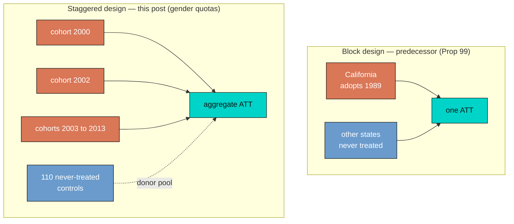

### 1.1 Learning objectives

By the end of this tutorial you will be able to:

- **Explain** why staggered adoption breaks naive TWFE difference-in-differences, and how per-cohort SDID avoids the forbidden-comparison problem.
- **Derive** the SDID estimator from first principles — unit weights $\omega$, time weights $\lambda$, and the weighted two-way fixed-effects objective — and the rule that aggregates cohort-specific effects $\hat{\tau}\_a$ into one overall ATT.
- **Estimate** the effect of gender quotas with `sdid` on a staggered panel, add a covariate two different ways (`optimized` vs `projected`), and choose among bootstrap, jackknife, and placebo inference.
- **Read** an SDID event-study plot produced by `sdid_event`, distinguishing pre-trend placebo coefficients from post-period dynamic effects.

## 2. Key concepts at a glance

Each card gives a plain-language **definition**, a concrete **example** from this quota study, and an everyday **analogy**. Open any term that is unfamiliar.

<details>
<summary><b>1. ATT (average treatment effect on the treated)</b> — the question we actually answer.</summary>

**Definition.** The effect of adopting a quota on the women-in-parliament share, *in the countries that adopted one*, averaged over their post-adoption years. It is not the effect a quota would have everywhere — only where one was actually tried.

**Example.** Our headline ATT is **+8.0 percentage points**: across the nine adopting countries, quotas raised women's parliamentary share by about eight points relative to their no-quota counterfactual.

**Analogy.** Like asking "how much did the patients who *took* the drug improve?" — not "how much would everyone improve?" You measure only the units that were actually treated.
</details>

<details>
<summary><b>2. Synthetic control</b> — a made-to-order comparison country.</summary>

**Definition.** A weighted blend of never-treated "donor" countries, built so its pre-adoption path mimics the treated cohort. It stands in for the unobservable counterfactual: what the cohort's outcome *would* have been without a quota.

**Example.** The 2002 cohort's synthetic control mixes dozens of donors (Belgium, Paraguay, Cuba, …) so that, before 2002, the blend tracks the cohort's trend — then keeps going as the cohort would have without the law.

**Analogy.** A stunt double cast to match the lead actor's build and movement — close enough that, in the shots you cannot film the star, the double stands in convincingly.
</details>

<details>
<summary><b>3. Unit weights (ω)</b> — how much each donor counts.</summary>

**Definition.** Non-negative weights, one per donor country, summing to one, that build the synthetic control. Each cohort gets its own ω.

**Example.** In the 2000 cohort, 80 donors receive nonzero weight — Argentina ≈ 0.061, Guatemala ≈ 0.057, Austria ≈ 0.045 — a *diffuse* blend rather than one or two stand-ins.

**Analogy.** A recipe calling for many ingredients in small, precise amounts: no single one dominates, so the dish survives a bad batch of any one ingredient.
</details>

<details>
<summary><b>4. Time weights (λ)</b> — which "before" years matter.</summary>

**Definition.** Non-negative weights on the pre-adoption years, summing to one, that decide which pre-periods define the baseline. They up-weight the years most like the post-period.

**Example.** For the 2002 cohort, λ concentrates on the late 1990s and 2001 rather than spreading evenly across 1990–2001 — the recent past is the relevant baseline.

**Analogy.** Forecasting tomorrow's weather, you trust last week far more than the same date five years ago. Time weights formalize "recent and similar counts more."
</details>

<details>
<summary><b>5. Adoption cohort (a)</b> — units that switch on together.</summary>

**Definition.** The set of countries that first adopt a quota in the same calendar year. Staggered SDID runs one self-contained SDID per cohort, always against the never-treated controls.

**Example.** There are seven cohorts — 2000, 2002, 2003, 2005, 2010, 2012, 2013 — with two countries each in 2002 and 2003, and one in the rest.

**Analogy.** School graduating classes: the "class of 2002" and the "class of 2010" share a start date and are analyzed as groups, even though all attend the same school.
</details>

<details>
<summary><b>6. Staggered adoption &amp; the forbidden comparison</b> — why the naive regression breaks.</summary>

**Definition.** Staggered adoption means units are treated at different times. The hazard: a two-way fixed-effects regression can use *already-treated* units as controls for *later* adopters — a "forbidden comparison" that places negative weights on some effects and can flip the sign.

**Example.** When the 2012 cohort adopts, a naive TWFE quietly treats the 2002 cohort — already treated, already changed — as part of its control group. Staggered SDID never does this: each cohort is compared only to the 110 never-treated countries.

**Analogy.** Timing a late runner against runners who already crossed the line and slowed to a walk — your "control" is contaminated because it has already run the race.
</details>

<details>
<summary><b>7. Event time (relative period)</b> — every cohort on its own clock.</summary>

**Definition.** Time measured relative to each cohort's *own* adoption year (… −2, −1, 0, +1 …), so cohorts that adopted in different calendar years can be lined up and averaged.

**Example.** Event time 0 is the year 2000 for the first cohort but 2013 for the last; re-centring lets us ask "what happens three years *after* a quota?" across all cohorts at once.

**Analogy.** Comparing marathon runners by their own start gun, not the wall clock: a runner who started at 9:05 and one who started at 9:20 are both "at mile 10" measured from their own start.
</details>

<details>
<summary><b>8. ATT aggregation</b> — from many cohort effects to one number.</summary>

**Definition.** The overall ATT is a weighted average of the cohort effects, each weighted by its share of treated unit-by-post-period observations — earlier, longer-exposed, larger cohorts count more.

**Example.** The seven cohort effects span **−3.5 to +21.8**; weighted by treated country-years they average to **+8.0** (the plain unweighted mean would be ≈ 7.0).

**Analogy.** A course grade that weights the final exam more than a pop quiz: the cohorts you observe for longer carry more of the final mark.
</details>

<details>
<summary><b>9. Pre-trend placebo test</b> — the assumption you can see.</summary>

**Definition.** Event-study coefficients for the *pre-adoption* periods. If treated and synthetic-control countries moved in parallel before treatment, these sit near zero — a falsification check.

**Example.** For the 2002 cohort, all twelve pre-period placebos fall in **[−0.2, +0.8]** points — flat, so we cannot reject parallel synthetic trends.

**Analogy.** Checking a scale by weighing nothing first: if it does not read zero when empty, you distrust every later reading. Flat placebos are that "reads zero when empty" check.
</details>

<details>
<summary><b>10. Bootstrap, jackknife, placebo</b> — three rulers for uncertainty.</summary>

**Definition.** Three ways to attach a standard error to the ATT. With many treated units all three are available; they share one point estimate but report different spread.

**Example.** On the two-cohort subsample the ATT is **10.3** for all three, but the SE is **4.7** (bootstrap), **6.0** (jackknife, most conservative), and **2.3** (placebo, tightest).

**Analogy.** Measuring a table with a tape, a folding ruler, and a laser: they agree on the length but disagree on the error bars — the cautious carpenter reports the widest.
</details>

## 3. The data: gender quotas across 119 countries

We use `quota_example.dta`, the balanced panel from Bhalotra, Clarke, Gomes & Venkataramani (2023) distributed with the `sdid` package. The outcome is the percentage of seats held by women in the national parliament; the treatment is the adoption of a reserved-seat gender quota; the covariate is log GDP per capita.

```stata
webuse set www.damianclarke.net/stata/
webuse quota_example, clear
label variable quota "Parliamentary gender quota"
xtset country year
codebook country year quota womparl lngdp, compact
```

```text
Variable    Obs Unique      Mean     Min       Max  Label
----------------------------------------------------------------------------
country    3094    119         .       .         .  Country
year       3094     26    2002.5    1990      2015  Year
quota      3094      2  .0303814       0         1  =1 if country has a gender quota
womparl    3094    449  14.96531       0      63.8  Women in parliament
lngdp      2990   2956  9.154291  5.8701  11.61789  log(GDP)
----------------------------------------------------------------------------
```

The panel is **balanced**: 119 countries times 26 years equals 3,094 observations, with no gaps in the outcome or treatment (`lngdp` has 104 missing values, which will matter only when we add the covariate). The treatment indicator `quota` equals one for just 3% of observations, a reminder that treated country-years are scarce. Crucially, `quota` is **absorbing** — once a country adopts a quota it stays treated — which SDID requires.

| Variable | Role | Symbol | Description |
|---|---|---|---|
| `country` | unit | $i$ | 119 countries (9 ever-treated, 110 never-treated) |
| `year` | time | $t$ | 1990–2015 (26 years) |
| `womparl` | outcome | $Y\_{it}$ | % women in the national parliament |
| `quota` | treatment | $W\_{it}$ | 1 once a country has a quota, 0 before / never |
| `lngdp` | covariate | $X\_{it}$ | log GDP per capita |

**The estimand.** Our target is the **average treatment effect on the treated (ATT)**: the effect of adopting a quota on the women-in-parliament share *in the countries that adopted one*, averaged over their post-adoption years. Formally,

$$
\tau = \frac{1}{N\_{tr}\\, T\_{post}} \sum\_{i:\\, W\_i = 1}\ \sum\_{t > T\_{pre}} \left[\\, Y\_{it}(1) - Y\_{it}(0) \\,\right]
$$

In words: for every treated country and every post-adoption year, take the gap between the share of women *with* a quota, $Y\_{it}(1)$, and the share that *would have occurred without one*, $Y\_{it}(0)$ — then average. The first term is observed; the second is the counterfactual that the synthetic control must impute, because we never see a quota-adopting country in the parallel world where it abstained.

**An observational, not experimental, setting.** Quotas are not randomly assigned. Countries that adopt them early may differ systematically — they may be wealthier, more democratic, or already on a rising trajectory of women's representation. That is exactly why we need a method that builds a *credible counterfactual* from comparison countries rather than assuming a simple before/after change would have held. Identification rests on assumptions we will keep visible: that treated and synthetic-control countries share a **common (synthetic) trend** absent treatment, **no anticipation** of the quota, **no spillovers** across countries, and that adoption timing is not itself driven by the outcome's future path.

### 3.1 The staggered structure

Before modelling, let us see the timing directly. The adoption year is the first year a country is treated; we tabulate the cohorts.

```stata
bysort country (year): egen firsttreat = min(cond(quota==1, year, .))
preserve
    keep country firsttreat
    duplicates drop
    tab firsttreat, missing
restore
```

```text
 firsttreat |      Freq.     Percent        Cum.
------------+-----------------------------------
       2000 |          1        0.84        0.84
       2002 |          2        1.68        2.52
       2003 |          2        1.68        4.20
       2005 |          1        0.84        5.04
       2010 |          1        0.84        5.88
       2012 |          1        0.84        6.72
       2013 |          1        0.84        7.56
          . |        110       92.44      100.00
------------+-----------------------------------
      Total |        119      100.00
```

Nine countries adopt a quota, spread across **seven cohorts**; the 2002 and 2003 cohorts contain two countries each, the rest one. The remaining **110 countries are never treated** — they form the donor pool from which every cohort's synthetic control is built. This staircase of adoption dates is the defining feature of a staggered design, and the reason a single "post" dummy is too blunt.

## 4. Exploratory analysis with `panelview`

A staggered design is best understood by *looking* at it. The `panelview` command (Xu & Hua) draws two pictures we need: a heatmap of *who is treated when*, and the raw outcome trajectories colored by treatment status.

```stata
ssc install panelview, replace
panelview womparl quota, i(country) t(year) type(treat) bytiming
panelview womparl quota, i(country) t(year) type(outcome)
```

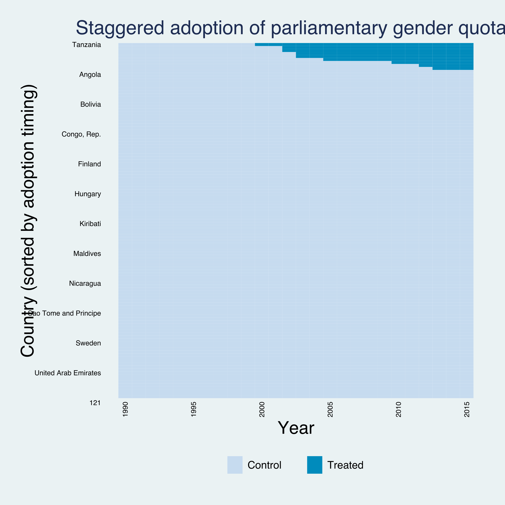

The treatment heatmap (`type(treat)`, sorted with `bytiming`) makes the staggered structure unmistakable: the dark treated cells appear in the **top-right corner as a staircase**, each step a different cohort switching on between 2000 and 2013, against a sea of never-treated controls. This is the visual opposite of a block design, where every treated cell would switch on in the same column.

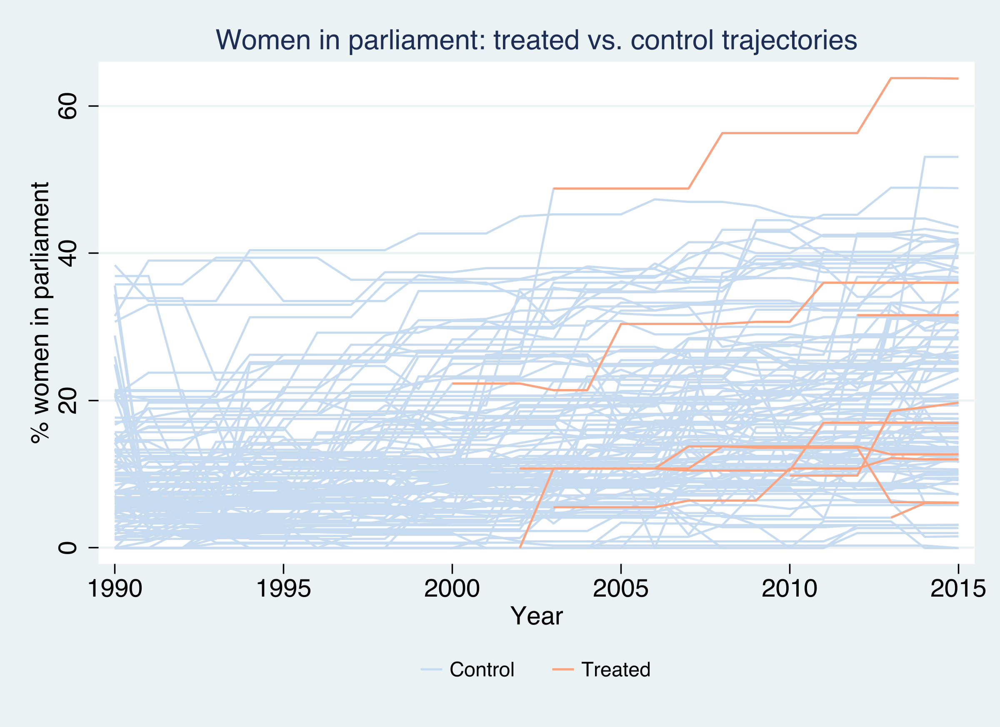

The outcome plot (`type(outcome)`) overlays all 119 women-in-parliament series, with the 9 treated countries in orange. Several treated countries start near the bottom of the distribution and climb steeply after their adoption year — a hint of a positive effect — but the climbs begin at different times, and a few treated countries barely move. No single "treated average" line could summarize this; we need cohort-specific counterfactuals.

```stata
collapse (mean) womparl, by(evertreat year)
* ... reshape and plot ever- vs never-adopting means ...
```

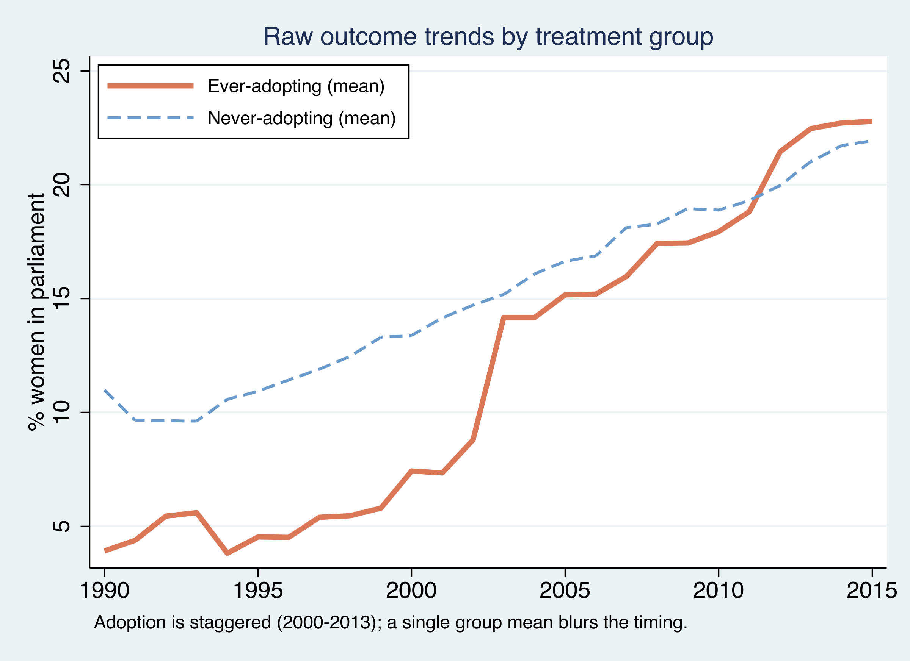

Collapsing to group means tells a cautionary tale. The ever-adopting countries (orange) start the 1990s **below** the never-adopting countries (about 4% vs 10% women in parliament) and end **above** them by 2015 (about 23% vs 22%). A naive eyeball difference-in-differences on these two lines would be badly confounded: the groups began at different levels and the "treated" line aggregates countries that switched on in seven different years. The raw means motivate the machinery to come — we must compare each cohort to a *tailored* synthetic control, not to the grand average.

## 5. Synthetic difference-in-differences from first principles

Before tackling staggered timing, fix ideas with a single cohort. SDID (Arkhangelsky et al., 2021) is a **weighted two-way fixed-effects regression**. It chooses an ATT, a constant, unit fixed effects, and time fixed effects to minimize a weighted sum of squared residuals:

$$
\left(\hat{\tau}, \hat{\mu}, \hat{\alpha}, \hat{\beta}\right) = \arg\min\_{\tau,\mu,\alpha,\beta} \sum\_{i=1}^{N} \sum\_{t=1}^{T} \left(Y\_{it} - \mu - \alpha\_i - \beta\_t - W\_{it}\\,\tau\right)^{2}\\, \hat{\omega}\_i\\, \hat{\lambda}\_t
$$

In words: run a difference-in-differences regression, but weight each observation by a **unit weight** $\hat{\omega}\_i$ times a **time weight** $\hat{\lambda}\_t$. Here $\alpha\_i$ is a country fixed effect, $\beta\_t$ a year fixed effect, $W\_{it}$ the treatment dummy, and $\tau$ the ATT we want. Set all weights equal and you recover ordinary DiD; the weights are what make SDID special. They are not free parameters — each solves its own optimization.

The **unit weights** are chosen so that a weighted blend of control countries tracks the treated cohort across the pre-period:

$$
\hat{\omega} = \arg\min\_{\omega\_0,\\, \omega \ge 0} \sum\_{t=1}^{T\_{pre}} \left(\omega\_0 + \sum\_{i=1}^{N\_{co}} \omega\_i\\, Y\_{it} - \frac{1}{N\_{tr}} \sum\_{i=1}^{N\_{tr}} Y\_{it}\right)^{2} + \zeta^{2}\\, T\_{pre}\\, \lVert \omega \rVert^{2}
$$

The bracketed term asks the synthetic control $\sum\_i \omega\_i Y\_{it}$ (plus an intercept $\omega\_0$) to match the treated average in every pre-adoption year. The intercept $\omega\_0$ is the SDID twist: it lets the synthetic match the treated *trend* without matching its *level*, because any constant level gap is later absorbed by the unit fixed effect $\alpha\_i$. The final term is a **ridge penalty** with regularization strength $\zeta$; it spreads weight across many donors instead of concentrating it on a few, which stabilizes the estimate. (Synthetic control, by contrast, drops $\omega\_0$ and the penalty and must match the level too.)

The **time weights** are the mirror image — they pick the pre-period years that best predict each control country's post-period average:

$$
\hat{\lambda} = \arg\min\_{\lambda\_0,\\, \lambda \ge 0} \sum\_{i=1}^{N\_{co}} \left(\lambda\_0 + \sum\_{t=1}^{T\_{pre}} \lambda\_t\\, Y\_{it} - \frac{1}{T\_{post}} \sum\_{t=T\_{pre}+1}^{T} Y\_{it}\right)^{2} + \zeta\_{\lambda}^{2}\\, N\_{co}\\, \lVert \lambda \rVert^{2}
$$

Years that look most like the post-period get the most weight, so the "before" comparison is built from the most relevant history rather than a flat average over possibly-irrelevant early years. The two weighting schemes together are what distinguish SDID from its cousins, as the table summarizes.

| Method | Unit weights $\omega$ | Time weights $\lambda$ | Unit FE $\alpha\_i$ | Must match |
|---|---|---|---|---|
| **DiD** | uniform | uniform | yes | trend on *all* controls |
| **Synthetic control** | optimized | uniform | **no** | level *and* trend |
| **SDID** | optimized | optimized | yes | trend (level gap allowed) |

## 6. The staggered extension: per-cohort effects and their aggregation

Staggered SDID is a disarmingly simple idea: **do the single-cohort analysis once per adoption cohort, then average.** For each cohort $a$, take only that cohort's treated countries plus the pure never-treated controls, solve the SDID problem above on that sub-panel to get its own $\hat{\omega}\_a$, $\hat{\lambda}\_a$, and cohort effect $\hat{\tau}\_a$. Because each cohort is compared **only to never-treated controls**, an already-treated unit is never used as a control for a later adopter — precisely the contamination that breaks naive TWFE.

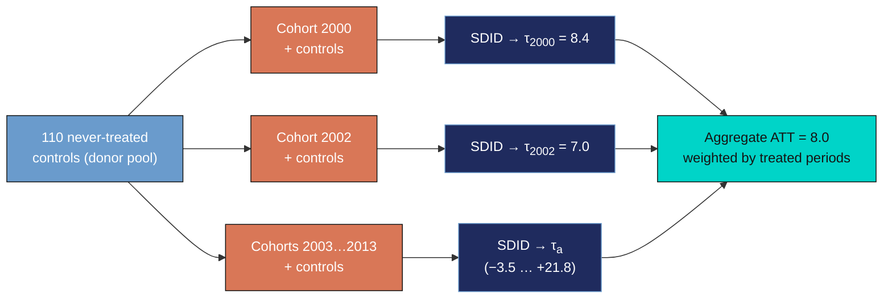

The overall ATT aggregates the cohort effects with **non-negative** weights equal to each cohort's share of treated unit-by-post-period observations:

$$
\widehat{ATT} = \sum\_{a \in \mathcal{A}} \frac{N\_{tr}^{a}\\, T\_{post}^{a}}{\sum\_{b \in \mathcal{A}} N\_{tr}^{b}\\, T\_{post}^{b}}\ \hat{\tau}\_a
$$

In words: a cohort counts in proportion to how many treated country-years it contributes. The 2000 cohort, treated for 16 years (2000–2015), carries more weight than the 2013 cohort, treated for only 3. This is the staggered generalization of single-cohort SDID, and — unlike TWFE — every weight is positive and interpretable. (When each cohort has one treated unit, this reduces to the post-period share $T\_{post}^{a}/T\_{post}$ from Clarke et al., 2024.)

## 7. Estimation in Stata

One command does the whole staggered procedure. We request bootstrap inference and a fixed seed for reproducibility.

```stata
sdid womparl country year quota, vce(bootstrap) seed(1213)
matrix list e(tau)
```

```text
Synthetic Difference-in-Differences Estimator

-----------------------------------------------------------------------------
     womparl |     ATT     Std. Err.     t      P>|t|    [95% Conf. Interval]
-------------+---------------------------------------------------------------
       quota |   8.03410    3.74040     2.15    0.032     0.70305    15.36516
-----------------------------------------------------------------------------
```

The overall **ATT is +8.03 percentage points** (SE 3.74, $t=2.15$, $p=0.032$), with a 95% confidence interval of [0.70, 15.37] that excludes zero. Substantively: adopting a parliamentary gender quota raises the share of women in parliament by about **eight percentage points** in the adopting countries — a large effect against a sample mean of 15%, and statistically distinguishable from no effect at the 5% level.

The single number, though, is the average of a very heterogeneous set of cohort effects, returned in `e(tau)`:

```text
T[7,3]
           Tau    Std.Err.        Time
r1   8.3888685   .68278345        2000
r2   6.9677465   .64102999        2002
r3   13.952256   9.1289943        2003
r4  -3.4505431   .75603453        2005
r5   2.7490355   .44799502        2010
r6   21.762716   .91589982        2012
r7  -.82032354   .83151601        2013
```

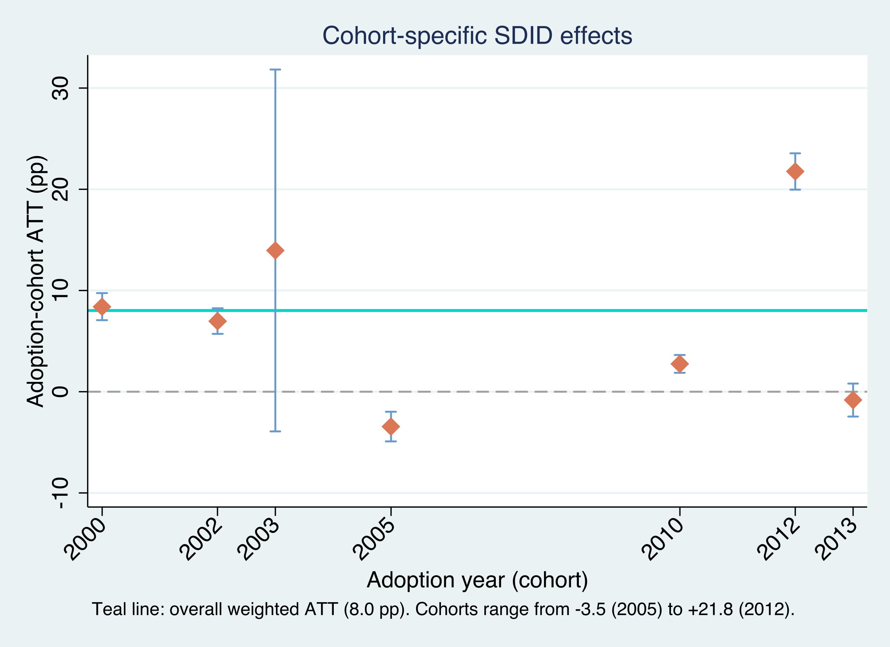

The cohort effects span an enormous range: from **−3.5 points** (2005 cohort) to **+21.8 points** (2012 cohort), with the 2003 cohort essentially uninformative (SE 9.13, a confidence interval that runs from −4 to +32). The teal line marks the aggregate ATT of 8.0. Notice that this aggregate is **not** the simple average of the seven cohort effects — that average would be about 7.0. It is the *treated-period-weighted* average from the aggregation formula, which up-weights the earlier, longer-exposed 2000, 2002, and 2003 cohorts. The lesson of the figure is that "+8 points on average" is a summary of real heterogeneity, not a universal constant; some quotas were transformative, others did nothing measurable.

To see the synthetic-control machinery underneath one cohort, the figure below plots the 2002 cohort against its synthetic control. Because SDID matches the pre-period *trend* and lets the unit fixed effect absorb the *level* gap, we anchor the synthetic to the treated cohort by its $\lambda$-weighted pre-period gap so the two align before adoption.

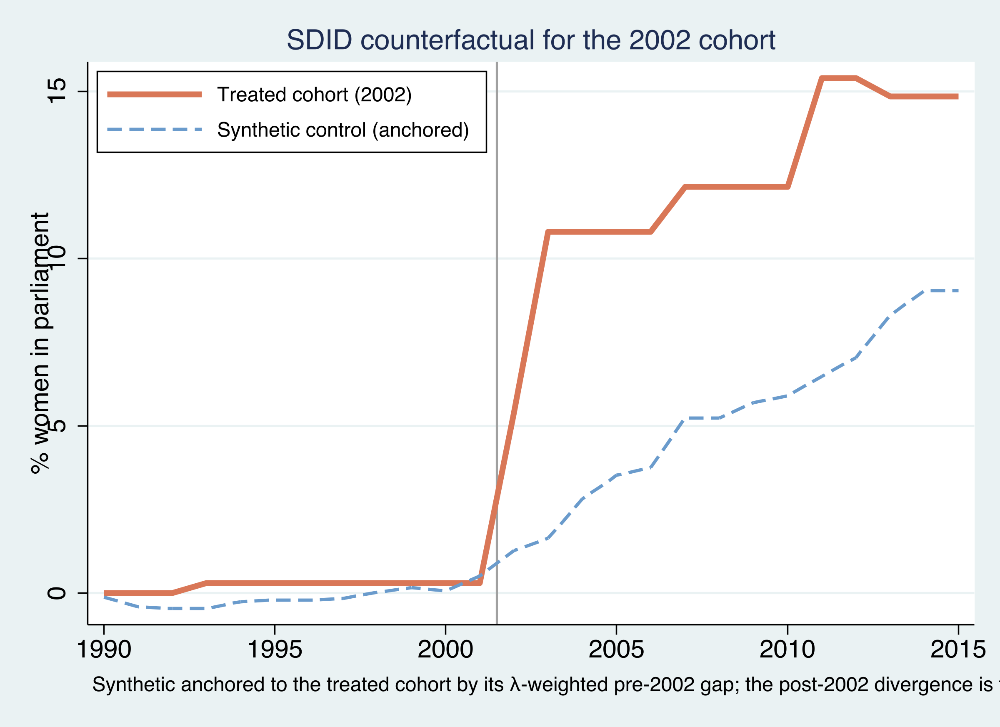

The treated 2002 cohort (orange) and its anchored synthetic control (blue dashed) track each other closely **before 2002** — the synthetic was built precisely to do so — and then diverge: the treated cohort climbs to roughly 15% women in parliament while the synthetic counterfactual reaches only about 9–10%. That post-2002 gap is the cohort effect, about +7 points, matching $\hat{\tau}\_{2002}=6.97$ from `e(tau)`.

Which pre-period years anchor that comparison? The time weights $\hat{\lambda}\_t$ for the 2002 cohort do not spread evenly over 1990–2001 — they concentrate on the years just before adoption.

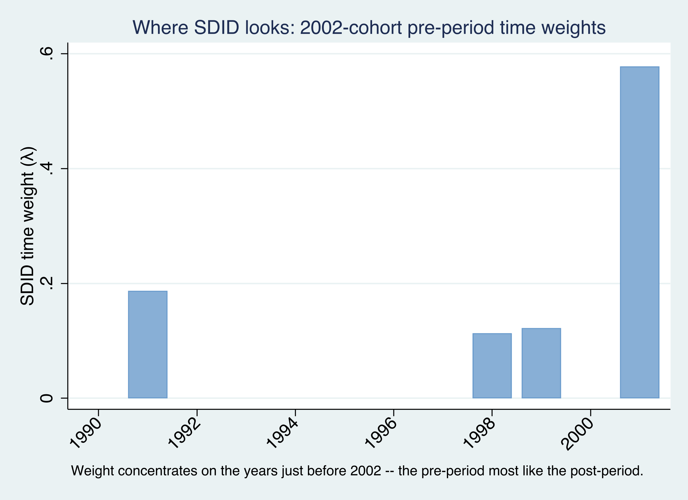

The bars show SDID's baseline for the 2002 cohort leaning on the late 1990s and 2001 — the pre-adoption years whose level most resembles the post-adoption period — rather than weighting all twelve pre-years equally as a plain difference-in-differences would. This is the time-weighting half of SDID at work: it builds the "before" from the most relevant history, which is also the baseline the event study below measures against.

## 8. Adding a covariate: optimized vs projected

Does the quota effect simply reflect economic development — richer countries both grow GDP and elect more women? We can condition on log GDP per capita. The `sdid` command offers two routes, and SDID needs a balanced panel, so we first drop the country-years with missing `lngdp`.

```stata
drop if missing(lngdp)
sdid womparl country year quota, vce(bootstrap) seed(2022) covariates(lngdp, optimized)
sdid womparl country year quota, vce(bootstrap) seed(1213) covariates(lngdp, projected)
```

```text
SDID + lngdp (optimized) ATT = 8.0515  SE = 3.0466
SDID + lngdp (projected) ATT = 8.0593  SE = 3.1191
```

The two methods differ in *how* they estimate the covariate's coefficient. The **optimized** method (Arkhangelsky et al., 2021) folds the covariate adjustment into the SDID optimization itself, estimating it jointly with the weights — flexible but computationally heavy. The **projected** method (Kranz, 2022) instead regresses the outcome on the covariate among the *untreated* observations first, then runs SDID on the residuals — much faster and numerically more stable. Reassuringly, here they agree to the second decimal: **8.05 and 8.06**, essentially unchanged from the no-covariate estimate of 8.03. Controlling for income does **not** explain away the quota effect; the result is robust to the most obvious confounder.

## 9. The event study with `sdid_event`

A single ATT — even per cohort — cannot tell us *when* the effect appears, or whether treated and control countries were already diverging *before* the quota. For that we need an **event study**: the treatment effect traced out by years relative to adoption. The modern `sdid_event` command (Ciccia, Clarke & Pailañir, 2024) computes exactly this for SDID, including pre-period **placebo** estimates that serve as a parallel-trends test.

The dynamic effect at event time $\ell$ is the treated-minus-synthetic gap in that period, *net of the same gap at baseline*, where — characteristically for SDID — the baseline is the $\lambda$-weighted pre-period average rather than a single "year −1":

$$
\delta\_{\ell} = \left(\bar{Y}\_{\ell}^{\,tr} - \bar{Y}\_{\ell}^{\,co}\right) - \left(\bar{Y}\_{base}^{\,tr} - \bar{Y}\_{base}^{\,co}\right), \qquad \bar{Y}\_{base}^{\,g} = \sum\_{t=1}^{T\_{pre}} \hat{\lambda}\_t\\, \bar{Y}\_t^{\,g}
$$

`sdid_event` handles the full staggered panel directly, returning a cohort-aggregated ATT plus dynamic effects. To read the dynamics transparently we focus the *plot* on the 2002 cohort — the package authors' own worked example — which gives a clean event-time axis; the full-panel call confirms the same aggregated ATT (≈ 8.06).

```stata
ssc install sdid_event, replace
* full staggered panel: aggregated ATT + cohort-aggregated dynamic effects
sdid_event womparl country year quota, vce(bootstrap) brep(100) effects(8) placebo(5) covariates(lngdp)
* clean event study on the 2002 cohort, with all placebos
keep if quotaYear==2002 | quotaYear==.
sdid_event womparl country year quota, vce(placebo) brep(100) placebo(all) covariates(lngdp)
```

```text
             |  Estimate         SE      LB CI      UB CI  Switchers
-------------+------------------------------------------------------
         ATT |  6.853472   3.372744   .2428928   13.46405          2
    Effect_1 |  4.086404   1.191517    1.75103   6.421778          2
    Effect_2 |  9.164442   1.522799   6.179756   12.14913          2
    Effect_3 |  7.938504   2.182572   3.660663   12.21635          2
       ...   |
   Placebo_1 | -.218417   .470226   -1.14006    .703227          2
   Placebo_2 |  .242148   .884557   -1.491584   1.975880          2
       ...   |
```

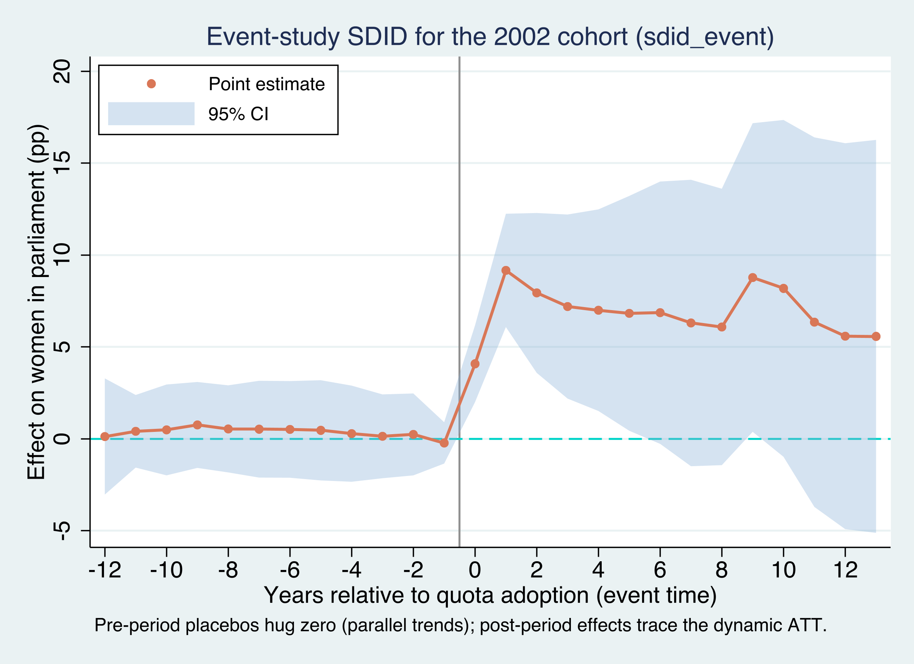

This plot rewards careful reading, and there are three things to look for.

**First, the baseline is $\lambda$-weighted, not "the year before."** Unlike a textbook event study that normalizes to $t=-1$, SDID measures everything against the optimally weighted pre-period average. That is why the zero line is a *weighted* baseline; do not read it as the single pre-adoption year.

**Second, the points to the *left* of zero are placebo tests.** Every pre-adoption coefficient (`Placebo_1` through `Placebo_12`, event times −1 to −12) sits within a whisker of zero — ranging only from about −0.2 to +0.8. Because the treated cohort and its synthetic control moved in parallel *before* 2002, we cannot reject that the parallel-(synthetic-)trends assumption holds. This is the identifying assumption made visible and, here, survived.

**Third, the points to the *right* of zero are the dynamic ATT.** The effect appears immediately at adoption (`Effect_1` = +4.1 points at event time 0), roughly doubles within a year or two (`Effect_2` = +9.2), and then settles in the +6 to +9 range for over a decade. Quotas do not just shift the level once; they sustain a higher share of women in parliament. Aggregated by the same treated-period logic as before, these dynamic effects reproduce the cohort's overall ATT of about +7 points — but the plot shows the *shape* the single number conceals.

## 10. Inference: bootstrap, jackknife, and placebo

With one treated unit (California), the previous tutorial could only use placebo/permutation inference. With **nine** treated units here, all three of `sdid`'s variance estimators are on the table. To keep the comparison clean — jackknife needs more than one treated unit *per adoption period* — we follow Clarke et al. (2024) and restrict to the two-country 2002 and 2003 cohorts by dropping the five single-country cohorts.

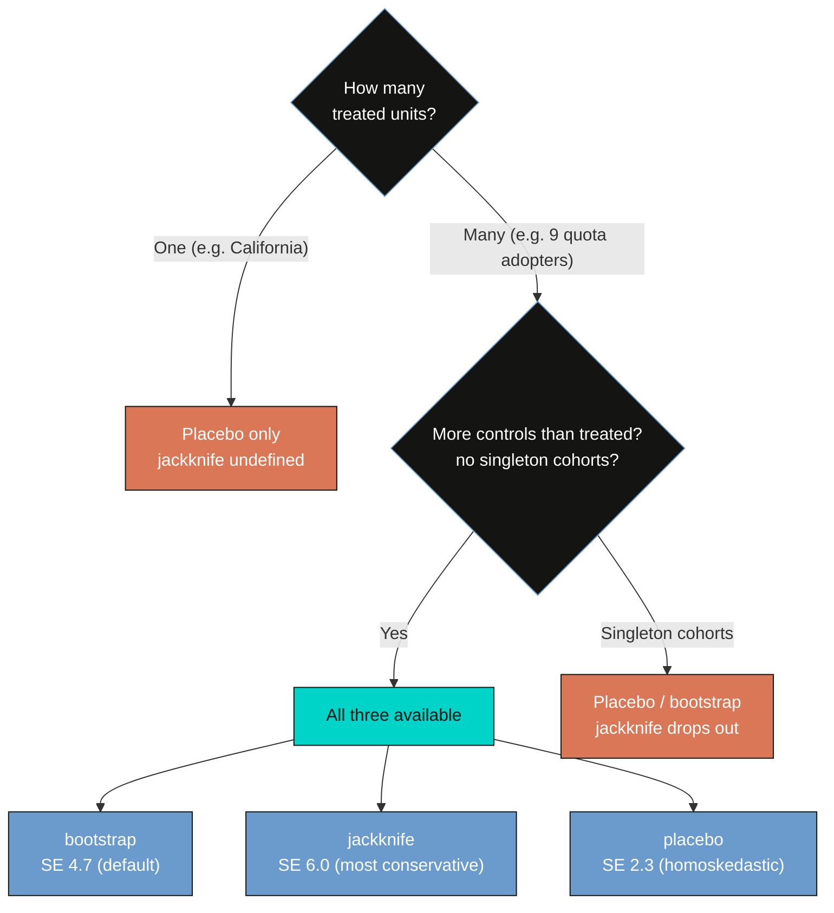

```stata
drop if inlist(country,"Algeria","Kenya","Samoa","Swaziland","Tanzania")
sdid womparl country year quota, vce(bootstrap) seed(1213)
sdid womparl country year quota, vce(placebo)   seed(1213)
sdid womparl country year quota, vce(jackknife)
```

```text
method      att        se      ci_l     ci_u
bootstrap   10.33066   4.7291   1.0618   19.5995
placebo     10.33066   2.3404   5.7436   14.9178
jackknife   10.33066   6.0056  -1.4401   22.1014
```

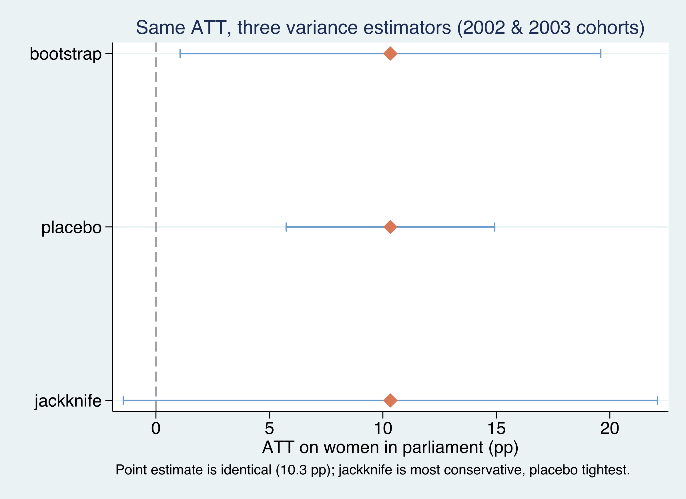

The point estimate is **identical** across all three methods — 10.33 points on this subsample — because the inference procedure changes only the *standard error*, never the estimate. But the standard errors differ by a factor of nearly three: **jackknife is the most conservative** (SE 6.01, a confidence interval that crosses zero), **placebo is the tightest** (SE 2.34) but rests on a homoskedasticity assumption and requires more controls than treated units, and **bootstrap sits in between** (SE 4.73) and is the default. The practical takeaway: with only a handful of treated units, report the bootstrap as your headline but cross-check it — a result that is "significant" under placebo but not under jackknife deserves caution. (The subsample ATT of 10.3 is larger than the full-sample 8.0 because dropping the five single-country cohorts discards the negative 2005 and 2013 effects.)

## 11. Robustness and discussion

Three caveats keep the result honest. **Effect concentration:** the +8 aggregate leans heavily on a few cohorts — the 2012 cohort alone contributes a +21.8 effect, and the early 2000/2002/2003 cohorts carry most of the aggregation weight. Drop the 2012 cohort and the average falls noticeably. **Fragile counterfactuals:** with only 110 controls and as few as one treated country per cohort, some synthetic controls are imprecise — the 2003 cohort's standard error of 9.13 is the tell. **Identifying assumptions:** SDID still requires no anticipation, an absorbing treatment, no cross-country spillovers, and that quota timing is not itself a response to the outcome's trajectory; the flat event-study placebos support, but cannot prove, the parallel-trends part. Finally, `quota_example` is a teaching subset of Bhalotra et al. (2023); these numbers illustrate the *method*, not a final verdict on quota policy.

## 12. Summary and key takeaways

- **Method.** Staggered SDID estimates a *separate, clean* synthetic difference-in-differences for each adoption cohort — comparing it only to never-treated controls — and aggregates the cohort effects $\hat{\tau}\_a$ with non-negative, treated-period-share weights. This avoids the negative-weighting trap that contaminates naive two-way fixed-effects DiD under staggered timing.
- **Result.** Gender quotas raise the share of women in parliament by an overall **ATT of +8.0 percentage points** (SE 3.74, $p=0.032$), robust to a log-GDP control (8.05 optimized, 8.06 projected). Cohort effects range widely, from **−3.5 to +21.8 points** — heterogeneity the single number hides.
- **Event study.** The `sdid_event` plot shows pre-adoption placebo coefficients near zero (parallel synthetic trends) and post-adoption effects that appear immediately and persist for over a decade — the dynamics behind the average.
- **Inference.** With nine treated units, bootstrap, jackknife, and placebo are all available; they share one point estimate (10.3 on the two-cohort illustration) but report standard errors of 4.7, 6.0, and 2.3. Jackknife is the most conservative.
- **Bridge.** The block design (Proposition 99, the [previous tutorial](/post/stata_sdid/)) and the staggered design here are two faces of one estimator — the staggered version is just single-cohort SDID, done once per cohort and averaged.

## 13. Exercises

1. **Re-aggregate by hand.** Pull `e(tau)` and each cohort's treated unit-count and post-period length. Verify that the treated-period-weighted average of the seven $\hat{\tau}\_a$ reproduces the overall ATT of 8.03, and show that it differs from the unweighted mean (≈ 7.0). Which cohorts move the aggregate the most?
2. **Inference sensitivity.** Re-run the full nine-country sample with `vce(bootstrap)` and then `vce(placebo)` at `reps(500)`. How much do the standard error and confidence interval move, and which would you report given only nine treated units?
3. **Drop the outlier cohort.** Re-estimate the overall ATT excluding the 2012 cohort (the +21.8 outlier). How far does the aggregate fall, and what does that tell you about how concentrated the average effect is?

## 14. References

1. Arkhangelsky, D., Athey, S., Hirshberg, D. A., Imbens, G. W., & Wager, S. (2021). [Synthetic Difference-in-Differences](https://doi.org/10.1257/aer.20190159). *American Economic Review*, 111(12), 4088–4118.
2. Clarke, D., Pailañir, D., Athey, S., & Imbens, G. (2024). [On Synthetic Difference-in-Differences and Related Estimation Methods in Stata](https://doi.org/10.1177/1536867X241297184). *The Stata Journal*, 24(4). Package: `ssc install sdid`.
3. Ciccia, D. (2024). [A Short Note on Event-Study Synthetic Difference-in-Differences Estimators](https://arxiv.org/abs/2407.09565). Package: `ssc install sdid_event`.
4. Bhalotra, S., Clarke, D., Gomes, J. F., & Venkataramani, A. (2023). [Maternal Mortality and Women's Political Power](https://doi.org/10.1093/jeea/jvad043). *Journal of the European Economic Association*. (Source of the `quota_example` data.)
5. Goodman-Bacon, A. (2021). [Difference-in-Differences with Variation in Treatment Timing](https://doi.org/10.1016/j.jeconom.2021.03.014). *Journal of Econometrics*, 225(2), 254–277.
6. de Chaisemartin, C., & D'Haultfœuille, X. (2020). [Two-Way Fixed Effects Estimators with Heterogeneous Treatment Effects](https://doi.org/10.1257/aer.20181169). *American Economic Review*, 110(9), 2964–2996.
7. Xu, Y., & Hua, L. [panelView: Visualizing Panel Data](https://yiqingxu.org/packages/panelview_stata/). Package: `ssc install panelview`.

*Related tutorials on this site:* [Synthetic Difference-in-Differences (the block design)](/post/stata_sdid/) · [Difference-in-Differences](/post/stata_did/).

## 15. Acknowledgments

This tutorial uses the `sdid` command (Clarke, Pailañir, Athey & Imbens), the `sdid_event` command (Ciccia, Clarke & Pailañir), and `panelview` (Xu & Hua). The data, `quota_example`, is distributed with `sdid` and draws on Bhalotra, Clarke, Gomes & Venkataramani (2023). All estimates were produced by the companion `analysis.do` and verified against Clarke et al. (2024). AI tools (Claude Code) assisted with drafting and figure preparation; all code was executed and every number checked by the author.

---

<style>
.podcast-overlay {
  display: none;
  position: fixed;
  bottom: 0;
  left: 0;
  right: 0;
  z-index: 9999;
  animation: podSlideUp 0.35s ease-out;
}
@keyframes podSlideUp {
  from { transform: translateY(100%); }
  to { transform: translateY(0); }
}
.podcast-overlay.pod-closing {
  animation: podSlideDown 0.3s ease-in forwards;
}
@keyframes podSlideDown {
  from { transform: translateY(0); }
  to { transform: translateY(100%); }
}
.podcast-container {
  background: linear-gradient(135deg, #1a1a2e 0%, #16213e 100%);
  padding: 18px 24px 20px;
  font-family: -apple-system, BlinkMacSystemFont, 'Segoe UI', Roboto, sans-serif;
  box-shadow: 0 -4px 32px rgba(0,0,0,0.5);
  border-top: 1px solid rgba(106,155,204,0.2);
}
.podcast-inner {
  max-width: 800px;
  margin: 0 auto;
}
.podcast-top-row {
  display: flex;
  align-items: center;
  gap: 14px;
  margin-bottom: 14px;
}
.podcast-icon {
  width: 42px;
  height: 42px;
  background: linear-gradient(135deg, #d97757, #e8956a);
  border-radius: 10px;
  display: flex;
  align-items: center;
  justify-content: center;
  flex-shrink: 0;
}
.podcast-icon svg {
  width: 22px;
  height: 22px;
  fill: #fff;
}
.podcast-title-block {
  flex: 1;
  min-width: 0;
}
.podcast-title-block h4 {
  margin: 0 0 1px 0;
  color: #f0ece2;
  font-size: 14px;
  font-weight: 600;
  letter-spacing: 0.02em;
  white-space: nowrap;
  overflow: hidden;
  text-overflow: ellipsis;
}
.podcast-title-block span {
  color: #8b9dc3;
  font-size: 11px;
}
.podcast-close-btn {
  background: none;
  border: none;
  cursor: pointer;
  padding: 6px;
  border-radius: 50%;
  display: flex;
  align-items: center;
  justify-content: center;
  transition: background 0.2s;
  flex-shrink: 0;
}
.podcast-close-btn:hover {
  background: rgba(255,255,255,0.1);
}
.podcast-close-btn svg {
  width: 20px;
  height: 20px;
  fill: #8b9dc3;
}
.podcast-progress-wrap {
  margin-bottom: 12px;
}
.podcast-time-row {
  display: flex;
  justify-content: space-between;
  font-size: 11px;
  color: #8b9dc3;
  margin-bottom: 5px;
  font-variant-numeric: tabular-nums;
}
.podcast-bar-bg {
  width: 100%;
  height: 6px;
  background: rgba(255,255,255,0.1);
  border-radius: 3px;
  cursor: pointer;
  position: relative;
  overflow: hidden;
  transition: height 0.15s;
}
.podcast-bar-buffered {
  position: absolute;
  top: 0;
  left: 0;
  height: 100%;
  background: rgba(106,155,204,0.25);
  border-radius: 3px;
  transition: width 0.3s;
}
.podcast-bar-progress {
  position: absolute;
  top: 0;
  left: 0;
  height: 100%;
  background: linear-gradient(90deg, #6a9bcc, #00d4c8);
  border-radius: 3px;
  transition: width 0.1s linear;
}
.podcast-bar-bg:hover {
  height: 10px;
  margin-top: -2px;
}
.podcast-controls-row {
  display: flex;
  align-items: center;
  justify-content: space-between;
}
.podcast-transport {
  display: flex;
  align-items: center;
  gap: 8px;
}
.podcast-btn {
  background: none;
  border: none;
  cursor: pointer;
  padding: 4px;
  display: flex;
  align-items: center;
  justify-content: center;
  border-radius: 50%;
  transition: all 0.2s;
}
.podcast-btn svg {
  fill: #c8d0e0;
  transition: fill 0.2s;
}
.podcast-btn:hover svg {
  fill: #f0ece2;
}
.podcast-btn-skip {
  position: relative;
}
.podcast-btn-skip span {
  position: absolute;
  font-size: 7px;
  font-weight: 700;
  color: #c8d0e0;
  top: 50%;
  left: 50%;
  transform: translate(-50%, -50%);
  pointer-events: none;
  margin-top: 1px;
}
.podcast-btn-play {
  width: 48px;
  height: 48px;
  background: linear-gradient(135deg, #d97757, #e8956a);
  border-radius: 50%;
  box-shadow: 0 3px 12px rgba(217,119,87,0.4);
  transition: all 0.2s;
}
.podcast-btn-play:hover {
  transform: scale(1.08);
  box-shadow: 0 5px 20px rgba(217,119,87,0.5);
}
.podcast-btn-play svg {
  fill: #fff;
  width: 22px;
  height: 22px;
}
.podcast-extras {
  display: flex;
  align-items: center;
  gap: 10px;
}
.podcast-volume-wrap {
  display: flex;
  align-items: center;
  gap: 5px;
}
.podcast-volume-wrap svg {
  fill: #8b9dc3;
  width: 16px;
  height: 16px;
  cursor: pointer;
  flex-shrink: 0;
}
.podcast-volume-wrap svg:hover {
  fill: #c8d0e0;
}
.podcast-volume-slider {
  -webkit-appearance: none;
  appearance: none;
  width: 60px;
  height: 4px;
  background: rgba(255,255,255,0.12);
  border-radius: 2px;
  outline: none;
  cursor: pointer;
}
.podcast-volume-slider::-webkit-slider-thumb {
  -webkit-appearance: none;
  appearance: none;
  width: 12px;
  height: 12px;
  background: #6a9bcc;
  border-radius: 50%;
  cursor: pointer;
}
.podcast-speed-btn {
  background: rgba(255,255,255,0.08);
  border: 1px solid rgba(255,255,255,0.12);
  color: #c8d0e0;
  font-size: 11px;
  font-weight: 600;
  padding: 3px 9px;
  border-radius: 12px;
  cursor: pointer;
  transition: all 0.2s;
  font-family: inherit;
  min-width: 40px;
  text-align: center;
}
.podcast-speed-btn:hover {
  background: rgba(106,155,204,0.2);
  border-color: #6a9bcc;
  color: #f0ece2;
}
.podcast-download-btn {
  background: none;
  border: 1px solid rgba(255,255,255,0.12);
  border-radius: 8px;
  padding: 4px 10px;
  cursor: pointer;
  display: flex;
  align-items: center;
  gap: 4px;
  color: #8b9dc3;
  font-size: 11px;
  font-family: inherit;
  text-decoration: none;
  transition: all 0.2s;
}
.podcast-download-btn:hover {
  border-color: #6a9bcc;
  color: #f0ece2;
  background: rgba(106,155,204,0.1);
}
.podcast-download-btn svg {
  width: 14px;
  height: 14px;
  fill: currentColor;
}
@media (max-width: 600px) {
  .podcast-container { padding: 14px 16px 16px; }
  .podcast-volume-wrap { display: none; }
  .podcast-title-block h4 { font-size: 13px; }
  .podcast-extras { gap: 8px; }
}
</style>

<div class="podcast-overlay" id="podOverlay">
<div class="podcast-container">
<div class="podcast-inner">
  <audio id="podAudio" preload="none" src="https://files.catbox.moe/iea7xk.m4a"></audio>

  <div class="podcast-top-row">
    <div class="podcast-icon">
      <svg viewBox="0 0 24 24"><path d="M12 1a5 5 0 0 0-5 5v4a5 5 0 0 0 10 0V6a5 5 0 0 0-5-5zm0 16a7 7 0 0 1-7-7H3a9 9 0 0 0 8 8.94V22h2v-3.06A9 9 0 0 0 21 10h-2a7 7 0 0 1-7 7z"/></svg>
    </div>
    <div class="podcast-title-block">
      <h4>AI Podcast: Staggered Synthetic Difference-in-Differences</h4>
      <span id="podDurationLabel">Click play to load</span>
    </div>
    <button class="podcast-close-btn" onclick="podClose()" title="Close player">
      <svg viewBox="0 0 24 24"><path d="M19 6.41L17.59 5 12 10.59 6.41 5 5 6.41 10.59 12 5 17.59 6.41 19 12 13.41 17.59 19 19 17.59 13.41 12z"/></svg>
    </button>
  </div>

  <div class="podcast-progress-wrap">
    <div class="podcast-time-row">
      <span id="podCurrent">0:00</span>
      <span id="podDuration">0:00</span>
    </div>
    <div class="podcast-bar-bg" id="podBarBg" onclick="podSeek(event)">
      <div class="podcast-bar-buffered" id="podBuffered"></div>
      <div class="podcast-bar-progress" id="podProgress"></div>
    </div>
  </div>

  <div class="podcast-controls-row">
    <div class="podcast-transport">
      <button class="podcast-btn podcast-btn-skip" onclick="podSkip(-15)" title="Back 15s">
        <svg width="26" height="26" viewBox="0 0 24 24"><path d="M12 5V1L7 6l5 5V7c3.31 0 6 2.69 6 6s-2.69 6-6 6-6-2.69-6-6H4c0 4.42 3.58 8 8 8s8-3.58 8-8-3.58-8-8-8z"/></svg>
        <span>15</span>
      </button>
      <button class="podcast-btn podcast-btn-play" id="podPlayBtn" onclick="podToggle()" title="Play">
        <svg id="podIconPlay" viewBox="0 0 24 24"><path d="M8 5v14l11-7z"/></svg>
        <svg id="podIconPause" viewBox="0 0 24 24" style="display:none"><path d="M6 19h4V5H6v14zm8-14v14h4V5h-4z"/></svg>
      </button>
      <button class="podcast-btn podcast-btn-skip" onclick="podSkip(15)" title="Forward 15s">
        <svg width="26" height="26" viewBox="0 0 24 24"><path d="M12 5V1l5 5-5 5V7c-3.31 0-6 2.69-6 6s2.69 6 6 6 6-2.69 6-6h2c0 4.42-3.58 8-8 8s-8-3.58-8-8 3.58-8 8-8z"/></svg>
        <span>15</span>
      </button>
    </div>
    <div class="podcast-extras">
      <div class="podcast-volume-wrap">
        <svg id="podVolIcon" onclick="podMute()" viewBox="0 0 24 24"><path d="M3 9v6h4l5 5V4L7 9H3zm13.5 3A4.5 4.5 0 0 0 14 8.5v7a4.47 4.47 0 0 0 2.5-3.5zM14 3.23v2.06a6.51 6.51 0 0 1 0 13.42v2.06A8.51 8.51 0 0 0 14 3.23z"/></svg>
        <input type="range" class="podcast-volume-slider" id="podVolume" min="0" max="1" step="0.05" value="0.8">
      </div>
      <button class="podcast-speed-btn" id="podSpeedBtn" onclick="podCycleSpeed()" title="Playback speed">1x</button>
      <a class="podcast-download-btn" href="https://files.catbox.moe/iea7xk.m4a" target="_blank" rel="noopener" title="Stream">
        <svg viewBox="0 0 24 24"><path d="M19 9h-4V3H9v6H5l7 7 7-7zM5 18v2h14v-2H5z"/></svg>
      </a>
    </div>
  </div>
</div>
</div>
</div>

<script>
(function(){
  var overlay = document.getElementById('podOverlay');
  var a = document.getElementById('podAudio');
  var speeds = [0.75, 1, 1.25, 1.5, 2];
  var si = 1;
  var opened = false;
  function fmt(s){
    if(isNaN(s)) return '0:00';
    var m=Math.floor(s/60), sec=Math.floor(s%60);
    return m+':'+(sec<10?'0':'')+sec;
  }
  document.addEventListener('click', function(e){
    var link = e.target.closest('a.btn-page-header');
    if(!link) return;
    var text = link.textContent.trim();
    if(text.indexOf('AI Podcast') === -1) return;
    e.preventDefault();
    e.stopPropagation();
    overlay.style.display = 'block';
    overlay.classList.remove('pod-closing');
    if(!opened){
      a.preload = 'metadata';
      a.load();
      opened = true;
    }
  });
  a.volume = 0.8;
  a.addEventListener('loadedmetadata', function(){
    document.getElementById('podDuration').textContent = fmt(a.duration);
    document.getElementById('podDurationLabel').textContent = fmt(a.duration) + ' minutes';
  });
  a.addEventListener('timeupdate', function(){
    document.getElementById('podCurrent').textContent = fmt(a.currentTime);
    var pct = a.duration ? (a.currentTime/a.duration)*100 : 0;
    document.getElementById('podProgress').style.width = pct+'%';
  });
  a.addEventListener('progress', function(){
    if(a.buffered.length>0){
      var pct = (a.buffered.end(a.buffered.length-1)/a.duration)*100;
      document.getElementById('podBuffered').style.width = pct+'%';
    }
  });
  a.addEventListener('ended', function(){
    document.getElementById('podIconPlay').style.display='';
    document.getElementById('podIconPause').style.display='none';
  });
  window.podToggle = function(){
    if(a.paused){a.play();document.getElementById('podIconPlay').style.display='none';document.getElementById('podIconPause').style.display='';}
    else{a.pause();document.getElementById('podIconPlay').style.display='';document.getElementById('podIconPause').style.display='none';}
  };
  window.podSkip = function(s){a.currentTime = Math.max(0,Math.min(a.duration||0,a.currentTime+s));};
  window.podSeek = function(e){
    var rect = document.getElementById('podBarBg').getBoundingClientRect();
    var pct = (e.clientX - rect.left)/rect.width;
    a.currentTime = pct * (a.duration||0);
  };
  window.podMute = function(){
    a.muted = !a.muted;
    document.getElementById('podVolume').value = a.muted ? 0 : a.volume;
  };
  window.podCycleSpeed = function(){
    si = (si+1) % speeds.length;
    a.playbackRate = speeds[si];
    document.getElementById('podSpeedBtn').textContent = speeds[si]+'x';
  };
  window.podClose = function(){
    overlay.classList.add('pod-closing');
    setTimeout(function(){ overlay.style.display='none'; }, 300);
    a.pause();
    document.getElementById('podIconPlay').style.display='';
    document.getElementById('podIconPause').style.display='none';
  };
  document.getElementById('podVolume').addEventListener('input', function(){
    a.volume = this.value;
    a.muted = false;
  });
  if(window.location.hash === '#podcast-player'){
    overlay.style.display = 'block';
    a.preload = 'metadata';
    a.load();
    opened = true;
  }
})();
</script>
