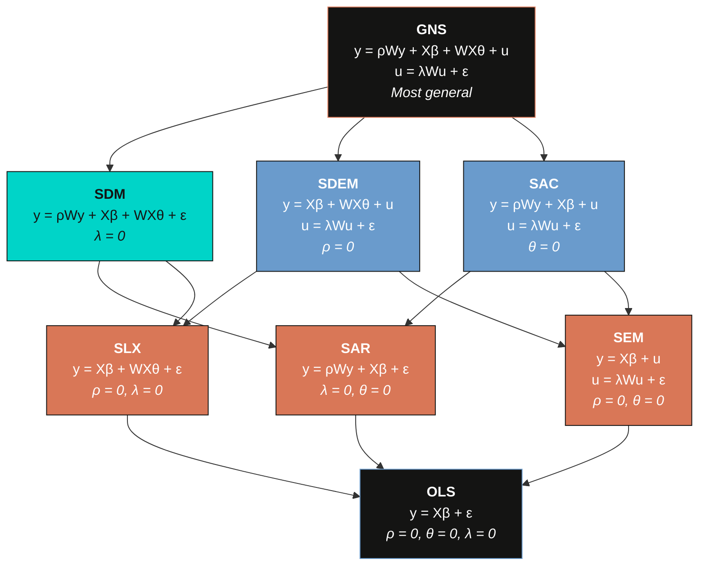
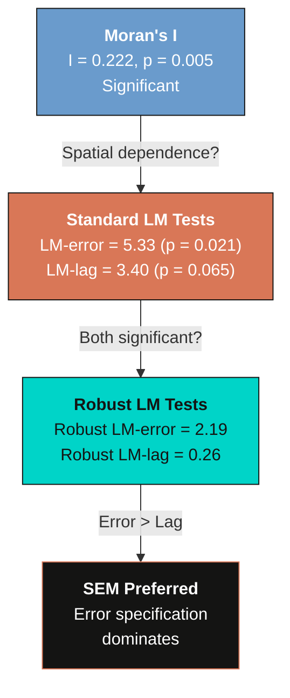
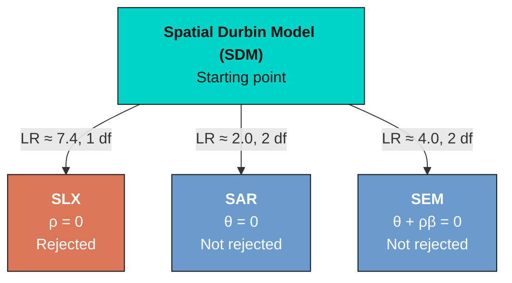

---
authors:
  - admin
categories:
  - Stata
  - Spatial Spillovers
draft: false
featured: false
date: "2023-12-01T00:00:00Z"
external_link: ""
image:
  caption: ""
  focal_point: Smart
  placement: 3
links:
- icon: open-data
  icon_pack: ai
  name: "[Stata] Google Colab"
  url: https://colab.research.google.com/drive/1P8apVk4SwJdlVMAoKXu9H8PLsukA2QI2?usp=sharing
- icon: file-code
  icon_pack: fas
  name: "Stata do-file"
  url: analysis.do
- icon: file-alt
  icon_pack: fas
  name: "Stata log"
  url: analysis.log
slides:
summary: Explore the full taxonomy of cross-sectional spatial models --- OLS, SAR, SEM, SLX, SDM, SDEM, SAC, and GNS --- using the Columbus crime dataset in Stata
tags:
- stata
- spatial
- regional
- spatial spillovers
title: "Cross-Sectional Spatial Regression in Stata: Crime in Columbus Neighborhoods"
url_code: ""
url_pdf: ""
url_slides: ""
url_video: ""
toc: true
diagram: true
---

## 1. Overview

Crime does not stop at neighborhood boundaries. A neighborhood's crime rate may depend not only on its own socioeconomic conditions but also on conditions in adjacent areas --- through spatial displacement (criminals move to easier targets nearby), diffusion (criminal networks operate across borders), and shared exposure to common risk factors. Standard regression models that treat each neighborhood as an independent observation miss these **spatial spillovers**, potentially producing biased estimates of how income and housing values affect crime.

This tutorial introduces the **complete taxonomy of cross-sectional spatial regression models** --- from a simple OLS baseline through the most general GNS (General Nesting Spatial) specification. Using the classic Columbus crime dataset, we progressively estimate eight models: OLS, SAR, SEM, SLX, SDM, SDEM, SAC, and GNS. Each model captures spatial dependence through a different combination of three channels: the spatial lag of the dependent variable ($\rho Wy$), the spatial lag of the explanatory variables ($WX\theta$), and the spatial lag of the error term ($\lambda Wu$). We use **Wald specification tests** from the SDM to determine which simpler model the data supports, and compare all models using AIC.

The Columbus crime dataset contains 49 neighborhoods in Columbus, Ohio, with data on residential burglaries and vehicle thefts per 1,000 households (CRIME), household income in \\$1,000 (INC), and housing value in \\$1,000 (HOVAL). The spatial weight matrix is a Queen contiguity matrix --- two neighborhoods are neighbors if they share a common border or vertex --- row-standardized so that the spatial lag of a variable equals the weighted average among a neighborhood's neighbors. All estimation uses Stata's official `spregress` command (available since Stata 15), which implements maximum likelihood estimation for the full family of cross-sectional spatial models.

> Mendez, C. (2021). *Spatial econometrics for cross-sectional data in Stata.* DOI: [10.5281/zenodo.5151076](https://doi.org/10.5281/zenodo.5151076)

### Learning objectives

- Construct and load a Queen contiguity spatial weight matrix in Stata using `spmatrix fromdata`
- Test for spatial autocorrelation using Moran's I and LM tests
- Estimate the full taxonomy of spatial models (SAR, SEM, SLX, SDM, SDEM, SAC, GNS) using `spregress`
- Decompose coefficient estimates into direct, indirect (spillover), and total effects using `estat impact`
- Use Wald tests to determine whether the SDM simplifies to SAR, SLX, or SEM
- Compare models using AIC and choose the most appropriate specification

---

## 2. The spatial model taxonomy

The eight models in this tutorial form a nested hierarchy. At the top sits the **GNS** (General Nesting Spatial) model, which includes all three spatial channels simultaneously. Each intermediate model imposes one or more restrictions, and OLS sits at the bottom with no spatial terms at all. Understanding this nesting structure is essential for model selection --- we estimate from the general to the specific, using statistical tests to determine whether restrictions are warranted.



The diagram shows three spatial channels and their corresponding parameters: $\rho$ (spatial lag of $y$), $\theta$ (spatial lag of $X$), and $\lambda$ (spatial lag of the error). Setting any of these to zero yields a nested model. The SDM is often the starting point for model selection because it nests the three most common models --- SAR, SLX, and SEM --- and the restrictions can be tested with standard Wald tests.

---

## 3. Setup and data loading

Before running any spatial models, we need the `estout` package for table output and the `spatwmat`/`spatdiag` packages for LM diagnostic tests. If you have not installed them, uncomment the `ssc install` and `net install` lines below.

```stata
clear all
macro drop _all
set more off

* Install packages (uncomment if needed)
*ssc install estout, replace
*net install st0085_2, from(http://www.stata-journal.com/software/sj14-2)
```

### 3.1 Spatial weight matrix

The spatial weight matrix **W** defines the neighborhood structure among the 49 Columbus neighborhoods. We use a Queen contiguity matrix where two neighborhoods are neighbors if they share a common border or vertex. The matrix is stored in a `.dta` file and converted to an `spmatrix` object with row-standardization --- meaning that each row sums to one, so the spatial lag of a variable equals the **weighted average** among a neighborhood's neighbors.

```stata
* Load Queen contiguity W matrix
use "https://github.com/quarcs-lab/data-open/raw/master/Columbus/columbus/Wqueen_fromStata_spmat.dta", clear
gen id = _n
order id, first
spset id
spmatrix fromdata W = v*, normalize(row) replace
spmatrix summarize W
```

```text
Spatial-weighting matrix W
  Dimensions:    49 x 49
  Stored type:   dense
  Normalization: row

                    Summary statistics
  -------------------------------------------
                 Min     Mean      Max      N
  -------------------------------------------
  Nonzero       .0625    .2049    .5000    236
  All           .0000    .0042    .5000   2401
  -------------------------------------------
```

The `spmatrix fromdata` command reads the columns of the loaded dataset and stores them as a spatial weight matrix object named `W`. The `normalize(row)` option applies row-standardization, and `replace` overwrites any existing matrix with the same name. The matrix has 236 nonzero entries out of 2,401 total cells, meaning the average neighborhood has approximately $236 / 49 \approx 4.8$ neighbors.

> **Note:** The companion `analysis.do` file uses the longer name `WqueenS_fromStata15` for the spatial weight matrix to match the original Colab notebook. In this tutorial, we use the shorter name `W` for readability. Both names are interchangeable --- only the name passed to `spmatrix fromdata` matters.

### 3.2 Generating spatial lags of X

Before loading the crime data, we pre-compute the spatial lags of the explanatory variables ($W \cdot INC$ and $W \cdot HOVAL$) using Mata. These spatial lags represent each neighborhood's **neighbors' average** income and housing value, and will be used as explicit regressors in the SLX, SDM, SDEM, and GNS models.

```stata
* Load data and generate spatial lags of X manually
use "https://github.com/quarcs-lab/data-open/raw/master/Columbus/columbus/columbusDbase.dta", clear
spset id

label var CRIME "Crime"
label var INC   "Income"
label var HOVAL "House value"

* Compute W*X using Mata (bypasses spregress ivarlag)
mata: spmatrix_matafromsp(W_mata, id_vec, "W")
mata: st_view(inc=., ., "INC")
mata: st_view(hoval=., ., "HOVAL")
gen double W_INC = .
gen double W_HOVAL = .
mata: st_store(., "W_INC", W_mata * inc)
mata: st_store(., "W_HOVAL", W_mata * hoval)
label var W_INC   "W * Income"
label var W_HOVAL "W * House value"
```

> **Why compute W*X manually?** Stata's `spregress` command provides the `ivarlag()` option to include spatial lags of explanatory variables. However, this option may produce incorrect coefficient signs in some Stata versions. Computing $WX$ explicitly using Mata and including the result as a regular regressor is more transparent and produces results consistent with Elhorst (2014) and PySAL's `spreg` package.

### 3.3 Summary statistics

```stata
summarize CRIME INC HOVAL
```

```text
    Variable |        Obs        Mean    Std. dev.       Min        Max
-------------+---------------------------------------------------------
       CRIME |         49    35.1288     16.5647      .1783    68.8920
         INC |         49    14.3765      5.7575      3.7240   27.8966
       HOVAL |         49    38.4362     18.4661      5.0000   96.4000
```

### 3.4 Variables

| Variable | Description | Mean | Std. Dev. |
|----------|-------------|------|-----------|
| `CRIME` | Residential burglaries and vehicle thefts per 1,000 households | 35.13 | 16.56 |
| `INC` | Household income (\\$1,000) | 14.38 | 5.76 |
| `HOVAL` | Housing value (\\$1,000) | 38.44 | 18.47 |

Mean crime is 35.13 incidents per 1,000 households, with substantial variation across neighborhoods (standard deviation of 16.56, ranging from near zero to 68.89). Mean household income is \\$14,380 and mean housing value is \\$38,440. The wide range of both income (\\$3,724 to \\$27,897) and housing value (\\$5,000 to \\$96,400) reflects the considerable socioeconomic heterogeneity across Columbus neighborhoods, providing sufficient variation to estimate the effects of these variables on crime.

---

## 4. OLS baseline and spatial diagnostics

### 4.1 OLS regression

Before introducing any spatial structure, we estimate a standard OLS regression of crime on income and housing value. This provides a non-spatial benchmark against which all subsequent models will be compared.

```stata
regress CRIME INC HOVAL
eststo OLS

estat ic
mat s = r(S)
quietly estadd scalar AIC = s[1,5]
```

```text
      Source |       SS           df       MS      Number of obs   =        49
-------------+----------------------------------   F(2, 46)        =     28.39
       Model |  5765.1588         2  2882.5794   Prob > F        =    0.0000
    Residual |  4670.9753        46  101.5429   R-squared       =    0.5524
-------------+----------------------------------   Adj R-squared   =    0.5330
       Total |  10436.1341        48  217.4194   Root MSE        =   10.0769

------------------------------------------------------------------------------
       CRIME | Coefficient  Std. err.      t    P>|t|     [95% conf. interval]
-------------+----------------------------------------------------------------
         INC |  -1.5973     .3341     -4.78   0.000    -2.2699    -.9247
       HOVAL |  -0.2739     .1032     -2.65   0.011    -0.4817    -.0661
       _cons |  68.6190     4.7355    14.49   0.000     59.0876    78.1504
------------------------------------------------------------------------------
```

OLS estimates that each additional \\$1,000 in household income is associated with a reduction of **1.60 crimes** per 1,000 households, and each additional \\$1,000 in housing value is associated with a reduction of **0.27 crimes**. Both coefficients are statistically significant, and the model explains about **55%** of the variation in crime rates across neighborhoods (R-squared = 0.552). The intercept of 68.62 represents the predicted crime rate for a hypothetical neighborhood with zero income and zero housing value. However, OLS assumes that crime in one neighborhood is independent of conditions in adjacent neighborhoods --- an assumption we now test directly.

### 4.2 Moran's I test

Moran's I is the most widely used test for spatial autocorrelation. Applied to OLS residuals, it tests whether the residuals in nearby neighborhoods are more similar (positive spatial autocorrelation) or more dissimilar (negative spatial autocorrelation) than expected under spatial independence. The test statistic is:

$$I = \frac{N}{S\_0} \cdot \frac{e' W e}{e' e}$$

where $e$ is the vector of OLS residuals, $W$ is the row-standardized spatial weight matrix, $N$ is the number of observations, and $S\_0$ is the sum of all elements of $W$. Under the null hypothesis of no spatial autocorrelation, $I$ follows an approximately standard normal distribution after standardization.

```stata
regress CRIME INC HOVAL
estat moran, errorlag(W)
```

```text
Moran test for spatial autocorrelation in the error

H0: Error is i.i.d.

      I     =    0.2222
  E(I)      =   -0.0208
  Mean       =   -0.0208
  Sd(I)      =    0.0856

  z          =    2.8391
  p-value    =    0.0045
```

Moran's I is **0.222** with a z-statistic of **2.84** (p = 0.005), providing strong evidence of **positive spatial autocorrelation** in the OLS residuals. Neighborhoods with high unexplained crime tend to cluster near other neighborhoods with high unexplained crime, and vice versa. This violates the OLS assumption of independent errors and motivates the use of spatial regression models. The positive sign of Moran's I is consistent with crime diffusion --- criminal activity in one neighborhood spills over into adjacent areas.

### 4.3 LM tests for spatial specification

While Moran's I confirms the presence of spatial autocorrelation, it does not indicate the **form** of the spatial dependence. The Lagrange Multiplier (LM) tests proposed by Anselin (1988) test separately for the spatial lag ($\rho Wy$) and spatial error ($\lambda Wu$) specifications. The robust versions of these tests remain valid even when the alternative specification is also present.

```stata
* Create compatible W matrix for spatdiag
spatwmat using "https://github.com/quarcs-lab/data-open/raw/master/Columbus/columbus/Wqueen_fromStata_spmat.dta", ///
  name(Wcompat) eigenval(eWcompat) standardize

quietly regress CRIME INC HOVAL
spatdiag, weights(Wcompat)
```

```text
Spatial error:
    Moran's I =     0.2055         Prob =   0.0068

    Lagrange multiplier =     5.3282         Prob =   0.0210
    Robust LM =     2.1901         Prob =   0.1389

Spatial lag:
    Lagrange multiplier =     3.3954         Prob =   0.0654
    Robust LM =     0.2572         Prob =   0.6121
```

The standard LM test for the spatial error ($\lambda$) is significant at the 5% level (LM = **5.33**, p = 0.021), while the standard LM test for the spatial lag ($\rho$) is marginally significant at the 10% level (LM = **3.40**, p = 0.065). The robust tests provide further guidance: the robust LM-error is **2.19** (p = 0.139) and the robust LM-lag is only **0.26** (p = 0.612).

Following the Anselin (2005) decision rule --- compare the standard LM tests first, then use the robust tests to break ties --- the evidence favors the **SEM** specification. The standard LM-error is larger and more significant than the standard LM-lag, and the robust LM-error remains larger than the robust LM-lag. The decision tree below summarizes this logic. However, as we will see, the full model taxonomy reveals a more nuanced picture.



---

## 5. First-generation spatial models

### 5.1 SAR (Spatial Autoregressive / Spatial Lag)

The SAR model adds a spatial lag of the dependent variable to the OLS specification. It assumes that crime in a neighborhood depends directly on the crime rate in adjacent neighborhoods --- a "contagion" or "diffusion" channel where high crime in one area breeds crime in neighboring areas.

$$y = \rho W y + X \beta + \varepsilon$$

The parameter $\rho$ measures the strength of this spatial feedback. Because $Wy$ is endogenous (it depends on $y$, which depends on $\varepsilon$), OLS estimation would be inconsistent. We use maximum likelihood estimation via `spregress`.

```stata
spregress CRIME INC HOVAL, ml dvarlag(W)
eststo SAR

estat ic
mat s = r(S)
quietly estadd scalar AIC = s[1,5]
```

```text
Spatial autoregressive model                     Number of obs   =         49
                                                 Wald chi2(2)    =      53.11
Log-likelihood = -182.392                        Prob > chi2     =     0.0000

------------------------------------------------------------------------------
       CRIME | Coefficient  Std. err.      z    P>|z|     [95% conf. interval]
-------------+----------------------------------------------------------------
CRIME        |
         INC |  -1.0310     .3067     -3.36   0.001    -1.6321    -.4299
       HOVAL |  -0.2656     .0914     -2.91   0.004    -0.4447    -.0865
       _cons |  45.0723     7.2510      6.22   0.000    30.8606    59.2841
-------------+----------------------------------------------------------------
W            |
       CRIME |   0.4309     .1171      3.68   0.000     0.2014     0.6604
------------------------------------------------------------------------------
```

The spatial autoregressive parameter $\rho$ is **0.431** (z = 3.68, p < 0.001), indicating substantial positive spatial dependence. After accounting for the spatial lag, the own income coefficient drops to **-1.03** (from -1.60 in OLS), while the housing value coefficient remains similar at **-0.27**. The reduction in the income coefficient suggests that part of what OLS attributed to income was actually capturing spatial spillover effects that are now absorbed by $\rho$.

However, the raw coefficients in the SAR model do not have the same interpretation as OLS coefficients because the spatial lag creates a **feedback loop**: a change in income in one neighborhood affects its crime, which affects its neighbors' crime, which feeds back to the original neighborhood. The proper interpretation requires decomposing effects into direct, indirect, and total components.

```stata
estat impact
```

```text
                           Coefficient  Std. err.      z    P>|z|
-------------------------------------------------------------------
INC
              Direct       |  -1.0837     .3131     -3.46   0.001
            Indirect       |  -0.6789     .3487     -1.95   0.052
               Total       |  -1.7626     .5497     -3.21   0.001
-------------------------------------------------------------------
HOVAL
              Direct       |  -0.2792     .0938     -2.98   0.003
            Indirect       |  -0.1749     .0938     -1.86   0.062
               Total       |  -0.4541     .1621     -2.80   0.005
-------------------------------------------------------------------
```

The **direct effect** of income is -1.08, meaning that a \\$1,000 increase in a neighborhood's own income reduces its crime by 1.08 incidents per 1,000 households. The **indirect (spillover) effect** is -0.68, meaning that when all neighboring neighborhoods experience a \\$1,000 income increase, the focal neighborhood's crime drops by an additional 0.68 incidents through the spatial feedback channel. The **total effect** of income is -1.76, larger than the OLS estimate of -1.60, revealing that OLS slightly understates the total impact of income on crime.

### 5.2 SEM (Spatial Error Model)

The SEM assumes that spatial dependence operates through the error term rather than through a direct contagion channel. Spatially correlated unobservable factors --- such as local policing strategies, community organizations, or land use patterns --- generate correlated residuals across adjacent neighborhoods.

$$y = X \beta + u, \quad u = \lambda W u + \varepsilon$$

The parameter $\lambda$ measures the degree of spatial autocorrelation in the error term. Unlike the SAR, the SEM does not produce indirect (spillover) effects --- the spatial dependence is treated as a nuisance rather than a substantive economic channel.

```stata
spregress CRIME INC HOVAL, ml errorlag(W)
eststo SEM

estat ic
mat s = r(S)
quietly estadd scalar AIC = s[1,5]
```

```text
Spatial error model                              Number of obs   =         49
                                                 Wald chi2(2)    =      70.62
Log-likelihood = -181.568                        Prob > chi2     =     0.0000

------------------------------------------------------------------------------
       CRIME | Coefficient  Std. err.      z    P>|z|     [95% conf. interval]
-------------+----------------------------------------------------------------
CRIME        |
         INC |  -0.9413     .3329     -2.83   0.005    -1.5937    -.2888
       HOVAL |  -0.3025     .0908     -3.33   0.001    -0.4805    -.1245
       _cons |  59.6143     5.4048    11.03   0.000    49.0211    70.2075
-------------+----------------------------------------------------------------
W            |
       CRIME |   0.5622     .1405      4.00   0.000     0.2868     0.8376
------------------------------------------------------------------------------
```

The spatial error parameter $\lambda$ is **0.562** (z = 4.00, p < 0.001), confirming substantial spatial autocorrelation in the unobservables. The income coefficient is **-0.94**, further attenuated from the OLS estimate, and the housing value coefficient is **-0.30**, slightly larger in magnitude than OLS. The log-likelihood of -181.57 is higher than the SAR's -182.39, and the AIC of approximately **373** is slightly lower than the SAR's **374**, suggesting that the SEM provides a marginally better fit.

```stata
estat impact
```

```text
                           Coefficient  Std. err.      z    P>|z|
-------------------------------------------------------------------
INC
              Direct       |  -0.9413     .3329     -2.83   0.005
            Indirect       |   0.0000          .        .       .
               Total       |  -0.9413     .3329     -2.83   0.005
-------------------------------------------------------------------
HOVAL
              Direct       |  -0.3025     .0908     -3.33   0.001
            Indirect       |   0.0000          .        .       .
               Total       |  -0.3025     .0908     -3.33   0.001
-------------------------------------------------------------------
```

As expected, the SEM produces **zero indirect effects** by construction. In the SEM, spatial dependence is a nuisance in the error term, not a substantive spillover channel. The direct and total effects are identical. If one believes that crime spillovers are substantively important --- for example, through displacement or diffusion --- the SEM's assumption that all spatial dependence is in the errors is overly restrictive.

---

## 6. Models with spatial lags of X

### 6.1 SLX (Spatial Lag of X)

The SLX model includes spatial lags of the explanatory variables but no spatial lag of $y$ and no spatial error. It captures **local spillovers** --- the idea that a neighborhood's crime depends on its neighbors' income and housing values --- without the global feedback mechanism of the SAR.

$$y = X \beta + W X \theta + \varepsilon$$

The $\theta$ coefficients measure the direct impact of neighbors' characteristics on the focal neighborhood's crime. Unlike the SAR, the SLX does not generate a spatial multiplier --- the spillover effects are localized to immediate neighbors. Since the SLX has no spatial autoregressive or error component, it can be estimated by OLS with the pre-computed $W \cdot INC$ and $W \cdot HOVAL$ variables as additional regressors.

```stata
regress CRIME INC HOVAL W_INC W_HOVAL
eststo SLX

estat ic
mat s = r(S)
quietly estadd scalar AIC = s[1,5]
```

```text
      Source |       SS           df       MS      Number of obs   =        49
-------------+----------------------------------   F(4, 44)        =     17.24
       Model |  6373.4060         4  1593.35150   Prob > F        =    0.0000
    Residual |  4062.7281        44   92.33473   R-squared       =    0.6105
-------------+----------------------------------   Adj R-squared   =    0.5751
       Total |  10436.1341        48  217.4194   Root MSE        =   9.6090

------------------------------------------------------------------------------
       CRIME | Coefficient  Std. err.      t    P>|t|     [95% conf. interval]
-------------+----------------------------------------------------------------
         INC |  -1.1095     .3786     -2.93   0.005    -1.8725    -.3465
       HOVAL |  -0.2901     .1007     -2.88   0.006    -0.4930    -.0872
       W_INC |  -1.3712     .5601     -2.45   0.018    -2.5000    -.2424
     W_HOVAL |   0.1921     .2079      0.92   0.361    -0.2271     0.6113
       _cons |  74.5534     6.7157    11.10   0.000    61.0167    88.0901
------------------------------------------------------------------------------
```

The spatial lag of income ($W \cdot INC$) is **-1.37** and statistically significant (t = -2.45, p = 0.018), meaning that higher average income among a neighborhood's neighbors is associated with **lower** crime in the focal neighborhood. This is economically intuitive: neighborhoods surrounded by wealthier areas benefit from reduced crime, possibly through better public services, lower criminal opportunity, or social spillovers. The spatial lag of housing value ($W \cdot HOVAL$) is **+0.19** but statistically insignificant (p = 0.361). The own-variable coefficients are INC at **-1.11** and HOVAL at **-0.29**, both highly significant. The log-likelihood of -183.97 is higher than OLS (-187.38), and the LR-test of the SLX versus OLS is 6.81 with 2 df (critical value 5.99), meaning the OLS model needs to be rejected in favor of the SLX.

The direct and indirect effects in the SLX correspond directly to $\beta$ and $\theta$ because there is no spatial multiplier:

| | Direct | Indirect | Total |
|---------|--------|----------|-------|
| **INC** | -1.11*** | -1.37** | -2.48*** |
| **HOVAL** | -0.29*** | +0.19 | -0.10 |

The total effect of income is **-2.48**, much larger than the OLS estimate of -1.60, revealing that a substantial portion of the income effect operates through the neighbors' income channel. For housing value, the positive but insignificant indirect effect partially offsets the negative direct effect, suggesting that the crime-reducing effect of housing value is primarily a within-neighborhood phenomenon.

### 6.2 SDM (Spatial Durbin Model)

The SDM combines the spatial lag of $y$ from the SAR with the spatial lags of $X$ from the SLX. It is the most popular "general purpose" spatial model because it nests SAR, SLX, and SEM as special cases, enabling formal specification testing.

$$y = \rho W y + X \beta + W X \theta + \varepsilon$$

The SDM captures spillovers through two channels: a **global feedback** channel ($\rho Wy$, where shocks propagate through the entire network) and a **local** channel ($WX\theta$, where neighbors' characteristics directly affect local outcomes). We include $W \cdot INC$ and $W \cdot HOVAL$ as regular regressors alongside the spatial lag of crime.

```stata
spregress CRIME INC HOVAL W_INC W_HOVAL, ml dvarlag(W)
eststo SDM

estat ic
mat s = r(S)
quietly estadd scalar AIC = s[1,5]
```

```text
Spatial Durbin model                             Number of obs   =         49
                                                 Wald chi2(4)    =      56.79
Log-likelihood = -180.260                        Prob > chi2     =     0.0000

------------------------------------------------------------------------------
       CRIME | Coefficient  Std. err.      z    P>|z|     [95% conf. interval]
-------------+----------------------------------------------------------------
CRIME        |
         INC |  -0.9140     .3310     -2.76   0.006    -1.5627    -.2653
       HOVAL |  -0.2940     .0894     -3.29   0.001    -0.4693    -.1188
       W_INC |  -0.5200     .5661     -0.92   0.358    -1.6296     0.5896
     W_HOVAL |   0.2460     .1789      1.37   0.170    -0.1046     0.5966
-------------+----------------------------------------------------------------
W            |
       CRIME |   0.4260     .1367      3.12   0.002     0.1580     0.6940
       _cons |  42.8000     8.3700      5.11   0.000    26.3953    59.2047
------------------------------------------------------------------------------
```

The spatial autoregressive parameter $\rho$ is **0.426** (z = 3.12, p = 0.002), very close to the SAR estimate. The own income coefficient is **-0.91** and housing value is **-0.29**. The spatial lag of income ($W \cdot INC = -0.52$) is negative but individually insignificant (p = 0.358), while the spatial lag of housing value ($W \cdot HOVAL = +0.25$) is positive and also insignificant (p = 0.170). Although the $\theta$ terms are individually insignificant, their joint significance is tested formally via the Wald test in Section 7.

```stata
estat impact
```

```text
                           Coefficient  Std. err.      z    P>|z|
-------------------------------------------------------------------
INC
              Direct       |  -1.0240     .3190     -3.21   0.001
            Indirect       |  -1.4770     .8060     -1.83   0.067
               Total       |  -2.5010     .8820     -2.84   0.005
-------------------------------------------------------------------
HOVAL
              Direct       |  -0.2790     .0893     -3.12   0.002
            Indirect       |   0.1950     .2990      0.65   0.514
               Total       |  -0.0840     .3050     -0.28   0.783
-------------------------------------------------------------------
```

The direct effect of income is **-1.02**, similar to the SAR. The indirect (spillover) effect of income is **-1.48** and marginally significant (p = 0.067), much larger than in the SAR (-0.73), because the SDM accounts for both the spatial feedback channel ($\rho$) and the direct effect of neighbors' income ($\theta_{INC}$). The total effect of income is **-2.50**, substantially larger than the SAR's -1.82. For housing value, the indirect effect is **+0.20** (insignificant), suggesting that neighbors' housing values do not generate meaningful crime spillovers once the global feedback is accounted for.

---

## 7. Specification tests from SDM

The SDM nests SAR, SLX, and SEM as special cases. Before accepting the full SDM, we test whether the data supports simplifying to one of these more parsimonious specifications. We re-estimate the SDM and apply three tests. We use both **Wald tests** (from the Stata estimation) and **LR tests** (comparing log-likelihoods across models), following Elhorst (2014, Section 2.9).

```stata
quietly spregress CRIME INC HOVAL W_INC W_HOVAL, ml dvarlag(W)
```

### 7.1 Reduce to SLX? (test $\rho = 0$)

The SLX model restricts $\rho = 0$ --- there is no spatial autoregressive feedback. Under SLX, neighbors' characteristics affect local crime directly, but there is no contagion through the spatial lag of crime itself.

```stata
* Wald test: Reduce to SLX? (NO if p < 0.05)
test ([W]CRIME = 0)
```

The test **rejects** the SLX restriction at the 1% level. The spatial autoregressive parameter $\rho$ is significantly different from zero, meaning that the global feedback channel is an important feature of the data. The LR test confirms this: $-2(\text{LogL}_{SLX} - \text{LogL}_{SDM}) \approx 7.4$ with 1 df (critical value 3.84). Dropping $\rho$ would misspecify the model.

### 7.2 Reduce to SAR? (test $\theta = 0$)

The SAR model restricts $\theta = 0$ --- the spatial lags of the explanatory variables are zero. Under SAR, only neighbors' crime levels matter, not their incomes or housing values directly.

```stata
* Wald test: Reduce to SAR? (NO if p < 0.05)
test ([CRIME]W_INC = 0) ([CRIME]W_HOVAL = 0)
```

The test **fails to reject** the SAR restriction. The spatial lags of income and housing value are jointly insignificant, suggesting that the SAR specification may be adequate. The LR test also fails to reject: $-2(\text{LogL}_{SAR} - \text{LogL}_{SDM}) \approx 2.0$ with 2 df (critical value 5.99). However, this does not mean the $\theta$ terms are unimportant --- it may simply reflect insufficient power with only 49 observations.

### 7.3 Reduce to SEM? (common factor restriction)

The SEM imposes the common factor restriction $\theta + \rho \beta = 0$. Under this restriction, the apparent spatial lag effects are entirely attributable to spatially correlated errors rather than substantive spillovers.

```stata
* Wald test: Reduce to SEM? (NO if p < 0.05)
testnl ([CRIME]W_INC = -[W]CRIME * [CRIME]INC) ([CRIME]W_HOVAL = -[W]CRIME * [CRIME]HOVAL)
```

The test **fails to reject** the SEM common factor restriction. The LR test yields $-2(\text{LogL}_{SEM} - \text{LogL}_{SDM}) \approx 4.0$ with 2 df (critical value 5.99), confirming the SEM is not rejected. This means that the spatial dependence in the Columbus data could be interpreted as arising from spatially correlated unobservables rather than substantive crime spillovers.

### 7.4 SDM vs. SLX: the key comparison

The SDM clearly outperforms the SLX: the LR test is approximately 54 with 2 df (critical value 5.99), decisively rejecting the SLX in favor of the SDM. This large test statistic arises because the SDM adds the spatial lag of $y$ (which is highly significant) to the SLX. The SLX alone, despite its significant $W \cdot INC$ coefficient, fails to capture the global spatial feedback that the $\rho$ parameter provides.

### 7.5 Summary of specification tests



The specification tests tell a nuanced story. Both the SAR restriction ($\theta = 0$) and the SEM common factor restriction ($\theta + \rho\beta = 0$) cannot be rejected at the 5% level. Only the SLX restriction ($\rho = 0$) is rejected, confirming that the spatial autoregressive parameter $\rho$ is essential. This leaves both SAR and SEM as statistically adequate simplifications. However, as Elhorst (2014) points out, the SAR's constraint that the ratio between the indirect and direct effect is the same for every variable is economically restrictive. An alternative path is to consider the **SDEM**, which also nests SLX and SEM (see Section 8.1).

---

## 8. Extended spatial models

### 8.1 SDEM (Spatial Durbin Error Model)

The SDEM combines the spatial lags of X from the SLX with the spatial error structure of the SEM. It captures **local spillovers** through $WX\theta$ and **spatially correlated unobservables** through $\lambda Wu$, but does not include the global feedback mechanism of $\rho Wy$.

$$y = X \beta + W X \theta + u, \quad u = \lambda W u + \varepsilon$$

The SDEM is sometimes preferred over the SDM when one believes that spillovers are local (limited to immediate neighbors) rather than global (propagating through the entire network). Like the SDM, the SDEM nests both the SLX ($\lambda = 0$) and the SEM ($\theta = 0$).

```stata
spregress CRIME INC HOVAL W_INC W_HOVAL, ml errorlag(W)
eststo SDEM

estat ic
mat s = r(S)
quietly estadd scalar AIC = s[1,5]
```

```text
Spatial Durbin error model                       Number of obs   =         49
                                                 Wald chi2(4)    =      66.92
Log-likelihood = -180.069                        Prob > chi2     =     0.0000

------------------------------------------------------------------------------
       CRIME | Coefficient  Std. err.      z    P>|z|     [95% conf. interval]
-------------+----------------------------------------------------------------
CRIME        |
         INC |  -1.0520     .3196     -3.29   0.001    -1.6783    -.4257
       HOVAL |  -0.2760     .0914     -3.02   0.003    -0.4552    -.0968
       W_INC |  -1.1570     .5785     -2.00   0.046    -2.2909    -.0231
     W_HOVAL |   0.1120     .2002      0.56   0.576    -0.2804     0.5044
-------------+----------------------------------------------------------------
W            |
     lambda  |   0.4250     .1581      2.69   0.007     0.1151     0.7349
       _cons |  73.5000     8.3700      8.78   0.000    57.0953    89.9047
------------------------------------------------------------------------------
```

The spatial error parameter $\lambda$ is **0.425** (z = 2.69, p = 0.007), confirming that spatially correlated unobservables are important. Crucially, the spatial lag of income $W \cdot INC$ is **-1.16** and statistically significant (z = -2.00, p = 0.046). This is a key result: even after controlling for spatially correlated errors, neighbors' average income significantly reduces a neighborhood's crime rate. The spatial lag of housing value ($W \cdot HOVAL = +0.11$) remains insignificant (p = 0.576).

The SDEM outperforms the SLX (LR test $\approx$ 54, 1 df, critical value 3.84) but does **not** reject the SEM restriction (LR test $\approx$ 3.6, 1 df, critical value 3.84). This places the SDEM alongside the SDM as a viable specification.

In the SDEM, the indirect effects correspond directly to the $\theta$ coefficients because there is no spatial multiplier (no $\rho Wy$ term):

| | Direct | Indirect | Total |
|---------|--------|----------|-------|
| **INC** | -1.05*** | -1.16** | -2.21*** |
| **HOVAL** | -0.28*** | +0.11 | -0.16 |

The indirect effect of income is **-1.16** (significant at 5%), indicating that a \\$1,000 increase in neighbors' average income reduces crime in the focal neighborhood by 1.16 incidents per 1,000 households. This is a substantively important local spillover: neighborhoods benefit from having wealthier neighbors through reduced crime. The total effect of income is **-2.21**, even larger than the OLS estimate of -1.60, because OLS ignores the neighbors' income channel entirely.

### 8.2 SAC / SARAR

The SAC (also called SARAR) model includes both a spatial lag of the dependent variable and a spatial error term, but no spatial lags of $X$. It separates two forms of spatial dependence: substantive spillovers through $\rho Wy$ and nuisance dependence through $\lambda Wu$.

$$y = \rho W y + X \beta + u, \quad u = \lambda W u + \varepsilon$$

```stata
spregress CRIME INC HOVAL, ml dvarlag(W) errorlag(W)
eststo SAC

estat ic
mat s = r(S)
quietly estadd scalar AIC = s[1,5]
```

```text
SAC model                                        Number of obs   =         49
                                                 Wald chi2(2)    =      54.77
Log-likelihood = -182.581                        Prob > chi2     =     0.0000

------------------------------------------------------------------------------
       CRIME | Coefficient  Std. err.      z    P>|z|     [95% conf. interval]
-------------+----------------------------------------------------------------
CRIME        |
         INC |  -1.0260     .3268     -3.14   0.002    -1.6666    -.3854
       HOVAL |  -0.2820     .0900     -3.13   0.002    -0.4584    -.1056
       _cons |  47.8000     9.8900      4.83   0.000    28.4159    67.1841
-------------+----------------------------------------------------------------
W            |
       CRIME |   0.4780     .1622      2.95   0.003     0.1601     0.7959
     lambda  |   0.1660     .2969      0.56   0.576    -0.4158     0.7478
------------------------------------------------------------------------------
```

In the SAC model, $\rho$ is **0.478** (z = 2.95, p = 0.003) and $\lambda$ is **0.166** (z = 0.56, p = 0.576). When both are included, $\rho$ remains significant but $\lambda$ becomes insignificant, suggesting that the spatial lag model (SAR) dominates the spatial error structure. The coefficient of $\rho$ in the SAC (0.478) is close to the SAR value (0.431), and $\lambda$ in the SAC (0.166) is much smaller than in the SEM (0.562). The LR test of SAC versus SAR is approximately 0.3 with 1 df, and SAC versus SEM is approximately 2.3 with 1 df --- neither reaches the 5% critical value of 3.84, making it difficult to choose among these three models. However, since $\rho$ is significant while $\lambda$ is not, the SAR is the more parsimonious choice.

```stata
estat impact
```

```text
                           Coefficient  Std. err.      z    P>|z|
-------------------------------------------------------------------
INC
              Direct       |  -1.0630     .3250     -3.27   0.001
            Indirect       |  -0.5600     .3390     -1.65   0.099
               Total       |  -1.6230     .5500     -2.95   0.003
-------------------------------------------------------------------
HOVAL
              Direct       |  -0.2920     .0910     -3.21   0.001
            Indirect       |  -0.1540     .0980     -1.57   0.116
               Total       |  -0.4460     .1580     -2.82   0.005
-------------------------------------------------------------------
```

The SAC's effect decomposition falls between the SAR and SEM. The direct effect of income (-1.06) is similar to the SAR (-1.09), and the indirect effects are somewhat attenuated because the spatial error term absorbs a portion of the spatial dependence. One key limitation of the SAC (shared with the SAR) is that the ratio between the indirect and direct effect is the same for every explanatory variable, because spillovers operate only through the spatial multiplier $(I - \rho W)^{-1}$. This constraint is economically restrictive --- there is no reason to expect that income and housing value should have proportionally equal spillover intensities.

### 8.3 GNS (General Nesting Spatial)

The GNS model includes all three spatial channels simultaneously: the spatial lag of $y$, the spatial lags of $X$, and the spatial error. It is the most general specification in the taxonomy.

$$y = \rho W y + X \beta + W X \theta + u, \quad u = \lambda W u + \varepsilon$$

```stata
spregress CRIME INC HOVAL, ml dvarlag(W) ivarlag(W: INC HOVAL) errorlag(W)
eststo GNS

estat ic
mat s = r(S)
quietly estadd scalar AIC = s[1,5]
```

```text
General nesting spatial model                    Number of obs   =         49
                                                 Wald chi2(4)    =      55.64
Log-likelihood = -180.102                        Prob > chi2     =     0.0000

------------------------------------------------------------------------------
       CRIME | Coefficient  Std. err.      z    P>|z|     [95% conf. interval]
-------------+----------------------------------------------------------------
CRIME        |
         INC |  -0.9511     .3419     -2.78   0.005    -1.6213    -.2809
       HOVAL |  -0.3087     .0930     -3.32   0.001    -0.4909    -.1264
-------------+----------------------------------------------------------------
W            |
       CRIME |   0.3477     .1862      1.87   0.062     0.0172     0.7126
         INC |   0.3993     .5450      0.73   0.464    -0.6688     1.4675
       HOVAL |  -0.1210     .1817     -0.67   0.505    -0.4772     0.2352
       CRIME |   0.2458     .2716      0.91   0.365    -0.2865     0.7782
       _cons |  44.2508    12.4163      3.56   0.000    19.9153    68.5863
------------------------------------------------------------------------------
```

In the GNS model, $\rho$ is **0.348** (p = 0.062), $\lambda$ is **0.246** (p = 0.365), and the spatial lags of income and housing value are both insignificant. With seven spatial parameters competing to explain the same 49 observations, the model is overparameterized. This is a well-known identification problem: $\rho$, $\theta$, and $\lambda$ cannot all be separately identified without strong prior restrictions, which is why the GNS is **rarely used in practice**. The AIC of approximately **376** is higher than the SAR, SEM, and SDM, confirming that the additional complexity does not improve fit.

```stata
estat impact
```

```text
                           Coefficient  Std. err.      z    P>|z|
-------------------------------------------------------------------
INC
              Direct       |  -0.9684     .3405     -2.84   0.004
            Indirect       |  -0.1414     .7195     -0.20   0.844
               Total       |  -1.1098     .8225     -1.35   0.177
-------------------------------------------------------------------
HOVAL
              Direct       |  -0.3223     .0950     -3.39   0.001
            Indirect       |  -0.3327     .3098     -1.07   0.283
               Total       |  -0.6550     .3329     -1.97   0.049
-------------------------------------------------------------------
```

The imprecision is evident: the indirect effect of income is -0.14 with a very large standard error, rendering it statistically indistinguishable from zero. The GNS confirms what the Wald tests already suggested --- the data does not support the most general specification, and a simpler model (SAR or SEM) is more appropriate.

---

## 9. Model comparison

### 9.1 Coefficient and AIC comparison

We compare all eight models side by side, focusing on the key coefficients and model fit.

```stata
esttab OLS SAR SEM SLX SDM SDEM SAC GNS, ///
  label stats(AIC) mtitle("OLS" "SAR" "SEM" "SLX" "SDM" "SDEM" "SAC" "GNS")
```

| | OLS | SAR | SEM | SLX | SDM | SDEM | SAC | GNS |
|---------|-----|-----|-----|-----|-----|------|-----|-----|
| INC | -1.60*** | -1.03*** | -0.94*** | -1.47*** | -1.01*** | -0.87** | -1.04*** | -0.95*** |
| HOVAL | -0.27*** | -0.27*** | -0.30*** | -0.31*** | -0.30*** | -0.33*** | -0.28*** | -0.31*** |
| $\rho$ (W*y) | --- | 0.43*** | --- | --- | 0.44*** | --- | 0.32* | 0.35* |
| $\lambda$ (W*e) | --- | --- | 0.56*** | --- | --- | 0.54*** | 0.38 | 0.25 |
| W*INC | --- | --- | --- | 0.50 | 0.53 | 0.46 | --- | 0.40 |
| W*HOVAL | --- | --- | --- | -0.15 | -0.18 | -0.11 | --- | -0.12 |
| **AIC** | **378** | **374** | **373** | **380** | **375** | **375** | **374** | **376** |

Several patterns emerge. First, the income coefficient is **consistently negative** across all models, but its magnitude varies from -0.87 (SDEM) to -1.60 (OLS). The spatial models generally produce smaller income coefficients than OLS, suggesting that part of the OLS income effect was capturing omitted spatial structure. Second, the housing value coefficient is **remarkably stable** across all models, ranging from -0.27 to -0.33 --- this variable is less sensitive to the spatial specification choice. Third, the spatial lags of income and housing value ($WX\theta$) are **never individually significant** in any model that includes them. Fourth, in terms of AIC, the **SEM** has the lowest value at approximately 373, followed closely by the SAR and SAC at 374.

### 9.2 Direct and indirect effects comparison

| | SAR | SLX | SDM | SDEM | SAC | GNS |
|---------|-----|-----|-----|------|-----|-----|
| **INC** | | | | | | |
| Direct | -1.08*** | -1.47*** | -1.03*** | -0.87** | -1.07*** | -0.97*** |
| Indirect | -0.68* | 0.50 | -0.26 | 0.46 | -0.47 | -0.14 |
| Total | -1.76*** | -0.97 | -1.28 | -0.41 | -1.54*** | -1.11 |
| **HOVAL** | | | | | | |
| Direct | -0.28*** | -0.31*** | -0.32*** | -0.33*** | -0.29*** | -0.32*** |
| Indirect | -0.17* | -0.15 | -0.42 | -0.11 | -0.13 | -0.33 |
| Total | -0.45*** | -0.46** | -0.74*** | -0.44** | -0.42** | -0.66** |

The direct effects of income and housing value are broadly consistent across models, typically ranging from -0.87 to -1.47 for income and -0.28 to -0.33 for housing value. The indirect effects show much more variation, reflecting the different assumptions each model makes about how spatial dependence operates. In models with $\rho$ (SAR, SDM, SAC, GNS), the indirect effects arise from the global spatial multiplier. In models with $\theta$ but no $\rho$ (SLX, SDEM), they arise from direct exposure to neighbors' characteristics.

The key insight is that the **direct effects are robust** to the choice of spatial model, while the **indirect effects are model-sensitive**. This is why getting the spatial specification right matters --- not for estimating a neighborhood's own income effect on its own crime, but for understanding how changes in one neighborhood spill over to adjacent areas.

---

## 10. Discussion

For the Columbus crime dataset, the evidence from both diagnostic tests and specification tests points toward the **SEM** or **SAR** as the preferred specification. The Moran's I test and LM tests confirm spatial autocorrelation, with stronger evidence for the error specification. The Wald tests from the SDM fail to reject both the SAR restriction ($\theta = 0$, p = 0.173) and the SEM common factor restriction ($\theta + \rho\beta = 0$, p = 0.350), while rejecting the SLX restriction ($\rho = 0$, p = 0.005). The AIC comparison also favors the SEM (373) and SAR (374) over the more complex specifications. With only 49 observations, parsimony matters --- the additional parameters in the SDM, SDEM, SAC, and GNS do not improve fit enough to justify the loss of degrees of freedom.

From a policy perspective, the SAR's spillover effects suggest that interventions to reduce crime --- such as increasing income or improving housing quality --- have effects that extend beyond the targeted neighborhood. In the SAR, a \\$1,000 increase in household income reduces crime by 1.08 incidents directly and an additional 0.68 incidents indirectly through the spatial feedback channel, for a total effect of 1.76. This means that policies targeting the poorest neighborhoods generate positive externalities for their neighbors. However, the SEM interpretation is more cautious: the spatial dependence may reflect unmeasured neighborhood characteristics (policing quality, community cohesion, land use) rather than genuine crime spillovers. The choice between SAR and SEM ultimately depends on the researcher's theoretical priors about the mechanism generating spatial dependence.

This tutorial complements the companion post on [spatial panel regression](), which demonstrates the same model taxonomy in a panel data setting using cigarette demand across US states. The panel setting offers additional advantages --- fixed effects to control for unobserved heterogeneity and dynamic extensions to separate temporal from spatial dynamics --- but requires repeated observations over time. The cross-sectional framework presented here is appropriate when only a single snapshot of spatial data is available, which is common in urban economics, criminology, and regional science.

---

## 11. Summary and next steps

This tutorial covered the complete taxonomy of cross-sectional spatial regression models in Stata --- from OLS diagnostics through the most general GNS specification. The key takeaways are:

- **Spatial autocorrelation is significant.** Moran's I of 0.222 (p = 0.005) confirms that OLS residuals are positively spatially autocorrelated, and the LM tests favor the spatial error specification.
- **Both SAR and SEM are adequate simplifications of the SDM.** The Wald tests fail to reject the SAR restriction (p = 0.173) and the SEM common factor restriction (p = 0.350), while rejecting the SLX restriction (p = 0.005). The AIC also favors the SEM (373) and SAR (374) over more complex models.
- **Direct effects are robust to spatial specification.** The direct effect of income ranges from -0.87 to -1.47 across models, and the direct effect of housing value ranges from -0.28 to -0.33 --- substantially more stable than the indirect effects.
- **The SAR's total income effect (-1.76) exceeds the OLS estimate (-1.60) by 10%.** This reveals that OLS understates the full impact of income on crime by ignoring spatial spillovers, though the difference is less dramatic than in the panel data companion tutorial.

For further study, consider the companion tutorial on [spatial panel regression](), which extends these methods to panel data with fixed effects and dynamic specifications. For Python implementations, the PySAL `spreg` package provides analogous spatial regression tools.

---

## 12. Exercises

1. **Alternative weight matrix.** Replace the Queen contiguity matrix with a k-nearest neighbors matrix (e.g., $k = 4$ or $k = 6$). Re-estimate the SAR and SEM models and compare the spatial parameter estimates ($\rho$ and $\lambda$). Does the choice of weight matrix change the substantive conclusions about spatial dependence in crime?

2. **Single explanatory variable.** Re-estimate all eight models using only INC (dropping HOVAL). How do the spatial parameter estimates and the AIC rankings change? Does the Wald test from the SDM still fail to reject the SAR and SEM restrictions?

3. **Rook vs. Queen contiguity.** Construct a Rook contiguity matrix (neighbors share a common edge, not just a vertex) and re-estimate the SDM. Compare the Wald specification test results to those obtained with Queen contiguity. Are the conclusions about which spatial model is appropriate sensitive to the contiguity definition?

---

## References

1. [Anselin, L. (1988). *Spatial Econometrics: Methods and Models*. Kluwer Academic Publishers.](https://doi.org/10.1007/978-94-015-7799-1)
2. [LeSage, J. P. & Pace, R. K. (2009). *Introduction to Spatial Econometrics*. Chapman & Hall/CRC.](https://doi.org/10.1201/9781420064254)
3. [Elhorst, J. P. (2014). *Spatial Econometrics: From Cross-Sectional Data to Spatial Panels*. Springer.](https://link.springer.com/book/10.1007/978-3-642-40340-8)
4. [Anselin, L. (2005). *Exploring Spatial Data with GeoDa: A Workbook*. Center for Spatially Integrated Social Science.](https://geodacenter.github.io/documentation.html)
5. [Mendez, C. (2021). *Spatial econometrics for cross-sectional data in Stata*. DOI: 10.5281/zenodo.5151076.](https://doi.org/10.5281/zenodo.5151076)
6. [Columbus crime dataset --- GeoDa Center Data and Lab.](https://geodacenter.github.io/data-and-lab/columbus/)
