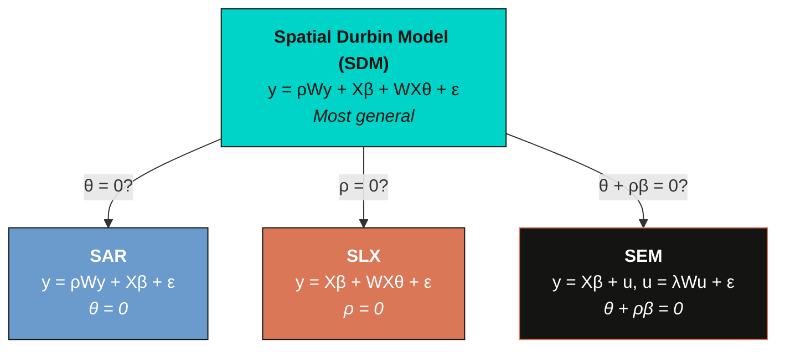
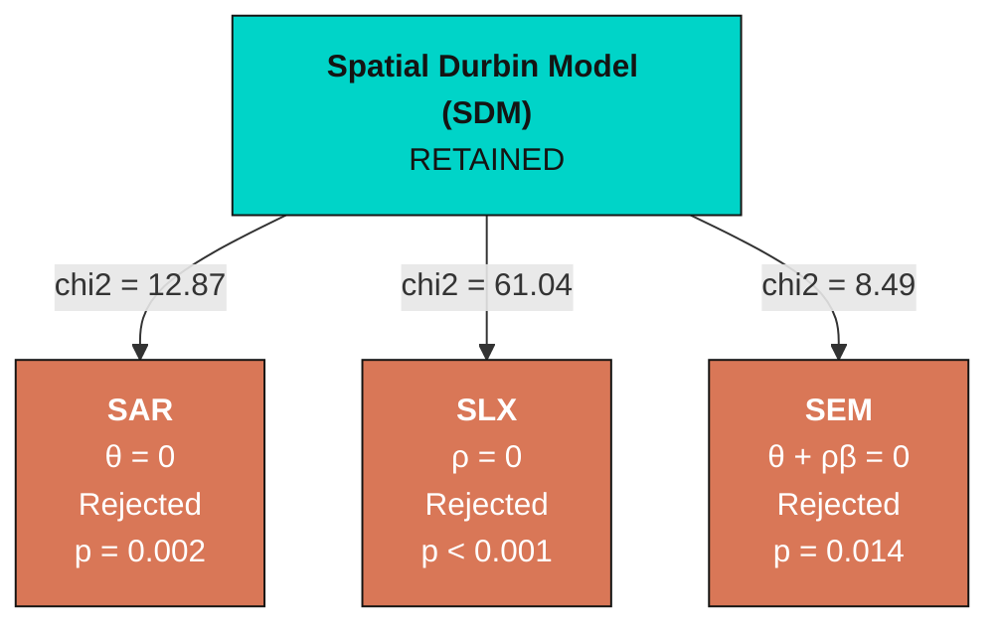

---
authors:
  - admin
categories:
  - Stata
  - Spatial Regression (SAR, SEM, SDM)
draft: false
featured: false
date: "2023-12-01T00:00:00Z"
external_link: ""
image:
  caption: ""
  focal_point: Smart
  placement: 3
links:
- icon: laptop-code
  icon_pack: fas
  name: "Web app"
  url: web_app/index.html
- icon: open-data
  icon_pack: ai
  name: "[Stata] Google Colab"
  url: https://colab.research.google.com/drive/1HCZJog7F9_9v7O57rk6TilyNvq1IBhKU?usp=sharing
- icon: file-code
  icon_pack: fas
  name: "Stata do-file"
  url: analysis.do
- icon: file-alt
  icon_pack: fas
  name: "Stata log"
  url: analysis.log
- icon: markdown
  icon_pack: fab
  name: "MD version"
  url: https://raw.githubusercontent.com/cmg777/starter-academic-v501/master/content/post/stata_sp_regression_panel/index.md
slides:
summary: Model spatial spillovers in panel data using the Spatial Durbin Model (SDM), Wald specification tests, and dynamic extensions with the xsmle package in Stata
tags:
- stata
- spatial
- regional
- spatial spillovers
- panel
- panel data
title: "Spatial Panel Regression in Stata: Cigarette Demand Across US States"
url_code: ""
url_pdf: ""
url_slides: ""
url_video: ""
toc: true
diagram: true
---

## Abstract

State-level cigarette taxation does not operate in isolation, because consumers near borders can shop across state lines, making each state's consumption depend on its neighbors' prices and incomes — a spatial spillover that standard panel models cannot capture by treating states as independent observations. This tutorial introduces spatial panel regression as a framework for modeling such geographic interdependence and progressively builds toward the Spatial Durbin Model (SDM) to quantify cross-border spillovers in cigarette demand. The analysis uses the classic Baltagi cigarette demand dataset, a strongly balanced panel of log per-capita consumption, real prices, and real per-capita income across 46 US states over 1963–1992 (1,380 observations), with a row-standardized binary contiguity weight matrix. Estimation proceeds from non-spatial benchmarks (pooled OLS, region, time, and two-way fixed effects) to the SDM with two-way fixed effects and the Lee–Yu bias correction, Wald specification tests, and dynamic spatial extensions, all via the `xsmle` package in Stata. The two-way FE price elasticity is -0.40, but the SDM total price effect is -0.627 (direct -0.313, indirect -0.314), with a spatial autoregressive parameter ρ = 0.265 (z = 8.08). Wald tests reject the SAR (p = 0.002), SLX (p < 0.001), and SEM (p = 0.014) restrictions, retaining the full SDM; once habit persistence (τ ≈ 0.65) is modeled dynamically, ρ falls to 0.080 and the short-run price elasticity (-0.15) implies a long-run elasticity near -0.42. These results imply that non-spatial models understate price sensitivity and that coordinated regional or federal tobacco taxation is more effective than isolated state-level policies.

## 1. Overview

Cigarette taxation is a state-level policy instrument, but consumption in one state does not exist in isolation. When a state raises its tobacco tax, consumers near state borders may simply drive across to buy cheaper cigarettes in a neighboring state. This **cross-border shopping** effect means that a state's cigarette consumption depends not only on its own prices and income but also on the prices and income of its neighbors. Standard panel data models --- pooled OLS, fixed effects, and two-way fixed effects --- cannot capture these spatial spillovers because they treat each state as an independent observation.

This tutorial introduces **spatial panel regression** as a framework for modeling geographic interdependence in panel data. We use the classic Baltagi cigarette demand dataset, which tracks per-capita cigarette consumption, real prices, and real per-capita income across 46 US states from 1963 to 1992. Starting from non-spatial panel models as a baseline, we progressively build toward the **Spatial Durbin Model (SDM)** --- a flexible specification that includes both the spatial lag of the dependent variable and spatial lags of the explanatory variables. We then use **Wald tests** to determine whether simpler spatial models (SAR, SLX, or SEM) are adequate, and finally extend the framework to **dynamic spatial panels** that account for habit persistence in cigarette consumption.

All estimation is performed using the `xsmle` package in Stata, which implements maximum likelihood estimation for a family of spatial panel models with fixed effects. The spatial weight matrix is a binary contiguity matrix that defines two states as neighbors if they share a common border, row-standardized so that the spatial lag of a variable equals the average value among a state's neighbors.

### Learning objectives

- Estimate non-spatial panel models (pooled OLS, region FE, time FE, two-way FE) and compare their price and income elasticities
- Construct and load a row-standardized spatial weight matrix for panel data in Stata
- Estimate the Spatial Durbin Model (SDM) with two-way fixed effects using the `xsmle` package
- Apply the Lee and Yu bias correction for spatial panels with moderate time dimensions
- Use Wald tests to evaluate whether the SDM simplifies to SAR, SLX, or SEM
- Estimate dynamic spatial panel models with temporal and spatiotemporal lags to capture habit persistence

### Key concepts at a glance

The post leans on a small vocabulary repeatedly. The rest of the tutorial assumes you can move between these terms quickly. Each concept below has three parts. The **definition** is always visible. The **example** and **analogy** sit behind clickable cards: open them when you need them, leave them collapsed for a quick scan. If a later section mentions "spillover effect" or "Spatial Durbin Model" and the term feels slippery, this is the section to re-read.

**1. Spatial Durbin Model (SDM).**
A spatial panel specification that includes spatial lags of *both* the dependent variable and the regressors. $y\_{it} = \rho \sum\_j w\_{ij} y\_{jt} + x\_{it}\beta + \sum\_j w\_{ij} x\_{jt}\theta + \mu\_i + \lambda\_t + \varepsilon\_{it}$. The most general spatial model — nests SAR, SLX, and SEM as special cases.

<div class="concept-pair">
<details class="concept-card concept-example">
<summary>Example</summary>

This post fits the full SDM on cigarette consumption. The estimates show $\rho = 0.265$ (cross-state Y spillovers) and significant $\theta$ coefficients on the spatial lags of `logp` and `logy` (cross-state X spillovers). Wald tests reject the simpler SAR/SLX/SEM restrictions.

</details>

<details class="concept-card concept-analogy">
<summary>Analogy</summary>

Full network model with neighbour effects on both Y and X. SAR captures only Y spillovers; SLX captures only X spillovers; SEM captures only error spillovers. SDM lets all three operate, then lets data tell you which matter.

</details>
</div>

**2. Spatial autoregressive parameter** $\rho$.
The coefficient on the spatial lag of the dependent variable, $W y$. Measures how strongly each unit's outcome moves with its neighbours' outcomes. Positive $\rho$ means cross-unit reinforcement; the size determines whether spillovers amplify or damp shocks.

<div class="concept-pair">
<details class="concept-card concept-example">
<summary>Example</summary>

This post estimates $\rho = 0.265$ (z = 8.08, p < 0.001). A 1% increase in average neighbour-state consumption raises this state's consumption by 0.27%. Cigarette consumption is a strongly spatially-clustered behaviour.

</details>

<details class="concept-card concept-analogy">
<summary>Analogy</summary>

Strength of the gossip network. With ρ near zero, news travels poorly between states. With ρ near one, every state knows every neighbour's news immediately. ρ measures how loud the cross-state telephone is.

</details>
</div>

**3. Spatial weight matrix** $W$ (row-standardized).
The matrix encoding which states count as neighbours. Row-standardized so each row sums to 1; the spatial lag $W y$ is then a *weighted average* of neighbours' $y$, not a sum. Common choices: contiguity (share a border) or inverse distance.

<div class="concept-pair">
<details class="concept-card concept-example">
<summary>Example</summary>

This post uses a contiguity-based $W$: two states are neighbours if they share a border. After row-standardization, $W y$ for California averages Nevada, Oregon, and Arizona's `logc`. The diagonal is zero (no self-loop).

</details>

<details class="concept-card concept-analogy">
<summary>Analogy</summary>

The friendship graph. Each row of W is one state's friend list, with weights summing to 1. The spatial lag asks each state, "what's the average opinion of your friends?"

</details>
</div>

**4. Direct effect** $\partial y\_i / \partial x\_i$.
The marginal impact of a state's own regressor on its own outcome, after the spatial multiplier has played out. *Different* from the regression coefficient $\beta$ in the SDM — feedback through neighbours and back means the direct effect includes the multiplier on own changes.

<div class="concept-pair">
<details class="concept-card concept-example">
<summary>Example</summary>

The SDM estimates a direct price effect of -0.313 on `logc` for California. A 1% rise in California's `logp` reduces California's own `logc` by 0.31% — accounting for the fact that the change ripples to neighbours and partially echoes back.

</details>

<details class="concept-card concept-analogy">
<summary>Analogy</summary>

How a price hike hits California Californians. The hike makes Californians cut consumption directly. Because Nevada and Oregon also feel the spatial echo, some of *their* response loops back to California. The direct effect captures the full self-impact, including the bounce.

</details>
</div>

**5. Indirect / spillover effect** $\partial y\_i / \partial x\_j, \, j \ne i$.
The marginal impact of one state's regressor on a *different* state's outcome. The spillover from one's own decisions onto neighbours. Equal to the average over all neighbour pairs in a global SDM.

<div class="concept-pair">
<details class="concept-card concept-example">
<summary>Example</summary>

The SDM estimates an indirect price effect of -0.314. A 1% rise in California's `logp` reduces neighbour-states' `logc` by 0.31% on average. Almost as large as the direct effect — spillovers are the same size as own-effects in this model.

</details>

<details class="concept-card concept-analogy">
<summary>Analogy</summary>

How a California price hike echoes into Nevada. California's tax raises California's prices; Nevada's smokers cross the border less; some Nevada residents may also adjust on observing California's behaviour. The spillover captures all those cross-state channels.

</details>
</div>

**6. Total effect** = direct + indirect.
The full marginal response of the system to a one-unit change in $x$ — including both own-state and cross-state channels. Reported by `lrtest` or `estat impact` in `xsmle`.

<div class="concept-pair">
<details class="concept-card concept-example">
<summary>Example</summary>

The SDM total price effect is $-0.313 + (-0.314) = -0.627$. A 1% rise in price reduces consumption by 0.63% nationally, once spillovers are summed. Roughly twice the OLS price elasticity (-0.386), since OLS misses the indirect channel entirely.

</details>

<details class="concept-card concept-analogy">
<summary>Analogy</summary>

The full ripple after both your splash and the echo. The first wave is the direct effect. The reflection from the wall is the indirect effect. Total = your splash plus the reflection coming back.

</details>
</div>

**7. Habit persistence (dynamic)** $\tau y\_{i,t-1}$.
A lagged dependent variable in the panel model, capturing inertia in the outcome. Cigarette consumption today reflects yesterday's habit. $\tau$ measures how much of last year's consumption persists. Standard for any addictive or routine-driven behaviour.

<div class="concept-pair">
<details class="concept-card concept-example">
<summary>Example</summary>

The dynamic SDM adds $\tau \cdot y\_{i,t-1}$ and estimates $\tau = 0.654$ (z = 33.33, p < 0.001). About 65% of last year's per-capita consumption persists to this year. Cigarettes are highly habit-forming, even at the state-aggregate level.

</details>

<details class="concept-card concept-analogy">
<summary>Analogy</summary>

Today's smoking is yesterday's habit. The smoker's lungs do not reset every December 31. Whatever they smoked last year shapes how much they smoke this year. τ is how strong that shaping is.

</details>
</div>

**8. Wald test for SDM simplification.**
A joint Wald test on the spatial-lag-of-X coefficients (or on $\rho$) to decide whether the SDM reduces to a simpler model. SAR ($\theta = 0$, only Y spillovers), SLX ($\rho = 0$, only X spillovers), or SEM ($\rho + W\theta = 0$ via a parameter restriction). If all tests reject, keep the full SDM.

<div class="concept-pair">
<details class="concept-card concept-example">
<summary>Example</summary>

This post runs three Wald tests. SAR is rejected (some $\theta \ne 0$). SLX is rejected ($\rho \ne 0$). The implied SEM restriction is rejected. The SDM is the right specification — all three channels are operative in cigarette consumption.

</details>

<details class="concept-card concept-analogy">
<summary>Analogy</summary>

"Do we really need all this machinery?" If a simpler model fits, use it. If every test rejects the simplification, keep the full SDM. The Wald test is the parsimony check.

</details>
</div>

---

## 2. The modeling pipeline

The tutorial follows a progressive approach --- each stage builds on the previous one by relaxing assumptions and adding complexity. The diagram below summarizes the path from data preparation through the final dynamic spatial models.


We first establish non-spatial benchmarks to understand the baseline price and income elasticities. Then we introduce the Spatial Durbin Model to capture spillovers, apply Wald tests to check whether a simpler spatial specification suffices, and finally add dynamic components to account for the habit-forming nature of cigarette consumption.

---

## 3. Setup and data loading

Before running any spatial models, we need three Stata packages: `spmat` for spatial weight matrix management, `xsmle` for spatial panel estimation, and `spwmatrix` for weight matrix conversion. If you have not installed them, uncomment the `net install` lines below.

```stata
clear all
macro drop _all
set more off
version 12

* Install packages (uncomment if needed)
*net install st0292, from(http://www.stata-journal.com/software/sj13-2)
*net install xsmle, from(http://fmwww.bc.edu/RePEc/bocode/x)
*net install spwmatrix, from(http://fmwww.bc.edu/RePEc/bocode/s)
```

### 3.1 Spatial weight matrix

The spatial weight matrix **W** defines the neighborhood structure among the 46 US states. We use a binary contiguity matrix where two states are neighbors if they share a common border. The matrix is stored in a `.dta` file and converted to an `spmat` object with row-standardization --- meaning that each row sums to one, so the spatial lag of a variable equals the **weighted average** among a state's neighbors.

```stata
* Load binary contiguity W matrix and convert to row-standardized spmat object
use "https://github.com/quarcs-lab/data-open/raw/master/cigar/Wct_bin.dta", replace
spmat dta Wst m1-m46, norm(row) replace
```

The `spmat dta` command reads columns `m1` through `m46` from the loaded dataset and stores them as a spatial weight matrix object named `Wst`. The `norm(row)` option applies row-standardization, and `replace` overwrites any existing matrix with the same name.

### 3.2 Panel data setup

The Baltagi cigarette demand dataset contains three variables measured across 46 US states and 30 years (1963--1992): log per-capita cigarette consumption (`logc`), log real cigarette price (`logp`), and log real per-capita disposable income (`logy`).

```stata
* Load panel data
use "https://github.com/quarcs-lab/data-open/raw/master/cigar/baltagi_cigar.dta", clear
sort year state
xtset state year
```

```text
Panel variable: state (strongly balanced)
 Time variable: year, 1963 to 1992
         Delta: 1 unit
```

The panel is **strongly balanced** --- all 46 states are observed in all 30 years, yielding 1,380 total observations. This balanced structure simplifies estimation and avoids the complications of missing data.

### 3.3 Panel summary statistics

The `xtsum` command decomposes each variable's variation into between-state and within-state components --- a key diagnostic for understanding what panel models can and cannot identify.

```stata
xtsum
```

```text
Variable         |      Mean   Std. dev.       Min        Max |    Observations
-----------------+--------------------------------------------+----------------
logc     overall |  4.625563   .2538233   3.736352   5.399758 |     N =    1380
         between |              .225498   4.057739    5.19628 |     n =      46
         within  |             .1254968   4.110718   5.070093 |     T =      30
                 |                                            |
logp     overall |  3.648067   .3364439   2.579455   4.588055 |     N =    1380
         between |             .1927783    3.22723   4.021831 |     n =      46
         within  |             .2798008   2.780289   4.372397 |     T =      30
                 |                                            |
logy     overall |  1.615786    .248717   .8676362   2.253795 |     N =    1380
         between |             .1363281   1.294913   2.063736 |     n =      46
         within  |             .2098697   1.035539   2.106283 |     T =      30
```

### Variables

| Variable | Description | Mean | Std. Dev. |
|----------|-------------|------|-----------|
| `logc` | Log per-capita cigarette consumption (packs) | 4.626 | 0.254 |
| `logp` | Log real price per pack (cents) | 3.648 | 0.336 |
| `logy` | Log real per-capita disposable income | 1.616 | 0.249 |

Mean log consumption is 4.63, corresponding to roughly 102 packs per capita per year. The between-state standard deviation of `logc` (0.225) is larger than the within-state standard deviation (0.125), indicating that cross-state differences in consumption levels are more pronounced than changes within a single state over time. For `logp`, the pattern reverses --- within-state variation (0.280) exceeds between-state variation (0.193), reflecting the fact that real prices changed substantially over this 30-year period due to tax policy changes and inflation. This decomposition foreshadows why fixed effects models, which exploit within-state variation, may produce different elasticity estimates than pooled models.

---

## 4. Non-spatial panel models

Before introducing spatial dependence, we estimate four standard panel specifications to establish baseline price and income elasticities. Each model relaxes a different assumption about unobserved heterogeneity, and comparing their estimates reveals how sensitive the results are to the treatment of state-level and time-level confounders.

### 4.1 Pooled OLS

Pooled OLS treats all 1,380 observations as independent, ignoring the panel structure entirely. It provides a naive benchmark.

```stata
reg logc logp logy
estimates store pool
```

```text
      Source |       SS           df       MS      Number of obs   =     1,380
-------------+----------------------------------   F(2, 1377)      =    199.28
       Model |  21.564818         2  10.7824090   Prob > F        =    0.0000
    Residual |  74.518523     1,377  .054116576   R-squared       =    0.2244
-------------+----------------------------------   Adj R-squared   =    0.2233
       Total |  96.083341     1,379  .069676098   Root MSE        =    .23284

------------------------------------------------------------------------------
        logc | Coefficient  Std. err.      t    P>|t|     [95% conf. interval]
-------------+----------------------------------------------------------------
        logp |  -.3857227   .0309752   -12.45   0.000    -.4464987   -.3249467
        logy |   .3724439   .0264568    14.08   0.000     .3205328    .4243551
       _cons |   4.396312   .0531992    82.64   0.000     4.291951    4.500674
------------------------------------------------------------------------------
```

Pooled OLS estimates a price elasticity of **-0.386** and an income elasticity of **0.372**, both statistically significant at the 1% level. However, the R-squared is only 0.224, and more importantly, this model assumes no systematic differences across states --- an untenable assumption given the large between-state variation we observed in the summary statistics.

### 4.2 Region fixed effects

Region (state) fixed effects control for all time-invariant state characteristics --- geographic location, cultural attitudes toward smoking, historical tobacco production, and any other state-specific factor that does not change over the sample period.

```stata
xtreg logc logp logy, fe
estimates store rfe
```

```text
Fixed-effects (within) regression               Number of obs     =      1,380
Group variable: state                            Number of groups  =         46

R-squared:                                       Obs per group:
     Within  = 0.4059                                         min =         30
     Between = 0.0681                                         avg =       30.0
     Overall = 0.1050                                         max =         30

                                                 F(2,1332)         =     455.52
corr(u_i, Xb) = -0.8072                         Prob > F          =     0.0000

------------------------------------------------------------------------------
        logc | Coefficient  Std. err.      t    P>|t|     [95% conf. interval]
-------------+----------------------------------------------------------------
        logp |  -.2307217   .0276419    -8.35   0.000    -.2849426   -.1765008
        logy |  -.0145419   .0389849    -0.37   0.709    -.0910300    .0619462
       _cons |   4.619736   .0542965    85.09   0.000     4.513180    4.726293
------------------------------------------------------------------------------
     sigma_u |  .21834832
     sigma_e |  .09498463
         rho |  .84090063   (fraction of variance due to u_i)
------------------------------------------------------------------------------
F test that all u_i=0: F(45, 1332) = 85.78                  Prob > F = 0.0000
```

After controlling for state fixed effects, the price elasticity drops to **-0.231** --- substantially smaller in magnitude than the pooled OLS estimate of -0.386. This difference reveals that much of the apparent price sensitivity in pooled OLS was driven by **cross-state composition effects**: low-price states tend to have higher consumption for reasons unrelated to price (e.g., tobacco-producing states have both lower prices and stronger smoking cultures). The income elasticity becomes statistically insignificant at **-0.015** (p = 0.709), suggesting that within-state income changes over time do not strongly predict consumption changes once state-level heterogeneity is absorbed. The F-test for joint significance of state fixed effects is overwhelming (F = 85.78, p < 0.001), confirming that state heterogeneity is substantial.

### 4.3 Time fixed effects

Time fixed effects control for shocks common to all states in a given year --- federal anti-smoking campaigns, national health reports (such as the 1964 Surgeon General's report), and macroeconomic fluctuations.

```stata
reg logc logp logy i.year
estimates store tfe
```

```text
      Source |       SS           df       MS      Number of obs   =     1,380
-------------+----------------------------------   F(31, 1348)     =     41.04
       Model |  48.7107267        31  1.57131054   Prob > F        =    0.0000
    Residual |  47.3726143     1,348  .03514290   R-squared       =    0.5070
-------------+----------------------------------   Adj R-squared   =    0.4957
       Total |  96.083341     1,379  .069676098   Root MSE        =    .18747

------------------------------------------------------------------------------
        logc | Coefficient  Std. err.      t    P>|t|     [95% conf. interval]
-------------+----------------------------------------------------------------
        logp |  -.8612867   .0389729   -22.10   0.000    -.9377676   -.7848058
        logy |   .8045032   .0466019    17.26   0.000     .7130647    .8959417
       _cons |   3.958816   .0638297    62.02   0.000     3.833551    4.084081
------------------------------------------------------------------------------
```

With time fixed effects, the price elasticity jumps to **-0.861** and the income elasticity to **0.805** --- both much larger in magnitude than the pooled OLS estimates. By removing common year-level trends (such as the secular decline in smoking rates after the Surgeon General's report), the model isolates cross-state differences in a given year. The R-squared increases to 0.507, a substantial improvement over pooled OLS.

### 4.4 Two-way fixed effects

Two-way fixed effects combine state and time dummies, controlling simultaneously for state-specific time-invariant factors and year-specific common shocks. This is the most thorough non-spatial specification and serves as our benchmark.

```stata
xtreg logc logp logy i.year, fe
estimates store rtfe
```

```text
Fixed-effects (within) regression               Number of obs     =      1,380
Group variable: state                            Number of groups  =         46

R-squared:                                       Obs per group:
     Within  = 0.7891                                         min =         30
     Between = 0.0121                                         avg =       30.0
     Overall = 0.0456                                         max =         30

                                                 F(31,1303)        =     157.60
corr(u_i, Xb) = -0.5688                         Prob > F          =     0.0000

------------------------------------------------------------------------------
        logc | Coefficient  Std. err.      t    P>|t|     [95% conf. interval]
-------------+----------------------------------------------------------------
        logp |  -.4020279   .0272553   -14.75   0.000    -.4555018   -.3485541
        logy |   .1193476   .0478095     2.50   0.013     .0255202    .2131749
       _cons |   4.515994   .0533810    84.59   0.000     4.411254    4.620733
------------------------------------------------------------------------------
     sigma_u |  .21428785
     sigma_e |  .05601281
         rho |  .93607854   (fraction of variance due to u_i)
------------------------------------------------------------------------------
```

The two-way FE model yields a price elasticity of **-0.402** and an income elasticity of **0.119**. The within R-squared is 0.789, a dramatic improvement over the region-only FE model (0.406), indicating that year effects absorb a large share of temporal variation. The price elasticity is roughly intermediate between the region-FE (-0.231) and time-FE (-0.861) estimates, illustrating how the choice of fixed effects changes the identifying variation and the resulting elasticity.

### 4.5 Comparison of non-spatial models

```stata
estimates table pool rfe tfe rtfe, b(%7.2f) star(0.1 0.05 0.01) stf(%9.0f)
```

| | Pooled OLS | Region FE | Time FE | Two-way FE |
|---------|-----------|-----------|---------|------------|
| `logp` | -0.39*** | -0.23*** | -0.86*** | -0.40*** |
| `logy` | 0.37*** | -0.01 | 0.80*** | 0.12** |
| R-sq | 0.224 | 0.406 | 0.507 | 0.789 |

The four specifications tell a coherent story: price has a **consistently negative** effect on cigarette consumption, but the magnitude varies from -0.23 (region FE) to -0.86 (time FE) depending on which sources of variation are exploited. The two-way FE estimate of -0.40 is the most credible non-spatial benchmark because it controls for both state heterogeneity and common time trends. However, all four models assume that each state's consumption depends only on its **own** price and income --- an assumption we will relax in the next section.

---

## 5. Why spatial models?

Even with two-way fixed effects, the models above ignore a potentially important channel: **spatial spillovers**. If Virginia raises its cigarette tax, smokers in bordering states might change their behavior too --- either because they no longer cross into Virginia to buy cheaper cigarettes, or because Virginia's policy signals a broader regional trend. Similarly, a rise in income in one state may increase consumption in neighboring states through commuting, trade, and social networks.

The **Spatial Durbin Model (SDM)** is a flexible framework that captures these spillovers through two channels:

$$y\_{it} = \rho \sum\_{j=1}^{N} w\_{ij} y\_{jt} + x\_{it} \beta + \sum\_{j=1}^{N} w\_{ij} x\_{jt} \theta + \mu\_i + \lambda\_t + \varepsilon\_{it}$$

In words, this equation says that cigarette consumption in state $i$ at time $t$ depends on three spatial components: (1) the **spatial lag of the dependent variable** $\rho W y$ --- how much a state's consumption is influenced by its neighbors' consumption, (2) the **own effects** of price and income $X \beta$, and (3) the **spatial lags of the explanatory variables** $W X \theta$ --- how neighbors' prices and incomes spill over. The parameters $\mu\_i$ and $\lambda\_t$ are state and year fixed effects, respectively.

| Symbol | Meaning | Code variable |
|--------|---------|---------------|
| $y\_{it}$ | Log cigarette consumption in state $i$, year $t$ | `logc` |
| $\rho$ | Spatial autoregressive parameter (neighbor consumption effect) | `[Spatial]rho` |
| $w\_{ij}$ | Element of the row-standardized weight matrix | `Wst` |
| $x\_{it}$ | Own price and income | `logp`, `logy` |
| $\beta$ | Own-variable coefficients | `[Main]logp`, `[Main]logy` |
| $\theta$ | Spatial lag coefficients (neighbor effects of X) | `[Wx]logp`, `[Wx]logy` |

A key advantage of the SDM is that it **nests** three simpler spatial models as special cases. This means we can start with the general SDM and then test whether the data supports reducing it to a simpler specification.



The **SAR** (Spatial Autoregressive) model restricts $\theta = 0$, assuming that only neighbors' consumption (not their prices or incomes) matters. The **SLX** (Spatial Lag of X) model restricts $\rho = 0$, assuming that neighbors' characteristics affect local consumption but there is no autoregressive feedback. The **SEM** (Spatial Error Model) imposes the common factor restriction $\theta + \rho \beta = 0$, implying that spatial dependence operates entirely through correlated errors rather than substantive spillovers. In Section 7, we will use Wald tests to determine which, if any, of these restrictions the data supports.

---

## 6. Spatial Durbin Model (SDM)

### 6.1 SDM with two-way fixed effects

We now estimate the full Spatial Durbin Model with both state and year fixed effects. The `xsmle` command performs maximum likelihood estimation for spatial panel models. The option `type(both)` specifies two-way fixed effects, `mod(sdm)` selects the Spatial Durbin specification, and `effects nsim(999)` computes direct and indirect effects using 999 Monte Carlo simulations.

```stata
xsmle logc logp logy, fe type(both) wmat(Wst) mod(sdm) effects nsim(999) nolog
estimates store sdm1
```

```text
Spatial Durbin model with fixed-effects                Number of obs  =  1,380
Group variable: state                                  Number of groups =   46
Time variable: year
                                                       Obs per group:
                                                                  min =    30
                                                                  avg =  30.0
                                                                  max =    30

                                                       Wald chi2(4)   = 379.19
Log-likelihood = 1971.5204                             Prob > chi2    = 0.0000

------------------------------------------------------------------------------
        logc | Coefficient  Std. err.      z    P>|z|     [95% conf. interval]
-------------+----------------------------------------------------------------
Main         |
        logp |  -.3068973   .0282114   -10.88   0.000    -.3621907   -.2516039
        logy |   .0781427   .0481269     1.62   0.104    -.0161843    .1724697
-------------+----------------------------------------------------------------
Wx           |
        logp |  -.2060671   .0649703    -3.17   0.002    -.3334065   -.0787277
        logy |   .1803542   .0885162     2.04   0.042     .0068656    .3538428
-------------+----------------------------------------------------------------
Spatial      |
         rho |   .2649571   .0327948     8.08   0.000     .2006804    .3292339
-------------+----------------------------------------------------------------
     sigma2_e|   .0027866
------------------------------------------------------------------------------

Direct       |  -.3131508   .0285649   -10.96   0.000    -.3691370   -.2571645
Indirect     |  -.3138174   .0812337    -3.86   0.000    -.4730325   -.1546023
Total        |  -.6269682   .0866710    -7.23   0.000    -.7968403   -.4570961
             |
Direct       |   .0941302   .0488720     1.93   0.054    -.0016572    .1899176
Indirect     |   .2683417   .1099814     2.44   0.015     .0527821    .4839013
Total        |   .3624719   .1216523     2.98   0.003     .1240378    .6009060
```

The spatial autoregressive parameter $\rho$ is **0.265** (z = 8.08, p < 0.001), indicating substantial positive spatial dependence --- states with higher-consuming neighbors tend to consume more themselves, even after controlling for own prices and income. The own price coefficient (`[Main]logp`) is -0.307, while the spatial lag of neighbors' prices (`[Wx]logp`) is -0.206, meaning that higher prices in neighboring states also reduce local consumption. This is consistent with the cross-border shopping hypothesis: when neighbors' prices rise, there are fewer opportunities for local consumers to shop across borders, reinforcing the local price effect.

The **direct effect** of price is -0.313, meaning that a 1% increase in a state's own price reduces its consumption by 0.31%. The **indirect (spillover) effect** of price is -0.314, nearly as large as the direct effect. This means that when all neighboring states raise prices by 1%, the resulting reduction in consumption in the focal state is comparable to the state raising its own price. The **total effect** of price is -0.627 --- much larger than the two-way FE estimate of -0.402, revealing that non-spatial models substantially underestimate the true price sensitivity of cigarette demand.

### 6.2 Lee and Yu bias correction

In spatial panels with fixed effects, the maximum likelihood estimator suffers from the **incidental parameters problem** --- the number of fixed effect parameters grows with the number of states, which introduces a bias term of order $1/T$. With $T = 30$ years, this bias may be non-negligible. Lee and Yu (2010) proposed a bias correction procedure that adjusts the ML estimates to eliminate the leading bias term.

```stata
xsmle logc logp logy, fe type(both) leeyu wmat(Wst) mod(sdm) effects nsim(999) nolog
estimates store sdm2
```

```text
Spatial Durbin model with fixed-effects (Lee-Yu)       Number of obs  =  1,334
Group variable: state                                  Number of groups =   46
Time variable: year
                                                       Obs per group:
                                                                  min =    29
                                                                  avg =  29.0
                                                                  max =    29

                                                       Wald chi2(4)   = 392.50
Log-likelihood = 1932.4681                             Prob > chi2    = 0.0000

------------------------------------------------------------------------------
        logc | Coefficient  Std. err.      z    P>|z|     [95% conf. interval]
-------------+----------------------------------------------------------------
Main         |
        logp |  -.3044782   .0283901   -10.72   0.000    -.3601218   -.2488346
        logy |   .0770150   .0486311     1.58   0.113    -.0183001    .1723301
-------------+----------------------------------------------------------------
Wx           |
        logp |  -.2083124   .0654876    -3.18   0.001    -.3366657   -.0799591
        logy |   .1869831   .0894718     2.09   0.037     .0116216    .3623446
-------------+----------------------------------------------------------------
Spatial      |
         rho |   .2596348   .0332441     7.81   0.000     .1944776    .3247920
-------------+----------------------------------------------------------------
     sigma2_e|   .0027512
------------------------------------------------------------------------------

Direct       |  -.3104271   .0287814   -10.79   0.000    -.3668377   -.2540166
Indirect     |  -.3122946   .0825781    -3.78   0.000    -.4741447   -.1504446
Total        |  -.6227218   .0878439    -7.09   0.000    -.7948927   -.4505509
             |
Direct       |   .0935487   .0494610     1.89   0.059    -.0033931    .1904905
Indirect     |   .2739264   .1115282     2.46   0.014     .0553351    .4925177
Total        |   .3674751   .1235608     2.97   0.003     .1253004    .6096498
```

The Lee-Yu correction uses $N \times (T-1) = 46 \times 29 = 1{,}334$ observations (one time period is lost in the transformation). The corrected estimates are very close to the uncorrected ones: $\rho$ changes from 0.265 to **0.260**, the own price coefficient from -0.307 to -0.304, and the total price effect from -0.627 to **-0.623**. This stability is reassuring --- with $T = 30$, the bias is already small. The closeness of the two sets of estimates provides confidence that the standard ML estimates are reliable for this dataset.

### 6.3 Comparison

| | SDM (standard) | SDM (Lee-Yu) |
|---------|-----------|-----------|
| $\rho$ | 0.265*** | 0.260*** |
| `logp` (own) | -0.307*** | -0.304*** |
| `logy` (own) | 0.078 | 0.077 |
| `W*logp` (neighbors) | -0.206*** | -0.208*** |
| `W*logy` (neighbors) | 0.180** | 0.187** |
| Direct price effect | -0.313*** | -0.310*** |
| Indirect price effect | -0.314*** | -0.312*** |
| Total price effect | -0.627*** | -0.623*** |

The two sets of estimates are nearly identical, confirming that the incidental parameters bias is negligible with 30 time periods. For the remainder of this tutorial, we use the Lee-Yu corrected estimates as our preferred specification.

---

## 7. Wald specification tests

The SDM is the most general model in the spatial panel family, nesting SAR, SLX, and SEM as special cases. Before accepting the full SDM, we should test whether the data supports a simpler specification. We do this by testing the parameter restrictions that define each nested model. If the restrictions are rejected, the simpler model is inadequate and we should retain the SDM.

We first re-estimate the SDM with the Lee-Yu correction (the `quietly` prefix suppresses output since we already displayed these results).

```stata
quietly xsmle logc logp logy, fe type(both) leeyu wmat(Wst) mod(sdm) effects nsim(999) nolog
```

### 7.1 Can the SDM reduce to SAR?

The SAR model restricts $\theta = 0$ --- that is, the spatial lags of the explanatory variables are zero. Under SAR, only neighbors' consumption matters, not their prices or incomes directly. We test this with a joint Wald test on the `[Wx]` coefficients.

```stata
* Wald test: Reduce to SAR? (NO if p < 0.05)
test ([Wx]logp = 0) ([Wx]logy = 0)
```

```text
 ( 1)  [Wx]logp = 0
 ( 2)  [Wx]logy = 0

           chi2(  2) =   12.87
         Prob > chi2 =    0.0016
```

The Wald test **rejects** the SAR restriction (chi2 = 12.87, p = 0.002). This means that neighbors' prices and incomes have direct effects on local consumption beyond their influence through the spatial lag of consumption. Dropping the $WX$ terms from the model would misspecify the spatial dependence structure.

### 7.2 Can the SDM reduce to SLX?

The SLX model restricts $\rho = 0$ --- there is no spatial autoregressive feedback through the dependent variable. Under SLX, neighbors' characteristics affect local consumption directly, but the spatial multiplier effect (where shocks propagate through the network) is absent.

```stata
* Wald test: Reduce to SLX? (NO if p < 0.05)
test ([Spatial]rho = 0)
```

```text
 ( 1)  [Spatial]rho = 0

           chi2(  1) =   61.04
         Prob > chi2 =    0.0000
```

The Wald test **overwhelmingly rejects** the SLX restriction (chi2 = 61.04, p < 0.001). The spatial autoregressive parameter $\rho$ is far from zero, confirming that there is a genuine feedback mechanism: a shock to consumption in one state propagates to its neighbors, which in turn affects their neighbors, creating a spatial multiplier.

### 7.3 Can the SDM reduce to SEM?

The SEM (Spatial Error Model) imposes the common factor restriction $\theta + \rho \beta = 0$. Under this restriction, the spatial dependence is purely a **nuisance** --- it enters through correlated error terms rather than through substantive economic spillovers. If SEM is adequate, the apparent spillover effects are an artifact of omitted spatially correlated variables, not genuine cross-border interactions.

```stata
* Wald test: Reduce to SEM? (NO if p < 0.05)
testnl ([Wx]logp = -[Spatial]rho*[Main]logp) ([Wx]logy = -[Spatial]rho*[Main]logy)
```

```text
  (1)  [Wx]logp = -[Spatial]rho*[Main]logp
  (2)  [Wx]logy = -[Spatial]rho*[Main]logy

           chi2(  2) =    8.49
         Prob > chi2 =    0.0143
```

The Wald test **rejects** the SEM common factor restriction (chi2 = 8.49, p = 0.014). The spatial dependence in cigarette demand is not merely a nuisance in the error term --- it reflects **substantive economic spillovers** across state borders. This is exactly what economic theory predicts: cross-border shopping creates genuine causal links between neighboring states' prices and local consumption.

### 7.4 Summary of specification tests



All three Wald tests reject the restricted models. The SDM cannot be simplified to SAR (neighbors' X variables matter), SLX (the autoregressive feedback matters), or SEM (the spatial dependence is substantive, not a nuisance). The **full SDM is the appropriate specification** for modeling cigarette demand across US states. This result confirms that spatial spillovers in cigarette consumption operate through multiple channels simultaneously: direct cross-border effects of neighbors' prices and incomes, and feedback effects through the spatial lag of consumption itself.

---

## 8. Dynamic spatial panel models

Cigarette consumption is well known to be **habit-forming** --- past consumption is a strong predictor of current consumption because of nicotine addiction. Standard (static) spatial models ignore this temporal persistence, which may bias the spatial parameter estimates. Dynamic spatial panel models extend the SDM by including lagged values of consumption, allowing us to separate habit persistence from spatial spillovers.

The `xsmle` package supports three dynamic specifications through the `dlag()` option:

| `dlag()` | Dynamic term added | Interpretation |
|----------|-------------------|----------------|
| 1 | $\tau \cdot y\_{i,t-1}$ | Temporal lag: own past consumption |
| 2 | $\psi \cdot \sum\_j w\_{ij} y\_{j,t-1}$ | Spatiotemporal lag: neighbors' past consumption |
| 3 | Both $\tau \cdot y\_{i,t-1}$ and $\psi \cdot \sum\_j w\_{ij} y\_{j,t-1}$ | Full dynamic: own + neighbors' past consumption |

The most general dynamic SDM (with `dlag(3)`) extends the static equation from Section 5 by adding two lagged terms:

$$y\_{it} = \tau \\, y\_{i,t-1} + \psi \sum\_{j=1}^{N} w\_{ij} \\, y\_{j,t-1} + \rho \sum\_{j=1}^{N} w\_{ij} \\, y\_{jt} + x\_{it} \beta + \sum\_{j=1}^{N} w\_{ij} \\, x\_{jt} \theta + \mu\_i + \lambda\_t + \varepsilon\_{it}$$

In words, this equation says that a state's cigarette consumption depends on its **own past consumption** ($\tau y\_{i,t-1}$, capturing habit persistence), the **average past consumption of its neighbors** ($\psi W y\_{t-1}$, capturing spatiotemporal diffusion), and all the contemporaneous spatial terms from the static SDM. The parameter $\tau$ measures how strongly last year's smoking predicts this year's --- think of it as the "addiction coefficient." The parameter $\psi$ captures whether neighbors' past behavior diffuses across borders over time.

| Symbol | Meaning | Code variable |
|--------|---------|---------------|
| $\tau$ | Temporal lag (habit persistence) | `[Temporal]tau` |
| $\psi$ | Spatiotemporal lag (neighbors' past consumption) | `[Temporal]psi` |
| $y\_{i,t-1}$ | Own consumption last year | `dlag(1)` |
| $W y\_{t-1}$ | Average neighbors' consumption last year | `dlag(2)` |

### 8.1 Non-dynamic SDM (baseline)

We re-estimate the static SDM as a baseline for comparison with the dynamic specifications.

```stata
xsmle logc logp logy, fe type(both) wmat(Wst) mod(sdm) effects nsim(999) nolog
eststo SDM0
```

```text
Spatial Durbin model with fixed-effects                Number of obs  =  1,380

------------------------------------------------------------------------------
        logc | Coefficient  Std. err.      z    P>|z|     [95% conf. interval]
-------------+----------------------------------------------------------------
Main         |
        logp |  -.3068973   .0282114   -10.88   0.000    -.3621907   -.2516039
        logy |   .0781427   .0481269     1.62   0.104    -.0161843    .1724697
Wx           |
        logp |  -.2060671   .0649703    -3.17   0.002    -.3334065   -.0787277
        logy |   .1803542   .0885162     2.04   0.042     .0068656    .3538428
Spatial      |
         rho |   .2649571   .0327948     8.08   0.000     .2006804    .3292339
------------------------------------------------------------------------------
```

### 8.2 Dynamic SDM with temporal lag ($\tau \cdot y\_{i,t-1}$)

Adding the temporal lag of own consumption captures habit persistence --- the tendency for this year's smoking to depend on last year's smoking, holding prices and income constant.

```stata
xsmle logc logp logy, dlag(1) fe type(both) wmat(Wst) mod(sdm) effects nsim(999) nolog
eststo dySDM1
```

```text
Dynamic Spatial Durbin model with fixed-effects        Number of obs  =  1,334

------------------------------------------------------------------------------
        logc | Coefficient  Std. err.      z    P>|z|     [95% conf. interval]
-------------+----------------------------------------------------------------
Main         |
        logp |  -.1516305   .0226714    -6.69   0.000    -.1960657   -.1071954
        logy |   .0285493   .0376124     0.76   0.448    -.0451697    .1022683
Wx           |
        logp |  -.0714289   .0521683    -1.37   0.171    -.1736769    .0308190
        logy |   .0592735   .0706984     0.84   0.402    -.0792929    .1978399
Spatial      |
         rho |   .1021753   .0307624     3.32   0.001     .0418821    .1624685
Temporal     |
         tau |   .6543218   .0196285    33.33   0.000     .6158507    .6927928
------------------------------------------------------------------------------
```

The temporal lag coefficient $\tau$ is **0.654** (z = 33.33, p < 0.001) --- a very strong habit persistence effect. Controlling for last year's consumption dramatically reduces the other coefficients: the own price effect drops from -0.307 to **-0.152**, and the spatial autoregressive parameter $\rho$ falls from 0.265 to **0.102**. This means that much of the apparent spatial dependence in the static SDM was actually capturing **temporal autocorrelation** that manifests spatially. The spatial lag of neighbors' prices (`[Wx]logp`) becomes insignificant (p = 0.171), suggesting that once habit persistence is controlled for, the direct cross-border price spillover weakens considerably.

### 8.3 Dynamic SDM with spatiotemporal lag ($\psi \cdot W \cdot y\_{i,t-1}$)

Instead of own past consumption, this specification includes the spatial lag of past consumption --- how much neighbors smoked last year.

```stata
xsmle logc logp logy, dlag(2) fe type(both) wmat(Wst) mod(sdm) effects nsim(999) nolog
eststo dySDM2
```

```text
Dynamic Spatial Durbin model with fixed-effects        Number of obs  =  1,334

------------------------------------------------------------------------------
        logc | Coefficient  Std. err.      z    P>|z|     [95% conf. interval]
-------------+----------------------------------------------------------------
Main         |
        logp |  -.2981475   .0280193   -10.64   0.000    -.3530643   -.2432307
        logy |   .0637218   .0478561     1.33   0.183    -.0300745    .1575181
Wx           |
        logp |  -.1425379   .0647518    -2.20   0.028    -.2694490   -.0156268
        logy |   .1320869   .0888243     1.49   0.137    -.0420055    .3061793
Spatial      |
         rho |   .1523264   .0369871     4.12   0.000     .0798330    .2248199
Temporal     |
         psi |   .2712508   .0339714     7.98   0.000     .2046680    .3378335
------------------------------------------------------------------------------
```

The spatiotemporal lag coefficient $\psi$ is **0.271** (z = 7.98, p < 0.001), indicating that neighbors' past consumption does have a positive effect on current consumption. However, this effect is weaker than the own temporal lag ($\tau = 0.654$ in the previous specification). The spatial autoregressive parameter drops to $\rho = 0.152$, and the own price coefficient stays close to the static SDM value at -0.298.

### 8.4 Full dynamic SDM ($\tau \cdot y\_{i,t-1} + \psi \cdot W \cdot y\_{i,t-1}$)

The most general dynamic specification includes both the temporal lag and the spatiotemporal lag.

```stata
xsmle logc logp logy, dlag(3) fe type(both) wmat(Wst) mod(sdm) effects nsim(999) nolog
eststo dySDM3
```

```text
Dynamic Spatial Durbin model with fixed-effects        Number of obs  =  1,334

------------------------------------------------------------------------------
        logc | Coefficient  Std. err.      z    P>|z|     [95% conf. interval]
-------------+----------------------------------------------------------------
Main         |
        logp |  -.1498627   .0226523    -6.62   0.000    -.1942603   -.1054651
        logy |   .0271398   .0376004     0.72   0.470    -.0465556    .1008351
Wx           |
        logp |  -.0636842   .0524156    -1.21   0.224    -.1664169    .0390485
        logy |   .0471982   .0712803     0.66   0.508    -.0925087    .1869052
Spatial      |
         rho |   .0803516   .0322458     2.49   0.013     .0171509    .1435524
Temporal     |
         tau |   .6389621   .0208541    30.64   0.000     .5980889    .6798353
         psi |   .0494172   .0325896     1.52   0.130    -.0144571    .1132915
------------------------------------------------------------------------------
```

In the full dynamic model, the temporal lag dominates: $\tau = 0.639$ (z = 30.64, p < 0.001), while the spatiotemporal lag $\psi = 0.049$ is **not statistically significant** (p = 0.130). This indicates that a state's own past consumption is the primary driver of temporal persistence, and neighbors' past consumption does not add meaningful additional information once own habit persistence is controlled for. The spatial autoregressive parameter further drops to $\rho = 0.080$, and the spatial lags of price and income become insignificant.

### 8.5 Comparison of dynamic models

```stata
esttab SDM0 dySDM1 dySDM2 dySDM3, mtitle("SDM" "dySDM1" "dySDM2" "dySDM3")
```

| | SDM (static) | dySDM1 ($\tau$) | dySDM2 ($\psi$) | dySDM3 ($\tau + \psi$) |
|---------|-----------|-----------|-----------|-----------|
| `logp` (own) | -0.307*** | -0.152*** | -0.298*** | -0.150*** |
| `logy` (own) | 0.078 | 0.029 | 0.064 | 0.027 |
| `W*logp` | -0.206*** | -0.071 | -0.143** | -0.064 |
| `W*logy` | 0.180** | 0.059 | 0.132 | 0.047 |
| $\rho$ | 0.265*** | 0.102*** | 0.152*** | 0.080** |
| $\tau$ (own lag) | --- | 0.654*** | --- | 0.639*** |
| $\psi$ (spatial lag) | --- | --- | 0.271*** | 0.049 |

The comparison reveals a clear pattern. First, **habit persistence is the dominant dynamic force**: $\tau$ is large and highly significant whether estimated alone (0.654) or jointly with $\psi$ (0.639), while $\psi$ loses significance once $\tau$ is included. Second, **controlling for habit persistence substantially attenuates spatial spillover estimates**: the spatial autoregressive parameter $\rho$ falls from 0.265 (static) to 0.080 (full dynamic), and the spatial lags of price and income become insignificant. This suggests that the static SDM's spillover estimates partly capture omitted temporal dynamics. Third, the **short-run price elasticity** in the dynamic model (-0.150) is about half the static estimate (-0.307), but the long-run price elasticity --- computed as $\beta / (1 - \tau)$ --- is approximately $-0.150 / (1 - 0.639) = -0.416$, close to the static estimate. The static SDM conflates short-run and long-run responses into a single coefficient.

---

## 9. Discussion

This tutorial demonstrates that **spatial dependence matters** for modeling cigarette demand across US states. The Wald tests in Section 7 conclusively reject all three restricted spatial models (SAR, SLX, SEM), confirming that the Spatial Durbin Model is the appropriate specification. The total price effect in the static SDM (-0.627) is more than 50% larger than the two-way FE estimate (-0.402), revealing that non-spatial models systematically understate the true price sensitivity of cigarette demand by ignoring cross-border spillovers.

The dynamic extensions in Section 8 provide important nuance. Once habit persistence is controlled for ($\tau \approx 0.65$), the spatial autoregressive parameter drops by two-thirds (from 0.265 to 0.080), and many spatial lag coefficients lose statistical significance. This does not mean spatial dependence is unimportant --- rather, it means that the **static SDM conflates temporal and spatial dynamics**. In the dynamic model, the short-run own price elasticity is -0.15 and the long-run elasticity is approximately -0.42, offering policymakers a clearer picture of how quickly cigarette taxation takes effect.

From a policy perspective, these results carry a direct implication: **state-level tobacco taxation has cross-border spillover effects that policymakers must consider**. When a single state raises its cigarette tax, the demand reduction is partially offset by cross-border shopping. However, when neighboring states raise taxes simultaneously, the total demand reduction is amplified. This supports the case for coordinated regional or federal tobacco taxation rather than isolated state-level policies. The finding that habit persistence is the dominant dynamic force ($\tau \approx 0.65$) also suggests that the full impact of a tax increase takes several years to materialize, as consumers slowly adjust their consumption habits.

---

## 10. Summary and next steps

This tutorial covered the complete workflow for spatial panel regression in Stata --- from loading a spatial weight matrix and estimating non-spatial benchmarks, through the full Spatial Durbin Model with Wald specification tests, to dynamic spatial extensions. The key takeaways are:

- **Non-spatial models understate price sensitivity.** The two-way FE price elasticity is -0.40, but the SDM total effect is -0.63 --- a 57% increase that reflects cross-border spillovers ignored by standard panel models.
- **The SDM cannot be simplified.** All three Wald tests reject the SAR, SLX, and SEM restrictions, meaning that spatial dependence operates through multiple channels simultaneously: neighbors' consumption ($\rho$), neighbors' prices ($\theta\_{logp}$), and neighbors' income ($\theta\_{logy}$).
- **Habit persistence dominates temporal dynamics.** The temporal lag coefficient $\tau \approx 0.65$ is large and robust, while the spatiotemporal lag $\psi$ loses significance once $\tau$ is included. Static spatial models overstate contemporaneous spillovers by absorbing temporal autocorrelation.
- **Short-run vs. long-run elasticities differ substantially.** The dynamic SDM's short-run price elasticity (-0.15) is less than half its long-run counterpart (-0.42), information that is lost in static specifications.

For further study, consider applying these methods to other spatial datasets or exploring alternative spatial specifications. The companion tutorial on [cross-sectional spatial regression]() covers the spatial models available for single-period data, including the full taxonomy of SAR, SEM, SLX, SDM, SDEM, and SAC models. For datasets where unobserved common factors (macroeconomic shocks, regulatory changes) may drive cross-sectional dependence beyond what the spatial weight matrix captures, see the [spatial dynamic panels with common factors]() tutorial, which uses the `spxtivdfreg` package to combine spatial lags with defactored IV estimation. For Python implementations of spatial econometrics, see the PySAL ecosystem and the `spreg` package.

---

## 11. Exercises

1. **Alternative weight matrix.** Replace the binary contiguity matrix with an inverse-distance weight matrix. Re-estimate the SDM and compare the spatial autoregressive parameter $\rho$ and the indirect effects. Does the choice of weight matrix change the substantive conclusions about cross-border spillovers?

2. **SAR vs. SDM direct comparison.** Estimate a SAR model (`mod(sar)` in `xsmle`) with two-way fixed effects and the Lee-Yu correction. Compare its price elasticity to the SDM. Given that the Wald test rejected the SAR restriction, how different are the elasticity estimates in practice?

3. **Subsample analysis.** Split the sample into two periods (1963--1977 and 1978--1992) and estimate the SDM separately for each. Did the spatial dependence structure of cigarette demand change over time? What historical events (e.g., the Surgeon General's reports, the rise of anti-smoking legislation) might explain differences between the two periods?

---

## References

1. [Baltagi, B. H. (2021). *Econometric Analysis of Panel Data* (6th ed.). Springer.](https://link.springer.com/book/10.1007/978-3-030-53953-5)
2. [Elhorst, J. P. (2014). *Spatial Econometrics: From Cross-Sectional Data to Spatial Panels*. Springer.](https://link.springer.com/book/10.1007/978-3-642-40340-8)
3. [LeSage, J. P. & Pace, R. K. (2009). *Introduction to Spatial Econometrics*. Chapman & Hall/CRC.](https://doi.org/10.1201/9781420064254)
4. [Lee, L. F. & Yu, J. (2010). Estimation of spatial autoregressive panel data models with fixed effects. *Journal of Econometrics*, 154(2), 165--185.](https://doi.org/10.1016/j.jeconom.2009.08.001)
5. [Belotti, F., Hughes, G., & Mortari, A. P. (2017). Spatial panel-data models using Stata. *Stata Journal*, 17(1), 139--180.](https://doi.org/10.1177/1536867X1701700109)
6. [Baltagi cigarette demand dataset -- QUARCS Lab open data repository.](https://github.com/quarcs-lab/data-open/tree/master/cigar)
