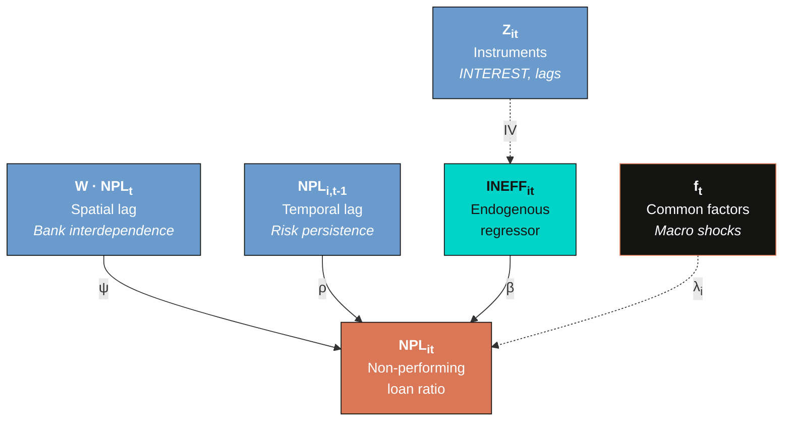
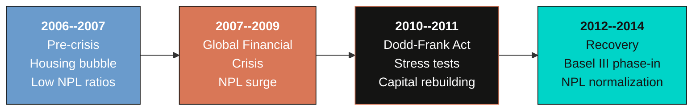
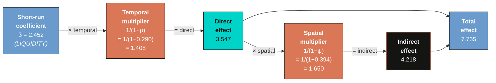
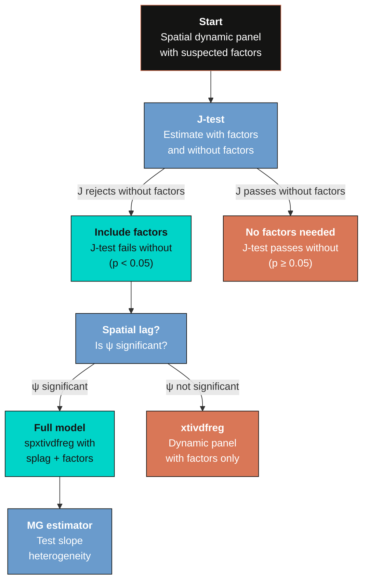

---
authors:
  - admin
categories:
  - Stata
  - Spatial Analysis
  - Panel Data
draft: false
featured: false
date: "2026-03-27T00:00:00Z"
external_link: ""
image:
  caption: ""
  focal_point: Smart
  placement: 3
links:
- icon: file-code
  icon_pack: fas
  name: "Stata do-file"
  url: analysis.do
- icon: file-alt
  icon_pack: fas
  name: "Stata log"
  url: analysis.log
- icon: book
  icon_pack: fas
  name: "JSS article"
  url: https://doi.org/10.18637/jss.v113.i06
- icon: database
  icon_pack: fas
  name: "Dataset (.dta)"
  url: https://github.com/cmg777/starter-academic-v501/raw/master/content/post/stata_spxtivdfreg/references/v113i06.dta
slides:
summary: Estimate spatial dynamic panel models with unobserved common factors using the spxtivdfreg package in Stata --- an IV approach that handles spatial lags, temporal persistence, endogenous regressors, and latent factors simultaneously
tags:
- stata
- spatial
- panel
- spatial spillovers
- banking
- causal
title: "Spatial Dynamic Panels with Common Factors in Stata: Credit Risk in US Banking"
url_code: ""
url_pdf: ""
url_slides: ""
url_video: ""
toc: true
diagram: true
---

## 1. Overview

The 2007--2009 Global Financial Crisis revealed that credit risk does not stay contained within individual banks. Non-performing loans surged across the US banking system through two distinct channels --- **spatial spillovers** from balance-sheet interdependencies among interconnected banks, and **common factors** from macroeconomic shocks (interest rate changes, housing market collapses, unemployment spikes) that hit all banks simultaneously. Ignoring either channel leads to biased estimates of credit risk determinants and misleading policy prescriptions. Standard spatial panel packages in Stata --- such as `xsmle` and `spxtregress` --- can model spatial spillovers but cannot account for unobserved common factors, leaving a critical gap in the econometrician's toolkit.

The `spxtivdfreg` package (Kripfganz & Sarafidis, 2025) fills this gap by implementing a **defactored instrumental variables** estimator that simultaneously handles four sources of endogeneity: spatial lags of the dependent variable, temporal lags (dynamic persistence), endogenous regressors, and unobserved common factors. The estimator first removes common factors from the data using a principal-components-based defactoring procedure, then applies IV/GMM estimation to the defactored model. This approach avoids the incidental parameters bias that plagues maximum likelihood methods and does not require bias corrections like the Lee-Yu adjustment used in `xsmle`.

This tutorial replicates the empirical application from Kripfganz and Sarafidis (2025), which models non-performing loan ratios across 350 US commercial banks over the period 2006:Q1 to 2014:Q4 --- a sample that spans the entire GFC episode. We estimate the full spatial dynamic panel model with common factors, demonstrate what happens when common factors or the spatial lag are omitted, compute short-run and long-run spillover effects, and compare homogeneous and heterogeneous slope specifications.

### Learning objectives

- Understand the four sources of endogeneity in spatial dynamic panel models: spatial lag, temporal lag, endogenous regressors, and common factors
- Estimate the full spatial dynamic panel model with common factors using `spxtivdfreg`
- Compare estimation results with and without common factors to assess the consequences of ignoring latent macroeconomic shocks
- Compare estimation results with and without the spatial lag to evaluate the importance of bank interconnectedness
- Compute and interpret short-run and long-run direct, indirect, and total effects using `estat impact`
- Estimate heterogeneous slope models with the mean-group (MG) estimator to assess cross-bank parameter heterogeneity

---

## 2. The modeling framework

Credit risk in a banking system is shaped by forces operating at three different levels: the individual bank (its own financial ratios and management quality), the network of interconnected banks (spatial spillovers through lending relationships, common borrowers, and contagion), and the macroeconomy (interest rates, GDP growth, and other aggregate shocks that affect all banks). The spatial dynamic panel model with common factors captures all three levels in a single equation.

The diagram below illustrates the four sources of endogeneity that the `spxtivdfreg` estimator must address simultaneously.



The spatial lag ($W \cdot NPL$) creates endogeneity because bank $i$'s credit risk depends on bank $j$'s credit risk, and vice versa --- a simultaneity problem. The temporal lag ($NPL\_{i,t-1}$) is endogenous because it correlates with the bank-specific fixed effect. The endogenous regressor (operational inefficiency, $INEFF$) is correlated with the error term. And the common factors ($f\_t$) enter both the regressors and the error, inducing cross-sectional dependence and omitted variable bias.

The model is specified as:

$$NPL\_{it} = \psi \sum\_{j=1}^{N} w\_{ij} \\, NPL\_{jt} + \rho \\, NPL\_{i,t-1} + x\_{it} \beta + \alpha\_i + \lambda\_i' f\_t + \varepsilon\_{it}$$

In words, this equation says that the non-performing loan ratio of bank $i$ at time $t$ depends on: the **spatial lag** $\psi W \cdot NPL$ (the weighted average NPL of interconnected banks), the **temporal lag** $\rho \\, NPL\_{i,t-1}$ (the bank's own past credit risk, capturing persistence), the **bank-specific covariates** $x\_{it} \beta$ (financial ratios like capital adequacy, profitability, and liquidity), the **individual fixed effect** $\alpha\_i$ (time-invariant bank characteristics), and the **interactive fixed effect** $\lambda\_i' f\_t$ (unobserved common factors with heterogeneous loadings).

### Variable mapping

| Symbol | Meaning | Stata variable |
|--------|---------|----------------|
| $NPL\_{it}$ | Non-performing loans / total loans (%) | `NPL` |
| $\psi$ | Spatial autoregressive parameter | `[W]NPL` |
| $\rho$ | Temporal autoregressive parameter | `L1.NPL` |
| $x\_{it}$ | Bank-specific covariates | `INEFF`, `CAR`, `SIZE`, ... |
| $\alpha\_i$ | Bank fixed effect (absorbed) | `absorb(ID)` |
| $\lambda\_i' f\_t$ | Interactive fixed effect (defactored) | estimated by `spxtivdfreg` |
| $w\_{ij}$ | Spatial weight (interconnection) | `W.csv` |

### Comparison with existing Stata packages

| Feature | `spxtivdfreg` | `xsmle` | `spxtregress` |
|---------|--------------|---------|---------------|
| Estimation method | IV/GMM (defactored) | Maximum likelihood | Quasi-ML |
| Common factors | Yes (estimated) | No | No |
| Endogenous regressors | Yes (IV) | No | Limited |
| Dynamic (temporal lag) | Yes | Yes (`dlag`) | Yes |
| Bias correction needed | No | Yes (Lee-Yu) | No |
| Heterogeneous slopes (MG) | Yes (`mg` option) | No | No |

The key advantage of `spxtivdfreg` is its ability to handle unobserved common factors --- latent macroeconomic shocks that affect all banks but with heterogeneous intensity. Maximum likelihood methods in `xsmle` assume cross-sectional independence conditional on the spatial weight matrix, which is violated when common factors are present. The defactored IV approach removes these factors before estimation, producing consistent estimates even in the presence of strong cross-sectional dependence.

---

## 3. Setup and data loading

Before running any spatial dynamic panel models, we need three Stata packages: `xtivdfreg` (the core estimation engine), `reghdfe` (for absorbing fixed effects), and `ftools` (a dependency of `reghdfe`). The `spxtivdfreg` command is the spatial panel wrapper around `xtivdfreg`.

```stata
* Install packages (if not already installed)
capture which xtivdfreg
if _rc {
    ssc install xtivdfreg
}
capture which reghdfe
if _rc {
    ssc install reghdfe
}
capture which ftools
if _rc {
    ssc install ftools
}
```

### 3.1 Data loading and panel setup

The dataset contains quarterly financial ratios for 350 US commercial banks from 2006:Q1 to 2014:Q4, yielding 36 quarters and 12,600 total observations. After absorbing fixed effects and creating lags, the effective estimation sample is 12,250 observations (350 banks times 35 periods).

```stata
clear all
use "https://github.com/cmg777/starter-academic-v501/raw/master/content/post/stata_spxtivdfreg/references/v113i06.dta", clear
xtset ID TIME
```

```text
Panel variable: ID (strongly balanced)
 Time variable: TIME, 1 to 36
         Delta: 1 unit
```

The panel is strongly balanced --- all 350 banks are observed in all 36 quarters. The `xtset` command declares `ID` as the bank identifier and `TIME` as the quarterly time index.

The sample period is rich with major macro-financial events that all banks experienced --- precisely the kind of aggregate shocks that common factors are designed to capture:



These regime shifts (housing bubble, financial crisis, regulatory tightening, recovery) are exactly the unobserved common factors that the `spxtivdfreg` estimator extracts. Standard two-way fixed effects would capture them only if they affected all 350 banks equally --- but the interactive fixed effect structure $\lambda\_i' f\_t$ allows each bank to respond with different intensity to the same aggregate shock.

### 3.2 Summary statistics

```stata
summarize NPL INEFF CAR SIZE BUFFER PROFIT QUALITY LIQUIDITY INTEREST
```

```text
    Variable |        Obs        Mean    Std. dev.       Min        Max
-------------+---------------------------------------------------------
         NPL |     12,600     1.7283      2.1067          0    23.0378
       INEFF |     12,600      .6425       .1726      .2007     2.9037
         CAR |     12,600    13.5550      5.6198     1.3800    86.8400
        SIZE |     12,600    14.6883      1.4234    11.9466    20.4618
      BUFFER |     12,600     5.5550      5.2691    -6.6200    78.8400
      PROFIT |     12,600      .8001      5.0380  -132.0700    40.9900
     QUALITY |     12,600      .2827       .6245    -4.9482    27.8659
   LIQUIDITY |     12,600      .7699       .2224      .0122     2.3217
    INTEREST |     12,600    -1.9074       .9328    -5.1644     2.5187
```

Mean NPL is 1.73%, reflecting the mixture of pre-crisis, crisis, and post-crisis quarters in the sample. The standard deviation of 2.11 percentage points indicates substantial variation both across banks and over time --- some banks had NPL ratios as high as 23%. Mean LIQUIDITY (loan-to-deposit ratio) is 0.77, meaning the average bank lent out 77 cents for every dollar of deposits. The wide range of CAR (1.38% to 86.84%) reflects the heterogeneity in capital structures across US commercial banks.

### 3.3 Variables

| Variable | Description | Mean | Std. Dev. |
|----------|-------------|------|-----------|
| `NPL` | Non-performing loans / total loans (%) | 1.728 | 2.107 |
| `INEFF` | Operational inefficiency (endogenous) | --- | --- |
| `CAR` | Capital adequacy ratio | --- | --- |
| `SIZE` | ln(total assets) | --- | --- |
| `BUFFER` | Capital buffer (leverage ratio minus 8%) | --- | --- |
| `PROFIT` | Return on equity, annualized | --- | --- |
| `QUALITY` | Loan loss provisions / assets (%) | --- | --- |
| `LIQUIDITY` | Loan-to-deposit ratio | 0.770 | 0.222 |
| `INTEREST` | Interest expenses / deposits (instrument for INEFF) | --- | --- |

The dependent variable `NPL` measures credit risk as the share of non-performing loans in total loans, expressed in percentage points. Its mean of 1.728% reflects the mixture of pre-crisis, crisis, and post-crisis quarters in the sample, with a standard deviation of 2.107 percentage points indicating substantial variation both across banks and over time. The variable `INEFF` (operational inefficiency) is treated as **endogenous** and instrumented using `INTEREST` (interest expenses relative to deposits) along with lagged values of the exogenous regressors.

### 3.3 The spatial weight matrix

The spatial weight matrix $W$ is a 350-by-350 matrix that defines the network structure among banks. Unlike geographic contiguity matrices used in regional analysis, this matrix is constructed from **economic distance** --- specifically, Spearman's rank correlation of bank debt-to-asset ratios. Two banks are defined as "neighbors" if their debt ratio correlation exceeds the 95th percentile of the empirical distribution.

```stata
* Download the W matrix to the current working directory
copy "https://github.com/cmg777/starter-academic-v501/raw/master/content/post/stata_spxtivdfreg/references/W.csv" "W.csv", replace
* The W matrix (350 x 350, row-standardized, 6,300 nonzero entries) is loaded
* automatically by spxtivdfreg via the spmatrix("W.csv", import) option
```

The matrix is row-standardized so that each row sums to one, meaning the spatial lag of a variable equals the **weighted average** among a bank's neighbors. With 6,300 nonzero entries across 350 banks, the average bank has approximately 18 neighbors --- banks whose debt structures are sufficiently correlated to suggest economic interdependence. To illustrate: suppose Bank A and Bank B have a Spearman rank correlation of 0.92 in their quarterly debt ratios, while the 95th percentile threshold is 0.87. Since 0.92 exceeds 0.87, Bank A and Bank B are classified as neighbors ($w\_{AB} > 0$). After row-standardization, $w\_{AB}$ equals $1/18$ if Bank A has 18 neighbors. This economic-distance approach captures financial contagion channels that geographic proximity alone would miss, since two banks on opposite coasts can be highly interconnected through similar lending portfolios.

---

## 4. Full model with common factors

We now estimate the full spatial dynamic panel model with unobserved common factors. The `spxtivdfreg` command takes the dependent variable (`NPL`) and the regressors, with options specifying the model structure: `absorb(ID)` absorbs bank fixed effects, `splag` includes the spatial lag of NPL, `tlags(1)` adds the first temporal lag, `spmatrix("W.csv", import)` loads the weight matrix, and `iv(...)` specifies the instrumental variables. The `std` option standardizes the variables before extracting principal components for the factor estimation, which improves numerical stability when covariates have very different scales.

```stata
spxtivdfreg NPL INEFF CAR SIZE BUFFER PROFIT QUALITY LIQUIDITY,   ///
    absorb(ID) splag tlags(1) spmatrix("W.csv", import)           ///
    iv(INTEREST CAR SIZE BUFFER PROFIT QUALITY LIQUIDITY, splags lag(1)) std
```

```text
Defactored instrumental variables estimation
Group variable: ID                              Number of obs    = 12,250
Time variable: TIME                             Number of groups =    350
Number of instruments =       28                Obs per group:
Number of factors in X =       2                          min =      35
Number of factors in u =       1                          avg =    35.0
                                                          max =      35

Second-stage estimator (model with homogeneous slope coefficients)
--------------------------------------------------------------------------
                    Robust
  NPL | Coefficient  std. err.      z    P>|z|     [95% conf. interval]
------+-------------------------------------------------------------------
  NPL |
  L1. |   .2898521   .0543794     5.33   0.000     .1832704    .3964339
      |
INEFF |   .4473777   .1045636     4.28   0.000     .2424368    .6523186
  CAR |   .0305078   .0057852     5.27   0.000     .019169     .0418465
 SIZE |   .2225966   .0941614     2.36   0.018     .0380436    .4071496
BUFFER| -.0545049   .0118678    -4.59   0.000    -.0777653   -.0312445
PROFIT| -.0053351   .0018411    -2.90   0.004    -.0089437   -.0017266
QUALITY|  .1830412   .0307657     5.95   0.000     .1227415    .2433408
LIQUIDITY| 2.452391  .2696471     9.09   0.000     1.923892    2.980889
_cons | -4.510715   1.311453    -3.44   0.001    -7.081115   -1.940315
------+-------------------------------------------------------------------
    W |
  NPL |   .3943206   .0848856     4.65   0.000     .2279479    .5606932
------+-------------------------------------------------------------------
sigma_f |  .64162366    (std. dev. of factor error component)
sigma_e |  .90381799    (std. dev. of idiosyncratic error component)
    rho |  .33509009    (fraction of variance due to factors)
--------------------------------------------------------------------------
Hansen test: chi2(19) = 18.8250, Prob > chi2 = 0.4681
```

The estimator identifies **2 common factors in the regressors** and **1 common factor in the error term**, capturing latent macroeconomic forces that drive credit risk across the banking system. These factors represent unobserved aggregate shocks --- such as Federal Reserve interest rate decisions, housing market fluctuations, and changes in regulatory stringency --- that affect all banks simultaneously but with bank-specific intensities (heterogeneous factor loadings $\lambda\_i$).

The **spatial autoregressive parameter** $\psi = 0.394$ (z = 4.65, p < 0.001) indicates strong positive spatial spillovers: when the average NPL ratio of a bank's neighbors increases by 1 percentage point, the bank's own NPL ratio increases by 0.39 percentage points, holding all else constant. This captures financial contagion through interconnected lending networks --- when one bank's borrowers default, it can trigger a cascade of defaults among economically linked banks.

The **temporal persistence parameter** $\rho = 0.290$ (z = 5.33, p < 0.001) shows that credit risk is moderately persistent: about 29% of a bank's current NPL ratio is inherited from the previous quarter. This reflects the gradual resolution of non-performing loans through workout processes, foreclosures, and write-offs.

Among the covariates, **LIQUIDITY** has the largest effect at 2.452 (z = 9.09, p < 0.001), meaning that a 1 percentage point increase in the loan-to-deposit ratio is associated with a 2.45 percentage point increase in non-performing loans. Banks that extend more credit relative to their deposit base face higher credit risk. **INEFF** (operational inefficiency) enters with a coefficient of 0.447 (z = 4.28, p < 0.001), confirming that poorly managed banks experience higher default rates --- a finding consistent with the "bad management" hypothesis in the banking literature. **BUFFER** enters negatively at -0.055 (z = -4.59, p < 0.001), indicating that better-capitalized banks (those with larger capital buffers above the 8% regulatory minimum) have lower credit risk.

The **variance decomposition** at the bottom of the output reveals that common factors explain a substantial share of the error variance: $\sigma\_f = 0.642$ and $\sigma\_e = 0.904$, yielding $\rho\_{factor} = 0.335$. This means that **33.5% of the residual variance** is attributable to unobserved common factors --- macroeconomic shocks that a model without factors would absorb into biased coefficient estimates.

The **Hansen J-test** for overidentifying restrictions yields chi2(19) = 18.825 with p = 0.468, which **does not reject** the null hypothesis that the instruments are valid. This provides confidence that the IV strategy --- using `INTEREST` and lagged values of exogenous regressors as instruments --- is appropriate.

---

## 5. What happens without common factors?

To assess the consequences of ignoring latent macroeconomic shocks, we re-estimate the model with the `factmax(0)` option, which forces the estimator to set the number of common factors to zero. This specification is equivalent to a standard spatial dynamic panel model without interactive fixed effects.

```stata
spxtivdfreg NPL INEFF CAR SIZE BUFFER PROFIT QUALITY LIQUIDITY,   ///
    absorb(ID) splag tlags(1) spmatrix("W.csv", import)           ///
    iv(INTEREST CAR SIZE BUFFER PROFIT QUALITY LIQUIDITY, splags lag(1)) std factmax(0)
```

The table below compares the coefficient estimates from the full model (with factors) and the restricted model (without factors).

| Variable | With factors | Without factors |
|----------|:------------:|:---------------:|
| $\psi$ (W*NPL) | 0.394*** (0.085) | 0.288*** (0.038) |
| $\rho$ (L1.NPL) | 0.290*** (0.054) | 0.594*** (0.034) |
| INEFF | 0.447*** (0.105) | 0.366*** (0.107) |
| CAR | 0.031*** (0.006) | 0.017*** (0.004) |
| SIZE | 0.223** (0.094) | 0.089 (0.061) |
| BUFFER | -0.055*** (0.012) | -0.025** (0.010) |
| PROFIT | -0.005*** (0.002) | -0.006*** (0.002) |
| QUALITY | 0.183*** (0.031) | 0.283*** (0.029) |
| LIQUIDITY | 2.452*** (0.270) | 0.843*** (0.180) |
| Factors ($r\_x$, $r\_u$) | 2, 1 | 0, 0 |
| J-test | 18.825 [0.468] | 48.151 [0.000] |

The differences are striking and systematic. Without common factors, the **temporal persistence doubles** from $\rho = 0.290$ to $\rho = 0.594$. This inflation occurs because unobserved common factors are serially correlated (macroeconomic conditions evolve gradually), and when they are excluded from the model, the temporal lag absorbs their persistence. In other words, the model without factors confuses macroeconomic persistence with bank-level credit risk persistence.

The **spatial autoregressive parameter drops** from $\psi = 0.394$ to $\psi = 0.288$ --- a 27% decrease. This is counterintuitive at first glance: one might expect omitting factors to inflate the spatial parameter (since common factors create cross-sectional dependence that could be mistaken for spatial spillovers). However, the inflated temporal lag in the no-factor model absorbs some of the spatial dynamics, compressing $\psi$ downward. The lesson is that omitting common factors distorts **all** coefficient estimates in complex and non-obvious ways.

The **LIQUIDITY coefficient collapses** from 2.452 to 0.843 --- a 66% reduction. This suggests that much of the effect of liquidity on credit risk operates through common factors: during the GFC, aggregate liquidity conditions deteriorated system-wide, and banks with high loan-to-deposit ratios were disproportionately affected. Without factors to absorb these aggregate movements, the LIQUIDITY coefficient is biased downward.

Most critically, the **Hansen J-test rejects** in the no-factor model: chi2 = 48.151 with p < 0.001. This rejection means that the instruments are not valid under the no-factor specification --- the model is misspecified. The common factors that enter both the regressors and the error term invalidate the exclusion restriction when they are not accounted for. This provides a formal statistical justification for including common factors: the J-test passes (p = 0.468) with factors and fails (p < 0.001) without them.

**SIZE** becomes statistically insignificant without factors (coefficient = 0.089, standard error = 0.061), whereas it is significant at the 5% level in the full model (0.223, standard error = 0.094). This reversal illustrates how omitting common factors can mask genuine relationships: larger banks are more exposed to systematic macro shocks (they have larger factor loadings), and without factors in the model, this exposure is incorrectly attributed to noise rather than to bank size.

---

## 6. What happens without the spatial lag?

To isolate the contribution of spatial spillovers, we now estimate a model that includes common factors but removes the spatially lagged dependent variable. This is done by dropping the `splag` option. Without the spatial lag, the model reduces to a dynamic panel with common factors --- equivalent to the `xtivdfreg` command.

```stata
* Without spatial lag (spxtivdfreg without splag option)
spxtivdfreg NPL INEFF CAR SIZE BUFFER PROFIT QUALITY LIQUIDITY,   ///
    absorb(ID) tlags(1) spmatrix("W.csv", import)                 ///
    iv(INTEREST CAR SIZE BUFFER PROFIT QUALITY LIQUIDITY, lag(1)) std

* Equivalent specification with xtivdfreg
xtivdfreg NPL L.NPL INEFF CAR SIZE BUFFER PROFIT QUALITY LIQUIDITY, ///
    absorb(ID)                                                       ///
    iv(INTEREST CAR SIZE BUFFER PROFIT QUALITY LIQUIDITY, lag(1)) std
```

| Variable | Full model | Without spatial lag |
|----------|:----------:|:-------------------:|
| $\psi$ (W*NPL) | 0.394*** (0.085) | --- |
| $\rho$ (L1.NPL) | 0.290*** (0.054) | 0.323*** (0.055) |
| INEFF | 0.447*** (0.105) | 0.638*** (0.116) |
| CAR | 0.031*** (0.006) | 0.030*** (0.006) |
| SIZE | 0.223** (0.094) | 0.346*** (0.096) |
| BUFFER | -0.055*** (0.012) | -0.045*** (0.016) |
| PROFIT | -0.005*** (0.002) | -0.004** (0.002) |
| QUALITY | 0.183*** (0.031) | 0.183*** (0.036) |
| LIQUIDITY | 2.452*** (0.270) | 2.534*** (0.311) |
| Factors ($r\_x$, $r\_u$) | 2, 1 | 2, 1 |
| J-test | 18.825 [0.468] | 8.174 [0.226] |

When the spatial lag is removed, the **temporal persistence increases** from $\rho = 0.290$ to $\rho = 0.323$ --- the temporal lag partially absorbs the missing spatial dynamics. The **INEFF coefficient inflates** from 0.447 to 0.638 (a 43% increase), and **SIZE** rises from 0.223 to 0.346 (a 55% increase). Without the spatial lag to capture bank interdependence, these covariates must do more work to explain the cross-sectional variation in credit risk, leading to upward bias.

Importantly, both specifications pass the J-test (p = 0.468 and p = 0.226, respectively), meaning that both models have valid instruments. The choice between them must therefore be based on economic reasoning rather than diagnostic tests alone. The full model with the spatial lag is preferred because financial theory predicts bank interdependence, and the spatial autoregressive parameter $\psi = 0.394$ is highly significant (z = 4.65, p < 0.001).

---

## 7. Short-run and long-run effects

In spatial dynamic panel models, the coefficient on a variable does not directly measure its total effect on the dependent variable. Because of the spatial lag ($\psi W \cdot NPL$) and the temporal lag ($\rho \\, NPL\_{i,t-1}$), a shock to any covariate propagates through the system both across banks (through the spatial multiplier) and over time (through dynamic accumulation). The `estat impact` command decomposes these effects into **direct effects** (the impact of a bank's own covariate on its own NPL), **indirect effects** (the impact transmitted through the network of interconnected banks), and **total effects** (direct plus indirect).

The long-run effects account for the full dynamic accumulation of a permanent change in a covariate. The long-run multiplier scales the short-run coefficients by $(1 - \rho)^{-1}$ for the direct channel and further by $(1 - \psi)^{-1}$ for the spatial multiplier:

$$\text{Total LR effect} = \frac{\beta}{(1 - \rho)(1 - \psi)}$$

In words, this equation says that a permanent 1-unit increase in a covariate has a total long-run effect equal to its short-run coefficient $\beta$ amplified by two multipliers: the temporal multiplier $1/(1-\rho)$, which captures the compounding of the effect over time as it feeds back through lagged NPL, and the spatial multiplier $1/(1-\psi)$, which captures the amplification as the effect spreads through the bank network. The diagram below illustrates this decomposition.



```stata
* Short-run effects (full model with factors)
estat impact, sr
```

### 7.1 Short-run effects

The short-run effects capture the immediate one-period impact of a covariate change, including the contemporaneous spatial spillover but not the dynamic accumulation over time.

| Variable | SR Direct | SR Indirect | SR Total |
|----------|:---------:|:-----------:|:--------:|
| INEFF | 0.457 | 0.289 | 0.746 |
| CAR | 0.031 | 0.020 | 0.051 |
| SIZE | 0.227 | 0.144 | 0.371 |
| BUFFER | -0.056 | -0.035 | -0.091 |
| PROFIT | -0.005 | -0.003 | -0.009 |
| QUALITY | 0.187 | 0.118 | 0.305 |
| LIQUIDITY | 2.505 | 1.585 | 4.090 |

In the short run, indirect effects are roughly 63% of direct effects --- the spatial multiplier $(I - \psi W)^{-1}$ amplifies every shock by about 1.63x. For LIQUIDITY, the short-run total is 4.09 --- already substantially larger than the regression coefficient (2.452) due to spatial amplification alone.

```stata
* Long-run effects (full model with factors)
estat impact, lr
```

### 7.2 Long-run effects with common factors

| Variable | Direct | Indirect | Total |
|----------|:------:|:--------:|:-----:|
| INEFF | 0.647*** (0.159) | 0.769** (0.335) | 1.417*** (0.427) |
| CAR | 0.044*** (0.009) | 0.052** (0.024) | 0.097*** (0.029) |
| SIZE | 0.322** (0.142) | 0.383* (0.198) | 0.705** (0.310) |
| BUFFER | -0.079*** (0.018) | -0.094** (0.043) | -0.173*** (0.054) |
| PROFIT | -0.008*** (0.002) | -0.009** (0.005) | -0.017*** (0.006) |
| QUALITY | 0.265*** (0.047) | 0.315** (0.141) | 0.580*** (0.167) |
| LIQUIDITY | 3.547*** (0.445) | 4.218** (1.742) | 7.765*** (1.904) |

The long-run effects reveal that **indirect (spillover) effects are comparable to or larger than direct effects** for every variable. For LIQUIDITY, the direct long-run effect is 3.547 and the indirect effect is 4.218, yielding a total of 7.765 --- meaning that a permanent 1 percentage point increase in the loan-to-deposit ratio across all banks would increase the system-wide NPL ratio by nearly 7.8 percentage points in the long run. The indirect effect exceeds the direct effect because the spatial multiplier amplifies shocks across the network of 18 average neighbors per bank.

For INEFF (operational inefficiency), the total long-run effect is 1.417 --- more than three times the short-run coefficient of 0.447. A permanent deterioration in management quality cascades through the banking network as inefficient banks generate non-performing loans that spread to their interconnected counterparts through shared borrowers and counterparty risk.

The BUFFER variable has a total long-run effect of -0.173, meaning that a 1 percentage point increase in capital buffers above the 8% regulatory minimum reduces system-wide NPL by 0.173 percentage points in the long run. Both the direct channel (-0.079, well-capitalized banks absorb losses better) and the indirect channel (-0.094, their stability reduces contagion to neighbors) contribute to this protective effect.

### 7.3 Long-run effects without common factors

To see how omitting common factors distorts spillover estimates, we compare the long-run effects from the full model (with factors) to those from the `factmax(0)` specification.

```stata
* Long-run effects (model without factors)
spxtivdfreg NPL INEFF CAR SIZE BUFFER PROFIT QUALITY LIQUIDITY,   ///
    absorb(ID) splag tlags(1) spmatrix("W.csv", import)           ///
    iv(INTEREST CAR SIZE BUFFER PROFIT QUALITY LIQUIDITY, splags lag(1)) std factmax(0)
estat impact, lr
```

| Variable | With factors (Total) | Without factors (Total) |
|----------|:--------------------:|:-----------------------:|
| INEFF | 1.417*** | 3.117** |
| CAR | 0.097*** | 0.145** |
| SIZE | 0.705** | 0.756 (n.s.) |
| BUFFER | -0.173*** | -0.212* |
| PROFIT | -0.017*** | -0.053*** |
| QUALITY | 0.580*** | 2.407*** |
| LIQUIDITY | 7.765*** | 7.176** |

The comparison reveals **severe distortion** in the no-factor model's long-run effects. The total effect of QUALITY more than quadruples from 0.580 to 2.407, and INEFF more than doubles from 1.417 to 3.117. These inflated estimates arise because the no-factor model attributes macroeconomic variation to the covariates: when aggregate loan quality deteriorates during a recession, the no-factor model incorrectly assigns this entire movement to the bank-level QUALITY and INEFF variables rather than recognizing the common factor (the recession itself).

Conversely, SIZE loses statistical significance in the no-factor model (total effect = 0.756, not significant), even though it is significant in the full model (0.705, p < 0.05). The common factors capture macro-financial conditions that disproportionately affect larger banks, and without these factors, the SIZE effect is masked by omitted variable bias.

---

## 8. Heterogeneous slopes: the mean-group estimator

The models estimated so far assume that all banks share the same slope coefficients --- that is, the effect of LIQUIDITY on NPL is identical for all 350 banks. This is a strong assumption. Banks differ in their business models, geographic markets, and risk management practices, and these differences may translate into heterogeneous responses to the same financial ratios. The `mg` (mean-group) option in `spxtivdfreg` relaxes this assumption by estimating bank-specific slopes and reporting their cross-sectional average.

```stata
spxtivdfreg NPL INEFF CAR SIZE BUFFER PROFIT QUALITY LIQUIDITY,   ///
    absorb(ID) splag tlags(1) spmatrix("W.csv", import)           ///
    iv(INTEREST CAR SIZE BUFFER PROFIT QUALITY LIQUIDITY, splags lag(1)) std mg
```

| Variable | Homogeneous (pooled) | Heterogeneous (MG) |
|----------|:--------------------:|:------------------:|
| $\psi$ (W*NPL) | 0.394*** (0.085) | 0.032 (0.051) |
| $\rho$ (L1.NPL) | 0.290*** (0.054) | 0.301*** (0.015) |
| INEFF | 0.447*** (0.105) | 0.759*** (0.158) |
| CAR | 0.031*** (0.006) | 0.218*** (0.026) |
| SIZE | 0.223** (0.094) | 2.004*** (0.339) |
| BUFFER | -0.055*** (0.012) | -0.376*** (0.042) |
| PROFIT | -0.005*** (0.002) | -0.018*** (0.006) |
| QUALITY | 0.183*** (0.031) | 0.287** (0.139) |
| LIQUIDITY | 2.452*** (0.270) | 6.330*** (0.506) |
| \_cons | -4.511*** (1.311) | -29.013*** (4.167) |

The most striking result is that the **spatial autoregressive parameter becomes insignificant** under the MG estimator: $\psi = 0.032$ (z = 0.62, p = 0.536). This suggests that the strong spatial spillovers found in the pooled model ($\psi = 0.394$) may partly reflect slope heterogeneity rather than genuine bank-to-bank contagion. When each bank is allowed its own coefficient on LIQUIDITY, SIZE, and other variables, the average spatial lag effect shrinks to near zero. This is a common finding in spatial econometrics: imposing homogeneous slopes in the presence of slope heterogeneity can create spurious spatial dependence.

The **covariate coefficients increase substantially** under the MG estimator. SIZE jumps from 0.223 to 2.004 (a nine-fold increase), BUFFER from -0.055 to -0.376 (a seven-fold increase), and CAR from 0.031 to 0.218 (a seven-fold increase). These larger MG coefficients suggest that the pooled model's homogeneity restriction attenuates individual bank-level effects toward zero. The MG standard errors are generally smaller than the pooled standard errors for the temporal lag ($\rho$: 0.015 vs. 0.054) but larger for some covariates, reflecting the averaging of heterogeneous bank-specific estimates.

The **temporal persistence** remains stable: $\rho = 0.301$ (MG) versus $\rho = 0.290$ (pooled). This robustness suggests that credit risk persistence is a genuine phenomenon shared across all banks, not an artifact of slope heterogeneity. Whether a bank is large or small, well-managed or poorly managed, about 30% of its current NPL ratio is inherited from the previous quarter.

The MG estimator is only $\sqrt{N}$-consistent (versus $\sqrt{NT}$-consistent for the pooled estimator), making it inherently less efficient and more susceptible to outliers. With 350 banks and 35 time periods, a handful of banks with extreme coefficient estimates can shift the MG average substantially. To investigate, individual bank-specific estimates can be inspected using the `mg(101)` option (which displays estimates for the bank with ID 101) or extracted from the `e(b_mg)` and `e(se_mg)` matrices for further analysis --- for example, to compute trimmed or median estimates that are robust to outlier influence. However, further exploration of individual heterogeneity is beyond the scope of this tutorial.

---

## 9. Model comparison and specification guidance

The following table summarizes the four model specifications estimated in this tutorial, highlighting the key coefficient estimates and diagnostic tests.

| | Full model | No factors | No spatial lag | Heterogeneous (MG) |
|---|:---:|:---:|:---:|:---:|
| $\psi$ (spatial) | 0.394*** | 0.288*** | --- | 0.032 |
| $\rho$ (temporal) | 0.290*** | 0.594*** | 0.323*** | 0.301*** |
| LIQUIDITY | 2.452*** | 0.843*** | 2.534*** | 6.330*** |
| Factors | $r\_x$=2, $r\_u$=1 | 0, 0 | $r\_x$=2, $r\_u$=1 | $r\_x$=2, $r\_u$=1 |
| J-test p-value | 0.468 | 0.000 | 0.226 | --- |
| Slopes | Homogeneous | Homogeneous | Homogeneous | Heterogeneous |

The decision diagram below provides a practical guide for choosing among these specifications.



The J-test is the first and most important diagnostic: in our application, it unambiguously rejects the no-factor specification (p < 0.001), confirming that common factors must be included. With factors, the spatial lag is highly significant ($\psi = 0.394$, z = 4.65), supporting the full model. The MG estimator provides a robustness check that reveals potential slope heterogeneity, but its insignificant spatial lag should be interpreted cautiously --- it may indicate genuine absence of spillovers, or it may reflect the difficulty of estimating bank-specific spatial parameters with only 35 time periods.

---

## 10. Discussion

### Methodological implications

The `spxtivdfreg` package represents a significant advance in the spatial panel toolkit for Stata. By combining defactored IV estimation with spatial lag modeling, it addresses a long-standing limitation of existing packages: the inability to account for unobserved common factors. The results in this tutorial demonstrate that ignoring common factors leads to three specific problems: (1) inflated temporal persistence ($\rho$ doubling from 0.290 to 0.594), (2) distorted covariate effects (LIQUIDITY falling by 66% from 2.452 to 0.843), and (3) invalid instruments (J-test rejecting at p < 0.001). These are not minor specification issues --- they fundamentally change the economic story that emerges from the analysis.

Readers who have worked through the companion [spatial panel regression tutorial with `xsmle`]() may wonder: what would happen if we used `xsmle` on this banking dataset? Since `xsmle` uses maximum likelihood without common factors, its estimates would resemble the "Without factors" column in Section 5 --- with temporal persistence inflated to $\rho \approx 0.59$, spatial spillovers compressed to $\psi \approx 0.29$, and the LIQUIDITY effect attenuated by two-thirds. The J-test rejection (p < 0.001) confirms that this ML specification is misspecified. The `spxtivdfreg` approach avoids these problems by defactoring the data before estimation.

### Empirical implications

The empirical application reveals that credit risk in US banking operates through multiple interacting channels. The short-run coefficient on LIQUIDITY (2.452) implies that a 10 percentage point increase in the loan-to-deposit ratio increases non-performing loans by about 0.25 percentage points in the current quarter. But the long-run total effect (7.765) is more than three times larger, reflecting the amplification through temporal persistence and spatial contagion. This means that the true cost of excessive lending is far larger than what contemporaneous cross-sectional regressions suggest.

The common factors that the estimator identifies --- 2 in the regressors and 1 in the error --- capture aggregate forces such as Federal Reserve monetary policy, the collapse of the housing market, and the tightening of interbank lending during the crisis. These factors account for 33.5% of the residual variance, underscoring the importance of modeling macro-financial shocks explicitly rather than assuming they are absorbed by time fixed effects. Traditional two-way fixed effects would capture these factors only if they had **homogeneous** effects across banks, but the interactive fixed effect structure $\lambda\_i' f\_t$ allows for **heterogeneous** loadings --- some banks are more sensitive to interest rate shocks, others to housing market conditions.

### Policy implications

For banking regulators, the indirect long-run effects are particularly informative. The total long-run effect of BUFFER on NPL is -0.173, meaning that a system-wide 1 percentage point increase in capital buffers above the 8% minimum would reduce non-performing loans by 0.17 percentage points across the network. This effect is roughly split between the direct channel (banks with more capital absorb losses better) and the indirect channel (their stability reduces contagion to connected banks). This decomposition supports macroprudential policies that target **system-wide** capital requirements rather than bank-specific ones, since the spillover benefits of higher capital buffers are nearly as large as the direct benefits.

---

## 11. Summary and next steps

This tutorial demonstrated the complete workflow for estimating spatial dynamic panel models with unobserved common factors in Stata using the `spxtivdfreg` package. The key takeaways are:

- **Common factors are essential.** The J-test rejects the no-factor model (p < 0.001), and omitting factors inflates temporal persistence from $\rho = 0.290$ to $\rho = 0.594$ --- a doubling that confuses macroeconomic persistence with bank-level credit risk dynamics.
- **Spatial spillovers are economically significant.** The spatial autoregressive parameter $\psi = 0.394$ implies that a 1 percentage point increase in neighbors' NPL raises a bank's own NPL by 0.39 percentage points. Long-run indirect effects exceed direct effects for most variables.
- **Long-run total effects are large.** For LIQUIDITY, the total long-run effect is 7.765 --- more than three times the short-run coefficient of 2.452 --- reflecting amplification through both temporal persistence and spatial contagion.
- **Slope heterogeneity matters for interpretation.** The mean-group estimator drives the spatial lag to insignificance ($\psi = 0.032$, p = 0.536), suggesting that the pooled model's strong spatial spillovers may partly reflect cross-bank heterogeneity in covariate effects.

For further study, the companion tutorial on [spatial panel regression with xsmle]() covers maximum likelihood estimation of static and dynamic spatial panels, including the Spatial Durbin Model with Wald specification tests and the Lee-Yu bias correction. For cross-sectional spatial models, see the [cross-sectional spatial regression tutorial](). The original paper by Kripfganz and Sarafidis (2025) provides the full theoretical derivation and Monte Carlo simulations that establish the estimator's properties.

---

## 12. Exercises

1. **Endogeneity of INEFF.** The full model treats `INEFF` (operational inefficiency) as endogenous and uses `INTEREST` (interest expenses / deposits) as an excluded instrument. Re-estimate the model treating `INEFF` as exogenous by removing `INTEREST` from the `iv()` option and adding `INEFF` to the exogenous instrument list. Does the coefficient on `INEFF` change substantially? What does this tell you about the direction of endogeneity bias?

2. **Alternative factor structure.** The estimator automatically selects 2 factors in the regressors and 1 in the error. Use the `factmax()` option to constrain the maximum number of factors to 1 or 3 and re-estimate the model. Compare the spatial parameter $\psi$, the J-test statistic, and the variance decomposition ($\rho\_{factor}$). How sensitive are the results to the assumed number of common factors?

3. **Short-run vs. long-run effects.** Use `estat impact, sr` to compute the short-run direct, indirect, and total effects and compare them to the long-run effects in Table 3. For which variable is the ratio of long-run to short-run total effect the largest? What does this ratio tell you about the relative importance of temporal persistence vs. spatial amplification for that variable?

---

## References

1. [Kripfganz, S. & Sarafidis, V. (2025). Estimating spatial dynamic panel data models with unobserved common factors in Stata. *Journal of Statistical Software*, 113(6).](https://doi.org/10.18637/jss.v113.i06)
2. [Kripfganz, S. & Sarafidis, V. (2021). Instrumental-variable estimation of large-T panel-data models with common factors. *Stata Journal*, 21(3), 659--686.](https://doi.org/10.1177/1536867X211045558)
3. [Sarafidis, V. & Wansbeek, T. (2012). Cross-sectional dependence in panel data analysis. *Econometric Reviews*, 31(5), 483--531.](https://doi.org/10.1080/07474938.2011.611458)
4. [Pesaran, M. H. (2006). Estimation and inference in large heterogeneous panels with a multifactor error structure. *Econometrica*, 74(4), 967--1012.](https://doi.org/10.1111/j.1468-0262.2006.00692.x)
5. [Elhorst, J. P. (2014). *Spatial Econometrics: From Cross-Sectional Data to Spatial Panels*. Springer.](https://link.springer.com/book/10.1007/978-3-642-40340-8)
6. [Belotti, F., Hughes, G., & Mortari, A. P. (2017). Spatial panel-data models using Stata. *Stata Journal*, 17(1), 139--180.](https://doi.org/10.1177/1536867X1701700109)
