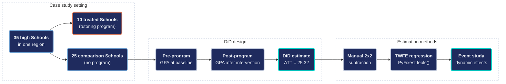
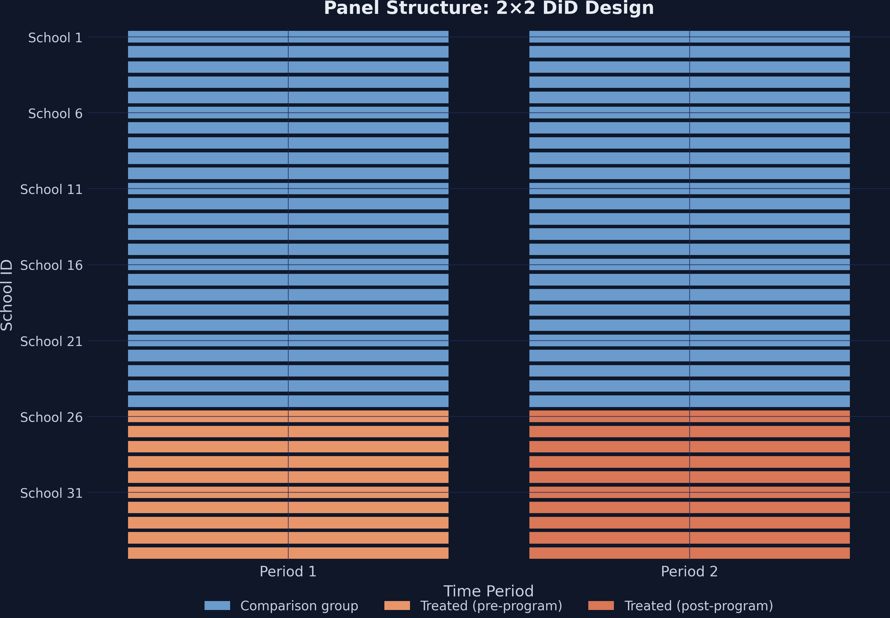
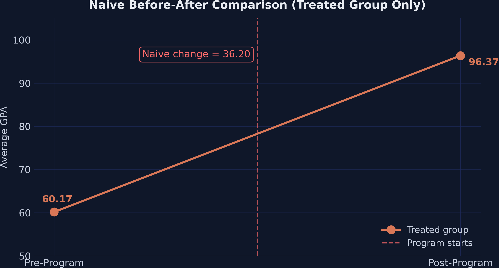
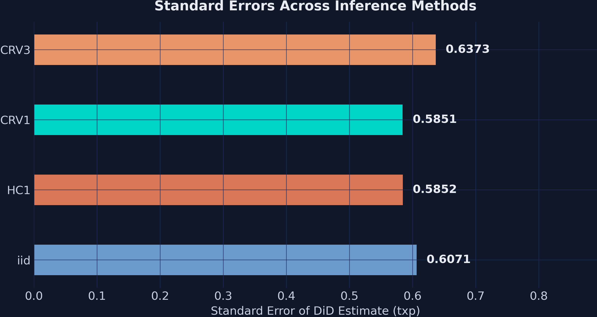
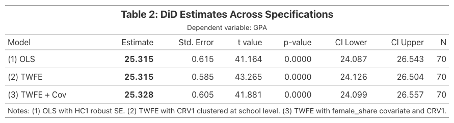
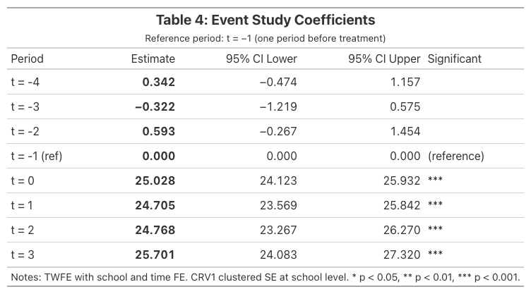

---
authors:
- admin
categories:
  - Python
  - Difference-in-Differences (DiD)
date: "2026-04-27T00:00:00Z"
draft: false
featured: false
image:
  caption: ""
  focal_point: "Smart"
  placement: 3
  preview_only: false
links:
- icon: spotify
  icon_pack: fab
  name: "Podcast"
  url: https://open.spotify.com/episode/7dxl297Eflm60F76p88MoF
- icon: youtube
  icon_pack: fab
  name: "Video overview"
  url: https://www.youtube.com/watch?v=VnSwS0g-jTE
- icon: youtube
  icon_pack: fab
  name: "Video overview (2)"
  url: https://www.youtube.com/watch?v=qObP9bGU5rM
- icon: chalkboard-teacher
  icon_pack: fas
  name: "Slides (HTML)"
  url: slides/index.html
- icon: file-pdf
  icon_pack: fas
  name: "AI Slides (PDF)"
  url: https://carlos-mendez.org/tutorials/python_did101/slides/ai-slides.pdf
- icon: poll
  icon_pack: fas
  name: "Interactive slides (AhaSlides)"
  url: https://presenter.ahaslides.com/share/1790995456625-cj6th2dfd9
- icon: laptop-code
  icon_pack: fas
  name: Web app
  url: web_app/index.html
- icon: code
  icon_pack: fas
  name: "Python script"
  url: script.py
- icon: bolt
  icon_pack: fas
  name: "Python cheat sheet"
  url: cheatsheet_python.py
- icon: bolt
  icon_pack: fas
  name: "R cheat sheet"
  url: cheatsheet_R.R
- icon: bolt
  icon_pack: fas
  name: "Stata cheat sheet"
  url: cheatsheet_stata.do
- icon: file-code
  icon_pack: fas
  name: "Stata do-file"
  url: analysis.do
- icon: file-code
  icon_pack: fas
  name: "Quarto project (.zip)"
  url: python_did101.zip
- icon: database
  icon_pack: fas
  name: "Dataset (2x2)"
  url: https://github.com/quarcs-lab/data-open/raw/master/isds/tutoring_did.dta
- icon: database
  icon_pack: fas
  name: "Dataset (Event Study)"
  url: https://github.com/quarcs-lab/data-open/raw/master/isds/tutoring_didevent.dta
- icon: book
  icon_pack: fas
  name: "Data dictionary"
  url: data/index.html
- icon: google-colab
  icon_pack: ai
  name: "Google Colab"
  url: https://colab.research.google.com/github/cmg777/starter-academic-v501/blob/master/content/tutorials/python_did101/notebook.ipynb
- icon: markdown
  icon_pack: fab
  name: "MD version"
  url: https://raw.githubusercontent.com/cmg777/starter-academic-v501/master/content/tutorials/python_did101/index.md
summary: "Did an after-school tutoring program really raise student grades, or were grades rising everywhere? This Python tutorial compares 10 tutored high schools with 25 others, before and after the program, to separate its effect from the general upward trend. It comes with an interactive app that runs in your web browser."
tags:
- python
- causal
- did
- panel
- education
- pyfixest
- panel data
title: "Introduction to Difference-in-Differences (DiD) in Python"
toc: true
diagram: true
---

<div style="background:#0e1545; border-radius:12px; padding:8px;">
<iframe style="border-radius:8px" src="https://open.spotify.com/embed/episode/7dxl297Eflm60F76p88MoF?utm_source=generator&theme=0" width="100%" height="152" frameBorder="0" allowfullscreen="" allow="autoplay; clipboard-write; encrypted-media; fullscreen; picture-in-picture" loading="lazy"></iframe>
</div>

## Abstract

Evaluating whether an educational intervention works is difficult because outcomes often drift upward for reasons unrelated to the program. A simple before-after comparison therefore conflates the treatment effect with secular trends. This tutorial introduces the Difference-in-Differences (DiD) design in Python as a method to recover the causal effect of an after-school tutoring program on student performance. It uses the simulated case study of Corral and Yang (2024), in which 10 of 35 high schools in one region adopt a tutoring program. The outcome is the average GPA of low-income students, measured on a nominal 0–100 scale. The 2×2 dataset has 70 observations (35 schools over 2 periods), and an event-study extension has 280 observations across 8 periods. Estimation proceeds through manual 2×2 double differencing, classical OLS with a treated×post interaction, and two-way fixed effects (TWFE) with the PyFixest package. The tutorial also compares iid, HC1, CRV1, and CRV3 standard errors and builds publication-quality tables with etable() and Great Tables. The naive before-after change of 36.20 GPA points overstates the effect by 43%, because 10.88 points reflect a region-wide trend. DiD isolates an ATT of 25.32 points, which is stable across specifications (25.315 to 25.328), with an R² near 0.995. The event study shows small and statistically insignificant pre-period coefficients (0.34, −0.32, 0.59). These estimates are consistent with parallel trends, although they do not prove it. The post-treatment effect appears in the first treated period and stays roughly flat, between 24.71 and 25.70. The results demonstrate that valid causal conclusions depend on a credible comparison group and a clean research design, not on the choice of variance estimator.

## 1. Overview

How much does an after-school tutoring program improve student performance? A school district implemented a new after-school tutoring program in 10 of its 35 high schools. After one year, the average GPA in the tutored schools rose from **60.17** to **96.37**, an increase of **36.20** points. At first sight, this large gain appears to measure the effect of the program.

This conclusion is premature. Over the same period, GPA also rose in the 25 schools that *did not* receive the program, from **71.22** to **82.10**. Part of the improvement in the tutored schools therefore reflects a region-wide upward trend. **Difference-in-Differences (DiD)** removes this common trend and recovers the true causal effect of the tutoring program: an **ATT of approximately 25.32 GPA points**.

This tutorial demonstrates DiD estimation in Python with [PyFixest](https://pyfixest.org/), a fast econometrics package with a Stata-like syntax. It uses [Great Tables](https://posit-dev.github.io/great-tables/) to produce publication-quality output. The analysis relies on the simulated case study of [Corral and Yang (2024)](https://doi.org/10.1007/s12564-024-09959-0). The same dataset appears in the [Stata companion tutorial](/tutorials/stata_did/).

### 1.1 Learning objectives

By the end of this tutorial, you will be able to:

- Explain why **naive before-after comparisons overstate** treatment effects
- Compute **2×2 DiD manually** and with the `feols()` function of PyFixest
- Estimate DiD using **multiple equivalent approaches** with a unified formula syntax
- Compare inference under **iid, HC1, CRV1, and CRV3** standard errors
- Build **publication-quality regression tables** with `etable()` and Great Tables
- Estimate and plot **event study models** with `i()` for dynamic treatment effects

### 1.2 Study design



The data have a clean **panel structure**. Each of the 35 schools is observed in two time periods (pre and post), which yields 70 observations for the 2×2 design. A second dataset extends the panel to 8 periods (280 observations) for the event-study analysis.

### 1.3 Key concepts at a glance

The post relies repeatedly on a small vocabulary. Later sections assume that you can move between these terms with ease. Each concept below has three parts: a **definition**, an **example**, and an **analogy**. The definition is always visible, while the example and the analogy sit behind clickable cards. Open the cards when you need them, and leave them collapsed for a quick scan. If a later section mentions "parallel trends" or "event study" and the term feels unclear, return to this section.

**1. Difference-in-Differences (DiD).**
The 2×2 estimator. Compare the change in outcomes for the treated group to the change in outcomes for an untreated control group. The difference of those two differences is the causal estimate. DiD nets out time-invariant differences between groups AND time trends shared by both.

<div class="concept-pair">
<details class="concept-card concept-example">
<summary>Example</summary>

The average `gpa` of treated schools rose from 60.17 to 96.37, a 36.20-point change. Control schools rose from 71.22 to 82.10, a 10.88-point change. The DiD ATT is $36.20 - 10.88 = 25.32$ GPA points. The control change is the secular trend; subtracting it isolates the effect of the program.

</details>

<details class="concept-card concept-analogy">
<summary>Analogy</summary>

Subtract the secular drift that affects everyone before judging the treatment. If the GPA of the whole school district rose 11 points due to a new curriculum, you cannot credit that to your tutoring program. DiD subtracts the district-wide drift first.

</details>
</div>

**2. Parallel trends assumption.**
The identifying assumption: in the absence of treatment, the average outcomes of the treated and control groups would have followed the *same* trajectory. Differences in *levels* are fine. Differences in *changes* (slopes) would invalidate DiD.

<div class="concept-pair">
<details class="concept-card concept-example">
<summary>Example</summary>

The simulation generates data with parallel pre-trends by construction. In the 8-period extension, the pre-treatment event-study coefficients ($t = -4, -3, -2$) are small (0.34, −0.32, 0.59) and statistically insignificant; $t = -1$ is the reference period, so it is zero by construction. The data are *consistent with* parallel trends, but no test can prove the assumption: it is a claim about the unobserved post-period counterfactual of the treated schools.

</details>

<details class="concept-card concept-analogy">
<summary>Analogy</summary>

Sister cars on parallel tracks. They started at different speeds, but they accelerate identically. Without the treatment, both stay parallel. With the treatment, the treated car accelerates more, and we measure that extra acceleration.

</details>
</div>

**3. ATT** $E[Y(1) - Y(0) \mid D=1]$.
Average Treatment effect on the Treated. The mean causal effect for the units that *actually got* the treatment. DiD identifies the ATT (not the ATE) under parallel trends. ATT and ATE diverge when treatment effects vary in ways correlated with selection into treatment.

<div class="concept-pair">
<details class="concept-card concept-example">
<summary>Example</summary>

The DiD estimate of 25.32 GPA points is the ATT for treated schools. It says: the *average* effect of the program *for schools that received it* is 25.32 points. Schools that did not receive treatment may have responded differently; DiD says nothing about them.

</details>

<details class="concept-card concept-analogy">
<summary>Analogy</summary>

The bump on the treated track. Both cars drove the same distance with the engine off. With the engine on, the treated car gains 25 extra mph. That extra is for *that car*, not "any car you might pick."

</details>
</div>

**4. Counterfactual.**
The hypothetical outcome the treated unit would have had *without* treatment. Never observed directly. DiD constructs it as: "treated pre-period level + secular change of the control group."

<div class="concept-pair">
<details class="concept-card concept-example">
<summary>Example</summary>

For treated schools, the post-period counterfactual is $60.17 + 10.88 = 71.05$ GPA points, which is what we would expect if the schools had drifted with the trend of the control group. The actual post-period mean is 96.37; the gap (25.32) is the ATT.

</details>

<details class="concept-card concept-analogy">
<summary>Analogy</summary>

The path the treated track *would* have taken. We never see the parallel-universe version of the treated schools where they did not receive tutoring. We reconstruct it from "their starting point plus the drift of the control group."

</details>
</div>

**5. Two-Way Fixed Effects (TWFE)** $\alpha\_i + \delta\_t$.
The regression implementation of DiD with multiple periods or multiple groups. Includes a fixed effect for each unit and a fixed effect for each time period. The coefficient on the treatment-period interaction is the DiD estimate.

<div class="concept-pair">
<details class="concept-card concept-example">
<summary>Example</summary>

The 2×2 TWFE specification with fixed effects on `id` and `time` and the regressor `txp` returns the same 25.32 ATT as the manual difference-of-differences calculation. TWFE extends mechanically to more periods, which the manual 2×2 does not. One warning: with *staggered* adoption and effects that differ across adoption cohorts or over time, TWFE can be badly biased (see Section 14.2). With a single adoption date, as here, it is fine.

</details>

<details class="concept-card concept-analogy">
<summary>Analogy</summary>

Wiping the negative twice. First wipe removes school-specific stains (their starting GPA, demographics). Second wipe removes period-specific glare (district-wide policy shocks). What remains is the change attributable to the treatment.

</details>
</div>

**6. Event study.**
A dynamic specification that estimates a separate treatment effect for each period before and after the treatment date. Pre-treatment coefficients (leads) test parallel trends. Post-treatment coefficients (lags) trace out the dynamic effect.

<div class="concept-pair">
<details class="concept-card concept-example">
<summary>Example</summary>

The 8-period event-study specification returns near-zero coefficients for the pre-treatment leads and large positive coefficients for the post-treatment lags. The post-treatment coefficients stay roughly flat (25.03, 24.71, 24.77, 25.70): the effect appears in the first treated period and neither builds up nor fades.

</details>

<details class="concept-card concept-analogy">
<summary>Analogy</summary>

Recording the radio signal frame-by-frame. Instead of one big "before vs after" reading, you record each year separately. The pre-treatment frames should be silent. Post-treatment frames trace out the unfolding signal.

</details>
</div>

**7. Naive before-after comparison.**
The biased estimator: compute the pre-vs-post change of the treated group and call that the treatment effect. Ignores the control group. Equates "secular drift" with "treatment effect."

<div class="concept-pair">
<details class="concept-card concept-example">
<summary>Example</summary>

The naive before-after on the treated schools alone is $96.37 - 60.17 = 36.20$ GPA points. The DiD ATT is 25.32. The 10.88-point gap is the secular drift the naive estimator wrongly attributed to the program.

</details>

<details class="concept-card concept-analogy">
<summary>Analogy</summary>

Blaming the rooster for the sunrise. The rooster crows before sunrise; sunrise follows. But the rooster is not causing the sunrise. Naive before-after does not have a control rooster-free village to compare with.

</details>
</div>

**8. SUTVA** (Stable Unit Treatment Value Assumption).
Two parts. (a) *No interference*: the treatment status of one unit does not affect the outcome of another unit (no spillovers). (b) *Single version*: the treatment is "the same" treatment across units; no hidden variation. SUTVA is required for the potential-outcomes framework to make sense.

<div class="concept-pair">
<details class="concept-card concept-example">
<summary>Example</summary>

SUTVA assumes that the tutoring program of one school does not boost or depress the `gpa` of neighboring schools (no interference) and that all 10 treated schools received the *same* program (single version). The simulation enforces both by construction. In field data, SUTVA is mostly argued from institutional knowledge (how students are assigned to schools, whether tutors or funds were shared). Spillovers can sometimes be probed, for example by comparing untreated schools near and far from treated ones, but SUTVA cannot be fully tested.

</details>

<details class="concept-card concept-analogy">
<summary>Analogy</summary>

No contagion between patients. Patient A taking the drug should not affect the outcome of Patient B. If they live in the same household and share medication, SUTVA fails. The "no spillover" assumption is the medical version.

</details>
</div>

---

## 2. Setup and Imports

Install the required packages. The versions below are the ones that produced every output in this post:

```bash
pip install pyfixest==0.50.1 great_tables==0.21.0 pandas==2.2.2 numpy==1.26.4 matplotlib==3.9.2
```

Pinning the versions matters here, because PyFixest evolves quickly. Other releases label coefficients differently (for example, `timeToTreat::-4.0` instead of `C(timeToTreat, contr.treatment(base=-1))[T.-4.0]`), or they reject formula syntax that older releases accepted. In addition, exporting a Great Tables table to PNG with `.save()` requires `selenium` and a Chrome browser.

Import the libraries:

```python
import numpy as np
import pandas as pd
import matplotlib.pyplot as plt
import pyfixest as pf
from great_tables import GT, md, style, loc
```

| Package | Purpose |
|---------|---------|
| `pyfixest` | Fast fixed-effects estimation with Stata-like formula syntax |
| `great_tables` | Publication-quality HTML/PNG tables from DataFrames |
| `pandas` | Data loading, manipulation, and summary statistics |
| `matplotlib` | Custom figure generation with dark theme styling |

<details>
<summary><strong>Dark theme figure styling</strong> (click to expand)</summary>

```python
# Site color palette
STEEL_BLUE = "#6a9bcc"
WARM_ORANGE = "#d97757"
NEAR_BLACK = "#141413"
TEAL = "#00d4c8"

# Dark theme palette
DARK_NAVY = "#0f1729"
GRID_LINE = "#1f2b5e"
LIGHT_TEXT = "#c8d0e0"
WHITE_TEXT = "#e8ecf2"

plt.rcParams.update({
    "figure.facecolor": DARK_NAVY,
    "axes.facecolor": DARK_NAVY,
    "axes.edgecolor": DARK_NAVY,
    "axes.linewidth": 0,
    "axes.labelcolor": LIGHT_TEXT,
    "axes.titlecolor": WHITE_TEXT,
    "axes.spines.top": False,
    "axes.spines.right": False,
    "axes.spines.left": False,
    "axes.spines.bottom": False,
    "axes.grid": True,
    "grid.color": GRID_LINE,
    "grid.linewidth": 0.6,
    "grid.alpha": 0.8,
    "xtick.color": LIGHT_TEXT,
    "ytick.color": LIGHT_TEXT,
    "text.color": WHITE_TEXT,
    "font.size": 12,
    "legend.frameon": False,
    "savefig.facecolor": DARK_NAVY,
})
```

</details>


## 3. Data Loading and Exploration

We load the 2×2 dataset directly from GitHub. This Stata `.dta` file contains 35 schools observed across 2 time periods:

```python
url_did = "https://github.com/quarcs-lab/data-open/raw/master/isds/tutoring_did.dta"
df = pd.read_stata(url_did).astype(float)
print(df.shape)
print(df.dtypes)
```

```text
(70, 7)

id              float64
time            float64
treated         float64
post            float64
txp             float64
gpa             float64
female_share    float64
dtype: object
```

The dataset has **70 observations** (35 schools × 2 periods) and **7 variables**:

- `id`: School identifier (1–35)
- `time`: Time period (1 = pre, 2 = post)
- `treated`: Treatment indicator (1 = received tutoring program)
- `post`: Post-period indicator (1 = after program implementation)
- `txp`: Interaction term (treated × post)
- `gpa`: Outcome, the average GPA of low-income students (nominally a 0–100 score)
- `female_share`: Share of female students (covariate)

```python
print(df.describe().round(2))
```

```text
          id  time  treated  post    txp    gpa  female_share
count  70.00  70.0    70.00  70.0  70.00  70.00         70.00
mean   18.00   1.5     0.29   0.5   0.14  77.12          0.53
std    10.17   0.5     0.46   0.5   0.35  10.88          0.03
min     1.00   1.0     0.00   0.0   0.00  59.39          0.47
25%     9.25   1.0     0.00   0.0   0.00  70.68          0.51
50%    18.00   1.5     0.00   0.5   0.00  76.27          0.53
75%    26.75   2.0     1.00   1.0   0.00  82.66          0.55
max    35.00   2.0     1.00   1.0   1.00  99.15          0.57
```

A crosstab confirms the balanced 2×2 design:

```python
ct = pd.crosstab(df["treated"], df["post"], margins=True)
ct.index = ["Comparison (0)", "Treated (1)", "Total"]
ct.columns = ["Pre (0)", "Post (1)", "Total"]
print(ct)
```

```text
                Pre (0)  Post (1)  Total
Comparison (0)       25        25     50
Treated (1)          10        10     20
Total                35        35     70
```

The sample contains **10 treated schools** observed in 2 periods (20 observations) and **25 comparison schools** (50 observations). The panel is perfectly balanced, because every school appears exactly once in each period. This balance simplifies the comparison of group means in the sections that follow.

### 3.1 Panel structure visualization

The heatmap below shows the treatment assignment across schools and time. Steel-blue cells represent the comparison group, and orange cells indicate treated schools in the post-program period. The figure therefore summarizes the entire design in a single view.



This is a *clean* 2×2 design. Treatment timing is simultaneous, because all 10 schools receive the program at the same time. Treatment is also an absorbing state: once a school starts the program, it stays treated, and no comparison school ever adopts it.


## 4. The Problem with Naive Comparisons

The most intuitive approach to measuring the effect of the program is a simple before-after comparison for the treated schools:

```python
treated_means = df[df["treated"] == 1].groupby("post")["gpa"].mean()
print(f"Pre-program:  {treated_means[0]:.2f}")
print(f"Post-program: {treated_means[1]:.2f}")
print(f"Naive change: {treated_means[1] - treated_means[0]:.2f}")
```

```text
Pre-program:  60.17
Post-program: 96.37
Naive change: 36.20
```

The naive estimate suggests that the program raised GPA by **36.20 points**. This estimate, however, ignores everything else that may have changed over the same period, such as curriculum reforms, new textbooks, regional economic shifts, or the maturation of students. Any of these factors could drive GPA upward in *all* schools, not only in the treated ones.



The naive approach therefore *overstates* the effect of the program. It conflates the treatment effect with time trends that would have occurred regardless of the program. A credible estimate requires a group that reveals what these trends would have been without treatment.


## 5. The DiD Design: Using a Comparison Group

The key insight of DiD is to use the **comparison group** as a mirror. The comparison group shows what would have happened to the treated schools *without* the program. We first compute all four group means:

<div class="learn-card predict-card">
<p class="learn-card-kicker">Predict first</p>

The 25 comparison schools never received tutoring. Between the two periods, did their average GPA rise, fall, or stay flat? And will the DiD effect turn out larger or smaller than the naive 36.20 points? Commit to an answer before scrolling.

<details class="learn-card-reveal">
<summary>Reveal the answer</summary>

**Answer.** Their GPA rose by 10.88 points (71.22 to 82.10) without any program. That region-wide drift is also part of the 36.20-point gain of the treated schools, so the DiD effect is smaller: $36.20 - 10.88 = 25.32$ points.

</details>
</div>

```python
means = df.groupby(["treated", "post"])["gpa"].mean()
# Round to 2 decimals so the hand arithmetic below matches the printed means
pre_control  = round(means[(0, 0)], 2)   # 71.22
post_control = round(means[(0, 1)], 2)   # 82.10
pre_treated  = round(means[(1, 0)], 2)   # 60.17
post_treated = round(means[(1, 1)], 2)   # 96.37
```

```text
Group means:
  Comparison Pre:  71.22
  Comparison Post: 82.10
  Treated Pre:     60.17
  Treated Post:    96.37
```

The GPA of the comparison schools rose by **10.88 points** (from 71.22 to 82.10). This increase is the *secular trend*. We assume that the treated schools would have experienced the same trend in the absence of the program. This assumption yields the **counterfactual**:

```python
counterfactual = pre_treated + (post_control - pre_control)
did_estimate = post_treated - counterfactual
print(f"Counterfactual: {pre_treated:.2f} + ({post_control:.2f} - {pre_control:.2f}) = {counterfactual:.2f}")
print(f"DiD estimate:   {post_treated:.2f} - {counterfactual:.2f} = {did_estimate:.2f}")
```

```text
Counterfactual: 60.17 + (82.10 - 71.22) = 71.05
DiD estimate:   96.37 - 71.05 = 25.32
```

The causal effect of the tutoring program is therefore **25.32 GPA points**, not 36.20. This figure uses the rounded means. With unrounded means, the DiD is 25.315, which is exactly the regression coefficient in Section 7, and the common trend is 10.886. The naive approach overstated the effect by **43%** ($36.20 / 25.32 \approx 1.43$), because it attributed the 10.88-point common trend entirely to the program.


### 5.1 The parallel trends assumption

DiD rests on one critical assumption: **parallel trends**. In the absence of treatment, the treated and comparison groups would have followed the *same trajectory* over time. Formally:

$$E[Y\_{i,1}(0) - Y\_{i,0}(0) \mid D=1] = E[Y\_{i,1}(0) - Y\_{i,0}(0) \mid D=0]$$

In words, the *change* in untreated potential outcomes is the same for both groups. Consider two runners on parallel tracks. They may start at different positions (the treated schools have a lower baseline GPA), but they run at the same pace. If one runner suddenly speeds up after receiving coaching, the difference between the new speed of that runner and the speed of the other runner measures the coaching effect.

Note what parallel trends does *not* require. The two groups do not need the same *level* of GPA; they need only the same *trend*. This feature explains the power of DiD, because the design naturally absorbs time-invariant differences between groups, such as school quality or student demographics.

### 5.2 SUTVA

The **Stable Unit Treatment Value Assumption (SUTVA)** requires that the treatment of one school does not affect the outcome of another school. If untreated schools lost students to tutored schools, or if tutored schools drew resources away from comparison schools, the DiD estimate would be biased. The simulated data rule out such spillovers by construction. In a real evaluation, you would need to defend the assumption by examining how students are assigned to schools and whether tutors or funding were shared across schools.


## 6. Manual DiD Calculation

We can organize the four group means into a 2×2 table and compute the DiD as a *double difference*:

```python
means_table = df.groupby(["treated", "post"])["gpa"].mean().round(2).unstack()
means_table.index = ["Comparison (0)", "Treated (1)"]
means_table.columns = ["Pre (0)", "Post (1)"]
means_table["Difference"] = means_table["Post (1)"] - means_table["Pre (0)"]
print(means_table)
```

```text
                Pre (0)  Post (1)  Difference
Comparison (0)    71.22     82.10       10.88
Treated (1)       60.17     96.37       36.20
```

The DiD formula takes the *difference of differences*:

$$DiD = \Big(E[Y\_{i,1} \mid D=1] - E[Y\_{i,0} \mid D=1]\Big) - \Big(E[Y\_{i,1} \mid D=0] - E[Y\_{i,0} \mid D=0]\Big)$$

Plugging in the numbers:

$$DiD = (96.37 - 60.17) - (82.10 - 71.22) = 36.20 - 10.88 = 25.32$$

The logic is straightforward. The treated schools improved by 36.20 points, but 10.88 of those points would have occurred anyway, as the comparison group shows. The remaining **25.32 points** are the causal effect of the tutoring program.

The runner analogy makes the same point. The treated runner sped up by 36.20 units, while the comparison runner sped up by 10.88 units. The coaching effect is the extra 25.32 units of speed that only the coached runner gained.


## 7. DiD via Regression

### 7.1 Classical OLS with interaction

The manual calculation is equivalent to an OLS regression with the treatment indicator, time indicator, and their interaction:

$$Y\_{it} = \alpha + \beta\_1 \text{Treat}\_i + \beta\_2 \text{Post}\_t + \beta\_3 (\text{Treat}\_i \times \text{Post}\_t) + \varepsilon\_{it}$$

Where:
- $\alpha$ is the pre-period mean of the comparison group (intercept)
- $\beta\_1$ captures the baseline difference between groups
- $\beta\_2$ captures the common time trend
- $\beta\_3$ is the **DiD estimate**, the causal effect of treatment

In PyFixest, the `feols()` function handles this with a familiar formula syntax:

```python
fit_ols = pf.feols("gpa ~ treated + post + txp", data=df, vcov="HC1")
print(fit_ols.summary())
```

```text
Estimation:  OLS
Dep. var.: gpa
sample: None = all
Inference:  HC1
Observations:  70

| Coefficient   |   Estimate |   Std. Error |   t value |   Pr(>|t|) |    2.5% |   97.5% |
|:--------------|-----------:|-------------:|----------:|-----------:|--------:|--------:|
| Intercept     |     71.215 |        0.218 |   326.123 |      0.000 |  70.779 |  71.651 |
| treated       |    -11.049 |        0.288 |   -38.388 |      0.000 | -11.624 | -10.475 |
| post          |     10.886 |        0.339 |    32.116 |      0.000 |  10.209 |  11.563 |
| txp           |     25.315 |        0.615 |    41.164 |      0.000 |  24.087 |  26.543 |
---
RMSE: 1.15 R2: 0.989
```

Every coefficient maps directly to our group means:

- **Intercept (71.22)**: Comparison group pre-period mean
- **treated (−11.05)**: Treated schools start 11 points *below* comparison schools
- **post (10.89)**: Common time trend (the improvement of the comparison group; 10.886 unrounded, while the 10.88 used earlier is the difference of the rounded means $82.10 - 71.22$)
- **txp (25.32)**: The DiD estimate, matching our manual calculation

The `vcov="HC1"` option requests heteroskedasticity-robust (White) standard errors. HC1 is a sensible default for cross-sectional data. In this panel, however, each school appears twice, and HC1 treats those two observations as independent. Section 7.2 therefore switches to standard errors clustered by school, which allow for this within-school correlation.

### 7.2 TWFE with fixed effects

A more flexible approach absorbs school-level and time-level heterogeneity using **two-way fixed effects (TWFE)**. PyFixest uses the `|` pipe syntax to specify absorbed fixed effects:

$$Y\_{it} = \beta\_3 (\text{Treat}\_i \times \text{Post}\_t) + \gamma\_i + \vartheta\_t + \varepsilon\_{it}$$

Here, $\gamma\_i$ denotes school fixed effects, which absorb all time-invariant school characteristics. Similarly, $\vartheta\_t$ denotes time fixed effects, which absorb all common time shocks. Because `treated` is perfectly collinear with $\gamma\_i$ and `post` is perfectly collinear with $\vartheta\_t$, only the interaction term `txp` remains:

<div class="learn-card predict-card">
<p class="learn-card-kicker">Predict first</p>

We are replacing `treated` and `post` with a full set of school and period fixed effects, and switching to standard errors clustered by school. Will the DiD coefficient change? Will its standard error? Commit to an answer before scrolling.

<details class="learn-card-reveal">
<summary>Reveal the answer</summary>

**Answer.** The coefficient does not move: it is 25.315 in both models, because in a balanced 2×2 panel the school effects absorb `treated` and the period effects absorb `post` without changing the interaction. The standard error does change, from 0.615 (HC1) to 0.585 (CRV1 by school), because it now allows the two observations of each school to be correlated.

</details>
</div>

```python
fit_twfe = pf.feols("gpa ~ txp | id + time", data=df, vcov={"CRV1": "id"})
print(fit_twfe.summary())
```

```text
Estimation:  OLS
Dep. var.: gpa, Fixed effects: id + time
sample: None = all
Inference:  CRV1
Observations:  70

| Coefficient   |   Estimate |   Std. Error |   t value |   Pr(>|t|) |   2.5% |   97.5% |
|:--------------|-----------:|-------------:|----------:|-----------:|-------:|--------:|
| txp           |     25.315 |        0.585 |    43.265 |      0.000 | 24.126 |  26.504 |
---
RMSE: 0.788 R2: 0.995 R2 Within: 0.981
```

The estimate is unchanged at **25.315**. The standard errors, however, now use **CRV1 (cluster-robust variance)** clustered at the school level. This is the appropriate choice when treatment varies at the school level and observations within the same school are correlated.

The formula `"gpa ~ txp | id + time"` illustrates a key strength of PyFixest. Everything to the left of `|` is estimated, and everything to the right is *absorbed*. As a result, there is no need to create dummy variables manually.

### 7.3 TWFE with covariate

We can add `female_share` as a time-varying covariate to check robustness:

<div class="learn-card predict-card">
<p class="learn-card-kicker">Predict first</p>

`female_share` changes a little within each school over time. Once it enters the TWFE model, will the DiD estimate move by more than one GPA point? Commit to an answer before scrolling.

<details class="learn-card-reveal">
<summary>Reveal the answer</summary>

**Answer.** No. The estimate moves from 25.315 to 25.328, a shift of 0.013 points, and `female_share` itself is insignificant (p = 0.714). Within-school changes in the share of female students do not predict GPA changes in these data.

</details>
</div>

```python
fit_cov = pf.feols("gpa ~ txp + female_share | id + time", data=df,
                    vcov={"CRV1": "id"})
print(fit_cov.summary())
```

```text
Estimation:  OLS
Dep. var.: gpa, Fixed effects: id + time
sample: None = all
Inference:  CRV1
Observations:  70

| Coefficient   |   Estimate |   Std. Error |   t value |   Pr(>|t|) |    2.5% |   97.5% |
|:--------------|-----------:|-------------:|----------:|-----------:|--------:|--------:|
| txp           |     25.328 |        0.605 |    41.881 |      0.000 |  24.099 |  26.557 |
| female_share  |     -3.216 |        8.700 |    -0.370 |      0.714 | -20.898 |  14.465 |
---
RMSE: 0.785 R2: 0.995 R2 Within: 0.982
```

Adding `female_share` barely changes the DiD estimate (25.315 → 25.328, a shift of only 0.013). The covariate itself is statistically insignificant (p = 0.714). This result does not show that the fixed effects "already capture" everything relevant. It shows only that, once school and period effects are removed, the small within-school changes in `female_share` do not predict changes in GPA. The reassuring finding is the stability of the DiD coefficient.

One caution applies whenever you add time-varying covariates to a DiD model. If the program itself could change the covariate (for example, if tutoring attracted more female students), controlling for it would absorb part of the effect that you want to measure. Such **bad controls** should be measured before treatment or left out of the model.

### 7.4 Programmatic access to results

PyFixest provides tidy methods for extracting specific quantities. These methods are useful for post-estimation workflows and for building custom tables:

```python
print(f"Coefficient:   {fit_twfe.coef().values[0]:.4f}")
print(f"Std. Error:    {fit_twfe.se().values[0]:.4f}")
print(f"t-statistic:   {fit_twfe.tstat().values[0]:.4f}")
print(f"p-value:       {fit_twfe.pvalue().values[0]:.4f}")
print(f"95% CI:        [{fit_twfe.confint().values[0, 0]:.2f}, {fit_twfe.confint().values[0, 1]:.2f}]")
```

```text
Coefficient:   25.3149
Std. Error:    0.5851
t-statistic:   43.2655
p-value:       0.0000
95% CI:        [24.13, 26.50]
```

The `.tidy()` method returns a full DataFrame of results:

```python
print(fit_twfe.tidy())
```

```text
              Estimate  Std. Error    t value  Pr(>|t|)       2.5%      97.5%
Coefficient
txp          25.314897    0.585106  43.265472       0.0  24.125818  26.503976
```

### 7.5 Comparison across specifications

All three specifications produce essentially the same DiD estimate:

| Method | Estimate | Std. Error | 95% CI | SE Type |
|--------|----------|------------|--------|---------|
| OLS / HC1 | 25.315 | 0.615 | [24.09, 26.54] | Heteroskedasticity-robust |
| TWFE / CRV1 | 25.315 | 0.585 | [24.13, 26.50] | Cluster-robust (school) |
| TWFE + Cov / CRV1 | 25.328 | 0.605 | [24.10, 26.56] | Cluster-robust (school) |

The point estimates range from 25.315 to 25.328, a difference of only 0.013 GPA points. The design, through treatment assignment and fixed effects, drives the result. The choice of specification, by contrast, has a negligible impact on the estimate.


## 8. Inference Comparison

A further strength of PyFixest is the ability to compare different inference approaches on the same model quickly. Here, we estimate the TWFE model four times, each time with a different variance-covariance estimator:

<div class="learn-card predict-card">
<p class="learn-card-kicker">Predict first</p>

The point estimate is 25.315 under all four estimators. Which of iid, HC1, CRV1 and CRV3 will report the largest standard error, and will any of them make the effect insignificant? Commit to an answer before scrolling.

<details class="learn-card-reveal">
<summary>Reveal the answer</summary>

**Answer.** CRV3 is the largest (0.637), followed by iid (0.607); HC1 and CRV1 are nearly identical (0.585). None comes close to changing the conclusion: the smallest t-statistic is 39.72.

</details>
</div>

```python
vcov_types = {
    "iid":  "iid",
    "HC1":  "HC1",
    "CRV1": {"CRV1": "id"},
    "CRV3": {"CRV3": "id"},
}

for label, vcov_spec in vcov_types.items():
    fit_tmp = pf.feols("gpa ~ txp | id + time", data=df, vcov=vcov_spec)
    tidy = fit_tmp.tidy()
    txp_row = tidy[tidy.index == "txp"].iloc[0]
    print(f"  {label:5s}: SE = {txp_row['Std. Error']:.4f}, "
          f"t = {txp_row['t value']:.2f}, "
          f"p = {txp_row['Pr(>|t|)']:.4f}")
```

```text
  iid  : SE = 0.6071, t = 41.70, p = 0.0000
  HC1  : SE = 0.5852, t = 43.26, p = 0.0000
  CRV1 : SE = 0.5851, t = 43.27, p = 0.0000
  CRV3 : SE = 0.6373, t = 39.72, p = 0.0000
```

| SE Type | Description | SE | t-stat |
|---------|-------------|-----|--------|
| iid | Classical (assumes homoskedasticity) | 0.607 | 41.70 |
| HC1 | Heteroskedasticity-robust (White) | 0.585 | 43.26 |
| CRV1 | Cluster-robust at school level | 0.585 | 43.27 |
| CRV3 | Jackknife cluster-robust (leave one school out) | 0.637 | 39.72 |

- **iid** assumes independent errors with constant variance, which is rarely justified in panel data
- **HC1** allows for heteroskedasticity but not within-cluster correlation
- **CRV1** is the workhorse for panel data: it accounts for arbitrary within-school correlation
- **CRV3** is a jackknife version of CRV1: it re-estimates the model leaving out one school at a time. This corrects the tendency of CRV1 to understate uncertainty when clusters are few or some are very influential, and here it gives the largest SE



The key lesson is that **the choice of inference method matters less than the research design**. Standard errors range from 0.585 to 0.637, but all four methods produce p-values that are essentially zero. When the treatment effect is 25 GPA points and the largest SE is 0.64, the t-statistic still exceeds 39. The signal-to-noise ratio is so strong that the choice of variance estimator is practically irrelevant here.

In applications with smaller effects, the choice between CRV1 and CRV3 can determine whether a result is significant. What matters most is not the total of 35 clusters but the **10 treated clusters**. When few clusters are treated, CRV1 tends to understate uncertainty, even if the total number of clusters appears comfortable. CRV3 is the safer default. The wild cluster bootstrap is the standard remedy when treated clusters are few (MacKinnon, Nielsen and Webb, 2023); PyFixest offers it through `.wildboottest()`, which requires the optional `wildboottest` package. Exercise 4 computes how small the effect would have to be before the choice mattered here.


## 9. Publication-Quality Tables with etable() and Great Tables

### 9.1 Stepwise specifications with csw()

The `csw()` operator of PyFixest ("cumulative stepwise") estimates multiple specifications in a single call. For example, `csw(a, b)` fits one model with `a` and then a second model with `a + b`:

```python
fit_multi = pf.feols("gpa ~ csw(txp, female_share) | id + time",
                     data=df, vcov={"CRV1": "id"})
models_list = fit_multi.to_list()
```

This single line estimates **two models**: (1) `gpa ~ txp | id + time` and (2) `gpa ~ txp + female_share | id + time`. In Stata, the same task requires two separate regression commands, whereas PyFixest handles it in one formula. Recent PyFixest releases require at least two arguments inside `csw()` or `csw0()`. Consequently, the older shorthand `txp + csw0(female_share)` now raises an error.

### 9.2 etable() output

The `pf.etable()` function builds a regression table from a list of models. By default, it returns a Great Tables object, which renders as a formatted table in Jupyter or Quarto. In a plain Python session, you can request a pandas DataFrame with `type="df"`. The `coef_fmt` argument controls the content of each cell: `b*` prints the coefficient with significance stars, and `(se)` adds the standard error in parentheses:

```python
etable_df = pf.etable(models_list, type="df", coef_fmt="b* \n (se)")
print(etable_df.replace(r"\s*\n\s*", " ", regex=True).to_string())
```

```text
                                  gpa                   
                                  (1)                (2)
coef  txp           25.315*** (0.585)  25.328*** (0.605)
      female_share                        -3.216 (8.700)
fe     time                         x                  x
      id                            x                  x
stats Observations                 70                 70
      R²                        0.995              0.995
```

The table reports significance stars (`*` p < 0.05, `**` p < 0.01, `***` p < 0.001) and standard errors in parentheses. It also indicates which fixed effects each model includes and reports fit statistics. In a notebook, calling `pf.etable(models_list)` without `type` produces the same table as styled HTML.

### 9.3 Custom Great Tables table

For full control over formatting, we can build a table from the `.tidy()` DataFrames:

```python
rows = []
for name, fit in [("(1) OLS", fit_ols),
                  ("(2) TWFE", fit_twfe),
                  ("(3) TWFE + Cov", fit_cov)]:
    tidy = fit.tidy()
    txp_row = tidy[tidy.index == "txp"].iloc[0]
    rows.append({
        "Model": name,
        "Estimate": txp_row["Estimate"],
        "Std. Error": txp_row["Std. Error"],
        "t value": txp_row["t value"],
        "p-value": txp_row["Pr(>|t|)"],
        "95% CI Lower": txp_row["2.5%"],
        "95% CI Upper": txp_row["97.5%"],
        "N": fit._N,
    })

gt_df = pd.DataFrame(rows)
gt_table = (
    GT(gt_df)
    .tab_header(
        title=md("**Table 2: DiD Estimates Across Specifications**"),
        subtitle="Dependent variable: GPA"
    )
    .fmt_number(columns=["Estimate", "Std. Error", "t value",
                         "95% CI Lower", "95% CI Upper"], decimals=3)
    .fmt_number(columns=["p-value"], decimals=4)
    .fmt_integer(columns=["N"])
    .tab_source_note(
        "Notes: (1) OLS with HC1 robust SE. (2) TWFE with CRV1 "
        "clustered at school level. (3) TWFE with female_share covariate and CRV1."
    )
)
gt_table.save("did101_table2.png")
```



Great Tables provides fine-grained control over number formatting (`.fmt_number()`), column labels (`.cols_label()`), headers (`.tab_header()`), and styling (`.tab_style()`). The `.save()` method exports the table to PNG through a headless browser. This export requires `selenium` and an installation of Chrome.

### 9.4 Exporting LaTeX tables for manuscripts

Academic journals usually require LaTeX tables rather than HTML or PNG files. The `etable()` function of PyFixest generates publication-ready LaTeX directly when you set `type="tex"`. The output uses `booktabs` for clean horizontal rules and `threeparttable` for properly aligned footnotes. This format is the standard that most economics and social science journals expect.

```python
latex_output = pf.etable(
    [fit_ols, fit_twfe, fit_cov],
    type="tex",
    coef_fmt="b* \n (se)",  # "*" after b adds significance stars
    labels={
        "txp": "Treatment $\\times$ Post",
        "treated": "Treatment",
        "post": "Post",
        "female_share": "Female Share",
        "Intercept": "Constant",
    },
    notes="Standard errors in parentheses. * p<0.05, ** p<0.01, *** p<0.001.",
)
print(latex_output)
```

```text
\begin{threeparttable}
\begingroup
\renewcommand\cellalign{t}
\renewcommand\arraystretch{1}
\setlength{\tabcolsep}{3pt}
\begin{tabularx}{\linewidth}{@{}>{\raggedright\arraybackslash}l>{\centering\arraybackslash}X>{\centering\arraybackslash}X>{\centering\arraybackslash}X}
\toprule
 & \multicolumn{3}{c}{gpa} \\
\cmidrule(lr){2-4}
 & (1) & (2) & (3) \\
\midrule
\addlinespace[1ex]
Treatment & \makecell{-11.049*** \\ (0.288)} &  &  \\
\addlinespace[0.5ex]
\addlinespace[0.5ex]
Post & \makecell{10.886*** \\ (0.339)} &  &  \\
\addlinespace[0.5ex]
\addlinespace[0.5ex]
Treatment $\times$ Post & \makecell{25.315*** \\ (0.615)} & \makecell{25.315*** \\ (0.585)} & \makecell{25.328*** \\ (0.605)} \\
\addlinespace[0.5ex]
\addlinespace[0.5ex]
Female Share &  &  & \makecell{-3.216 \\ (8.700)} \\
\addlinespace[0.5ex]
\addlinespace[0.5ex]
Constant & \makecell{71.215*** \\ (0.218)} &  &  \\
\addlinespace[0.5ex]
\midrule
\addlinespace[1ex]
 time & - & x & x \\
\addlinespace[0.5ex]
\addlinespace[0.5ex]
id  & - & x & x \\
\addlinespace[0.5ex]
\midrule
\addlinespace[1ex]
Observations & 70 & 70 & 70 \\
\addlinespace[0.5ex]
\addlinespace[0.5ex]
$R^2$ & 0.989 & 0.995 & 0.995 \\
\addlinespace[0.5ex]
\bottomrule
\end{tabularx}
\endgroup
\noindent\begin{minipage}{\linewidth}\smallskip\footnotesize
Standard errors in parentheses. * p<0.05, ** p<0.01, *** p<0.001.\end{minipage}
\end{threeparttable}
```

To save the table directly to a `.tex` file that you can `\input{}` in your manuscript, use the `file_name` parameter:

```python
pf.etable(
    [fit_ols, fit_twfe, fit_cov],
    type="tex",
    coef_fmt="b* \n (se)",  # "*" after b adds significance stars
    labels={
        "txp": "Treatment $\\times$ Post",
        "treated": "Treatment",
        "post": "Post",
        "female_share": "Female Share",
        "Intercept": "Constant",
    },
    notes="Standard errors in parentheses. * p<0.05, ** p<0.01, *** p<0.001.",
    file_name="did101_table2.tex",
)
```

This saves the file to `did101_table2.tex`. In your LaTeX manuscript, include it with:

```text
\begin{table}[htbp]
\centering
\caption{DiD Estimates Across Specifications}
\label{tab:did-results}
\input{did101_table2.tex}
\end{table}
```

The `labels` dictionary maps internal variable names to publication-friendly labels (e.g., `"txp"` becomes `"Treatment $\times$ Post"`). The `notes` parameter adds a footnote below the table. Your LaTeX document must load the `booktabs`, `makecell`, `tabularx`, and `threeparttable` packages in the preamble:

```text
\usepackage{booktabs}
\usepackage{makecell}
\usepackage{tabularx}
\usepackage{threeparttable}
```


## 10. Coefficient Comparison

A coefficient plot provides a visual comparison of the DiD estimate across specifications, including 95% confidence intervals:

```python
fig, ax = plt.subplots(figsize=(9, 5))
model_names = ["(1) OLS\nHC1", "(2) TWFE\nCRV1", "(3) TWFE+Cov\nCRV1"]
estimates = [fit.tidy().loc["txp", "Estimate"] for fit in [fit_ols, fit_twfe, fit_cov]]
ci_lower = [fit.tidy().loc["txp", "2.5%"] for fit in [fit_ols, fit_twfe, fit_cov]]
ci_upper = [fit.tidy().loc["txp", "97.5%"] for fit in [fit_ols, fit_twfe, fit_cov]]

ax.errorbar(estimates, range(3), xerr=[[e-l for e,l in zip(estimates, ci_lower)],
            [u-e for e,u in zip(estimates, ci_upper)]],
            fmt="o", color=TEAL, markersize=10, capsize=6, elinewidth=2)
ax.set_xlabel("DiD Estimate (txp coefficient)")
ax.set_title("Coefficient Comparison Across Specifications")
```


The point estimates are nearly identical, and the confidence intervals overlap across all three specifications. The estimates span a range of only 0.013 GPA points (25.315 to 25.328). This stability holds regardless of whether the model includes school fixed effects, time fixed effects, or time-varying covariates, which confirms that the DiD estimate is robust.


## 11. Event Study: Dynamic Treatment Effects

### 11.1 Loading the event study data

The 2×2 design reveals *whether* the program had an effect. It does not reveal *when* the effect began, or whether it grew or faded over time. The event-study dataset therefore extends the analysis to **8 time periods** (4 pre-treatment and 4 post-treatment):

```python
url_event = "https://github.com/quarcs-lab/data-open/raw/master/isds/tutoring_didevent.dta"
df_event = pd.read_stata(url_event).astype(float)
print(f"Shape: {df_event.shape}")
```

```text
Shape: (280, 8)
```

The new variable `timeToTreat` measures **periods relative to treatment onset** for the treated schools. Values from −4 to −1 denote pre-treatment periods, and values from 0 to 3 denote post-treatment periods. Untreated schools have `NaN` for this variable, because they are never treated.

```python
print(df_event["timeToTreat"].value_counts().sort_index())
```

```text
timeToTreat
-4.0    10
-3.0    10
-2.0    10
-1.0    10
 0.0    10
 1.0    10
 2.0    10
 3.0    10
```

Each of the 10 treated schools contributes one observation per relative time period. This structure yields 10 observations at each event time. The treated schools are therefore balanced in event time, just as they are in the 2×2 design.

One feature of the simulated outcome deserves attention. GPA is nominally a 0–100 score, yet 27 of the 280 school-periods in this file exceed 100, with a maximum of 107.68. All of them belong to the 10 treated schools after the program starts, because the simulation adds the treatment effect without capping the score. These values are therefore an artifact of the simulated data, not an error in the analysis, and they do not affect any estimate in this tutorial.


### 11.2 The event study specification

The event study model replaces the single `txp` interaction with a full set of **event-time indicators**, one for each period relative to treatment. We omit one period (the reference period, $t = -1$) to avoid perfect collinearity:

$$Y\_{it} = \sum\_{j=-4,\\, j \neq -1}^{3} \theta\_j \cdot D\_i \cdot \mathbf{1}[t - E\_i = j] + \gamma\_i + \vartheta\_t + \varepsilon\_{it}$$

Here, $D\_i = 1$ for the 10 treated schools, and $E\_i$ is the period in which school $i$ adopts the program (period 5). The indicator $\mathbf{1}[\cdot]$ equals 1 when the condition inside the brackets holds. The sum skips $j = -1$, which is the reference period.

Each $\theta\_j$ measures the gap between treated and comparison schools at event time $j$, relative to the same gap at $t = -1$:
- **Pre-treatment coefficients** ($j < 0$): These should be near zero if parallel trends holds. Near-zero values are necessary but not sufficient; significant pre-treatment coefficients would indicate that treated schools were already diverging *before* the program, which would be a red flag for the DiD design.
- **Post-treatment coefficients** ($j \geq 0$): These capture the dynamic treatment effect at each lag after the program starts.

### 11.3 Estimation with i()

The `i()` function of PyFixest creates factor (indicator) variables with a specified reference level. This feature makes it well suited to event-study designs:

<div class="learn-card predict-card">
<p class="learn-card-kicker">Predict first</p>

The 2×2 analysis found an effect of about 25 points. In the event study, what should the three pre-treatment coefficients ($t = -4, -3, -2$) look like if parallel trends holds? And will the post-treatment effect grow over the four treated periods? Commit to an answer before scrolling.

<details class="learn-card-reveal">
<summary>Reveal the answer</summary>

**Answer.** The pre-treatment coefficients are close to zero (0.34, −0.32, 0.59) and none is significant (all p > 0.17). The effect does not grow: it is 25.03 at $t = 0$ and stays between 24.71 and 25.70 afterwards.

</details>
</div>

```python
df_event["timeToTreat"] = df_event["timeToTreat"].fillna(-99)
fit_event = pf.feols("gpa ~ i(timeToTreat, ref=-1) | id + time",
                     data=df_event, vcov={"CRV1": "id"})
print(fit_event.summary())
```

```text
Estimation:  OLS
Dep. var.: gpa, Fixed effects: id + time
sample: None = all
Inference:  CRV1
Observations:  280

| Coefficient       |   Estimate |   Std. Error |   t value |   Pr(>|t|) |   2.5% |   97.5% |
|:------------------|-----------:|-------------:|----------:|-----------:|-------:|--------:|
| timeToTreat::-4.0 |      0.342 |        0.401 |     0.852 |      0.400 | -0.474 |   1.157 |
| timeToTreat::-3.0 |     -0.322 |        0.441 |    -0.730 |      0.471 | -1.219 |   0.575 |
| timeToTreat::-2.0 |      0.593 |        0.423 |     1.401 |      0.170 | -0.267 |   1.454 |
| timeToTreat::0.0  |     25.028 |        0.445 |    56.232 |      0.000 | 24.123 |  25.932 |
| timeToTreat::1.0  |     24.705 |        0.559 |    44.174 |      0.000 | 23.569 |  25.842 |
| timeToTreat::2.0  |     24.768 |        0.739 |    33.534 |      0.000 | 23.267 |  26.270 |
| timeToTreat::3.0  |     25.701 |        0.797 |    32.268 |      0.000 | 24.083 |  27.320 |
---
RMSE: 1.134 R2: 0.991 R2 Within: 0.961
```

PyFixest names each coefficient `timeToTreat::X`, where X is the period relative to treatment. Older releases used a different label, `C(timeToTreat, contr.treatment(base=-1))[T.X]`. Code that parses coefficient names should therefore allow for both formats.

The `i(timeToTreat, ref=-1)` syntax instructs PyFixest to create an indicator variable for each unique value of `timeToTreat`. It uses $t = -1$ as the reference period, whose coefficient is normalized to zero. We fill the `NaN` values of untreated schools with −99. This step creates a dummy for never-treated schools that is perfectly collinear with the school fixed effects. PyFixest therefore drops it (with a multicollinearity warning), and the remaining coefficients keep their interpretation.

### 11.4 Event study plot

The event-study plot is the signature visualization for DiD designs. Pre-treatment coefficients near zero are consistent with parallel trends, and post-treatment coefficients reveal the dynamic treatment effect:


The plot shows the classic event-study pattern:

- **Pre-treatment (t = −4 to −2):** Coefficients are small (0.34, −0.32, 0.59) and statistically insignificant (all p > 0.17). The confidence intervals include zero. Treated and comparison schools were following similar trajectories before the program, which supports the **parallel trends assumption**. It does not prove it: the assumption concerns the post-period counterfactual, which is never observed, and with 10 treated schools a pre-trend test has limited power to detect small violations (Roth, 2022).

- **Post-treatment (t = 0 to 3):** A sharp jump to ≈25 points in the first treated period, measured relative to $t = -1$, with the effect staying roughly flat across all four post-treatment periods (24.71 to 25.70). There is **no evidence of a gradual build-up or fade-out**.

### 11.5 Event study coefficients table

| Period | Estimate | 95% CI | Significant? |
|--------|----------|--------|-------------|
| t = −4 | 0.342 | [−0.47, 1.16] | No |
| t = −3 | −0.322 | [−1.22, 0.57] | No |
| t = −2 | 0.593 | [−0.27, 1.45] | No |
| t = −1 | 0.000 | (reference) | n/a |
| t = 0 | 25.028 | [24.12, 25.93] | Yes (p < 0.001) |
| t = 1 | 24.705 | [23.57, 25.84] | Yes (p < 0.001) |
| t = 2 | 24.768 | [23.27, 26.27] | Yes (p < 0.001) |
| t = 3 | 25.701 | [24.08, 27.32] | Yes (p < 0.001) |



The event study supports three findings. First, there are **no detectable pre-trends**, which supports the design but cannot prove it. Second, **the effect appears in the first treated period**, measured relative to $t = -1$. Third, the **impact is sustained**, with no fade-out over four post-treatment periods.


## 12. Try it yourself: an interactive DiD lab

The two tabs below run on the data of this post. Each slider shifts the GPA values exactly. At the default settings, the lab therefore reproduces the numbers above. The 2×2 tab shows 36.20 and 25.31, and the second tab shows the event-study coefficients 0.34, −0.32, 0.59, 25.03, 24.71, 24.77 and 25.70. Moving a slider changes the "truth" and reveals what each estimator recovers.



**In the 2×2 lab:**

1. **Remove the common trend.** Set the common trend to 0. The naive estimate falls to 25.31 and now equals the DiD estimate: without a shared trend there is nothing for the comparison group to remove. Every point of the naive bias in the post (10.89) is trend.
2. **Break parallel trends.** Reset, then set the violation to +5. DiD rises to 30.31, a bias of exactly +5. The standard error stays at 0.585, because the slider moves group means, not noise. Nothing in the regression output warns you.
3. **Manufacture an effect from nothing.** Set the true effect to 0 and the violation to +5. DiD reports 5.00 GPA points with t ≈ 8.5: a program that does nothing looks highly significant. This is why parallel trends has to be argued from the design, not read off the estimate.

**In the event-study lab:**

4. **Let the effect grow.** Set the growth to +2 per period. The lags follow the new path (25.03, 26.71, 28.77, 31.70), and the pooled DiD (27.90) stays within 0.10 of the average true effect (28.00). With a single adoption date, a pooled estimate averages dynamic effects reasonably; with staggered adoption it would not (Section 14.2).
5. **Add anticipation.** Reset, then set anticipation to +5. Every coefficient, leads included, drops by 5 (the leads become −4.66, −5.32 and −4.41, all significant), because the reference period t = −1 already contains part of the effect. The pooled DiD is off by −1.35.
6. **Hide a pre-trend.** Reset, then set the pre-trend slope to +0.2. No lead is significant, yet the pooled DiD is 25.70 against a true 25.00, a bias of +0.70. At +0.3 one lead turns significant; at +0.5 two do. A pre-trend test that passes is evidence, not proof (Roth, 2022).

The lab makes the assumptions behind DiD concrete. The estimates can only be as good as the counterfactual. A trend violation of any size passes directly into the DiD estimate, while the standard error remains just as small. The event study helps because it displays the leads. Nevertheless, anticipation can contaminate the reference period, and a modest pre-trend can remain inside the confidence intervals.


## 13. Common misconceptions

DiD appears simple, and this simplicity invites several recurring misreadings. Each card below states a tempting claim. It then shows what the numbers of this tutorial imply instead.

<details class="learn-card misconception-card">
<summary><span class="learn-card-kicker">Misconception</span> "Insignificant pre-trend coefficients prove that parallel trends holds."</summary>

**What is actually true.** The pre-period coefficients here (0.34, −0.32, 0.59; all p > 0.17) are *consistent with* parallel trends, but the assumption is about what treated schools would have done after period 4 without the program, which no data can show. Pre-tests also have limited power: a one-point pre-period gap would still sit inside the 95% confidence interval for $t = -2$, [−0.27, 1.45].

</details>

<details class="learn-card misconception-card">
<summary><span class="learn-card-kicker">Misconception</span> "DiD needs the treated and comparison groups to start at the same GPA."</summary>

**What is actually true.** Treated schools start 11.05 points *below* comparison schools (60.17 versus 71.22), and DiD is still valid. Differencing removes any gap in levels; only the *trends* must be parallel.

</details>

<details class="learn-card misconception-card">
<summary><span class="learn-card-kicker">Misconception</span> "The 25.32-point estimate is the effect of the program for every school."</summary>

**What is actually true.** DiD identifies the ATT: the average effect for the 10 schools that actually ran the program. It says nothing about how the 25 comparison schools would have responded, which could differ if schools chose the program because they expected to benefit.

</details>

<details class="learn-card misconception-card">
<summary><span class="learn-card-kicker">Misconception</span> "Adding control variables always makes a DiD estimate more credible."</summary>

**What is actually true.** Adding `female_share` moved the estimate by only 0.013 points (25.315 to 25.328); the credibility comes from the design, not the controls. A covariate that the program itself can change is a *bad control* and can bias the estimate.

</details>

<details class="learn-card misconception-card">
<summary><span class="learn-card-kicker">Misconception</span> "All four standard errors agreed here, so the choice of standard error never matters."</summary>

**What is actually true.** They agree here because the effect is about 40 standard errors away from zero. Exercise 4 shows that an effect of 1.19 points would be significant with CRV1 but not with CRV3 (threshold 1.30). With smaller effects and only 10 treated schools, the choice can decide the result.

</details>


## 14. Discussion

### 14.1 Four key findings

1. **The naive before-after comparison overstates the effect by 43%.** The raw change in treated schools is 36.20 GPA points, but 10.88 of these points reflect a common upward trend shared by all schools. DiD correctly attributes only 25.32 points to the program.

2. **The event study shows no detectable differential pre-trends.** All three pre-treatment coefficients (0.34, −0.32, 0.59) are small, close to zero, and statistically insignificant. This supports parallel trends, though no pre-trend test can prove an assumption about an unobserved counterfactual.

3. **The effect is immediate and sustained.** Post-treatment coefficients range from 24.71 to 25.70 (all relative to $t = -1$), showing no evidence of delayed onset, gradual ramp-up, or fade-out.

4. **Inference choice matters less than design.** Standard errors ranged from 0.585 (CRV1) to 0.637 (CRV3) across four inference methods, but all produced t-statistics above 39. When the research design is clean and the signal is this strong, the choice of variance estimator is practically irrelevant; with a small effect and only 10 treated schools, it would not be.

### 14.2 Caveats

This tutorial uses simulated data designed to illustrate DiD mechanics cleanly. In real applications, you should expect:

- **R-squared below 0.99:** The R² of 0.995 in our TWFE models is unrealistically high. Real education data has far more noise.
- **Smaller treatment effects:** A 25-point GPA increase is enormous. Real programs typically produce single-digit effects.
- **Imperfect parallel trends:** Pre-treatment coefficients may not be exactly zero, requiring judgment about how much deviation is acceptable.
- **Staggered treatment timing:** When different units receive treatment at different times *and* the effect varies across adoption cohorts or over time, the standard TWFE estimator can be badly biased, because already-treated units end up serving as controls for later-treated ones (Goodman-Bacon, 2021). Modern estimators address this (Callaway & Sant'Anna, 2021; Sun & Abraham, 2021; Gardner, 2022; Borusyak, Jaravel & Spiess, 2024).
- **Few treated clusters:** Only 10 schools are treated. With effects of realistic size, cluster-robust inference becomes fragile, and CRV3 or the wild cluster bootstrap should be preferred over CRV1 (MacKinnon, Nielsen & Webb, 2023).


## 15. Summary and Takeaways

1. **DiD removes common time trends.** The naive approach overstated the effect by 10.88 GPA points, which is exactly the secular trend captured by the comparison group.

2. **Multiple approaches produce one answer.** Three specifications (OLS, TWFE, TWFE with covariate) all yield a DiD estimate of 25.32–25.33, demonstrating the robustness of the design.

3. **Event studies probe parallel trends.** Pre-treatment coefficients (0.34, −0.32, 0.59) are close to zero and insignificant, consistent with treated and comparison schools being on similar trajectories before the program. This is a supportive check, not a proof.

4. **The effect is immediate and sustained.** Post-treatment coefficients (24.71–25.70) show no evidence of delayed onset or fade-out.

5. **Inference flexibility is a PyFixest strength.** Switching between iid, HC1, CRV1, and CRV3 requires only changing the `vcov` argument; no separate packages or commands are needed.

6. **etable() and Great Tables replace manual table construction.** The `csw()` operator estimates multiple specifications in one call, and `etable()` produces publication-ready output. For custom formatting, Great Tables provides full control via `.tab_header()`, `.fmt_number()`, `.tab_style()`, and `.save()`.


## 16. Exercises

The exercises progress from a warm-up to a stretch problem. Try each exercise before you open its solution. Every solution was run with the package versions pinned in Section 2.

### 16.1 Warm-up

**Exercise 1: DiD as a first-difference regression.** With two periods, DiD is equivalent to regressing the *change* in GPA of each school on the treatment indicator. Reshape `df` to one row per school, compute the change `dgpa`, and regress it on `treated`. Compare the slope with the TWFE estimate.

<details class="learn-card solution-card">
<summary><span class="learn-card-kicker">Solution</span> Show the code and the numbers</summary>

```python
wide = df.pivot(index="id", columns="time", values="gpa")
wide["dgpa"] = wide[2.0] - wide[1.0]
wide["treated"] = df.groupby("id")["treated"].first()
fit_fd = pf.feols("dgpa ~ treated", data=wide.reset_index(), vcov="HC1")
print(fit_fd.tidy()[["Estimate", "Std. Error"]].round(3))
```

```text
             Estimate  Std. Error
Coefficient
Intercept      10.886       0.332
treated        25.315       0.585
```

The slope on `treated` is 25.315, identical to the TWFE estimate, and the intercept (10.886) is the trend of the comparison schools. Even the HC1 standard error on the differenced data (0.585) matches the school-clustered CRV1 standard error from Section 7.2: with two periods, differencing within each school and clustering by school use the same information.

</details>

### 16.2 Core

**Exercise 2: Collapse the event study to a 2×2.** Load the event-study dataset. For each school, average GPA over the four pre-treatment periods and over the four post-treatment periods. Re-estimate the DiD on the collapsed data. Does the estimate match the 2×2 result, and why or why not?

<details class="learn-card solution-card">
<summary><span class="learn-card-kicker">Solution</span> Show the code and the numbers</summary>

```python
df_event = pd.read_stata(url_event).astype(float)
collapsed = (df_event.groupby(["id", "post"], as_index=False)
             .agg(gpa=("gpa", "mean"), treated=("treated", "first")))
collapsed["txp"] = collapsed["treated"] * collapsed["post"]
fit_col = pf.feols("gpa ~ txp | id + post", data=collapsed, vcov={"CRV1": "id"})
print(fit_col.tidy()[["Estimate", "Std. Error", "2.5%", "97.5%"]].round(3))
```

```text
             Estimate  Std. Error    2.5%  97.5%
Coefficient
txp            24.897       0.282  24.324  25.47
```

The estimate is 24.897, not 25.315, and it should not match exactly: the event-study file is a separate eight-period dataset. The collapsed DiD equals the average of the four post-period event-study coefficients (25.05) minus the average of the four pre-period ones, counting the zero reference period (0.15). Averaging four periods also smooths out noise, so the standard error (0.282) is about half the 2×2 standard error.

</details>

**Exercise 3: A placebo test.** Keep only the four pre-treatment periods of the event-study data. Pretend that the program started in period 3, and estimate a DiD with school and period fixed effects. What should you find if parallel trends holds before treatment?

<details class="learn-card solution-card">
<summary><span class="learn-card-kicker">Solution</span> Show the code and the numbers</summary>

```python
pre = df_event[df_event["post"] == 0].copy()
pre["fake_post"] = (pre["time"] >= 3).astype(float)
pre["fake_txp"] = pre["treated"] * pre["fake_post"]
fit_placebo = pf.feols("gpa ~ fake_txp | id + time", data=pre, vcov={"CRV1": "id"})
print(fit_placebo.tidy()[["Estimate", "Std. Error", "Pr(>|t|)", "2.5%", "97.5%"]].round(3))
```

```text
             Estimate  Std. Error  Pr(>|t|)   2.5%  97.5%
Coefficient
fake_txp        0.287       0.406     0.485 -0.538  1.111
```

The placebo "effect" is 0.287 points (p = 0.485, 95% CI [−0.54, 1.11]): nothing, as it should be when no program was running. Like the event-study leads, a placebo test can raise a red flag, but passing it does not prove parallel trends.

</details>

### 16.3 Stretch

**Exercise 4: When would the standard-error choice matter?** With 35 school clusters, PyFixest uses a t distribution with 34 degrees of freedom for clustered inference. For each of the four variance estimators in Section 8, compute the smallest DiD estimate that would still be significant at the 5% level. How far is the actual estimate from these thresholds?

<details class="learn-card solution-card">
<summary><span class="learn-card-kicker">Solution</span> Show the code and the numbers</summary>

```python
from scipy import stats

G = df["id"].nunique()
t_crit = stats.t.ppf(0.975, df=G - 1)
print(f"Clusters: {G}, critical t (df = {G - 1}): {t_crit:.3f}")
for vc in ["iid", "HC1", {"CRV1": "id"}, {"CRV3": "id"}]:
    fit = pf.feols("gpa ~ txp | id + time", data=df, vcov=vc)
    se = fit.se()["txp"]
    name = vc if isinstance(vc, str) else list(vc)[0]
    print(f"{name:5s}: SE = {se:.3f}  ->  smallest significant effect = {t_crit * se:.2f} GPA points")
```

```text
Clusters: 35, critical t (df = 34): 2.032
iid  : SE = 0.607  ->  smallest significant effect = 1.23 GPA points
HC1  : SE = 0.585  ->  smallest significant effect = 1.19 GPA points
CRV1 : SE = 0.585  ->  smallest significant effect = 1.19 GPA points
CRV3 : SE = 0.637  ->  smallest significant effect = 1.30 GPA points
```

An estimate is significant at 5% only if it exceeds about 2.03 standard errors: 1.19 GPA points with CRV1 and 1.30 with CRV3. The actual effect of 25.3 points is about twenty times larger than either threshold, so the choice cannot change the conclusion here. For an estimate of around 1.2 to 1.3 points, it would.

</details>


## References

1. [Corral, D. & Yang, M. (2024). An introduction to the difference-in-differences design in education policy research. *Asia Pacific Education Review*, 25(3), 663–672.](https://doi.org/10.1007/s12564-024-09959-0)
2. Callaway, B. & Sant'Anna, P.H. (2021). Difference-in-differences with multiple time periods. *Journal of Econometrics*, 225(2), 200–230.
3. Goodman-Bacon, A. (2021). Difference-in-differences with variation in treatment timing. *Journal of Econometrics*, 225(2), 254–277.
4. Sun, L. & Abraham, S. (2021). Estimating dynamic treatment effects in event studies with heterogeneous treatment effects. *Journal of Econometrics*, 225(2), 175–199.
5. Borusyak, K., Jaravel, X. & Spiess, J. (2024). Revisiting event-study designs: robust and efficient estimation. *Review of Economic Studies*, 91(6), 3253–3285.
6. Baker, A.C., Larcker, D.F. & Wang, C.C.Y. (2022). How much should we trust staggered difference-in-differences estimates? *Journal of Financial Economics*, 144(2), 370–395.
7. Correia, S. (2016). REGHDFE: Stata module to perform linear or instrumental-variable regression absorbing any number of high-dimensional fixed effects.
8. Fischer, A. & Schar, A. (2024). PyFixest: Fast high-dimensional fixed effects estimation in Python.
9. Great Tables: Presentation-ready display tables. Posit PBC.
10. Gardner, J. (2022). Two-stage differences in differences. Working paper.
11. Roth, J. (2022). Pretest with caution: Event-study estimates after testing for parallel trends. *American Economic Review: Insights*, 4(3), 305–322.
12. MacKinnon, J.G., Nielsen, M.Ø. & Webb, M.D. (2023). Cluster-robust inference: A guide to empirical practice. *Journal of Econometrics*, 232(2), 272–299.
