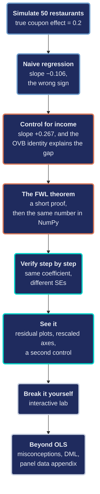
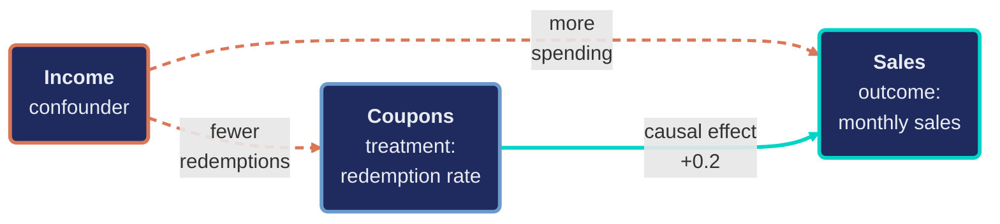
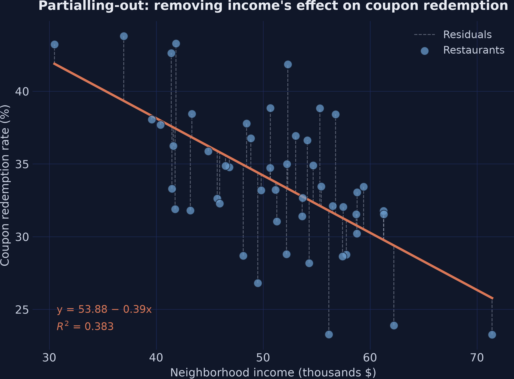
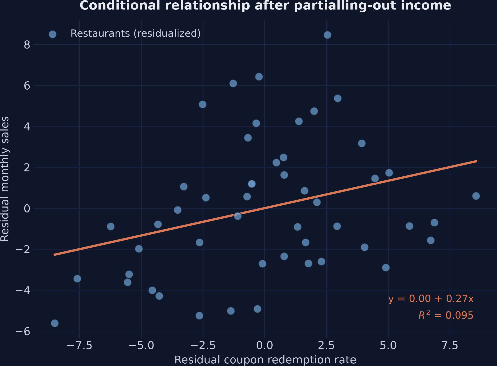
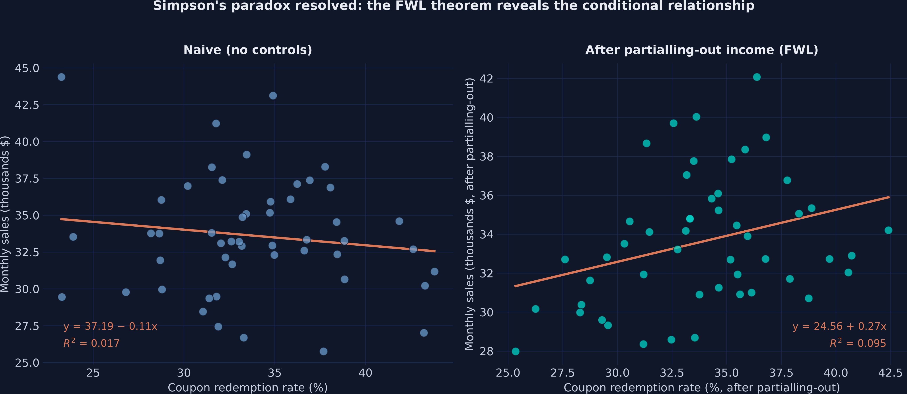

---
authors:
  - admin
categories:
  - Python
  - FWL Theorem
draft: false
featured: false
date: "2026-09-28T00:00:00Z"
external_link: ""
image:
  caption: ""
  focal_point: Smart
  placement: 3
links:
  - icon: spotify
    icon_pack: fab
    name: "Podcast"
    url: https://open.spotify.com/episode/53iVUZK8aAuIC1sSTU0zuW
  - icon: youtube
    icon_pack: fab
    name: "Video overview"
    url: https://www.youtube.com/watch?v=APXH1B2FmGs
  - icon: chalkboard-teacher
    icon_pack: fas
    name: "Slides (HTML)"
    url: slides/index.html
  - icon: file-pdf
    icon_pack: fas
    name: "AI Slides (PDF)"
    url: https://carlos-mendez.org/tutorials/python_fwl/slides/ai-slides.pdf
  - icon: poll
    icon_pack: fas
    name: "Interactive slides (AhaSlides)"
    url: https://presenter.ahaslides.com/share/1790567562708-72xqh62ban
  - icon: laptop-code
    icon_pack: fas
    name: "Web app"
    url: web_app/index.html
  - icon: open-data
    icon_pack: ai
    name: "[Python] Google Colab"
    url: https://colab.research.google.com/github/cmg777/starter-academic-v501/blob/master/content/tutorials/python_fwl/notebook.ipynb
  - icon: file-code
    icon_pack: fas
    name: "Quarto project (.zip)"
    url: python_fwl.zip
  - icon: code
    icon_pack: fas
    name: "Python script"
    url: script.py
  - icon: bolt
    icon_pack: fas
    name: "Python cheat sheet"
    url: cheatsheet_python.py
  - icon: bolt
    icon_pack: fas
    name: "R cheat sheet"
    url: cheatsheet_R.R
  - icon: bolt
    icon_pack: fas
    name: "Stata cheat sheet"
    url: cheatsheet_stata.do
  - icon: book
    icon_pack: fas
    name: "Jupyter notebook"
    url: https://github.com/cmg777/starter-academic-v501/blob/master/content/tutorials/python_fwl/notebook.ipynb
  - icon: book
    icon_pack: fas
    name: "Data dictionary"
    url: data/index.html
  - icon: file-code
    icon_pack: fas
    name: "Stata do-file"
    url: analysis.do
  - icon: markdown
    icon_pack: fab
    name: "MD version"
    url: https://raw.githubusercontent.com/cmg777/starter-academic-v501/master/content/tutorials/python_fwl/index.md
slides:
summary: "What does it really mean to control for another factor in a regression? This Python tutorial uses a simulated fast food coupon campaign to show that any such result can be rebuilt by first removing what the other factors explain and then plotting what is left in a simple two-variable chart. It comes with an interactive app that runs in your web browser."
tags:
  - python
  - causal
  - causal inference
  - cross-sectional data
  - panel data
title: "The FWL Theorem: Making Multivariate Regressions Intuitive"
url_code: ""
url_pdf: ""
url_slides: ""
url_video: ""
toc: true
diagram: true
---

<div style="background:#0e1545; border-radius:12px; padding:8px;">
<iframe style="border-radius:8px" src="https://open.spotify.com/embed/episode/53iVUZK8aAuIC1sSTU0zuW?utm_source=generator&theme=0" width="100%" height="152" frameBorder="0" allowfullscreen="" allow="autoplay; clipboard-write; encrypted-media; fullscreen; picture-in-picture" loading="lazy"></iframe>
</div>

## Abstract

Including multiple variables in a regression raises a deceptively simple question: what does it actually mean to "control for" a confounder, and how can that adjustment be visualized when a multivariate fit cannot be drawn on a two-dimensional scatter plot? This tutorial answers that question through the Frisch-Waugh-Lovell (FWL) theorem, which shows that any coefficient from a multivariate regression can be recovered from a univariate regression after partialling-out the other variables. Inspired by Courthoud (2022), the analysis uses a simulated fast-food chain of 50 restaurants, one per neighborhood, each of which hands out 100 discount coupons in a single day; neighborhood income confounds the effect of the coupon redemption rate on monthly sales, with a known true causal effect (ATE) of exactly +0.2. Using Ordinary Least Squares (OLS) in statsmodels, the study estimates naive, full, and residualized (FWL) regressions, then visualizes the conditional relationship with seaborn and matplotlib. The naive regression of sales on coupons yields a misleading slope of −0.1059 (p = 0.365). Controlling for income reverses it to +0.2673 (p = 0.031), with income itself at +0.3836 (p < 0.001). The gap decomposes exactly as 0.3836 × (−0.9730) = −0.3732, the omitted-variable-bias identity. The FWL residualize-both procedure reproduces the coefficient +0.2673 exactly, and its standard error (0.118) matches the full regression's 0.120 up to a degrees-of-freedom correction; extending to two controls gives +0.2706 both ways. This sign reversal — a textbook Simpson's paradox — demonstrates that omitted-variable bias can flip an effect's direction, and that FWL both verifies what multivariate regression does under the hood and provides the linear prototype for Double Machine Learning. An appendix repeats the promotion in June and applies FWL to the resulting two-period panel with `analyze_fwl_plot` from `expdpy`: restaurant fixed effects, two-way fixed effects, and first differences all reduce to residual-on-residual regressions, and a persistent restaurant trait that pushes pooled OLS to +0.4496 is removed by the fixed effects (+0.1394, clustered SE 0.069).

<a href="https://colab.research.google.com/github/cmg777/starter-academic-v501/blob/master/content/tutorials/python_fwl/notebook.ipynb" target="_blank" rel="noopener"></a>

## 1. Overview

### 1.1 What does it mean to "control for" a variable?

Including multiple variables in a regression raises a natural question: what does it actually mean to "control for" a confounder? The output is a coefficient, but a multivariate regression cannot be plotted on a simple two-dimensional scatter plot. This makes it hard to build intuition about what the regression is doing behind the scenes.

The **Frisch-Waugh-Lovell (FWL) theorem** answers this question. It shows that any coefficient from a multivariate regression can be recovered from a simple univariate regression — after removing the influence of all other variables through a procedure called *partialling-out* (also known as *residualization* or *orthogonalization*). Think of it as removing the part of each variable that the controls can explain, so only the variation the controls cannot account for remains.

This tutorial is inspired by [Courthoud (2022)](https://towardsdatascience.com/the-fwl-theorem-or-how-to-make-all-regressions-intuitive-59f801eb3299/), and applies the FWL theorem to a simulated fast-food promotion. A chain runs 50 restaurants, each in its own neighborhood. In January, every restaurant hands out 100 discount coupons on a single day and then counts how many of them come back during the month. That count is the **coupon redemption rate**: 37 coupons redeemed out of 100 is a rate of 37%. The chain wants to know whether a higher redemption rate raises the restaurant's monthly sales. The catch: neighborhood income affects both how many coupons are redeemed and how much people spend, creating a confounding relationship that makes the naive analysis misleading. The analysis uses FWL to untangle these effects, verifies the theorem step by step, and visualizes the conditional relationship that multivariate regression captures but hides from view.

### 1.2 Learning objectives

By the end of this post you will be able to:

1. **Diagnose** omitted-variable bias in a confounded dataset and explain why the naive coupon slope (−0.1059) has the wrong sign.
2. **Decompose** the gap between the naive and controlled coefficients exactly, using the omitted-variable-bias identity.
3. **State** the Frisch-Waugh-Lovell theorem and **prove** it with the residual-maker matrix.
4. **Implement** FWL three ways (a full Ordinary Least Squares, or OLS, regression; a residual-on-residual regression; and plain NumPy) and confirm that all three return 0.2673.
5. **Explain** why residualizing only the treatment reproduces the coefficient but not its standard error, and trace the gap to its three sources: the missing intercept, income's variation left in sales, and the degrees of freedom.
6. **Visualize** a conditional relationship with residualized, mean-rescaled scatter plots.
7. **Evaluate** when linear partialling-out identifies a causal effect and when it fails, and **connect** it to Double Machine Learning.
8. **Extend** FWL to panel data: show that restaurant fixed effects, two-way fixed effects, and first differences are all residual-on-residual regressions, using `analyze_fwl_plot` from `expdpy` (appendix).

### 1.3 The road ahead

The tutorial runs in eight stages. The same 50 restaurants carry the whole story, and the true coupon effect of 0.2 never changes. Each stage either finds a number, explains it, or tries to break it.



The border colors of the boxes mark the logic of the argument. The boxes with blue borders set up the puzzle, a known truth and a naive slope with the wrong sign. The boxes with orange borders solve it twice, first with the omitted-variable-bias identity and then with the FWL theorem. The boxes with teal borders check the answer, first with numbers and then with pictures. Finally, the boxes with gray borders turn the analysis over to the reader through a lab where the result can be broken on purpose, a set of misconceptions, and the bridge to Double Machine Learning. The last box also includes the appendix, which runs the same promotion again in June and applies FWL to the resulting two-month panel.

## 2. Key concepts at a glance

The rest of the post leans on a small vocabulary. Each concept has three parts. The **definition** is always visible; the **example** and **analogy** sit behind clickable cards. Open them when a term feels slippery — "partialling-out" and "omitted-variable bias" are the two that later sections lean on hardest.

**1. Frisch-Waugh-Lovell theorem** Two routes, one coefficient.
The coefficient on $X\_1$ in the full regression equals the slope from a simple regression of $\tilde Y$ on $\tilde X\_1$. The tildes mark residuals from regressing each variable on the other controls.

<div class="concept-pair">
<details class="concept-card concept-example">
<summary>Example</summary>

In this post, regressing `sales` on `coupons` and `income` jointly gives a coupon coefficient of +0.2673. Residualizing both variables on `income` and re-regressing gives +0.2673 too. It is the same number to machine precision, not an approximation.

</details>

<details class="concept-card concept-analogy">
<summary>Analogy</summary>

Weigh a patient in a winter coat and subtract the coat, or take the coat off first and weigh again: the scale shows the same person. The full regression subtracts income in place; FWL takes income off first.

</details>

</div>

**2. Confounding** A third variable pulling on both ends.
A confounder $X\_2$ affects both the treatment $X\_1$ and the outcome $Y$. It creates an association between them that is not causal.

<div class="concept-pair">
<details class="concept-card concept-example">
<summary>Example</summary>

In this post `income` confounds `coupons → sales`. Restaurants in high-income neighborhoods redeem fewer coupons but sell more, so the raw coupon slope is *negative* (−0.1059, p = 0.365) even though the true effect is +0.2.

</details>

<details class="concept-card concept-analogy">
<summary>Analogy</summary>

Ice-cream sales and drownings rise and fall together. Ice cream does not cause drowning; hot weather drives both. Here income plays the weather.

</details>

</div>

**3. Partialling-out / residualization** $\tilde y = y - \hat y$.
Replace each variable with the part the controls cannot explain. That leftover is what FWL works with.

<div class="concept-pair">
<details class="concept-card concept-example">
<summary>Example</summary>

Regress `coupons` on `income` and keep the residuals. Do the same for `sales`. Plot one set of residuals against the other, and the fitted line has slope +0.2673 — the controlled coefficient, now visible.

</details>

<details class="concept-card concept-analogy">
<summary>Analogy</summary>

Judging a runner on a windy day. Subtract what the wind alone would have done to the time, then compare what is left. The leftover time belongs to the runner, not the weather.

</details>

</div>

**4. Omitted-variable bias** $\hat\beta\_1^{\mathrm{naive}} = \hat\beta\_1 + \hat\gamma \cdot \hat\delta$.
Leave a relevant variable out and the slope absorbs part of its effect. Here $\hat\gamma$ is the omitted variable's coefficient in the full regression, and $\hat\delta$ is the slope from regressing the omitted variable on $X\_1$. The identity is exact in the sample. It links the naive slope to the full-regression coefficient $\hat\beta\_1$, not to the true 0.2.

<div class="concept-pair">
<details class="concept-card concept-example">
<summary>Example</summary>

Income's coefficient is $\hat\gamma = 0.3836$ and the slope of `income` on `coupons` is $\hat\delta = -0.9730$. Their product, 0.3836 × (−0.9730) = −0.3732, equals the gap −0.1059 − 0.2673 exactly. In the population $\delta = -1.0$, so the naive slope converges to 0.2 + 0.3 × (−1.0) = −0.10.

</details>

<details class="concept-card concept-analogy">
<summary>Analogy</summary>

A bathroom scale that reads 3 kg light for everyone. Once you know the error, you add it back exactly. The OVB identity is that correction for a regression: it says precisely how far, and in which direction, the naive slope was pushed.

</details>

</div>

**5. Conditional vs. marginal effect** $E[Y \mid X\_1, X\_2]$ vs. $E[Y \mid X\_1]$.
The conditional slope holds the other variables fixed. The marginal slope averages over them. The two coincide when the omitted variable does not affect $Y$ or is uncorrelated with $X\_1$. In a sample they coincide exactly when $\hat\gamma \hat\delta = 0$.

<div class="concept-pair">
<details class="concept-card concept-example">
<summary>Example</summary>

The marginal coupon slope is −0.1059. The conditional slope, holding income fixed, is +0.2673. They differ because $\hat\gamma \hat\delta = -0.3732$ is far from zero.

</details>

<details class="concept-card concept-analogy">
<summary>Analogy</summary>

Across a whole city, houses with more bedrooms can look cheaper, because big houses sit far from the center where land is cheap. Within one neighborhood, each extra bedroom raises the price. The city-wide comparison is marginal; the within-neighborhood comparison is conditional.

</details>

</div>

**6. Backdoor path** A non-causal route through a confounder.
In the DAG `coupons ← income → sales`, the backdoor path runs from coupons back through income to sales. Conditioning on `income` blocks it and identifies the causal effect.

<div class="concept-pair">
<details class="concept-card concept-example">
<summary>Example</summary>

Including `income` in the regression closes the backdoor. The resulting +0.2673 is an *estimate* of the causal effect, whose true value is 0.2. Closing the backdoor removes the bias, not the sampling noise: with 50 restaurants the 95% confidence interval runs from 0.025 to 0.509.

</details>

<details class="concept-card concept-analogy">
<summary>Analogy</summary>

A concert hall with a side door open to a noisy street. Shut the door and the music is clean. You don't have to stop the traffic — you only have to block the path it takes into the hall.

</details>

</div>

**7. DML bridge — FWL → Double Machine Learning** Residualize $Y$ and $D$ with ML, then regress.
FWL is the linear-OLS prototype of DML, where $D$ is the treatment (our $X\_1$). Replace the OLS partialling-out with flexible machine-learning models and the same residual-on-residual logic handles high-dimensional or nonlinear controls. DML adds *cross-fitting*: each observation's residuals come from models trained on the other folds of the data, so a flexible model cannot fit that observation's own noise into them.

<div class="concept-pair">
<details class="concept-card concept-example">
<summary>Example</summary>

The residualize-then-regress logic that recovers +0.2673 here is what `doubleml` runs at scale, with cross-fitting and a random forest or lasso in place of OLS.

</details>

<details class="concept-card concept-analogy">
<summary>Analogy</summary>

FWL is a carpenter's straightedge. DML swaps it for a flexible curve ruler. The job stays the same: trace the part of each variable the controls explain, and keep what is left.

</details>

</div>

## 3. The causal structure

Before looking at data, it helps to understand the causal relationships among the variables. A **Directed Acyclic Graph (DAG)** is a diagram in which each arrow represents a direct causal effect of one variable on another. Drawing the graph first makes the assumptions of the analysis explicit, so the reader can see which variables must be controlled for and why.

In this fast-food scenario, three variables interact:



Income acts as a **confounder**, which is a variable that influences both the treatment (the coupon redemption rate) and the outcome (monthly sales). The two dashed orange arrows trace this influence, because wealthier neighborhoods redeem fewer coupons but also spend more. Together, these arrows form a *backdoor path* from coupons to sales that runs through income. If the analysis ignores income, this backdoor path produces a spurious negative association between coupons and sales, and that association hides the true positive effect shown by the thick teal arrow.

To estimate the causal effect without this bias, the analysis must **block** the backdoor path by conditioning on income. Once income is held fixed, the only remaining link between coupons and sales is the thick teal arrow. The FWL theorem provides an elegant way to do this and also to visualize the result.

## 4. Setup and imports

The following code loads all necessary libraries. The analysis relies on [statsmodels](https://www.statsmodels.org/stable/index.html) for OLS regression, [seaborn](https://seaborn.pydata.org/) for regression plots, and [matplotlib](https://matplotlib.org/) for figure customization. The `RANDOM_SEED` ensures that every reader gets identical results.

```python
import numpy as np
import pandas as pd
import matplotlib.pyplot as plt
import seaborn as sns
import statsmodels.formula.api as smf

# Reproducibility
RANDOM_SEED = 42
np.random.seed(RANDOM_SEED)

# Site color palette
STEEL_BLUE = "#6a9bcc"
WARM_ORANGE = "#d97757"
NEAR_BLACK = "#141413"
TEAL = "#00d4c8"
```

> **Note on figure styling:** The published figures in this post come from the companion `script.py`, which adds a dark theme for visual consistency with the site and labels each fitted line with its equation and R². The plotting code below keeps matplotlib's defaults and uses colors that read well on both light and dark backgrounds. To reproduce the dark-themed figures, add the following to your setup:
>
> <details><summary>Dark theme settings (click to expand)</summary>
>
> ```python
> DARK_NAVY = "#0f1729"
> GRID_LINE = "#1f2b5e"
> LIGHT_TEXT = "#c8d0e0"
> WHITE_TEXT = "#e8ecf2"
>
> plt.rcParams.update({
>     "figure.facecolor": DARK_NAVY, "axes.facecolor": DARK_NAVY,
>     "axes.edgecolor": DARK_NAVY, "axes.linewidth": 0,
>     "axes.labelcolor": LIGHT_TEXT, "axes.titlecolor": WHITE_TEXT,
>     "axes.spines.top": False, "axes.spines.right": False,
>     "axes.spines.left": False, "axes.spines.bottom": False,
>     "axes.grid": True, "grid.color": GRID_LINE,
>     "grid.linewidth": 0.6, "grid.alpha": 0.8,
>     "xtick.color": LIGHT_TEXT, "ytick.color": LIGHT_TEXT,
>     "text.color": WHITE_TEXT, "font.size": 12,
>     "legend.frameon": False, "legend.labelcolor": LIGHT_TEXT,
>     "savefig.facecolor": DARK_NAVY, "savefig.edgecolor": DARK_NAVY,
> })
> ```
>
> </details>

## 5. Data simulation

Rather than importing data from an external source, this section builds a transparent data generating process (DGP) so that the **true causal effect** is known in advance and the methods can be verified against it. Think of it as running a controlled experiment in a computer: set the rules, generate the data, and then check whether the statistical tools find the right answer.

The DGP encodes the causal structure from the DAG above:

- `income` is drawn from a normal distribution centered at \\$50K
- `coupons` is the redemption rate: the percentage of the restaurant's 100 coupons that were redeemed during the month. It depends negatively on income (wealthier customers redeem fewer coupons) plus random noise. The simulation keeps two decimals, so read 36.93 as "about 37 of the 100 coupons came back."
- `sales` is the restaurant's monthly sales in thousands of dollars. It depends positively on both coupons (+0.2) and income (+0.3), plus a day-of-week effect and random noise

The true causal effect of coupons on sales is **exactly +0.2** — this is the **Average Treatment Effect (ATE)**, the average impact of coupons on sales across all restaurants. In concrete terms, every 1 percentage point increase in the redemption rate (one more of the 100 coupons redeemed) causes a \\$200 increase in monthly sales (measured in thousands).

```python
def simulate_store_data(n=50, seed=42):
    """Simulate one month of the 50 restaurants, confounded by income."""
    rng = np.random.default_rng(seed)
    income = rng.normal(50, 10, n)
    dayofweek = rng.integers(1, 8, n)
    coupons = 60 - 0.5 * income + rng.normal(0, 5, n)
    sales = (10 + 0.2 * coupons + 0.3 * income
             + 0.5 * dayofweek + rng.normal(0, 3, n))
    return pd.DataFrame({
        "sales": np.round(sales, 2),
        "coupons": np.round(coupons, 2),
        "income": np.round(income, 2),
        "dayofweek": dayofweek,
    })

N = 50
df = simulate_store_data(n=N, seed=RANDOM_SEED)
print("Dataset shape:", df.shape)
print()
print(df.head())
print()
print(df.describe().round(2))
```

```text
Dataset shape: (50, 4)

   sales  coupons  income  dayofweek
0  37.37    36.93   53.05          6
1  36.88    38.06   39.60          6
2  33.09    32.04   57.50          6
3  35.09    33.43   59.41          5
4  27.01    43.21   30.49          4

       sales  coupons  income  dayofweek
count  50.00    50.00   50.00      50.00
mean   33.61    33.84   50.91       3.92
std     3.96     4.89    7.68       1.88
min    25.76    23.26   30.49       1.00
25%    31.30    31.53   45.78       2.00
50%    33.24    33.25   51.74       4.00
75%    36.00    36.89   56.42       5.75
max    44.38    43.79   71.42       7.00
```

The dataset contains 50 restaurants with average monthly sales of \\$33,610, an average redemption rate of 33.84% (about 34 of the 100 coupons), and average neighborhood income of \\$50,910. Monthly sales range from \\$25,760 to \\$44,380, reflecting meaningful variation across restaurants. The redemption rate spans from 23% to 44%, and income ranges from \\$30,490 to \\$71,420. This variation provides enough signal to estimate the relationships of interest.

## 6. The naive relationship

The simplest approach is to regress sales directly on the redemption rate, ignoring income entirely. This is what a rushed analyst might do — just look at whether restaurants that redeemed more coupons have higher or lower sales.

<div class="learn-card predict-card">
<p class="learn-card-kicker">Predict first</p>

Before running the naive regression: what sign will the slope of sales on coupons have, and which variable is to blame? Commit to a sign and a reason before scrolling.

<details class="learn-card-reveal">
<summary>Reveal the answer</summary>

**Answer.** Negative: the slope is −0.1059, even though the true effect is +0.2. Income is to blame. Wealthier neighborhoods redeem fewer coupons and spend more, so the restaurants with many redemptions tend to sit in poorer neighborhoods with lower sales. The naive regression credits that income gap to coupons.

</details>
</div>

```python
sns.regplot(x="coupons", y="sales", data=df, ci=None,
            scatter_kws={"color": STEEL_BLUE, "alpha": 0.7, "edgecolors": "gray",
                         "linewidths": 0.5, "s": 60},
            line_kws={"color": WARM_ORANGE, "linewidth": 2, "label": "Linear fit"})
plt.legend()
plt.xlabel("Coupon redemption rate (%)")
plt.ylabel("Monthly sales (thousands $)")
plt.title("Naive relationship: Sales vs. coupon redemption")
plt.savefig("fwl_naive_regression.png", dpi=300, bbox_inches="tight")
plt.show()
```


*Naive regression: the downward slope suggests coupons reduce sales, but this is driven by confounding from income.*

The plot suggests a negative slope; the regression table puts a number and a p-value on it.

```python
naive_model = smf.ols("sales ~ coupons", df).fit()
print(naive_model.summary().tables[1])
```

```text
==============================================================================
                 coef    std err          t      P>|t|      [0.025      0.975]
------------------------------------------------------------------------------
Intercept     37.1906      3.960      9.390      0.000      29.228      45.154
coupons       -0.1059      0.116     -0.914      0.365      -0.339       0.127
==============================================================================
```

The naive regression suggests that coupons have a **negative** effect on sales: each additional percentage point of redemption is associated with \\$106 less in monthly sales. However, this coefficient is not statistically significant (p = 0.365), and the 95% confidence interval [−0.339, 0.127] spans both negative and positive values. More importantly, the true effect is +0.2, so this estimate is not just imprecise — it points in the wrong direction. The confounder (income) is pulling the estimate downward because wealthier neighborhoods redeem fewer coupons but spend more.

## 7. Controlling for income

### 7.1 The full regression

To block the backdoor path through income, the next step includes it as a control variable in the regression. This is the standard approach in applied work: add the confounder to the right-hand side of the regression equation.

```python
full_model = smf.ols("sales ~ coupons + income", df).fit()
print(full_model.summary().tables[1])
```

```text
==============================================================================
                 coef    std err          t      P>|t|      [0.025      0.975]
------------------------------------------------------------------------------
Intercept      5.0278      7.181      0.700      0.487      -9.418      19.474
coupons        0.2673      0.120      2.222      0.031       0.025       0.509
income         0.3836      0.076      5.015      0.000       0.230       0.537
==============================================================================
```

Controlling for income reverses the picture entirely. The coefficient on coupons is now **+0.2673** (p = 0.031): an estimated \\$267 more in monthly sales for each additional percentage point of redemption. The true effect is +0.2 (\\$200), and the 95% confidence interval [0.025, 0.509] contains it while no longer including zero. Income's own coefficient, +0.3836 (p < 0.001), confirms that wealthier neighborhoods spend more. By conditioning on income, the backdoor path is blocked and the estimate moves much closer to the true causal effect.

### 7.2 Where the bias comes from: the OVB identity

The naive slope is −0.1059 and the controlled slope is +0.2673. The gap between them is not a mystery. It can be computed exactly, before any theorem about residuals.

<div class="learn-card predict-card">
<p class="learn-card-kicker">Predict first</p>

The gap between the naive and full coefficients is −0.1059 − 0.2673 = −0.3732, and income's coefficient in the full regression is $\hat\gamma = 0.3836$. If the gap equals $\hat\gamma \cdot \hat\delta$, what must $\hat\delta$ be, and what is its sign? Commit to an answer before scrolling.

<details class="learn-card-reveal">
<summary>Reveal the answer</summary>

**Answer.** $\hat\delta = -0.3732 / 0.3836 \approx -0.973$. It is negative: restaurants with more redemptions sit in poorer neighborhoods. The code below prints −0.9730. The population value, implied by the DGP, is −1.0.

</details>
</div>

The **omitted-variable-bias (OVB) identity** links the two regressions:

$$\hat\beta\_1^{\mathrm{naive}} = \hat\beta\_1 + \hat\gamma \cdot \hat\delta$$

In words, this says that the naive slope equals the controlled slope plus a bias term. The bias term is the omitted variable's effect on the outcome times how strongly the omitted variable moves with the treatment. Here $\hat\beta\_1^{\mathrm{naive}}$ is the coupon coefficient in `naive_model`, $\hat\beta\_1$ is the coupon coefficient in `full_model`, $\hat\gamma$ is the income coefficient in `full_model`, and $\hat\delta$ is the slope from regressing `income` on `coupons`. The identity is exact in any sample, not only on average.

```python
gamma_hat = full_model.params["income"]
delta_hat = smf.ols("income ~ coupons", df).fit().params["coupons"]
naive_hat, full_hat = naive_model.params["coupons"], full_model.params["coupons"]
print(f"gamma_hat x delta_hat = {gamma_hat:.4f} x {delta_hat:.4f} = {gamma_hat * delta_hat:.4f}")
print(f"naive - full          = {naive_hat:.4f} - {full_hat:.4f} = {naive_hat - full_hat:.4f}")
```

```text
gamma_hat x delta_hat = 0.3836 x -0.9730 = -0.3732
naive - full          = -0.1059 - 0.2673 = -0.3732
```

The two lines agree to the last digit: 0.3836 × (−0.9730) = −0.3732 = −0.1059 − 0.2673. Income raises sales ($\hat\gamma > 0$) and moves against coupons ($\hat\delta < 0$), so the bias is negative and large enough to flip the sign. The population version follows from the DGP. There, Cov(income, coupons) = −0.5 × 100 = −50 and Var(coupons) = 0.25 × 100 + 25 = 50, so $\delta = -1.0$ and the naive slope converges to 0.2 + 0.3 × (−1.0) = −0.10. The naive regression omits `dayofweek` too, but `dayofweek` is independent of coupons in the DGP, so it adds nothing to the population bias.

The direction of the auxiliary regression matters. Regressing coupons on income instead (slope −0.3935) gives a bias term of 0.3836 × (−0.3935) = −0.151. That would imply a naive slope of 0.2673 − 0.151 = +0.116, not the −0.106 we observe, so it reconciles nothing. The omitted variable goes on the left-hand side; the treatment goes on the right.

But what is the regression actually *doing* when it "controls for" income? This is where the FWL theorem provides a clear answer.

## 8. The FWL theorem

### 8.1 The statement

Ragnar Frisch and Frederick Waugh first published the result in 1933, for the case of detrending time series. Michael Lovell generalized it in 1963 in the *Journal of the American Statistical Association*, in a paper on seasonal adjustment. Decades later he published a short proof for teaching, "A Simple Proof of the FWL Theorem" (Lovell, 2008). The theorem gives a precise algebraic decomposition of what multivariate regression does under the hood.

Consider a linear model with two sets of regressors:

$$y\_i = \beta\_1 x\_{i,1} + \beta\_2 x\_{i,2} + \varepsilon\_i$$

In words, this equation says that the outcome $y$ (sales) equals the effect $\beta\_1$ of the variable of interest $x\_1$ (coupons), plus the effect $\beta\_2$ of the control variable $x\_2$ (income), plus an error term $\varepsilon$. In this analysis, $y$ corresponds to the `sales` column, $x\_1$ to `coupons`, and $x\_2$ to `income`; the intercept counts as one more control. The coefficient $\beta\_2$ here is the $\gamma$ of section 7.2, and the lowercase $y$ and $x\_1$ are the $Y$ and $X\_1$ of the concept cards in section 2.

The FWL theorem states that the **Ordinary Least Squares (OLS)** estimator — the standard method for fitting a regression line by minimizing squared prediction errors — $\hat{\beta}\_1$ from this multivariate regression is **identical** to the estimator obtained from a simpler procedure:

$$\hat{\beta}\_1^{\mathrm{FWL}} = \frac{\text{Cov}(\tilde{y}, \\, \tilde{x}\_1)}{\text{Var}(\tilde{x}\_1)}$$

where $\tilde{x}\_1$ is the residual from regressing $x\_1$ on $x\_2$, and $\tilde{y}$ is the residual from regressing $y$ on $x\_2$.

In words, this says: to estimate the effect of coupons while controlling for income, we can (1) remove income's influence from coupons, (2) remove income's influence from sales, and (3) regress the cleaned sales on the cleaned coupons. The resulting coefficient is **exactly** the same as the one from the full multivariate regression.

This procedure is called **partialling-out** because it removes the variation explained by the control variables, keeping only the residual variation: the part that is *orthogonal to* — that is, uncorrelated with — income in the sample (not necessarily independent of it). The three equivalent estimators are:

1. **Full OLS:** Regress $y$ on $x\_1$ and $x\_2$ jointly
2. **Partial FWL:** Regress $y$ on $\tilde{x}\_1$ (residuals of $x\_1$ on $x\_2$)
3. **Full FWL:** Regress $\tilde{y}$ on $\tilde{x}\_1$ without an intercept (residuals of both variables on $x\_2$)

All three produce the same $\hat{\beta}\_1$. The full FWL (option 3) also reproduces the full regression's residuals exactly, so its standard error matches up to a degrees-of-freedom correction; section 10.3 shows how much.

### 8.2 Why it works

The theorem is not a coincidence of this dataset; it follows from a few lines of matrix algebra, and section 9 checks each line numerically.

<details class="learn-card proof-card">
<summary><span class="learn-card-kicker">Proof</span> Why FWL holds, in five lines of matrix algebra</summary>

Stack the $n$ restaurants. Let $y$ be the outcome vector, $X\_1$ the treatment column, and $X\_2$ the matrix of controls, including the column of ones. Define the **residual-maker** matrix

$$M\_2 = I\_n - X\_2 (X\_2^\top X\_2)^{-1} X\_2^\top$$

Multiplying any vector by $M\_2$ returns the residuals from regressing that vector on $X\_2$. Three facts follow directly from the definition:

$$M\_2 X\_2 = 0, \qquad M\_2^\top = M\_2, \qquad M\_2 M\_2 = M\_2$$

**Line 1.** Write the full OLS fit with its residual vector $e$. The *normal equations*, the first-order conditions for minimizing the sum of squared residuals, make $e$ orthogonal to every regressor:

$$y = X\_1 \hat\beta\_1 + X\_2 \hat\beta\_2 + e$$

$$X\_1^\top e = 0, \qquad X\_2^\top e = 0$$

**Line 2.** Premultiply by $M\_2$. The control term vanishes because $M\_2 X\_2 = 0$, and $M\_2 e = e$ because $e$ is already orthogonal to $X\_2$:

$$M\_2 y = M\_2 X\_1 \hat\beta\_1 + e$$

**Line 3.** Premultiply by $X\_1^\top$. The last term drops because $X\_1^\top e = 0$:

$$X\_1^\top M\_2 y = X\_1^\top M\_2 X\_1 \hat\beta\_1$$

**Line 4.** Solve for the coefficient:

$$\hat\beta\_1 = (X\_1^\top M\_2 X\_1)^{-1} X\_1^\top M\_2 y$$

**Line 5.** Write $\tilde x\_1 = M\_2 X\_1$ and $\tilde y = M\_2 y$. Because $M\_2$ is symmetric and idempotent, $X\_1^\top M\_2 X\_1 = \tilde x\_1^\top \tilde x\_1$ and $X\_1^\top M\_2 y = \tilde x\_1^\top \tilde y$. So

$$\hat\beta\_1 = (\tilde x\_1^\top \tilde x\_1)^{-1} \tilde x\_1^\top \tilde y$$

That is the regression of the residualized outcome on the residualized treatment — the FWL theorem. Three corollaries fall out.

**(a) Step 1 works.** $\tilde x\_1^\top \tilde y = \tilde x\_1^\top y$, because $M\_2$ is symmetric and idempotent. Regressing the raw outcome on $\tilde x\_1$ gives the same slope. That is Step 1 in section 10.1.

**(b) Only the degrees of freedom differ.** Line 2 says $\tilde y = \tilde x\_1 \hat\beta\_1 + e$, so the residual-on-residual regression leaves exactly the full model's residuals $e$. The sum of squared residuals is identical. By the same algebra (the partitioned-inverse formula), the diagonal element of the full regression's $(X^\top X)^{-1}$ that belongs to $X\_1$ equals $(\tilde x\_1^\top \tilde x\_1)^{-1}$, so the variance factor is shared too. Only the divisor changes, 49 instead of 47, which is why Step 2's standard error is $\sqrt{47/49} = 0.9794$ times the full model's.

**(c) The covariance formula.** With a single treatment column, $(\tilde x\_1^\top \tilde x\_1)^{-1} \tilde x\_1^\top \tilde y$ is a ratio of two numbers. The residuals have mean zero because $X\_2$ contains the constant, so dividing both by $n - 1$ turns the ratio into the Cov/Var formula of section 8.1.

</details>

## 9. FWL by hand in NumPy

### 9.1 The covariance formula

statsmodels hides the arithmetic. The formula in section 8.1 needs only two residual vectors, one covariance, and one variance, so it fits in a few lines of NumPy. `np.linalg.lstsq` solves each least-squares problem. The design matrix `X2` holds a column of ones next to income, so the intercept is partialled out along with income.

```python
y = df["sales"].to_numpy()
x1 = df["coupons"].to_numpy()
X2 = np.column_stack([np.ones(N), df["income"]])

c_tilde = x1 - X2 @ np.linalg.lstsq(X2, x1, rcond=None)[0]
s_tilde = y - X2 @ np.linalg.lstsq(X2, y, rcond=None)[0]

cov_sc = np.cov(s_tilde, c_tilde)[0, 1]   # np.cov divides by n - 1
var_c = np.var(c_tilde, ddof=1)           # so the variance must too
print(f"Cov(s_tilde, c_tilde)  = {cov_sc:.4f}")
print(f"Var(c_tilde)           = {var_c:.4f}")
print(f"beta_1 = Cov / Var     = {cov_sc / var_c:.4f}")
print(f"Mixed divisors (wrong) = {cov_sc / np.var(c_tilde):.4f}")
```

```text
Cov(s_tilde, c_tilde)  = 3.9380
Var(c_tilde)           = 14.7320
beta_1 = Cov / Var     = 0.2673
Mixed divisors (wrong) = 0.2728
```

Covariance over variance returns 0.2673, the same coefficient as the full regression, with no regression library involved. One trap is worth a warning. `np.cov` divides by $n - 1$ by default, while `np.var` divides by $n$ unless you pass `ddof=1`. The numerator and denominator must use the same divisor — then it cancels. Mixing them inflates the slope by 50/49, to 0.2728.

### 9.2 The matrix form

The proof in section 8.2 runs through the residual-maker matrix $M\_2$. For 50 restaurants it is only a 50 × 50 matrix, so we can build it explicitly and check its defining properties.

```python
M2 = np.eye(N) - X2 @ np.linalg.inv(X2.T @ X2) @ X2.T
print("M2 symmetric: ", np.allclose(M2, M2.T))
print("M2 idempotent:", np.allclose(M2 @ M2, M2))
print("M2 @ X2 is zero:", np.abs(M2 @ X2).max() < 1e-10)  # tiny float noise varies by machine
beta_matrix = (x1 @ M2 @ y) / (x1 @ M2 @ x1)
print(f"(x1' M2 y) / (x1' M2 x1) = {beta_matrix:.4f}")
```

```text
M2 symmetric:  True
M2 idempotent: True
M2 @ X2 is zero: True
(x1' M2 y) / (x1' M2 x1) = 0.2673
```

$M\_2$ is symmetric and idempotent, and it annihilates the controls: every entry of $M\_2 X\_2$ is zero up to floating-point error. The code tests against a tolerance of 1e-10 because the leftover noise, of order 1e-14, differs from one machine to the next. The last line is Line 4 of the proof with a single treatment column, and it returns 0.2673 once more. Notice that the code multiplies the *raw* `x1` and `y` by $M\_2$; the matrix does the residualizing inside the product. That is Line 5 at work: because $M\_2$ is symmetric and idempotent, $X\_1^\top M\_2 y$ is the same number as $\tilde x\_1^\top \tilde y$.

## 10. Verifying FWL step by step

Let us verify each step of the theorem using the simulated data and statsmodels, and watch what happens to the standard errors along the way.

### 10.1 Step 1: Residualize coupons only

First, we regress coupons on income and extract the residuals $\tilde{x}\_1$. These residuals represent the variation in the redemption rate that **cannot** be explained by income — the "purified" coupon signal. Then we regress raw sales on these residuals, without an intercept.

<div class="learn-card predict-card">
<p class="learn-card-kicker">Predict first</p>

This regression uses residualized coupons but raw sales, with no intercept. (a) Will the coefficient still be 0.2673? (b) Will the standard error still be about 0.12? Commit to an answer before scrolling.

<details class="learn-card-reveal">
<summary>Reveal the answer</summary>

**Answer.** (a) Yes, exactly 0.2673 — corollary (a) of the proof guarantees it. (b) No: the standard error jumps to 1.2715, more than ten times larger. Most of that jump comes from the missing intercept; section 10.2 takes it apart.

</details>
</div>

```python
# Residualize coupons with respect to income
df["coupons_tilde"] = smf.ols("coupons ~ income", df).fit().resid

# Regress sales on residualized coupons (no intercept)
fwl_step1 = smf.ols("sales ~ coupons_tilde - 1", df).fit()
print(fwl_step1.summary().tables[1])
```

```text
=================================================================================
                    coef    std err          t      P>|t|      [0.025      0.975]
---------------------------------------------------------------------------------
coupons_tilde     0.2673      1.271      0.210      0.834      -2.288       2.822
=================================================================================
```

The coefficient is **exactly 0.2673** — identical to the full regression. However, the standard error has exploded from 0.120 to 1.271, making the estimate appear insignificant (p = 0.834). A reader who stopped here would conclude that coupons do nothing.

Why does one number survive and the other not? The coefficient is unaffected by dropping the intercept, because `coupons_tilde` is orthogonal both to the constant and to income. But raw sales is *not* mean-zero (its mean is 33.61), so dropping the intercept matters a great deal for the standard error.

### 10.2 Why Step 1's standard error explodes

Four regressions separate the causes. All of them return the same coefficient; only the standard error, the sum of squared residuals (SSR), and the residual degrees of freedom change.

```python
step1_int = smf.ols("sales ~ coupons_tilde", df).fit()
step1_dm = smf.ols("I(sales - sales.mean()) ~ coupons_tilde - 1", df).fit()
rows = [("Step 1, no intercept", fwl_step1, "coupons_tilde"),
        ("Step 1 + intercept", step1_int, "coupons_tilde"),
        ("Step 1, demeaned sales", step1_dm, "coupons_tilde"),
        ("Full regression", full_model, "coupons")]
for label, m, term in rows:
    print(f"{label:<23} coef {m.params[term]:.4f}  SE {m.bse[term]:.4f}  "
          f"SSR {m.ssr:>9,.1f}  df {m.df_resid:.0f}")
```

```text
Step 1, no intercept    coef 0.2673  SE 1.2715  SSR  57,181.2  df 49
Step 1 + intercept      coef 0.2673  SE 0.1437  SSR     715.0  df 48
Step 1, demeaned sales  coef 0.2673  SE 0.1422  SSR     715.0  df 49
Full regression         coef 0.2673  SE 0.1203  SSR     490.8  df 47
```

Forced through the origin, the Step 1 line must also explain the level of sales, and it cannot: the sales mean of 33.6 stays in the residuals. The SSR is 57,181 without an intercept and 715 with one. The difference equals $n$ times the squared mean of sales, exactly:

```python
share = ((fwl_step1.bse["coupons_tilde"] - step1_int.bse["coupons_tilde"])
         / (fwl_step1.bse["coupons_tilde"] - full_model.bse["coupons"]))
print(f"SSR gap from the intercept:  {fwl_step1.ssr - step1_int.ssr:,.4f}")
print(f"n x mean(sales)^2:           {N * df['sales'].mean() ** 2:,.4f}")
print(f"Share of SE gap closed:      {share:.2f}")
print(f"Demeaned SE / intercept SE:  {step1_dm.bse['coupons_tilde'] / step1_int.bse['coupons_tilde']:.4f}")
print(f"sqrt(48 / 49):               {np.sqrt(48 / 49):.4f}")
```

```text
SSR gap from the intercept:  56,466.1455
n x mean(sales)^2:           56,466.1455
Share of SE gap closed:      0.98
Demeaned SE / intercept SE:  0.9897
sqrt(48 / 49):               0.9897
```

Adding the intercept closes about 98% of the gap between the Step 1 and full-model standard errors. In SE levels, (1.2715 − 0.1437) / (1.2715 − 0.1203) = 0.98. Demeaning sales instead of adding an intercept gives 0.1422 rather than 0.1437. The two differ only by the degrees-of-freedom factor $\sqrt{48/49}$: the same SSR of 715 is divided by 49 in one case and by 48 in the other. The remaining step, 0.1437 → 0.1203, is income's variation still left in sales. Residualizing sales on income as well cuts the SSR from 715 to 491. The degrees-of-freedom change works slightly the other way — the full model divides by 47, not 48 — so the SSR effect is a little larger than the SE step suggests.

### 10.3 Step 2: Residualize both variables

To fix the standard errors, we also residualize sales with respect to income. Now both variables have had income's influence removed.

<div class="learn-card predict-card">
<p class="learn-card-kicker">Predict first</p>

Step 2 regresses residualized sales on residualized coupons, with no intercept, and it leaves exactly the same residuals as the full model. Starting from the full model's standard error of 0.1203, predict Step 2's standard error to three decimals. Hint: count the parameters each regression estimates. Commit to a number before scrolling.

<details class="learn-card-reveal">
<summary>Reveal the answer</summary>

**Answer.** 0.118. The sum of squared residuals is the same, but statsmodels divides it by 50 − 1 = 49 residual degrees of freedom in Step 2 (one coefficient) and by 50 − 3 = 47 in the full model (intercept, coupons, and income). So Step 2's standard error is the full model's times $\sqrt{47/49} = 0.9794$: 0.1203 × 0.9794 = 0.1178.

</details>
</div>

```python
# Residualize sales with respect to income
df["sales_tilde"] = smf.ols("sales ~ income", df).fit().resid

# Regress residualized sales on residualized coupons (no intercept)
fwl_step2 = smf.ols("sales_tilde ~ coupons_tilde - 1", df).fit()
print(fwl_step2.summary().tables[1])
```

```text
=================================================================================
                    coef    std err          t      P>|t|      [0.025      0.975]
---------------------------------------------------------------------------------
coupons_tilde     0.2673      0.118      2.269      0.028       0.031       0.504
=================================================================================
```

The coefficient remains **exactly 0.2673**, and now the standard error (0.118) and p-value (0.028) are nearly identical to the full regression (SE = 0.120, p = 0.031). The slight difference comes from a degrees-of-freedom adjustment. The full regression estimates two extra parameters — the intercept and the income coefficient — so it has two fewer residual degrees of freedom (47 instead of 49). The check below confirms that this is the whole story.

```python
print(f"Step 2 SE / full SE = {fwl_step2.bse.iloc[0] / full_model.bse['coupons']:.4f}")
print(f"sqrt(47 / 49)       = {np.sqrt(47 / 49):.4f}")
print("Same residuals:", np.allclose(fwl_step2.resid, full_model.resid))
```

```text
Step 2 SE / full SE = 0.9794
sqrt(47 / 49)       = 0.9794
Same residuals: True
```

The residuals are identical, and the SE ratio equals $\sqrt{47/49}$ to four decimals. So which standard error should you report? The full-model 0.1203 is correct. Step 2's software SE of 0.1178 slightly overstates precision, because the software does not know that two parameters were already estimated in the partialling-out step. The substantive conclusion is the same either way: after partialling out income, the coupon coefficient is positive and statistically significant.

## 11. Visualizing partialling-out

What does partialling-out actually look like? Regressing coupons on income produces fitted values that form a line through the data. The **residuals** — the vertical distances between each point and this line — represent the coupon variation that income cannot explain.

```python
df["coupons_hat"] = smf.ols("coupons ~ income", df).fit().predict()

fig, ax = plt.subplots(figsize=(8, 6))
ax.scatter(df["income"], df["coupons"], color=STEEL_BLUE, alpha=0.7,
           edgecolors="gray", linewidths=0.5, s=60, label="Restaurants")
sns.regplot(x="income", y="coupons", data=df, ci=None, scatter=False,
            line_kws={"color": WARM_ORANGE, "linewidth": 2, "label": "Linear fit"}, ax=ax)
ax.vlines(df["income"],
          np.minimum(df["coupons"], df["coupons_hat"]),
          np.maximum(df["coupons"], df["coupons_hat"]),
          linestyle="--", color="gray", alpha=0.6, linewidth=1,
          label="Residuals")
ax.set_xlabel("Neighborhood income (thousands $)")
ax.set_ylabel("Coupon redemption rate (%)")
ax.set_title("Partialling-out: removing income's effect on coupon redemption")
ax.legend()
plt.savefig("fwl_residuals_income.png", dpi=300, bbox_inches="tight")
plt.show()
```


*Partialling-out: the dashed lines are the residuals — the coupon variation that income cannot explain.*

The downward-sloping fitted line confirms that higher-income neighborhoods redeem fewer coupons. The vertical dashed lines are the residuals — the part of the redemption rate that income does not predict. Some restaurants got back more of their 100 coupons than their neighborhood income would suggest (positive residuals), and others got back fewer (negative residuals). Partialling out income keeps only these residuals, effectively asking: "Among restaurants in neighborhoods with similar income, which ones had unusually high or low redemption?"

## 12. The conditional relationship revealed

It is now possible to plot the relationship that the multivariate regression captures but cannot directly display: residualized sales against residualized coupons. Both variables have had income's influence removed, so any remaining relationship is the **conditional** effect of coupons on sales — the effect after accounting for income differences.

```python
fig, ax = plt.subplots(figsize=(8, 6))
ax.scatter(df["coupons_tilde"], df["sales_tilde"], color=STEEL_BLUE,
           alpha=0.7, edgecolors="gray", linewidths=0.5, s=60,
           label="Restaurants (residualized)")
sns.regplot(x="coupons_tilde", y="sales_tilde", data=df, ci=None, scatter=False,
            line_kws={"color": WARM_ORANGE, "linewidth": 2, "label": "Linear fit"}, ax=ax)
ax.set_xlabel("Residual coupon redemption rate")
ax.set_ylabel("Residual monthly sales")
ax.set_title("Conditional relationship after partialling-out income")
ax.legend()
plt.savefig("fwl_partialled_out.png", dpi=300, bbox_inches="tight")
plt.show()
```


*After removing income's influence from both variables, a positive conditional relationship between coupons and sales emerges.*

The positive slope is now clearly visible. Stripping away the confounding influence of income reveals that restaurants where redemption is higher than expected (given their neighborhood income) tend to also have monthly sales that are higher than expected. The slope of this line is exactly 0.2673 — the same coefficient produced by the full multivariate regression.

## 13. Scaling for interpretability

One drawback of the partialled-out plot is that both axes show residuals centered around zero, which makes the magnitudes hard to interpret. A coupon value of −5 does not mean the restaurant redeemed −5% of its coupons — it means its redemption rate is 5 percentage points (5 of the 100 coupons) below what income alone would predict.

Adding the sample mean back to each residualized variable fixes this.

<div class="learn-card predict-card">
<p class="learn-card-kicker">Predict first</p>

Adding the sample means back shifts every point up and to the right. Will it change the slope? Commit to an answer before scrolling.

<details class="learn-card-reveal">
<summary>Reveal the answer</summary>

**Answer.** No: the slope is 0.2673 again. Adding a constant to either axis moves the cloud, not its tilt; the intercept absorbs the shift. The standard error does move slightly, 0.119 against Step 2's 0.118. That is degrees of freedom again: this regression estimates an intercept, so it has 48 residual degrees of freedom instead of 49.

</details>
</div>

```python
df["coupons_tilde_scaled"] = df["coupons_tilde"] + df["coupons"].mean()
df["sales_tilde_scaled"] = df["sales_tilde"] + df["sales"].mean()

# Verify the coefficient is unchanged
scaled_model = smf.ols("sales_tilde_scaled ~ coupons_tilde_scaled", df).fit()
print(scaled_model.summary().tables[1])
```

```text
========================================================================================
                           coef    std err          t      P>|t|      [0.025      0.975]
----------------------------------------------------------------------------------------
Intercept               24.5585      4.053      6.059      0.000      16.409      32.708
coupons_tilde_scaled     0.2673      0.119      2.246      0.029       0.028       0.507
========================================================================================
```

The slope is still exactly 0.2673 (p = 0.029); the intercept absorbs the shift. Plotting the rescaled residuals shows what the shift buys: axes in the original units.

```python
fig, ax = plt.subplots(figsize=(8, 6))
ax.scatter(df["coupons_tilde_scaled"], df["sales_tilde_scaled"],
           color=STEEL_BLUE, alpha=0.7, edgecolors="gray", linewidths=0.5, s=60,
           label="Restaurants (residualized + scaled)")
sns.regplot(x="coupons_tilde_scaled", y="sales_tilde_scaled", data=df,
            ci=None, scatter=False,
            line_kws={"color": WARM_ORANGE, "linewidth": 2, "label": "Linear fit"}, ax=ax)
ax.set_xlabel("Coupon redemption rate (%, residualized + mean)")
ax.set_ylabel("Monthly sales (thousands $, residualized + mean)")
ax.set_title("Scaled residuals: interpretable magnitudes")
ax.legend()
plt.savefig("fwl_scaled_residuals.png", dpi=300, bbox_inches="tight")
plt.show()
```


*Adding the sample means back to the residuals restores interpretable units without changing the slope.*

Adding the means back moves the axes without changing the slope. The standard error of 0.119 differs from Step 2's 0.118 only through degrees of freedom: the scaled regression estimates an intercept, so it has 48 residual degrees of freedom instead of 49, and its SE is larger by the factor $\sqrt{49/48}$. Now the axes are in interpretable units: a redemption rate around 34% and monthly sales around \\$33,600. This scaled plot is a display device, ideal for presentations where the audience needs to see both the direction and the magnitude of the conditional relationship at a glance. For inference, report the full-model standard error of 0.1203.

## 14. Extending to multiple controls

The FWL theorem works with **any number** of control variables, not just one. To demonstrate, the next step adds `dayofweek` as a second control alongside income. The theorem says both controls can be partialled out simultaneously, and the full regression and the residual-on-residual regression will return the same coupon coefficient.

<div class="learn-card predict-card">
<p class="learn-card-kicker">Predict first</p>

The DGP makes `dayofweek` independent of coupons and of income. Will adding it as a second control change the coupon coefficient? If so, by how much, and why? Commit to an answer before scrolling.

<details class="learn-card-reveal">
<summary>Reveal the answer</summary>

**Answer.** Only slightly: from 0.2673 to 0.2706. The shift runs through the partial association between `dayofweek` and coupons once income is held fixed. In this sample that association is tiny but not zero: the *partial correlation*, the correlation between the two variables after income is partialled out of each, is −0.021. So the coefficient moves by about 0.003.

</details>
</div>

```python
# Full regression with both controls
full_model_2 = smf.ols("sales ~ coupons + income + dayofweek", df).fit()
print(full_model_2.summary().tables[1])
```

```text
==============================================================================
                 coef    std err          t      P>|t|      [0.025      0.975]
------------------------------------------------------------------------------
Intercept      3.9825      7.172      0.555      0.581     -10.454      18.419
coupons        0.2706      0.119      2.266      0.028       0.030       0.511
income         0.3774      0.076      4.961      0.000       0.224       0.531
dayofweek      0.3195      0.245      1.306      0.198      -0.173       0.812
==============================================================================
```

The full regression puts the coupon coefficient at 0.2706. The FWL route should match it: residualize both sales and coupons on income and `dayofweek` together, then regress residual on residual.

```python
# FWL: partial out both income and dayofweek
df["coupons_tilde_2"] = smf.ols("coupons ~ income + dayofweek", df).fit().resid
df["sales_tilde_2"] = smf.ols("sales ~ income + dayofweek", df).fit().resid

fwl_multi = smf.ols("sales_tilde_2 ~ coupons_tilde_2 - 1", df).fit()
print(fwl_multi.summary().tables[1])
```

```text
===================================================================================
                      coef    std err          t      P>|t|      [0.025      0.975]
-----------------------------------------------------------------------------------
coupons_tilde_2     0.2706      0.116      2.338      0.023       0.038       0.503
===================================================================================
```

With both controls, the full regression gives a coupon coefficient of 0.2706 (p = 0.028). The FWL procedure — partialling out income and day of week from both sales and coupons — yields the **identical** coefficient of 0.2706 (p = 0.023). The day-of-week coefficient itself (0.3195, p = 0.198) is not statistically significant in this sample, even though its true value in the DGP is 0.5: with 50 restaurants, the test lacks the power to detect it. The matching coefficients confirm that FWL scales to any number of controls.

Adding `dayofweek` moves the coupon coefficient from 0.2673 to 0.2706, a shift of only 0.003. The OVB identity describes it exactly: 0.2673 = 0.2706 + 0.3195 × (−0.0101), where 0.3195 is `dayofweek`'s coefficient in the three-variable model and −0.0101 is the slope of `dayofweek` on coupons after controlling for income (partial correlation −0.021). The shift reflects a tiny chance association between `dayofweek` and coupons once income is held fixed — not the raw correlation of −0.076, and not a precision gain (precision shows up in the SE, which moves separately from 0.1203 to 0.1194). Because `dayofweek` is independent of coupons and income in the DGP, the shift would vanish in large samples. Exercise 2 verifies this decomposition in code.

## 15. Naive vs. conditional: the full picture

To appreciate how much the FWL procedure changes the conclusions, the next figure places the naive and conditional relationships side by side. The left panel shows the raw data; the right panel shows the same data after partialling out income.

```python
fig, axes = plt.subplots(1, 2, figsize=(14, 6))

# Left: naive relationship
axes[0].scatter(df["coupons"], df["sales"], color=STEEL_BLUE, alpha=0.7,
                edgecolors="gray", linewidths=0.5, s=60)
sns.regplot(x="coupons", y="sales", data=df, ci=None, scatter=False,
            line_kws={"color": WARM_ORANGE, "linewidth": 2}, ax=axes[0])
axes[0].set_xlabel("Coupon redemption rate (%)")
axes[0].set_ylabel("Monthly sales (thousands $)")
axes[0].set_title("Naive (no controls)")

# Right: after partialling-out income
axes[1].scatter(df["coupons_tilde_scaled"], df["sales_tilde_scaled"],
                color=TEAL, alpha=0.7, edgecolors="gray", linewidths=0.5, s=60)
sns.regplot(x="coupons_tilde_scaled", y="sales_tilde_scaled", data=df,
            ci=None, scatter=False,
            line_kws={"color": WARM_ORANGE, "linewidth": 2}, ax=axes[1])
axes[1].set_xlabel("Coupon redemption rate (%, after partialling-out)")
axes[1].set_ylabel("Monthly sales (thousands $, after partialling-out)")
axes[1].set_title("After partialling-out income (FWL)")

plt.suptitle("Simpson's paradox resolved: the FWL theorem reveals the conditional relationship",
             fontsize=14, fontweight="bold", y=1.02)
plt.tight_layout()
plt.savefig("fwl_comparison.png", dpi=300, bbox_inches="tight")
plt.show()
```


*Simpson's paradox resolved: the naive negative slope (left) reverses to a positive slope (right) after partialling out income.*

The contrast is striking. On the left, the naive analysis suggests a negative relationship (slope = −0.106) — coupons appear to hurt sales. On the right, after removing income's confounding influence, a positive conditional relationship emerges (slope = +0.267, an estimate of the true effect of 0.2). This is a textbook example of **Simpson's paradox**: a trend that appears in aggregate data reverses when the data is properly conditioned on a relevant variable.

## 16. Try it yourself: an interactive FWL lab

Everything so far used one fixed sample. The lab below simulates the same DGP in your browser and lets you change it. Its defaults are the post's 50 restaurants, so it reproduces the naive and controlled slopes of sections 6–7 exactly before you touch anything.



1. **Switch off the income → sales arrow.** Set income → sales to 0. The naive slope jumps toward the FWL slope. With no path from income to sales, income stops being a confounder, and the gap that remains is sampling noise — still exactly $\hat\gamma \hat\delta$ (Exercise 3 does the same experiment in code).
2. **Switch off the income → coupons arrow.** Reset, then set income → coupons to 0. Income still drives sales, but it no longer moves with coupons, so leaving it out biases nothing on average. At n = 50 the two slopes can still differ by chance; that gap is again exactly $\hat\gamma \hat\delta$, and it shrinks as n grows.
3. **Find the sign-flip window.** Reset, then slide income → coupons from 0 toward −1, and watch the "Naive slope in a very large sample" row. In the population the naive slope turns negative once the slope passes about −0.19, and it bottoms out at −0.10 exactly at −0.5, the post's own value — the worst case. It would turn positive again only past −1.31. The main readout for the post's own 50 restaurants traces a noisier version of this curve: it flips later and bottoms out at a different slider value.
4. **Grow the sample.** Reset, then set n = 1000. The FWL slope tightens around 0.2, while the naive slope settles near −0.10. More data makes the naive answer more precise, not less wrong.
5. **Redraw the restaurants.** Return to n = 50 and press "Draw a new sample" a few times. Both slopes jump around. The FWL slope stays centered on 0.2; the naive slope stays centered on −0.10. The post's −0.1059 and +0.2673 are one draw among many.

The lab turns the OVB identity into something you can feel. Bias needs both arrows: income must move sales *and* move with coupons. Cut either one and the naive and controlled slopes agree on average. Sampling noise, by contrast, never goes away at n = 50 — it only shrinks as the sample grows. For a companion lab on a full page, open the [web app](web_app/index.html#lab): it draws fresh random samples instead of the post's 50 restaurants, repeats the experiment 100 times in a Monte Carlo tab, and lines up the post's estimators in a forest plot.

## 17. Summary of results

| Method | Coupons coefficient | Std. error | p-value | Residual df |
|--------|-------------------|------------|---------|-------------|
| Naive OLS (no controls) | −0.1059 | 0.1158 | 0.365 | 48 |
| Full OLS (+ income) | +0.2673 | 0.1203 | 0.031 | 47 |
| FWL Step 1 (residualize coupons only) | +0.2673 | 1.2715 | 0.834 | 49 |
| FWL Step 1 + intercept | +0.2673 | 0.1437 | 0.069 | 48 |
| FWL Step 2 (residualize both) | +0.2673 | 0.1178 | 0.028 | 49 |
| FWL by hand (NumPy) | +0.2673 | — | — | — |
| Full OLS (+ income + day) | +0.2706 | 0.1194 | 0.028 | 46 |
| FWL (+ income + day) | +0.2706 | 0.1157 | 0.023 | 49 |

All FWL variants produce the same coefficient as the corresponding full regression, confirming the theorem. Within each family (the one-control rows and the two-control rows), the standard errors differ for only two reasons: how much variation is left in the residuals (Step 1 leaves the sales mean and income's share of sales in them) and the residual degrees of freedom in the last column. Across families, and for the naive row, a third factor enters: the variation left in coupons itself after the controls (the $\tilde x\_1^\top \tilde x\_1$ of the proof), which sits in the denominator of the standard error. The coefficient of +0.267 is close to the true DGP value of +0.200, with the difference attributable to finite-sample noise in 50 observations.

## 18. Common misconceptions

FWL is simple enough to state in one sentence, and that makes it easy to over-read. Each card below states a common belief, then checks it against the numbers in this post.

<details class="learn-card misconception-card">
<summary><span class="learn-card-kicker">Misconception</span> "FWL only works with one control."</summary>

**What is actually true.** FWL works with any number of controls: partial them all out at once. In section 14, two controls give 0.2706 from the full regression and 0.2706 from the residual-on-residual regression. Fixed-effects software such as `reghdfe` in Stata and `pyfixest` in Python applies the same theorem to hundreds or thousands of fixed-effect dummies. Exercise 6 shows the within-group demeaning version on this data.

</details>

<details class="learn-card misconception-card">
<summary><span class="learn-card-kicker">Misconception</span> "Residualizing only the treatment gives the right standard error."</summary>

**What is actually true.** It gives the right coefficient and the wrong standard error. Step 1 reports 1.2715 instead of 0.1203, which makes the coupon effect look like noise (p = 0.834) — a badly misleading conclusion. Most of the gap is the missing intercept; the rest is income's variation left in sales (section 10.2). Even after residualizing both variables, a degrees-of-freedom correction of $\sqrt{49/47}$ remains.

</details>

<details class="learn-card misconception-card">
<summary><span class="learn-card-kicker">Misconception</span> "Residuals are independent of the controls."</summary>

**What is actually true.** OLS residuals are only *uncorrelated* with the controls, by construction. In this sample the correlation between `coupons_tilde` and `income` is numerically zero — floating-point noise far below 1e-10. But a residual can still depend on a control nonlinearly. Exercise 1 builds a curved coupon equation where the linear residuals have zero correlation with income but a correlation of 0.78 with (income − 50)².

</details>

<details class="learn-card misconception-card">
<summary><span class="learn-card-kicker">Misconception</span> "FWL fixes nonlinear confounding."</summary>

**What is actually true.** Linear partialling-out removes only the linear part of the controls. That is enough when only the *treatment* equation is nonlinear in income: the outcome equation is still correctly specified, and the coupon coefficient stays unbiased. Bias arises when the *outcome* equation has a nonlinear term in the controls that the linear control misses, and that term is correlated with the treatment beyond linear income. Exercise 7 shows both cases: 0.200 when only coupons curve in income, 0.127 when sales curves too. The fix is to add the matching terms (here, income² as a control, which restores 0.200) or to let flexible learners do the partialling-out — Double Machine Learning.

</details>

<details class="learn-card misconception-card">
<summary><span class="learn-card-kicker">Misconception</span> "The controlled coefficient is the true causal effect."</summary>

**What is actually true.** +0.2673 is an *estimate* of the causal effect. Its 95% confidence interval runs from 0.025 to 0.509, and the true value of 0.2 sits inside it. The estimate has a causal interpretation only because the simulation guarantees no unmeasured confounding: income is the only confounder, and we observe it. In real data that guarantee must be argued, not assumed. FWL is algebra, not identification.

</details>

## 19. Applications of the FWL theorem

The FWL theorem is not just a mathematical curiosity — it has practical applications across several domains.

### 19.1 Data visualization

As shown above, FWL makes it possible to plot the conditional relationship between two variables after controlling for confounders. This is invaluable when presenting regression results to non-technical audiences who understand scatter plots but not regression tables with multiple coefficients.

### 19.2 Computational efficiency

When a regression includes **high-dimensional fixed effects** — for example, year, industry, and country dummies that could add hundreds of columns — computing the full regression becomes expensive. The FWL theorem allows software to partial out these fixed effects first, reducing the problem to a much smaller regression. Widely used packages that exploit this strategy include:

- [reghdfe](https://scorreia.com/software/reghdfe/) in Stata
- [fixest](https://cran.r-project.org/web/packages/fixest/index.html) in R
- [pyfixest](https://pyfixest.org/pyfixest.html) in Python — a fast, user-friendly package for fixed-effects regression (including multi-way clustering and interaction effects), inspired by fixest's R API
- [pyhdfe](https://pyhdfe.readthedocs.io/en/stable/index.html) in Python

### 19.3 Machine learning and causal inference

Perhaps the most impactful modern application is **Double Machine Learning (DML)**, developed by Chernozhukov, Chetverikov, Demirer, Duflo, Hansen, Newey, and Robins (2018). DML keeps the FWL recipe and changes two things. First, it replaces both OLS partialling-out regressions with **flexible machine-learning predictions** (random forests, lasso, neural networks) of the outcome and of the treatment from the controls. Second, it uses **cross-fitting**: it splits the data into folds and computes each restaurant's residuals from models trained on the other folds, so a flexible learner cannot fit a restaurant's own noise into that restaurant's residuals. It then runs the same residual-on-residual regression. The target is $\theta$ in the partially linear model $Y = \theta D + g(X\_2) + \varepsilon$, where the controls $X\_2$ (here, income) can affect the outcome through any function $g$ and can drive the treatment in complex, nonlinear ways. DML recovers $\theta$ when there is no unmeasured confounding, the same assumption OLS needs, and when the learners predict the outcome and the treatment well enough.

DML grew out of earlier work on many controls. Belloni, Chernozhukov, and Hansen (2014) use the lasso twice, once to pick the controls that predict the outcome and once to pick those that predict the treatment, and then run OLS with the union of both sets. Their *post-double-selection* estimator is partialling-out with a selection step in front, and DML extends the same double-residualization idea to any learner.

If you want to see DML in action, check out the companion tutorial on [Introduction to Causal Inference: Double Machine Learning](/tutorials/python_doubleml/), which applies the partialling-out estimator to a real randomized experiment.

## 20. Discussion

This tutorial set out to answer a simple question: what does it mean to "control for" a variable in regression, and how can the result be visualized? The FWL theorem provides a definitive answer. Controlling for income in a regression of sales on coupons is equivalent to removing income's influence from both variables and then regressing the residuals.

In the simulated fast-food scenario, failing to control for income produced a misleading negative coefficient of −0.106, suggesting coupons reduce sales. After partialling out income, the coefficient reversed to +0.267 (p = 0.031), an estimated \\$267 in monthly sales per percentage point of redemption. The sign is right, and the true effect, 0.2 (\\$200), lies well inside the 95% confidence interval [0.025, 0.509]; the gap between the two is sampling variability in just 50 restaurants. The omitted-variable-bias identity leaves nothing unexplained: income's coefficient (0.3836) times the slope of income on coupons (−0.9730) equals the −0.3732 gap between the two estimates, to the last digit.

For a practitioner — say, the marketing director of the fast-food chain — the takeaway is clear. An analysis that ignored neighborhood income would conclude the coupon program was counterproductive. The FWL-based analysis shows it works, and provides a plot that makes this case visually compelling. The theorem bridges the gap between the numbers in a regression table and the intuitive two-variable scatter plot.

## 21. Summary and next steps

**Key takeaways:**

1. **Sign reversal.** The naive coupon coefficient was −0.1059 (negative, not significant). After controlling for income it became +0.2673 (positive, p = 0.031). Ignoring a confounder can reverse the direction of an estimated effect, not just its size.
2. **Exact equivalence.** FWL reproduces the full-regression coefficient exactly: 0.2673 with one control, 0.2706 with two. statsmodels, residual-on-residual regressions, and plain NumPy all agree. The theorem is an algebraic identity, not an approximation.
3. **The bias is measurable.** The OVB identity accounts for the whole gap between the naive and controlled slopes: −0.3732 = 0.3836 × (−0.9730). It holds exactly in the sample, and its population version (a bias of −0.30, so a naive slope of −0.10) explains why more data would not rescue the naive estimate.
4. **Standard errors need care: the intercept, the leftover income variation, and the df.** The coefficient survives every FWL shortcut; the standard error does not. Dropping the intercept inflates it to 1.2715. Adding the intercept back gives 0.1437, still above 0.1203 because income's variation remains in sales. Residualizing both variables leaves only a degrees-of-freedom gap (0.1178 against 0.1203). Report the full-model SE.
5. **Visualization.** FWL reduces any multivariate regression to a scatter plot with one slope. That makes conditional relationships visible to audiences who read plots, not regression tables.
6. **Foundation for DML.** Double Machine Learning keeps the residual-on-residual logic but predicts the outcome and the treatment with flexible learners, using cross-fitting so that no restaurant's residual comes from a model trained on that restaurant. That matters when the outcome depends on the controls in ways a linear control misses, and those terms move with the treatment. A curve in the treatment equation alone is harmless for linear FWL.

**Limitations:**

- The data is simulated from a known linear DGP with a single, observed confounder. In real data the DGP is unknown, and "no unmeasured confounding" must be defended rather than assumed.
- Linear partialling-out removes only the linear part of the controls. It stays unbiased when only the treatment equation is nonlinear in the controls. It fails when the outcome equation contains a nonlinear function of the controls that the linear control misses, and that function is correlated with the treatment beyond linear income (Exercise 7). Adding the matching terms or using flexible learners (DML) fixes it.
- With only 50 observations, the confidence interval is wide (0.025 to 0.509). Larger samples sharpen the estimate (Exercise 4).

**Next steps and related tutorials.**

- [Visualizing Regression with the FWL Theorem in R](/tutorials/r_fwlplot/) — the `fwlplot` package draws a residualized scatter in one line and extends the idea to fixed effects with real data. It uses a different simulated sample of 200 stores, so its coefficients differ from this post's.
- [Visualizing Regression with the FWL Theorem in Stata](/tutorials/stata_fwl/) — the same recipe with `scatterfit` and `reghdfe`, on the same 200-store sample as the R edition.
- [What Does TWFE Actually Do? Manual Demeaning and the FWL Theorem](/tutorials/r_demeaning_twfe/) — two-way fixed effects as FWL on demeaned data, the natural sequel to Exercise 6.
- [High-Dimensional Fixed Effects Regression: An Introduction in Python](/tutorials/python_pyfixest/) — `pyfixest`, the Python software that applies FWL to thousands of fixed effects.
- [Introduction to Causal Inference: Double Machine Learning](/tutorials/python_doubleml/) — FWL with machine-learning residualization and cross-fitting, the fix for the nonlinear case in Exercise 7.
- [Introduction to Causal Inference: The DoWhy Approach with the Lalonde Dataset](/tutorials/python_dowhy/) — the full identify-estimate-refute workflow on real data, where the no-unmeasured-confounding assumption has to be argued.

## 22. Exercises

The exercises below reuse the objects built in the post (`df`, `naive_model`, `full_model`, `fwl_step2`, and so on), so run them after the main code. Each one comes with a collapsible solution: try it first, then open the card to compare code and numbers. The solutions never modify `df` in place.

### 22.1 Warm-up

**Exercise 1 — Uncorrelated is not independent.** Check that `coupons_tilde` has mean zero and zero correlation with `income` in the post's data. Then simulate 500 restaurants (seed 42) with a curved coupon equation, `coupons = 60 - 0.5 * income + 0.05 * (income - 50)**2 + noise`, residualize coupons on income linearly, and correlate the residuals with income and with (income − 50)². What do you conclude?

<details class="learn-card solution-card">
<summary><span class="learn-card-kicker">Solution</span> Show the code and the numbers</summary>

```python
# Floating-point noise differs by machine, so "zero" means below a tolerance
tol = 1e-10

# (a) The post's residuals: mean zero and uncorrelated with income
print("mean(coupons_tilde) is zero:        ", abs(df["coupons_tilde"].mean()) < tol)
print("corr(coupons_tilde, income) is zero:", abs(np.corrcoef(df["coupons_tilde"], df["income"])[0, 1]) < tol)

# (b) A curved coupon equation: linear residuals are uncorrelated, not independent
rng = np.random.default_rng(42)
inc = rng.normal(50, 10, 500)
cpn = 60 - 0.5 * inc + 0.05 * (inc - 50) ** 2 + rng.normal(0, 5, 500)
res = smf.ols("coupons ~ income", pd.DataFrame({"coupons": cpn, "income": inc})).fit().resid
print("corr(resid, income) is zero:        ", abs(np.corrcoef(res, inc)[0, 1]) < tol)
print(f"corr(resid, (income - 50)^2)       = {np.corrcoef(res, (inc - 50) ** 2)[0, 1]:.4f}")
```

```text
mean(coupons_tilde) is zero:         True
corr(coupons_tilde, income) is zero: True
corr(resid, income) is zero:         True
corr(resid, (income - 50)^2)       = 0.7818
```

The post's residuals have mean zero and zero correlation with income, up to floating-point error (below 1e-14 here; the exact digits vary by machine). That is what OLS guarantees. In the curved design, the linear residuals are still exactly uncorrelated with income, yet their correlation with (income − 50)² is 0.7818. The residuals clearly depend on income; they just do not depend on it *linearly*. Uncorrelated is not independent.

</details>

**Exercise 2 — Decompose the dayofweek shift.** Adding `dayofweek` moved the coupon coefficient from 0.2673 to 0.2706. Show that 0.2673 = 0.2706 + $\hat\gamma\_{dow} \cdot \hat\delta$, where $\hat\gamma\_{dow}$ is `dayofweek`'s coefficient in `full_model_2` and $\hat\delta$ is the coupons coefficient in `dayofweek ~ coupons + income`. Report the partial correlation of `dayofweek` and coupons given income.

<details class="learn-card solution-card">
<summary><span class="learn-card-kicker">Solution</span> Show the code and the numbers</summary>

```python
gamma_dow = full_model_2.params["dayofweek"]
delta_dow = smf.ols("dayofweek ~ coupons + income", df).fit().params["coupons"]
b_one, b_two = full_model.params["coupons"], full_model_2.params["coupons"]
print(f"one control: {b_one:.4f}   two controls: {b_two:.4f}   shift: {b_two - b_one:+.4f}")
print(f"gamma_dow x delta = {gamma_dow:.4f} x {delta_dow:.4f} = {gamma_dow * delta_dow:+.4f}")
print("identity holds:   ", abs(b_one - (b_two + gamma_dow * delta_dow)) < 1e-10)

dow_tilde = smf.ols("dayofweek ~ income", df).fit().resid
print(f"partial corr(dayofweek, coupons | income) = {np.corrcoef(dow_tilde, df['coupons_tilde'])[0, 1]:.3f}")
print(f"raw corr(dayofweek, coupons)              = {np.corrcoef(df['dayofweek'], df['coupons'])[0, 1]:.3f}")
```

```text
one control: 0.2673   two controls: 0.2706   shift: +0.0032
gamma_dow x delta = 0.3195 x -0.0101 = -0.0032
identity holds:    True
partial corr(dayofweek, coupons | income) = -0.021
raw corr(dayofweek, coupons)              = -0.076
```

The identity closes to floating-point precision. Holding income fixed, `dayofweek` has a tiny chance association with coupons ($\hat\delta = -0.0101$, partial correlation −0.021) and a coefficient of 0.3195 on sales. Their product, −0.0032, is exactly the shift. The raw correlation of −0.076 is the wrong quantity: what matters is the association left over after income is partialled out.

</details>

**Exercise 3 — Switch off the confounding.** Rewrite the simulator so the two income arrows are arguments. Then (a) set income → sales to 0, and separately (b) set income → coupons to 0. Compare the naive and FWL slopes with those of the default design, at n = 50 and at n = 10,000. Is the gap between them still equal to $\hat\gamma \hat\delta$?

<details class="learn-card solution-card">
<summary><span class="learn-card-kicker">Solution</span> Show the code and the numbers</summary>

```python
def simulate_switch(n=50, seed=42, income_to_coupons=-0.5, income_to_sales=0.3):
    """The post's DGP with the two income arrows exposed as arguments."""
    rng = np.random.default_rng(seed)
    income = rng.normal(50, 10, n)
    dayofweek = rng.integers(1, 8, n)
    coupons = 60 + income_to_coupons * income + rng.normal(0, 5, n)
    sales = (10 + 0.2 * coupons + income_to_sales * income
             + 0.5 * dayofweek + rng.normal(0, 3, n))
    return pd.DataFrame({"sales": sales, "coupons": coupons, "income": income})

designs = [("both arrows on", {}),
           ("(a) income -> sales = 0", {"income_to_sales": 0.0}),
           ("(b) income -> coupons = 0", {"income_to_coupons": 0.0})]
for n in [50, 10000]:
    for label, switch in designs:
        d = simulate_switch(n=n, **switch)
        naive = smf.ols("sales ~ coupons", d).fit().params["coupons"]
        full = smf.ols("sales ~ coupons + income", d).fit()
        gamma = full.params["income"]
        delta = smf.ols("income ~ coupons", d).fit().params["coupons"]
        exact = np.isclose(naive - full.params["coupons"], gamma * delta)
        print(f"n = {n:<6} {label:<26} naive {naive:+.3f}  FWL {full.params['coupons']:.4f}  "
              f"gamma {gamma:+.3f}  delta {delta:+.3f}  gap = gamma x delta: {exact}")
```

```text
n = 50     both arrows on             naive -0.106  FWL 0.2673  gamma +0.384  delta -0.973  gap = gamma x delta: True
n = 50     (a) income -> sales = 0    naive +0.186  FWL 0.2673  gamma +0.084  delta -0.973  gap = gamma x delta: True
n = 50     (b) income -> coupons = 0  naive +0.410  FWL 0.2673  gamma +0.350  delta +0.408  gap = gamma x delta: True
n = 10000  both arrows on             naive -0.102  FWL 0.2021  gamma +0.302  delta -1.007  gap = gamma x delta: True
n = 10000  (a) income -> sales = 0    naive +0.200  FWL 0.2021  gamma +0.002  delta -1.007  gap = gamma x delta: True
n = 10000  (b) income -> coupons = 0  naive +0.202  FWL 0.2021  gamma +0.301  delta +0.001  gap = gamma x delta: True
```

The FWL slope does not move at all: 0.2673 in all three designs at n = 50, and 0.2021 at n = 10,000. Switching off a linear income arrow changes sales or coupons only by a linear function of income, which partialling-out removes exactly. (The simulator skips the post's rounding to two decimals; with rounding, the three FWL values would differ in the fourth decimal.) The naive slope moves instead, from −0.106 to 0.186 in (a) and 0.410 in (b). The gap is still exactly $\hat\gamma \hat\delta$, but at n = 50 it is sampling noise, not confounding: in (a) $\hat\gamma$ is a chance 0.084 rather than 0, and in (b) $\hat\delta$ is a chance 0.408. At n = 10,000 the noise is gone. One of the two factors collapses to about zero, and the naive slope lands at 0.200 or 0.202, next to the FWL slope. With both arrows on, the naive slope stays at −0.102, near its population value of −0.10. Bias needs both arrows; noise needs only a small sample.

</details>

### 22.2 Core

**Exercise 4 — Sample size sensitivity.** Re-run the naive and controlled regressions with `simulate_store_data()` at n = 50, 500, 5,000, and 50,000. How do the two coefficients change? How fast do the standard errors shrink? Is the naive estimate still misleading with a large sample?

<details class="learn-card solution-card">
<summary><span class="learn-card-kicker">Solution</span> Show the code and the numbers</summary>

```python
for n in [50, 500, 5000, 50000]:
    d = simulate_store_data(n=n, seed=RANDOM_SEED)
    nv = smf.ols("sales ~ coupons", d).fit()
    fl = smf.ols("sales ~ coupons + income", d).fit()
    print(f"n = {n:>6,}: naive {nv.params['coupons']:+.4f} (SE {nv.bse['coupons']:.4f})   "
          f"FWL {fl.params['coupons']:+.4f} (SE {fl.bse['coupons']:.4f})")
```

```text
n =     50: naive -0.1059 (SE 0.1158)   FWL +0.2673 (SE 0.1203)
n =    500: naive -0.0725 (SE 0.0258)   FWL +0.2073 (SE 0.0296)
n =  5,000: naive -0.0876 (SE 0.0075)   FWL +0.2178 (SE 0.0090)
n = 50,000: naive -0.0973 (SE 0.0024)   FWL +0.1999 (SE 0.0028)
```

The controlled slope converges on the truth, from +0.2673 at n = 50 to +0.1999 at n = 50,000. The naive slope converges too — to the wrong number. It settles near its population value of −0.10 (−0.0973 at n = 50,000) with ever-smaller standard errors. From n = 500 onward, each tenfold increase shrinks the SEs by about $\sqrt{10} \approx 3.2$ (0.0296 → 0.0090 → 0.0028), the familiar $1/\sqrt{n}$ rate. At n = 5,000 both estimates still sit up to two standard errors from their population values; one sample is one draw. More data buys precision, not validity: at n = 50,000 the naive estimate is precisely wrong.

</details>

**Exercise 5 — Standard errors that survive FWL.** Rescale Step 2's standard error by $\sqrt{49/47}$ and compare it with the full model's. Then compute heteroskedasticity-robust standard errors (`cov_type="HC0"` through `"HC3"`) for the full regression and for Step 2. Which ones match, which differ by the same $\sqrt{49/47}$ factor, and which differ for another reason?

<details class="learn-card solution-card">
<summary><span class="learn-card-kicker">Solution</span> Show the code and the numbers</summary>

```python
print(f"Step 2 SE x sqrt(49/47) = {fwl_step2.bse.iloc[0] * np.sqrt(49 / 47):.4f}")
print(f"Full-model SE           = {full_model.bse['coupons']:.4f}")
print(f"sqrt(49/47)             = {np.sqrt(49 / 47):.4f}")
for hc in ["HC0", "HC1", "HC2", "HC3"]:
    se_full = smf.ols("sales ~ coupons + income", df).fit(cov_type=hc).bse["coupons"]
    se_fwl = smf.ols("sales_tilde ~ coupons_tilde - 1", df).fit(cov_type=hc).bse["coupons_tilde"]
    print(f"{hc}: full {se_full:.4f}   Step 2 {se_fwl:.4f}   ratio {se_full / se_fwl:.4f}")
```

```text
Step 2 SE x sqrt(49/47) = 0.1203
Full-model SE           = 0.1203
sqrt(49/47)             = 1.0211
HC0: full 0.0955   Step 2 0.0955   ratio 1.0000
HC1: full 0.0985   Step 2 0.0965   ratio 1.0211
HC2: full 0.0999   Step 2 0.0979   ratio 1.0199
HC3: full 0.1045   Step 2 0.1005   ratio 1.0405
```

Rescaling by $\sqrt{49/47} = 1.0211$ recovers the full-model 0.1203 exactly. The robust SEs split three ways. HC0 matches exactly (0.0955 both ways), because it uses the raw residuals, which FWL reproduces, with no degrees-of-freedom factor. HC1 rescales HC0 by $\sqrt{n/(n-k)}$, so it differs by the same $\sqrt{49/47}$ (0.0985 against 0.0965). HC2 and HC3 do not match by any fixed factor (ratios 1.0199 and 1.0405). They reweight each residual by its *leverage* $h\_{ii}$, a number between 0 and 1 that measures how unusual a restaurant's regressor values are, and the leverages of the full regression, which include income and the intercept, differ from those of the one-regressor Step 2 regression. If you need HC2 or HC3, compute them from the full model.

</details>

**Exercise 6 — Fixed effects are FWL too.** Treat `dayofweek` as a categorical control with `C(dayofweek)`, which adds a separate intercept for each day. Then reproduce the coupon coefficient without any dummies: subtract each day's mean from `sales`, `coupons`, and `income`, and regress the demeaned sales on the demeaned coupons and income with no intercept.

<details class="learn-card solution-card">
<summary><span class="learn-card-kicker">Solution</span> Show the code and the numbers</summary>

```python
fe = smf.ols("sales ~ coupons + income + C(dayofweek)", df).fit()
cols = ["sales", "coupons", "income"]
within = df[cols] - df.groupby("dayofweek")[cols].transform("mean")
fe_fwl = smf.ols("sales ~ coupons + income - 1", within).fit()
print(f"Day dummies, C(dayofweek): {fe.params['coupons']:.4f}")
print(f"Within-day demeaning:      {fe_fwl.params['coupons']:.4f}")
print("Identical:                ", abs(fe.params["coupons"] - fe_fwl.params["coupons"]) < 1e-10)
```

```text
Day dummies, C(dayofweek): 0.2326
Within-day demeaning:      0.2326
Identical:                 True
```

The two coefficients agree to floating-point precision (0.2326 both ways). A regression with one intercept per day is FWL with the day dummies as the partialled-out controls, and residualizing on a full set of group dummies is the same as subtracting group means. The number differs from section 14's 0.2706 because `C(dayofweek)` gives each day its own level instead of forcing a straight line in `dayofweek`. This is exactly how `reghdfe`, `fixest`, and `pyfixest` handle thousands of fixed effects: they demean instead of building dummies.

</details>

### 22.3 Stretch

**Exercise 7 — Nonlinear confounding.** Make income enter the coupon equation through a square: `coupons = 60 - 0.01 * income**2 + noise`. (a) Keep sales linear in income and estimate the coupon effect with the post's linear control. (b) Add `0.01 * income**2` to the sales equation as well and estimate again. (c) Add `I(income**2)` as a control. Use n = 5,000 and average over 20 fixed seeds so sampling noise does not blur the answer.

<details class="learn-card solution-card">
<summary><span class="learn-card-kicker">Solution</span> Show the code and the numbers</summary>

```python
def simulate_nonlinear(n=5000, seed=42, curve_in_sales=0.0):
    """Income enters coupons through income**2, and optionally sales too."""
    rng = np.random.default_rng(seed)
    income = rng.normal(50, 10, n)
    dayofweek = rng.integers(1, 8, n)
    coupons = 60 - 0.01 * income**2 + rng.normal(0, 5, n)
    sales = (10 + 0.2 * coupons + 0.3 * income + curve_in_sales * income**2
             + 0.5 * dayofweek + rng.normal(0, 3, n))
    return pd.DataFrame({"sales": sales, "coupons": coupons, "income": income})

designs = [("(a) curve in coupons only, linear control", 0.00, "sales ~ coupons + income"),
           ("(b) curve in both, linear control", 0.01, "sales ~ coupons + income"),
           ("(c) curve in both, + income^2 control", 0.01,
            "sales ~ coupons + income + I(income**2)")]
for label, curve, formula in designs:
    est = [smf.ols(formula, simulate_nonlinear(seed=s, curve_in_sales=curve)).fit()
           .params["coupons"] for s in range(20)]
    print(f"{label:<42} mean {np.mean(est):.3f}   SD {np.std(est, ddof=1):.3f}")
```

```text
(a) curve in coupons only, linear control  mean 0.200   SD 0.008
(b) curve in both, linear control          mean 0.127   SD 0.010
(c) curve in both, + income^2 control      mean 0.200   SD 0.008
```

(a) With the square only in the coupon equation, the linear control still recovers the truth: a mean of 0.200 across 20 samples. The outcome equation is linear in coupons and income, so it is correctly specified, and a curve in how coupons are assigned does no harm. (b) Once the square also enters sales, the linear control misses a term that moves with coupons beyond linear income, and the estimate drops to 0.127. That bias of about −0.07 is many times the spread across seeds (SD 0.010), so it is not noise, and more data would not fix it. (c) Adding `I(income**2)` as a control removes the bias: 0.200 again. When you do not know which terms matter, Double Machine Learning lets flexible learners find them.

</details>

**Exercise 8 — Real data.** The classic wage-education-ability example: does education's return shrink once you control for ability? Load `wage2` from the `wooldridge` package (install it first with `pip install wooldridge` if it is missing; the Colab notebook's setup cell does this for you). Regress `lwage` on `educ`, then on `educ` and `IQ`, verify the FWL identity by residualizing on `IQ`, and plot the naive and conditional relationships side by side.

<details class="learn-card solution-card">
<summary><span class="learn-card-kicker">Solution</span> Show the code and the numbers</summary>

```python
import wooldridge

wage = wooldridge.data("wage2")[["lwage", "educ", "IQ"]].dropna()
naive_w = smf.ols("lwage ~ educ", wage).fit()
full_w = smf.ols("lwage ~ educ + IQ", wage).fit()
wage["educ_tilde"] = smf.ols("educ ~ IQ", wage).fit().resid
wage["lwage_tilde"] = smf.ols("lwage ~ IQ", wage).fit().resid
fwl_w = smf.ols("lwage_tilde ~ educ_tilde - 1", wage).fit()
delta_w = smf.ols("IQ ~ educ", wage).fit().params["educ"]
print(f"n = {len(wage)} workers")
print(f"Naive, lwage ~ educ:        {naive_w.params['educ']:.4f}")
print(f"Full, lwage ~ educ + IQ:    {full_w.params['educ']:.4f}")
print(f"FWL, residual on residual:  {fwl_w.params['educ_tilde']:.4f}")
print(f"OVB: {full_w.params['IQ']:.5f} x {delta_w:.4f} = {full_w.params['IQ'] * delta_w:.4f}"
      f"  vs  naive - full = {naive_w.params['educ'] - full_w.params['educ']:.4f}")

fig, axes = plt.subplots(1, 2, figsize=(12, 5))
sns.regplot(x="educ", y="lwage", data=wage, ci=None, ax=axes[0],
            scatter_kws={"color": STEEL_BLUE, "alpha": 0.4, "s": 20},
            line_kws={"color": WARM_ORANGE, "linewidth": 2})
axes[0].set_title(f"Naive: slope {naive_w.params['educ']:.3f}")
sns.regplot(x="educ_tilde", y="lwage_tilde", data=wage, ci=None, ax=axes[1],
            scatter_kws={"color": TEAL, "alpha": 0.4, "s": 20},
            line_kws={"color": WARM_ORANGE, "linewidth": 2})
axes[1].set_title(f"After partialling-out IQ: slope {fwl_w.params['educ_tilde']:.3f}")
plt.tight_layout()
plt.show()
```

```text
n = 935 workers
Naive, lwage ~ educ:        0.0598
Full, lwage ~ educ + IQ:    0.0391
FWL, residual on residual:  0.0391
OVB: 0.00586 x 3.5338 = 0.0207  vs  naive - full = 0.0207
```

Controlling for IQ cuts the estimated return to a year of education from 0.0598 to 0.0391 log points, about a third lower, and the residual-on-residual regression reproduces 0.0391 exactly. The OVB identity accounts for the difference: IQ's coefficient times the slope of IQ on education, 0.00586 × 3.5338 = 0.0207, equals the gap. More-educated workers have higher measured ability, and ability raises wages, so the naive slope overstates the return to schooling. The right panel shows what "controlling for IQ" looks like, just as the restaurant plots did for income.

</details>

## 23. Appendix: FWL with panel data

Everything so far used one month of data. The chain did not stop there: in **June** it ran the same promotion again. Each of the 50 restaurants handed out another 100 coupons on a single day and counted how many came back during the month. Stacking the two months gives a **panel**: the same 50 restaurants observed twice, 100 rows in all. This appendix shows that the workhorse panel estimators — restaurant fixed effects, two-way fixed effects, and first differences — are all FWL in disguise. It uses `analyze_fwl_plot` from the [`expdpy`](https://cmg777.github.io/expdpy/) package to partial out the fixed effects and draw the residual-on-residual plot in one call.

### 23.1 January and June

January is the main-body sample, value for value. June adds three things, each chosen so that a different panel tool has a job to do:

- **A summer lift.** Every restaurant sells \\$3,000 more per month in June, whatever its coupons. A month effect should absorb it.
- **A small income change.** Neighborhood income moves a little between the two months ($\text{income}\_{\text{June}} = \text{income}\_{\text{Jan}} + N(0, 2)$), so income is still worth controlling for.
- **A persistent restaurant trait.** Some restaurants simply sit on busier corners. The trait raises sales in *both* months by the same amount, and nobody records it. In January the coupons were mailed door to door, so the trait had nothing to do with redemptions. In June they were handed out at the counter, so busier restaurants put them into the hands of customers who come back anyway: the trait now raises the redemption rate too. That makes it a confounder that no data column captures.

The true coupon effect is still exactly +0.2 in both months. The June equations are

$$\text{coupons}\_{i,\text{Jun}} = 60 - 0.5\\,\text{income}\_{i,\text{Jun}} + \alpha\_i + u\_i, \qquad u\_i \sim N(0, 4^2)$$

$$\text{sales}\_{i,\text{Jun}} = 13 + 0.2\\,\text{coupons}\_{i,\text{Jun}} + 0.3\\,\text{income}\_{i,\text{Jun}} + 0.5\\,\text{dayofweek}\_{i,\text{Jun}} + \alpha\_i + e\_i, \qquad e\_i \sim N(0, 1.5^2)$$

where $\alpha\_i \sim N(0, 3^2)$ is the restaurant trait. In words: June redemption depends on income *and* on the trait, and June sales carry the summer lift (13 instead of 10) plus the same trait. The trick that keeps January untouched is that $\alpha\_i$ **is** January's sales noise: the function below draws January exactly as `simulate_store_data()` does, keeps that sales noise as the trait, and then continues the same random stream for June.

```python
def simulate_restaurant_panel(n=50, seed=42, season=3.0, income_shock_sd=2.0,
                              trait_to_coupons=1.0):
    """January (period 1) replays simulate_store_data(); June (period 2) follows."""
    rng = np.random.default_rng(seed)
    # January: the same draws, in the same order, as simulate_store_data()
    income = rng.normal(50, 10, n)
    dayofweek = rng.integers(1, 8, n)
    coupons = 60 - 0.5 * income + rng.normal(0, 5, n)
    trait = rng.normal(0, 3, n)          # January's sales noise, now a lasting trait
    sales = 10 + 0.2 * coupons + 0.3 * income + 0.5 * dayofweek + trait
    # June: the same random stream continues
    income_j = income + rng.normal(0, income_shock_sd, n)
    dayofweek_j = rng.integers(1, 8, n)
    coupons_j = (60 - 0.5 * income_j + trait_to_coupons * trait
                 + rng.normal(0, 4, n))
    sales_j = (10 + season + 0.2 * coupons_j + 0.3 * income_j
               + 0.5 * dayofweek_j + trait + rng.normal(0, 1.5, n))

    def month(period, s, c, i, d):
        return pd.DataFrame({"restaurant_id": np.arange(1, n + 1), "period": period,
                             "sales": np.round(s, 2), "coupons": np.round(c, 2),
                             "income": np.round(i, 2), "dayofweek": d})

    return pd.concat([month(1, sales, coupons, income, dayofweek),
                      month(2, sales_j, coupons_j, income_j, dayofweek_j)],
                     ignore_index=True)

panel = simulate_restaurant_panel(n=N, seed=RANDOM_SEED)
cols4 = ["sales", "coupons", "income", "dayofweek"]
january = panel.loc[panel["period"] == 1, cols4].reset_index(drop=True)
print("Panel shape:", panel.shape)
print("January equals the main-body data:", january.equals(df[cols4]))
print()
print(panel.sort_values(["restaurant_id", "period"]).head(6).to_string(index=False))
print()
print(panel.groupby("period")[["sales", "coupons", "income"]].mean().round(2))
```

```text
Panel shape: (100, 6)
January equals the main-body data: True

 restaurant_id  period  sales  coupons  income  dayofweek
             1       1  37.37    36.93   53.05          6
             1       2  40.87    41.72   53.39          6
             2       1  36.88    38.06   39.60          6
             2       2  40.01    54.63   42.76          3
             3       1  33.09    32.04   57.50          6
             3       2  32.34    22.84   57.82          1

        sales  coupons  income
period                        
1       33.61    33.84   50.91
2       37.07    34.50   51.05
```

The first check matters most: the January half of the panel is the main-body data, so nothing in sections 5–22 changes. Individual restaurants moved a lot — restaurant 2's redemption rate jumped from 38% to 55% — but on average, June sales are \\$3,460 higher, while redemption and income barely moved.

### 23.2 Pooled OLS is fooled by the trait

The simplest panel regression ignores the panel structure: stack the 100 rows and run OLS with income and a June dummy as controls. The standard errors are **clustered by restaurant**, because the two rows of the same restaurant are not independent draws.

<div class="learn-card predict-card">
<p class="learn-card-kicker">Predict first</p>

Pooled OLS controls for income and for the month. The restaurant trait is left out, it raises sales, and in June it raises redemption. Will the pooled coupon coefficient land near 0.2, above it, or below it? Commit to an answer before scrolling.

<details class="learn-card-reveal">
<summary>Reveal the answer</summary>

**Answer.** Well above it: +0.4496. The omitted trait raises sales and moves *with* coupons, so by the OVB logic of section 7.2 the bias is positive. This time the confounder is not a column you can add to the regression.

</details>
</div>

```python
CLUSTER = {"cov_type": "cluster", "cov_kwds": {"groups": panel["restaurant_id"]}}
pooled = smf.ols("sales ~ coupons + income + C(period)", panel).fit(**CLUSTER)
print(pooled.summary().tables[1])
```

```text
==================================================================================
                     coef    std err          z      P>|z|      [0.025      0.975]
----------------------------------------------------------------------------------
Intercept         -7.2932      6.540     -1.115      0.265     -20.112       5.525
C(period)[T.2]     3.1031      0.384      8.083      0.000       2.351       3.856
coupons            0.4496      0.081      5.525      0.000       0.290       0.609
income             0.5044      0.085      5.953      0.000       0.338       0.671
==================================================================================
```

The pooled coupon coefficient is +0.4496 (clustered SE 0.081), more than twice the true 0.2, and its 95% confidence interval [0.290, 0.609] excludes the truth. The June dummy (+3.10) finds the summer lift, but income's coefficient (+0.50 against a true 0.3) is contaminated too. Controlling for everything you *observe* is not enough when the confounder is unobserved. What saves the analysis is that the trait does not change between January and June.

### 23.3 Restaurant fixed effects are FWL

A **restaurant fixed effect** gives every restaurant its own intercept, which soaks up anything about the restaurant that does not change over time — the busy corner included. There are three ways to compute it, and FWL says they must agree:

1. **Dummies (LSDV).** Add 49 restaurant dummies to the regression.
2. **Demeaning.** Subtract each restaurant's own two-month mean from `sales`, `coupons`, and `income`, then regress. Residualizing on a full set of group dummies *is* subtracting group means (Exercise 6 showed this for days of the week).
3. **`analyze_fwl_plot`.** Partial the restaurant effects and income out of both sales and coupons, regress residual on residual, and plot the result.

Install the package first if you do not have it: `pip install expdpy`.

```python
import expdpy as ex

# Route 1: one dummy per restaurant (least-squares dummy variables, LSDV)
fe_lsdv = smf.ols("sales ~ coupons + income + C(restaurant_id)", panel).fit(**CLUSTER)

# Route 2: subtract each restaurant's own two-month mean, then regress
cols = ["sales", "coupons", "income"]
within = panel[cols] - panel.groupby("restaurant_id")[cols].transform("mean")
fe_demeaned = smf.ols("sales ~ coupons + income - 1", within).fit()

# Route 3: expdpy partials out income and the restaurant effects, then plots
fwl_fe = ex.analyze_fwl_plot(panel, dv="sales", var="coupons", controls="income",
                             feffects="restaurant_id", clusters="restaurant_id",
                             n_sample=None)
print(f"LSDV, C(restaurant_id):     {fe_lsdv.params['coupons']:.4f}")
print(f"Demeaned within restaurant: {fe_demeaned.params['coupons']:.4f}")
print(f"analyze_fwl_plot:           {fwl_fe.slope:.4f}  (clustered SE {fwl_fe.se:.4f}, "
      f"n = {fwl_fe.n_obs}, within R2 = {fwl_fe.r2_within:.3f})")
```

```text
LSDV, C(restaurant_id):     0.2138
Demeaned within restaurant: 0.2138
analyze_fwl_plot:           0.2138  (clustered SE 0.0807, n = 100, within R2 = 0.133)
```

All three routes return **0.2138** — the same coefficient to machine precision, exactly as the theorem promises. The persistent trait is gone: a restaurant-level constant disappears the moment each restaurant is compared with itself. `analyze_fwl_plot` also returns the residual frame (`fwl_fe.df`) and a Plotly figure (`fwl_fe.fig.show()`). The figure below is that figure, restyled to match the post. Hover over a point to see which restaurant and month it is.

<div style="width:100%; height:520px; margin:12px 0 4px;">
<iframe src="panel_plots/fwl_panel_fe.html" title="Interactive FWL plot with restaurant fixed effects" style="width:100%; height:100%; border:0; border-radius:8px;" loading="lazy"></iframe>
</div>

*Restaurant fixed effects: after partialling out income and each restaurant's own average, the slope of residual sales on residual redemption is 0.2138. Blue points are January, teal points are June.*

Look at the plot's structure: with two months per restaurant, each restaurant contributes a mirror-image pair of points, one on each side of zero. After demeaning, a restaurant's January and June residuals are equal and opposite. The only thing left to explain is how each restaurant *changed* between the months.

### 23.4 Two-way fixed effects: restaurant and month

One-way restaurant effects still leave out the summer lift. Every restaurant sold about \\$3,000 more in June, and the average redemption rate also edged up (33.84% to 34.50%). Without a month effect, part of the summer lift gets credited to that small June rise in redemptions. **Two-way fixed effects** (TWFE) add a month effect alongside the restaurant effects. For FWL that is just one more set of dummies to partial out.

```python
twfe_lsdv = smf.ols("sales ~ coupons + income + C(restaurant_id) + C(period)",
                    panel).fit(**CLUSTER)
fwl_twfe = ex.analyze_fwl_plot(panel, dv="sales", var="coupons", controls="income",
                               feffects=["restaurant_id", "period"],
                               clusters="restaurant_id", n_sample=None)
print(f"LSDV, C(restaurant_id) + C(period): {twfe_lsdv.params['coupons']:.4f}")
print(f"analyze_fwl_plot:                   {fwl_twfe.slope:.4f}  (clustered SE {fwl_twfe.se:.4f}, "
      f"within R2 = {fwl_twfe.r2_within:.3f})")
```

```text
LSDV, C(restaurant_id) + C(period): 0.1394
analyze_fwl_plot:                   0.1394  (clustered SE 0.0691, within R2 = 0.202)
```

The dummy regression and `analyze_fwl_plot` agree again: **0.1394**. Partialling out the restaurant *and* month effects, plus income, from both variables and regressing residual on residual reproduces the coefficient from the full dummy regression, which is FWL with two sets of fixed effects. The estimate moved from 0.2138 to 0.1394 because the month effect no longer lets the summer lift ride on the small June rise in redemptions.

<div style="width:100%; height:520px; margin:12px 0 4px;">
<iframe src="panel_plots/fwl_panel_twfe.html" title="Interactive FWL plot with restaurant and month fixed effects" style="width:100%; height:100%; border:0; border-radius:8px;" loading="lazy"></iframe>
</div>

*Two-way fixed effects: the residual-on-residual slope is 0.1394, identical to the regression with restaurant and month dummies.*

Is 0.1394 a problem, when the truth is 0.2? A normal-approximation 95% confidence interval from the clustered SE (0.1394 ± 1.96 × 0.0691) runs from about 0.004 to 0.275 and contains 0.2. Section 23.7 checks the question properly with many simulated panels.

### 23.5 First differences: the T = 2 shortcut

With exactly two periods there is an even simpler route. Subtract each restaurant's January row from its June row. The trait, which is the same in both months, cancels. What remains is one row per restaurant: the *change* in sales, the change in redemption, and the change in income. The intercept of that regression picks up the change common to all restaurants — the summer lift.

```python
wide = panel.pivot(index="restaurant_id", columns="period", values=cols)
fd = pd.DataFrame({f"d_{c}": wide[(c, 2)] - wide[(c, 1)] for c in cols})
fd_model = smf.ols("d_sales ~ d_coupons + d_income", fd).fit(cov_type="HC1")
print(fd_model.summary().tables[1])
print("FD slope equals two-way FE:", abs(fd_model.params["d_coupons"] - fwl_twfe.slope) < 1e-10)
```

```text
==============================================================================
                 coef    std err          z      P>|z|      [0.025      0.975]
------------------------------------------------------------------------------
Intercept      3.3165      0.313     10.601      0.000       2.703       3.930
d_coupons      0.1394      0.070      2.006      0.045       0.003       0.276
d_income       0.4218      0.192      2.195      0.028       0.045       0.798
==============================================================================
FD slope equals two-way FE: True
```

The first-difference slope is **0.1394**, identical to two-way fixed effects. This is not a coincidence. With two periods, demeaning within a restaurant turns each row into plus or minus half the June–January difference, so the demeaned regression and the differenced regression are the same regression up to a factor of ½ on both sides, which cancels in the slope. The period dummy in TWFE plays the role of the intercept in first differences: 3.32 here (SE 0.31), an estimate of the true summer lift of 3. First differences are FWL too: differencing is one more way of partialling out the restaurant effects.

### 23.6 Which standard error?

The coefficients agree across every route; the standard errors, as in section 10, need care. Four versions of the TWFE standard error are on the table:

```python
import pyfixest as pf

twfe_raw = pf.feols("sales ~ coupons + income | restaurant_id + period", data=panel,
                    vcov={"CRV1": "restaurant_id"},
                    ssc=pf.ssc(k_adj=False, G_adj=False))   # no small-sample factors
fd_hc0 = smf.ols("d_sales ~ d_coupons + d_income", fd).fit(cov_type="HC0")
print(f"Two-way FE, cluster SE with no small-sample factors: {twfe_raw.se()['coupons']:.4f}")
print(f"First differences, HC0 robust SE:                    {fd_hc0.bse['d_coupons']:.4f}")
print(f"analyze_fwl_plot (pyfixest defaults):                {fwl_twfe.se:.4f}")
print(f"statsmodels LSDV, cluster SE counting every dummy:   {twfe_lsdv.bse['coupons']:.4f}")
```

```text
Two-way FE, cluster SE with no small-sample factors: 0.0674
First differences, HC0 robust SE:                    0.0674
analyze_fwl_plot (pyfixest defaults):                0.0691
statsmodels LSDV, cluster SE counting every dummy:   0.0988
```

Stripped of small-sample corrections, the clustered TWFE standard error and the robust first-difference standard error are **identical** (0.0674). That is the same algebra as the coefficients: with T = 2, each restaurant's cluster is its first difference. The other two numbers apply different small-sample factors to that core:

- `analyze_fwl_plot` uses pyfixest's defaults (the `fixest` conventions): a factor $G/(G-1)$ for the 50 clusters and $(N-1)/(N-K)$ for the parameters, where $K$ **does not count** the restaurant effects, because they are nested inside the restaurant clusters. Result: 0.0691, and the robust first-difference SE with HC1 is almost the same (0.0695).
- statsmodels does not know that the 49 restaurant dummies are fixed effects nested in the clusters. It counts all 53 parameters in $K$, which divides by 100 − 53 = 47 instead of about 96 and inflates the SE to 0.0988.

This mirrors the Step 2 lesson of section 10.3: when parameters are partialled out, the software must count them correctly. With fixed effects nested in the clusters, the fixest convention is standard, so report 0.0691 (or the equivalent first-difference SE).

### 23.7 Is 0.1394 bad luck?

One panel is one draw. Re-simulating the whole design 500 times shows what each estimator does on average:

```python
def pooled_and_twfe(seed):
    """Pooled OLS slope, two-way FE slope (via first differences), and its SE."""
    p = simulate_restaurant_panel(n=N, seed=seed)
    b_pooled = smf.ols("sales ~ coupons + income + C(period)", p).fit().params["coupons"]
    w = p.pivot(index="restaurant_id", columns="period", values=cols)
    d = pd.DataFrame({f"d_{c}": w[(c, 2)] - w[(c, 1)] for c in cols})
    m = smf.ols("d_sales ~ d_coupons + d_income", d).fit(cov_type="HC1")
    return b_pooled, m.params["d_coupons"], m.bse["d_coupons"]

draws = np.array([pooled_and_twfe(seed) for seed in range(1000, 1500)])
print(f"500 panels   pooled OLS: mean {draws[:, 0].mean():.3f}   SD {draws[:, 0].std(ddof=1):.3f}")
print(f"             two-way FE: mean {draws[:, 1].mean():.3f}   SD {draws[:, 1].std(ddof=1):.3f}"
      f"   average SE {draws[:, 2].mean():.3f}")
print(f"Share of two-way FE draws at or below 0.1394: {(draws[:, 1] <= 0.1394).mean():.2f}")
print(f"SD of d_coupons here: {fd['d_coupons'].std():.2f}   (population: {np.sqrt(0.25 * 4 + 9 + 16 + 25):.2f})")
```

```text
500 panels   pooled OLS: mean 0.376   SD 0.072
             two-way FE: mean 0.203   SD 0.043   average SE 0.042
Share of two-way FE draws at or below 0.1394: 0.07
SD of d_coupons here: 5.59   (population: 7.14)
```

Across 500 panels, pooled OLS centers on 0.376 — biased by the trait every time, not just in our sample. Two-way fixed effects center on 0.203, the truth up to simulation noise, with a spread of 0.043 that matches the average reported standard error (0.042). Our panel's 0.1394 sits in the lower tail: 7% of panels land that low. This panel also has less within-restaurant movement in redemption than usual (the SD of the change is 5.59, against 7.14 in the population), which is why its own standard error, 0.069, is larger than the typical 0.042.

### 23.8 Takeaways

| Estimator | Coupons coefficient | Clustered SE | What it partials out |
|---|---|---|---|
| Pooled OLS (+ income + month) | +0.4496 | 0.0814 | income, month — not the trait |
| Restaurant FE (LSDV = demeaning = `analyze_fwl_plot`) | +0.2138 | 0.0807 | income, restaurant |
| Two-way FE (LSDV = `analyze_fwl_plot`) | +0.1394 | 0.0691 | income, restaurant, month |
| First differences (+ intercept) | +0.1394 | 0.0695 (HC1) | the restaurant, by differencing; month via the intercept |

1. **Fixed effects are FWL.** A regression with one dummy per restaurant (and per month) gives the same coupon coefficient as partialling those dummies out of both variables — by demeaning, by `analyze_fwl_plot`, or, with two periods, by first differencing.
2. **Panels can defeat unobserved confounders — if they do not change.** The restaurant trait was never recorded, yet the fixed effects removed it because it was constant over time. Pooled OLS could not, however many observed controls it included.
3. **With T = 2, first differences and two-way FE are the same estimator.** The same coefficient, and, before small-sample factors, the same clustered standard error.
4. **Count the absorbed parameters correctly.** The same lesson as Step 2 of section 10: FWL reproduces the coefficient exactly, but the standard error depends on how the software counts what was partialled out.

For more on fixed effects as FWL, see [What Does TWFE Actually Do? Manual Demeaning and the FWL Theorem](/tutorials/r_demeaning_twfe/) and [High-Dimensional Fixed Effects Regression: An Introduction in Python](/tutorials/python_pyfixest/).

## 24. References

1. [Courthoud, M. (2022). Understanding the Frisch-Waugh-Lovell Theorem. *Towards Data Science* (originally published as "The FWL Theorem, Or How To Make All Regressions Intuitive").](https://towardsdatascience.com/the-fwl-theorem-or-how-to-make-all-regressions-intuitive-59f801eb3299/)
2. [statsmodels — Statistical Modeling in Python](https://www.statsmodels.org/stable/index.html)
3. [Frisch, R. and Waugh, F. V. (1933). Partial Time Regressions as Compared with Individual Trends. *Econometrica*, 1(4), 387–401.](https://www.jstor.org/stable/1907330)
4. [Lovell, M. C. (1963). Seasonal Adjustment of Economic Time Series and Multiple Regression Analysis. *Journal of the American Statistical Association*, 58(304), 993–1010.](https://www.tandfonline.com/doi/abs/10.1080/01621459.1963.10480682)
5. [Lovell, M. C. (2008). A Simple Proof of the FWL Theorem. *The Journal of Economic Education*, 39(1), 88–91.](https://doi.org/10.3200/JECE.39.1.88-91)
6. [pyfixest — Fast Estimation of Fixed-Effects Models in Python](https://pyfixest.org/pyfixest.html)
7. [Chernozhukov, V., Chetverikov, D., Demirer, M., Duflo, E., Hansen, C., Newey, W., and Robins, J. (2018). Double/Debiased Machine Learning for Treatment and Structural Parameters. *The Econometrics Journal*, 21(1), C1–C68.](https://academic.oup.com/ectj/article/21/1/C1/5056401)
8. [Belloni, A., Chernozhukov, V., and Hansen, C. (2014). Inference on Treatment Effects after Selection among High-Dimensional Controls. *Review of Economic Studies*, 81(2), 608–650.](https://academic.oup.com/restud/article-abstract/81/2/608/1523757)
9. Wooldridge, J. M. (2020). *Introductory Econometrics: A Modern Approach* (7th ed.). Cengage Learning. Source of the `wage2` data used in Exercise 8.
10. [wooldridge — data sets from *Introductory Econometrics: A Modern Approach*, as a Python package](https://pypi.org/project/wooldridge/)
11. [expdpy — documentation and API reference for `analyze_fwl_plot`](https://cmg777.github.io/expdpy/reference/analyze_fwl_plot.html)

## Acknowledgements

AI tools (Claude Code, Gemini, NotebookLM) were used to make the contents of this post more accessible to students. Nevertheless, the content in this post may still have errors. Caution is needed when applying the contents of this post to true research projects.
