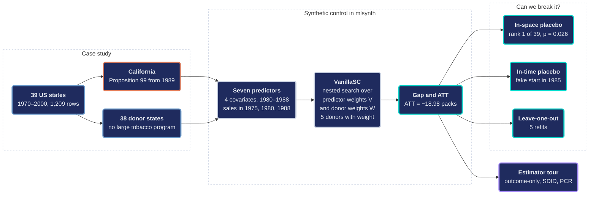
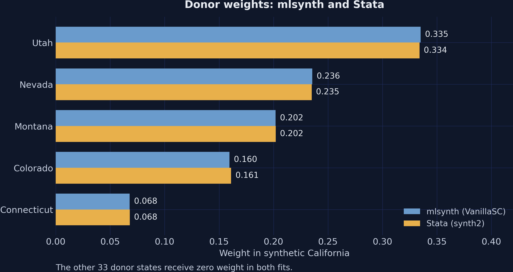
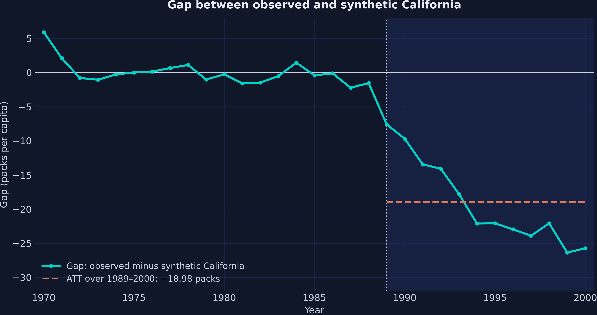

---
authors:
- admin
categories:
  - Python
  - Synthetic Control
date: "2026-10-04T00:00:00Z"
draft: false
featured: false
image:
  caption: ""
  focal_point: "Smart"
  placement: 3
  preview_only: false
links:
- icon: chalkboard-teacher
  icon_pack: fas
  name: "Slides (HTML)"
  url: slides/index.html
- icon: poll
  icon_pack: fas
  name: "Interactive slides (AhaSlides)"
  url: https://presenter.ahaslides.com/share/1791196372251-qpgn4k0rq1
- icon: laptop-code
  icon_pack: fas
  name: "Web app"
  url: web_app/index.html
- icon: code
  icon_pack: fas
  name: "Python script"
  url: script.py
- icon: bolt
  icon_pack: fas
  name: "Python cheat sheet"
  url: cheatsheet_python.py
- icon: bolt
  icon_pack: fas
  name: "R cheat sheet"
  url: cheatsheet_R.R
- icon: bolt
  icon_pack: fas
  name: "Stata cheat sheet"
  url: cheatsheet_stata.do
- icon: chart-bar
  icon_pack: fas
  name: "Stata edition of this post"
  url: /tutorials/stata_sc/
- icon: file-code
  icon_pack: fas
  name: "Quarto project (.zip)"
  url: python_sc101.zip
- icon: database
  icon_pack: fas
  name: "Dataset (.dta)"
  url: https://github.com/quarcs-lab/data-open/raw/master/isds/smoking_sc.dta
- icon: book
  icon_pack: fas
  name: "Data dictionary"
  url: data/index.html
- icon: open-data
  icon_pack: ai
  name: "Google Colab"
  url: https://colab.research.google.com/github/cmg777/starter-academic-v501/blob/master/content/tutorials/python_sc101/notebook.ipynb
- icon: markdown
  icon_pack: fab
  name: "MD version"
  url: https://raw.githubusercontent.com/cmg777/starter-academic-v501/master/content/tutorials/python_sc101/index.md
summary: "Learn the synthetic control method and the mlsynth library in Python with the Proposition 99 tobacco case. The tutorial builds a synthetic California from five donor states and reads its weights and predictor balance. It tests the result with in-space and in-time placebos and leave-one-out refits, replicates the Stata edition, and compares four mlsynth estimators."
tags:
- python
- causal
- causal inference
- synthetic control
- mlsynth
- panel data
- policy evaluation
title: "Introduction to the Synthetic Control Method in Python with mlsynth"
toc: true
diagram: true
---

## Abstract

Cigarette sales across the United States peaked in the mid-1970s and fell steadily through the 1980s. This tutorial asks how much Proposition 99, the tobacco control program that California began in 1989, reduced cigarette sales per capita. Because sales were already falling everywhere, a simple before-and-after comparison cannot isolate the effect of this single state policy. The tutorial therefore introduces the synthetic control method and the Python library mlsynth. The data, shared with the Stata edition, form a balanced panel of 39 US states from 1970 to 2000 (1,209 observations). The `VanillaSC` estimator of mlsynth matches California on four covariates and on cigarette sales in 1975, 1980, and 1988. Synthetic California combines five states, led by Utah, and tracks California before 1989 with a root mean squared error of 1.754 packs. The average treatment effect on the treated (ATT) is −18.98 packs per capita per year over 1989–2000, a reduction of 23.9 percent relative to mean synthetic sales. By 2000, sales are 38.2 percent below the synthetic path, a gap to which a second tax increase in 1999 may also contribute. The baseline estimates closely reproduce the Stata benchmark, which reports an ATT of −19.00. In-space placebos, an in-time placebo, and leave-one-out refits then try to break the result. California ranks first among 39 states in the placebo test (p = 0.026), and leave-one-out estimates stay between −19.29 and −17.52 packs. A fake start in 1985, however, yields gaps about one third as large as the real effect. Despite this caveat about timing, the evidence indicates that a program combining a cigarette tax with anti-smoking education can reduce cigarette sales substantially and persistently.

<a href="https://colab.research.google.com/github/cmg777/starter-academic-v501/blob/master/content/tutorials/python_sc101/notebook.ipynb" target="_blank" rel="noopener"></a>

## 1. Overview

In November 1988, California voters approved **Proposition 99**. The measure raised the state cigarette tax by 25 cents per pack from January 1989 and funded anti-smoking education. Cigarette sales, however, were already falling across the country, so the decline after 1989 cannot be credited to the program without a comparison. We therefore ask a counterfactual question: how much lower were sales in California because of Proposition 99? The counterfactual is the path of sales that California would have recorded without the program, and no data set observes it directly.

The **synthetic control method** answers this question with a weighted average of other states. The weights make the average reproduce California before 1989, so the same average after 1989 estimates sales without the program. Abadie, Diamond, and Hainmueller (2010) developed the method with this very case, building on Abadie and Gardeazabal (2003). This tutorial follows their design.

The Python library [mlsynth](https://github.com/jgreathouse9/mlsynth), written by Jared Greathouse, implements the method together with many related estimators behind one configuration dictionary. An estimator, in this sense, is a rule that turns data into an estimate. This tutorial teaches the method and the library together, one step at a time.

The tutorial also replicates every step of the [Stata edition](/tutorials/stata_sc/), which uses the `synth2` command of Yan and Chen (2023). The Stata comparison serves only as a cross-check. Readers who do not use Stata can therefore skip the Stata benchmark boxes and Section 11, and they can ignore the Stata values inside some code blocks.

This post is the entry point to a series of tutorials on synthetic control in Python. The [Bayesian spatial post](/tutorials/python_sc_bayes_spatial/) revisits Proposition 99 and models spillovers to neighboring states. The [synthetic control ladder](/tutorials/python_sc_dsc_sdid/) applies one mlsynth estimator per rung, from difference-in-differences to synthetic difference-in-differences, to the Brexit referendum. Readers who want a contrasting design can turn to the [introduction to difference-in-differences](/tutorials/python_did101/), a companion post in the same format.

### 1.1 Learning objectives

This tutorial has two aims. It explains the logic of the synthetic control method, and it teaches the mlsynth library one step at a time. By the end of the tutorial, you will be able to:

- Explain why a **before-and-after comparison** and the **average of other states** give misleading counterfactuals for a single treated state.
- Build a synthetic control with the **`VanillaSC` class of mlsynth** from one configuration dictionary, with covariates and past values of sales (lagged outcomes) as predictors.
- Read the **donor weights, predictor weights, and predictor balance** from the result object, and judge the **pre-treatment fit**.
- Compute the **gap path and the ATT**, and express the ATT in packs and in percent.
- Assess significance with an **in-space placebo test**, the **ratio of mean squared prediction errors (MSPE ratio)**, and the **permutation p-value**. Refine the test with the **cut(2) filter**, which drops badly fitted placebo states, and with **pointwise p-values**.
- Check robustness with an **in-time placebo** and **leave-one-out refits**, and compare the result with **outcome-only synthetic control, synthetic difference-in-differences (SDID), and principal component regression (PCR)** in mlsynth.

### 1.2 Study design

The diagram summarizes the study design in three blocks. The first block describes the case: one treated state and 38 possible donor states. The second block builds synthetic California with mlsynth, and the third block tries to break the result with three robustness checks.



The colors of the diagram encode the role of each box. The blue boxes describe the data, the orange box marks the single treated state, and the gray boxes build synthetic California. The teal boxes report or test its result, and the violet box marks the extension, in which the same data feed three other mlsynth estimators.

### 1.3 Key concepts at a glance

This tutorial relies on a small vocabulary. Each concept below has a definition, an example, and an analogy. The definition is always visible, while the example and the analogy open with a click. Readers who meet an unfamiliar term later, such as the MSPE ratio or the donor weights, can return to this section.

**1. Synthetic control method (SCM).**
The synthetic control method builds a comparison unit from a weighted average of untreated units. The weights make the comparison unit reproduce the treated unit before the policy. After the policy, the comparison unit estimates what would have happened without it.

<div class="concept-pair">
<details class="concept-card concept-example">
<summary>Example</summary>

We build a synthetic California from 38 donor states. Only a few states receive positive weight, and their weighted sales track California closely from 1970 to 1988. The typical miss, the root mean squared error (RMSE) that concept 5 defines, is only 1.754 packs per capita. After 1989, the synthetic path estimates the sales that California would have recorded without Proposition 99.

</details>

<details class="concept-card concept-analogy">
<summary>Analogy</summary>

A sound engineer must replace a singer who cannot record the final chorus. The engineer blends recordings of other singers until the blend matches the original voice in every verse. The blend then sings the chorus that the original singer would have sung.

</details>
</div>

**2. Donor pool.**
The donor pool is the set of untreated units that may enter the synthetic control. Each donor must be free of the treatment and of similar policies during the study period. A contaminated donor pool produces a misleading counterfactual.

<div class="concept-pair">
<details class="concept-card concept-example">
<summary>Example</summary>

Our donor pool contains the 38 states other than California in the data file. Abadie, Diamond, and Hainmueller (2010) had already removed states with large tobacco programs or large tax increases, such as Arizona, Massachusetts, and Oregon. The code therefore uses every remaining state as a potential donor.

</details>

<details class="concept-card concept-analogy">
<summary>Analogy</summary>

A casting director auditions only actors who have never played the role. An actor who already played it would bring habits from that production. The audition list must be clean before the casting starts.

</details>
</div>

**3. Donor weights** $w\_j$ (the vector W).
Donor weights state how much each donor contributes to the synthetic control. They cannot be negative, and they must sum to one. These two rules keep the synthetic control inside the range of the donors and make it easy to read.

<div class="concept-pair">
<details class="concept-card concept-example">
<summary>Example</summary>

Suppose that a recipe put three quarters of the weight on a donor state with low sales and one quarter on a donor state with high sales. In every year, synthetic sales would then equal three quarters of the sales of the first state plus one quarter of the sales of the second. Because both weights are nonnegative and sum to one, the synthetic path always lies between the two donors. Section 7.3 reports the weights that mlsynth actually chooses.

</details>

<details class="concept-card concept-analogy">
<summary>Analogy</summary>

A smoothie recipe lists the share of each fruit in the glass. No share can be negative, because nobody can remove fruit that was never added. The shares must add up to one full glass.

</details>
</div>

**4. Predictors and predictor weights** $v\_m$ (the diagonal of the matrix V).
Predictors are the characteristics on which the synthetic control must resemble the treated unit. They include covariates and outcome values from chosen pre-treatment years. Covariates are characteristics of a state other than the outcome, such as GDP per capita or the retail price of cigarettes. Predictor weights set how much a mismatch on each predictor counts in the fit.

<div class="concept-pair">
<details class="concept-card concept-example">
<summary>Example</summary>

We use four covariates averaged over 1980–1988 and cigarette sales in 1975, 1980, and 1988. A large weight on sales in 1975, for example, would make any mismatch on that predictor costly, so the fit would match it closely. Section 7.4 compares the predictor weights that mlsynth and Stata choose for these seven predictors.

</details>

<details class="concept-card concept-analogy">
<summary>Analogy</summary>

A tailor takes many body measurements before cutting a suit. Two tailors may stress different measurements and still cut the same suit. The customer wears the suit, not the list of priorities.

</details>
</div>

**5. Pre-treatment fit.**
Pre-treatment fit measures how closely the synthetic control tracks the treated unit before the policy. Its usual summary is the root mean squared error (RMSE) of the pre-treatment gaps, the yearly differences between the treated unit and its synthetic control. The RMSE is the square root of the average squared gap, so it measures the typical miss in packs per capita. A close fit is necessary for a credible counterfactual, but it is not sufficient.

<div class="concept-pair">
<details class="concept-card concept-example">
<summary>Example</summary>

The RMSE of synthetic California over 1970–1988 is 1.754 packs per capita. This miss is about 1.5 percent of the average sales of 116.21 packs in those years. The largest single miss is 5.90 packs, in 1970. By this yardstick, the fit is close, and the miss of 1970 is an exception at the very start of the series.

</details>

<details class="concept-card concept-analogy">
<summary>Analogy</summary>

A weather service earns trust by forecasting past days well. A service that missed every past storm deserves little trust tomorrow. A strong record is still no guarantee, because tomorrow can bring a new kind of storm.

</details>
</div>

**6. Gap and ATT.**
The gap is the difference between the treated unit and its synthetic control in a given year. The average treatment effect on the treated (ATT) is the mean gap over the post-treatment years. It measures the effect on the treated unit only.

<div class="concept-pair">
<details class="concept-card concept-example">
<summary>Example</summary>

The gap is −7.59 packs in 1989 and widens to −25.73 packs by 2000. Averaged over 1989–2000, the ATT is −18.98 packs per capita per year. Relative to the synthetic path, this is a reduction of 23.9 percent.

</details>

<details class="concept-card concept-analogy">
<summary>Analogy</summary>

A runner follows a pacer for the first half of a race. In the second half, the runner tries a new drink, and the distance to the pacer changes. The distance at each kilometer is the gap, and its average is the effect of the drink on that runner.

</details>
</div>

**7. In-space placebo and MSPE ratio.**
An in-space placebo test applies the same method to every donor as if it had been treated. The mean squared prediction error (MSPE) is the average squared gap. The MSPE ratio divides the MSPE after the policy by the MSPE before the policy. The permutation p-value is the share of units whose ratio is at least as large as that of the treated unit. If the policy mattered, the ratio of the treated unit should be unusually large, and its p-value small.

<div class="concept-pair">
<details class="concept-card concept-example">
<summary>Example</summary>

Suppose that one state among the 39 had the largest MSPE ratio of all. It would rank first, and its permutation p-value would be 1/39 = 0.026, the smallest value that 39 states allow. A state that ranked second would have a p-value of 2/39 = 0.051, so the evidence weakens as a state moves down the ranking.

</details>

<details class="concept-card concept-analogy">
<summary>Analogy</summary>

A teacher suspects one student because the score of that student jumped. The teacher compares that jump with the jumps of every other student. The more unusual the jump is within the class, the stronger the suspicion.

</details>
</div>

**8. In-time placebo and leave-one-out.**
An in-time placebo moves the treatment date to a year before the real policy. A leave-one-out check removes one important donor at a time and refits the model. Both tests try to break the result in ways that a real effect should survive.

<div class="concept-pair">
<details class="concept-card concept-example">
<summary>Example</summary>

Both checks have direct counterparts in this tutorial. With a fake start in 1985, the model is fitted to 1970–1984, and the fake gaps for 1985–1988 average −5.97 packs. The same fit gives a mean gap of −18.75 over 1989–2000, so the fake gaps are about one third as large. The leave-one-out check refits the model five times, once without each of the five donors that receive weight, and Section 10 reports how far these estimates move.

</details>

<details class="concept-card concept-analogy">
<summary>Analogy</summary>

An engineer tests a bridge in two ways. She first checks the gauges on a day when no truck crosses. She then removes one support at a time and checks that the deck still holds.

</details>
</div>

These eight concepts cover the vocabulary that the walkthrough assumes. The next section installs mlsynth and records the software stack, because the placebo results depend on it. Section 3 then loads the data and checks their structure.

---

## 2. Setup and imports

The analysis needs one specialized library, mlsynth, and a few standard ones. We pin the version of mlsynth, that is, we install one exact release, because the library is young and changes quickly. The following command installs it together with its dependencies:

```bash
pip install mlsynth==1.0.0
```

A version pin alone is not enough, for two reasons. First, the version number does not identify the code. PyPI, the Python Package Index from which pip installs packages, serves release 1.0.0. Later commits on GitHub, that is, saved versions of the code such as 15f168b, print the same version number, and some of them behave differently. Second, the placebo fits of the donor states depend on the optimizer, the numerical search routine that finds the weights. Another software stack can thus move a few numbers in the third decimal. For both reasons, the block below prints the versions of the whole stack and a build fingerprint, and every number in this post comes from that stack.

```python
import platform
import warnings
from importlib import metadata
from pathlib import Path

import matplotlib.pyplot as plt
import matplotlib.patches as mpatches
from matplotlib.lines import Line2D
import numpy as np
import pandas as pd
import statsmodels.formula.api as smf
from scipy.optimize import minimize

from mlsynth import CLUSTERSC, SDID, VanillaSC
from mlsynth.exceptions import MlsynthConfigError, MlsynthDataError
from mlsynth.utils.vanillasc_helpers.config import VanillaSCConfig

warnings.filterwarnings("ignore", category=DeprecationWarning)
RANDOM_SEED = 42                       # the seed of the Stata do-file
np.random.seed(RANDOM_SEED)

# The versions that produced every number in this post
print(f"Python {platform.python_version()}")
for package in ["mlsynth", "numpy", "pandas", "scipy", "matplotlib",
                "cvxpy", "scs", "statsmodels"]:
    print(f"  {package:<12} {metadata.version(package)}")

# Build fingerprint: the PyPI release of 1.0.0 has no fit_window field,
# while the GitHub build 15f168b has one
build = "pypi" if "fit_window" not in VanillaSCConfig.model_fields else "git"
print(f"mlsynth build: {build}")
```

```text
Python 3.13.11
  mlsynth      1.0.0
  numpy        2.3.5
  pandas       3.0.1
  scipy        1.17.1
  matplotlib   3.10.8
  cvxpy        1.8.1
  scs          3.2.8
  statsmodels  0.14.6
mlsynth build: pypi
```

The output confirms mlsynth 1.0.0 from PyPI, together with numpy 2.3.5, pandas 3.0.1, and scipy 1.17.1. The fingerprint reads `pypi`: the line checks whether the installed version has a configuration field, `fit_window`, that only the GitHub version has. Readers on Google Colab may see other versions of the standard libraries, which can move a few placebo results slightly. The table below summarizes the role of each package in this post.

| Package | Purpose |
|---------|---------|
| `mlsynth` | Synthetic control estimators (`VanillaSC`, `SDID`, and `CLUSTERSC`) behind one configuration dictionary |
| `pandas` and `numpy` | Data loading, reshaping, and arithmetic |
| `matplotlib` | All figures, drawn with the dark theme of the site |
| `scipy` | The inner weight problem of Exercise 6 |
| `statsmodels` | The two-way fixed effects regression of Exercise 5 |

All figures in this post use the dark theme of the site. The collapsed block below sets the colors and the font sizes once, so every later figure inherits them. It also defines a helper, `signed()`, that writes negative numbers in figure labels with a true minus sign.

<details>
<summary>Show the dark figure theme</summary>

```python
# Site color palette
STEEL_BLUE = "#6a9bcc"
WARM_ORANGE = "#d97757"
NEAR_BLACK = "#141413"
TEAL = "#00d4c8"

# Dark theme palette
DARK_NAVY = "#0f1729"
GRID_LINE = "#1f2b5e"
LIGHT_TEXT = "#c8d0e0"
WHITE_TEXT = "#e8ecf2"

# Extra colors for donors, Stata values, and the robustness checks
GREY_DONOR = "#54618a"
GOLD = "#e8b04b"
LIGHT_ORANGE = "#e8956a"
LAVENDER = "#a58fd8"
SAGE = "#8fbf7f"

plt.rcParams.update({
    "figure.facecolor": DARK_NAVY,
    "axes.facecolor": DARK_NAVY,
    "axes.edgecolor": DARK_NAVY,
    "axes.linewidth": 0,
    "axes.labelcolor": LIGHT_TEXT,
    "axes.titlecolor": WHITE_TEXT,
    "axes.spines.top": False,
    "axes.spines.right": False,
    "axes.spines.left": False,
    "axes.spines.bottom": False,
    "axes.grid": True,
    "grid.color": GRID_LINE,
    "grid.linewidth": 0.6,
    "grid.alpha": 0.8,
    "xtick.color": LIGHT_TEXT,
    "ytick.color": LIGHT_TEXT,
    "xtick.major.size": 0,
    "ytick.major.size": 0,
    "text.color": WHITE_TEXT,
    "font.size": 12,
    "legend.frameon": False,
    "legend.fontsize": 11,
    "legend.labelcolor": LIGHT_TEXT,
    "figure.edgecolor": DARK_NAVY,
    "savefig.facecolor": DARK_NAVY,
    "savefig.edgecolor": DARK_NAVY,
})

# The same colors for the native res.plot() figures of mlsynth
MLSYNTH_DARK_THEME = {
    "figure.facecolor": DARK_NAVY, "axes.facecolor": DARK_NAVY,
    "savefig.facecolor": DARK_NAVY, "text.color": WHITE_TEXT,
    "axes.labelcolor": LIGHT_TEXT, "axes.titlecolor": WHITE_TEXT,
    "xtick.color": LIGHT_TEXT, "ytick.color": LIGHT_TEXT,
    "grid.color": GRID_LINE, "grid.alpha": 0.8,
    "legend.facecolor": DARK_NAVY, "legend.edgecolor": GRID_LINE,
    "legend.labelcolor": LIGHT_TEXT, "font.sans-serif": ["DejaVu Sans"],
    "font.weight": "normal", "axes.titlesize": 13, "axes.labelsize": 12,
    "xtick.labelsize": 11, "ytick.labelsize": 11, "legend.fontsize": 11,
}


def signed(x, nd=2):
    """Format a number for figure text, with a Unicode minus sign."""
    x = round(float(x), nd) + 0.0           # adding 0.0 turns -0.0 into 0.0
    return f"{x:.{nd}f}".replace("-", "−")
```

</details>

The environment is now fixed, and every figure shares one theme. The next section loads the data and checks their structure. These checks come first, because every later number depends on them.

## 3. Data loading and exploration

### 3.1 Load the data

The data are the panel of Abadie, Diamond, and Hainmueller (2010), distributed by the [QuaRCS Lab](https://github.com/quarcs-lab/data-open) as a Stata file. The helper `load_data()` reads a local CSV copy when one exists and falls back to the Stata file on GitHub otherwise. Both paths return identical numbers, because the CSV stores the exact values of the Stata file.

```python
DATA_URL = "https://github.com/quarcs-lab/data-open/raw/master/isds/smoking_sc.dta"
CSV_CANDIDATES = (Path("data") / "smoking_sc.csv", Path("smoking_sc.csv"))
NUMERIC = ["cigsale", "lnincome", "beer", "age15to24", "retprice"]


def load_data(candidates=CSV_CANDIDATES, url=DATA_URL):
    """Load the panel: a local CSV copy first, the Stata file otherwise."""
    for path in candidates:
        if Path(path).exists():
            return pd.read_csv(path, float_precision="round_trip"), str(path)
    raw = pd.read_stata(url)                       # state is a labeled categorical
    df = raw.assign(state=raw["state"].astype(str), year=raw["year"].astype(int))
    df[NUMERIC] = df[NUMERIC].astype("float64")    # exact float32 to float64
    return df[["state", "year", *NUMERIC]], url


df, source = load_data()
print(f"Loaded {len(df)} rows from {source}")
print(f"Shape: {df.shape}")
print(df.head().round(3))
```

```text
Loaded 1209 rows from data/smoking_sc.csv
Shape: (1209, 7)
     state  year  cigsale  lnincome  beer  age15to24  retprice
0  Alabama  1970     89.8       NaN   NaN      0.179      39.6
1  Alabama  1971     95.4       NaN   NaN      0.180      42.7
2  Alabama  1972    101.1     9.498   NaN      0.181      42.3
3  Alabama  1973    102.9     9.550   NaN      0.182      42.1
4  Alabama  1974    108.2     9.537   NaN      0.183      43.1
```

The panel has 1,209 rows and seven columns: the state, the year, the outcome `cigsale`, and four covariates. The source line names the local CSV file, and on Google Colab it shows the GitHub URL instead, with the same numbers. Missing values (NaN) appear already in the first rows, because `lnincome` and `beer` are not observed in the early years. The next two blocks measure how much of each variable is missing.

Summary statistics reveal the scale and the coverage of each variable. The count column is especially useful here, because it shows how many state-year cells each variable fills. We print the statistics with the `describe()` method of pandas.

```python
print(df[NUMERIC].describe().T.round(3))
```

```text
            count     mean     std     min      25%      50%      75%      max
cigsale    1209.0  118.893  32.767  40.700  100.900  116.300  130.500  296.200
lnincome   1014.0    9.862   0.171   9.397    9.739    9.861    9.973   10.487
beer        546.0   23.430   4.223   2.500   20.900   23.300   25.100   40.400
age15to24   819.0    0.175   0.015   0.129    0.166    0.178    0.187    0.204
retprice   1209.0  108.342  64.382  27.300   50.000   95.500  158.400  351.200
```

Cigarette sales average 118.89 packs per capita and range from 40.70 to 296.20 across states and years. The variable `age15to24` lies between 0.13 and 0.20. It is therefore a share of the population, although the original file labels it as a percent. Sales and the retail price are complete, with 1,209 observations each, but `lnincome` has 1,014 observations, `age15to24` has 819, and `beer` only 546. These counts already suggest that some predictor averages will rest on only part of their windows, a point that Section 3.2 checks.

### 3.2 Panel structure and coverage

A synthetic control needs a balanced panel, in which every state appears in every year. It also needs predictors that are observed in the years over which we average them. The next block checks the panel structure and records the first and the last year with data for each variable.

```python
TREATED = "California"
STATES = df["state"].drop_duplicates().tolist()    # Stata order: California is third
DONORS = [s for s in STATES if s != TREATED]
rows_per_state = df.groupby("state").size()
print(f"States: {len(STATES)}; donor states: {len(DONORS)}")
print(f"Years: {df['year'].nunique()} ({df['year'].min()} to {df['year'].max()}); "
      f"rows per state: {rows_per_state.min()} to {rows_per_state.max()}")

coverage = pd.DataFrame([{
    "variable": c,
    "n_obs": int(df[c].notna().sum()),
    "first_year": int(df.loc[df[c].notna(), "year"].min()),
    "last_year": int(df.loc[df[c].notna(), "year"].max())} for c in NUMERIC])
print(coverage.to_string(index=False))
```

```text
States: 39; donor states: 38
Years: 31 (1970 to 2000); rows per state: 31 to 31
 variable  n_obs  first_year  last_year
  cigsale   1209        1970       2000
 lnincome   1014        1972       1997
     beer    546        1984       1997
age15to24    819        1970       1990
 retprice   1209        1970       2000
```

The panel is balanced, with 39 states, 31 years from 1970 to 2000, and 31 rows per state. California is the treated state, so the other 38 states form the donor pool. Coverage differs sharply across variables, since beer consumption starts only in 1984 and the age share ends in 1990. The beer average over 1980–1988 therefore rests on 1984–1988 only, a fact that will later limit the in-time placebo.

Average sales also differ widely across states. This spread matters for the method. A weighted average of donors can reach California only if some donors sell less than California and others sell more. The block below lists the three lowest and the three highest averages over 1970–2000, the full period of the data. It then ranks California over 1970–1988 alone, because the later years already contain the effect of the program.

```python
state_means = df.groupby("state")["cigsale"].mean().sort_values()
print("Lowest average sales, 1970 to 2000 (packs per capita):")
print(state_means.head(3).round(2).to_string(header=False))
print("Highest average sales, 1970 to 2000 (packs per capita):")
print(state_means.tail(3).round(2).to_string(header=False))
pre_means = df[df["year"] <= 1988].groupby("state")["cigsale"].mean().sort_values()
print(f"California, 1970 to 1988: {pre_means['California']:.2f} packs, rank "
      f"{pre_means.index.get_loc('California') + 1} of {len(pre_means)} from the lowest")
```

```text
Lowest average sales, 1970 to 2000 (packs per capita):
Utah          63.84
New Mexico    84.26
California    94.59
Highest average sales, 1970 to 2000 (packs per capita):
North Carolina    164.29
Kentucky          187.94
New Hampshire     213.06
California, 1970 to 1988: 116.21 packs, rank 14 of 39 from the lowest
```

Utah has the lowest average, 63.84 packs per capita, and New Hampshire the highest, 213.06 packs. California ranks third lowest over 1970–2000, at 94.59 packs, but that average includes the program years from 1989 onward, when sales in California fell steeply. Over 1970–1988, the years that the fit uses, California averages 116.21 packs and ranks 14th of 39, so 13 states sell less and 25 sell more. A weighted average of donors can therefore reach the level of California. Utah, which has by far the lowest sales, is a natural ingredient for synthetic California.

The table below describes the seven variables. The name `lnincome` suggests income, but the variable measures log GDP per capita, and `age15to24` is a share rather than a percent. The role column anticipates how each variable enters the synthetic control.

| Variable | Description | Role |
|----------|-------------|------|
| `state` | State name (39 states) | Panel unit |
| `year` | Year, 1970–2000 | Time variable |
| `cigsale` | Cigarette sales per capita, in packs | Outcome |
| `lnincome` | Log of state GDP per capita | Predictor, averaged over 1980–1988 |
| `age15to24` | Share of the population aged 15–24 (a fraction) | Predictor, averaged over 1980–1988 |
| `retprice` | Average retail price of cigarettes | Predictor, averaged over 1980–1988 |
| `beer` | Beer consumption per capita | Predictor, averaged over 1984–1988, the years with data |

> **Stata benchmark.** The `summarize` command in the Stata log reports the same counts: 1,209 observations of `cigsale`, 1,014 of `lnincome`, 546 of `beer`, and 819 of `age15to24`. Its mean of `cigsale`, 118.8932, matches the Python mean. The `xtsum` table lists a lowest state mean of 63.84 packs and a highest of 213.06 packs, the averages of Utah and New Hampshire. The two programs therefore start from identical data.

The data are clean and balanced, and their coverage limits are known. Before we build any synthetic control, we ask whether a simpler comparison would suffice. The answer shows why the synthetic control method needs weights.

## 4. Raw trends: California versus the average donor state

The simplest counterfactual for California is the average of the 38 donor states. If California had moved in step with that average before 1989, the average after 1989 would be a reasonable guess for California without the program. We test this idea by comparing the two series year by year.

<div class="learn-card predict-card">
<p class="learn-card-kicker">Predict first</p>

Before 1989, sales in California and in the other states rose until the mid-1970s and then fell. Did California follow the average of the 38 donor states closely enough for that average to serve as its counterfactual? Will the gap between California and the donor average in 1988 be smaller than, similar to, or larger than the gap in 1970? Commit to an answer before scrolling.

<details class="learn-card-reveal">
<summary>Reveal the answer</summary>

**Answer.** No, it did not, and the gap in 1988 is far larger than the gap in 1970. The two series were close in 1970, at 123.0 against 120.08 packs, a gap of 2.92. By 1988, however, California sold 90.1 packs against 113.82 for the average, a gap of −23.72. A comparison with the average would therefore attribute to Proposition 99 a relative decline that began long before 1989.

</details>
</div>

```python
TREAT_YEAR, FIRST_YEAR, LAST_YEAR = 1989, 1970, 2000
T0 = TREAT_YEAR - FIRST_YEAR                 # 19 pre-treatment years, 1970–1988

# Wide table: one row per year (31) and one column per state (39), in Stata order
Y = df.pivot(index="year", columns="state", values="cigsale")[STATES]
YEARS = Y.index.to_numpy()
ca_sales = Y[TREATED].to_numpy()
donor_avg = Y[DONORS].mean(axis=1).to_numpy()

trend = pd.DataFrame({"year": YEARS, "california": ca_sales,
                      "donor_average": donor_avg,
                      "difference": ca_sales - donor_avg})
print(trend[trend["year"].isin([1970, 1975, 1980, 1985, 1988, 1989, 1995, 2000])]
      .round(2).to_string(index=False))
sales_1988 = Y.loc[1988, DONORS]
print(f"Donor range in 1988: {sales_1988.min():.1f} ({sales_1988.idxmin()}) to "
      f"{sales_1988.max():.1f} ({sales_1988.idxmax()})")
```

```text
 year  california  donor_average  difference
 1970       123.0         120.08        2.92
 1975       127.1         136.93       -9.83
 1980       120.2         138.09      -17.89
 1985       102.8         123.12      -20.32
 1988        90.1         113.82      -23.72
 1989        82.4         109.66      -27.26
 1995        56.4         103.16      -46.76
 2000        41.6          92.13      -50.53
Donor range in 1988: 55.0 (Utah) to 180.4 (New Hampshire)
```

California started 2.92 packs above the donor average in 1970 but sat 23.72 packs below it in 1988. The difference kept growing after 1989 and reached −50.53 packs in 2000. The simple average therefore drifts away from California long before the program.

The figure below shows every donor state, their average, and California. The thin gray lines reveal how different the donor states are from one another. The dashed blue line is the average that the naive comparison would use.

<details>
<summary>Show the plotting code</summary>

```python
fig, ax = plt.subplots(figsize=(11, 6))
fig.patch.set_linewidth(0)
for s in DONORS:
    ax.plot(YEARS, Y[s], color=GREY_DONOR, linewidth=0.8, alpha=0.6, zorder=1)
ax.plot([], [], color=GREY_DONOR, linewidth=1.2, label="Individual donor states")
ax.plot(YEARS, donor_avg, color=STEEL_BLUE, linewidth=2.6, linestyle="--",
        label="Average of the 38 donor states", zorder=3)
ax.plot(YEARS, ca_sales, color=WARM_ORANGE, linewidth=3.0, label="California",
        zorder=4)
ax.axvline(TREAT_YEAR, color=LIGHT_TEXT, linestyle=":", linewidth=1.5, zorder=2)
ax.text(TREAT_YEAR + 0.4, 285, "Proposition 99 (1989)", color=LIGHT_TEXT,
        fontsize=11, va="top")
ax.set_xlim(FIRST_YEAR - 0.5, LAST_YEAR + 0.5)
ax.set_ylim(0, 300)
ax.set_xlabel("Year", fontsize=12)
ax.set_ylabel("Cigarette sales (packs per capita)", fontsize=12)
ax.set_title("Cigarette sales in California and the 38 donor states, 1970–2000",
             fontsize=14, fontweight="bold", pad=12)
ax.legend(loc="lower left", fontsize=11)
plt.tight_layout()
plt.show()
```

</details>


*Figure 1. Cigarette sales in California and the 38 donor states, 1970–2000. California falls faster than the average donor long before Proposition 99.*

The figure adds a view that the table only hints at: the donor states differ widely from one another in every year. In 1988, for example, their sales range from 55.0 packs in Utah to 180.4 packs in New Hampshire, and many of them sell far more than California. The simple average gives every donor the same voice, and 25 of the 38 donors sell more than California, on average, over 1970–1988. The average therefore sits well above California after 1970 and cannot reproduce the path of California before 1989.

Two naive estimates are common in policy debates. The first compares sales in California before and after 1989, and the second subtracts the change of the average donor from the change of California. We compute both, because each will serve as a benchmark for the synthetic control. In the code, the slice `[:T0]` keeps the 19 years from 1970 to 1988, and `[T0:]` keeps the 12 years from 1989 to 2000.

```python
pre_ca, post_ca = ca_sales[:T0].mean(), ca_sales[T0:].mean()
pre_avg, post_avg = donor_avg[:T0].mean(), donor_avg[T0:].mean()
print(f"California: {pre_ca:.2f} before 1989, {post_ca:.2f} after "
      f"(change {post_ca - pre_ca:.2f})")
print(f"Donor average: {pre_avg:.2f} before 1989, {post_avg:.2f} after "
      f"(change {post_avg - pre_avg:.2f})")
print(f"Difference in the two changes: {(post_ca - pre_ca) - (post_avg - pre_avg):.2f}")
```

```text
California: 116.21 before 1989, 60.35 after (change -55.86)
Donor average: 130.57 before 1989, 102.06 after (change -28.51)
Difference in the two changes: -27.35
```

Sales in California fell by 55.86 packs per capita between the two periods, but the average donor also fell, by 28.51 packs. The before-and-after change therefore mixes the program with a national decline that started long before 1989. The difference in the two changes, −27.35 packs, is the difference-in-differences (DiD) estimate, and it removes the common decline. It assumes, however, that California and the average donor would have moved in parallel without the program. The data for 1970–1988 contradict that assumption, since the gap between them grew by more than 26 packs.

> **Stata benchmark.** The Stata edition draws the same comparison with a graph of California and the donor average. Its do-file also prints a note on the same pattern: sales in California started near the donor average in 1970. By 1988, the note adds, sales stood about 24 packs per capita below that average, a gap that the Python table puts at −23.72 packs.

The average donor is a poor twin for California. We need a counterfactual that is built to track California before 1989, and the synthetic control method provides exactly that. The next section explains how the method chooses its weights.

## 5. The synthetic control method

### 5.1 The core idea

The synthetic control method replaces the equal weights of the simple average with chosen weights. It searches for a combination of donor states whose weighted sales and characteristics match those of California before 1989. If the match holds for 19 years, the same combination after 1989 is a credible estimate of sales in California without Proposition 99.

The method has a natural limit: it interpolates between donors rather than extrapolating beyond them. Because the weights are nonnegative and sum to one, the synthetic control is a convex combination of the donors. In any year, synthetic California can therefore sell neither more than the highest donor nor less than the lowest donor. In 1988, California sold 90.1 packs, well inside the donor range from 55.0 to 180.4 packs that Section 4 printed, so a convex combination can reach it.

### 5.2 The weight problem

Formally, let unit 1 be California and units 2 to $J+1$ the $J = 38$ donors. Each unit has $k = 7$ predictors, and $X\_{jm}$ denotes predictor $m$ of unit $j$. The method chooses the donor weights $w\_j$ by solving the following problem, which we call Equation 1. Its first line defines the synthetic value of each predictor, its second line states the objective, and its third line states the constraints on the weights:

$$\hat{X}\_{1m} = \sum\_{j=2}^{J+1} w\_j X\_{jm}$$

$$\min\_{w\_2, \ldots, w\_{J+1}} \sum\_{m=1}^{k} v\_m \left( X\_{1m} - \hat{X}\_{1m} \right)^2$$

$$w\_j \geq 0 \quad \text{and} \quad \sum\_{j=2}^{J+1} w\_j = 1$$

In words, the problem chooses nonnegative donor weights that sum to one. The synthetic value $\hat{X}\_{1m}$ is the value of predictor $m$ for the weighted average of the donors. The weights make these synthetic values resemble California on each predictor, and the predictor weight $v\_m$ sets how much a mismatch on predictor $m$ counts.

The predictors come in different units, such as log GDP per capita, shares, prices, and packs. Before the fit, mlsynth therefore divides each predictor by its standard deviation across the 39 states, and the $v\_m$ apply to these scaled predictors. The fit thus compares California and the donors on a common scale.

Stata and mlsynth collect the donor weights $w\_j$ in a vector W. They place the predictor weights $v\_m$ on the diagonal of a matrix V, whose other entries are zero. The predictor weights are not fixed in advance. The nested method chooses them so that the resulting synthetic control also reproduces the sales of California from 1970 to 1988. The proof card below states this nested problem and explains why many different V can lead to the same donor weights.

<details class="learn-card proof-card">
<summary><span class="learn-card-kicker">Proof</span> The nested problem behind V and W, and why V is not unique</summary>

First, divide each predictor by its standard deviation across the 39 states. Then stack the scaled predictors of California in a vector $\mathbf{X}\_1$ and those of the donors in a matrix $\mathbf{X}\_0$, with one column per donor. For a vector $\mathbf{W}$ of donor weights, the vector $\mathbf{e}(\mathbf{W})$ collects the predictor mismatches between California and the weighted donors. Given a diagonal matrix $\mathbf{V}$ whose diagonal entries are the predictor weights $v\_m$, the inner problem picks the donor weights. The set $\Delta$, called the simplex, contains all weight vectors with nonnegative entries that sum to one.

$$\mathbf{e}(\mathbf{W}) = \mathbf{X}\_1 - \mathbf{X}\_0 \mathbf{W}$$

$$Q\_{\mathbf{V}}(\mathbf{W}) = \mathbf{e}(\mathbf{W})^\top \mathbf{V} \mathbf{e}(\mathbf{W})$$

$$\mathbf{W}(\mathbf{V}) = \arg\min\_{\mathbf{W} \in \Delta} Q\_{\mathbf{V}}(\mathbf{W})$$

In words, the inner problem restates Equation 1 in matrix form with scaled predictors. The transpose $\top$ turns the column of mismatches into a row, so $Q\_{\mathbf{V}}(\mathbf{W})$ adds up the weighted squared mismatches. This sum is the weighted distance between California and the weighted donors. The operator arg min returns the weights that make this distance smallest. The solution is therefore the convex combination of donors that is closest to California under the distance that $\mathbf{V}$ defines. The solution $\mathbf{W}(\mathbf{V})$ can change when $\mathbf{V}$ changes the relative cost of the mismatches. As the last paragraph of this card shows, however, it often does not. In Exercise 6, $\mathbf{X}\_1$ is the array `x1`, and $\mathbf{X}\_0$ is the transpose of the array `x0`, which stores one donor per row. The diagonal of $\mathbf{V}$ is the vector `v_stata`, and the function `inner_loss` computes $Q\_{\mathbf{V}}(\mathbf{W})$.

The outer problem then picks the predictor weights. It keeps the $\mathbf{V}$ whose donor weights best reproduce sales in California over the 19 pre-treatment years. The backend `mscmt` of mlsynth searches over $\mathbf{V}$ with differential evolution, a global search method, following Becker and Klößner (2018).

$$\hat{Y}\_{1t}(\mathbf{V}) = \sum\_{j=2}^{J+1} w\_j(\mathbf{V}) Y\_{jt}$$

$$u\_t(\mathbf{V}) = Y\_{1t} - \hat{Y}\_{1t}(\mathbf{V})$$

$$L(\mathbf{V}) = \sum\_{t=1970}^{1988} u\_t(\mathbf{V})^2$$

$$\mathbf{V}^{\ast} = \arg\min\_{\mathbf{V}} L(\mathbf{V})$$

In words, $u\_t(\mathbf{V})$ is the yearly miss of the pre-treatment sales path $\hat{Y}\_{1t}(\mathbf{V})$ that the donor weights of $\mathbf{V}$ produce. The outer loss $L(\mathbf{V})$ adds up the squares of these yearly misses over 1970–1988. The outer problem keeps the $\mathbf{V}$ that makes this loss smallest, so it judges each candidate only by that path. The final donor weights are therefore $w\_j^{\ast} = w\_j(\mathbf{V}^{\ast})$. In the code, $Y\_{1t}$ is the array `ca_sales` and $Y\_{jt}$ is the column of donor $j$ in the matrix `Y`. The search returns the predictor weights in `res.weights.summary_stats["predictor_weights"]`.

The outer problem cares about $\mathbf{V}$ only through $\mathbf{W}(\mathbf{V})$. When a few predictors can be matched almost exactly, many different $\mathbf{V}$ select the same $\mathbf{W}$, and the outer objective cannot tell them apart. The predictor weights are then not identified: the data cannot single out one set of predictor weights. Two programs can therefore report very different $\mathbf{V}$ with the same donor weights. Section 7.4 compares the $\mathbf{V}$ of mlsynth with the $\mathbf{V}$ of Stata, and Exercise 6 tests this claim by feeding the Stata $\mathbf{V}$ into the inner problem.

</details>

For later reference, Section 7 reads these quantities from the result object `res` of mlsynth. The donor weights $w\_j$ are `res.donor_weights`, and the predictor weights $v\_m$ are `res.weights.summary_stats["predictor_weights"]`. The `treated` entry of `res.additional_outputs["covariate_balance"]` holds the predictors $X\_{1m}$ of California before scaling.

### 5.3 The synthetic outcome, the gap, and the ATT

Once the weights are known, building the counterfactual is simple arithmetic. Synthetic California in year $t$ is the weighted average of donor sales in that year, and the gap is the difference between actual and synthetic sales. Equation 2 states the two definitions:

$$\hat{Y}\_{1t}^{N} = \sum\_{j=2}^{J+1} w\_j^{\ast} Y\_{jt}$$

$$\hat{\tau}\_t = Y\_{1t} - \hat{Y}\_{1t}^{N}$$

In words, the synthetic outcome $\hat{Y}\_{1t}^{N}$ applies the optimal weights $w\_j^{\ast}$ to the sales of the donors in year $t$. These weights solve Equation 1 at the predictor weights that the nested search selects. The superscript $N$ marks the outcome without the program, and the gap $\hat{\tau}\_t$ subtracts this synthetic outcome from actual sales $Y\_{1t}$. In the code, the two series are `res.counterfactual` and `res.gap`, short names for `res.time_series.counterfactual_outcome` and `res.time_series.estimated_gap`.

A single number summarizes the effect. It averages the gaps over the post-treatment years, from 1989 to 2000. With $T\_0 = 19$ pre-treatment years and $T\_1 = 12$ post-treatment years, Equation 3 defines the estimate:

$$\widehat{\mathrm{ATT}} = \frac{1}{T\_1} \sum\_{t=1989}^{2000} \hat{\tau}\_t$$

In words, the ATT is the mean of the 12 yearly gaps from 1989 to 2000. A negative value means that California sold fewer packs than synthetic California, on average, after the program began. The code returns this average as `res.att`, and `res.effects.att_percent` expresses it as a percent of mean synthetic sales.

### 5.4 Estimand and assumptions

> **Estimand: the ATT.** An estimand is the quantity that an analysis targets. Here it is the effect of Proposition 99 on California, the only treated state. The synthetic control method does not estimate what the same program would do in Nevada or Texas. The distinction matters, because the response of California may differ from the response of states with other smoking habits and other prices.

The estimate has a causal reading only under several assumptions, which Abadie (2021) discusses in detail. None of them can be fully tested, but the robustness checks of Sections 8 to 10 probe some of them. The list below states each assumption in the context of Proposition 99.

- **No interference.** The program must not change sales in the donor states. Cross-border purchases could violate this assumption if a neighboring state enters synthetic California, and Section 7.3 shows whether one does.
- **No anticipation.** Sales in California must not respond to the program before 1989. Voters approved the measure in November 1988, so any anticipation should be concentrated near the end of the pre-treatment period.
- **No donor contamination.** The donor states must not adopt similar programs during the study period. Abadie, Diamond, and Hainmueller (2010) enforced this assumption when they built the data, by dropping states with large tobacco programs or large tax increases.
- **Interpolation.** California must lie inside the range of the donors on the outcome and the predictors, so that a convex combination can match it.
- **A long, well-fitted pre-treatment period.** Nineteen years of close fit make it unlikely that the match is a coincidence, while a short or poorly fitted period would undermine the counterfactual.

The method is now defined. The next section shows how mlsynth expresses the same problem as one dictionary of settings. That dictionary is the only interface that a beginner needs to learn.

## 6. Meet mlsynth: one dictionary, one fit

The mlsynth library organizes every estimator around the same pattern. We describe the data and the settings in a Python dictionary, pass it to an estimator class, and call `fit()`. For the classic synthetic control of Section 5, the estimator class is `VanillaSC`, whose name marks the plain, unmodified method. Section 12 reuses the same pattern with two other classes, `SDID` and `CLUSTERSC`. This section prepares the data in the format that mlsynth expects and then writes the dictionary for the baseline model.

### 6.1 Prepare the columns

The mlsynth library needs two kinds of columns that the raw data do not contain. The first is a treatment indicator that equals 1 for California from 1989 onward. The second is a separate column for each lagged outcome that serves as a predictor, because every predictor must be a column name.

```python
LAG_YEARS = (1988, 1980, 1975)        # cigsale(1988), cigsale(1980), cigsale(1975) in Stata


def prepare_panel(df):
    """Add the treatment indicator and the three lagged-outcome columns."""
    out = df.copy()
    out["treated"] = ((out["state"] == TREATED)
                      & (out["year"] >= TREAT_YEAR)).astype(int)
    for y in LAG_YEARS:
        sales = out.loc[out["year"] == y].set_index("state")["cigsale"]
        out[f"cigsale_{y}"] = out["state"].map(sales)
    return out


panel = prepare_panel(df)
print(f"Treated rows (California, 1989 to 2000): {panel['treated'].sum()}")
show = panel["state"].isin([TREATED, "Utah"]) & panel["year"].isin([1988, 1989])
cols = ["state", "year", "cigsale", "treated", "cigsale_1988", "cigsale_1980", "cigsale_1975"]
print(panel.loc[show, cols].round(1).to_string(index=False))
```

```text
Treated rows (California, 1989 to 2000): 12
     state  year  cigsale  treated  cigsale_1988  cigsale_1980  cigsale_1975
California  1988     90.1        0          90.1         120.2         127.1
California  1989     82.4        1          90.1         120.2         127.1
      Utah  1988     55.0        0          55.0          74.8          75.8
      Utah  1989     57.0        0          55.0          74.8          75.8
```

The indicator `treated` equals 1 in 12 rows, the years 1989–2000 of California. The lag columns repeat one number within each state: California has 90.1 packs in `cigsale_1988`, 120.2 in `cigsale_1980`, and 127.1 in `cigsale_1975` in every year. Each lag column therefore works like a fixed characteristic of the state, which is exactly how the Stata syntax `cigsale(1988)` treats it.

### 6.2 Choose the predictors and their windows

Each predictor is averaged over a window of years. The four covariates use 1980–1988, as in the Stata edition, and each lag column uses its own single year. The helper `predictor_means()` computes these averages for all 39 states, skipping the years with missing values. The mlsynth library computes the same averages itself from the windows in the configuration, so the helper only lets us inspect them and check them against Stata.

```python
BASE_COVARIATES = ["lnincome", "age15to24", "retprice", "beer"]
COVARIATES = BASE_COVARIATES + [f"cigsale_{y}" for y in LAG_YEARS]
# The operator ** unpacks each dictionary, so the two merge into one
WINDOWS = {**{c: (1980, 1988) for c in BASE_COVARIATES},     # averages over 1980–1988
           **{f"cigsale_{y}": (y, y) for y in LAG_YEARS}}      # one year each
LABELS = {"lnincome": "Log GDP per capita", "age15to24": "Share aged 15–24",
          "retprice": "Retail price", "beer": "Beer per capita",
          "cigsale_1988": "Sales in 1988", "cigsale_1980": "Sales in 1980",
          "cigsale_1975": "Sales in 1975"}


def predictor_means(panel, covariates=COVARIATES, windows=WINDOWS):
    """Average each predictor over its own window, skipping missing years."""
    cols = {}
    for c in covariates:
        lo, hi = windows[c]
        sub = panel[(panel["year"] >= lo) & (panel["year"] <= hi)]
        cols[c] = sub.groupby("state", sort=False)[c].mean()
    return pd.DataFrame(cols).reindex(panel["state"].unique())


X = predictor_means(panel)                        # 39 states x 7 predictors
means = pd.DataFrame({
    "window": [f"{lo}" if lo == hi else f"{lo}–{hi}" for lo, hi in WINDOWS.values()],
    "california": X.loc[TREATED],
    "donor_average": X.loc[DONORS].mean()})
print(means.round(4).to_string())
```

```text
                 window  california  donor_average
lnincome      1980–1988     10.0766         9.8292
age15to24     1980–1988      0.1735         0.1725
retprice      1980–1988     89.4222        87.2661
beer          1980–1988     24.2800        23.6553
cigsale_1988       1988     90.1000       113.8237
cigsale_1980       1980    120.2000       138.0895
cigsale_1975       1975    127.1000       136.9316
```

California differs from the average donor most visibly on lagged sales, with 90.1 against 113.82 packs in 1988 and 120.2 against 138.09 in 1980. The covariates look much closer, and the age share is nearly identical. For income, however, the closeness is deceptive, because the table reports it in logarithms. The donor average is 0.25 log points poorer, that is, 0.25 lower in natural logarithms, which amounts to a large gap in levels. Section 7.4 returns to this gap. Every number in this table equals its counterpart in the Treated and Average Control columns of the Stata balance table. The two programs therefore start from the same predictors.

In mlsynth 1.0.0, the windows of the predictors must not all span the same years. If they do, that version first drops every year in which any predictor is missing, and only then averages. This deletion changes the predictors and the estimate. Separate one-year windows for the lagged sales avoid the problem, and the helper `sc_config()` of Section 8 guards against it.

### 6.3 The configuration dictionary

The dictionary below describes the whole baseline model. Five keys describe the data, two keys describe the predictors, and the remaining keys choose the algorithm and switch off extras. The comments explain each setting, and the table after the code maps each setting to its Stata counterpart, where one exists.

```python
config = {
    "df": panel,                    # long panel: one row per state and year
    "outcome": "cigsale",           # the outcome Y, packs per capita
    "treat": "treated",             # 1 for California from 1989 on, 0 otherwise
    "unitid": "state",              # the unit identifier
    "time": "year",                 # the time identifier
    "covariates": COVARIATES,       # the seven predictors
    "covariate_windows": WINDOWS,   # the years averaged for each predictor
    "backend": "mscmt",             # nested search over V and W, like nested allopt
    "canonical_v": "min.loss.w",    # request a canonical V, with the optimizer V as fallback
    "seed": RANDOM_SEED,            # seed of the global search over V
    "inference": False,             # skip the placebo test for now (the default is True)
    "display_graphs": False,        # no automatic figures
}
```

Two settings deserve a comment. The backend, the numerical routine that searches for the predictor weights, is `mscmt`. It runs the nested search of Section 5.2, in which an outer global search over V wraps the inner problem for the donor weights. In `synth2`, the option `nested` requests the same nested problem, but Stata solves it with a local, derivative-based search. The option `allopt` runs that search from three starting points and keeps the best result. The key `inference` defaults to `True`, which would run 38 extra placebo fits, so we switch it off until Section 8.

Two further keys concern the search. The key `canonical_v` replaces the V of the optimizer with one standard choice among the many V that give the same donor weights. If that standard choice fails an internal check, mlsynth keeps the V of its optimizer instead, as Section 7.4 shows. The key affects only the reported V, so the donor weights, the gaps, and the ATT are the same with or without it. With or without the key, mlsynth also reports `v_agreement`, which measures how far two such standard choices disagree. Finally, the key `seed` fixes the random numbers of the global search, so every run on the same software stack returns the same weights.

| Stata `synth2` | mlsynth `VanillaSC` |
|----------------|---------------------|
| `xtset state year` | `"unitid": "state"` and `"time": "year"` |
| Outcome `cigsale` | `"outcome": "cigsale"` |
| `trunit(3) trperiod(1989)` | `"treat": "treated"`, a column that equals 1 for California from 1989 |
| `lnincome age15to24 retprice beer` with `xperiod(1980(1)1988)` | `"covariates"` and `"covariate_windows"` with the window (1980, 1988) |
| `cigsale(1988) cigsale(1980) cigsale(1975)` | The columns `cigsale_1988`, `cigsale_1980`, and `cigsale_1975`, each with a one-year window |
| `nested allopt` | `"backend": "mscmt"`, a global search over V |
| `set seed 42` | `"seed": 42` |
| `placebo(unit cut(2))` | `"inference": True` gives the test without a cutoff (p = 0.026); cut(2) needs the loop of Section 8 (p = 0.050) |
| `placebo(period(1985))` | A loop with a fake start year (Section 9) |
| `loo` | A loop that drops one donor at a time (Section 10) |

A dictionary invites typing mistakes. The mlsynth library validates every configuration with pydantic, a data-validation library, before it runs any computation. The block below misspells one key on purpose and catches the resulting error with `try` and `except`.

```python
bad_config = {k: v for k, v in config.items() if k != "covariate_windows"}
bad_config["covariate_window"] = WINDOWS          # a typo: the final s is missing
try:
    VanillaSC(bad_config)
except MlsynthConfigError as err:
    lines = str(err).splitlines()
    print(type(err).__name__)
    # keep the first three lines and drop the bracketed pydantic details
    print("\n".join(line.split(" [type")[0] for line in lines[:3]))
```

```text
MlsynthConfigError
1 validation error for VanillaSCConfig
covariate_window
  Extra inputs are not permitted
```

The error names the unknown key `covariate_window` and explains that extra inputs are not permitted. Without this check, mlsynth would ignore the misspelled windows and give every predictor the same default window, the full pre-treatment period. The trap of Section 6.2 would then drop every year before 1984 without any warning, so every average would rest on 1984–1988 alone. Strict validation thus turns a silent modeling error into a loud and immediate one.

### 6.4 Anatomy of the result object

Every mlsynth estimator returns a result object with the same structure. Its fields group the estimate, the fit, the time series, the weights, and the inference results. The table below lists the main fields that this tutorial uses, so readers can return to it whenever a later block reads one of them.

| Field | Content |
|-------|---------|
| `res.method_details.method_name` | The estimator and its backend |
| `res.att` | The ATT, the mean gap over 1989–2000 |
| `res.effects.att_percent` | The ATT as a percent of mean synthetic sales after 1988 |
| `res.fit_diagnostics.rmse_pre` | The RMSE of the fit before 1989, also available as `res.pre_rmse` |
| `res.fit_diagnostics.r_squared_pre` | The R-squared of the fit before 1989 |
| `res.time_series.observed_outcome` | Sales in California, 1970–2000 |
| `res.time_series.counterfactual_outcome` | Synthetic California, also available as `res.counterfactual` |
| `res.time_series.estimated_gap` | Actual minus synthetic sales, also available as `res.gap` |
| `res.time_series.intervention_time` | The treatment date, when the estimator stores one (Section 7.5) |
| `res.donor_weights` | A dictionary of the donors with positive weight |
| `res.weights.summary_stats` | Counts, the sum of weights, the constraint, the predictor weights, and `v_agreement` |
| `res.additional_outputs["covariate_balance"]` | Predictor values of California, synthetic California, and the donor average |
| `res.additional_outputs["solver_diagnostics"]` | Details of the search, such as `v_method`, the source of the reported V |
| `res.additional_outputs["treated_name"]`, `["donor_names"]`, and `["pre_periods"]` | The design of the fit: the treated unit, the names of the donors, and the number of pre-treatment years |
| `res.inference` | Placebo results when `inference` is on, and `None` otherwise |
| `res.plot(kind=...)` | Quick figures of the paths (`"counterfactual"`) and of the gap (`"gap"`) |

> **Stata benchmark.** The Stata edition stores its results in `e()`, which plays the role of the mlsynth result object. The `ereturn list` in the log shows `e(att)`, `e(rmse)`, and `e(r2)`, the counterparts of `res.att`, `res.fit_diagnostics.rmse_pre`, and `res.fit_diagnostics.r_squared_pre`. Its entry `e(T0)` matches `res.additional_outputs["pre_periods"]`, and Section 7 compares their values one by one.

The dictionary is ready, and the result object is mapped. The next section runs the fit and reads the result field by field. It starts with the quality of the fit before 1989.

## 7. Baseline synthetic California

### 7.1 Fit the model

We now fit the baseline model with a single call. The `fit()` method solves the nested weight problem of Section 5 and returns the result object. The call takes about one second on a laptop, because only one synthetic control is built.

```python
res = VanillaSC(config).fit()
print(f"Estimator: {res.method_details.method_name}")
print(f"Treated unit: {res.additional_outputs['treated_name']}")
print(f"Donor pool: {len(res.additional_outputs['donor_names'])} states")
print(f"Pre-treatment years: {res.additional_outputs['pre_periods']}")
```

```text
Estimator: VanillaSC[mscmt]
Treated unit: California
Donor pool: 38 states
Pre-treatment years: 19
```

The estimator reports its name as `VanillaSC[mscmt]`, which confirms the nested backend. California is the treated unit, the donor pool has 38 states, and 19 years precede the treatment. These numbers match the design of Section 1.2, so the data entered the estimator as intended.

### 7.2 Pre-treatment fit

Before we look at any effect, we check whether synthetic California tracks actual California before 1989. A poor fit would make every later number meaningless, because the counterfactual would already be wrong before the program. The block reads the fit statistics and compares the RMSE with the level of sales.

```python
gap = np.asarray(res.gap, dtype=float)              # observed minus synthetic
pre_rmse = res.fit_diagnostics.rmse_pre
worst = np.argmax(np.abs(gap[:T0]))
print(f"Pre-period RMSE: {pre_rmse:.3f} packs per capita")
print(f"Pre-period R-squared: {res.fit_diagnostics.r_squared_pre:.3f}")
print(f"Mean sales in California, 1970 to 1988: {ca_sales[:T0].mean():.2f}")
print(f"RMSE as a share of mean sales: {100 * pre_rmse / ca_sales[:T0].mean():.1f} percent")
print(f"Largest pre-period miss: {gap[worst]:.2f} packs in {YEARS[worst]}")
```

```text
Pre-period RMSE: 1.754 packs per capita
Pre-period R-squared: 0.976
Mean sales in California, 1970 to 1988: 116.21
RMSE as a share of mean sales: 1.5 percent
Largest pre-period miss: 5.90 packs in 1970
```

The pre-treatment RMSE is 1.754 packs per capita, about 1.5 percent of the mean sales of 116.21 packs over 1970–1988. The R-squared of 0.976 says that synthetic California reproduces almost all the variation of sales in California before 1989. The largest miss, 5.90 packs, occurs in 1970 at the start of the series, and the misses in later years are much smaller. The fit is therefore close enough to support a credible counterfactual.

> **Stata benchmark.** The `synth2` header reports a root mean squared error of 1.756 and an R-squared of 0.974. The RMSE differs from the Python value by less than 0.002 packs. The R-squared differs in the third decimal because `synth2` uses another definition, a point that Section 11 resolves.

### 7.3 Donor weights

The donor weights reveal which states form synthetic California. Any of the 38 donors could receive weight, and the weights must be nonnegative and sum to one. We sort the positive weights from largest to smallest and place the Stata weights next to them.

<div class="learn-card predict-card">
<p class="learn-card-kicker">Predict first</p>

The abstract reports that five of the 38 donors receive weight, led by Utah. Section 3.2 showed that Utah has by far the lowest average sales. Will Utah receive more or less than half of the weight, and will the other four donors receive similar shares or very different ones? Commit to an answer before scrolling.

<details class="learn-card-reveal">
<summary>Reveal the answer</summary>

**Answer.** Utah receives less than half of the weight: its 0.335 is about one third of the recipe. The other four shares differ widely, from 0.236 for Nevada and 0.202 for Montana down to 0.160 for Colorado and 0.068 for Connecticut. The other 33 states receive exactly zero, and such sparse weights are typical, because the nonnegativity constraint pushes most weights to zero.

</details>
</div>

```python
STATA_W = {"Utah": 0.334, "Nevada": 0.235, "Montana": 0.202,
           "Colorado": 0.161, "Connecticut": 0.068}          # synth2, Stata log

w_pos = dict(sorted(res.donor_weights.items(), key=lambda kv: -kv[1]))   # largest first
for state, w in w_pos.items():
    print(f"{state:<12} mlsynth {w:.4f}   Stata {STATA_W.get(state, 0.0):.4f}")
stats = res.weights.summary_stats
print(f"Positive donors: {stats['n_nonzero']} of {len(DONORS)}; "
      f"sum of weights: {stats['sum_of_weights']:.4f}")
print(f"Constraint: {stats['constraint']}")
```

```text
Utah         mlsynth 0.3351   Stata 0.3340
Nevada       mlsynth 0.2356   Stata 0.2350
Montana      mlsynth 0.2019   Stata 0.2020
Colorado     mlsynth 0.1595   Stata 0.1610
Connecticut  mlsynth 0.0679   Stata 0.0680
Positive donors: 5 of 38; sum of weights: 1.0000
Constraint: simplex (non-negative, sum to 1)
```

Five states form synthetic California: Utah (0.335), Nevada (0.236), Montana (0.202), Colorado (0.160), and Connecticut (0.068). The output calls the constraint the simplex, which requires nonnegative weights that sum to one, and these weights satisfy it. Utah earns the largest share, because its low sales pull the weighted average down toward the level of California. Nevada, however, is the only donor that borders California, so cross-border purchases could inflate its sales, a risk that Section 15.3 weighs.

The bar chart compares the two sets of weights visually. Each donor has a blue bar for mlsynth and a gold bar for Stata. Matching bars indicate that the two programs found the same recipe.

<details>
<summary>Show the plotting code</summary>

```python
order = list(w_pos)
h = 0.38
fig, ax = plt.subplots(figsize=(10, 5.5))
fig.patch.set_linewidth(0)
yy = np.arange(len(order))
ax.set_axisbelow(True)
ml_vals = [res.donor_weights[s] for s in order]
st_vals = [STATA_W[s] for s in order]
ax.barh(yy - h / 2, ml_vals, height=h, color=STEEL_BLUE, label="mlsynth (VanillaSC)")
ax.barh(yy + h / 2, st_vals, height=h, color=GOLD, label="Stata (synth2)")
for i, (a, b) in enumerate(zip(ml_vals, st_vals)):
    ax.text(a + 0.004, i - h / 2, f"{a:.3f}", va="center", fontsize=11, color=WHITE_TEXT)
    ax.text(b + 0.004, i + h / 2, f"{b:.3f}", va="center", fontsize=11, color=WHITE_TEXT)
ax.set_yticks(yy)
ax.set_yticklabels(order, fontsize=12)
ax.invert_yaxis()
ax.set_xlim(0, 0.42)
ax.set_xlabel("Weight in synthetic California", fontsize=12)
ax.set_title("Donor weights: mlsynth and Stata", fontsize=14,
             fontweight="bold", pad=12)
ax.legend(loc="lower right", fontsize=11)
ax.text(0.0, -0.16, "The other 33 donor states receive zero weight in both fits.",
        transform=ax.transAxes, fontsize=11, color=LIGHT_TEXT)
plt.tight_layout()
plt.show()
```

</details>


*Figure 2. Donor weights of mlsynth and Stata. The other 33 donor states receive zero weight in both fits.*

The two bars nearly coincide for every donor. The largest difference, for Colorado, stays below 0.002, which reflects the two optimizers and the rounding of the Stata weights to three decimals. The recipe of synthetic California is therefore essentially the same in both programs, and Section 11 traces the small differences that remain.

> **Stata benchmark.** The table of optimal unit weights in the Stata log lists Utah 0.334, Nevada 0.235, Montana 0.202, Colorado 0.161, and Connecticut 0.068. A note below that table confirms that the other 33 donors receive a weight of zero. The Python weights reproduce these values closely, and Section 11 explains the small differences.

### 7.4 Predictor balance and predictor weights

Predictor balance asks whether synthetic California resembles California on the seven predictors, not only on sales. The predictor weights V show how heavily the nested search penalized a mismatch on each predictor when it chose the donors. We print both, together with two diagnostics of mlsynth, and compare V with the values that Stata reports.

<div class="learn-card predict-card">
<p class="learn-card-kicker">Predict first</p>

The two programs agree on the donor weights within 0.002. Stata puts 0.546 of V on the age share and 0.422 on sales in 1975. Will mlsynth report similar predictor weights? Commit to an answer before scrolling.

<details class="learn-card-reveal">
<summary>Reveal the answer</summary>

**Answer.** No, it will not. The mlsynth fit puts about one third of V on each of the age share, the retail price, and sales in 1975. Both V vectors lead to almost the same donor weights, so V is not identified: the data cannot single out one set of predictor weights. Its entries are tuning parameters, not measures of importance.

</details>
</div>

```python
STATA_V = [0.00004916, 0.54587094, 0.01741005, 0.0031354, 0.00490342,
           0.00655685, 0.42207419]                    # diagonal of V, Stata log
v_ml = np.array([stats["predictor_weights"][c] for c in COVARIATES])
print(pd.DataFrame({"v_mlsynth": v_ml, "v_stata": STATA_V}, index=COVARIATES)
      .round(3).to_string())
print(f"v_agreement: {stats['v_agreement']}")
print(f"v_method: {res.additional_outputs['solver_diagnostics']['v_method']}")

bal = res.additional_outputs["covariate_balance"]
balance = pd.DataFrame({"california": bal["treated"], "synthetic": bal["synthetic"],
                        "donor_average": bal["donor_average"]}, index=COVARIATES)
balance["pct_gap_synthetic"] = 100 * (balance["synthetic"] / balance["california"] - 1)
balance["pct_gap_average"] = 100 * (balance["donor_average"] / balance["california"] - 1)
print(balance.round(4).to_string())
```

```text
              v_mlsynth  v_stata
lnincome          0.000    0.000
age15to24         0.332    0.546
retprice          0.334    0.017
beer              0.000    0.003
cigsale_1988      0.000    0.005
cigsale_1980      0.000    0.007
cigsale_1975      0.334    0.422
v_agreement: 0.99999999
v_method: optimizer-fallback
              california  synthetic  donor_average  pct_gap_synthetic  pct_gap_average
lnincome         10.0766     9.8585         9.8292            -2.1643          -2.4548
age15to24         0.1735     0.1735         0.1725             0.0000          -0.5891
retprice         89.4222    89.4222        87.2661            -0.0000          -2.4112
beer             24.2800    24.2226        23.6553            -0.2364          -2.5731
cigsale_1988     90.1000    91.6539       113.8237             1.7246          26.3304
cigsale_1980    120.2000   120.4721       138.0895             0.2264          14.8831
cigsale_1975    127.1000   127.1000       136.9316            -0.0000           7.7353
```

The printed table confirms the reveal and adds one clue. In mlsynth, three predictors receive about one third of V each: the age share (0.332), the retail price (0.334), and sales in 1975 (0.334). These are exactly the three predictors that synthetic California matches with a gap of zero in the balance table. This is the case that the proof card of Section 5.2 describes: when a few predictors are matched exactly, many V select the same donor weights. V is then not identified, which means that the data cannot single out one set of predictor weights. This numerical sense of the word differs from the identification of a causal effect.

The two diagnostics of mlsynth need a careful reading. Neither of them changes the donor weights or the ATT. The field `v_method` reads `optimizer-fallback`: the canonical V failed an internal check of mlsynth, so the library reports the V of its optimizer instead. The diagnostic `v_agreement`, despite its name, measures disagreement, namely the largest difference between two canonical choices of the predictor weights. Here both choices failed the same check, so its value of 0.99999999 says little about the predictor weights. We therefore draw the lesson about V from the comparison with Stata and from Exercise 6, not from this number.

Synthetic California matches six of the seven predictors closely. It overshoots sales in 1988 by 1.72 percent and matches the other five within 0.3 percent. Income is the exception, and its gap of −2.16 percent looks small only because it compares logarithms. Synthetic California falls short by 0.22 log points, a difference in natural logarithms (9.8585 against 10.0766), which means a GDP per capita about 20 percent lower. Since income receives almost no weight in V, the donor weights barely improve its balance: the donor average misses by 0.25 log points. On sales in 1988, in contrast, the donor average misses by 26.33 percent, which shows how much the donor weights improve on a simple average.

The two-panel figure summarizes both results. Panel (a) shows the percent gap of each predictor for synthetic California and for the donor average. Panel (b) shows the predictor weights of the two programs side by side.

<details>
<summary>Show the plotting code</summary>

```python
h = 0.38
fig, (ax1, ax2) = plt.subplots(1, 2, figsize=(14, 6.2), sharey=True)
fig.patch.set_linewidth(0)
yy = np.arange(len(COVARIATES))
ax1.set_axisbelow(True)
ax2.set_axisbelow(True)
ax1.barh(yy - h / 2, balance["pct_gap_synthetic"], height=h, color=STEEL_BLUE,
         label="Synthetic California")
ax1.barh(yy + h / 2, balance["pct_gap_average"], height=h, color=GREY_DONOR,
         label="Average of the 38 donors")
ax1.axvline(0, color=LIGHT_TEXT, linewidth=0.9)
for i, (a, b) in enumerate(zip(balance["pct_gap_synthetic"], balance["pct_gap_average"])):
    ax1.text(max(a, 0) + 0.5, i - h / 2, f"{signed(a, 1)}%", va="center",
             fontsize=10, color=WHITE_TEXT)
    ax1.text(max(b, 0) + 0.5, i + h / 2, f"{signed(b, 1)}%", va="center",
             fontsize=10, color=WHITE_TEXT)
ax1.set_yticks(yy)
ax1.set_yticklabels([LABELS[c] for c in COVARIATES], fontsize=12)
ax1.invert_yaxis()
ax1.set_xlim(-5, 32)
ax1.set_xlabel("Difference from California (percent)", fontsize=12)
ax1.set_title("(a) Predictor balance", fontsize=13, fontweight="bold", pad=10)
ax1.legend(loc="lower right", fontsize=10)
ax2.barh(yy - h / 2, v_ml, height=h, color=STEEL_BLUE, label="mlsynth")
ax2.barh(yy + h / 2, STATA_V, height=h, color=GOLD, label="Stata")
for i, (a, b) in enumerate(zip(v_ml, STATA_V)):
    ax2.text(a + 0.008, i - h / 2, f"{a:.3f}", va="center", fontsize=10, color=WHITE_TEXT)
    ax2.text(b + 0.008, i + h / 2, f"{b:.3f}", va="center", fontsize=10, color=WHITE_TEXT)
ax2.set_xlim(0, 0.7)
ax2.set_xlabel("Weight in the diagonal of V", fontsize=12)
ax2.set_title("(b) Predictor weights V", fontsize=13, fontweight="bold", pad=10)
ax2.legend(loc="lower right", fontsize=10)
fig.suptitle("Predictor balance of synthetic California and the predictor weights V",
             fontsize=14, fontweight="bold", color=WHITE_TEXT)
plt.tight_layout()
plt.show()
```

</details>


*Figure 3. Predictor balance and the predictor weights V. Different V produce almost the same synthetic California.*

Panel (a) shows that the donor weights shrink the large gaps of the donor average on lagged sales almost to zero, while the gap on income barely changes. Panel (b) shows that the two programs reach this balance with very different predictor weights. The lesson for applied work is simple: report V for transparency, but never rank predictors by it.

> **Stata benchmark.** The balance table of `synth2` reports V weights of 0.546 for the age share, 0.422 for sales in 1975, and 0.017 for the retail price. Its synthetic predictor values differ from the Python values by at most 0.03, a consequence of the small differences in the donor weights. The Stata edition draws the same lesson in a note that its do-file prints: "V is poorly identified, so its values are not measures of importance."

### 7.5 Actual and synthetic California

With the weights in hand, the synthetic path follows from Equation 2. We print the actual sales, the synthetic sales, and the gap for each year after 1988, next to the gap that Stata reports. This table already contains the main result of the tutorial.

```python
synth = np.asarray(res.counterfactual, dtype=float)    # synthetic California
att = float(res.att)                                   # the ATT, 1989–2000
STATA_GAPS = [-7.5945, -9.7039, -13.4751, -14.1075, -17.7897, -22.1295,
              -22.1023, -22.9827, -23.9123, -22.0976, -26.3711, -25.7550]   # Stata log
paths = pd.DataFrame({"year": YEARS[T0:], "actual": ca_sales[T0:],
                      "synthetic": synth[T0:], "gap": gap[T0:],
                      "stata_gap": STATA_GAPS})
print(paths.round(2).to_string(index=False))
```

```text
 year  actual  synthetic    gap  stata_gap
 1989    82.4      89.99  -7.59      -7.59
 1990    77.8      87.50  -9.70      -9.70
 1991    68.7      82.15 -13.45     -13.48
 1992    67.5      81.59 -14.09     -14.11
 1993    63.4      81.17 -17.77     -17.79
 1994    58.6      80.70 -22.10     -22.13
 1995    56.4      78.48 -22.08     -22.10
 1996    54.5      77.46 -22.96     -22.98
 1997    53.8      77.69 -23.89     -23.91
 1998    52.3      74.37 -22.07     -22.10
 1999    47.2      73.55 -26.35     -26.37
 2000    41.6      67.33 -25.73     -25.76
```

Synthetic California keeps declining after 1989, but actual California declines much faster. The gap is −7.59 packs in 1989, passes −20 packs in 1994, and reaches −25.73 packs in 2000. The Stata gaps differ from the Python gaps by at most 0.03 packs in any year. Both programs therefore show a gap that opens in 1989 and widens through the 1990s.

The mlsynth library can draw these paths itself. The calls `res.plot(kind="counterfactual")` and `res.plot(kind="gap")` draw the two native figures, and the code below restyles both for the dark theme of the site. In version 1.0.0, `VanillaSC` stores no intervention time, so the native figures draw no line at 1989, and we add one by hand.

<details>
<summary>Show the plotting code</summary>

```python
fig, axes = plt.subplots(1, 2, figsize=(14, 5.4))
fig.patch.set_linewidth(0)
res.plot(kind="counterfactual", ax=axes[0], theme=MLSYNTH_DARK_THEME, display=False,
         observed_color=WARM_ORANGE, observed_linewidth=2.4,
         counterfactual_colors=[STEEL_BLUE], counterfactual_linewidth=2.2,
         xlabel="Year", ylabel="Cigarette sales (packs per capita)")
res.plot(kind="gap", ax=axes[1], theme=MLSYNTH_DARK_THEME, display=False,
         counterfactual_colors=[TEAL], counterfactual_linewidth=2.2,
         xlabel="Year", ylabel="Gap (packs per capita)")
axes[1].axhline(0, color=LIGHT_TEXT, linewidth=0.9)   # the native zero line is black
for ax in axes:
    # res.plot draws no intervention line for VanillaSC, so we add one
    ax.axvline(TREAT_YEAR, color=LIGHT_TEXT, linestyle=":", linewidth=1.6,
               label="1989 (added by hand)")
    ax.legend(loc="lower left", fontsize=10, frameon=False)
fig.suptitle("The native res.plot() figures of mlsynth on a dark background",
             fontsize=14, fontweight="bold", color=WHITE_TEXT)
plt.tight_layout()
plt.show()
```

</details>


*Figure 4. The native res.plot() figures of mlsynth, restyled for a dark background. The dotted line at 1989 is added by hand.*

The native figures are a fast way to inspect any fit. They show the close overlap before 1989 and the widening gap that the table reports for 1989–2000. For a report, we redraw both with matplotlib. The first figure marks the gap in 2000 with an arrow, the second adds the ATT as a dashed line, and both shade the years after Proposition 99.

<details>
<summary>Show the plotting code</summary>

```python
fig, ax = plt.subplots(figsize=(11, 6))
fig.patch.set_linewidth(0)
ax.axvspan(TREAT_YEAR, LAST_YEAR + 0.5, color=GRID_LINE, alpha=0.45, zorder=0)
ax.plot(YEARS, ca_sales, color=WARM_ORANGE, linewidth=3.0,
        label="California (observed)", zorder=3)
ax.plot(YEARS, synth, color=STEEL_BLUE, linewidth=2.6, linestyle="--",
        label="Synthetic California", zorder=4)
ax.axvline(TREAT_YEAR, color=LIGHT_TEXT, linestyle=":", linewidth=1.5)
ax.annotate("", xy=(LAST_YEAR, ca_sales[-1]), xytext=(LAST_YEAR, synth[-1]),
            arrowprops=dict(arrowstyle="<->", color=TEAL, lw=2))
ax.text(LAST_YEAR + 0.3, ca_sales[-1] - 3.5, f"Gap in 2000: {signed(gap[-1])} packs",
        color=TEAL, fontsize=11, ha="right", va="top", fontweight="bold")
ax.text(TREAT_YEAR + 0.4, 135, "Proposition 99 (1989)", color=LIGHT_TEXT,
        fontsize=11)
ax.set_xlim(FIRST_YEAR - 0.5, LAST_YEAR + 0.5)
ax.set_ylim(30, 140)
ax.set_xlabel("Year", fontsize=12)
ax.set_ylabel("Cigarette sales (packs per capita)", fontsize=12)
ax.set_title("Observed and synthetic California, 1970–2000",
             fontsize=14, fontweight="bold", pad=12)
ax.legend(loc="lower left", fontsize=11)
plt.tight_layout()
plt.show()
```

</details>


*Figure 5. Observed and synthetic California, 1970–2000. The shaded area marks the years after Proposition 99.*

The two paths nearly overlap from 1971 to 1988, after a larger miss in 1970. After 1989, synthetic California declines gently, while actual California falls steeply. The vertical distance between the two lines is the gap, which the next figure plots directly.

<details>
<summary>Show the plotting code</summary>

```python
fig, ax = plt.subplots(figsize=(11, 6))
fig.patch.set_linewidth(0)
ax.axvspan(TREAT_YEAR, LAST_YEAR + 0.5, color=GRID_LINE, alpha=0.45, zorder=0)
ax.axhline(0, color=LIGHT_TEXT, linewidth=0.9)
ax.axvline(TREAT_YEAR, color=LIGHT_TEXT, linestyle=":", linewidth=1.5)
ax.plot(YEARS, gap, color=TEAL, linewidth=2.6, marker="o", markersize=4,
        label="Gap: observed minus synthetic California", zorder=3)
ax.hlines(att, TREAT_YEAR, LAST_YEAR, color=WARM_ORANGE, linestyle="--",
          linewidth=2.2, label=f"ATT over 1989–2000: {signed(att)} packs", zorder=4)
ax.set_xlim(FIRST_YEAR - 0.5, LAST_YEAR + 0.5)
ax.set_ylim(-32, 8)
ax.set_xlabel("Year", fontsize=12)
ax.set_ylabel("Gap (packs per capita)", fontsize=12)
ax.set_title("Gap between observed and synthetic California",
             fontsize=14, fontweight="bold", pad=12)
ax.legend(loc="lower left", fontsize=11)
plt.tight_layout()
plt.show()
```

</details>


*Figure 6. The gap between observed and synthetic California, with the ATT over 1989–2000.*

From 1971 to 1988, the gap stays small, and its largest miss is −2.23 packs, in 1987. It then drops from −1.55 packs in 1988 to −7.59 in 1989 and keeps widening through the 1990s, with a few small reversals, as in 1998. A gap that opens when the program starts is the visual signature of a policy effect, and Section 9 asks whether it really opens only then.

### 7.6 The ATT in perspective

The ATT condenses the 12 yearly gaps into one number. Raw packs are hard to judge, so we also express the effect as a percent of synthetic sales. The block below computes the ATT in both ways and checks it against a hand calculation.

```python
print(f"ATT (res.att): {att:.2f} packs per capita per year")
print(f"Mean of the 12 yearly gaps: {gap[T0:].mean():.2f}")
print(f"ATT in percent (res.effects.att_percent): {res.effects.att_percent:.1f}")
print(f"Mean sales 1989 to 2000: actual {ca_sales[T0:].mean():.2f}, "
      f"synthetic {synth[T0:].mean():.2f}")
print(f"Year 2000: actual {ca_sales[-1]:.1f}, synthetic {synth[-1]:.2f}, "
      f"gap {gap[-1]:.2f} ({100 * gap[-1] / synth[-1]:.1f} percent)")
```

```text
ATT (res.att): -18.98 packs per capita per year
Mean of the 12 yearly gaps: -18.98
ATT in percent (res.effects.att_percent): -23.9
Mean sales 1989 to 2000: actual 60.35, synthetic 79.33
Year 2000: actual 41.6, synthetic 67.33, gap -25.73 (-38.2 percent)
```

The ATT is −18.98 packs per capita per year, identical to the mean of the 12 yearly gaps. Over 1989–2000, California sold 60.35 packs per capita per year on average, 18.98 packs fewer than synthetic California, a reduction of 23.9 percent. By 2000, the reduction reached 38.2 percent, so the effect of the program grew over time rather than fading.

One caveat concerns the last two years. In January 1999, Proposition 10 raised the state cigarette tax by a further 50 cents per pack. The gaps of 1999 and 2000 therefore cannot be credited to Proposition 99 alone. Even before that second increase, however, the gap stayed below −22 packs in every year from 1994 to 1998. The growth of the effect thus does not rest on the last two years.

> **Stata benchmark.** The prediction table of `synth2` reports an ATT of −19.00 packs, with gaps of −7.59 in 1989 and −25.76 in 2000. The Python ATT of −18.98 reproduces it closely. Stata computes its ATT from weights rounded to three decimals, and Exercise 2 recovers −19.0018 by applying those weights by hand.

An average gap of 19 packs looks large, but it needs a yardstick. No synthetic control predicts perfectly, so some gap would appear even without any program. The next section measures how large such gaps are in states that never adopted a comparable program.

## 8. In-space placebo test

### 8.1 The logic of the test

The in-space placebo test asks how unusual the gap of California is. It reassigns the treatment to each donor state in turn, builds a synthetic control for that state, and records the resulting gaps. If Proposition 99 had an effect, the gap of California should stand out from these placebo gaps.

A raw gap is not a fair statistic, because some states are hard to fit even before 1989. A state with a poor fit can show large gaps without any treatment. The standard statistic, Equation 4, therefore divides the post-treatment misses by the pre-treatment misses in three steps:

$$\mathrm{MSPE}\_{j}^{\mathrm{pre}} = \frac{1}{T\_0} \sum\_{t=1970}^{1988} \hat{\tau}\_{jt}^{2}$$

$$\mathrm{MSPE}\_{j}^{\mathrm{post}} = \frac{1}{T\_1} \sum\_{t=1989}^{2000} \hat{\tau}\_{jt}^{2}$$

$$r\_j = \frac{\mathrm{MSPE}\_{j}^{\mathrm{post}}}{\mathrm{MSPE}\_{j}^{\mathrm{pre}}}$$

In words, the mean squared prediction error (MSPE) averages the squared gaps of state $j$, separately before and after 1989. The ratio $r\_j$ then compares the two averages. Here $\hat{\tau}\_{jt}$ is the gap of state $j$ in year $t$. It comes from a fit that treats state $j$ as the treated unit and builds its synthetic control from the other states. The index $j$ now runs over all 39 states, with California as unit 1. In the code, `mspe(gap)` returns the two averages, and the column `ratio` of the table `placebo` holds $r\_j$.

The ratio rewards a close fit before 1989 and a large gap afterward. A state with a real effect and a good pre-treatment fit has a large ratio. A poorly fitted state has a large denominator, so its ratio tends to be small. The square root of the pre-treatment MSPE is the RMSE of Section 7.2, so the pre-treatment MSPE of California is 3.08, the square of 1.754. California thus enters the test with a small denominator.

The p-value then measures the share of states whose ratio is at least as large as that of California. California is always one of these states, because its own ratio meets the condition trivially. This p-value is called a permutation p-value, because the test behind it reassigns the treatment to every state in turn. With $J + 1 = 39$ states, Equation 5 defines the p-value:

$$p = \frac{1}{J+1} \sum\_{j=1}^{J+1} \mathbf{1}\left[ r\_j \geq r\_1 \right]$$

In words, the p-value is the share of the 39 states whose ratio is at least as large as the ratio of California (unit 1). The indicator $\mathbf{1}[\cdot]$ equals one when the condition in brackets holds and zero otherwise. The p-value thus restates the rank of California as a share, and it is not the probability that the policy had no effect. The code computes it with `placebo_pvalue(placebo)`.

Two details of the test deserve a closer look. The built-in test of mlsynth ranks the square root of the ratio instead of the ratio itself. In addition, because California always counts itself, the number of states sets a lower bound on the p-value. The proof card below shows that the first detail leaves the ranking unchanged and that the second sets a floor of 1/39.

<details class="learn-card proof-card">
<summary><span class="learn-card-kicker">Proof</span> Why the MSPE ratio and its square root rank states the same way, and why p cannot fall below 1/39</summary>

Ratios of mean squared errors are never negative. The square root is strictly increasing on nonnegative numbers, so the order of any two ratios equals the order of their square roots. The following equivalence states this fact for the comparison inside Equation 5.

$$r\_j \geq r\_1 \iff \sqrt{r\_j} \geq \sqrt{r\_1}$$

In words, the RMSPE ratio, which divides root mean squared prediction errors, is the square root of the MSPE ratio. A state therefore ties or beats California on one ratio exactly when it does so on the other. Each indicator in Equation 5 thus stays the same, and so does the p-value. In the code, $r\_j$ is the column `ratio` of the table `placebo`, and $\sqrt{r\_1}$ for California is `inf.details["treated_rmspe_ratio"]` of the built-in test.

The equivalence holds within one set of placebo fits, however. The built-in test of mlsynth and the loop of this section use different donor pools for the placebo states, so their placebo ratios differ. Only the ratio of California, whose fit is the same in both designs, links the two exactly.

Because California always counts itself, the sum in Equation 5 is a whole number $q$ of at least one. The p-value can therefore take only the values $q/39$, so it cannot fall below $1/39$. After a filter keeps $N$ states, the values become $q/N$, with a floor of $1/N$.

This floor is also the right benchmark for the test. Suppose that the program had no effect in any state, which is the sharp null hypothesis. Suppose also that every state were equally likely to be the treated one. Each of the 39 states is then equally likely to have the largest ratio. California holds that rank with probability $1/39$, so under the null the smallest p-value arises with exactly the probability that it reports.

</details>

### 8.2 Two ways to run the test in mlsynth

The mlsynth library offers the test as a built-in option. Setting `inference` to `True` refits the model 38 times, once for each donor treated as if it had adopted the program. The built-in test leaves California out of every placebo donor pool, so the effect of the program cannot leak into the placebo counterfactuals. The expression `{**config, "inference": True}` builds a copy of `config` in which only the key `inference` changes, a pattern that later sections reuse.

<div class="learn-card predict-card">
<p class="learn-card-kicker">Predict first</p>

The abstract and the study design already report that California ranks first among the 39 states. The open questions concern the details of the test. Will the built-in test and the loop that follows it agree on that rank, even though their placebo fits differ? Will the states that rank just below California be well fitted or poorly fitted before 1989? Commit to an answer before scrolling.

<details class="learn-card-reveal">
<summary>Reveal the answer</summary>

**Answer.** The two designs agree: the built-in test reports rank 1 of 39, and the loop gives California an MSPE ratio of 129.0, ahead of Georgia at 97.0. California therefore attains the smallest possible p-value, 1/39 = 0.026. The states just below it are well fitted, since Georgia, Virginia, and Missouri, ranked second to fourth in the loop, all fit better than California before 1989. A poor fit inflates the denominator of the ratio, so poorly fitted states rarely rank near the top.

</details>
</div>

```python
res_builtin = VanillaSC({**config, "inference": True}).fit()     # 38 placebo fits
inf = res_builtin.inference
assert inf is not None, "an unknown inference mode is ignored silently"
print(f"Method: {inf.method}")
print(f"RMSPE ratio of California: {inf.details['treated_rmspe_ratio']:.2f}")
print(f"Rank of California: {inf.details['rank']} of {inf.details['n_placebos'] + 1}")
print(f"p-value: {inf.p_value:.3f}")
```

```text
Method: in-space placebo (RMSPE ratio)
RMSPE ratio of California: 11.36
Rank of California: 1 of 39
p-value: 0.026
```

The built-in test ranks California first of 39 states, with a p-value of 0.026. Its statistic is the ratio of root mean squared prediction errors (RMSPE ratio), the post-treatment RMSE divided by the pre-treatment RMSE. For California, it equals 19.925 divided by 1.754, or 11.36. The assertion in the code also matters. The library ignores an unknown value of `inference` without any warning, so the check confirms that the test actually ran.

The Stata command and the original study keep California in the donor pool of every placebo fit. This choice lets the treated state enter some placebo counterfactuals, but it matches the design of the benchmark. The built-in test also has no cutoff option, so it cannot apply the cut(2) filter of Section 8.4. We therefore write our own loop in two steps, and the loop also returns the gap paths for the next figures. The first block defines three small helpers that make every later refit a one-line call, and its last line checks that they reproduce the baseline.

```python
def base_config(panel, treated=TREATED, start=TREAT_YEAR):
    """Return the keys that every mlsynth estimator needs."""
    data = panel.assign(treated=((panel["state"] == treated)
                                 & (panel["year"] >= start)).astype(int))
    return {"df": data, "outcome": "cigsale", "treat": "treated",
            "unitid": "state", "time": "year", "display_graphs": False}


def sc_config(panel, treated=TREATED, start=TREAT_YEAR, covariates=COVARIATES,
              windows=WINDOWS, inference=False, **extra):
    """Build the VanillaSC configuration used in every covariate fit."""
    # Guard: mlsynth 1.0.0 drops whole years when all predictors cover the same
    # years before the start, so we compare the years that each window covers
    pre = range(FIRST_YEAR, start)
    spans = {tuple(t for t in pre if windows[c][0] <= t <= windows[c][1]) or tuple(pre)
             for c in covariates}
    assert len(covariates) < 2 or len(spans) > 1, "give the predictors different windows"
    return {**base_config(panel, treated, start),
            "covariates": list(covariates),
            "covariate_windows": {c: windows[c] for c in covariates},
            "backend": "mscmt", "canonical_v": "min.loss.w",
            "seed": RANDOM_SEED, "inference": inference, **extra}


def fit_sc(panel, **kwargs):
    """Fit VanillaSC with the specification of this post."""
    return VanillaSC(sc_config(panel, **kwargs)).fit()


res_check = fit_sc(panel)
print(f"ATT from fit_sc(): {res_check.att:.4f}; ATT of the baseline: {res.att:.4f}")
```

```text
ATT from fit_sc(): -18.9816; ATT of the baseline: -18.9816
```

The helper `fit_sc()` returns exactly the baseline ATT of −18.98, so it encodes the same specification. Its companion `sc_config()` accepts another treated state, another start year, or other predictors. That flexibility is all that the robustness checks need.

The guard inside `sc_config()` protects against the trap of Section 6.2 in three steps. First, the range `pre` lists the years before the start. Second, each element of the set `spans` lists the pre-treatment years that one window covers, or all of them when the window covers none. Third, when every predictor covers the same years, the set has a single element. The assertion then stops any configuration with two or more predictors before mlsynth can drop a year. Predictors that merely share a window, such as the four covariates of the baseline, pass the check, because the lag columns cover other years.

The loop below treats each of the 39 states in turn, including California itself. For every fit, it records the pre-treatment and the post-treatment MSPE, the ratio, and the pre-treatment MSPE relative to that of California. The 39 fits take about one minute.

```python
def mspe(gap, t0=T0):
    """Mean squared prediction error before and after the treatment date."""
    gap = np.asarray(gap, dtype=float)
    return float(np.mean(gap[:t0] ** 2)), float(np.mean(gap[t0:] ** 2))


def placebo_in_space(panel, states):
    """Refit the model with each state as the treated unit (synth2 design).

    California stays in the donor pool of every placebo fit.
    """
    fits = {s: fit_sc(panel, treated=s) for s in states}
    rows = []
    for s, r in fits.items():
        pre, post = mspe(r.gap)
        rows.append({"unit": s, "pre_mspe": pre, "post_mspe": post})
    tab = pd.DataFrame(rows).set_index("unit")
    tab["ratio"] = tab["post_mspe"] / tab["pre_mspe"]
    tab["pre_rel"] = tab["pre_mspe"] / tab.loc[TREATED, "pre_mspe"]
    tab = tab.sort_values("ratio", ascending=False, kind="mergesort")
    tab["rank"] = np.arange(1, len(tab) + 1)
    return tab, fits


placebo, placebo_fits = placebo_in_space(panel, STATES)        # 39 fits
gaps = {s: np.asarray(r.gap, dtype=float) for s, r in placebo_fits.items()}
ca_ratio = placebo.loc[TREATED, "ratio"]
print(f"Placebo fits: {len(placebo_fits)}")
print(f"MSPE ratio of California: {ca_ratio:.2f}; its square root: {np.sqrt(ca_ratio):.2f}")
```

```text
Placebo fits: 39
MSPE ratio of California: 129.04; its square root: 11.36
```

The loop produced 39 fits, one for California and 38 placebo fits. The MSPE ratio of California is 129.0, and its square root is 11.36. This root equals the statistic of the built-in test, because both designs use the same fit for California. The placebo ratios of the two designs differ, however, because their donor pools differ.

### 8.3 Ranking and the permutation p-value

We now rank the 39 ratios and compute the permutation p-value of Equation 5. The table shows the six largest ratios with their two MSPE components. The helper `placebo_pvalue()` takes the mean of a column of True and False values, which equals the share of states that tie or beat California. The p-value uses all 39 states, without any filter.

```python
def placebo_pvalue(tab, cutoff=None):
    """Share of retained units whose MSPE ratio is at least that of California."""
    keep = tab if cutoff is None else tab[tab["pre_rel"] <= cutoff]
    return keep, float((keep["ratio"] >= tab.loc[TREATED, "ratio"]).mean())


print(placebo[["pre_mspe", "post_mspe", "ratio", "rank"]].head(6).round(2).to_string())
_, p_all = placebo_pvalue(placebo)
print(f"Permutation p-value over 39 states: {p_all:.3f}")
```

```text
            pre_mspe  post_mspe   ratio  rank
unit                                         
California      3.08     397.02  129.04     1
Georgia         1.41     136.79   96.96     2
Virginia        2.74     234.40   85.42     3
Missouri        1.09      66.03   60.86     4
Oklahoma        4.65     270.13   58.09     5
Texas           4.00     205.69   51.39     6
Permutation p-value over 39 states: 0.026
```

California has the largest ratio, 129.0, ahead of Georgia at 97.0 and Virginia at 85.4. Its post-treatment MSPE of 397.02 is large, and its pre-treatment MSPE of 3.08 is small, which is the pattern of a real effect. The permutation p-value is 0.026, the smallest value that 39 states allow.

### 8.4 The cut(2) filter

Some placebo states fit poorly even before 1989, and their large gaps after 1989 may reflect that poor fit rather than any shock. The option cut(2) of `synth2` drops every placebo whose pre-treatment MSPE exceeds twice that of California. We apply the same rule with the column `pre_rel` and recompute the p-value among the states that remain.

```python
CUTOFF = 2                                        # synth2 option cut(2)
placebo["kept_cut2"] = placebo["pre_rel"] <= CUTOFF
keep, p_cut = placebo_pvalue(placebo, CUTOFF)
n_kept = len(keep)
print(f"Threshold: pre-period MSPE at most {CUTOFF * placebo.loc[TREATED, 'pre_mspe']:.2f}")
print(f"States kept: {n_kept} of 39; rank of California among them: "
      f"{int((keep['ratio'] >= ca_ratio).sum())}; p = {p_cut:.3f}")
print("Removed:", ", ".join(s for s in STATES if s not in keep.index))
print(placebo.loc[["Illinois", "South Dakota"], ["pre_rel", "kept_cut2"]].round(3).to_string())
```

```text
Threshold: pre-period MSPE at most 6.15
States kept: 20 of 39; rank of California among them: 1; p = 0.050
Removed: Colorado, Connecticut, Delaware, Indiana, Iowa, Kansas, Kentucky, Maine, Minnesota, Nevada, New Hampshire, North Carolina, North Dakota, Rhode Island, South Dakota, Utah, Vermont, West Virginia, Wyoming
              pre_rel  kept_cut2
unit                            
Illinois        1.867       True
South Dakota    2.026      False
```

The filter keeps 20 of the 39 states, and California still ranks first, so the p-value becomes 1/20 = 0.050. The removed states include Utah and New Hampshire, whose extreme sales no weighted average of the other states can reach. They also include Rhode Island, whose pre-treatment MSPE is about 20 times that of California. The two printed rows show the states closest to the cutoff: Illinois, kept at 1.867 times the pre-treatment MSPE of California, and South Dakota, removed at 2.026. Another seed or software stack could therefore keep South Dakota and raise the number of states to 21.

The filter seldom helps California climb the ranking. A poorly fitted state has a large pre-treatment MSPE, which sits in the denominator of its ratio, so its ratio tends to be small already. What the filter buys is comparability of the gaps themselves, which matters for the gap figure and the pointwise p-values below. What it costs is resolution, because the smallest attainable p-value rises from 0.026 to 0.050.

The bar chart below shows all 39 ratios at once. California appears in orange at the top, states kept by cut(2) in blue, and removed states in gray. The figure makes the rank and the effect of the filter visible together.

<details>
<summary>Show the plotting code</summary>

```python
fig, ax = plt.subplots(figsize=(10, 11))
fig.patch.set_linewidth(0)
units = placebo.index.tolist()
colors = [WARM_ORANGE if u == TREATED else (STEEL_BLUE if placebo.loc[u, "kept_cut2"]
          else GREY_DONOR) for u in units]
yy = np.arange(len(units))
ax.set_axisbelow(True)
ax.barh(yy, placebo["ratio"], color=colors, height=0.72)
for i, u in enumerate(units):
    ax.text(placebo.loc[u, "ratio"] + 1.2, i, f"{placebo.loc[u, 'ratio']:.1f}",
            va="center", fontsize=9, color=WHITE_TEXT if u == TREATED else LIGHT_TEXT)
ax.set_yticks(yy)
ax.set_yticklabels(units, fontsize=10)
ax.invert_yaxis()
ax.set_xlim(0, 145)
ax.set_xlabel("Post-period MSPE divided by pre-period MSPE", fontsize=12)
ax.set_title("In-space placebo test: MSPE ratios of the 39 states",
             fontsize=14, fontweight="bold", pad=12)
ax.legend(handles=[mpatches.Patch(color=WARM_ORANGE, label="California"),
                   mpatches.Patch(color=STEEL_BLUE, label=f"Placebo states kept by cut({CUTOFF})"),
                   mpatches.Patch(color=GREY_DONOR, label=f"Placebo states removed by cut({CUTOFF})")],
          loc="lower right", fontsize=11)
plt.tight_layout()
plt.show()
```

</details>


*Figure 7. MSPE ratios of the 39 states. California has the largest ratio, and the dimmed bars mark the states removed by cut(2).*

Most removed states sit in the lower half of the ranking, as the logic of the ratio predicts. Some removed states, such as Indiana and West Virginia, still have sizable ratios, but none comes close to California. The rank of California, and therefore the conclusion, would be the same with or without the filter.

### 8.5 Placebo gaps

The ratio summarizes each state with one number, but the gaps themselves tell a richer story. The next figure draws the gap of California and the gaps of the 19 placebo states that cut(2) retains. The states removed by the filter are left out, because their gaps reflect poor fits.

<details>
<summary>Show the plotting code</summary>

```python
fig, ax = plt.subplots(figsize=(11, 6))
fig.patch.set_linewidth(0)
for s in keep.index:
    if s != TREATED:
        ax.plot(YEARS, gaps[s], color=GREY_DONOR, linewidth=1.2, alpha=0.95, zorder=1)
ax.plot([], [], color=GREY_DONOR, linewidth=1.4,
        label=f"Placebo states kept by cut({CUTOFF}) ({n_kept - 1})")
ax.plot(YEARS, gaps[TREATED], color=WARM_ORANGE, linewidth=3.0,
        label="California", zorder=3)
ax.axhline(0, color=LIGHT_TEXT, linewidth=0.9)
ax.axvline(TREAT_YEAR, color=LIGHT_TEXT, linestyle=":", linewidth=1.5)
ax.set_xlim(FIRST_YEAR - 0.5, LAST_YEAR + 0.5)
ax.set_ylim(-40, 40)
ax.set_xlabel("Year", fontsize=12)
ax.set_ylabel("Gap (packs per capita)", fontsize=12)
ax.set_title(f"Gaps of California and the {n_kept - 1} retained placebo states",
             fontsize=14, fontweight="bold", pad=12)
ax.legend(loc="lower left", fontsize=11)
plt.tight_layout()
plt.show()
```

</details>


*Figure 8. Gaps of California and the 19 retained placebo states. California is the most negative line in 9 of the 12 years after 1988.*

Before 1989, the gap of California is as small as the placebo gaps, which confirms the good fit. From 1989 onward, it lies below every retained placebo in 9 of the 12 years. It ends at −25.73 packs in 2000, against −18.77 for Georgia, the lowest placebo in that year. Placebo gaps also widen after 1989, a reminder that prediction errors grow with the distance from the fitting period.

### 8.6 Pointwise p-values

The pointwise test repeats the ranking year by year, using the gaps instead of the ratio. In each year, it counts the retained states whose gap is at least as extreme as that of California, in one of three senses. The two-sided version uses absolute gaps, the right-sided version looks for gaps at least as large, and the left-sided version looks for gaps at least as small.

```python
def pointwise_pvalues(keep_units, gaps, years, t0=T0):
    """Year-by-year placebo p-values with the synth2 tie rules.

    California counts in the numerator and the denominator, so the smallest
    attainable p-value is one over the number of retained units.
    """
    G = np.array([gaps[u] for u in keep_units])[:, t0:]     # kept units x 12 years
    g1 = np.asarray(gaps[TREATED])[t0:]
    return pd.DataFrame({"year": np.asarray(years)[t0:], "gap": g1,
                         "p_two": (np.abs(G) >= np.abs(g1)).mean(axis=0),
                         "p_right": (G >= g1).mean(axis=0),
                         "p_left": (G <= g1).mean(axis=0)})


pw = pointwise_pvalues(keep.index, gaps, YEARS)
print(pw.round(3).to_string(index=False))
# years in which California lies below every kept placebo (p_left equals 1/n_kept)
n_left_min = int((np.rint(pw["p_left"] * n_kept) == 1).sum())
print(f"Years with the left-sided p at its floor of 1/{n_kept}: {n_left_min} of 12")
```

```text
 year     gap  p_two  p_right  p_left
 1989  -7.589   0.05     1.00    0.05
 1990  -9.698   0.10     0.95    0.10
 1991 -13.452   0.10     0.95    0.10
 1992 -14.086   0.05     1.00    0.05
 1993 -17.768   0.05     1.00    0.05
 1994 -22.105   0.05     1.00    0.05
 1995 -22.076   0.05     1.00    0.05
 1996 -22.961   0.05     1.00    0.05
 1997 -23.895   0.05     1.00    0.05
 1998 -22.069   0.10     0.95    0.10
 1999 -26.348   0.10     1.00    0.05
 2000 -25.733   0.05     1.00    0.05
Years with the left-sided p at its floor of 1/20: 9 of 12
```

Proposition 99 was designed to lower sales, so the test looks for a negative effect, and the left-sided p-value is the relevant one. It sits at its floor of 1/20 = 0.050 in 9 of the 12 years and never exceeds 0.100. The right-sided p-values, between 0.950 and 1.000, only confirm that the gap of California is not unusually positive. In 1999 alone, the two-sided p-value of 0.100 exceeds the left-sided one. The reason is Oklahoma, whose positive gap of 26.37 packs is larger in absolute value than the gap of California.

The figure plots the three pointwise p-values by year. Filled markers show the Python values, and hollow gold markers show the Stata values. Dashed and dotted lines mark the conventional thresholds of 0.050 and 0.100.

<details>
<summary>Show the plotting code</summary>

```python
# Pointwise p-values that synth2 prints with cut(2) in the Stata log
pw["stata_p_two"] = [0.05, 0.10, 0.15, 0.10, 0.05, 0.05, 0.05, 0.05, 0.05, 0.10, 0.05, 0.05]
pw["stata_p_right"] = [1.00, 0.95, 0.90, 0.95, 1.00, 1.00, 1.00, 1.00, 1.00, 0.95, 1.00, 1.00]
pw["stata_p_left"] = [0.05, 0.10, 0.15, 0.10, 0.05, 0.05, 0.05, 0.05, 0.05, 0.10, 0.05, 0.05]
fig, axes = plt.subplots(1, 3, figsize=(15, 5.2), sharey=True)
fig.patch.set_linewidth(0)
panels = [("p_two", "stata_p_two", "Two-sided", STEEL_BLUE),
          ("p_right", "stata_p_right", "Right-sided", LIGHT_ORANGE),
          ("p_left", "stata_p_left", "Left-sided", TEAL)]
for ax, (col, scol, title, color) in zip(axes, panels):
    ax.axhline(0.05, color=WARM_ORANGE, linestyle="--", linewidth=1.3, label="p = 0.05")
    ax.axhline(0.10, color=LIGHT_TEXT, linestyle=":", linewidth=1.3, label="p = 0.10")
    ax.plot(pw["year"], pw[col], color=color, marker="o", markersize=7,
            linewidth=2, label="mlsynth", zorder=3)
    ax.plot(pw["year"], pw[scol], linestyle="none", marker="o", markersize=12,
            markerfacecolor="none", markeredgecolor=GOLD, markeredgewidth=1.6,
            label="Stata", zorder=4)
    ax.set_title(title, fontsize=13, fontweight="bold", pad=10)
    ax.set_xlabel("Year", fontsize=12)
    ax.set_xticks([1990, 1993, 1996, 1999])
    ax.set_ylim(-0.03, 1.05)
axes[0].set_ylabel("Placebo p-value", fontsize=12)
axes[1].legend(handles=[
    Line2D([], [], color=WARM_ORANGE, linestyle="--", linewidth=1.3, label="p = 0.05"),
    Line2D([], [], color=LIGHT_TEXT, linestyle=":", linewidth=1.3, label="p = 0.10"),
    Line2D([], [], color=LIGHT_TEXT, marker="o", markersize=7, linewidth=2,
           label="mlsynth (filled markers)"),
    Line2D([], [], linestyle="none", marker="o", markersize=12, markerfacecolor="none",
           markeredgecolor=GOLD, markeredgewidth=1.6, label="Stata (hollow markers)")],
    loc="center", fontsize=11)
fig.suptitle(f"Pointwise placebo p-values, 1989–2000, with cut({CUTOFF}) "
             f"({n_kept} units)", fontsize=14, fontweight="bold", color=WHITE_TEXT)
plt.tight_layout()
plt.show()
```

</details>


*Figure 9. Pointwise placebo p-values with cut(2). The left-sided panel is the relevant one for a program designed to reduce sales.*

The figure places the three tests side by side. The left-sided panel stays at or near the dashed line at 0.050, while the right-sided panel stays near 1.000, the mirror image that a negative effect produces. The hollow gold markers sit on the filled ones except in 1991, 1992, and 1999, and even there they differ by only one step of 0.050. Both programs therefore support a negative effect in almost every year.

> **Stata benchmark.** The placebo table of `synth2` reports an MSPE ratio of 123.5 for California, the largest of the 39 ratios. Its p-value is 0.026 with all states and 0.050 after cut(2). Its list of 19 excluded states matches the Python list exactly, so both programs keep the same 20 states. The pointwise p-values differ in 1991, 1992, and 1999, and the left-sided value of Stata reaches 0.150 once, in 1991. Stata refits California inside the placebo command and solves each placebo fit with its own optimizer. The Stata ratio for California therefore differs from 129.0. The left-sided p-value of Stata also reaches its floor in 8 of the 12 years rather than 9, as Section 11 explains.

California stands out among the placebo states. The next check moves the date instead of the state. A method that finds an effect at a date when nothing happened would cast doubt on the result for 1989, and Section 9 runs that test.

## 9. In-time placebo test

### 9.1 Design

The in-time placebo pretends that Proposition 99 began earlier than it did. Abadie, Diamond, and Hainmueller (2015) apply this test to German reunification. We adopt the fake date of the Stata edition, 1985, four years before the real program. Every predictor must then be measured before 1985, so the covariate windows end in 1984, and sales in 1988 leave the list of predictors.

An earlier fake date is tempting, because it would leave a longer fake post-treatment period. The helpers below build the specification for any fake start, and the last lines try a fake start in 1984. That attempt asks for a beer average over 1980–1983, a period without any beer data.

```python
def in_time_spec(fake_year):
    """Predictors for a fake start year: windows end before it, lags precede it."""
    lags = [y for y in LAG_YEARS if y < fake_year]
    covariates = BASE_COVARIATES + [f"cigsale_{y}" for y in lags]
    windows = {**{c: (1980, fake_year - 1) for c in BASE_COVARIATES},
               **{f"cigsale_{y}": (y, y) for y in lags}}
    return covariates, windows


def fit_in_time(panel, fake_year):
    """Fit the model as if Proposition 99 had started in fake_year."""
    covariates, windows = in_time_spec(fake_year)
    return fit_sc(panel, start=fake_year, covariates=covariates, windows=windows)


print("Predictors for a fake start in 1985:", in_time_spec(1985)[0])
try:
    fit_in_time(panel, 1984)                 # the beer window would end in 1983
except MlsynthDataError as err:
    print(f"Fake start in 1984: {type(err).__name__}: {err}")
```

```text
Predictors for a fake start in 1985: ['lnincome', 'age15to24', 'retprice', 'beer', 'cigsale_1980', 'cigsale_1975']
Fake start in 1984: MlsynthDataError: Covariate means contain NaN (check windows/coverage).
```

The fit with a fake start in 1984 stops with `MlsynthDataError`, because no state has beer data in 1980–1983, so the beer average is undefined. When only some years of a window are missing, mlsynth instead averages the available years without any warning, as it does for beer over 1980–1988. The earliest feasible fake date that keeps all four covariates is therefore 1985, the date of the Stata edition. Even at that date, the beer average rests on 1984 alone, so the in-time fit matches beer on a single year.

### 9.2 Results with a fake start in 1985

We now fit the model with the fake start in 1985. The fit uses 1970–1984 to choose the weights and treats 1985–2000 as the post-treatment period. The gaps for 1985–1988 are fake effects, because the program did not exist yet.

```python
FAKE_YEAR = 1985
res85 = fit_in_time(panel, FAKE_YEAR)
synth85 = np.asarray(res85.counterfactual, dtype=float)
gap85 = np.asarray(res85.gap, dtype=float)
k = FAKE_YEAR - FIRST_YEAR                    # 15 fitting years, 1970 to 1984
w85 = dict(sorted(res85.donor_weights.items(), key=lambda kv: -kv[1]))
print("Weights:", ", ".join(f"{s} {w:.3f}" for s, w in w85.items()))
print(f"Pre-period RMSE, 1970 to 1984: {res85.pre_rmse:.3f}")
fake = pd.DataFrame({"year": YEARS[k:T0], "actual": ca_sales[k:T0],
                     "synthetic": synth85[k:T0], "gap": gap85[k:T0]})
print(fake.round(2).to_string(index=False))
print(f"Mean fake gap, 1985 to 1988: {gap85[k:T0].mean():.2f}")
print(f"Gap in 1989: {gap85[T0]:.2f}; mean gap 1989 to 2000: {gap85[T0:].mean():.2f}")
print(f"Mean fake gap divided by the baseline ATT: {gap85[k:T0].mean() / att:.2f}")
```

```text
Weights: Utah 0.351, Connecticut 0.348, Nevada 0.301
Pre-period RMSE, 1970 to 1984: 0.907
 year  actual  synthetic   gap
 1985   102.8     106.11 -3.31
 1986    99.7     103.27 -3.57
 1987    97.5     106.14 -8.64
 1988    90.1      98.47 -8.37
Mean fake gap, 1985 to 1988: -5.97
Gap in 1989: -14.11; mean gap 1989 to 2000: -18.75
Mean fake gap divided by the baseline ATT: 0.31
```

The fake-date fit uses three donors, Utah (0.351), Connecticut (0.348), and Nevada (0.301), and it fits 1970–1984 closely, with an RMSE of 0.907. The gaps for 1985–1988 are not zero: they range from −3.31 to −8.64 packs and average −5.97, or 0.31 times the baseline ATT. In 1989, the gap jumps to −14.11 packs, and over 1989–2000 it averages −18.75, close to the baseline ATT of −18.98.

The fake gaps call for a cautious reading of the timing. During 1985–1988, California was already falling faster than a synthetic California fitted to the years before 1985. Part of this pattern may be ordinary prediction error, since the model predicts four years ahead from a shorter fitting period. Part may reflect other changes in California before 1989, which these data cannot identify. Anticipation is a less likely source, because voters approved the measure only in November 1988 (Section 5.4), whereas the fake gap already opens in 1985. The gap steps down by 5.74 packs in 1989, but steps of similar size already occur in 1985 and 1987. The test therefore supports the timing of the effect only in part.

The figure shows the fake-date fit in two panels. Panel (a) plots actual and synthetic sales, and panel (b) plots the gap with lines at the fake date and at 1989. The shaded band marks the fake post-treatment years, 1985–1988.

<details>
<summary>Show the plotting code</summary>

```python
fig, (ax1, ax2) = plt.subplots(1, 2, figsize=(14, 5.6))
fig.patch.set_linewidth(0)
for ax in (ax1, ax2):
    ax.axvspan(FAKE_YEAR, TREAT_YEAR, color=GRID_LINE, alpha=0.55, zorder=0)
    ax.axvline(FAKE_YEAR, color=GOLD, linestyle="--", linewidth=1.6,
               label=f"Fake start ({FAKE_YEAR})")
    ax.axvline(TREAT_YEAR, color=LIGHT_TEXT, linestyle=":", linewidth=1.6,
               label="Proposition 99 (1989)")
    ax.set_xlim(FIRST_YEAR - 0.5, LAST_YEAR + 0.5)
    ax.set_xlabel("Year", fontsize=12)
ax1.plot(YEARS, ca_sales, color=WARM_ORANGE, linewidth=3.0, label="California")
ax1.plot(YEARS, synth85, color=STEEL_BLUE, linewidth=2.6, linestyle="--",
         label=f"Synthetic California (fit to {FAKE_YEAR - 1})")
ax1.set_ylim(30, 140)
ax1.set_ylabel("Cigarette sales (packs per capita)", fontsize=12)
ax1.set_title("(a) Observed and synthetic paths", fontsize=13, fontweight="bold", pad=10)
ax1.legend(loc="lower left", fontsize=10)
ax2.axhline(0, color=LIGHT_TEXT, linewidth=0.9)
ax2.plot(YEARS, gap85, color=TEAL, linewidth=2.6, marker="o", markersize=4,
         label="Gap with the fake start")
ax2.set_ylim(-30, 8)
ax2.set_ylabel("Gap (packs per capita)", fontsize=12)
ax2.set_title("(b) Gap", fontsize=13, fontweight="bold", pad=10)
ax2.legend(loc="lower left", fontsize=10)
fig.suptitle(f"In-time placebo test with a fake start in {FAKE_YEAR}",
             fontsize=14, fontweight="bold", color=WHITE_TEXT)
plt.tight_layout()
plt.show()
```

</details>


*Figure 10. In-time placebo with a fake start in 1985. The fake gaps are about one third of the real effect.*

The figure shows a divergence in steps rather than a single break at 1989. In panel (a), synthetic California, fitted to 1970–1984, stays above actual sales in every year from 1985 to 2000. In panel (b), the gap steps down in 1985, 1987, and 1989, from 1.27 packs in 1984 to −14.11 in 1989. After 1989, it widens more slowly, to −25.58 packs in 2000. Even without the program, the drift of 1985–1988 and the usual growth of prediction errors could therefore have produced part of the larger gaps after 1989.

> **Stata benchmark.** The in-time table of `synth2` reports fake gaps of −3.33, −3.59, −8.65, and −8.39 packs for 1985–1988, within 0.02 of the Python values. The same command also prints an RMSE of 2.205 and an R-squared of 0.953. These statistics belong to a fit that uses the six predictors of the fake-date design with the real start year, 1989. They do not describe the fake-date fit, as the companion script of this post confirms.

The in-time test therefore gives only partial support to the timing of the effect. The last robustness check asks a different question: does the result depend on any single donor state? Section 10 removes the donors one at a time.

## 10. Leave-one-out robustness

Synthetic California rests on five donor states, and Utah alone supplies a third of the recipe. If one donor drove the result, removing it would change the estimate sharply. The leave-one-out check refits the model five times, each time without one of the five positive-weight donors, as Abadie, Diamond, and Hainmueller (2015) recommend.

<div class="learn-card predict-card">
<p class="learn-card-kicker">Predict first</p>

The abstract already reports the range of the leave-one-out estimates. Suppose that we drop Utah, the largest donor, and refit the model with the remaining 37 donors. Which state will take over its role, and will the pre-treatment fit improve or worsen? Commit to an answer before scrolling.

<details class="learn-card-reveal">
<summary>Reveal the answer</summary>

**Answer.** New Mexico, which receives no weight in the baseline, becomes the leading donor with 0.614, almost twice the 0.335 that Utah held. Montana drops out of the recipe, and the pre-treatment RMSE worsens from 1.754 to 2.584. The ATT nevertheless stays close to the baseline, at −17.52 packs, the smallest reduction among the five removals.

</details>
</div>

```python
def leave_one_out(panel, donors):
    """Refit the baseline once without each donor in turn."""
    return {d: fit_sc(panel[panel["state"] != d]) for d in donors}


loo_donors = list(w_pos)                       # the five positive-weight donors
loo_fits = leave_one_out(panel, loo_donors)
loo = {}
for d, r in loo_fits.items():
    g = np.asarray(r.gap, dtype=float)
    loo[d] = {"synthetic": np.asarray(r.counterfactual, dtype=float), "gap": g,
              "att": float(r.att)}
    new_w = dict(sorted(r.donor_weights.items(), key=lambda kv: -kv[1]))
    lead = next(iter(new_w))
    print(f"Without {d:<12} ATT {r.att:7.2f}  pre RMSE {r.pre_rmse:.3f}  "
          f"gap 2000 {g[-1]:7.2f}  largest weight: {lead} {new_w[lead]:.3f}")
atts = [loo[d]["att"] for d in loo_donors]
print(f"ATT range: {min(atts):.2f} to {max(atts):.2f} (baseline {att:.2f})")
```

```text
Without Utah         ATT  -17.52  pre RMSE 2.584  gap 2000  -23.48  largest weight: New Mexico 0.614
Without Nevada       ATT  -19.29  pre RMSE 2.285  gap 2000  -27.15  largest weight: Utah 0.551
Without Montana      ATT  -17.56  pre RMSE 1.924  gap 2000  -24.01  largest weight: Utah 0.384
Without Colorado     ATT  -19.26  pre RMSE 1.780  gap 2000  -26.12  largest weight: Utah 0.342
Without Connecticut  ATT  -18.89  pre RMSE 1.940  gap 2000  -25.64  largest weight: Utah 0.339
ATT range: -19.29 to -17.52 (baseline -18.98)
```

The five refits keep the ATT between −19.29 (without Nevada) and −17.52 (without Utah), within 1.46 packs of the baseline of −18.98. Dropping Utah worsens the fit most, because no other donor sells as little as Utah. New Mexico, the state with the next lowest sales, takes over as the leading donor with a weight of 0.614, but it replaces Utah only imperfectly. The gap in 2000 stays between −27.15 and −23.48 packs in every refit, so the effect remains large and negative whichever donor is removed.

The figure overlays the five refits on the baseline. Panel (a) shows the synthetic paths, and panel (b) shows the corresponding gaps. Each color marks one dropped donor.

<details>
<summary>Show the plotting code</summary>

```python
LOO_COLORS = dict(zip(loo_donors, [GOLD, TEAL, LIGHT_ORANGE, LAVENDER, SAGE]))
fig, (ax1, ax2) = plt.subplots(1, 2, figsize=(14, 5.8))
fig.patch.set_linewidth(0)
for ax in (ax1, ax2):
    ax.axvline(TREAT_YEAR, color=LIGHT_TEXT, linestyle=":", linewidth=1.5)
    ax.set_xlim(FIRST_YEAR - 0.5, LAST_YEAR + 0.5)
    ax.set_xlabel("Year", fontsize=12)
ax1.plot(YEARS, ca_sales, color=WARM_ORANGE, linewidth=3.0, label="California", zorder=4)
ax1.plot(YEARS, synth, color=STEEL_BLUE, linewidth=2.6, linestyle="--",
         label="Baseline synthetic", zorder=3)
for d in loo_donors:
    ax1.plot(YEARS, loo[d]["synthetic"], color=LOO_COLORS[d], linewidth=1.4,
             label=f"Without {d}", zorder=2)
ax1.set_ylim(30, 140)
ax1.set_ylabel("Cigarette sales (packs per capita)", fontsize=12)
ax1.set_title("(a) Synthetic California without each donor", fontsize=13,
              fontweight="bold", pad=10)
ax1.legend(loc="lower left", fontsize=10)
ax2.axhline(0, color=LIGHT_TEXT, linewidth=0.9)
ax2.plot(YEARS, gap, color=STEEL_BLUE, linewidth=2.6, label="Baseline gap", zorder=3)
for d in loo_donors:
    ax2.plot(YEARS, loo[d]["gap"], color=LOO_COLORS[d], linewidth=1.4,
             label=f"Without {d}", zorder=2)
ax2.set_ylim(-34, 8)
ax2.set_ylabel("Gap (packs per capita)", fontsize=12)
ax2.set_title("(b) Gaps", fontsize=13, fontweight="bold", pad=10)
ax2.legend(loc="lower left", fontsize=10)
fig.suptitle("Leave-one-out check: dropping each of the five donors in turn",
             fontsize=14, fontweight="bold", color=WHITE_TEXT)
plt.tight_layout()
plt.show()
```

</details>


*Figure 11. Leave-one-out refits that drop each positive-weight donor in turn. Every refit keeps the gap negative after 1988, and below −17 packs from 1994 onward.*

All six synthetic paths stay close to each other before 1989 and well above California afterward. The refit without Nevada produces the largest gaps in the late 1990s, with −30.62 packs in 1997. Its recipe leans on Utah (0.551) and New Hampshire (0.185). Sales in New Hampshire rose from 143.7 packs in 1992 to 174.4 in 1997, which lifts the synthetic path of this refit. Single years can move by several packs across refits, but the average effect barely changes.

> **Stata benchmark.** The `loo` option of `synth2` reports a range of gaps from −28.35 to −23.49 packs in 2000 and from −30.62 to −17.99 packs in 1997. The 1997 range agrees with the Python range within 0.01 packs at both ends. The 2000 range agrees at its upper end, but its lower end differs by 1.20 packs. The most likely cause is that the Stata edition runs its leave-one-out refits without `allopt`, which can stop the search at another optimum (Section 11). Stata prints only the smallest and the largest gaps, not the individual refits, so the log cannot confirm this cause.

The three robustness checks are complete. Before we explore other estimators, we pause to take stock of the replication. Readers who do not need the comparison with Stata can skip to Section 12, and readers interested only in the policy result can go directly to Section 15.

## 11. Replication scorecard

This section compares the Python results with their counterparts in the Stata log. The table lists the quantities in the order of the tutorial and labels each agreement as exact, close, or different. The paragraphs after the table explain the source of every difference.

| Step | Quantity | Stata `synth2` | mlsynth `VanillaSC` | Agreement |
|------|----------|----------------|---------------------|-----------|
| Data | Rows, states, years | 1,209; 39; 1970–2000 | 1,209; 39; 1970–2000 | Exact |
| Predictors | Means for California and the donor average | 10.0766 … 136.9316 | The same 14 values | Exact to the printed decimals |
| Donor weights | Utah, Nevada, Montana, Colorado, Connecticut | 0.3340, 0.2350, 0.2020, 0.1610, 0.0680 | 0.3351, 0.2356, 0.2019, 0.1595, 0.0679 | Close, within 0.002 |
| Predictor weights V | Age share, retail price, sales in 1975 | 0.5459, 0.0174, 0.4221 | 0.3316, 0.3342, 0.3343 | Different, V is not identified |
| Fit | Pre-treatment RMSE | 1.756 | 1.754 | Close |
| Fit | R-squared | 0.974 | 0.976, or 0.974 with the Stata definition | Different definitions |
| Effect | ATT | −19.00 | −18.98, or −19.00 with the Stata weights | Close, exact with the Stata weights |
| Effect | Gaps in 1989 and 2000 | −7.59 and −25.76 | −7.59 and −25.73 | Close, within 0.03 |
| In-space placebo | Rank and p-value | 1 of 39; 0.026 | 1 of 39; 0.026 | Exact |
| In-space placebo | MSPE ratio of California | 123.5 | 129.0 | Different, Stata refits |
| cut(2) | States kept and p-value | 20; 0.050 | 20; 0.050 | Exact, the same 20 states |
| Pointwise test | Years with the left-sided p at its floor | 8 of 12 | 9 of 12 | Close |
| In-time placebo | Gaps for 1985–1988 | −3.33, −3.59, −8.65, −8.39 | −3.31, −3.57, −8.64, −8.37 | Close, within 0.02 |
| Leave-one-out | Range of gaps in 2000 | −28.35 to −23.49 | −27.15 to −23.48 | Upper end close, lower end different |
| Leave-one-out | Range of gaps in 1997 | −30.62 to −17.99 | −30.62 to −17.98 | Close |

**Weights in the third decimal.** The two programs solve the same nested problem with different optimizers, which stop at slightly different points of a flat objective. The resulting weights differ by less than 0.002 for every donor, and the 12 gaps differ by at most 0.03 packs. These differences are numerical, not substantive, and they never change a conclusion.

**Rounded weights in Stata.** The `synth` routine that `synth2` calls rounds the donor weights to three decimals before it predicts the synthetic path. Applying those rounded weights to the same data by hand reproduces the Stata ATT of −19.0018 and all 12 Stata gaps. The Stata ATT therefore rests on rounded weights. The two weight vectors also differ beyond rounding: Colorado differs by 0.0015, three times the largest change that rounding to three decimals can produce. The ATT difference of 0.02 packs thus combines this rounding with the optimizer differences described above. The printed Stata RMSE of 1.756, by contrast, comes from the unrounded weights, because `synth` computes it before it rounds them.

**Predictor weights.** The predictor weights differ sharply, yet the donor weights agree, because V is not identified (see the proof card of Section 5.2). Many V produce the same donor weights, and each program reports the one that its own search finds. Exercise 6 confirms the point from the Stata side, since the Stata V, fed into the inner problem in Python, returns the Stata donor weights. The difference in V therefore needs no further reconciliation.

**Two ratios and two fits.** The built-in test of mlsynth ranks the RMSPE ratio, while `synth2` ranks the MSPE ratio, which is its square. Within one set of placebo fits, the ranking is the same either way (see the proof card of Section 8.1). The MSPE ratio of California still differs, 129.0 in Python against 123.5 in Stata. The reason is that the Stata placebo command refits California without `allopt` and with the looser convergence criterion `sigf(6)`, which changes both components of the ratio. The pre-treatment MSPE rises from 3.08 to 3.17, and the post-treatment MSPE falls from 397.02 to 391.25. The difference between the two ratios therefore reflects a different fit, not a different statistic.

**Two definitions of R-squared.** The mlsynth library subtracts from one the ratio of the squared pre-treatment misses to the variation of actual sales in California, the textbook definition. The `synth2` command puts the variation of synthetic California in that denominator instead. The block below computes both versions from the same gaps.

```python
ssr = np.sum(gap[:T0] ** 2)                        # squared misses before 1989
r2_mlsynth = 1 - ssr / np.sum((ca_sales[:T0] - ca_sales[:T0].mean()) ** 2)
r2_synth2 = 1 - ssr / np.sum((synth[:T0] - synth[:T0].mean()) ** 2)
print(f"R-squared over the variation of California (mlsynth): {r2_mlsynth:.5f}")
print(f"R-squared over the variation of synthetic California (synth2): {r2_synth2:.5f}")
```

```text
R-squared over the variation of California (mlsynth): 0.97621
R-squared over the variation of synthetic California (synth2): 0.97435
```

The textbook definition gives 0.976, and the Stata definition gives 0.974, the value in the Stata log. With the same definition, the two programs agree to four decimals. The difference in the R-squared is therefore a matter of definition, not of fit.

**Refits inside Stata commands.** The Stata edition runs its placebo and leave-one-out commands without `allopt`. A note in its do-file attributes this omission in the placebo run to computation time. Each command therefore uses the weaker search for its refit of the baseline and for every placebo or leave-one-out fit. The placebo run also sets `sigf(6)`, a looser convergence criterion than the default. The help files of `synth` and `synth2` give this default as seven significant figures, but the code of `synth` sets it to 12. The `sigf` option is the only setting that differs between the two refits of the baseline, which explains why their results differ. The placebo run reports an ATT of −18.83 with an RMSE of 1.780, and the leave-one-out run reports −18.87 with an RMSE of 1.783. The weaker search most likely also explains the differences in the leave-one-out ranges, although Stata does not print the individual refits that would confirm it.

**Floor years of the pointwise test.** Both the refit of California and the Stata placebo fits move single years across the floor of the left-sided p-value. Against the Python placebo gaps, the refit of California alone already lowers the count from 9 years to 8. The reason is that its gap of −7.42 in 1989 lies above the gap of Idaho, −7.51. The Stata placebo fits then change which years reach the floor, 1989 instead of 1992, but not their number. The difference between 9 and 8 floor years thus traces back to the refit of California.

**Seeds and placebo fits.** The search over V uses a random seed, and the placebo fits of other states depend on it more than the fit of California does. With seed 42 and the pinned stack, the Python loop keeps exactly the 20 states that Stata keeps. South Dakota sits at 2.026, just above the cutoff of 2, so another seed or library version could add it and change the cut(2) p-value to 1/21.

Taken together, the scorecard shows a close reproduction. The donor weights, the RMSE, the ATT, and the gaps of the shared fit all agree closely. The ATT agrees exactly once the rounded Stata weights are applied. Every remaining difference has a documented or probable source: small optimizer differences, rounding, the non-identified V, a definition, or a refit inside a Stata command. With the benchmark settled, the next section leaves Stata behind and asks how other estimators in mlsynth answer the same question.

## 12. A short tour of other mlsynth estimators

The mlsynth library offers many estimators behind the same dictionary interface. This section compares the baseline with three of them, each with a different idea of what a good counterfactual should match. All four estimators target the same estimand, the ATT for California over 1989–2000.

### 12.1 Three more estimators in a few lines

The simplest alternative keeps `VanillaSC` but drops the predictors. The helper `base_config()` of Section 8.2 returns the keys that every estimator needs, without any predictors. With these keys alone, `VanillaSC` matches the 19 pre-treatment outcomes directly, which yields the outcome-only synthetic control. The baseline, by contrast, matches the seven predictors of Abadie, Diamond, and Hainmueller (2010), which the code labels as the ADH predictors.

Synthetic difference-in-differences, available as `SDID`, combines unit weights with time weights and a constant level shift (Arkhangelsky et al. 2021). Its time weights favor the pre-treatment years that best predict the post-treatment sales of the donors. Its key `B` sets the number of placebo draws behind a standard error. The code passes 500, the default of mlsynth 1.0.0. The tour, however, reports only the point estimate, which does not depend on `B`. In mlsynth 1.0.0, the result object exposes neither set of weights, so the tour cannot show which donors SDID uses. Its counterfactual already includes the level shift, so we plot it as it is.

The class `CLUSTERSC` with `method="pcr"` takes a different route. It first selects a cluster of donors similar to California (Rho et al. 2025). It then applies principal component regression (Amjad, Shah, and Shen 2018; Agarwal et al. 2021). This regression summarizes donor sales by a few common patterns and regresses California on them. Because it places no sign constraint on the weights, some of them can be negative. Its donor weights sit in the attribute `pcr` of the result object.

```python
base = base_config(panel)            # data keys only, without predictors

res_outcome = VanillaSC({**base, "inference": True}).fit()      # outcome-only SC
res_sdid = SDID({**base, "B": 500, "seed": RANDOM_SEED}).fit()  # SDID, 500 placebo draws
res_clus = CLUSTERSC({**base, "method": "pcr"}).fit()          # PCR with clustering
res_clus_nc = CLUSTERSC({**base, "method": "pcr", "clustering": False}).fit()

tour = [
    {"key": "vanillasc_adh", "estimator": "VanillaSC, ADH predictors",
     "counterfactual": synth, "att": att},
    {"key": "vanillasc_outcome", "estimator": "VanillaSC, outcome only",
     "counterfactual": np.asarray(res_outcome.counterfactual, dtype=float),
     "att": float(res_outcome.att)},
    {"key": "sdid", "estimator": "Synthetic DiD (SDID)",
     "counterfactual": np.asarray(res_sdid.counterfactual, dtype=float),
     "att": float(res_sdid.att)},
    {"key": "clustersc_pcr", "estimator": "CLUSTERSC, PCR",
     "counterfactual": np.asarray(res_clus.counterfactual, dtype=float),
     "att": float(res_clus.att)},
]
for t in tour:
    miss = ca_sales - t["counterfactual"]
    print(f"{t['estimator']:<26} ATT {t['att']:7.2f}   "
          f"pre RMSE {np.sqrt(np.mean(miss[:T0] ** 2)):.3f}   gap 2000 {miss[-1]:7.2f}")

w_out = {s: w for s, w in res_outcome.donor_weights.items() if w > 1e-6}
print(f"Outcome only: {len(w_out)} positive donors; placebo rank "
      f"{res_outcome.inference.details['rank']} of 39, p = {res_outcome.inference.p_value:.3f}")
w_clus = res_clus.pcr.donor_weights
print(f"CLUSTERSC: {len(w_clus)} donors, {sum(v < 0 for v in w_clus.values())} negative "
      f"weights, weights sum to {sum(w_clus.values()):.3f}")
print(f"CLUSTERSC without clustering: ATT {res_clus_nc.att:.2f}")
```

```text
VanillaSC, ADH predictors  ATT  -18.98   pre RMSE 1.754   gap 2000  -25.73
VanillaSC, outcome only    ATT  -19.51   pre RMSE 1.656   gap 2000  -26.60
Synthetic DiD (SDID)       ATT  -15.61   pre RMSE 1.799   gap 2000  -24.50
CLUSTERSC, PCR             ATT  -21.39   pre RMSE 1.503   gap 2000  -32.88
Outcome only: 6 positive donors; placebo rank 3 of 39, p = 0.077
CLUSTERSC: 34 donors, 11 negative weights, weights sum to 0.918
CLUSTERSC without clustering: ATT -19.37
```

All four estimates are large and negative, although they range from −21.39 for CLUSTERSC to −15.61 for SDID. The outcome-only fit uses six donors and fits better than the baseline, with a pre-treatment RMSE of 1.656 against 1.754. CLUSTERSC spreads its weight over 34 donors and gives 11 of them negative weights. Its weights also sum to 0.918, because its default regression imposes neither constraint of the simplex. Its estimate moves from −21.39 to −19.37 when the clustering step is switched off, a reminder that default settings matter.

### 12.2 Comparison

The table collects the four estimators. Each row states what the estimator matches, how it constrains the weights, and the three summary numbers of this tutorial. The ATT column answers the same question for every row, so the differences come from the design and the settings of each estimator.

| Estimator | mlsynth call | What it matches | Weight rule | Donors with weight | Pre-treatment RMSE | ATT | Gap in 2000 |
|-----------|--------------|-----------------|-------------|--------------------|-----------------|-----|-------------|
| SC with predictors (baseline) | `VanillaSC(config)` | Seven predictors | Nonnegative, sum to one | 5 of 38 | 1.754 | −18.98 | −25.73 |
| SC, outcome only | `VanillaSC({**base, "inference": True})` | The 19 pre-treatment outcomes | Nonnegative, sum to one | 6 of 38 | 1.656 | −19.51 | −26.60 |
| Synthetic DiD | `SDID({**base, "B": 500, "seed": 42})` | Outcomes up to a constant, with time weights | Unit and time weights plus an intercept | Not exposed in 1.0.0 | 1.799 | −15.61 | −24.50 |
| PCR with clustering | `CLUSTERSC({**base, "method": "pcr"})` | Principal components of the donors in the cluster of California | Unconstrained, negative weights allowed | 34, of which 11 negative | 1.503 | −21.39 | −32.88 |

The figure compares the four counterfactual paths in panel (a) and the four ATTs in panel (b). The hollow marker at −27.35 is a two-way fixed effects (TWFE) estimate of difference-in-differences. It comes from a regression that gives every state and every year its own intercept. This estimate weights all 38 donors equally, and Exercise 5 reproduces it with statsmodels. The plotting code computes that reference value by removing state means and year means from each series of the panel, a step called two-way demeaning.

<details>
<summary>Show the plotting code</summary>

```python
def two_way_demean(s, data):
    """Remove state and year means from a series of a balanced panel."""
    return (s - s.groupby(data["state"]).transform("mean")
            - s.groupby(data["year"]).transform("mean") + s.mean())


# TWFE DiD reference, computed by two-way demeaning (see Exercise 5)
d_tilde = two_way_demean(panel["treated"].astype(float), panel)
y_tilde = two_way_demean(panel["cigsale"], panel)
twfe_att = float((d_tilde * y_tilde).sum() / (d_tilde ** 2).sum())
tour_plot = tour + [{"key": "twfe_did", "estimator": "TWFE DiD (reference)",
                     "att": twfe_att}]

TOUR_COLORS = {"vanillasc_adh": STEEL_BLUE, "vanillasc_outcome": TEAL,
               "sdid": GOLD, "clustersc_pcr": LAVENDER, "twfe_did": GREY_DONOR}
fig, (ax1, ax2) = plt.subplots(1, 2, figsize=(14, 5.8),
                               gridspec_kw={"width_ratios": [1.35, 1]})
fig.patch.set_linewidth(0)
ax1.axvline(TREAT_YEAR, color=LIGHT_TEXT, linestyle=":", linewidth=1.5)
ax1.plot(YEARS, ca_sales, color=WARM_ORANGE, linewidth=3.0, label="California", zorder=5)
for t in tour_plot[:4]:
    ax1.plot(YEARS, t["counterfactual"], color=TOUR_COLORS[t["key"]], linewidth=2.0,
             linestyle="--", label=t["estimator"], zorder=3)
ax1.set_xlim(FIRST_YEAR - 0.5, LAST_YEAR + 0.5)
ax1.set_ylim(30, 140)
ax1.set_xlabel("Year", fontsize=12)
ax1.set_ylabel("Cigarette sales (packs per capita)", fontsize=12)
ax1.set_title("(a) Observed and counterfactual paths", fontsize=13,
              fontweight="bold", pad=10)
ax1.legend(loc="lower left", fontsize=10)
yy = np.arange(len(tour_plot))
for i, t in enumerate(tour_plot):
    hollow = t["key"] == "twfe_did"
    ax2.plot(t["att"], i, marker="o", markersize=12, linestyle="none",
             color=TOUR_COLORS[t["key"]],
             markerfacecolor="none" if hollow else TOUR_COLORS[t["key"]],
             markeredgewidth=2)
    ax2.text(t["att"] + 1.0, i, signed(t["att"]), fontsize=11, color=WHITE_TEXT,
             va="center")
ax2.axvline(0, color=LIGHT_TEXT, linewidth=0.9)
ax2.set_yticks(yy)
ax2.set_yticklabels([t["estimator"] for t in tour_plot], fontsize=11)
ax2.set_ylim(len(tour_plot) - 0.5, -0.5)
ax2.set_xlim(-31, 2)
ax2.set_xlabel("ATT, 1989–2000 (packs per capita)", fontsize=12)
ax2.set_title("(b) Average effect on California", fontsize=13, fontweight="bold", pad=10)
fig.suptitle("One case, four synthetic control estimators, and a DiD reference",
             fontsize=14, fontweight="bold", color=WHITE_TEXT)
plt.tight_layout()
plt.show()
```

</details>


*Figure 12. Four synthetic control estimators and a TWFE reference. All four estimators find a large reduction.*

The weighting rule of each estimator helps to read panel (b). TWFE weights all 38 donors equally, so it inherits the poor pre-1989 match of the simple average from Section 4. Its estimate is therefore far more negative than the four synthetic control estimates. The two `VanillaSC` fits use sparse simplex weights, and their estimates nearly coincide, at −18.98 and −19.51. CLUSTERSC uses dense, signed weights, which let its counterfactual extrapolate beyond the donors. Its estimate of −21.39 is the most negative of the four. SDID adds time weights and a level shift, and its estimate of −15.61 is the least negative of the four. Version 1.0.0, however, does not expose the SDID weights. On the same data, estimators with different weighting rules thus give answers several packs apart.

The tour also teaches a lesson about fit. CLUSTERSC has the lowest pre-treatment RMSE of all four, 1.503. It reaches that fit, however, with negative weights, which let its counterfactual extrapolate beyond the donors. The outcome-only fit beats the baseline on fit by construction, because it matches the 19 pre-treatment outcomes directly. Its own placebo test, however, ranks California only third (p = 0.077), so a closer fit need not yield stronger evidence. A lower pre-treatment RMSE therefore does not, by itself, make an estimator more credible or its inference more decisive.

> **Stata benchmark.** The Stata edition has no counterpart to this tour, because `synth2` implements only the classic estimator of Section 5. Its ATT of −19.00 lies between the baseline estimate and the outcome-only estimate of mlsynth. The other two estimators move the answer to −15.61 and −21.39, so the choice of estimator matters more than the choice of software.

The tour shows that the answer depends on how an estimator weights the donors. The next section lets readers test this lesson directly. Its interactive lab shows how the estimates respond as each choice of the walkthrough changes.

## 13. Try it yourself: an interactive synthetic control lab

The lab below runs on the 1,209 observations of this post. Each tab isolates one decision that the walkthrough made: the donor recipe, the placebo cutoff, the fake treatment date, and the donor that we remove. At its default settings, the lab reproduces the numbers above. These include the ATT of −18.98 packs, the cut(2) p-value of 0.050, and the leave-one-out range from −19.29 to −17.52 packs.



The nine experiments below guide a first visit to the lab. Each one names the tab, the control to change, and the numbers to expect. Together, they revisit the main choices of Sections 7 to 12.

1. **One donor is not a counterfactual.** In the weight mixer, click "Utah only". The pre-treatment RMSE jumps to 45.328, and the ATT turns positive, at 8.62 packs. Then raise the Montana slider and set Utah to zero. Montana alone fits better, with an RMSE of 4.475, but its ATT of −25.36 lies far from the fitted estimate of −18.98.
2. **The right donors with the wrong recipe.** Click "Equal fifths", which gives each of the five donors a weight of 0.200. The RMSE rises to 4.302, and the ATT moves to −22.05, so the same five states need the fitted shares.
3. **The naive comparison.** Click "mlsynth fit", and check the box for the unweighted average of the 38 donors. A second block of readouts now shows the average next to the fitted recipe. Its RMSE of 16.044 dwarfs the fitted value of 1.754, and its ATT of −41.71 lies far from the estimate of −18.98.
4. **Two optimizers, one recipe.** Click "Stata weights". The RMSE reads 1.754, as in the mlsynth fit, and the ATT moves from −18.98 to −19.00. The Stata weights differ slightly from the mlsynth weights, yet the estimate barely moves. Stata itself prints an RMSE of 1.756, because it computes the RMSE from its unrounded weights (Section 11).
5. **A closer fit, a weaker test.** Click "Outcome-only fit". The sixth slider now holds New Hampshire at 0.045, the RMSE falls to 1.656, and the ATT reads −19.51, the outcome-only estimate of Section 12. Section 12 showed, however, that its placebo test is less decisive.
6. **Delete versus refit.** Click "mlsynth fit" and drag the Utah slider to zero, which removes Utah without a refit. The RMSE climbs to 22.756, and the ATT reads −32.89. In the leave-one-out tab, select Utah instead: the refit gives New Mexico a weight of 0.614, an RMSE of 2.584, and an ATT of −17.52.
7. **Tighten the placebo filter.** In the placebo cutoff tab, set the cutoff to 1. Only 9 states remain, and the p-value becomes 0.111. California still ranks first, but the p-value can no longer reach 0.050.
8. **Loosen the placebo filter.** Set the cutoff to 5: 31 states remain, with p = 0.032. At the "No cutoff" stop, all 39 states remain, with p = 0.026. Watch the count of years at the smallest left-sided p-value. It falls from 9 at the default cutoff to 0 without a cutoff. The badly fitted placebo of Rhode Island explains the drop, because its gap lies below that of California in every year after 1988.
9. **Move the fake date.** In the in-time placebo tab, select each fake start from 1985 to 1988 in turn. The mean fake gap stays between −6.96 and −3.45 packs. The mean gap over 1989–2000 stays between −18.75 and −17.72, much larger in absolute value in every case.

The lab turns the main choices of the walkthrough into questions with visible answers. First, the recipe matters more than the list of ingredients. The same five states give −22.05 with equal shares and −18.98 with the fitted weights, and Utah alone even reverses the sign. Second, the p-value depends on the comparison set, because it never falls below one over the number of retained states. Third, the effect of Proposition 99 survives every check that refits the model. Every fake start, however, already yields a mean fake gap between −6.96 and −3.45 packs before 1989. Results like these are easy to misread, and the next section collects the most common misreadings.

## 14. Common misconceptions

Synthetic control results are easy to state and easy to misread. Each card below states a tempting claim about this analysis. It then shows what the numbers of this tutorial imply instead.

<details class="learn-card misconception-card">
<summary><span class="learn-card-kicker">Misconception</span> "Synthetic California is built from its neighbors."</summary>

**What is actually true.** Of the five donors, only Nevada borders California. Arizona and Oregon, the other neighbors, are absent from the data, because they ran their own large tobacco programs. Utah (0.335), Montana (0.202), Colorado (0.160), and Connecticut (0.068) enter for another reason. Together with Nevada, their weighted combination tracks the sales of California before 1989 and matches most of its predictors. A donor need not resemble California on its own, since Utah, the largest donor, sold 55.0 packs in 1988 against 90.1 in California. The recipe is chosen for its fit, not for its geography.

</details>

<details class="learn-card misconception-card">
<summary><span class="learn-card-kicker">Misconception</span> "p = 0.026 is the probability that Proposition 99 had no effect."</summary>

**What is actually true.** The p-value is the share of states whose MSPE ratio is at least as large as that of California. It cannot fall below 1/39 = 0.026, and it equals 1/20 = 0.050 after cut(2). It describes the rank of California in a placebo distribution, not the probability of any hypothesis.

</details>

<details class="learn-card misconception-card">
<summary><span class="learn-card-kicker">Misconception</span> "A sound in-time placebo must show gaps of exactly zero."</summary>

**What is actually true.** Even without any policy, prediction errors grow as the model forecasts beyond its fitting period, so fake gaps are rarely exactly zero. A sound in-time placebo shows fake gaps that are small relative to the real effect and no clear break at the fake date. Here the fake gaps for 1985–1988 average −5.97 packs, about one third of the mean of −18.75 over 1989–2000. Moreover, the gap already steps down at the fake date. This test therefore meets that standard only in part.

</details>

<details class="learn-card misconception-card">
<summary><span class="learn-card-kicker">Misconception</span> "The estimator with the smallest pre-treatment error is the most credible."</summary>

**What is actually true.** CLUSTERSC has the lowest pre-treatment RMSE (1.503), but it uses 34 donors, 11 of them with negative weights. These weights let the counterfactual extrapolate beyond the donors. The outcome-only fit beats the baseline on fit by construction (1.656 against 1.754), because it matches the 19 pre-treatment outcomes directly. Its placebo test, however, is less decisive (rank 3, p = 0.077). A close fit is necessary for credibility, but it does not certify the counterfactual.

</details>

<details class="learn-card misconception-card">
<summary><span class="learn-card-kicker">Misconception</span> "Dropping badly fitted placebos with cut(2) can only strengthen the evidence."</summary>

**What is actually true.** The filter raises the smallest attainable p-value from 0.026 to 0.050, because the comparison set shrinks from 39 to 20 states. With a cutoff of 1, only 9 states remain, so the p-value cannot fall below 0.111, even though California ranks first. The filter buys comparability of the gaps at the cost of resolution.

</details>

These misconceptions share one root: each reads a result without the design that produced it. The discussion below returns to the question of the tutorial with this caution in mind. It weighs the evidence as a whole and states what that evidence implies for policy.

## 15. Discussion

### 15.1 Answering the question

The question was how much Proposition 99 reduced cigarette sales in California. The synthetic control estimate is a reduction of 18.98 packs per capita per year over 1989–2000, or 23.9 percent of the sales that synthetic California predicts. The effect grew over time and reached 25.73 packs, or 38.2 percent, in 2000. The gaps of 1999 and 2000, however, may also reflect Proposition 10, a further tax increase of 50 cents per pack in January 1999.

The evidence for this answer is strong but not perfect. California has the largest MSPE ratio of all 39 states, the leave-one-out estimates stay between −19.29 and −17.52 packs, and four estimators agree on a large reduction. The in-time placebo is the weak spot, since a fake start in 1985 yields gaps about one third as large as the real effect. On balance, the evidence supports a large reduction, while the exact timing of its onset remains less certain.

### 15.2 Policy implications

The estimates carry a clear message for tobacco control policy. California combined a tax increase of 25 cents per pack with anti-smoking education. A large and persistent fall in taxed cigarette sales followed, well beyond the decline of synthetic California. For policymakers, the result suggests that such programs can reduce cigarette sales at scale. Their effect also builds over time rather than fading, as the gaps up to 1998 already show. Because the estimate covers the whole program, it speaks to the combination of a tax and education rather than to either measure alone.

The estimate is an ATT for California, however, not a forecast for every state. Other states differ in smoking habits, prices, and enforcement, so the same program could have a smaller or a larger effect elsewhere. A state that considers a similar program should treat the figure of 23.9 percent as a benchmark from one successful case, not as a guarantee.

### 15.3 Limitations

Several limitations qualify these results. Some come from the data, some from the method, and some from the software. The list below takes them in that order.

- **The data end in 2000.** The tutorial cannot say whether the effect persisted, faded, or grew after 2000.
- **Sales are not smoking.** The outcome counts taxed packs sold, so cross-border purchases can make sales fall faster than consumption.
- **A second tax increase.** Proposition 10 raised the state cigarette tax by a further 50 cents per pack in January 1999, so the gaps of 1999 and 2000 cannot be attributed to Proposition 99 alone.
- **Spillovers.** Residents of California could buy cigarettes in Nevada, which receives a weight of 0.236, and such purchases would inflate the synthetic path. If they did, dropping Nevada would shrink the estimated reduction. The refit without Nevada instead gives a slightly larger reduction (−19.29 against −18.98). That refit, however, shifts 0.185 of the weight to New Hampshire, whose own sales rose sharply after 1992, so this check cannot rule out spillovers.
- **Early divergence.** The fake gaps of 1985–1988 show that California was already pulling away from a synthetic California fitted before 1985.
- **Coarse p-values.** With 39 states, the placebo p-value cannot fall below 0.026, and after cut(2) the pointwise p-values move in steps of 0.050.
- **Predictor choice.** Dropping beer and the age share moves the ATT to −17.56 (Exercise 3), so the estimate depends modestly on the specification.
- **Software details.** The third decimal of the weights depends on the optimizer. The cut(2) set may also change with the seed, because South Dakota sits just above the cutoff.

None of these limitations overturns the main result. Together, they confine it to taxed sales in California over 1989–2000, and they call for caution about its timing. A careful reading therefore treats the estimate as strong evidence for one state, not as a general law.

## 16. Summary and takeaways

The six points below condense the tutorial into its main results and lessons. Each pairs a finding with the number that supports it. Read together, they also show what a complete synthetic control study reports: the recipe, the effect, the placebo evidence, the robustness checks, the benchmark, and the limits of inference.

1. **The counterfactual is a five-state recipe.** Synthetic California combines Utah (0.335), Nevada (0.236), Montana (0.202), Colorado (0.160), and Connecticut (0.068), and it tracks California before 1989 with an RMSE of 1.754 packs.
2. **The effect is large and grows over time.** The ATT is −18.98 packs per capita per year, a reduction of 23.9 percent relative to mean synthetic sales. The gap reaches −25.73 packs (38.2 percent) in 2000, although Proposition 10, a second tax increase in January 1999, may contribute to the gaps of 1999 and 2000.
3. **California is the most extreme state in the placebo test.** Its MSPE ratio of 129.0 ranks first of 39 (p = 0.026), and it stays first after cut(2), with p = 0.050.
4. **The result survives most robustness checks.** Leave-one-out estimates range from −19.29 to −17.52, but a fake start in 1985 produces gaps about one third as large as the real effect.
5. **The mlsynth library reproduces the Stata benchmark closely.** The weights agree within 0.002, and the rounded Stata weights reproduce the Stata ATT exactly. The predictor weights V differ, because they are not identified.
6. **Permutation inference has hard limits, and complementary tools exist.** With 39 states, no in-space placebo p-value can fall below 0.026. One next step is the use of prediction intervals, which mlsynth offers through `inference="scpi"` and which the [prediction interval tutorial](/tutorials/python_scpi/) teaches with the `scpi_pkg` package. Another is the leave-two-out refinement of the placebo test, available as `inference="lto"`, whose p-values move on a finer grid (Lei and Sudijono 2025). Further steps are conformal inference (Chernozhukov, Wüthrich, and Zhu 2021) and models of spillovers, such as the [Bayesian spatial synthetic control](/tutorials/python_sc_bayes_spatial/).

## 17. Exercises

The exercises below move from reading the result object to rebuilding parts of the method by hand. Each exercise states a task and the numbers to report, and each solution card holds code that was run with the stack of Section 2. Exercises 3, 4, and 5 mirror the three exercises of the Stata edition, so they can be solved in both languages. Try every exercise before you open its solution, because the attempt itself is where most of the learning happens.

### 17.1 Warm-up

**Exercise 1: Read the result object.** The result object `res` stores far more than the ATT. Report the ATT in packs and in percent, the number of positive donors, the sum of the weights, and the weight constraint. Add the gap in 2000. Then print `res.time_series.intervention_time`, and explain its value in light of Section 7.5. Compare the count of positive donors with the number of names in `res.additional_outputs["donor_names"]`, and explain the difference.

<details class="learn-card solution-card">
<summary><span class="learn-card-kicker">Solution</span> Show the code and the numbers</summary>

```python
stats = res.weights.summary_stats
print(f"ATT: {res.att:.2f} packs ({res.effects.att_percent:.1f} percent)")
print(f"Positive donors: {stats['n_nonzero']} (n_donors = {stats['n_donors']}); "
      f"donors in the pool: {len(res.additional_outputs['donor_names'])}")
print(f"Sum of weights: {stats['sum_of_weights']:.6f}; constraint: {stats['constraint']}")
print(f"Gap in 2000: {res.gap[-1]:.2f}")
print(f"intervention_time: {res.time_series.intervention_time}")
```

```text
ATT: -18.98 packs (-23.9 percent)
Positive donors: 5 (n_donors = 5); donors in the pool: 38
Sum of weights: 1.000000; constraint: simplex (non-negative, sum to 1)
Gap in 2000: -25.73
intervention_time: None
```

The ATT is −18.98 packs, or −23.9 percent of mean synthetic sales after 1988, and the gap in 2000 is −25.73 packs. The weights sum to one under the simplex constraint. The field `n_donors` counts only the five positive donors, while `donor_names` lists all 38 states of the pool. The intervention time is `None` in `VanillaSC` of mlsynth 1.0.0, which is why the native plot needs a line at 1989 drawn by hand. Field names can therefore mislead, and printing a field is the safest way to learn what it holds.

</details>

**Exercise 2: Rebuild synthetic California by hand.** Equation 2 says that synthetic California is a weighted average of donor sales. Build the 31 by 39 matrix of sales, multiply it by the vector of mlsynth weights, and compare the result with `res.counterfactual`. The weight vector needs one entry per column of `Y`, with zero for California and for every state outside the recipe. The call `res.donor_weights.get(state, 0.0)` supplies these zeros. Then repeat the calculation with the rounded Stata weights and report both ATTs.

<details class="learn-card solution-card">
<summary><span class="learn-card-kicker">Solution</span> Show the code and the numbers</summary>

```python
Y_MAT = Y.to_numpy()                                         # 31 years x 39 states
w_ml = np.array([res.donor_weights.get(s, 0.0) for s in STATES])
w_stata = np.array([STATA_W.get(s, 0.0) for s in STATES])
synth_hand = Y_MAT @ w_ml
print(f"Largest difference from res.counterfactual: {np.max(np.abs(synth_hand - synth)):.1e}")
print(f"ATT with the mlsynth weights: {(ca_sales - synth_hand)[T0:].mean():.4f}")
print(f"ATT with the Stata weights:   {(ca_sales - Y_MAT @ w_stata)[T0:].mean():.4f}")
```

```text
Largest difference from res.counterfactual: 1.4e-14
ATT with the mlsynth weights: -18.9816
ATT with the Stata weights:   -19.0018
```

The hand-built path matches `res.counterfactual` up to floating-point error, a largest difference of `1.4e-14` packs. The counterfactual is therefore nothing more than the weighted average of Equation 2. With the rounded Stata weights, the same arithmetic gives −19.0018, exactly the ATT in the Stata log. The Stata ATT thus rests on rounded weights, and the difference of 0.02 packs reflects both this rounding and small differences between the two optimizers.

</details>

### 17.2 Core

**Exercise 3: Change the predictor set.** The choice of predictors is a modeling decision, and the Stata edition asks how much it matters. Refit the baseline without `beer` and `age15to24`, keeping the other five predictors and their windows. Report the new donor weights, the ATT, the pre-treatment RMSE, and the predictor with the largest weight in V, and compare them with the baseline.

<details class="learn-card solution-card">
<summary><span class="learn-card-kicker">Solution</span> Show the code and the numbers</summary>

```python
covs_ex3 = [c for c in COVARIATES if c not in ("beer", "age15to24")]
res_ex3 = fit_sc(panel, covariates=covs_ex3, windows={c: WINDOWS[c] for c in covs_ex3})
w_ex3 = dict(sorted(res_ex3.donor_weights.items(), key=lambda kv: -kv[1]))
v_ex3 = res_ex3.weights.summary_stats["predictor_weights"]
print("Weights:", ", ".join(f"{s} {w:.3f}" for s, w in w_ex3.items()))
print(f"ATT: {res_ex3.att:.2f}; pre-period RMSE: {res_ex3.pre_rmse:.3f}")
print(f"Largest predictor weight: {max(v_ex3, key=v_ex3.get)} ({max(v_ex3.values()):.3f})")
loo_m = loo_fits["Montana"]                     # the refit without Montana, Section 10
w_loo = dict(sorted(loo_m.donor_weights.items(), key=lambda kv: -kv[1]))
v_loo = loo_m.weights.summary_stats["predictor_weights"]
print("Weights without Montana:", ", ".join(f"{s} {w:.3f}" for s, w in w_loo.items()))
print(f"Largest predictor weight without Montana: {max(v_loo, key=v_loo.get)} "
      f"({max(v_loo.values()):.3f})")
```

```text
Weights: Utah 0.384, Colorado 0.273, Nevada 0.255, Connecticut 0.088
ATT: -17.56; pre-period RMSE: 1.924
Largest predictor weight: cigsale_1980 (1.000)
Weights without Montana: Utah 0.384, Colorado 0.273, Nevada 0.255, Connecticut 0.088
Largest predictor weight without Montana: cigsale_1980 (1.000)
```

Without beer and the age share, Montana leaves the recipe, and Utah (0.384), Colorado (0.273), Nevada (0.255), and Connecticut (0.088) remain. The fit worsens slightly, to an RMSE of 1.924, and the ATT shrinks in size to −17.56. The estimate thus depends modestly on the predictor set, as Section 15.3 notes.

These weights and this ATT also coincide with the leave-one-out refit without Montana, whose ATT Section 10 reports as −17.56. The last two lines of the output show the weights of that refit and its largest predictor weight. Both searches put essentially all of V on sales in 1980, so beer and the age share barely count in the refit either. Montana, moreover, receives zero weight here although it remains in the pool, so dropping it removes nothing from this recipe. The coincidence therefore rests on two facts specific to these data: the weight of V on sales in 1980 and the zero weight of Montana. It does not reflect a general rule.

The weight of 1.000 on sales in 1980 needs a careful reading. It says that the recipe matches that predictor exactly, yet many donor mixes match it equally well. The other predictors keep tiny weights, because the search of mlsynth never lets a predictor weight fall to exactly zero. These tiny weights then decide among the mixes that match sales in 1980 exactly. The reported V therefore marks the predictor that the recipe matches exactly, not the only characteristic that matters.

</details>

**Exercise 4: Loosen the placebo filter.** The cutoff of cut(2) is a convention, not a law. Apply a cutoff of 5 to the table `placebo`, report the number of states kept and the p-value, and list the removed states. Explain what a looser filter gains and what it loses.

<details class="learn-card solution-card">
<summary><span class="learn-card-kicker">Solution</span> Show the code and the numbers</summary>

```python
keep5, p5 = placebo_pvalue(placebo, 5)
print(f"cut(5) keeps {len(keep5)} of 39 states; p = {p5:.3f}")
print("Removed:", ", ".join(s for s in STATES if s not in keep5.index))
print(f"For comparison, cut(2) keeps {n_kept} states (p = {p_cut:.3f}), "
      f"and no cutoff keeps 39 (p = {p_all:.3f})")
```

```text
cut(5) keeps 31 of 39 states; p = 0.032
Removed: Delaware, Kentucky, Nevada, New Hampshire, North Carolina, Rhode Island, Utah, Wyoming
For comparison, cut(2) keeps 20 states (p = 0.050), and no cutoff keeps 39 (p = 0.026)
```

A cutoff of 5 keeps 31 states and gives p = 0.032, between the value of cut(2), 0.050, and the value without a filter, 0.026. The eight removed states, including Utah, New Hampshire, and Kentucky, have a pre-treatment MSPE more than five times that of California. A looser filter gains resolution, but it admits placebos whose gaps partly reflect poor fits.

</details>

### 17.3 Stretch

**Exercise 5: Compare with difference-in-differences.** Difference-in-differences is the most common alternative to synthetic control. Estimate a two-way fixed effects regression of `cigsale` on `treated` with state and year fixed effects, using `smf.ols` from statsmodels. Use standard errors clustered by state, which allow the errors of a state to be correlated across years. Compare the estimate with the synthetic control ATT, and explain which estimate is more credible for this single-state evaluation.

<details class="learn-card solution-card">
<summary><span class="learn-card-kicker">Solution</span> Show the code and the numbers</summary>

```python
twfe = smf.ols("cigsale ~ treated + C(state) + C(year)", data=panel).fit(
    cov_type="cluster", cov_kwds={"groups": pd.factorize(panel["state"])[0]})
print(f"TWFE estimate: {twfe.params['treated']:.2f} "
      f"(standard error clustered by state: {twfe.bse['treated']:.2f})")
print(f"Synthetic control ATT: {res.att:.2f}")
```

```text
TWFE estimate: -27.35 (standard error clustered by state: 2.85)
Synthetic control ATT: -18.98
```

The TWFE estimate is −27.35 packs, with a clustered standard error of 2.85, against −18.98 for the synthetic control. The TWFE estimate equals the difference in the two changes of Section 4. The two coincide because the panel is balanced and California is the only treated state, with one start date. Like that comparison, the TWFE estimate weights all 38 donors equally, and its causal reading rests on parallel trends. The data for 1970–1988 contradict that assumption, and a standard error that rests on a single treated state is unreliable. The synthetic control estimate is therefore the more credible one here.

</details>

**Exercise 6: Feed the Stata predictor weights into the inner problem.** The proof card of Section 5.2 claims that the donor weights follow from V through the inner problem alone. Build the seven predictors with `predictor_means()` and divide each by its standard deviation across the 39 states. Then solve the inner problem for the Stata V with `scipy.optimize.minimize` and the SLSQP method, a scipy routine for minimization under bounds and constraints. Compare the recovered weights with the Stata weights.

<details class="learn-card solution-card">
<summary><span class="learn-card-kicker">Solution</span> Show the code and the numbers</summary>

```python
x_sd = X.std(ddof=1)                          # SD of each predictor across the 39 states
x1 = (X.loc[TREATED] / x_sd).to_numpy()        # California, scaled
x0 = (X.loc[DONORS] / x_sd).to_numpy()         # 38 donors x 7 predictors, scaled
v_stata = np.array(STATA_V)


def inner_loss(w):
    """V-weighted distance between California and the synthetic predictors."""
    diff = x1 - x0.T @ w
    return float(diff @ (v_stata * diff))


sol = minimize(inner_loss, np.full(len(DONORS), 1 / len(DONORS)), method="SLSQP",
               bounds=[(0, 1)] * len(DONORS),
               constraints=[{"type": "eq", "fun": lambda w: w.sum() - 1}],
               options={"ftol": 1e-14, "maxiter": 1000})
w_ex6 = {s: w for s, w in zip(DONORS, sol.x) if w > 1e-4}
print(sol.message)
for s, w in sorted(w_ex6.items(), key=lambda kv: -kv[1]):
    print(f"{s:<12} recovered {w:.3f}   Stata {STATA_W.get(s, 0.0):.3f}")
```

```text
Optimization terminated successfully
Utah         recovered 0.334   Stata 0.334
Nevada       recovered 0.235   Stata 0.235
Montana      recovered 0.202   Stata 0.202
Colorado     recovered 0.161   Stata 0.161
Connecticut  recovered 0.068   Stata 0.068
```

The solver recovers 0.334 for Utah, 0.235 for Nevada, 0.202 for Montana, 0.161 for Colorado, and 0.068 for Connecticut, the Stata weights to three decimals. The inner problem therefore turns the Stata V into the Stata donor weights, while the mlsynth V, which looks completely different, yields almost the same donor weights. This is the non-identification of V in action: the predictor weights are a means to the donor weights, not a finding in themselves.

</details>

## References

1. [Abadie, A., Diamond, A., and Hainmueller, J. (2010). Synthetic Control Methods for Comparative Case Studies: Estimating the Effect of California's Tobacco Control Program. *Journal of the American Statistical Association*, 105(490), 493–505.](https://doi.org/10.1198/jasa.2009.ap08746)
2. [Abadie, A., and Gardeazabal, J. (2003). The Economic Costs of Conflict: A Case Study of the Basque Country. *American Economic Review*, 93(1), 113–132.](https://doi.org/10.1257/000282803321455188)
3. Greathouse, J. mlsynth: synthetic control estimators in Python. [GitHub repository](https://github.com/jgreathouse9/mlsynth) and [documentation](https://mlsynth.readthedocs.io).
4. Yan, G., and Chen, Q. (2023). synth2: Synthetic Control Method with Placebo Tests, Robustness Test, and Visualization. *The Stata Journal*, 23(3), 597–624. [https://doi.org/10.1177/1536867X231195278](https://doi.org/10.1177/1536867X231195278)
5. [QuaRCS Lab. Open data repository: smoking_sc.dta, tobacco sales in 39 US states, 1970–2000.](https://github.com/quarcs-lab/data-open/raw/master/isds/smoking_sc.dta)
6. [Becker, M., and Klößner, S. (2018). Fast and Reliable Computation of Generalized Synthetic Controls. *Econometrics and Statistics*, 5, 1–19.](https://doi.org/10.1016/j.ecosta.2017.08.002)
7. [Abadie, A. (2021). Using Synthetic Controls: Feasibility, Data Requirements, and Methodological Aspects. *Journal of Economic Literature*, 59(2), 391–425.](https://doi.org/10.1257/jel.20191450)
8. [Abadie, A., Diamond, A., and Hainmueller, J. (2015). Comparative Politics and the Synthetic Control Method. *American Journal of Political Science*, 59(2), 495–510.](https://doi.org/10.1111/ajps.12116)
9. [Arkhangelsky, D., Athey, S., Hirshberg, D. A., Imbens, G. W., and Wager, S. (2021). Synthetic Difference-in-Differences. *American Economic Review*, 111(12), 4088–4118.](https://doi.org/10.1257/aer.20190159)
10. [Rho, S., Tang, A., Bergam, N., Cummings, R., and Misra, V. (2025). ClusterSC: Advancing Synthetic Control with Donor Selection. *Proceedings of the 28th International Conference on Artificial Intelligence and Statistics (AISTATS)*, PMLR 258, 109–117.](https://arxiv.org/abs/2503.21629)
11. [Amjad, M., Shah, D., and Shen, D. (2018). Robust Synthetic Control. *Journal of Machine Learning Research*, 19(22), 1–51.](https://jmlr.org/papers/v19/17-777.html)
12. [Agarwal, A., Shah, D., Shen, D., and Song, D. (2021). On Robustness of Principal Component Regression. *Journal of the American Statistical Association*, 116(536), 1731–1745.](https://doi.org/10.1080/01621459.2021.1928513)
13. [Chernozhukov, V., Wüthrich, K., and Zhu, Y. (2021). An Exact and Robust Conformal Inference Method for Counterfactual and Synthetic Controls. *Journal of the American Statistical Association*, 116(536), 1849–1864.](https://doi.org/10.1080/01621459.2021.1920957)
14. [Lei, L., and Sudijono, T. (2025). Inference for Synthetic Controls via Refined Placebo Tests. *arXiv preprint*.](https://arxiv.org/abs/2401.07152)
